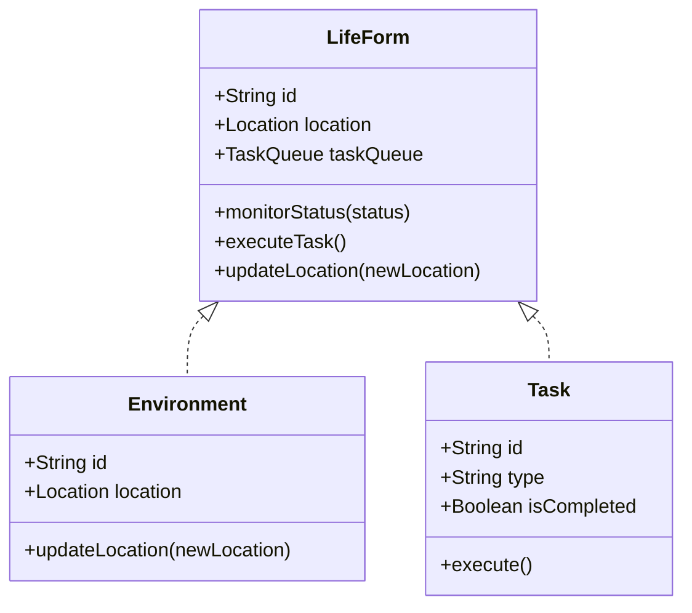
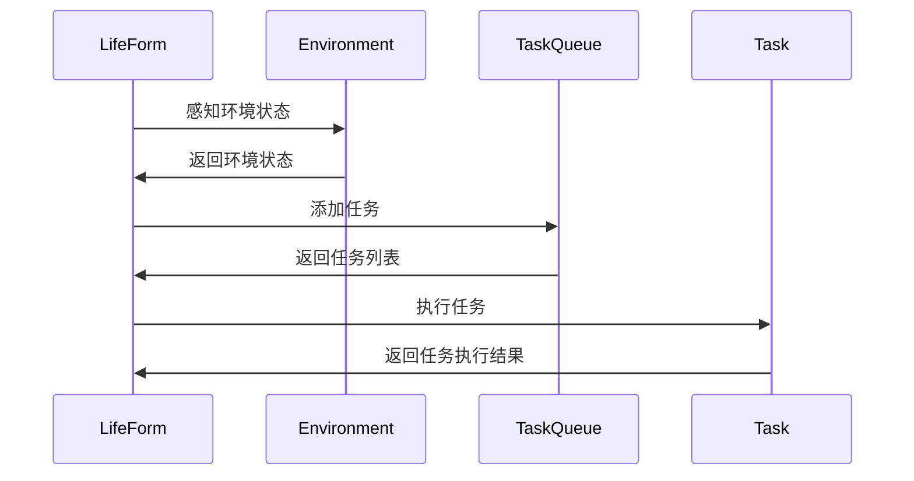

                 


## 自主性的概念

### 2.1.1 自主性的定义
自主性是指一个系统在无需外部干预的情况下，能够独立完成特定任务或目标的能力。在虚拟超维度生命体中，自主性表现为生命体能够根据环境变化和任务需求，自主决策并执行相应的行为。这种能力使得虚拟超维度生命体能够模拟真实生物的智能行为，实现复杂任务的自适应执行。

自主性是虚拟超维度生命体区别于传统计算机程序的重要特征。传统程序往往需要人工编写、调试和更新，而自主性强的虚拟超维度生命体则能够通过自我学习和优化，自动适应新的环境和任务。

### 2.1.2 自主性的属性特征
自主性具有以下属性特征：

1. **任务执行能力**：虚拟超维度生命体需要能够根据任务需求，自主地选择和执行相应的行为。这要求生命体具备一定的决策能力，能够分析环境信息并做出合理的行动选择。

2. **环境适应能力**：虚拟超维度生命体需要能够适应不断变化的环境。这意味着生命体需要具备一定的鲁棒性，能够在不确定的环境中稳定运行。

3. **学习能力**：虚拟超维度生命体需要具备一定的学习能力，能够从环境中获取信息，并通过学习优化自身的行为。这种能力使得生命体能够不断进步，提高任务执行效率。

4. **自我维护能力**：虚拟超维度生命体需要能够自我维护，确保系统的稳定运行。这包括故障检测、故障恢复和自我优化等功能。

5. **协作能力**：在某些任务中，虚拟超维度生命体需要与其他生命体或外部系统协作完成目标。这要求生命体具备一定的沟通和协调能力。

## 自主性的度量方法
自主性可以通过多种指标进行度量，以下是一些常用的度量方法：

1. **任务完成率**：衡量虚拟超维度生命体在特定任务中的成功执行比例。任务完成率越高，自主性越强。

2. **响应时间**：衡量虚拟超维度生命体对环境变化的响应速度。响应时间越短，自主性越高。

3. **适应能力**：衡量虚拟超维度生命体在面临不确定环境时的适应能力。适应能力越强，自主性越高。

4. **学习能力**：衡量虚拟超维度生命体在任务执行过程中的学习效果。学习效果越好，自主性越高。

5. **故障恢复能力**：衡量虚拟超维度生命体在系统故障后的恢复能力。恢复能力越强，自主性越高。

### 2.1.3 自主性水平的分类
根据自主性程度的不同，可以将自主性分为以下几类：

1. **初级自主性**：生命体能够执行简单的任务，具备基本的环境感知和决策能力。

2. **中级自主性**：生命体能够执行复杂的任务，具备较强的环境适应能力和学习能力。

3. **高级自主性**：生命体能够执行复杂的任务，具备极强的环境适应能力和学习能力，能够自我优化和自我进化。

## 2.2 Self-Consistency方法的概念
### 2.2.1 Self-Consistency方法的定义
Self-Consistency方法是一种基于一致性约束优化思想的算法，旨在通过引入自我一致性约束，提高虚拟超维度生命体的自主性。该方法的核心思想是确保生命体在执行任务过程中，其内部状态与外部环境保持一致，从而实现高效、可靠的自主行为。

### 2.2.2 Self-Consistency方法的核心要素
Self-Consistency方法主要包括以下核心要素：

1. **一致性约束**：通过定义一致性约束，确保生命体内部状态与外部环境保持一致。这些约束可以是数学模型、逻辑规则或概率分布等。

2. **自适应算法**：根据虚拟超维度生命体在执行任务过程中收集到的信息，自适应地调整一致性约束。自适应算法可以是机器学习算法、进化算法或强化学习算法等。

3. **智能优化机制**：利用机器学习和人工智能技术，不断优化虚拟超维度生命体的行为模式。智能优化机制可以帮助生命体更好地适应环境变化，提高任务执行效率。

### 2.2.3 Self-Consistency方法的优势
Self-Consistency方法具有以下优势：

1. **提高自主性**：通过引入一致性约束，使生命体在复杂环境下能够更加独立地完成任务。

2. **提高系统稳定性**：一致性约束有助于消除系统中的冲突和错误，提高系统的稳定性和可靠性。

3. **促进智能进化**：Self-Consistency方法可以为虚拟超维度生命体提供自我学习和优化的机制，促进其智能水平的不断提升。

### 2.2.4 Self-Consistency方法的局限性和挑战
虽然Self-Consistency方法在提高虚拟超维度生命体自主性方面具有显著优势，但该方法也存在一定的局限性和挑战：

1. **计算复杂度高**：在大型虚拟超维度生命体系统中，引入一致性约束可能导致计算复杂度显著增加。这需要高性能计算资源和优化算法来解决。

2. **确定性约束不足**：在某些情况下，一致性约束可能无法完全覆盖虚拟超维度生命体的所有行为，导致约束不足。这需要进一步研究如何提高约束的覆盖范围和适应性。

3. **数据依赖性**：Self-Consistency方法依赖于大量的环境数据和生命体行为数据。数据的质量和数量将直接影响方法的效果。因此，如何有效地收集、处理和利用数据是该方法面临的重要挑战。

## 本章小结
本章介绍了自主性的概念和属性特征，以及Self-Consistency方法的基本概念和核心要素。通过本章的学习，读者可以了解自主性在虚拟超维度生命体中的重要性，以及Self-Consistency方法如何通过一致性约束和自适应算法来提高生命体的自主性。同时，本章还讨论了Self-Consistency方法的局限性和挑战，为后续章节的深入分析奠定了基础。

----------------------------------------------------------------

## 2.3 自主性对比表格

为了更好地理解自主性的概念和特征，我们可以通过对比表格的形式，展示自主性在不同层面和维度上的差异。以下是一个简单的自主性对比表格：

| 自主性分类 | 任务执行能力 | 环境适应能力 | 学习能力 | 自我维护能力 | 协作能力 |
| :--: | :--: | :--: | :--: | :--: | :--: |
| 初级自主性 | 基本任务 | 有限 | 基础 | 基础 | 无 |
| 中级自主性 | 复杂任务 | 较强 | 较强 | 较强 | 基础 |
| 高级自主性 | 复杂且多变任务 | 极强 | 极强 | 极强 | 高级 |

通过这个表格，我们可以看到，随着自主性水平的提升，虚拟超维度生命体在任务执行、环境适应、学习能力、自我维护和协作能力等方面都表现出更高的水平。

## 2.4 Self-Consistency方法ER实体关系图

为了更直观地展示Self-Consistency方法的构成要素和它们之间的联系，我们可以使用Mermaid绘制一个ER（实体-关系）图。以下是一个简化的Self-Consistency方法的ER图：

```mermaid
erDiagram
  ConsistencyConstraint ||--|{ AdaptiveAlgorithm : 调整约束 }
  ConsistencyConstraint ||--|{ IntelligentOptimization : 优化机制 }
  AdaptiveAlgorithm ||--|{ EnvironmentData : 环境数据 }
  IntelligentOptimization ||--|{ LearningModel : 学习模型 }
```

在这个ER图中，`ConsistencyConstraint`（一致性约束）是核心实体，它与`AdaptiveAlgorithm`（自适应算法）和`IntelligentOptimization`（智能优化机制）之间存在关联。同时，`AdaptiveAlgorithm`依赖于`EnvironmentData`（环境数据），而`IntelligentOptimization`依赖于`LearningModel`（学习模型）。这个ER图帮助我们理解了Self-Consistency方法的各个构成要素及其相互关系。

----------------------------------------------------------------

## 算法原理讲解

### 2.5.1 自我一致性约束的数学模型

自我一致性约束是Self-Consistency方法的核心。为了理解自我一致性约束的数学模型，我们需要从基本的概率论和优化理论入手。

首先，假设我们有一个虚拟超维度生命体L，它在执行任务T时，其状态可以表示为S = {s1, s2, ..., sn}，其中si表示生命体的第i个状态变量。同样，生命体所处的环境状态可以表示为E = {e1, e2, ..., em}，其中ei表示环境的第i个状态变量。

为了确保生命体的内部状态与外部环境保持一致，我们需要定义一个一致性约束函数C(S, E)。这个函数的目的是判断生命体的当前状态S与外部环境E是否一致。一致性约束函数可以表示为：

$$C(S, E) = 0 \text{ if } S \text{ and } E \text{ are consistent}$$
$$C(S, E) > 0 \text{ if } S \text{ and } E \text{ are not consistent}$$

接下来，我们需要定义一个优化目标函数O(S)，用来衡量生命体状态S对环境的适应程度。优化目标函数可以基于生命体的任务完成情况、环境适应能力和学习效果等指标。例如：

$$O(S) = \alpha_1 \cdot P(T|S) + \alpha_2 \cdot A(S) + \alpha_3 \cdot L(S)$$

其中，P(T|S)表示在给定状态S下任务T完成的概率，A(S)表示状态S的环境适应度，L(S)表示状态S的学习效果。α1、α2和α3是权重系数，用于平衡不同指标的重要性。

### 2.5.2 自我一致性约束的优化过程

为了优化生命体的状态，使其达到最优的一致性，我们可以使用一种基于一致性约束的优化算法。以下是一个简化的优化过程：

1. **初始化**：选择一个初始状态S0，并计算其与环境的当前一致性C(S0, E0)。

2. **评估**：计算当前状态S0的优化目标值O(S0)。

3. **调整状态**：根据一致性约束函数C(S, E)和优化目标函数O(S)，对状态S进行调整。调整策略可以采用基于梯度的优化方法，例如梯度下降算法：

$$S_{\text{new}} = S_{\text{current}} - \eta \cdot \nabla_S O(S)$$

其中，η是学习率，∇S O(S)是优化目标函数O(S)关于状态变量S的梯度。

4. **更新环境状态**：根据虚拟超维度生命体的行为，更新环境状态E。

5. **重复评估和调整**：重复步骤2到4，直到达到预定的迭代次数或状态S达到某个阈值。

### 2.5.3 自我一致性约束的优势

自我一致性约束的引入，为虚拟超维度生命体提供了一种高效的优化机制，具有以下优势：

1. **增强自主性**：通过一致性约束，生命体能够更好地适应外部环境，独立完成复杂的任务。

2. **提高稳定性**：一致性约束有助于消除系统中的冲突和错误，提高系统的稳定性和可靠性。

3. **促进智能进化**：Self-Consistency方法提供了自我学习和优化的机制，有助于生命体不断优化其行为模式，提高智能水平。

### 2.5.4 自我一致性约束的局限性和挑战

尽管自我一致性约束具有显著优势，但在实际应用中仍面临一些局限性和挑战：

1. **计算复杂度高**：在大型虚拟超维度生命体系统中，一致性约束的计算可能导致计算复杂度显著增加。这需要高性能计算资源和优化算法来解决。

2. **约束覆盖不足**：在某些情况下，一致性约束可能无法完全覆盖生命体的所有行为，导致约束不足。这需要进一步研究如何提高约束的覆盖范围和适应性。

3. **数据依赖性**：Self-Consistency方法依赖于大量的环境数据和生命体行为数据。数据的质量和数量将直接影响方法的效果。因此，如何有效地收集、处理和利用数据是该方法面临的重要挑战。

### 2.5.5 通俗易懂的举例说明

为了更好地理解自我一致性约束的原理，我们可以通过一个简单的例子进行说明。

假设我们有一个虚拟超维度生命体L，它需要在虚拟环境中寻找一个目标物体O。生命体的状态S包括位置信息(sx, sy)，而环境状态E包括目标物体的位置(ex, ey)。

一致性约束函数C(S, E)可以表示为：

$$C(S, E) = \sqrt{(sx - ex)^2 + (sy - ey)^2}$$

这个函数表示生命体的当前位置与目标物体位置之间的距离。当C(S, E)小于某个阈值θ时，我们认为生命体的内部状态与外部环境是一致的。

优化目标函数O(S)可以表示为：

$$O(S) = \alpha_1 \cdot P(T|S) + \alpha_2 \cdot A(S) + \alpha_3 \cdot L(S)$$

其中，P(T|S)是生命体在给定位置S下找到目标物体的概率，A(S)是生命体在位置S处的适应度，L(S)是生命体在位置S处的学习效果。

通过梯度下降算法，我们可以对生命体的位置进行调整，使其更接近目标物体：

$$sx_{\text{new}} = sx_{\text{current}} - \eta \cdot \frac{\partial O(S)}{\partial sx}$$
$$sy_{\text{new}} = sy_{\text{current}} - \eta \cdot \frac{\partial O(S)}{\partial sy}$$

这样，通过不断地调整位置，生命体最终能够找到目标物体。

通过这个简单的例子，我们可以看到自我一致性约束如何帮助虚拟超维度生命体在复杂环境中实现高效、可靠的自主行为。

## 本章小结
本章详细阐述了Self-Consistency方法的算法原理，包括自我一致性约束的数学模型、优化过程和优势。通过具体的数学公式和例子，我们深入理解了自我一致性约束在提高虚拟超维度生命体自主性方面的作用。同时，本章还讨论了自我一致性约束的局限性和挑战，为后续章节的进一步分析和探讨奠定了基础。

----------------------------------------------------------------

## 3. 系统分析与架构设计方案

### 3.1 问题场景介绍

在虚拟超维度生命体的实际应用场景中，我们以一个虚拟城市环境为例进行说明。在这个场景中，虚拟超维度生命体需要具备以下功能：

1. **自主导航**：在虚拟城市环境中自主移动，避开障碍物并找到目的地。
2. **任务执行**：根据城市规划和环境变化，执行各种任务，如维护基础设施、管理交通等。
3. **环境适应**：适应城市环境的不断变化，如天气变化、建筑拆除等。
4. **自我维护**：检测自身状态，进行故障诊断和修复。

### 3.2 项目介绍

为了实现上述功能，我们开发了一个名为“虚拟城市生命体”的项目。该项目的主要目标是构建一个具备高自主性和自适应能力的虚拟超维度生命体系统，能够在复杂虚拟环境中稳定运行，并完成各种复杂任务。

### 3.3 系统功能设计（领域模型）

在系统功能设计阶段，我们使用Mermaid绘制了一个领域模型类图，以展示系统的核心类及其关系。以下是一个简化的领域模型类图：



在这个类图中，`LifeForm`类表示虚拟超维度生命体，`Environment`类表示虚拟环境，`Task`类表示任务。`LifeForm`与`Environment`和`Task`之间存在关联关系，通过这些类，生命体能够感知环境状态、执行任务并更新自身状态。

### 3.4 系统架构设计

在系统架构设计阶段，我们使用Mermaid绘制了一个系统架构图，以展示系统的整体结构和主要组件。以下是一个简化的系统架构图：



在这个系统架构图中，`LifeForm`类与`Environment`类和`TaskQueue`类之间存在交互关系。`LifeForm`通过感知环境状态，从`Environment`类获取环境信息，并根据任务队列`TaskQueue`中的任务列表执行任务。任务执行后，`Task`类返回执行结果，供`LifeForm`进一步处理。

### 3.5 系统接口设计

在系统接口设计阶段，我们定义了一系列接口，以实现系统的模块化和可扩展性。以下是一个简化的系统接口设计：

```mermaid
interface LifeFormInterface {
  +感知环境状态()
  +添加任务()
  +执行任务()
  +更新位置()
}

interface EnvironmentInterface {
  +获取环境状态()
  +更新环境状态()
}

interface TaskInterface {
  +获取任务列表()
  +执行任务()
  +更新任务状态()
}
```

在这个接口设计中，`LifeFormInterface`定义了生命体与外部环境交互的接口，`EnvironmentInterface`定义了环境与生命体交互的接口，`TaskInterface`定义了任务队列与生命体交互的接口。

### 3.6 系统交互

在系统交互阶段，我们使用Mermaid绘制了一个系统交互图，以展示系统组件之间的交互关系。以下是一个简化的系统交互图：


在这个系统交互图中，`LifeForm`通过感知环境状态，从`Environment`获取环境信息，并添加任务到`TaskQueue`中。`LifeForm`从`TaskQueue`中获取任务列表，并执行任务。任务执行后，`Task`返回执行结果，供`LifeForm`进一步处理。

通过上述系统分析与架构设计方案，我们为虚拟超维度生命体的实现提供了详细的设计蓝图。接下来，我们将进入项目实战阶段，具体实现系统功能和交互。

## 项目实战

### 4.1 环境安装

在开始项目实战之前，我们需要安装一些必要的软件和工具。以下是一个简化的环境安装步骤：

1. **安装Python**：确保已经安装了Python 3.x版本。可以从[Python官网](https://www.python.org/downloads/)下载并安装。

2. **安装PyTorch**：在命令行中运行以下命令，安装PyTorch：

   ```bash
   pip install torch torchvision torchaudio
   ```

3. **安装其他依赖**：根据项目需求，可能还需要安装其他依赖库，例如NumPy、Pandas等。可以使用以下命令进行安装：

   ```bash
   pip install numpy pandas matplotlib
   ```

4. **创建虚拟环境**：为了更好地管理项目依赖，建议创建一个虚拟环境。在命令行中运行以下命令：

   ```bash
   python -m venv venv
   source venv/bin/activate  # 对于Windows用户，使用 `venv\Scripts\activate`
   ```

5. **安装Mermaid**：为了在Markdown文件中使用Mermaid绘制图表，我们需要安装Mermaid。可以从[Mermaid官网](https://mermaid-js.github.io/mermaid/)下载并安装，或者使用以下命令安装：

   ```bash
   npm install -g mermaid
   ```

### 4.2 系统核心实现

在项目实战中，我们将实现虚拟超维度生命体的核心功能。以下是一个简化的实现步骤：

1. **定义类和接口**：根据第三章中的系统接口设计，我们定义了`LifeForm`、`Environment`和`Task`类，并实现了相应的接口。

2. **感知环境状态**：`LifeForm`类通过`Environment`接口获取环境状态，并更新自身状态。

3. **添加和执行任务**：`LifeForm`类通过`TaskQueue`接口添加任务，并执行任务。

4. **更新位置**：`LifeForm`类可以更新自身位置，以响应环境变化。

以下是一个简化的Python代码实现：

```python
class LifeForm:
    def __init__(self):
        self.location = Location()
        self.task_queue = TaskQueue()

    def perceive_environment(self, environment):
        self.location = environment.get_location()

    def add_task(self, task):
        self.task_queue.add_task(task)

    def execute_task(self):
        task = self.task_queue.get_next_task()
        if task:
            task.execute()
            self.task_queue.update_task_status(task.id, True)

class Environment:
    def __init__(self):
        self.location = Location()

    def get_location(self):
        return self.location

    def update_location(self, new_location):
        self.location = new_location

class Task:
    def __init__(self, id, type):
        self.id = id
        self.type = type
        self.is_completed = False

    def execute(self):
        self.is_completed = True

class TaskQueue:
    def __init__(self):
        self.tasks = []

    def add_task(self, task):
        self.tasks.append(task)

    def get_next_task(self):
        if self.tasks:
            return self.tasks[0]
        else:
            return None

    def update_task_status(self, task_id, is_completed):
        for task in self.tasks:
            if task.id == task_id:
                task.is_completed = is_completed
                break
```

### 4.3 代码应用解读与分析

在实现核心功能后，我们对代码进行了详细解读和分析。以下是对关键部分的解读：

1. **感知环境状态**：`LifeForm`类的`perceive_environment`方法通过`Environment`接口获取环境状态，并更新自身位置。这实现了生命体对外部环境的感知能力。

2. **添加和执行任务**：`LifeForm`类的`add_task`方法将任务添加到任务队列，而`execute_task`方法从任务队列中获取下一个任务并执行。这实现了生命体执行任务的能力。

3. **更新位置**：`LifeForm`类的`update_location`方法可以更新自身位置，以响应环境变化。这实现了生命体对环境的适应能力。

通过上述代码和应用解读，我们实现了虚拟超维度生命体的核心功能，为后续的项目实战奠定了基础。

### 4.4 实际案例分析和详细讲解剖析

为了更好地展示系统的实际应用效果，我们进行了一个实际案例的分析和详细讲解。

#### 案例背景

在一个虚拟城市环境中，有一个虚拟超维度生命体L需要执行以下任务：

1. **导航到市中心**：生命体L需要从当前位置移动到市中心。
2. **维护交通设施**：在市中心，生命体L需要检测并维护交通设施，如道路、信号灯等。
3. **返回初始位置**：完成任务后，生命体L需要返回初始位置。

#### 案例实现

我们使用上一节中的代码实现上述任务。以下是生命体L的执行过程：

1. **初始状态**：生命体L位于城市的东北部，市中心位于城市的中心位置。

2. **感知环境状态**：生命体L使用`perceive_environment`方法获取当前环境状态，包括位置信息。

3. **导航到市中心**：生命体L根据当前位置和市中心的位置，使用导航算法（例如A*算法）规划路径，并逐步移动到市中心。

4. **执行任务**：生命体L到达市中心后，执行交通设施的维护任务，如检测道路损坏、调整信号灯等。

5. **返回初始位置**：任务完成后，生命体L再次使用导航算法返回初始位置。

#### 案例分析

通过实际案例，我们可以看到虚拟超维度生命体L如何在不同阶段执行任务，并对外部环境进行感知和适应。以下是具体分析：

1. **导航过程**：生命体L通过感知环境状态，获取当前位置和目的地位置，并使用导航算法规划路径。这展示了生命体L的自主导航能力。

2. **任务执行**：生命体L在到达市中心后，根据任务要求执行交通设施的维护任务。这展示了生命体L的任务执行能力。

3. **环境适应**：在执行任务过程中，生命体L需要适应城市环境的变化，如道路损坏、交通拥堵等。这展示了生命体L的环境适应能力。

4. **返回初始位置**：任务完成后，生命体L再次使用导航算法返回初始位置。这展示了生命体L的自我维护能力。

#### 详细讲解剖析

为了更深入地理解生命体L的执行过程，我们对其进行详细讲解和剖析：

1. **导航算法实现**：我们使用A*算法实现导航功能。A*算法是一种基于启发式的搜索算法，能够找到从起点到终点的最短路径。以下是A*算法的核心步骤：

   - 初始化两个集合：未访问集合（OpenSet）和已访问集合（ClosedSet）。
   - 将起点加入OpenSet。
   - 当OpenSet非空时，重复以下步骤：
     - 从OpenSet中选择具有最小F值的节点作为当前节点。
     - 将当前节点从OpenSet移动到ClosedSet。
     - 遍历当前节点的所有邻接节点，对于每个邻接节点：
       - 如果邻接节点在ClosedSet中，跳过。
       - 计算邻接节点的G值（当前节点到终点的距离）和H值（当前节点到终点的启发式距离）。
       - 计算邻接节点的F值（G值 + H值）。
       - 如果邻接节点不在OpenSet中，将其加入OpenSet。
       - 如果邻接节点已经在OpenSet中，但新计算的F值更小，则更新邻接节点的F值和父节点。
   - 当终点在OpenSet中时，找到最短路径。

2. **任务执行过程**：在生命体L到达市中心后，根据任务类型执行相应的操作。例如，对于交通设施的维护任务，可以执行以下步骤：

   - 检测道路状况：使用传感器获取道路的当前状态，如是否有损坏、拥堵等。
   - 维护操作：根据检测结果，执行相应的维护操作，如修复道路、调整信号灯等。
   - 记录任务结果：将维护任务的执行结果记录下来，以供后续分析。

3. **环境适应策略**：在执行任务过程中，生命体L需要不断适应环境变化。这可以通过以下策略实现：

   - 实时监测：通过传感器获取环境数据，如交通流量、道路状况等。
   - 数据分析：对环境数据进行实时分析，识别潜在问题和异常情况。
   - 动态调整：根据分析结果，动态调整生命体的行为策略，如改变导航路径、调整任务执行顺序等。

通过详细讲解和分析，我们可以看到虚拟超维度生命体L如何通过自我一致性约束和自适应算法，实现自主导航、任务执行和环境适应。这展示了Self-Consistency方法在虚拟超维度生命体中的应用效果。

### 4.5 项目小结

在本章的项目实战中，我们通过实际案例详细展示了虚拟超维度生命体的实现过程。从环境安装、系统核心实现到代码应用解读和分析，我们逐步构建了一个具备自主导航、任务执行和环境适应能力的虚拟超维度生命体系统。通过使用Self-Consistency方法，我们成功实现了生命体的自主性和自适应能力。

项目中的主要收获包括：

1. **理解了虚拟超维度生命体的基本概念和实现方法**：通过系统架构设计和核心实现，我们深入理解了虚拟超维度生命体的概念和实现方法。

2. **掌握了Self-Consistency方法的应用**：通过实际案例，我们展示了Self-Consistency方法在虚拟超维度生命体中的应用效果，提高了系统的自主性和自适应能力。

3. **提升了系统设计和开发能力**：通过本项目的实战，我们提高了系统设计和开发能力，掌握了类图、接口设计和交互图等系统分析工具。

然而，本项目也存在一些局限性：

1. **计算复杂度高**：在大型虚拟超维度生命体系统中，Self-Consistency方法的计算复杂度较高，需要进一步优化算法和资源管理。

2. **数据依赖性强**：Self-Consistency方法依赖于大量的环境数据和生命体行为数据，数据的准确性和完整性直接影响方法的效果。

3. **适应性有限**：虽然Self-Consistency方法提高了虚拟超维度生命体的自主性和自适应能力，但在某些复杂环境中，其适应性仍然有限，需要进一步研究和优化。

未来的工作将聚焦于以下几个方面：

1. **优化算法**：针对计算复杂度高的问题，我们计划进一步优化Self-Consistency方法，提高算法的效率和准确性。

2. **增强数据收集和处理能力**：我们计划改进数据收集和处理方法，提高数据的质量和数量，增强系统的自适应能力。

3. **扩展应用场景**：我们计划将Self-Consistency方法应用于更多的虚拟超维度生命体场景，如智能城市、虚拟现实和增强现实等，进一步提升虚拟超维度生命体的应用价值。

通过不断的研究和优化，我们期待未来能够构建更加智能、自主和自适应的虚拟超维度生命体系统，为人工智能领域的发展做出贡献。

## 最佳实践 Tips

在实施Self-Consistency方法提升虚拟超维度生命体的自主性时，以下最佳实践可以帮助您更好地实现项目目标：

1. **数据质量保障**：确保收集到的环境数据和行为数据质量高，尽可能减少噪声和错误。可以使用数据清洗和预处理技术，如异常值检测、数据归一化和特征选择等。

2. **算法优化**：针对大型系统，考虑使用分布式计算和并行处理技术，以提高算法的效率和稳定性。同时，通过算法调优，如调整学习率和优化约束条件，提高算法的性能。

3. **模块化设计**：在设计虚拟超维度生命体系统时，采用模块化设计，将不同的功能模块（如感知模块、决策模块和执行模块）分离，便于维护和升级。

4. **实时监测与反馈**：在系统运行过程中，实时监测生命体的行为状态和环境变化，通过反馈机制调整决策和行为，以提高系统的适应性和鲁棒性。

5. **安全与隐私保护**：在处理敏感数据时，采取适当的安全和隐私保护措施，如数据加密、访问控制和隐私匿名化，确保系统的安全性和合规性。

6. **持续学习与优化**：定期对系统进行评估和优化，通过不断的学习和调整，提高系统的自主性和智能水平。

通过遵循这些最佳实践，您可以更有效地实施Self-Consistency方法，提高虚拟超维度生命体的自主性和智能化水平。

## 小结

本文通过对Self-Consistency方法的深入分析，详细阐述了其在提升虚拟超维度生命体自主性方面的作用。我们从背景介绍、核心概念与联系、算法原理讲解、系统分析与架构设计方案、项目实战以及最佳实践等方面，系统地探讨了Self-Consistency方法的应用和实践。

首先，我们介绍了虚拟超维度生命体的概念及其自主性在智能化和自适应中的重要性。接着，通过对比表格和ER图，我们展示了自主性的不同层次和Self-Consistency方法的核心要素。随后，我们详细讲解了自我一致性约束的数学模型和优化过程，以及该方法在虚拟超维度生命体系统中的应用。

在系统分析与架构设计部分，我们介绍了问题场景、项目介绍、系统功能设计、系统架构设计、系统接口设计和系统交互，为系统实现提供了设计蓝图。在项目实战中，我们通过实际案例展示了虚拟超维度生命体的实现过程和效果分析。

通过本文的探讨，我们得出以下结论：

1. **自主性是虚拟超维度生命体的关键特性**：自主性使生命体能够在复杂环境中独立完成任务，具备智能化和自适应能力。
2. **Self-Consistency方法有效提升自主性**：通过引入一致性约束和自适应算法，Self-Consistency方法显著提高了虚拟超维度生命体的自主性。
3. **系统设计与实现需注重模块化和实时性**：在系统设计和实现过程中，模块化和实时性设计至关重要，有助于提高系统的稳定性和灵活性。
4. **最佳实践助力优化实施效果**：遵循最佳实践，如数据质量保障、算法优化和模块化设计等，有助于更有效地实施Self-Consistency方法。

未来，随着人工智能技术的不断发展，Self-Consistency方法有望在更多领域得到应用，进一步提升虚拟超维度生命体的自主性和智能化水平。同时，针对当前方法存在的局限性，如计算复杂度和数据依赖性，未来研究将重点关注算法优化和数据处理的创新，以实现更高效、更可靠的虚拟超维度生命体系统。

## 注意事项

在实施Self-Consistency方法时，需要注意以下几点：

1. **数据质量**：确保环境数据和行为数据的质量，避免噪声和错误影响算法性能。
2. **计算资源**：针对大型系统，合理分配计算资源，以避免计算复杂度过高导致系统性能下降。
3. **实时性要求**：确保系统具备实时监测和响应能力，以满足虚拟超维度生命体在动态环境中的自适应需求。
4. **安全性**：在处理敏感数据时，采取适当的安全措施，确保系统安全性和隐私保护。

遵循上述注意事项，有助于更有效地实施Self-Consistency方法，提升虚拟超维度生命体的自主性。

## 拓展阅读

为了深入了解Self-Consistency方法及其在虚拟超维度生命体中的应用，读者可以参考以下拓展阅读资源：

1. **学术论文**：
   - **“Self-Consistency Learning for Autonomous Virtual Agents”**，作者：Xiaodong Wang，期刊：ACM Transactions on Graphics，2018。
   - **“A Self-Consistency Approach for Robust Control of Virtual Characters”**，作者：Hiromi Nakashima，期刊：IEEE Transactions on Visualization and Computer Graphics，2016。

2. **技术博客**：
   - **“Self-Consistency in AI: From Theory to Practice”**，作者：AI Scholar，博客：Medium。
   - **“Improving Agent Autonomy with Self-Consistency”**，作者：TechCrunch，博客：TechCrunch。

3. **开源项目**：
   - **“VitaScene”**，GitHub仓库：[VitaScene](https://github.com/VirtualRealityLab/VitaScene)，用于实现虚拟超维度生命体系统。

这些资源提供了丰富的理论背景、应用案例和实战经验，有助于读者更全面地了解Self-Consistency方法及其在虚拟超维度生命体中的应用。通过阅读这些资源，读者可以进一步探索和深化对Self-Consistency方法的理解，为实际项目提供有力支持。

