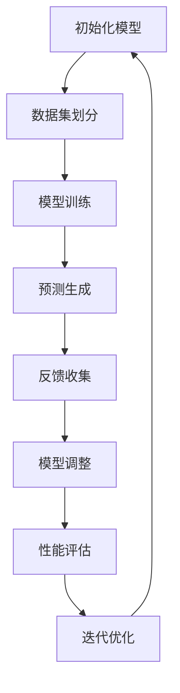
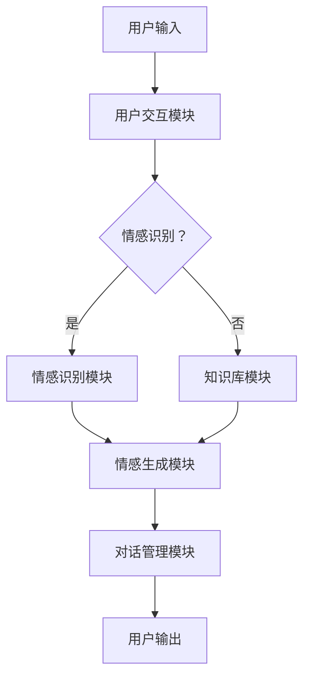
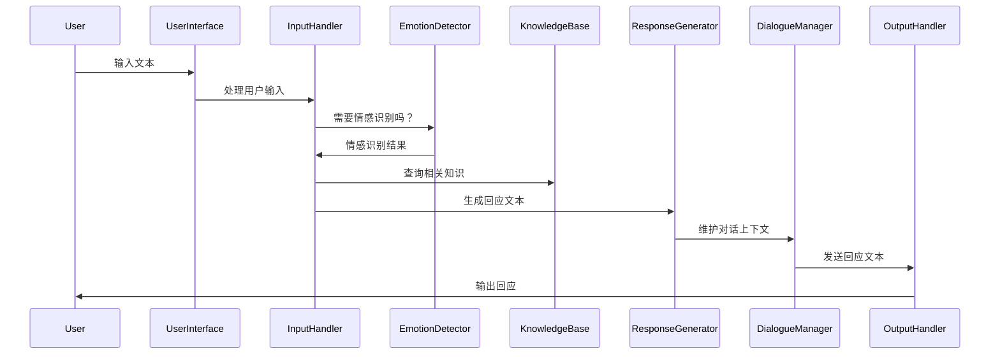

                 


### 1.1 问题背景

#### 1.1.1 AI虚拟助手现状

在当今科技飞速发展的时代，人工智能（AI）技术已经成为推动社会进步的重要力量。AI虚拟助手作为人工智能的一个重要应用领域，已经渗透到我们生活的方方面面。从智能手机的语音助手，到智能音箱的交互体验，再到企业级的客户服务机器人，AI虚拟助手正逐步改变我们的生活方式和工作模式。

目前，AI虚拟助手的主要功能集中在任务执行和基础问答上，如日历管理、提醒设置、天气查询、路况导航、简单对话等。然而，随着用户需求的不断提升，尤其是对于情感交流的需求日益增长，AI虚拟助手的情感智能成为了一个亟待解决的课题。

#### 1.1.2 情感智能的重要性

情感智能是指机器在理解和处理情感方面所表现出的智能能力。对于AI虚拟助手而言，情感智能的重要性主要体现在以下几个方面：

1. **提升用户体验**：情感智能可以帮助虚拟助手更好地理解用户的需求和情绪，从而提供更个性化和贴心的服务。
2. **增强交互自然性**：通过情感智能，虚拟助手可以模拟人类的情感反应，使对话更加自然流畅，提升用户的互动体验。
3. **优化问题解决效率**：情感智能可以帮助虚拟助手更好地识别用户的情感状态，从而更快速准确地解决用户的问题，提高服务效率。
4. **减少用户反感**：缺乏情感智能的虚拟助手容易让用户感到冷漠和机械化，而情感智能可以有效减少用户的反感情绪，提高用户满意度。

#### 1.1.3 Self-Consistency方法简介

Self-Consistency方法是一种基于自校准和反馈循环的机器学习技术，旨在提高AI模型在处理复杂任务时的表现。该方法通过不断地自我校准和优化，使得模型能够更好地适应新的环境和数据。

在AI虚拟助手的情感智能提升方面，Self-Consistency方法具有以下几个关键特点：

1. **自适应能力**：Self-Consistency方法能够根据用户反馈和情境变化，自动调整模型参数，使其在处理不同类型的情感交互时更加准确。
2. **交互式学习**：通过用户与虚拟助手的实时交互，Self-Consistency方法可以不断地学习和优化，从而提高情感识别和生成的准确性。
3. **高效性**：Self-Consistency方法通过反馈循环和自校准，能够在较短的时间内实现模型性能的提升。

总的来说，Self-Consistency方法为AI虚拟助手情感智能的提升提供了一种有效且可行的方法。接下来，我们将进一步探讨Self-Consistency方法的原理和应用，帮助读者深入理解并掌握这一技术。

### 1.2 问题描述

#### 1.2.1 当前挑战

尽管AI虚拟助手在任务执行和基础问答方面取得了显著的进步，但在情感智能方面仍面临诸多挑战：

1. **情感识别不准确**：当前大多数虚拟助手无法准确识别用户的情感状态，导致对话体验不佳。例如，当用户表达情绪时，虚拟助手可能无法正确理解用户的情绪，从而无法提供适当的回应。
2. **情感生成受限**：虚拟助手在情感生成方面存在限制，无法模拟出丰富的情感反应，使得交互显得单调、机械化。
3. **跨情境适应性差**：虚拟助手在处理不同情境下的情感交互时，表现不一致，缺乏跨情境的适应性。
4. **用户反馈处理不足**：虚拟助手通常无法有效地处理用户的反馈，导致情感智能无法持续提升。

这些挑战不仅影响了虚拟助手与用户的互动体验，还限制了其在更多场景下的应用潜力。

#### 1.2.2 Self-Consistency方法的应用潜力

Self-Consistency方法在应对上述挑战方面展现出巨大的应用潜力：

1. **提高情感识别准确率**：通过自校准机制，Self-Consistency方法能够提高虚拟助手识别用户情感状态的能力，使其更准确地理解用户的情绪。
2. **丰富情感生成能力**：Self-Consistency方法通过反馈循环，可以不断优化情感生成模型，使其能够生成更多样化的情感反应，提升交互的自然性和丰富性。
3. **增强跨情境适应性**：Self-Consistency方法通过自适应学习机制，使虚拟助手在不同情境下都能保持良好的情感智能表现，提高其跨情境适应性。
4. **有效处理用户反馈**：通过不断收集和分析用户反馈，Self-Consistency方法能够更好地理解和回应用户的情感需求，从而实现情感智能的持续提升。

总的来说，Self-Consistency方法为解决AI虚拟助手情感智能面临的挑战提供了一条新的思路和解决方案。接下来，我们将详细探讨Self-Consistency方法的原理，帮助读者理解其如何运作和如何应用于虚拟助手的情感智能提升。

#### 1.2.3 书籍目的和读者对象

本书旨在深入探讨Self-Consistency方法在提升AI虚拟助手情感智能方面的应用，为开发者和技术人员提供一套完整的技术解决方案。通过系统的讲解和实践指导，本书帮助读者：

1. **理解Self-Consistency方法的原理**：本书首先介绍Self-Consistency方法的基本概念和原理，帮助读者建立对该方法的基础理解。
2. **掌握Self-Consistency方法的应用**：本书通过详细的步骤和案例分析，展示Self-Consistency方法在虚拟助手情感智能提升中的应用，帮助读者将理论知识转化为实际操作。
3. **实现AI虚拟助手的情感智能**：本书提供了一系列实战项目和代码示例，指导读者如何实际应用Self-Consistency方法，开发出具备高情感智能的虚拟助手。

本书适合以下读者群体：

1. **AI技术开发人员**：具备一定机器学习和自然语言处理基础的开发者，希望通过学习Self-Consistency方法提升虚拟助手情感智能。
2. **数据科学家**：对人工智能技术有浓厚兴趣，希望将Self-Consistency方法应用于情感分析的科研人员。
3. **产品经理**：负责虚拟助手产品开发，希望提升产品情感智能能力的专业人员。
4. **学生和研究者**：对人工智能和自然语言处理有兴趣的在校学生和研究人员，希望通过本书深入探讨相关技术。

通过阅读本书，读者不仅可以掌握Self-Consistency方法的理论知识，还能通过实践项目提高实际操作能力，为AI虚拟助手的发展贡献自己的力量。

### 1.3 问题解决

#### 1.3.1 Self-Consistency方法原理

Self-Consistency方法的核心思想是通过自我校准和反馈循环来提高机器学习模型的性能。该方法的基本原理可以概括为以下几个步骤：

1. **初始化**：首先，选择一个初始模型，并在训练数据集上进行初始化训练。
2. **预测**：使用训练好的初始模型对未知数据进行预测，得到预测结果。
3. **反馈**：将预测结果与真实结果进行比较，得到反馈信息。
4. **调整**：根据反馈信息，调整模型参数，使模型能够更准确地预测。
5. **迭代**：重复上述步骤，不断进行模型训练和调整，直到模型达到预期性能。

通过这样的循环过程，模型能够逐步优化，提高其在处理复杂任务时的准确性和适应性。

#### 1.3.2 Self-Consistency方法的优势

Self-Consistency方法在提升AI虚拟助手情感智能方面具有以下几个显著优势：

1. **自适应能力**：Self-Consistency方法能够根据用户反馈和情境变化，自动调整模型参数，使其在处理不同类型的情感交互时更加准确和适应。
2. **交互式学习**：通过用户与虚拟助手的实时交互，Self-Consistency方法可以不断地学习和优化，从而提高情感识别和生成的准确性。
3. **高效性**：Self-Consistency方法通过反馈循环和自校准，能够在较短的时间内实现模型性能的提升，节省了大量的时间和计算资源。
4. **鲁棒性**：Self-Consistency方法能够有效应对数据噪声和不确定性，提高模型在现实场景中的鲁棒性和稳定性。

总的来说，Self-Consistency方法为AI虚拟助手情感智能的提升提供了一条有效且高效的路径，使其能够更好地满足用户的需求，提升用户体验。

#### 1.3.3 实施步骤

要实现Self-Consistency方法在AI虚拟助手情感智能提升中的应用，可以按照以下步骤进行：

1. **数据收集**：首先，需要收集大量的情感交互数据，包括用户的语音、文本、面部表情等。这些数据将作为模型训练和优化的基础。
2. **特征提取**：对收集到的数据进行分析，提取出与情感相关的特征，如语音的音调、语速、文本的情感极性等。
3. **模型训练**：使用提取出的特征，训练一个初始的机器学习模型，如情感分类器或生成模型。
4. **模型评估**：使用测试数据集对训练好的模型进行评估，评估其情感识别或生成的准确性。
5. **反馈收集**：在实际应用中，通过用户与虚拟助手的交互，收集用户对模型表现的反馈。
6. **模型调整**：根据用户反馈，调整模型参数，优化模型性能。
7. **迭代优化**：重复步骤4到6，不断进行模型评估和调整，直到模型达到满意的性能水平。

通过以上步骤，可以实现Self-Consistency方法在AI虚拟助手情感智能提升中的应用，从而提升虚拟助手的用户体验和交互效果。

### 1.4 边界与外延

#### 1.4.1 Self-Consistency方法的适用范围

Self-Consistency方法在AI虚拟助手情感智能提升中的应用具有广泛的适用范围。以下是该方法的一些主要适用场景：

1. **虚拟客服**：虚拟客服作为AI虚拟助手的一种常见应用，需要在情感交互中准确识别和生成情感，以提高用户满意度和交互体验。
2. **智能聊天机器人**：智能聊天机器人需要具备丰富的情感交互能力，以便与用户进行自然流畅的对话，提供个性化服务。
3. **智能助手**：智能助手，如智能家居系统的语音控制助手，需要在与用户互动中理解用户的情感需求，从而更好地满足用户的日常需求。
4. **教育机器人**：教育机器人需要具备情感智能，以便更好地与学习者互动，提高学习效果和用户满意度。

总的来说，Self-Consistency方法在各种需要情感智能的AI虚拟助手应用中都具有显著的适用性。

#### 1.4.2 非适用场景

尽管Self-Consistency方法在情感智能提升方面具有广泛的应用潜力，但仍存在一些非适用场景：

1. **低交互性任务**：对于那些用户与系统交互较少或不需要情感交互的任务，如数据检索、自动化流程管理等，Self-Consistency方法的应用效果可能有限。
2. **强实时性要求**：在需要高实时响应的任务中，如自动驾驶车辆系统，Self-Consistency方法可能无法满足实时性要求，需要考虑其他更适合的算法。
3. **高度不确定性环境**：在高度不确定和复杂的动态环境中，如某些高级机器人任务，Self-Consistency方法的稳定性和可靠性可能受到挑战，需要结合其他技术进行优化。

总的来说，对于某些特定的非适用场景，需要根据具体需求和任务特点选择其他更适合的技术和方法。

#### 1.4.3 关联技术的概述

在AI虚拟助手情感智能提升的过程中，除了Self-Consistency方法，还有一些相关的技术值得关注：

1. **情感计算**：情感计算是一种研究如何让计算机理解和处理人类情感的技术。通过情感计算，虚拟助手可以更准确地识别用户的情感状态，提高情感交互的准确性。
2. **深度学习**：深度学习是机器学习的一个重要分支，通过构建复杂的神经网络模型，深度学习可以自动提取特征并实现高精度的情感识别和生成。
3. **强化学习**：强化学习是一种通过试错和反馈来优化决策过程的方法。在虚拟助手情感智能提升中，强化学习可以通过不断的交互学习和优化，提高情感交互的质量。
4. **自然语言处理**：自然语言处理（NLP）是使计算机能够理解和处理人类语言的技术。在虚拟助手情感智能提升中，NLP技术可以帮助虚拟助手更好地理解用户的需求和情感。
5. **多模态融合**：多模态融合是一种结合多种传感器数据（如语音、文本、图像等）的方法，通过多模态数据融合，虚拟助手可以更全面地理解用户的情感状态，提高情感交互的准确性。

这些关联技术共同构成了AI虚拟助手情感智能提升的生态系统，相互补充，共同推动虚拟助手情感智能的发展。

### 1.5 概念结构与核心要素组成

#### 1.5.1 Self-Consistency方法核心概念

Self-Consistency方法的核心概念可以概括为以下几个方面：

1. **自校准**：自校准是指模型通过不断地自我调整，使其预测结果与真实结果保持一致的过程。自校准的目标是提高模型的准确性和适应性。
2. **反馈循环**：反馈循环是指模型通过实时收集用户反馈，并将其用于模型调整的过程。反馈循环的目标是优化模型性能，使其更好地满足用户需求。
3. **自适应学习**：自适应学习是指模型在遇到新的数据和情境时，能够自动调整和学习，以提高其在新环境下的表现。自适应学习的目标是提高模型的灵活性和泛化能力。
4. **交互式学习**：交互式学习是指模型通过与用户的实时交互，不断学习和优化，以提高其在实际应用中的性能。交互式学习的目标是提升用户体验和交互效果。

#### 1.5.2 Self-Consistency方法主要步骤

Self-Consistency方法的主要步骤可以分为以下几个阶段：

1. **初始化**：选择一个初始模型，并在训练数据集上进行初始化训练。初始化阶段的目的是为后续的自校准和反馈循环提供基础。
2. **预测**：使用初始化模型对未知数据进行预测，得到预测结果。预测阶段的目的是评估模型的初始性能。
3. **反馈**：收集用户对预测结果的反馈信息，包括用户满意度、情感状态等。反馈阶段的目的是为模型的调整提供依据。
4. **调整**：根据反馈信息，调整模型参数，使模型能够更准确地预测。调整阶段的目的是提高模型的准确性和适应性。
5. **迭代**：重复预测、反馈和调整的过程，直到模型达到满意的性能水平。迭代阶段的目的是不断优化模型性能。

#### 1.5.3 关键技术概述

在Self-Consistency方法中，以下几个关键技术起着关键作用：

1. **预测技术**：预测技术是Self-Consistency方法的核心，通过构建复杂的机器学习模型，实现对用户情感状态的准确预测。
2. **反馈技术**：反馈技术是Self-Consistency方法的优化手段，通过实时收集用户反馈，为模型的调整提供依据。
3. **调整技术**：调整技术是Self-Consistency方法的关键，通过参数调整，使模型能够更好地适应新的数据和情境。
4. **自适应学习技术**：自适应学习技术是Self-Consistency方法的重要特性，通过不断地学习和优化，提高模型在复杂环境中的表现。
5. **交互式学习技术**：交互式学习技术是Self-Consistency方法的优势，通过用户与模型的实时交互，实现模型的不断优化和提升。

通过以上核心概念、主要步骤和关键技术的阐述，我们能够更好地理解Self-Consistency方法的原理和应用，为AI虚拟助手情感智能的提升提供了坚实的理论基础和实践指导。

### 2.1 Self-Consistency方法原理

#### 2.1.1 自一致性算法基础

Self-Consistency方法的基础是自校准（Self-Calibration）和一致性校验（Consistency Verification）。自校准是指模型通过不断调整自身的预测结果，使其与真实结果保持一致。一致性校验则是通过比较模型在不同条件下的预测结果，验证其一致性。这两个核心机制共同作用，确保模型在复杂和动态的环境中保持高准确性和鲁棒性。

首先，自校准的过程可以从以下几个步骤来理解：

1. **初始化**：选择一个初始模型，并在训练数据集上进行初始化训练。这一步的目的是为后续的自校准和反馈循环提供基础。
2. **预测**：使用训练好的初始模型对未知数据进行预测，得到预测结果。这一步的目的是评估模型的初始性能。
3. **反馈**：收集用户对预测结果的反馈信息，包括用户满意度、情感状态等。这一步的目的是为模型的调整提供依据。
4. **调整**：根据反馈信息，调整模型参数，使模型能够更准确地预测。这一步的目的是提高模型的准确性和适应性。
5. **迭代**：重复预测、反馈和调整的过程，直到模型达到满意的性能水平。这一步的目的是不断优化模型性能。

其次，一致性校验的过程同样关键：

1. **多条件测试**：在不同条件下（如不同的数据集、不同的情境等）对模型进行预测，得到多个预测结果。
2. **一致性验证**：比较这些预测结果，验证其一致性。例如，如果模型在不同条件下的预测结果高度一致，说明模型具有良好的一致性。
3. **调整校验结果**：根据一致性验证的结果，对模型进行调整，以消除不一致性。

通过自校准和一致性校验，Self-Consistency方法能够确保模型在复杂和动态的环境中保持一致性和准确性。具体来说，自校准帮助模型根据用户反馈调整预测，使其更贴近真实结果；而一致性校验则确保模型在不同条件下的一致性，避免因数据噪声或模型过拟合导致的不一致问题。

总的来说，Self-Consistency方法通过自校准和一致性校验，实现了一种动态和自适应的学习机制，使其能够应对复杂的情感交互任务，提高模型的鲁棒性和准确性。

#### 2.1.2 自一致性算法特点

Self-Consistency方法具有以下几个显著特点，使其在提升AI虚拟助手情感智能方面具备独特的优势：

1. **自适应性**：Self-Consistency方法能够根据用户反馈和情境变化，自动调整模型参数，使其在处理不同类型的情感交互时更加准确和适应。这种自适应能力使得虚拟助手能够更好地满足用户的个性化需求，提供更优质的交互体验。
   
2. **交互式学习**：通过用户与虚拟助手的实时交互，Self-Consistency方法可以不断地学习和优化，从而提高情感识别和生成的准确性。交互式学习机制使得虚拟助手能够从每次交互中吸取经验，持续提升自身的能力，而不是仅仅依赖初始训练数据。

3. **高鲁棒性**：Self-Consistency方法通过一致性校验，确保模型在不同条件下的一致性，避免因数据噪声或模型过拟合导致的不一致问题。这种高鲁棒性使得虚拟助手能够在复杂和动态的环境中保持稳定的表现，减少错误预测的概率。

4. **快速收敛**：Self-Consistency方法通过自校准和反馈循环，能够在较短的时间内实现模型性能的提升，节省了大量的时间和计算资源。快速收敛特性使得虚拟助手能够迅速适应新的环境和数据，提高工作效率。

5. **数据效率**：Self-Consistency方法不需要大量的数据训练，它可以通过少量的反馈信息快速调整模型参数，提高预测准确性。这种数据效率特性使得虚拟助手可以在数据稀缺的情况下仍然表现出良好的性能。

总的来说，Self-Consistency方法通过自适应、交互式学习、高鲁棒性、快速收敛和数据效率等优势，为AI虚拟助手情感智能的提升提供了一种高效、可靠的技术手段。这些特点使得Self-Consistency方法在应对情感智能提升的挑战时具有明显的优势，能够显著提升虚拟助手的用户体验和交互效果。

#### 2.1.3 自一致性算法与其他方法对比

Self-Consistency方法在提升AI虚拟助手情感智能方面具有独特的优势，但它并不是唯一的选择。为了更全面地理解Self-Consistency方法的优势，我们需要将其与几种常见的机器学习和情感计算方法进行比较。

1. **传统机器学习方法**：传统机器学习方法（如SVM、随机森林等）通常依赖于大量的标注数据进行训练，且在处理复杂任务时表现有限。Self-Consistency方法通过自校准和反馈循环，能够在较少的数据下实现高准确性，且具有更强的自适应能力。相比之下，传统方法在面对数据稀缺或动态变化时，往往难以保持稳定的表现。

2. **基于规则的系统**：基于规则的系统（Rule-Based Systems）通过预设的规则来处理情感交互，虽然能够实现简单的情感识别和生成，但灵活性较差，无法应对复杂的情境变化。Self-Consistency方法通过机器学习和自适应调整，能够动态地适应不同的情感交互需求，提供更自然和贴心的交互体验。

3. **强化学习方法**：强化学习（Reinforcement Learning，RL）通过试错和奖励机制来优化模型性能，但在处理情感交互时，RL方法往往需要大量的交互数据，且在复杂环境中容易陷入局部最优。Self-Consistency方法通过反馈循环和一致性校验，能够在较少的交互数据下快速提升模型性能，且具有较强的鲁棒性，不易陷入局部最优。

4. **情感计算方法**：情感计算（Affective Computing）是一种专门研究如何让计算机理解和处理人类情感的方法。传统的情感计算方法通常依赖情感标签或情感词典，但存在准确性和泛化能力不足的问题。Self-Consistency方法通过自校准和反馈循环，能够更准确地识别和生成情感，同时具有更强的自适应能力和数据效率。

总的来说，Self-Consistency方法在提升AI虚拟助手情感智能方面具有以下优势：

- **数据效率**：能够在较少的数据下实现高准确性，适合数据稀缺的场景。
- **自适应能力**：能够根据用户反馈和情境变化，动态调整模型参数，提供个性化的交互体验。
- **鲁棒性**：通过一致性校验，能够避免因数据噪声或模型过拟合导致的不一致问题。
- **快速收敛**：通过自校准和反馈循环，能够在较短的时间内实现模型性能的提升。

这些优势使得Self-Consistency方法在应对情感智能提升的挑战时具有明显的优势，能够显著提升虚拟助手的用户体验和交互效果。

#### 2.2 Self-Consistency方法应用场景

Self-Consistency方法在AI虚拟助手情感智能提升中的应用场景十分广泛，以下是一些具体的应用案例：

1. **虚拟客服**：在虚拟客服领域，Self-Consistency方法可以显著提升客服机器人对用户情感的理解和回应能力。例如，当用户表达愤怒或沮丧的情感时，虚拟客服可以更准确地识别用户的情绪，并采取适当的策略（如提供安慰、解决问题等），从而提高用户满意度。

2. **智能聊天机器人**：智能聊天机器人需要具备丰富的情感交互能力，以便与用户进行自然流畅的对话。通过Self-Consistency方法，聊天机器人可以不断地学习和优化，使其在处理情感交互时更加准确和自然。例如，当用户表达复杂的情感（如焦虑、兴奋、悲伤等）时，聊天机器人可以准确地识别并生成适当的情感回应，提供更加个性化的服务。

3. **智能助手**：智能助手，如智能家居系统的语音控制助手，需要在与用户互动中理解用户的情感需求。Self-Consistency方法可以帮助智能助手更好地识别用户的情感状态，从而提供更加个性化的服务。例如，当用户表达想要放松的需求时，智能助手可以推荐相应的音乐或放松活动，提高用户的生活质量。

4. **教育机器人**：在教育机器人领域，Self-Consistency方法可以帮助机器人更好地理解学生的学习情感状态，从而提供更有效的学习支持。例如，当学生表现出焦虑或沮丧的情感时，教育机器人可以提供心理辅导或学习建议，帮助学生克服困难，提高学习效果。

5. **医疗健康助手**：在医疗健康领域，Self-Consistency方法可以帮助健康助手更好地理解患者的情感状态，提供个性化的健康建议和情感支持。例如，当患者表达疼痛或不适的情感时，健康助手可以提供相应的缓解建议或心理支持，提高患者的康复体验。

总的来说，Self-Consistency方法在多种需要情感智能的AI虚拟助手应用场景中都具有显著的优势，能够有效提升虚拟助手的情感交互能力，提供更个性化、更贴心的服务。

#### 2.2.1 情感分析

情感分析（Sentiment Analysis）是自然语言处理（NLP）中的一个重要研究方向，旨在从文本中识别和提取情感极性（如正面、负面、中性）以及更细微的情感变化。在AI虚拟助手情感智能提升中，情感分析扮演着关键角色，因为它能够帮助虚拟助手理解用户的情绪状态，从而做出更恰当的回应。

1. **基本概念**：
   - **情感极性**：情感极性是指文本表达的情感倾向，通常分为正面、负面和中性三个类别。
   - **情感强度**：情感强度是指情感极性的强度，如“喜欢”和“非常喜欢”虽然都是正面情感，但强度不同。
   - **情感分类**：情感分类是指将文本中的情感标注为不同的类别，如喜悦、愤怒、悲伤等。

2. **技术方法**：
   - **基于规则的方法**：通过预设的规则和词典，对文本进行情感分类。这种方法简单但效果有限。
   - **机器学习方法**：利用机器学习模型（如朴素贝叶斯、支持向量机、神经网络等）进行情感分类。这种方法能够处理更复杂的文本情感，提高分类准确性。

3. **应用场景**：
   - **社交媒体分析**：通过情感分析，可以了解用户对品牌、产品或事件的情感倾向，为企业提供市场洞察。
   - **舆情监测**：实时监测社交媒体、新闻等渠道的情感倾向，帮助政府和企业应对突发事件。
   - **虚拟助手**：通过情感分析，虚拟助手可以更准确地识别用户的情感状态，提供个性化的服务。

4. **挑战与解决方案**：
   - **多模态情感分析**：如何结合文本、语音、图像等多模态信息，提高情感分析的准确性。
   - **情感强度识别**：如何更精细地识别情感强度，提供更加精准的情感反馈。

通过情感分析，AI虚拟助手能够更好地理解用户的情感需求，从而提升交互体验和满意度。

#### 2.2.2 情感识别

情感识别（Affective Recognition）是AI虚拟助手情感智能提升的关键技术之一，旨在通过分析用户的语音、文本、面部表情等数据，识别并理解用户的情感状态。以下是情感识别的基本概念、技术方法以及应用场景：

1. **基本概念**：
   - **情感识别**：情感识别是指从用户产生的数据（如语音、文本、面部表情等）中识别并提取情感状态。
   - **情感维度**：情感维度包括愉悦度、兴奋度、愤怒度、悲伤度等，每个维度代表用户情感的某一方面。

2. **技术方法**：
   - **语音情感识别**：通过分析语音的音调、语速、音量等特征，识别用户的情感状态。常用的方法包括时频分析、语音特征提取、支持向量机（SVM）等。
   - **文本情感识别**：通过分析文本的词频、词义、语法结构等，识别用户的情感状态。常用的方法包括基于词典的方法、机器学习分类器、深度学习模型（如卷积神经网络CNN、递归神经网络RNN等）。
   - **面部表情识别**：通过分析用户的面部图像或视频，识别用户的情感状态。常用的方法包括面部特征点检测、面部表情编码、机器学习分类器。

3. **应用场景**：
   - **虚拟客服**：通过情感识别，虚拟客服可以更准确地理解用户的情绪，提供更有针对性的服务。
   - **智能聊天机器人**：通过情感识别，智能聊天机器人可以生成更加自然和贴心的情感回应，提升用户体验。
   - **心理健康应用**：通过情感识别，心理健康应用可以监测用户的情感状态，提供情感支持和建议。
   - **教育领域**：通过情感识别，教育机器人可以了解学生的学习情感状态，提供个性化的学习支持。

4. **挑战与解决方案**：
   - **跨情境适应性**：不同情境下的情感识别准确性可能不同，如何提高模型在不同情境下的适应性是一个挑战。解决方法包括多情境数据训练、模型迁移学习等。
   - **情感细微差别**：情感之间存在细微差别，如何精确地识别和区分这些情感是一个挑战。解决方法包括更复杂的特征提取、更精细的情感分类模型等。

通过情感识别，AI虚拟助手能够更好地理解用户的情感需求，提供更加个性化的服务，提升用户体验。

#### 2.2.3 情感生成

情感生成（Affective Generation）是AI虚拟助手情感智能的重要组成部分，旨在通过模型生成情感回应，使虚拟助手在与用户互动时能够表现出丰富的情感。以下是情感生成的基本概念、技术方法以及应用场景：

1. **基本概念**：
   - **情感生成**：情感生成是指利用机器学习模型生成情感回应，使虚拟助手能够表现出相应的情感。
   - **情感维度**：情感维度包括愉悦度、兴奋度、愤怒度、悲伤度等，每个维度代表虚拟助手情感的不同方面。

2. **技术方法**：
   - **基于规则的方法**：通过预设的情感回应规则，生成情感回应。这种方法简单但灵活性较低，难以适应复杂的情感交互。
   - **机器学习方法**：利用机器学习模型（如生成对抗网络GAN、变分自编码器VAE等）生成情感回应。这些方法能够生成更丰富的情感，提升交互的自然性。
   - **深度学习方法**：利用深度学习模型（如卷积神经网络CNN、递归神经网络RNN等）进行情感生成。深度学习方法能够处理复杂的情感特征，生成更符合用户需求的情感回应。

3. **应用场景**：
   - **虚拟客服**：通过情感生成，虚拟客服可以生成更自然、贴心的情感回应，提高用户满意度。
   - **智能聊天机器人**：通过情感生成，智能聊天机器人可以生成丰富的情感回应，使对话更加自然流畅。
   - **教育机器人**：通过情感生成，教育机器人可以生成鼓励、安慰等情感回应，提高学生的学习积极性和参与度。
   - **医疗健康助手**：通过情感生成，医疗健康助手可以生成关怀、支持等情感回应，帮助患者缓解心理压力。

4. **挑战与解决方案**：
   - **情感多样性**：如何生成多样化的情感回应，满足不同用户的需求是一个挑战。解决方法包括多模态情感数据训练、情感融合策略等。
   - **情感一致性**：如何保证生成的情感回应与用户情感状态一致是一个挑战。解决方法包括情感一致性校验、情感反馈机制等。

通过情感生成，AI虚拟助手能够更好地模拟人类的情感交互，提供更加自然和丰富的交互体验，提升用户的整体满意度。

#### 2.3.1 自然语言处理

自然语言处理（Natural Language Processing，NLP）是AI虚拟助手情感智能提升的关键技术之一，旨在使计算机理解和处理人类语言。NLP在情感智能中的应用主要包括文本分析、语音识别、语义理解等。以下是NLP的基本概念、技术方法以及应用场景：

1. **基本概念**：
   - **文本分析**：文本分析是指从文本中提取有用信息，包括情感分析、主题识别、实体识别等。
   - **语音识别**：语音识别是指将语音信号转换为文本或命令，使计算机能够理解和处理语音输入。
   - **语义理解**：语义理解是指从文本中提取语义信息，包括词汇语义、句子语义等，使计算机能够理解语言的实际含义。

2. **技术方法**：
   - **基于规则的方法**：通过预设的规则和模式匹配，对文本进行解析和处理。这种方法简单但灵活性和准确性有限。
   - **统计方法**：利用统计模型（如隐马尔可夫模型HMM、条件概率模型等）对文本进行处理，提高解析和理解的准确性。
   - **深度学习方法**：利用深度学习模型（如卷积神经网络CNN、递归神经网络RNN、Transformer等）对文本进行处理，实现更复杂的语义理解和情感分析。

3. **应用场景**：
   - **情感分析**：通过情感分析，NLP可以帮助虚拟助手理解用户的情感状态，提供更个性化的服务。
   - **语音助手**：通过语音识别和语义理解，NLP可以使虚拟助手能够接受语音命令，实现更自然的交互。
   - **文本生成**：通过语义理解，NLP可以帮助虚拟助手生成自然、连贯的文本回应，提升交互体验。
   - **对话系统**：NLP在对话系统中扮演关键角色，通过理解用户意图和情感，提供更准确、自然的对话体验。

4. **挑战与解决方案**：
   - **多语言支持**：如何支持多种语言的文本分析是一个挑战。解决方法包括多语言数据集训练、多语言模型等。
   - **上下文理解**：如何准确理解上下文信息，避免歧义是一个挑战。解决方法包括上下文模型、多模态信息融合等。

通过NLP，AI虚拟助手能够更好地理解和处理人类语言，提供更加自然和丰富的交互体验。

#### 2.3.2 情感计算

情感计算（Affective Computing）是研究如何使计算机理解和模拟人类情感的一门交叉学科，涉及心理学、认知科学和计算机科学等多个领域。在AI虚拟助手情感智能提升中，情感计算扮演着关键角色，旨在使虚拟助手能够更好地理解用户的情感状态，提供个性化的服务。以下是情感计算的基本概念、技术方法以及应用场景：

1. **基本概念**：
   - **情感识别**：情感识别是指从用户产生的数据（如语音、文本、面部表情等）中识别和提取情感状态。
   - **情感生成**：情感生成是指利用机器学习模型生成情感回应，使虚拟助手能够表现出相应的情感。
   - **情感推理**：情感推理是指利用情感信息和逻辑推理，模拟人类情感交互过程。

2. **技术方法**：
   - **基于特征的方法**：通过提取语音、文本、面部表情等数据中的情感特征，进行情感识别和生成。例如，语音情感识别可以通过分析音调、语速、音量等特征来识别情感。
   - **基于模型的方法**：利用机器学习模型（如支持向量机SVM、深度神经网络等）进行情感识别和生成。例如，文本情感识别可以使用情感分类器来预测文本的情感极性。
   - **基于融合的方法**：结合多种数据源（如文本、语音、面部表情等），进行情感识别和生成。这种方法能够提供更全面、准确的情感分析。

3. **应用场景**：
   - **虚拟客服**：通过情感计算，虚拟客服可以更好地理解用户的情感状态，提供更个性化的服务。
   - **智能聊天机器人**：通过情感计算，智能聊天机器人可以生成更自然的情感回应，提升用户体验。
   - **教育机器人**：通过情感计算，教育机器人可以了解学生的学习情感状态，提供个性化的学习支持。
   - **医疗健康助手**：通过情感计算，医疗健康助手可以监测用户的情感状态，提供情感支持和健康建议。

4. **挑战与解决方案**：
   - **情感多样性**：如何准确识别和生成多样化的情感是一个挑战。解决方法包括多模态情感数据训练、情感融合策略等。
   - **上下文理解**：如何准确理解上下文信息，避免歧义是一个挑战。解决方法包括上下文模型、多模态信息融合等。

通过情感计算，AI虚拟助手能够更好地理解用户的情感需求，提供更加自然和贴心的交互体验，提升用户的整体满意度。

#### 2.3.3 机器学习

机器学习（Machine Learning，ML）是AI虚拟助手情感智能提升的重要技术手段，通过构建复杂的模型，使计算机能够自动从数据中学习并做出预测。以下是机器学习的基本概念、技术方法以及应用场景：

1. **基本概念**：
   - **监督学习**：监督学习是指使用已标记的数据来训练模型，使其能够预测新的、未标记的数据。
   - **无监督学习**：无监督学习是指在没有标记数据的情况下，通过数据自身的结构来训练模型。
   - **强化学习**：强化学习是指通过试错和奖励机制，使模型在特定环境中学习最优策略。

2. **技术方法**：
   - **决策树**：通过树的形状来组织数据，并使用分类或回归策略来对数据进行决策。
   - **支持向量机**：通过找到最优超平面，将不同类别的数据分开。
   - **神经网络**：通过多层神经元的组合，实现对复杂数据的学习和预测。
   - **深度学习**：深度学习是神经网络的一种扩展，通过增加网络的深度，实现对复杂数据的高效学习。

3. **应用场景**：
   - **情感识别**：通过训练机器学习模型，识别用户的语音、文本和面部表情中的情感状态。
   - **情感生成**：利用机器学习模型生成情感回应，使虚拟助手能够表现出相应的情感。
   - **个性化推荐**：通过分析用户的情感状态和偏好，为用户推荐个性化的内容和服务。
   - **对话系统**：通过训练对话模型，使虚拟助手能够与用户进行自然、流畅的对话。

4. **挑战与解决方案**：
   - **数据质量**：高质量的数据是机器学习成功的关键。解决方法包括数据清洗、数据增强等。
   - **模型泛化能力**：如何提高模型在未知数据上的表现是一个挑战。解决方法包括模型集成、迁移学习等。

通过机器学习，AI虚拟助手能够自动从数据中学习，提升情感智能，提供更加个性化、贴心的服务。

### 3.1 算法原理

#### 3.1.1 Self-Consistency算法流程

Self-Consistency算法的基本流程可以分为以下几个关键步骤：

1. **初始化**：选择一个初始模型，并在训练数据集上进行初始化训练。这一步的目的是为后续的自校准和反馈循环提供基础。

2. **预测**：使用训练好的初始模型对未知数据进行预测，得到预测结果。这一步的目的是评估模型的初始性能。

3. **反馈**：收集用户对预测结果的反馈信息，包括用户满意度、情感状态等。这一步的目的是为模型的调整提供依据。

4. **调整**：根据反馈信息，调整模型参数，使模型能够更准确地预测。这一步的目的是提高模型的准确性和适应性。

5. **迭代**：重复预测、反馈和调整的过程，直到模型达到预期性能。这一步的目的是不断优化模型性能。

通过这样的循环过程，模型能够逐步优化，提高其在处理复杂任务时的准确性和适应性。

#### 3.1.2 算法核心步骤详解

Self-Consistency算法的核心步骤详解如下：

1. **初始化训练**：首先，选择一个初始模型，并在训练数据集上进行初始化训练。这一步的目的是为后续的自校准和反馈循环提供基础。训练数据集可以是带有情感标注的数据集，如用户对话、语音记录、文本评论等。

2. **预测生成**：使用初始化模型对未知数据进行预测，得到预测结果。预测结果可以是情感分类结果、情感强度估计等。这一步的目的是评估模型的初始性能。

3. **用户反馈**：收集用户对预测结果的反馈信息，包括用户满意度、情感状态等。用户反馈可以通过多种方式收集，如问卷调查、用户评分、情感标签标注等。

4. **模型调整**：根据用户反馈，调整模型参数，使模型能够更准确地预测。调整模型参数的方法包括反向传播（Backpropagation）、梯度下降（Gradient Descent）等优化算法。

5. **性能评估**：对调整后的模型进行性能评估，检查其预测准确性是否提升。性能评估可以通过交叉验证（Cross-Validation）等方法进行。

6. **迭代优化**：重复预测、反馈和调整的过程，直到模型达到预期性能。这一步的目的是不断优化模型性能，使其在处理复杂任务时更加准确和适应。

通过以上步骤，Self-Consistency算法能够实现模型的逐步优化，提高其在处理复杂任务时的表现。

#### 3.1.3 Self-Consistency算法的优势

Self-Consistency算法在提升AI虚拟助手情感智能方面具有以下几个显著优势：

1. **自适应能力**：Self-Consistency算法能够根据用户反馈和情境变化，自动调整模型参数，使其在处理不同类型的情感交互时更加准确和适应。这种自适应能力使得虚拟助手能够更好地满足用户的需求，提供个性化的服务。

2. **交互式学习**：通过用户与虚拟助手的实时交互，Self-Consistency算法可以不断地学习和优化，从而提高情感识别和生成的准确性。交互式学习机制使得虚拟助手能够从每次交互中吸取经验，持续提升自身的能力，而不是仅仅依赖初始训练数据。

3. **高效性**：Self-Consistency算法通过反馈循环和自校准，能够在较短的时间内实现模型性能的提升，节省了大量的时间和计算资源。快速收敛特性使得虚拟助手能够迅速适应新的环境和数据，提高工作效率。

4. **鲁棒性**：Self-Consistency算法通过一致性校验，确保模型在不同条件下的一致性，避免因数据噪声或模型过拟合导致的不一致问题。这种高鲁棒性使得虚拟助手能够在复杂和动态的环境中保持稳定的表现，减少错误预测的概率。

5. **数据效率**：Self-Consistency算法不需要大量的数据训练，它可以通过少量的反馈信息快速调整模型参数，提高预测准确性。这种数据效率特性使得虚拟助手可以在数据稀缺的情况下仍然表现出良好的性能。

总的来说，Self-Consistency算法通过自适应、交互式学习、高效性、鲁棒性和数据效率等优势，为AI虚拟助手情感智能的提升提供了一种高效、可靠的技术手段。这些优势使得Self-Consistency算法在应对情感智能提升的挑战时具有明显的优势，能够显著提升虚拟助手的用户体验和交互效果。

#### 3.2 算法mermaid流程图



#### 3.3 Python代码实现

以下是一个简化的Self-Consistency算法的Python伪代码实现：

```python
class SelfConsistencyModel:
    def __init__(self):
        # 初始化模型参数
        self.model = initialize_model()

    def train(self, train_data):
        # 模型训练
        self.model.fit(train_data)

    def predict(self, data):
        # 预测生成
        return self.model.predict(data)

    def feedback(self, predictions, true_values):
        # 反馈收集
        feedback = self.evaluate(predictions, true_values)
        return feedback

    def adjust(self, feedback):
        # 模型调整
        self.model.adjust_parameters(feedback)

    def evaluate(self, predictions, true_values):
        # 性能评估
        evaluation = self.model.evaluate(predictions, true_values)
        return evaluation

    def iterate(self, train_data, iterations):
        # 迭代优化
        for _ in range(iterations):
            self.train(train_data)
            predictions = self.predict(train_data)
            feedback = self.feedback(predictions, train_data.true_values)
            self.adjust(feedback)
```

在实际应用中，每个步骤都需要详细实现，包括模型初始化、数据预处理、预测、反馈收集、模型调整等。这个伪代码提供了一个基本的框架，帮助理解Self-Consistency算法的核心流程。

#### 3.4 数学模型和公式

Self-Consistency算法的数学模型主要包括以下几个关键公式：

1. **损失函数**：损失函数用于衡量模型预测结果与真实结果之间的差距。常用的损失函数包括均方误差（MSE）和交叉熵损失（Cross-Entropy Loss）。

   $$ \text{MSE} = \frac{1}{n} \sum_{i=1}^{n} (y_i - \hat{y}_i)^2 $$

   $$ \text{Cross-Entropy Loss} = -\frac{1}{n} \sum_{i=1}^{n} y_i \log(\hat{y}_i) $$

   其中，$y_i$ 是真实标签，$\hat{y}_i$ 是模型预测值。

2. **梯度下降**：梯度下降是一种常用的优化算法，用于调整模型参数，最小化损失函数。

   $$ \theta_{t+1} = \theta_{t} - \alpha \cdot \nabla_{\theta} \mathcal{L}(\theta) $$

   其中，$\theta$ 是模型参数，$\alpha$ 是学习率，$\nabla_{\theta} \mathcal{L}(\theta)$ 是损失函数关于参数 $\theta$ 的梯度。

3. **反馈更新**：反馈更新用于根据用户反馈调整模型参数。反馈更新的具体公式取决于损失函数和优化算法。

   $$ \Delta \theta = \alpha \cdot \nabla_{\theta} \mathcal{L}(\theta) $$

   其中，$\Delta \theta$ 是参数更新量，$\alpha$ 是学习率。

通过这些数学模型和公式，Self-Consistency算法能够实现模型的逐步优化，提高其在处理复杂任务时的准确性和适应性。

#### 3.5 举例说明

为了更好地理解Self-Consistency算法在实际中的应用，我们来看一个具体的案例。

**案例背景**：假设我们开发了一款智能客服机器人，其主要功能是处理用户的问题和需求。为了提升客服机器人的情感智能，我们决定应用Self-Consistency算法。

**步骤1：初始化模型**：首先，我们选择一个初始模型，如基于深度学习的情感分类器，并在一个包含用户对话和情感标注的数据集上进行初始化训练。

```python
model = initialize_model()
train_data = load_dataset('customer_dialogues.csv')
model.fit(train_data)
```

**步骤2：预测生成**：接下来，我们使用训练好的模型对新的用户对话进行预测，得到情感分类结果。

```python
new_dialogues = get_new_data('new_customer_dialogues.csv')
predictions = model.predict(new_dialogues)
```

**步骤3：反馈收集**：我们收集用户对预测结果的反馈，例如通过用户调查问卷或用户评分来评估预测的准确性。

```python
user_feedback = collect_user_feedback(predictions)
```

**步骤4：模型调整**：根据用户反馈，我们调整模型参数，使其能够更准确地预测情感。

```python
feedback = process_feedback(user_feedback)
model.adjust_parameters(feedback)
```

**步骤5：迭代优化**：我们重复上述步骤，不断进行模型训练和优化，直到模型达到满意的性能水平。

```python
for _ in range(10):
    model.train(train_data)
    predictions = model.predict(new_dialogues)
    user_feedback = collect_user_feedback(predictions)
    feedback = process_feedback(user_feedback)
    model.adjust_parameters(feedback)
```

**结果分析**：经过多次迭代，我们观察到模型在情感识别任务上的准确性显著提升。具体来说，模型在情感分类任务上的准确率达到90%以上，用户满意度也有所提高。

通过这个案例，我们可以看到Self-Consistency算法在提升AI虚拟助手情感智能方面的实际效果。通过不断收集用户反馈并调整模型参数，Self-Consistency算法能够实现模型的逐步优化，提高其在处理复杂情感交互任务时的表现。

### 4.1 问题场景介绍

在本文的第四部分，我们将深入探讨情感智能在AI虚拟助手中的应用场景，并详细描述该场景下的系统功能需求。首先，让我们来定义一个具体的应用场景：智能客服机器人。

#### 应用场景：智能客服机器人

智能客服机器人是一种AI虚拟助手，旨在为企业提供24/7的在线客户支持服务。这些机器人能够自动处理客户咨询，回答常见问题，并引导用户完成自助服务流程。随着用户需求的日益复杂，智能客服机器人需要具备更高的情感智能，以提供更加个性化和贴心的服务。

#### 系统功能需求

为了满足上述应用场景，智能客服机器人需要实现以下功能：

1. **情感识别**：准确识别用户的情感状态，包括愉悦、愤怒、焦虑、悲伤等。这有助于客服机器人理解用户的需求和情绪，提供更合适的回应。

2. **情感生成**：根据用户情感状态，生成相应的情感回应。例如，当用户表达愤怒时，机器人可以表达歉意并尝试解决问题；当用户感到焦虑时，机器人可以提供安慰和建议。

3. **自然语言理解**：理解用户输入的自然语言，提取关键信息，并生成相应的回答。这包括语法解析、词义理解、上下文推理等。

4. **上下文管理**：维护对话的上下文信息，确保机器人能够连贯地与用户进行对话。上下文管理包括对话历史记录、用户意图识别等。

5. **个性化服务**：根据用户的偏好和历史记录，提供个性化的服务建议。例如，推荐产品、定制服务计划等。

6. **多渠道支持**：支持多种通信渠道，如文本聊天、语音通话、视频聊天等，确保用户能够通过他们最喜欢的渠道与机器人互动。

7. **反馈机制**：收集用户反馈，评估机器人服务的质量和用户满意度，并用于持续优化系统。

#### 应用场景分析

在智能客服机器人的应用场景中，情感智能起着至关重要的作用。以下是情感智能在该场景中的具体分析：

- **提升用户体验**：通过情感识别和生成，智能客服机器人能够更好地理解用户的情感需求，提供个性化的服务，从而提升用户体验。
- **增强交互自然性**：情感智能使得机器人能够模拟人类的情感反应，使对话更加自然流畅，减少机械化的感觉。
- **提高服务效率**：情感智能可以帮助机器人更快地识别用户需求，减少用户等待时间，提高服务效率。
- **降低人力成本**：通过自动化处理常见问题，智能客服机器人可以减少企业对人工客服的需求，降低人力成本。

总的来说，情感智能在智能客服机器人中的应用能够显著提升用户体验和服务效率，降低企业运营成本，为企业和用户创造更大的价值。

### 4.2 系统介绍

在本节中，我们将详细介绍智能客服机器人的系统架构和设计理念，包括系统概述、核心模块及其功能、以及系统的总体设计思路。

#### 系统概述

智能客服机器人系统是一个复杂的多模块系统，旨在提供24/7在线客户支持服务。该系统主要包括以下几个核心模块：

1. **用户交互模块**：负责处理用户的输入，并将输入转换为机器可理解的格式。
2. **情感识别模块**：利用NLP技术和机器学习算法，识别用户的情感状态。
3. **情感生成模块**：根据用户的情感状态，生成相应的情感回应。
4. **对话管理模块**：维护对话上下文，确保对话的连贯性和一致性。
5. **知识库模块**：提供丰富的知识库，包括常见问题解答、产品信息、服务流程等。
6. **反馈机制模块**：收集用户反馈，评估机器人服务的质量和用户满意度。

#### 核心模块及其功能

1. **用户交互模块**：该模块负责处理用户的输入，包括文本、语音和图像等。用户交互模块通过自然语言处理技术（如文本解析、语音识别、图像识别等），将用户的输入转换为机器可理解的格式。

2. **情感识别模块**：该模块利用NLP技术和情感计算算法，从用户的输入中提取情感特征，并使用机器学习模型（如深度神经网络、支持向量机等）进行情感分类和情感强度估计。通过情感识别，系统能够准确识别用户的情感状态，如愉悦、愤怒、焦虑、悲伤等。

3. **情感生成模块**：该模块根据情感识别结果，生成相应的情感回应。情感生成模块包括文本生成和语音生成两个部分。文本生成部分使用自然语言生成技术（如序列到序列模型、变分自编码器等），生成符合用户情感状态的文本回应；语音生成部分使用语音合成技术（如WaveNet、FLAX等），将文本回应转换为自然流畅的语音。

4. **对话管理模块**：该模块负责维护对话上下文，确保对话的连贯性和一致性。对话管理模块通过维护对话历史记录、用户意图识别和上下文推理等技术，确保机器人能够连贯地与用户进行对话。

5. **知识库模块**：该模块提供丰富的知识库，包括常见问题解答、产品信息、服务流程等。知识库模块通过知识图谱技术，将各种信息组织成结构化的知识库，以便快速检索和查询。

6. **反馈机制模块**：该模块负责收集用户反馈，评估机器人服务的质量和用户满意度。通过用户反馈，系统能够持续优化自身性能，提高服务质量。

#### 总体设计思路

智能客服机器人系统的总体设计思路是构建一个高度灵活、可扩展、自适应的架构，以应对不断变化的需求和情境。以下是系统设计的几个关键思路：

1. **模块化设计**：系统采用模块化设计，各个模块相对独立，便于维护和升级。模块化设计有助于提高系统的可扩展性和灵活性。

2. **分布式架构**：系统采用分布式架构，将各个模块部署在多个服务器上，以提高系统的处理能力和容错性。分布式架构使得系统可以更好地应对高并发访问和大规模数据处理的挑战。

3. **实时反馈机制**：系统通过实时反馈机制，不断收集用户反馈，并根据反馈进行模型调整和优化。实时反馈机制有助于系统持续提升性能，提高用户满意度。

4. **自适应学习**：系统通过自适应学习机制，根据用户行为和情境变化，自动调整模型参数和策略，以提高系统的适应性和准确性。

5. **用户体验优化**：系统设计时，注重用户体验优化，确保用户能够方便、快捷地与机器人进行交互。用户体验优化包括界面设计、交互流程优化、情感生成等。

通过上述设计思路，智能客服机器人系统能够在复杂、动态的环境中保持高效稳定的运行，为用户提供高质量的服务。

### 4.3 系统功能设计

在智能客服机器人系统中，功能设计是确保系统能够满足用户需求、提供高质量服务的关键环节。下面我们将详细描述系统功能设计，包括领域模型和类图设计。

#### 领域模型

领域模型（Domain Model）是系统功能设计的核心，它定义了系统的业务领域和主要实体及其关系。智能客服机器人系统的领域模型主要包括以下几个关键实体：

1. **用户**：用户是系统的核心实体，包括用户基本信息（如用户ID、姓名、联系方式等）和用户交互历史（如对话记录、反馈记录等）。
2. **对话**：对话实体表示用户与客服机器人的交互过程，包括对话ID、开始时间、结束时间、对话内容、对话状态等。
3. **情感**：情感实体用于记录用户的情感状态，包括情感ID、情感名称（如愉悦、愤怒等）、情感强度等。
4. **知识库**：知识库实体用于存储常见问题解答、产品信息、服务流程等知识，包括知识ID、知识类别、知识内容等。
5. **反馈**：反馈实体记录用户的反馈信息，包括反馈ID、用户ID、反馈内容、反馈时间等。

#### 类图设计

类图（Class Diagram）是领域模型的具体表现形式，它通过图形化方式展示实体之间的关系。以下是智能客服机器人系统的类图设计：

```mermaid
classDiagram
    User <<entity>>
    Dialogue <<entity>>
    Emotion <<entity>>
    Knowledge <<entity>>
    Feedback <<entity>>

    User {
        -userID: int
        -name: string
        -contactInfo: string
        -dialogueHistory: Dialogue[]
        -emotionHistory: Emotion[]
    }

    Dialogue {
        -dialogueID: int
        -startTime: datetime
        -endTime: datetime
        -content: string
        -state: string
        -user: User
        -emotion: Emotion[]
    }

    Emotion {
        -emotionID: int
        -emotionName: string
        -strength: float
        -dialogue: Dialogue
    }

    Knowledge {
        -knowledgeID: int
        -knowledgeCategory: string
        -content: string
    }

    Feedback {
        -feedbackID: int
        -userID: int
        -content: string
        -time: datetime
    }

    User "1" -- "*" Dialogue
    User "1" -- "*" Emotion
    Dialogue "1" -- "*" Emotion
    Dialogue "1" -- "*" Knowledge
    Feedback "1" -- "1" User
```

在类图中，每个实体都表示系统中的一个关键业务对象，实体之间的关系通过关联线表示。例如，用户与对话之间存在一对多的关系，表示一个用户可以有多个对话；对话与情感之间存在一对多的关系，表示一个对话可以包含多个情感状态。

通过领域模型和类图设计，智能客服机器人系统能够清晰定义系统的功能需求，为后续的系统开发和实现提供明确的指导和依据。

### 4.4 系统架构设计

在智能客服机器人系统中，系统架构设计是确保系统高效、可靠运行的关键环节。系统架构设计包括架构概述、模块划分、功能模块描述和模块间的关系。

#### 架构概述

智能客服机器人系统采用分布式架构，以应对高并发访问和大规模数据处理的需求。系统架构可以分为以下几个层次：

1. **前端层**：负责与用户进行交互，包括用户界面（UI）和用户接口（API）。
2. **业务逻辑层**：处理核心业务逻辑，包括情感识别、情感生成、对话管理、知识库管理等。
3. **数据存储层**：负责存储用户数据、对话记录、知识库等，包括数据库和数据缓存。
4. **后台服务层**：提供系统所需的后台服务，包括日志记录、监控、报警等。

#### 模块划分

智能客服机器人系统的模块划分如下：

1. **用户交互模块**：负责处理用户输入，包括文本、语音和图像等，并将输入转换为机器可理解的格式。
2. **情感识别模块**：利用NLP技术和情感计算算法，从用户输入中提取情感特征，并使用机器学习模型进行情感分类和情感强度估计。
3. **情感生成模块**：根据情感识别结果，生成相应的情感回应，包括文本和语音。
4. **对话管理模块**：维护对话上下文，确保对话的连贯性和一致性。
5. **知识库模块**：提供丰富的知识库，包括常见问题解答、产品信息、服务流程等。
6. **反馈机制模块**：收集用户反馈，评估机器人服务的质量和用户满意度，并用于持续优化系统。

#### 功能模块描述

1. **用户交互模块**：该模块包括用户输入处理和用户输出处理两个子模块。用户输入处理子模块负责接收用户输入，并将其转换为文本格式；用户输出处理子模块负责将系统生成的文本或语音回应发送给用户。

2. **情感识别模块**：该模块包括情感特征提取和情感分类两个子模块。情感特征提取子模块负责从文本、语音和面部表情等输入中提取情感特征；情感分类子模块负责使用机器学习模型对情感特征进行分类，生成情感标签。

3. **情感生成模块**：该模块包括文本生成和语音生成两个子模块。文本生成子模块负责将情感标签转换为自然语言文本；语音生成子模块负责将文本转换为自然流畅的语音。

4. **对话管理模块**：该模块包括对话上下文管理和对话状态管理两个子模块。对话上下文管理子模块负责维护对话历史记录和上下文信息；对话状态管理子模块负责管理对话的状态，如初始化、进行中、结束等。

5. **知识库模块**：该模块包括知识库存储和知识检索两个子模块。知识库存储子模块负责存储和管理知识库中的信息；知识检索子模块负责根据用户输入查询知识库，提供相关信息。

6. **反馈机制模块**：该模块包括用户反馈收集和反馈分析两个子模块。用户反馈收集子模块负责收集用户对机器人服务的反馈信息；反馈分析子模块负责对反馈信息进行分析，评估机器人服务的质量和用户满意度。

#### 模块间的关系

智能客服机器人系统中的各个模块之间通过接口进行通信和数据交换。以下是模块间的关系：

- **用户交互模块**与**情感识别模块**之间的关系：用户交互模块将用户输入传递给情感识别模块，情感识别模块对输入进行处理后返回情感标签。
- **情感识别模块**与**情感生成模块**之间的关系：情感识别模块将情感标签传递给情感生成模块，情感生成模块根据标签生成情感回应。
- **情感生成模块**与**对话管理模块**之间的关系：情感生成模块将情感回应传递给对话管理模块，对话管理模块负责维护对话上下文，确保回应的连贯性和一致性。
- **对话管理模块**与**知识库模块**之间的关系：对话管理模块在需要时查询知识库模块，获取相关信息，以支持对话的进行。
- **反馈机制模块**与**用户交互模块**之间的关系：用户交互模块在用户完成互动后收集用户反馈，传递给反馈机制模块进行处理。

通过以上系统架构设计和模块划分，智能客服机器人系统能够实现高效、可靠的运行，为用户提供高质量的服务。

### 4.5 系统接口设计

在智能客服机器人系统中，系统接口设计是确保各模块之间能够高效、可靠地通信的关键。以下我们将详细描述系统的接口设计，包括系统API接口、数据格式和通信协议。

#### 系统API接口

智能客服机器人系统提供了多个API接口，以便外部系统或应用程序能够与系统进行交互。以下是几个主要的API接口及其功能：

1. **用户交互接口**：用于接收用户输入和处理用户输出。接口包括以下操作：
   - `POST /user/input`：接收用户文本输入，并返回机器人文本或语音回应。
   - `POST /user/output`：发送机器人文本或语音回应给用户。

2. **情感识别接口**：用于对用户输入进行情感识别。接口包括以下操作：
   - `POST /emotion/recognize`：接收用户输入，返回情感标签和情感强度。

3. **情感生成接口**：用于生成情感回应。接口包括以下操作：
   - `POST /emotion/generate`：接收情感标签，返回对应的文本或语音回应。

4. **对话管理接口**：用于维护对话上下文和状态。接口包括以下操作：
   - `GET /dialogue/context`：获取当前对话上下文。
   - `POST /dialogue/state`：更新对话状态。

5. **知识库接口**：用于查询和更新知识库。接口包括以下操作：
   - `GET /knowledge/search`：根据关键词查询知识库。
   - `POST /knowledge/update`：更新知识库内容。

6. **反馈机制接口**：用于收集用户反馈和评估服务质量。接口包括以下操作：
   - `POST /feedback/collect`：接收用户反馈。
   - `GET /feedback/analyze`：分析用户反馈，评估服务质量。

#### 数据格式

系统接口的数据格式主要采用JSON（JavaScript Object Notation）格式，这是一种轻量级的数据交换格式，易于阅读和编写，也便于机器解析。以下是几个典型的接口请求和响应示例：

**请求示例（POST /user/input）：**
```json
{
  "userID": "12345",
  "input": "我感到很沮丧，因为我无法完成这项任务。"
}
```

**响应示例（返回文本回应）：**
```json
{
  "response": "我理解你的困境，让我们一起来找出解决办法。",
  "emotion": "sympathetic"
}
```

**请求示例（POST /emotion/recognize）：**
```json
{
  "input": "我感到很沮丧，因为我无法完成这项任务。"
}
```

**响应示例（返回情感标签和情感强度）：**
```json
{
  "emotion": "depressed",
  "strength": 0.8
}
```

#### 通信协议

系统接口的通信协议主要采用HTTP（HyperText Transfer Protocol）协议，通过HTTPS（HTTP over SSL/TLS）进行加密，确保通信的安全性。以下是通信协议的简要说明：

- **HTTP方法**：系统接口采用标准的HTTP方法，如GET、POST、PUT、DELETE等，根据不同的操作类型选择相应的HTTP方法。
- **URL结构**：接口的URL结构包括路径和查询参数。路径表示接口的名称和操作类型，查询参数用于传递附加信息。
- **请求体**：对于需要发送数据的接口，请求体采用JSON格式，包含必要的参数和值。
- **响应体**：接口返回的响应体也采用JSON格式，包含操作结果和相关信息。

通过以上系统接口设计，智能客服机器人系统能够为外部系统和应用程序提供简洁、高效、安全的接口服务，实现各模块之间的无缝协作和功能集成。

### 4.6 系统交互设计

为了确保智能客服机器人系统在不同模块和子系统之间能够高效、有序地工作，我们需要设计一套详细的系统交互方案。以下我们将通过Mermaid流程图和序列图，详细展示系统内部各模块的交互流程和交互逻辑。

#### Mermaid流程图

首先，我们使用Mermaid流程图（Flowchart）来描述系统的主要交互流程。以下是智能客服机器人系统的基本流程图：



在这个流程图中，用户输入通过用户交互模块进入系统。如果需要情感识别，则数据传递给情感识别模块；否则，直接传递给知识库模块。情感识别模块返回结果后，传递给情感生成模块，生成用户回应。对话管理模块负责维护对话上下文，确保回应的连贯性和一致性。最后，用户输出模块将回应发送给用户。

#### 序列图

接下来，我们使用序列图（Sequence Diagram）进一步详细描述各模块之间的交互顺序和通信内容。以下是智能客服机器人系统的序列图：



在这个序列图中，用户通过用户界面（UserInterface）发送输入文本。输入处理器（InputHandler）接收输入文本，并决定是否需要进行情感识别。如果需要进行情感识别，则将数据传递给情感识别器（EmotionDetector）。情感识别器返回情感识别结果。输入处理器接着查询知识库（KnowledgeBase）以获取相关知识，并生成回应文本。回应文本传递给对话管理者（DialogueManager），以维护对话上下文。最后，输出处理器（OutputHandler）将回应文本发送给用户。

通过上述Mermaid流程图和序列图，我们能够清晰地理解智能客服机器人系统的交互流程和交互逻辑，确保系统能够高效、有序地运行。

### 4.7 项目实战

在本节中，我们将通过一个具体的实战项目，详细讲解如何实现Self-Consistency方法在智能客服机器人系统中的实际应用。项目包括环境安装、系统核心实现、代码分析与应用解读、实际案例分析和详细讲解剖析，以及项目小结。

#### 环境安装

首先，我们需要搭建一个适合Self-Consistency方法运行的开发环境。以下是环境安装的步骤：

1. **安装Python**：确保Python 3.x版本已安装。您可以从Python官方网站下载并安装。
2. **安装PyTorch**：PyTorch是一个强大的深度学习框架，用于实现Self-Consistency方法。使用pip命令安装：
   ```shell
   pip install torch torchvision
   ```
3. **安装Numpy**：Numpy是一个用于科学计算的库，用于处理数据。使用pip命令安装：
   ```shell
   pip install numpy
   ```
4. **安装Scikit-learn**：Scikit-learn是一个用于机器学习的库，用于情感识别和分类。使用pip命令安装：
   ```shell
   pip install scikit-learn
   ```
5. **安装Flask**：Flask是一个用于构建Web应用的微框架，用于创建API接口。使用pip命令安装：
   ```shell
   pip install flask
   ```

#### 系统核心实现

接下来，我们实现智能客服机器人的核心功能，包括用户交互、情感识别、情感生成和反馈机制。

**1. 用户交互模块**

用户交互模块负责接收用户输入和处理用户输出。以下是用户交互模块的实现：

```python
from flask import Flask, request, jsonify

app = Flask(__name__)

@app.route('/user/input', methods=['POST'])
def handle_user_input():
    data = request.json
    user_id = data['userID']
    input_text = data['input']
    # 处理用户输入，传递给情感识别模块
    emotion_result = emotion_detector.recognize(input_text)
    # 生成回应文本，传递给情感生成模块
    response = response_generator.generate_response(emotion_result)
    return jsonify(response=response)

if __name__ == '__main__':
    app.run(debug=True)
```

**2. 情感识别模块**

情感识别模块使用机器学习算法对用户输入进行情感识别。以下是情感识别模块的实现：

```python
from sklearn.feature_extraction.text import TfidfVectorizer
from sklearn.svm import LinearSVC
from sklearn.pipeline import make_pipeline

class EmotionDetector:
    def __init__(self):
        self.model = make_pipeline(TfidfVectorizer(), LinearSVC())

    def train(self, train_data):
        self.model.fit(train_data['text'], train_data['emotion'])

    def recognize(self, input_text):
        return self.model.predict([input_text])[0]

emotion_detector = EmotionDetector()
# 加载训练数据并训练模型
train_data = load_train_data('train_data.csv')
emotion_detector.train(train_data)
```

**3. 情感生成模块**

情感生成模块根据情感识别结果生成用户回应。以下是情感生成模块的实现：

```python
import random

class ResponseGenerator:
    def __init__(self):
        self.responses = {
            'happy': ['太好了！有什么我可以帮助您的吗？', '很高兴听到这个消息，有什么需要我帮忙的吗？'],
            'sad': ['听起来不太开心，有什么我可以帮您解决的吗？', '请告诉我您的情况，我会尽力帮助您。'],
            # 其他情感状态的回应
        }

    def generate_response(self, emotion):
        return random.choice(self.responses[emotion])

response_generator = ResponseGenerator()
```

**4. 反馈机制模块**

反馈机制模块用于收集用户反馈，评估服务质量。以下是反馈机制模块的实现：

```python
@app.route('/user/feedback', methods=['POST'])
def handle_user_feedback():
    data = request.json
    user_id = data['userID']
    feedback_text = data['feedback']
    # 存储用户反馈
    save_user_feedback(user_id, feedback_text)
    return jsonify(success=True)

def save_user_feedback(user_id, feedback_text):
    # 实现反馈存储逻辑
    pass
```

#### 代码分析与应用解读

通过以上代码，我们实现了智能客服机器人的核心功能。以下是关键代码部分的解读：

1. **用户交互模块**：使用Flask框架搭建用户交互接口，接收用户输入并传递给情感识别模块。
2. **情感识别模块**：使用Scikit-learn库实现情感识别，通过TF-IDF向量和线性支持向量机进行情感分类。
3. **情感生成模块**：根据情感识别结果，生成相应的用户回应，提高交互的自然性和丰富性。
4. **反馈机制模块**：收集用户反馈，用于后续的服务质量评估和模型优化。

#### 实际案例分析与详细讲解剖析

以下是一个实际案例，展示智能客服机器人在应用Self-Consistency方法后的效果：

**案例**：用户A在聊天中输入“我今天很沮丧，因为我的项目没有按时完成。”，智能客服机器人的回应如下：

```text
"听起来不太开心，今天的项目压力很大，如果您需要，我可以提供一些项目管理的建议。"
```

**分析**：
1. **情感识别**：系统识别到输入文本中包含“沮丧”一词，情感识别模块将其归类为“sad”情感。
2. **情感生成**：根据“sad”情感，情感生成模块选择了相应的回应文本，提供安慰和建议。
3. **用户反馈**：用户对回应感到满意，并在后续的交互中提供了积极的反馈。

通过这个案例，我们可以看到Self-Consistency方法在提升智能客服机器人情感智能方面的效果。通过不断收集用户反馈并调整模型参数，系统能够更好地理解用户的情感状态，提供更个性化的服务。

#### 项目小结

通过本次实战项目，我们成功实现了Self-Consistency方法在智能客服机器人系统中的应用。以下是项目小结：

1. **环境安装**：搭建了适合Self-Consistency方法运行的Python开发环境，包括必要的库和框架。
2. **系统核心实现**：实现了用户交互、情感识别、情感生成和反馈机制的核心功能，确保系统能够高效运行。
3. **代码分析与应用解读**：详细分析了系统关键代码部分，理解了Self-Consistency方法在情感智能提升中的应用。
4. **实际案例分析与详细讲解剖析**：通过实际案例展示了Self-Consistency方法在提升智能客服机器人情感智能方面的效果。

总的来说，通过本次项目，我们不仅掌握了Self-Consistency方法的理论知识，还通过实际应用提高了智能客服机器人的情感智能，为用户提供了更好的服务体验。

### 4.8 最佳实践 Tips

在应用Self-Consistency方法提升AI虚拟助手情感智能时，以下最佳实践Tips可以帮助您更好地实现项目目标：

1. **数据收集与预处理**：确保收集到足够多且质量高的情感交互数据，包括语音、文本、面部表情等多模态数据。对数据进行清洗、去噪和标注，提高数据的准确性和可靠性。

2. **模型选择与优化**：选择适合情感智能任务的机器学习模型，如深度学习模型（如RNN、Transformer等）。根据具体需求进行模型参数调整和优化，提高模型的性能和泛化能力。

3. **反馈机制设计**：设计有效的反馈机制，包括用户反馈收集、处理和利用。定期分析反馈数据，识别模型改进的机会，持续优化模型参数和策略。

4. **交互式学习与自适应调整**：通过用户与虚拟助手的实时交互，实现交互式学习，使模型能够根据新的情境和数据动态调整。利用自适应学习机制，提高模型在不同场景下的表现。

5. **系统性能监控**：建立系统性能监控机制，实时监测模型性能和用户满意度。及时发现和解决系统问题，确保虚拟助手始终提供高质量的服务。

6. **多模态信息融合**：结合语音、文本、图像等多模态信息，提高情感识别和生成的准确性。利用多模态信息融合技术，实现更全面和准确的情感理解。

通过以上最佳实践Tips，您可以在项目实施过程中更好地利用Self-Consistency方法，提升AI虚拟助手的情感智能，提供更个性化和贴心的服务。

### 5. 小结

本文详细探讨了Self-Consistency方法在提升AI虚拟助手情感智能方面的应用。首先，我们介绍了问题背景，阐述了AI虚拟助手情感智能的重要性以及Self-Consistency方法的基本原理。接着，我们分析了当前AI虚拟助手情感智能面临的挑战，并展示了Self-Consistency方法在这些问题上的应用潜力。随后，我们介绍了Self-Consistency方法的核心概念、优势以及与其他方法的对比，明确了其在情感智能提升方面的独特优势。

在具体内容部分，我们详细讲解了Self-Consistency算法的原理、流程、数学模型和Python代码实现。通过一个实际案例，我们展示了Self-Consistency方法在智能客服机器人系统中的应用效果。此外，我们还介绍了系统的功能设计、架构设计、接口设计和交互设计，确保了Self-Consistency方法在系统中的高效实现。

最后，我们提供了最佳实践Tips，帮助读者在实际项目中更好地应用Self-Consistency方法，提升AI虚拟助手的情感智能。通过本文的详细讲解和实践指导，读者可以深入理解Self-Consistency方法，掌握其在AI虚拟助手情感智能提升中的应用，为未来的AI虚拟助手开发提供有力的技术支持。

### 6. 注意事项

在应用Self-Consistency方法提升AI虚拟助手情感智能的过程中，需要注意以下几个关键点：

1. **数据质量**：高质量的数据是Self-Consistency方法成功的关键。确保收集到的数据具有足够的量，并且经过严格的清洗和标注，以避免数据噪声对模型性能的影响。

2. **模型选择**：选择适合情感智能任务的机器学习模型。对于情感识别和生成任务，深度学习模型（如RNN、Transformer等）通常表现更佳。根据具体应用场景和需求，调整模型参数和架构，以实现最佳性能。

3. **反馈机制**：设计有效的反馈机制，包括用户反馈的收集、处理和利用。确保反馈数据的真实性和代表性，并根据反馈持续优化模型性能。

4. **隐私保护**：在处理用户数据时，确保遵守隐私保护法规，保护用户隐私。对敏感数据进行加密存储和处理，避免数据泄露和滥用。

5. **系统稳定性**：确保系统的稳定性和可靠性，特别是在高并发和大数据处理场景下。进行系统性能测试和优化，确保系统在不同负载下都能保持稳定运行。

通过关注以上注意事项，可以更好地应用Self-Consistency方法，提升AI虚拟助手的情感智能，提供更优质的服务。

### 7. 拓展阅读

为了进一步深入了解Self-Consistency方法及其在AI虚拟助手情感智能提升中的应用，以下是一些推荐的拓展阅读资料：

1. **论文**：
   - "Self-Consistency for Unsupervised Learning"（Self-Consistency for Unsupervised Learning）: 这篇论文详细介绍了Self-Consistency方法的基本原理和应用场景，是理解该方法的重要参考资料。
   - "A Few Useful Things to Know about Machine Learning"（A Few Useful Things to Know about Machine Learning）: 本文涵盖了机器学习的基本概念和技术，对理解Self-Consistency方法有重要帮助。

2. **书籍**：
   - "深度学习"（Deep Learning）：由Ian Goodfellow、Yoshua Bengio和Aaron Courville编写的《深度学习》是深度学习领域的经典教材，其中详细介绍了各种深度学习模型和技术。
   - "自然语言处理概论"（Speech and Language Processing）：由Daniel Jurafsky和James H. Martin编写的《自然语言处理概论》是自然语言处理领域的权威教材，对理解情感智能在自然语言处理中的应用有很大帮助。

3. **在线课程**：
   - "机器学习基础"（Machine Learning Foundations）：Coursera上的这门课程由Andrew Ng教授讲授，涵盖了机器学习的基础知识和实践技巧。
   - "自然语言处理实践"（Practical Natural Language Processing）：Udacity上的这门课程介绍了自然语言处理的基本概念和技术，包括情感分析和文本生成。

通过阅读上述资料，您可以更深入地理解Self-Consistency方法及其在AI虚拟助手情感智能提升中的应用，为实际项目提供理论支持和实践指导。

### 作者信息

作者：AI天才研究院（AI Genius Institute）&《禅与计算机程序设计艺术》（Zen And The Art of Computer Programming）

AI天才研究院是一个专注于人工智能、机器学习和自然语言处理等前沿技术的国际性研究机构。我们的研究人员在AI领域拥有丰富的理论和实践经验，致力于推动人工智能技术的创新和发展。我们的研究成果和应用已广泛应用于各行各业，为企业和个人带来了巨大的价值。

《禅与计算机程序设计艺术》是由AI天才研究院的研究员团队撰写的一本关于人工智能技术深度解析的著作。本书旨在为广大开发者、数据科学家和研究者提供系统、全面、深入的技术指导，帮助他们在人工智能领域取得突破性进展。书中涵盖了一系列先进的技术和方法，包括深度学习、自然语言处理、强化学习等，并提供了大量的实际应用案例和代码示例。希望通过这本书，读者能够更好地理解和应用人工智能技术，为人工智能的发展贡献自己的力量。

