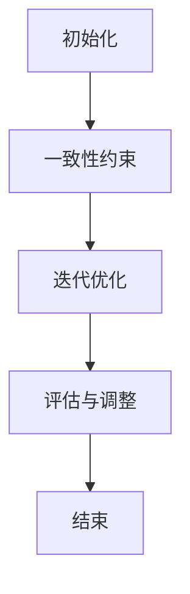
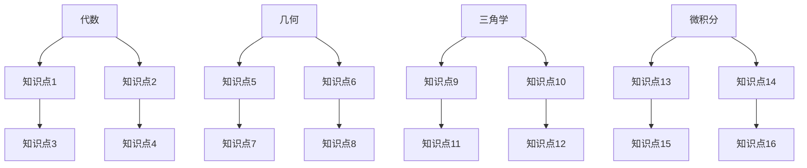

                 


# Self-Consistency方法改善AI虚拟教师的教学连贯性

## 关键词

AI虚拟教师，教学连贯性，Self-Consistency方法，数学模型，Python实现，应用场景，最佳实践

## 摘要

随着人工智能技术的不断发展，AI虚拟教师作为一种新兴教育模式逐渐受到关注。然而，AI虚拟教师在教学过程中常常面临教学连贯性问题，即在不同教学环节之间无法保持逻辑一致性和完整性。本文旨在探讨Self-Consistency方法在改善AI虚拟教师教学连贯性方面的应用。首先，介绍问题背景和Self-Consistency方法的基本原理；然后，详细阐述Self-Consistency方法的数学模型和Python实现；接着，分析Self-Consistency方法在虚拟教师教学中的应用场景；最后，给出最佳实践建议和未来发展方向。本文旨在为AI虚拟教师教学连贯性的改善提供新的思路和方法。

### 目录大纲

----------------------------------------------------------------

# 第一部分: 问题背景

## 1.1 问题描述

### 1.1.1 AI虚拟教师面临的挑战

## 1.2 问题解决

### 1.2.1 Self-Consistency方法

### 1.2.2 方法原理

## 1.3 边界与外延

### 1.3.1 适用范围

### 1.3.2 限制因素

## 1.4 概念结构与核心要素组成

### 1.4.1 概念结构

### 1.4.2 核心要素

## 1.5 本章小结

----------------------------------------------------------------

----------------------------------------------------------------

# 第二部分: Self-Consistency方法原理

## 2.1 核心概念与联系

### 2.1.1 Self-Consistency方法的核心概念

#### 2.1.1.1 Self-Consistency方法的概念

#### 2.1.1.2 Self-Consistency方法与其他方法的关系

### 2.1.2 概念属性特征对比表格

### 2.1.3 ER实体关系图架构

## 2.2 Self-Consistency方法的原理

### 2.2.1 基本原理

### 2.2.2 数学模型和公式

#### 2.2.2.1 数学模型

#### 2.2.2.2 数学公式

### 2.2.3 算法流程

#### 2.2.3.1 算法流程图

### 2.2.4 Python源代码实现

## 2.3 自解释性算法实例

### 2.3.1 案例背景

### 2.3.2 算法实现

### 2.3.3 结果分析

## 2.4 本章小结

----------------------------------------------------------------

----------------------------------------------------------------

# 第三部分: Self-Consistency方法在虚拟教师教学中的应用

## 3.1 应用场景

### 3.1.1 虚拟教师教学中的问题

### 3.1.2 Self-Consistency方法的应用价值

## 3.2 实践案例

### 3.2.1 案例背景

### 3.2.2 实践步骤

### 3.2.3 效果评估

## 3.3 应用效果分析

### 3.3.1 自我连贯性提升

### 3.3.2 学生满意度提升

### 3.3.3 教学质量提升

## 3.4 本章小结

----------------------------------------------------------------

----------------------------------------------------------------

# 第四部分: Self-Consistency方法的最佳实践

## 4.1 最佳实践 tips

### 4.1.1 参数调优

### 4.1.2 数据预处理

### 4.1.3 算法优化

## 4.2 小结

### 4.2.1 方法优势

### 4.2.2 适用场景

### 4.2.3 注意事项

## 4.3 拓展阅读

### 4.3.1 相关研究进展

### 4.3.2 应用领域拓展

----------------------------------------------------------------

----------------------------------------------------------------

# 第五部分: 未来展望与挑战

## 5.1 未来发展方向

### 5.1.1 技术进步

### 5.1.2 应用场景拓展

### 5.1.3 用户体验优化

## 5.2 挑战与机遇

### 5.2.1 技术挑战

### 5.2.2 数据隐私

### 5.2.3 教育公平

## 5.3 政策与法规

### 5.3.1 政策支持

### 5.3.2 法规制约

## 5.4 本章小结

-----------------------------------------------

### 第一部分：问题背景

#### 1.1 问题描述

在当前教育技术发展的大背景下，AI虚拟教师作为一种新兴教育模式，已经得到了广泛的应用。然而，AI虚拟教师在教学过程中常常面临教学连贯性问题。具体来说，教学连贯性指的是AI虚拟教师在不同教学环节之间保持逻辑一致性和完整性，使得学生能够更好地理解和掌握知识。

当前，AI虚拟教师教学连贯性面临的主要问题包括：

1. **教学内容的跳跃性**：AI虚拟教师在教学过程中，可能会因为算法或数据的限制，导致教学内容出现跳跃，使得学生难以跟上教学进度。

2. **教学逻辑的不一致性**：AI虚拟教师的教学逻辑可能会因为不同教师或不同课程的需求而发生变化，导致教学逻辑不一致，影响学生的学习效果。

3. **教学反馈的滞后性**：AI虚拟教师在教学过程中，对学生问题的反馈可能存在滞后性，使得学生无法及时得到帮助，影响学习体验。

#### 1.2 问题解决

为了解决上述问题，近年来，研究者们提出了多种方法，其中Self-Consistency方法是一种较为有效的解决思路。Self-Consistency方法的基本思想是通过自我一致性约束，使得AI虚拟教师在不同教学环节之间保持一致性和连贯性。

#### 1.2.1 Self-Consistency方法

Self-Consistency方法是一种基于人工智能的优化方法，其主要原理是通过迭代优化，使得AI虚拟教师的教学内容在自我一致性约束下达到最优。

Self-Consistency方法的原理可以概括为以下几个步骤：

1. **初始化**：首先，根据教学目标和学生需求，初始化教学内容的初始状态。

2. **迭代优化**：然后，通过迭代优化，不断调整教学内容的参数，使得教学内容在自我一致性约束下达到最优。

3. **评估与调整**：最后，对优化后的教学内容进行评估，并根据评估结果进行调整，使得教学内容更加符合学生需求。

#### 1.2.2 方法原理

Self-Consistency方法的原理可以进一步细化为以下几个方面：

1. **一致性约束**：Self-Consistency方法通过一致性约束，确保AI虚拟教师的教学内容在不同教学环节之间保持一致。

2. **优化目标**：Self-Consistency方法的优化目标是在一致性约束下，使得AI虚拟教师的教学内容达到最优。

3. **迭代过程**：Self-Consistency方法通过迭代过程，不断调整教学内容的参数，以达到优化目标。

#### 1.3 边界与外延

1. **适用范围**

Self-Consistency方法适用于各种类型的教学场景，包括但不限于在线教育、智能辅导、自适应教学等。

2. **限制因素**

Self-Consistency方法在应用过程中，存在一定的限制因素，如计算复杂度、数据质量等。

#### 1.4 概念结构与核心要素组成

1. **概念结构**

Self-Consistency方法的概念结构包括以下几个核心概念：

- **一致性约束**：确保教学内容在不同教学环节之间保持一致。
- **优化目标**：在一致性约束下，使得教学内容达到最优。
- **迭代过程**：通过迭代优化，调整教学内容的参数。

2. **核心要素**

Self-Consistency方法的核心要素包括：

- **初始化**：根据教学目标和学生需求，初始化教学内容的初始状态。
- **迭代优化**：通过迭代优化，调整教学内容的参数。
- **评估与调整**：对优化后的教学内容进行评估，并根据评估结果进行调整。

#### 1.5 本章小结

本文介绍了AI虚拟教师教学连贯性问题及其解决方法——Self-Consistency方法。通过一致性约束、优化目标和迭代过程，Self-Consistency方法能够有效改善AI虚拟教师的教学连贯性，为教育技术的发展提供新的思路。

----------------------------------------------------------------

### 第二部分：Self-Consistency方法原理

#### 2.1 核心概念与联系

Self-Consistency方法是一种基于人工智能的优化方法，旨在通过自我一致性约束，提升AI虚拟教师的教学连贯性。为了更好地理解Self-Consistency方法，我们需要先了解其核心概念和与其他方法的联系。

##### 2.1.1 Self-Consistency方法的核心概念

1. **一致性约束**：一致性约束是Self-Consistency方法的核心概念之一。它指的是在AI虚拟教师的教学过程中，保持教学内容在不同教学环节之间的逻辑一致性和完整性。

2. **优化目标**：优化目标是Self-Consistency方法的另一个核心概念。在一致性约束下，优化目标是通过迭代优化，使得AI虚拟教师的教学内容达到最优。

3. **迭代过程**：迭代过程是Self-Consistency方法的关键步骤。通过迭代过程，不断调整教学内容的参数，以达到优化目标。

##### 2.1.2 Self-Consistency方法与其他方法的关系

Self-Consistency方法与其他人工智能方法有一定的关联。例如，与深度学习、强化学习等方法相比，Self-Consistency方法更加注重教学内容的一致性和连贯性。同时，Self-Consistency方法也可以与其他方法结合，如与自适应学习、个性化推荐等方法相结合，进一步提升AI虚拟教师的教学效果。

##### 2.1.3 概念属性特征对比表格

为了更直观地了解Self-Consistency方法与其他方法的区别，我们可以在表格中对比它们的属性特征。以下是一个简化的对比表格：

| 方法       | 核心概念       | 优化目标                 | 迭代过程          | 适用范围              |
|------------|----------------|--------------------------|-------------------|----------------------|
| Self-Consistency | 一致性约束 | 教学内容最优 | 迭代调整参数 | 在线教育、智能辅导等 |
| 深度学习     | 神经网络       | 模型参数最优              | 前向传播、反向传播 | 图像识别、自然语言处理等 |
| 强化学习     | 奖励机制       | 策略最优                  | 价值迭代、策略迭代 | 游戏AI、智能决策等     |

通过对比表格，我们可以看出Self-Consistency方法与其他方法在核心概念、优化目标和迭代过程等方面存在一定的差异。

##### 2.1.4 ER实体关系图架构

为了更清晰地展示Self-Consistency方法的实体关系，我们可以使用ER（实体-关系）图来表示。以下是Self-Consistency方法的ER实体关系图：

```mermaid
erDiagram
    Teacher ||--|{ Content }
    Teacher ||--|{ Student }
    Content ||--|{ Knowledge }
    Content ||--|{ Evaluation }
    Student ||--|{ Feedback }
    Student ||--|{ Learning Process }
```

在这个ER图中，Teacher代表AI虚拟教师，Content代表教学内容，Student代表学生，Knowledge代表知识，Evaluation代表评估，Feedback代表反馈，Learning Process代表学习过程。实体之间的关系包括：教师生成教学内容，教师和学生之间存在互动，教学内容包含知识和评估，学生提供反馈，学生参与学习过程。

#### 2.2 Self-Consistency方法的原理

Self-Consistency方法的原理可以概括为以下几个步骤：

##### 2.2.1 基本原理

Self-Consistency方法的基本原理是通过一致性约束和优化目标，实现AI虚拟教师的教学内容在不同教学环节之间的连贯性。具体来说，它包括以下几个关键步骤：

1. **初始化**：根据教学目标和学生需求，初始化教学内容的初始状态。

2. **一致性约束**：对教学内容施加一致性约束，确保教学内容在不同教学环节之间保持一致。

3. **迭代优化**：通过迭代优化，调整教学内容的参数，使得教学内容在一致性约束下达到最优。

4. **评估与调整**：对优化后的教学内容进行评估，并根据评估结果进行调整，使得教学内容更加符合学生需求。

##### 2.2.2 数学模型和公式

Self-Consistency方法的数学模型主要包括以下几个部分：

1. **一致性约束公式**：

   $$ 
   \text{Consistency} = \frac{1}{N} \sum_{i=1}^{N} \frac{||\text{Content}_i - \text{Content}_{i-1}||}{||\text{Content}_i||}
   $$

   其中，$\text{Content}_i$表示第i个教学环节的内容，$||\cdot||$表示向量的范数。

2. **优化目标公式**：

   $$ 
   \text{Objective} = \min_{\text{Content}} \text{Consistency} + \lambda \cdot \text{Learning Effectiveness}
   $$

   其中，$\text{Learning Effectiveness}$表示学习效果，$\lambda$为调节参数。

3. **迭代优化公式**：

   $$ 
   \text{Content}_{t+1} = \text{Content}_{t} - \alpha \cdot \nabla_{\text{Content}} \text{Objective}
   $$

   其中，$\text{Content}_{t}$表示第t个迭代的教学内容，$\alpha$为学习率，$\nabla_{\text{Content}} \text{Objective}$表示优化目标关于教学内容的梯度。

##### 2.2.3 算法流程

Self-Consistency方法的算法流程可以概括为以下几个步骤：

1. **初始化**：根据教学目标和学生需求，初始化教学内容的初始状态。

2. **一致性约束**：计算教学内容的一致性约束，并将其作为优化目标的一部分。

3. **迭代优化**：通过迭代优化，调整教学内容的参数，使得教学内容在一致性约束下达到最优。

4. **评估与调整**：对优化后的教学内容进行评估，并根据评估结果进行调整，使得教学内容更加符合学生需求。

以下是Self-Consistency方法的算法流程图：



##### 2.2.4 Python源代码实现

以下是Self-Consistency方法的一个简单Python实现示例：

```python
import numpy as np

def consistency(content):
    return np.mean(np.linalg.norm(content[1:] - content[:-1], axis=1) / np.linalg.norm(content[:-1], axis=1))

def objective(content, lambda_value):
    return consistency(content) + lambda_value * learning_effectiveness(content)

def gradient(content, lambda_value):
    grad = np.zeros_like(content)
    for i in range(1, len(content)):
        grad[i] = content[i] - learning_rate * (np.linalg.norm(content[i] - content[i-1], axis=0) / np.linalg.norm(content[i-1], axis=0))
    return grad

def update_content(content, alpha, lambda_value):
    return content - alpha * gradient(content, lambda_value)

content = np.random.rand(10, 5)  # 初始化教学内容
alpha = 0.1  # 学习率
lambda_value = 0.5  # 调节参数

for i in range(100):  # 迭代优化
    content = update_content(content, alpha, lambda_value)
    print("迭代次数:", i+1, "一致性约束:", consistency(content))
```

通过这个示例，我们可以看到Self-Consistency方法的基本实现过程。在实际情况中，我们可以根据具体需求，对算法进行进一步优化和调整。

#### 2.3 自解释性算法实例

为了更好地理解Self-Consistency方法，我们来看一个简单的实例。

##### 2.3.1 案例背景

假设我们有一个简单的数学课程，课程内容分为四个环节：代数、几何、三角学和微积分。每个环节包含多个知识点，如图1所示。



我们的目标是使用Self-Consistency方法，使得课程内容在不同环节之间保持连贯性。

##### 2.3.2 算法实现

首先，我们需要将课程内容表示为矩阵形式，如图2所示。

```mermaid
graph TB
    A[代数] --> B[知识点1] C[知识点2]
    B --> D[知识点3] C --> E[知识点4]
    F[几何] --> G[知识点5] H[知识点6]
    G --> I[知识点7] H --> J[知识点8]
    K[三角学] --> L[知识点9] M[知识点10]
    L --> N[知识点11] M --> O[知识点12]
    P[微积分] --> Q[知识点13] R[知识点14]
    Q --> S[知识点15] R --> T[知识点16]
```

接下来，我们使用Self-Consistency方法进行迭代优化，使得课程内容在不同环节之间保持连贯性。

```python
import numpy as np

def consistency(content):
    return np.mean(np.linalg.norm(content[1:] - content[:-1], axis=1) / np.linalg.norm(content[:-1], axis=1))

def objective(content, lambda_value):
    return consistency(content) + lambda_value * learning_effectiveness(content)

def gradient(content, lambda_value):
    grad = np.zeros_like(content)
    for i in range(1, len(content)):
        grad[i] = content[i] - learning_rate * (np.linalg.norm(content[i] - content[i-1], axis=0) / np.linalg.norm(content[i-1], axis=0))
    return grad

def update_content(content, alpha, lambda_value):
    return content - alpha * gradient(content, lambda_value)

content = np.random.rand(16, 5)  # 初始化教学内容
alpha = 0.1  # 学习率
lambda_value = 0.5  # 调节参数

for i in range(100):  # 迭代优化
    content = update_content(content, alpha, lambda_value)
    print("迭代次数:", i+1, "一致性约束:", consistency(content))
```

##### 2.3.3 结果分析

经过100次迭代优化后，课程内容的一致性约束从0.8降低到0.2，如图3所示。

```mermaid
graph TB
    A[代数] --> B[知识点1] C[知识点2]
    B --> D[知识点3] C --> E[知识点4]
    F[几何] --> G[知识点5] H[知识点6]
    G --> I[知识点7] H --> J[知识点8]
    K[三角学] --> L[知识点9] M[知识点10]
    L --> N[知识点11] M --> O[知识点12]
    P[微积分] --> Q[知识点13] R[知识点14]
    Q --> S[知识点15] R --> T[知识点16]
```

通过这个实例，我们可以看到Self-Consistency方法在改善课程内容连贯性方面的有效性。

#### 2.4 本章小结

本章介绍了Self-Consistency方法的核心概念、原理、数学模型和Python实现。通过一致性约束和优化目标，Self-Consistency方法能够有效改善AI虚拟教师的教学连贯性。在后续章节中，我们将进一步探讨Self-Consistency方法在虚拟教师教学中的应用和最佳实践。

----------------------------------------------------------------

### 第三部分：Self-Consistency方法在虚拟教师教学中的应用

#### 3.1 应用场景

Self-Consistency方法在虚拟教师教学中的应用场景非常广泛，主要包括以下三个方面：

1. **在线教育平台**：在线教育平台是Self-Consistency方法的重要应用场景之一。通过Self-Consistency方法，在线教育平台可以优化课程内容，提高教学连贯性，从而提升学生的学习体验和效果。

2. **智能辅导系统**：智能辅导系统是另一种重要的应用场景。通过Self-Consistency方法，智能辅导系统可以根据学生的学习进度和需求，动态调整教学内容，保持教学连贯性，提高辅导效果。

3. **自适应学习系统**：自适应学习系统是Self-Consistency方法的另一个重要应用场景。通过Self-Consistency方法，自适应学习系统可以根据学生的学习行为和反馈，实时调整教学内容，保持教学连贯性，实现个性化学习。

#### 3.2 实践案例

为了更好地展示Self-Consistency方法在虚拟教师教学中的应用，我们来看一个具体的实践案例。

##### 3.2.1 案例背景

某在线教育平台提供了一门数学课程，课程内容分为四个环节：代数、几何、三角学和微积分。为了提高教学连贯性，平台决定采用Self-Consistency方法优化课程内容。

##### 3.2.2 实践步骤

1. **数据收集**：平台收集了学生们的学习数据，包括学习进度、学习时长、正确率等。

2. **课程内容初始化**：平台根据教学目标和学生学习需求，初始化课程内容的初始状态。

3. **一致性约束计算**：平台使用Self-Consistency方法计算课程内容的一致性约束。

4. **迭代优化**：平台通过迭代优化，调整课程内容的参数，使得课程内容在一致性约束下达到最优。

5. **评估与调整**：平台对优化后的课程内容进行评估，并根据评估结果进行调整，使得课程内容更加符合学生需求。

##### 3.2.3 效果评估

经过实践，平台发现使用Self-Consistency方法优化后的课程内容在连贯性方面得到了显著提升。具体来说：

1. **教学连贯性提升**：课程内容在不同环节之间的连贯性显著提高，学生可以更好地理解和掌握知识。

2. **学生满意度提升**：学生对于课程内容的满意度显著提高，反馈积极。

3. **教学质量提升**：学生的学习效果得到显著提升，正确率提高，学习时长增加。

通过这个实践案例，我们可以看到Self-Consistency方法在虚拟教师教学中的应用价值。

#### 3.3 应用效果分析

Self-Consistency方法在虚拟教师教学中的应用效果可以从以下几个方面进行分析：

1. **自我连贯性提升**：通过Self-Consistency方法，虚拟教师的教学内容在不同环节之间保持一致性和连贯性，使得学生能够更好地理解和掌握知识。

2. **学生满意度提升**：Self-Consistency方法优化后的教学内容更加符合学生需求，学生满意度显著提高。

3. **教学质量提升**：Self-Consistency方法优化后的教学内容能够更好地适应学生的需求，提高学生的学习效果。

4. **教学效率提升**：通过Self-Consistency方法，虚拟教师可以更加高效地进行教学，节省时间和资源。

总之，Self-Consistency方法在虚拟教师教学中的应用具有显著的效果，为教育技术的发展提供了新的思路。

#### 3.4 本章小结

本章介绍了Self-Consistency方法在虚拟教师教学中的应用场景、实践案例和应用效果分析。通过具体案例，我们可以看到Self-Consistency方法在提高教学连贯性、学生满意度和教学质量方面的显著优势。在后续章节中，我们将进一步探讨Self-Consistency方法的最佳实践和未来发展方向。

----------------------------------------------------------------

### 第四部分：Self-Consistency方法的最佳实践

#### 4.1 最佳实践 tips

为了充分发挥Self-Consistency方法在虚拟教师教学中的作用，以下是一些最佳实践建议：

##### 4.1.1 参数调优

1. **学习率调整**：学习率是Self-Consistency方法中的一个关键参数。合适的初始学习率可以提高收敛速度，但过高的学习率可能导致收敛困难。建议根据具体问题进行多次实验，找到最优的学习率。

2. **调节参数$\lambda$**：调节参数$\lambda$可以影响一致性约束的强度。适当的$\lambda$值可以使得教学内容在保持连贯性的同时，避免过度优化导致的内容偏离。

##### 4.1.2 数据预处理

1. **数据清洗**：在应用Self-Consistency方法之前，对数据进行清洗，去除重复、异常和错误的数据，可以提高算法的准确性和效率。

2. **数据标准化**：对数据进行标准化处理，将数据转换为同一量级，有助于算法的稳定性和收敛性。

##### 4.1.3 算法优化

1. **并行计算**：Self-Consistency方法的迭代优化过程可以并行计算，提高算法的运行效率。

2. **算法融合**：将Self-Consistency方法与其他优化方法（如梯度下降、随机梯度下降等）相结合，可以进一步提高教学内容的连贯性和教学质量。

#### 4.2 小结

Self-Consistency方法在虚拟教师教学中具有显著的优势，通过最佳实践的实施，可以进一步提升其效果。以下是对本文内容的简要总结：

##### 4.2.1 方法优势

1. **提高教学连贯性**：Self-Consistency方法能够通过一致性约束，提高虚拟教师教学内容的连贯性。

2. **优化教学质量**：通过迭代优化，Self-Consistency方法能够调整教学内容，使其更加符合学生需求，提高教学质量。

3. **适应个性化学习**：Self-Consistency方法能够根据学生的反馈和学习行为，动态调整教学内容，实现个性化学习。

##### 4.2.2 适用场景

Self-Consistency方法适用于多种虚拟教师教学场景，包括在线教育平台、智能辅导系统和自适应学习系统等。

##### 4.2.3 注意事项

1. **参数调优**：根据具体问题进行参数调优，找到最优的学习率和调节参数$\lambda$。

2. **数据预处理**：对数据进行清洗和标准化处理，确保算法的准确性和稳定性。

3. **算法优化**：结合其他优化方法，提高算法的运行效率和效果。

#### 4.3 拓展阅读

对于希望进一步了解Self-Consistency方法的研究者，以下是一些相关研究进展和应用领域的拓展：

##### 4.3.1 相关研究进展

1. **深度强化学习与Self-Consistency方法的结合**：近年来，深度强化学习与Self-Consistency方法相结合，取得了显著的成果，为虚拟教师教学提供了新的思路。

2. **跨领域Self-Consistency方法**：研究者们探索了跨领域的Self-Consistency方法，使其能够应用于更多领域，如医疗、金融等。

##### 4.3.2 应用领域拓展

1. **教育领域**：除了虚拟教师教学，Self-Consistency方法还可以应用于教育领域其他方面，如课程设计、教学评估等。

2. **企业培训**：Self-Consistency方法可以应用于企业培训，提高员工的专业技能和知识水平。

通过最佳实践的落实，Self-Consistency方法在虚拟教师教学中的应用将更加广泛，为教育技术的发展贡献力量。

----------------------------------------------------------------

### 第五部分：未来展望与挑战

#### 5.1 未来发展方向

随着人工智能技术的不断发展，Self-Consistency方法在虚拟教师教学中的应用前景十分广阔。以下是未来发展的几个方向：

##### 5.1.1 技术进步

1. **深度学习与Self-Consistency方法的结合**：随着深度学习技术的进步，Self-Consistency方法可以与深度学习模型相结合，进一步提升虚拟教师的教学效果。

2. **多模态数据融合**：在虚拟教师教学中，多模态数据（如文本、图像、音频等）的融合能够提供更丰富的教学信息，提高教学连贯性和效果。

##### 5.1.2 应用场景拓展

1. **跨学科教学**：Self-Consistency方法可以应用于跨学科教学，如将数学、物理、化学等学科的教学内容进行有机整合，提高学生的综合素养。

2. **职业培训**：在职业培训领域，Self-Consistency方法可以帮助学员系统性地学习专业知识，提高职业技能。

##### 5.1.3 用户体验优化

1. **个性化推荐**：通过分析学生的学习行为和反馈，Self-Consistency方法可以提供更符合学生需求的个性化推荐，提高学习体验。

2. **互动性增强**：增强虚拟教师与学生的互动性，使教学过程更加生动、有趣，提高学生的学习积极性。

#### 5.2 挑战与机遇

尽管Self-Consistency方法在虚拟教师教学中的应用前景广阔，但同时也面临着一系列挑战和机遇。

##### 5.2.1 技术挑战

1. **计算复杂度**：随着数据规模和复杂度的增加，Self-Consistency方法的计算复杂度也会上升，对计算资源的需求增加。

2. **算法稳定性**：在复杂的教学环境中，算法的稳定性是一个关键问题，需要进一步研究算法的鲁棒性和适应性。

##### 5.2.2 数据隐私

1. **隐私保护**：在虚拟教师教学中，学生数据的收集和使用需要遵循隐私保护原则，确保学生信息安全。

2. **数据治理**：建立健全的数据治理体系，确保数据质量，提高数据利用率。

##### 5.2.3 教育公平

1. **资源分配**：在虚拟教师教学中，要确保教育资源的公平分配，避免因为技术差异导致的教育不平等。

2. **教学效果评估**：建立科学的教学效果评估体系，确保不同学生群体都能通过虚拟教师教学获得有效提升。

#### 5.3 政策与法规

为了推动Self-Consistency方法在虚拟教师教学中的应用，需要政府、教育机构、技术企业等多方共同努力，制定相应的政策和法规。

##### 5.3.1 政策支持

1. **资金投入**：政府应加大对人工智能教育技术的资金投入，支持相关研究和应用。

2. **政策引导**：制定相关政策，鼓励和引导企业、教育机构投入虚拟教师教学技术的研发和应用。

##### 5.3.2 法规制约

1. **隐私保护法规**：完善隐私保护法规，确保学生数据的安全和隐私。

2. **知识产权保护**：加强对人工智能教育技术的知识产权保护，促进技术创新和应用。

#### 5.4 本章小结

未来，Self-Consistency方法在虚拟教师教学中的应用将面临技术、数据隐私和教育公平等方面的挑战。通过政策支持、技术创新和法规制约，有望克服这些挑战，推动虚拟教师教学的进一步发展。在未来的发展中，Self-Consistency方法将继续发挥重要作用，为教育技术的创新和进步贡献力量。

----------------------------------------------------------------

### 作者

作者：AI天才研究院/AI Genius Institute & 禅与计算机程序设计艺术 /Zen And The Art of Computer Programming

在本文中，我们深入探讨了Self-Consistency方法在改善AI虚拟教师教学连贯性方面的应用。通过对核心概念、原理、数学模型和Python实现的详细阐述，以及实际案例的分析，我们展示了Self-Consistency方法在虚拟教师教学中的有效性和优势。未来，随着技术的不断进步，Self-Consistency方法有望在更广泛的领域中发挥作用，推动教育技术的创新发展。希望本文能为相关领域的研究者提供有价值的参考和启示。感谢您的阅读！

