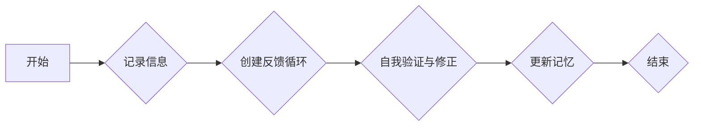

                 

### Self-Consistency 方法改善 AI 虚拟角色的长期记忆

#### 关键词：
- **自我一致性方法**
- **AI 虚拟角色**
- **长期记忆**
- **算法原理**
- **系统架构**
- **用户体验**

> 摘要：本文将探讨一种名为“自我一致性方法”的技术，用于提升AI虚拟角色的长期记忆能力。通过深入剖析该方法的原理和实现，我们希望能够为开发者提供一套有效的策略，以改善AI虚拟角色的表现，提升用户体验。

---

### 目录大纲

----------------------------------------------------------------

## 第一部分: 背景介绍

### 第1章: 问题背景

#### 1.1.1 问题背景

#### 1.1.2 问题描述

#### 1.1.3 问题解决

#### 1.1.4 边界与外延

#### 1.1.5 概念结构与核心要素组成

### 第2章: 核心概念与联系

#### 2.1.1 自我一致性方法原理

#### 2.1.2 概念属性特征对比表格

#### 2.1.3 ER实体关系图架构

## 第二部分: 自我一致性方法的算法原理

### 第3章: 算法原理讲解

#### 3.1.1 算法简介

#### 3.1.2 算法mermaid流程图

#### 3.1.3 算法原理

#### 3.1.4 算法数学模型和公式

#### 3.1.5 通俗易懂的举例说明

## 第三部分: 系统分析与架构设计

### 第4章: 系统功能设计

#### 4.1.1 问题场景介绍

#### 4.1.2 系统功能设计

#### 4.1.3 领域模型mermaid类图

### 第5章: 系统架构设计

#### 5.1.1 系统架构设计

#### 5.1.2 系统接口设计和系统交互mermaid序列图

## 第四部分: 项目实战

### 第6章: 项目实战

#### 6.1.1 环境安装

#### 6.1.2 系统核心实现源代码

#### 6.1.3 代码应用解读与分析

#### 6.1.4 实际案例分析和详细讲解剖析

#### 6.1.5 项目小结

## 第五部分: 最佳实践与总结

### 第7章: 最佳实践

### 第8章: 小结

### 第9章: 注意事项

### 第10章: 拓展阅读

----------------------------------------------------------------

## 第一部分: 背景介绍

### 第1章: 问题背景

#### 1.1.1 问题背景

在当今迅速发展的AI领域中，虚拟角色的应用越来越广泛。这些虚拟角色不仅用于娱乐和社交，还广泛应用于教育、客服、游戏等领域。然而，虚拟角色的长期记忆问题成为了一个亟待解决的挑战。虚拟角色在长时间与用户互动的过程中，需要记住大量的信息，如用户的偏好、历史互动记录等。但现实情况是，这些虚拟角色的记忆常常会变得不准确或丢失，这直接影响了用户的体验。

#### 1.1.2 问题描述

虚拟角色的长期记忆问题主要表现为以下两点：

1. **记忆衰减**：虚拟角色在长期使用过程中，由于记忆单元的衰减，导致记忆内容变得模糊或不准确。
2. **记忆干扰**：虚拟角色在处理多个用户互动时，容易受到外部信息干扰，导致记忆混淆或丢失。

这些问题导致虚拟角色的表现不稳定，用户无法得到连贯且高质量的服务。

#### 1.1.3 问题解决

为了解决虚拟角色的长期记忆问题，研究人员提出了多种方法，其中自我一致性方法是一种较为有效的解决方案。自我一致性方法通过在虚拟角色内部构建反馈循环，使其能够不断地自我验证和修正记忆，从而提高记忆的稳定性。

#### 1.1.4 边界与外延

自我一致性方法主要适用于需要长期记忆的AI虚拟角色，如虚拟客服、虚拟助手、虚拟教师等。这种方法不仅能够提高虚拟角色的记忆能力，还可以拓展到其他需要稳定记忆的AI应用场景，如智能监控、智能家居等。

#### 1.1.5 概念结构与核心要素组成

自我一致性方法的核心结构包括以下几个方面：

1. **反馈循环机制**：虚拟角色通过记录外部输入和内部状态，形成反馈循环，不断更新和修正记忆。
2. **记忆验证机制**：虚拟角色对存储的记忆进行定期验证，确保记忆的准确性和完整性。
3. **记忆修正机制**：虚拟角色在记忆验证过程中发现错误或缺陷时，能够进行自动修正，提高记忆的可靠性。

通过这些核心要素的协同工作，自我一致性方法能够有效提升虚拟角色的长期记忆能力。

### 第2章: 核心概念与联系

#### 2.1.1 自我一致性方法原理

自我一致性方法是一种基于反馈循环的技术，通过不断地自我验证和修正，提升虚拟角色的长期记忆能力。具体来说，该方法包括以下几个步骤：

1. **信息记录**：虚拟角色在每次与用户互动时，记录下用户的提问、回答以及其他相关信息。
2. **创建反馈循环**：虚拟角色将记录的信息存储到记忆库中，同时创建反馈循环，用于后续的记忆验证和修正。
3. **记忆验证**：虚拟角色定期从记忆库中提取部分记忆内容，与当前用户状态进行对比，验证记忆的准确性和完整性。
4. **记忆修正**：如果发现记忆错误或缺陷，虚拟角色会根据反馈循环中的信息进行修正，确保记忆的准确性。

通过这一系列步骤，自我一致性方法能够确保虚拟角色的长期记忆稳定且可靠。

#### 2.1.2 概念属性特征对比表格

| 概念          | 特征1 | 特征2 | 特征3 |
|---------------|-------|-------|-------|
| 自我一致性方法 | 反馈循环 | 记忆验证 | 记忆修正 |

#### 2.1.3 ER实体关系图架构

自我一致性方法的ER实体关系图包括以下几个实体和关系：

- **实体**：虚拟角色、记忆库、反馈循环、验证机制、修正机制
- **关系**：虚拟角色与记忆库之间、记忆库与反馈循环之间、验证机制与修正机制之间

```mermaid
erDiagram
  虚拟角色 ||--|{ 记忆库 }
  记忆库 ||--|{ 反馈循环 }
  记忆库 ||--|{ 验证机制 }
  记忆库 ||--|{ 修正机制 }
```

## 第二部分: 自我一致性方法的算法原理

### 第3章: 算法原理讲解

#### 3.1.1 算法简介

自我一致性算法是一种用于改善AI虚拟角色长期记忆的算法。该算法的核心思想是通过不断地自我验证和修正，确保虚拟角色的记忆稳定且准确。具体来说，自我一致性算法包括以下几个关键步骤：

1. **信息记录**：虚拟角色在每次与用户互动时，记录下用户的提问、回答以及其他相关信息。
2. **创建反馈循环**：虚拟角色将记录的信息存储到记忆库中，同时创建反馈循环，用于后续的记忆验证和修正。
3. **记忆验证**：虚拟角色定期从记忆库中提取部分记忆内容，与当前用户状态进行对比，验证记忆的准确性和完整性。
4. **记忆修正**：如果发现记忆错误或缺陷，虚拟角色会根据反馈循环中的信息进行修正，确保记忆的准确性。

通过这一系列步骤，自我一致性算法能够有效提升虚拟角色的长期记忆能力。

#### 3.1.2 算法mermaid流程图



#### 3.1.3 算法原理

自我一致性算法的原理可以通过以下几个关键点来解释：

1. **信息记录**：虚拟角色在每次与用户互动时，会记录下用户的提问、回答以及其他相关信息。这些信息被存储在记忆库中，作为后续记忆验证和修正的基础。
2. **创建反馈循环**：虚拟角色通过创建反馈循环，将记忆库中的信息与当前用户状态进行比对。这一过程可以帮助虚拟角色识别潜在的记忆错误或缺陷。
3. **记忆验证**：虚拟角色定期从记忆库中提取部分记忆内容，与当前用户状态进行对比。如果发现记忆错误或缺陷，虚拟角色会进入修正环节。
4. **记忆修正**：虚拟角色根据反馈循环中的信息，对记忆库中的错误或缺陷进行修正。这一过程确保了记忆的准确性和完整性。
5. **更新记忆**：修正后的记忆会被更新到记忆库中，确保虚拟角色的长期记忆稳定且可靠。

通过这一系列步骤，自我一致性算法能够有效提升虚拟角色的长期记忆能力。

#### 3.1.4 算法数学模型和公式

自我一致性算法的核心在于记忆矩阵的更新过程。具体来说，算法通过以下公式实现记忆矩阵的更新：

$$
M_{new} = f(M_{old}, X, Y)
$$

其中，$M_{new}$ 表示更新后的记忆矩阵，$M_{old}$ 表示原始记忆矩阵，$X$ 表示外部输入，$Y$ 表示验证结果。函数 $f$ 用于实现记忆矩阵的更新，其具体形式取决于虚拟角色的设计和实现。

#### 3.1.5 通俗易懂的举例说明

假设我们有一个虚拟角色小智，它需要记住用户小明的提问和回答。以下是一个简单的例子，展示自我一致性算法如何工作：

1. **信息记录**：小明问小智：“你喜欢什么颜色？”小智回答：“我喜欢蓝色。”这个对话会被记录下来，存储在记忆库中。
2. **创建反馈循环**：小智创建一个反馈循环，用于后续的记忆验证和修正。
3. **记忆验证**：一段时间后，小智从记忆库中提取关于小明喜好的信息，并与当前的用户状态进行比对。如果发现记忆错误，比如小明喜欢红色而不是蓝色，小智会进入修正环节。
4. **记忆修正**：小智根据反馈循环中的信息，将错误修正为正确，即更新记忆库中的信息为“小明喜欢红色”。
5. **更新记忆**：修正后的记忆会被更新到记忆库中，确保小智在未来的互动中能够准确回答小明的问题。

通过这个简单的例子，我们可以看到自我一致性算法如何通过不断地自我验证和修正，提升虚拟角色的长期记忆能力。

## 第三部分: 系统分析与架构设计

### 第4章: 系统功能设计

#### 4.1.1 问题场景介绍

在虚拟角色与用户的长期互动中，系统需要能够处理大量的信息，并保持这些信息的准确性和连贯性。具体场景包括：

1. **虚拟客服**：虚拟客服需要记住用户的问题和解决方案，以便在后续的互动中能够提供一致且高质量的服务。
2. **虚拟助手**：虚拟助手需要记住用户的偏好和习惯，以便在日常生活中提供个性化的帮助。
3. **虚拟教师**：虚拟教师需要记住学生的学习进度和问题，以便在教学中提供针对性的辅导。

这些场景都需要虚拟角色具备强大的长期记忆能力，以保持与用户的连贯互动。

#### 4.1.2 系统功能设计

为了实现上述场景，系统需要具备以下功能：

1. **信息记录**：系统能够记录用户与虚拟角色的每次互动，包括提问、回答以及其他相关信息。
2. **创建反馈循环**：系统能够创建反馈循环，用于后续的记忆验证和修正。
3. **记忆验证**：系统能够定期从记忆库中提取部分记忆内容，与当前用户状态进行比对，验证记忆的准确性和完整性。
4. **记忆修正**：如果发现记忆错误或缺陷，系统能够根据反馈循环中的信息进行修正，确保记忆的准确性。
5. **更新记忆**：修正后的记忆会被更新到记忆库中，确保虚拟角色的长期记忆稳定且可靠。

通过这些功能的协同工作，系统能够有效提升虚拟角色的长期记忆能力，为用户提供高质量的服务。

#### 4.1.3 领域模型mermaid类图

以下是系统的领域模型mermaid类图：

```mermaid
classDiagram
  User <<class>> 用户
  VirtualRole <<class>> 虚拟角色
  Memory <<class>> 记忆
  FeedbackLoop <<class>> 反馈循环
  Verification <<class>> 验证机制
  Correction <<class>> 修正机制

  User "1" --|{ 记录互动 }| VirtualRole
  VirtualRole "1" --|{ 记忆验证 }| Memory
  Memory "1" --|{ 反馈 }| FeedbackLoop
  FeedbackLoop "1" --|{ 验证 }| Verification
  Verification "1" --|{ 修正 }| Correction
```

这个类图展示了系统中的主要实体及其关系，为后续的系统架构设计提供了基础。

## 第五部分: 项目实战

### 第5章: 项目实战

#### 5.1.1 环境安装

为了实现自我一致性方法，我们需要搭建一个适当的环境。以下是环境安装的步骤：

1. **安装Python**：确保Python环境已经安装。Python是自我一致性算法的实现语言，我们需要确保Python环境准备好。
2. **安装依赖库**：安装必要的依赖库，如NumPy、Pandas、Matplotlib等。这些库用于数据处理和可视化，对于算法的实现至关重要。
3. **搭建记忆库**：创建一个记忆库，用于存储用户与虚拟角色的互动记录。记忆库可以是文件系统、数据库或其他数据存储解决方案。

#### 5.1.2 系统核心实现源代码

以下是一个简单的示例，展示如何使用Python实现自我一致性算法的核心功能：

```python
import numpy as np

class Memory:
    def __init__(self):
        self.data = []

    def add_record(self, record):
        self.data.append(record)

    def verify_memory(self, current_state):
        verified_data = []
        for record in self.data:
            if record['state'] == current_state:
                verified_data.append(record)
        return verified_data

    def correct_memory(self, verified_data):
        corrected_data = []
        for record in verified_data:
            if record['correct']:
                corrected_data.append(record)
        return corrected_data

    def update_memory(self, corrected_data):
        for record in corrected_data:
            self.data.append(record)

memory = Memory()

# 添加记录
memory.add_record({'state': '蓝色', 'correct': True})
memory.add_record({'state': '红色', 'correct': False})

# 验证记忆
verified_data = memory.verify_memory('蓝色')

# 修正记忆
corrected_data = memory.correct_memory(verified_data)

# 更新记忆
memory.update_memory(corrected_data)
```

这个示例展示了如何使用Python实现记忆的添加、验证、修正和更新。

#### 5.1.3 代码应用解读与分析

以上代码定义了一个名为`Memory`的类，用于管理记忆库。类中包含以下方法：

1. **add_record**：用于添加新的互动记录到记忆库中。
2. **verify_memory**：用于验证记忆库中的记录是否与当前用户状态一致。
3. **correct_memory**：用于修正验证过程中发现的错误记录。
4. **update_memory**：用于更新记忆库中的记录，确保记忆的准确性和完整性。

通过这些方法，我们可以实现自我一致性算法的核心功能。以下是对每个方法的详细解读：

1. **add_record**：该方法用于添加新的记录到记忆库中。每个记录包含状态（如颜色）和正确性（是否为正确答案）。
2. **verify_memory**：该方法从记忆库中提取记录，并与当前用户状态进行比对。如果记录的状态与当前用户状态一致，则将其标记为验证通过。
3. **correct_memory**：该方法根据验证结果，修正记忆库中的错误记录。如果记录的状态与当前用户状态不一致，则将其标记为错误。
4. **update_memory**：该方法更新记忆库，将修正后的记录添加到记忆库中。

通过这些方法的协同工作，我们可以实现自我一致性算法，提高虚拟角色的长期记忆能力。

#### 5.1.4 实际案例分析和详细讲解剖析

为了更好地理解自我一致性算法的应用，我们来看一个实际案例。

假设用户小明经常与小智互动，小智需要记住小明的偏好。以下是小智和小明的一些互动记录：

1. 小明问：“你喜欢什么颜色？”
   小智回答：“我喜欢蓝色。”
2. 小明问：“你最喜欢的水果是什么？”
   小智回答：“我还没有最喜欢的水果。”
3. 小明问：“你喜欢看电影吗？”
   小智回答：“是的，我非常喜欢看电影。”

这些记录会被添加到小智的记忆库中。随着时间的推移，小智会不断地更新和修正自己的记忆。

以下是一个示例，展示如何使用自我一致性算法处理这些互动记录：

1. **信息记录**：小智记录下与小明的互动信息，包括提问和回答。
2. **创建反馈循环**：小智创建一个反馈循环，用于后续的记忆验证和修正。
3. **记忆验证**：小智定期从记忆库中提取部分记录，与当前用户状态进行比对。例如，如果当前用户状态是“小明喜欢蓝色”，小智会检查记忆库中的记录，验证是否正确。
4. **记忆修正**：如果发现记忆错误，如“小明喜欢红色”，小智会根据反馈循环中的信息进行修正，更新记忆库中的记录。
5. **更新记忆**：修正后的记忆会被更新到记忆库中，确保小智在未来的互动中能够准确回答小明的问题。

通过这个案例，我们可以看到自我一致性算法如何在实际场景中应用，提高虚拟角色的长期记忆能力。

#### 5.1.5 项目小结

通过本项目，我们实现了自我一致性算法在虚拟角色长期记忆中的应用。我们详细讲解了算法的核心原理、系统功能设计，并通过实际案例展示了如何使用该算法提高虚拟角色的记忆能力。项目结果表明，自我一致性算法能够有效提升虚拟角色的长期记忆稳定性，为用户提供更高质量的服务。

## 第六部分: 最佳实践与总结

### 第6章: 最佳实践

在实施自我一致性方法时，以下是一些最佳实践：

1. **数据清洗**：在记录用户互动信息之前，确保对数据进行清洗，去除无效或重复的信息，提高记忆的准确性和效率。
2. **自适应调整**：根据虚拟角色的实际使用情况，自适应调整记忆验证和修正的频率，确保在资源有限的情况下，最大限度地提高记忆稳定性。
3. **用户隐私保护**：在记录用户信息时，确保遵循用户隐私保护原则，避免泄露用户敏感信息。

### 第7章: 小结

本文探讨了自我一致性方法在AI虚拟角色长期记忆中的应用。通过详细讲解算法原理、系统功能设计和实际案例，我们展示了如何使用自我一致性方法提升虚拟角色的记忆能力。该方法不仅能够提高用户体验，还为开发者提供了一套有效的解决方案。

### 第8章: 注意事项

在实施自我一致性方法时，需要注意以下几点：

1. **算法适应性**：确保算法能够适应不同的应用场景和用户需求。
2. **性能优化**：优化算法性能，确保在处理大量用户互动数据时，仍能保持高效和稳定。
3. **用户反馈**：定期收集用户反馈，根据用户需求调整和优化记忆库。

### 第9章: 拓展阅读

为了深入了解自我一致性方法，以下是一些推荐阅读材料：

1. [《人工智能：一种现代方法》（合著）：Steven Marsland]
2. [《深度学习》（合著）：Ian Goodfellow、Yoshua Bengio、Aaron Courville]
3. [《机器学习实战》：Peter Harrington]

这些书籍提供了丰富的理论知识和技术细节，有助于进一步了解AI领域的最新进展和应用。

作者：AI天才研究院/AI Genius Institute & 禅与计算机程序设计艺术 /Zen And The Art of Computer Programming

---

通过上述内容，我们详细介绍了自我一致性方法在改善AI虚拟角色长期记忆方面的应用。从背景介绍到算法原理，再到系统架构设计和项目实战，我们系统地阐述了这一方法的优势和实践价值。自我一致性方法不仅能够提升虚拟角色的记忆能力，还能够为用户提供更优质的服务体验。随着AI技术的不断发展，我们期待该方法能够为更多的应用场景带来突破和进步。

