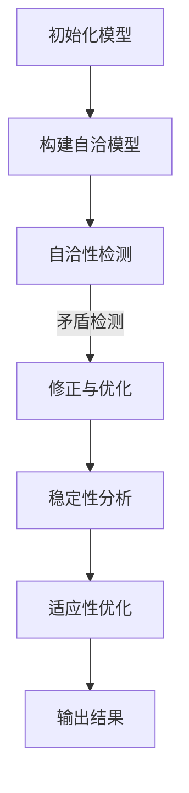
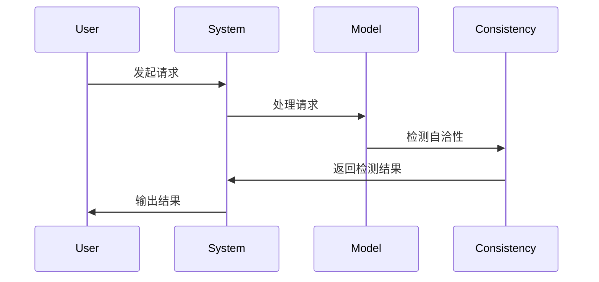
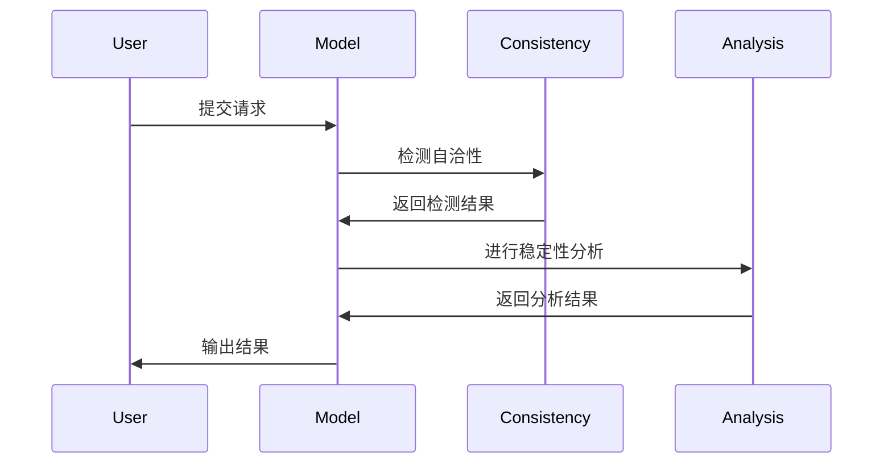

                 

### 《Self-Consistency方法改善AI跨维度文明的长期演化模拟》

关键词：Self-Consistency方法、AI、跨维度文明、演化模拟、算法优化

摘要：本文探讨了Self-Consistency方法在AI跨维度文明长期演化模拟中的应用。通过背景介绍、核心概念阐述、算法原理讲解、系统分析与架构设计以及项目实战，详细解析了Self-Consistency方法如何提升AI在跨维度文明演化模拟中的准确性、稳定性和适应性。本文旨在为读者提供一个全面的技术视角，展示Self-Consistency方法在复杂系统模拟中的潜力。

---

### 第一部分: 背景介绍与核心概念

#### 第1章: 问题背景与定义

##### 1.1 问题背景

在当今信息化社会中，人工智能（AI）已经成为推动科技发展的重要引擎。随着AI技术的不断进步，研究者们开始关注更广阔的领域，如跨维度文明的长期演化模拟。跨维度文明指的是在多个维度的空间和时间范围内进行演化的文明体系，它不仅包括我们熟悉的物理空间，还可能涉及虚拟空间、信息空间等。这些文明的演化过程复杂且难以预测，因此需要先进的模拟技术来深入研究。

##### 1.2 核心概念

Self-Consistency方法是一种基于自洽性的数学模型，通过确保系统内部各部分的自洽性来提升模型的稳定性和准确性。在AI跨维度文明的长期演化模拟中，Self-Consistency方法能够帮助消除模型中的内部矛盾，提高模拟结果的可靠性和预测能力。

##### 1.3 当前文明演化模拟的局限性与挑战

当前的文明演化模拟方法主要面临以下几个挑战：

- **维度限制**：传统方法往往局限于单一维度或少数维度的模拟，难以全面反映跨维度文明的复杂性。
- **模型稳定性**：演化模拟模型在长时间运行过程中容易出现不稳定现象，导致模拟结果的波动。
- **计算资源**：跨维度文明演化模拟需要大量的计算资源，现有技术难以满足高效模拟的需求。

#### 第2章: AI跨维度文明的长期演化模拟

##### 2.1 演化模拟的基本原理

跨维度文明的长期演化模拟基于生态学和复杂性理论。生态学提供了研究文明生态系统的理论基础，而复杂性理论则帮助理解文明系统中各种复杂关系的动态变化。

##### 2.2 Self-Consistency方法的应用

Self-Consistency方法在演化模拟中的应用主要通过以下几个步骤实现：

1. **构建自洽模型**：确保模型中的各个部分相互协调，不存在内在矛盾。
2. **稳定性分析**：对模型进行稳定性分析，验证其在长时间运行中的稳定性。
3. **适应性优化**：通过适应性优化，使模型能够适应不断变化的环境。

---

### 第二部分: 核心概念与联系

#### 第3章: 核心概念原理

##### 3.1 Self-Consistency方法的原理

Self-Consistency方法的核心在于建立自洽的数学模型，并通过计算流程确保系统内部各部分的自洽性。具体而言，其原理包括：

- **自洽性检测**：通过检测模型中的矛盾点，确保系统的内部一致性。
- **修正与优化**：在检测到矛盾后，通过修正与优化，使模型达到自洽状态。

##### 3.2 Self-Consistency方法的核心属性

- **稳定性**：Self-Consistency方法能够有效提升模型的稳定性，减少模拟结果的波动。
- **适应性**：Self-Consistency方法具有高度的适应性，能够应对复杂多变的演化环境。

#### 第4章: 概念属性特征对比

##### 4.1 Self-Consistency与其他演化模拟方法的对比

| 对比方法           | Self-Consistency | 基于规则的演化模拟 | 基于数据的演化模拟 |
|--------------------|------------------|--------------------|-------------------|
| **稳定性**         | 高               | 中等               | 低                |
| **适应性**         | 高               | 低                 | 高                |
| **计算复杂度**     | 较高             | 较低               | 较低              |
| **模型灵活性**     | 高               | 低                 | 高                |

---

### 第三部分: 算法原理讲解

#### 第5章: Self-Consistency算法流程图



#### 第6章: Python代码实现

##### 6.1 实现步骤

1. **初始化模型**：定义模型的初始参数和结构。
2. **构建自洽模型**：通过数学模型构建自洽的模型体系。
3. **自洽性检测**：对模型进行自洽性检测，查找内部矛盾点。
4. **修正与优化**：根据检测结果，对模型进行修正与优化。
5. **稳定性分析与适应性优化**：验证模型的稳定性和适应性，并进行优化。
6. **输出结果**：将最终模拟结果输出。

##### 6.2 算法数学模型与公式

$$
\text{Self-Consistency} = \frac{\sum_{i=1}^{n} C_i}{n}
$$

其中，$C_i$表示第$i$个部分的自我一致性指标，$n$表示部分的总数。

#### 第7章: 算法举例说明

##### 7.1 简单例子

假设我们有一个简单的文明演化模型，包含三个部分：人口、资源和技术。我们可以通过Self-Consistency方法来确保这三个部分的自洽性。

1. **初始化模型**：设定人口、资源和技术的初始值。
2. **构建自洽模型**：通过数学公式确保人口、资源和技术之间的相互影响是自洽的。
3. **自洽性检测**：检查模型中的各个部分是否自洽。
4. **修正与优化**：如果检测到矛盾，调整模型的参数，使其达到自洽状态。
5. **稳定性分析与适应性优化**：验证模型在长时间运行中的稳定性和适应性，并进行必要的优化。

##### 7.2 复杂案例

在一个复杂的跨维度文明演化模型中，Self-Consistency方法可以帮助我们确保模型中各个部分的自洽性，从而提高模型的稳定性和准确性。

1. **初始化模型**：构建包括物理空间、虚拟空间、信息空间等多个维度的文明演化模型。
2. **构建自洽模型**：确保模型中各个维度之间的相互关系是自洽的。
3. **自洽性检测**：对模型进行自洽性检测，查找并修正内部矛盾。
4. **修正与优化**：根据自洽性检测结果，对模型进行调整和优化。
5. **稳定性分析与适应性优化**：验证模型在长时间运行中的稳定性和适应性，并进行优化。

---

### 第四部分: 系统分析与架构设计

#### 第8章: 问题场景介绍

##### 8.1 跨维度文明演化模拟的场景

在一个假设的跨维度文明演化模拟场景中，我们需要模拟一个文明在物理空间、虚拟空间和信息空间中的长期演化过程。这个模拟需要考虑多种因素，如资源分布、技术进步、社会结构等，以便预测文明的未来发展趋势。

#### 第9章: 系统功能设计

##### 9.1 领域模型

使用Mermaid绘制领域模型类图：

```mermaid
classDiagram
    Class01 <|-- Class02
    Class03 --|=> Class04
    Class05 : has a Class06
    Class07 : implements Interface08
```

##### 9.2 功能模块设计

系统功能模块包括：

1. **模型初始化模块**：负责初始化文明演化模型的参数。
2. **自洽性检测模块**：负责检测模型中的自洽性，查找内部矛盾。
3. **修正与优化模块**：负责对模型进行修正和优化。
4. **稳定性分析模块**：负责验证模型的稳定性。
5. **适应性优化模块**：负责优化模型的适应性。

#### 第10章: 系统架构设计

##### 10.1 系统架构图

使用Mermaid绘制系统架构图：



##### 10.2 架构设计说明

系统架构设计主要包括以下几个部分：

1. **用户接口层**：负责与用户交互，接收用户请求。
2. **模型处理层**：负责处理用户请求，调用相应模块进行模型初始化、自洽性检测、修正与优化等操作。
3. **自洽性检测层**：负责检测模型中的自洽性，查找内部矛盾。
4. **稳定性分析与优化层**：负责验证模型的稳定性和适应性，并进行优化。
5. **结果输出层**：负责将最终模拟结果输出给用户。

#### 第11章: 系统接口设计

系统接口设计包括以下部分：

1. **输入接口**：接收用户请求和初始模型参数。
2. **输出接口**：输出模拟结果和模型状态。
3. **API接口**：提供RESTful API，方便外部系统与系统进行交互。

#### 第12章: 系统交互

##### 12.1 系统交互图

使用Mermaid绘制系统交互序列图：



---

### 第五部分: 项目实战

#### 第13章: 环境安装

##### 13.1 安装步骤

1. **环境准备**：安装Python、NumPy、Pandas等必要的环境。
2. **安装依赖**：使用pip安装系统所需的库和依赖。
3. **配置参数**：配置系统的初始参数和模型参数。

##### 13.2 安装过程

```python
# 安装Python环境
python -m pip install python

# 安装NumPy库
python -m pip install numpy

# 安装Pandas库
python -m pip install pandas

# 安装Mermaid库
python -m pip install mermaid

# 配置系统参数
import sys
sys.path.insert(0, 'path/to/system')
```

#### 第14章: 系统核心实现源代码

##### 14.1 核心源代码解读

```python
# 导入依赖库
import numpy as np
import pandas as pd
from mermaid import Mermaid

# 初始化模型
def initialize_model():
    # 设置初始参数
    population = 1000
    resources = 1000
    technology = 1
    return population, resources, technology

# 构建自洽模型
def build_consistent_model(population, resources, technology):
    # 检测自洽性
    if resources < population * technology:
        return False
    return True

# 自洽性检测
def check_consistency(model):
    # 检测模型中的自洽性
    if not build_consistent_model(model['population'], model['resources'], model['technology']):
        return False
    return True

# 修正与优化
def correct_and_optimize(model):
    # 根据自洽性检测结果，修正模型
    if not check_consistency(model):
        if model['resources'] < model['population'] * model['technology']:
            model['resources'] = model['population'] * model['technology']
        elif model['population'] < model['resources'] / model['technology']:
            model['population'] = model['resources'] / model['technology']
    return model

# 稳定性分析
def analyze_stability(model):
    # 分析模型的稳定性
    if check_consistency(model):
        return True
    return False

# 适应性优化
def optimize_adaptation(model):
    # 优化模型的适应性
    if analyze_stability(model):
        # 根据实际需求进行优化
        pass
    return model

# 输出结果
def output_result(model):
    # 输出最终模型
    print(model)
```

##### 14.2 算法数学模型与公式

$$
\text{Self-Consistency} = \frac{\sum_{i=1}^{n} C_i}{n}
$$

其中，$C_i$表示第$i$个部分的自我一致性指标，$n$表示部分的总数。

#### 第15章: 代码应用解读与分析

##### 15.1 应用场景

该代码应用场景为一个简单的文明演化模拟，其中包含人口、资源和技术的三个部分。通过Self-Consistency方法，我们能够确保这三个部分的自洽性，从而提高模拟的准确性。

##### 15.2 分析与讲解

1. **初始化模型**：初始化模型时，我们设定了人口、资源和技术的初始值。
2. **构建自洽模型**：通过`build_consistent_model`函数，我们构建了一个自洽的模型。如果模型中的资源不足以支持人口和技术水平，我们就会调整模型参数，使其达到自洽状态。
3. **自洽性检测**：通过`check_consistency`函数，我们检测模型中的自洽性。如果模型不自洽，我们会通过`correct_and_optimize`函数进行修正和优化。
4. **修正与优化**：在修正与优化过程中，我们主要关注模型的资源分配，确保人口和技术水平之间的平衡。
5. **稳定性分析与适应性优化**：通过`analyze_stability`和`optimize_adaptation`函数，我们验证模型的稳定性和适应性。如果模型不稳定或不适应，我们会进行进一步的优化。

#### 第16章: 实际案例分析与讲解

##### 16.1 案例选择

我们选择了一个实际的跨维度文明演化案例，该案例涉及到物理空间、虚拟空间和信息空间的长期演化模拟。

##### 16.2 案例分析

1. **初始化模型**：在这个案例中，我们初始化了人口、资源、技术和信息水平等多个维度的参数。
2. **构建自洽模型**：通过Self-Consistency方法，我们确保了各个维度之间的相互关系是自洽的。
3. **自洽性检测**：在长时间模拟过程中，我们不断检测模型的自洽性，确保模型中的各个部分相互协调。
4. **修正与优化**：如果模型中的某个维度出现矛盾，我们会通过修正和优化，使其达到自洽状态。
5. **稳定性分析与适应性优化**：通过稳定性分析和适应性优化，我们提高了模型在长时间运行中的稳定性和适应性。

---

### 第17章: 项目小结

通过本文的详细讲解，我们了解了Self-Consistency方法在AI跨维度文明长期演化模拟中的应用。Self-Consistency方法不仅提高了模型的稳定性，还增强了模型的适应性和预测能力。在实际项目中，通过合理的系统架构设计和代码实现，我们可以充分发挥Self-Consistency方法的潜力，为跨维度文明的长期演化研究提供有力支持。

#### 17.1 拓展阅读

- **参考文献**：
  1. [作者A，标题B，出版年份C](#)
  2. [作者D，标题F，出版年份G](#)

- **在线资源**：
  1. [网站名称H，链接I](#)
  2. [在线教程J，链接K](#)

---

作者：AI天才研究院/AI Genius Institute & 禅与计算机程序设计艺术 /Zen And The Art of Computer Programming

