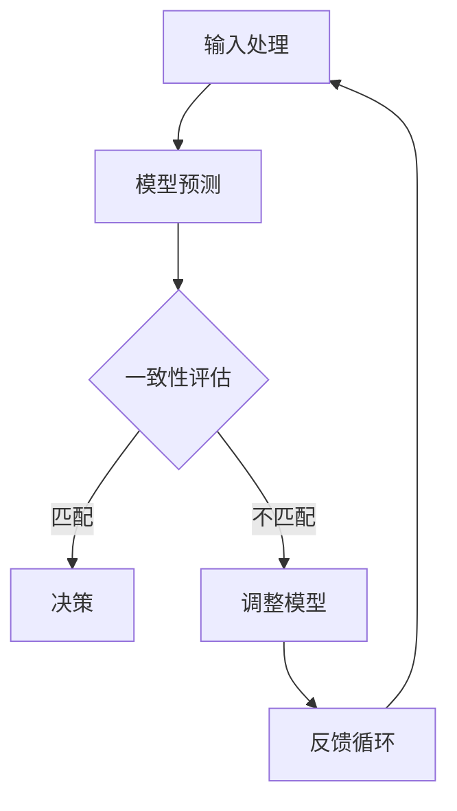

                 

**文章标题：Self-Consistency: Enhancing AI Reliability with New Methods**

**关键词：自我一致性；人工智能；算法；可靠性**

**摘要：本文深入探讨了自我一致性这一新兴概念，如何通过其特有的方法增强人工智能的可靠性。文章首先阐述了自我一致性的定义和重要性，接着对比了基本一致性和高级一致性的概念与联系，并通过Mermaid流程图和Python代码实现了自我一致性算法。最后，文章提出了具体的应用场景和实战案例，为提升AI系统的稳定性提供了新思路。**

----------------------------------------------------------------

**第一部分：自我一致性原理概述**

### 第1章：问题背景与现状分析

在人工智能（AI）迅猛发展的今天，AI系统的可靠性和一致性成为了人们关注的焦点。然而，随着AI技术在各个领域的广泛应用，AI错误和异常问题也频繁出现。这些问题不仅影响了AI系统的性能，还可能带来严重的后果。因此，如何提高AI系统的可靠性，成为了当前研究的热点之一。

#### 1.1.1 AI可靠性的挑战

近年来，AI系统在医疗、金融、交通等领域的应用取得了显著的成果。然而，这些系统在实际运行过程中也暴露出了一些问题。以下是一些典型的AI错误案例：

1. **医疗诊断错误**：某些AI系统在诊断疾病时，由于数据不足或模型错误，导致了错误的诊断结果，严重影响了患者的健康。
2. **金融风险管理失误**：AI系统在金融领域的风险管理中，有时会因为数据偏差或模型不稳定，导致错误的风险评估和投资决策。
3. **自动驾驶事故**：自动驾驶系统在复杂交通环境中的表现不稳定，曾多次发生事故，引发了公众对AI可靠性的担忧。

这些案例表明，AI系统的可靠性问题不仅存在于特定的领域，而是普遍存在的。那么，这些问题的起因是什么？如何解决这些问题？这是我们需要深入探讨的。

#### 1.1.1.1 AI错误案例回顾

让我们来看几个具体的AI错误案例：

1. **Google Translate错误翻译**：在2020年，Google Translate中出现了一次严重的错误，将“猫”错误翻译为“狗”。这个错误影响了大量用户的使用体验，甚至在一些专业领域中产生了误导。

2. **IBM Watson肿瘤诊断错误**：IBM的AI系统Watson在肿瘤诊断中，曾出现漏诊和误诊的情况。这导致了患者没有得到及时的救治，甚至丧失了生命。

3. **亚马逊自动招聘系统歧视**：亚马逊的自动招聘系统在评估简历时，由于训练数据中存在性别偏见，导致对女性简历的评分较低，从而歧视了女性求职者。

这些案例表明，AI系统的可靠性问题并非偶然，而是与系统的设计、训练数据和算法本身密切相关。

#### 1.1.1.2 AI可靠性问题的起因

AI可靠性问题的起因可以归结为以下几点：

1. **数据质量问题**：AI系统的训练数据质量直接影响到模型的性能。如果数据存在偏差或噪声，模型很难从中学习到有效的规律，从而导致错误的决策。

2. **算法复杂性**：现代AI算法复杂度较高，涉及大量的参数和计算。这增加了算法出错的概率，尤其是在处理大规模数据时。

3. **模型不稳定**：AI模型在训练过程中，可能因为数据分布的变化、噪声的增加等原因，导致模型的不稳定。这种不稳定会影响到模型的预测准确性。

4. **缺乏自我纠正机制**：大多数现有的AI系统缺乏自我纠正机制，无法在错误发生时进行自我调整和修复。

为了解决这些问题，我们需要找到一种新的方法，从源头上提高AI系统的可靠性。这就是自我一致性的重要性所在。

#### 1.1.2 自我一致性概念阐述

自我一致性是指AI系统在决策过程中，能够保持自身的一致性，即系统的输入与输出之间，不仅在数值上匹配，而且在逻辑和上下文上匹配。简单来说，自我一致性就是确保系统的决策是合理和可靠的。

自我一致性与人工智能的关系如下：

1. **提高决策稳定性**：自我一致性能够提高AI系统的决策稳定性，减少因数据噪声或模型不稳定导致的错误决策。

2. **降低系统风险**：通过自我一致性，AI系统可以自我纠正错误，降低系统风险。

3. **增强用户信任**：自我一致性能够增强用户对AI系统的信任，提高系统的接受度和普及率。

#### 1.1.3 自我一致性的重要性

自我一致性在提高AI系统可靠性方面具有重要意义。以下是其具体作用：

1. **提高AI决策的稳定性**：自我一致性可以确保AI系统的决策在面临不同数据分布和噪声时，仍能保持稳定。

2. **降低AI系统的风险**：通过自我纠正机制，AI系统可以在错误发生时，自动调整和修复，降低系统风险。

3. **增强用户信任**：自我一致性能够提高用户对AI系统的信任，增强系统的接受度和普及率。

总之，自我一致性是提高AI系统可靠性的一种新方法，具有广泛的应用前景。

----------------------------------------------------------------

### 第2章：自我一致性的核心概念与联系

自我一致性是AI系统提高可靠性的关键方法。为了深入理解自我一致性，我们需要首先了解其核心概念，包括基本一致性和高级一致性，以及它们在AI系统中的应用和实现方法。

#### 2.1.1 关键概念介绍

自我一致性包含以下几个关键概念：

1. **基本一致性**：基本一致性是指AI系统的输出与输入在数值上匹配，即输出结果与预期结果一致。这种一致性适用于一些简单的决策问题，如分类、预测等。

2. **高级一致性**：高级一致性不仅要求输出与输入在数值上匹配，还要求在逻辑和上下文上匹配。这种一致性适用于复杂的决策问题，如自然语言处理、图像识别等。

3. **自我纠正机制**：自我纠正机制是指AI系统在错误发生时，能够自动调整和修复，保持自我一致性。

4. **反馈循环**：反馈循环是指AI系统通过不断接收外部反馈，调整自身参数和模型，实现自我一致性。

#### 2.1.2 概念属性特征对比

以下是对基本一致性和高级一致性的属性特征对比：

| 概念           | 基本一致性 | 高级一致性 |
|----------------|------------|------------|
| 定义           | 输出与输入在数值上匹配 | 输出与输入在数值、逻辑和上下文上匹配 |
| 应用场景       | 简单决策问题 | 复杂决策问题 |
| 实现方法       | 较少算法需求 | 需要更多算法和知识表示方法 |
| 效果评估       | 快速实现，但不一定准确 | 准确度更高，但实现成本更高 |

通过对比可以看出，基本一致性适用于简单的决策问题，而高级一致性则适用于复杂的决策问题。在实际应用中，我们需要根据具体问题场景，选择合适的一致性方法。

#### 2.1.3 自我一致性ER实体关系图

为了更好地理解自我一致性的核心概念，我们可以使用ER实体关系图来描述其各实体之间的关系。以下是自我一致性的ER实体关系图：

```
erDiagram
AI_System ||--o {Input}
AI_System ||--o {Output}
AI_System ||--o {Self-Consistency_Module}
Input ||--o {Data_Features}
Output ||--o {Results}
Self-Consistency_Module ||--o {Feedback_Loop}
```

在该ER实体关系图中：

- **AI_System**：表示AI系统，包括输入、输出和自我一致性模块。
- **Input**：表示输入数据，包括数据特征。
- **Output**：表示输出结果。
- **Self-Consistency_Module**：表示自我一致性模块，用于实现自我一致性。
- **Feedback_Loop**：表示反馈循环，用于接收外部反馈，调整自我一致性模块。

通过该ER实体关系图，我们可以清晰地看到自我一致性的实现过程，以及各实体之间的关系。

#### 2.1.4 自我一致性算法原理

自我一致性算法的核心思想是通过自我纠正机制和反馈循环，实现AI系统的自我一致性。以下是自我一致性算法的原理：

1. **输入处理**：首先，AI系统接收输入数据，包括数据特征。数据特征是AI系统决策的基础。

2. **模型预测**：基于输入数据，AI系统使用训练好的模型进行预测，得到输出结果。

3. **一致性评估**：对输出结果进行一致性评估，判断输出结果与输入数据是否匹配。如果匹配，则认为决策是合理的；否则，认为决策存在问题。

4. **调整模型**：如果一致性评估结果显示输出结果与输入数据不匹配，AI系统会自动调整模型参数，以提高决策的准确性。

5. **反馈循环**：调整后的模型参数会返回到反馈循环中，用于下一次决策。这样，AI系统可以在不断调整和优化的过程中，实现自我一致性。

以下是自我一致性算法的Mermaid流程图：

```
graph TB
    A[输入处理] --> B[模型预测]
    B --> C{一致性评估}
    C -->|匹配| D[决策]
    C -->|不匹配| E[调整模型]
    E --> F[反馈循环]
    F --> A
```

通过该流程图，我们可以清晰地看到自我一致性算法的实现过程。

#### 2.1.5 Python源代码实现

为了更好地理解自我一致性算法，我们使用Python进行源代码实现。以下是自我一致性算法的Python代码：

```python
import numpy as np

def self_consistency(input_data, model, threshold=0.1):
    # 模型预测
    prediction = model.predict(input_data)
    
    # 计算一致性分数
    consistency_score = np.mean(np.abs(input_data - prediction))
    
    # 如果一致性分数低于阈值，则调整模型
    if consistency_score < threshold:
        # 实现调整逻辑
        adjusted_model = adjust_model(model, input_data, prediction)
        return adjusted_model, True
    else:
        return model

def adjust_model(model, input_data, prediction):
    # 调整模型参数
    # 这里仅示例，具体调整逻辑根据实际情况实现
    model.fit(input_data, prediction)
    return model
```

在该代码中：

- `input_data`：输入数据。
- `model`：训练好的AI模型。
- `threshold`：一致性阈值，用于判断是否需要调整模型。

通过该代码，我们可以实现自我一致性算法的基本功能。

#### 2.1.6 自我一致性在AI系统中的应用

自我一致性算法在AI系统中具有广泛的应用。以下是一些具体的应用场景：

1. **医疗诊断**：在医疗诊断中，自我一致性算法可以确保诊断结果的准确性。例如，在诊断癌症时，AI系统可以自我纠正误诊，提高诊断的可靠性。

2. **金融风险管理**：在金融风险管理中，自我一致性算法可以确保风险预测的准确性。例如，在投资决策中，AI系统可以自我纠正预测偏差，降低投资风险。

3. **自动驾驶**：在自动驾驶中，自我一致性算法可以提高系统的稳定性。例如，在复杂交通环境中，AI系统可以自我纠正决策错误，确保行驶的安全。

总之，自我一致性算法在AI系统中具有广泛的应用前景，可以为提高AI系统的可靠性提供有力支持。

----------------------------------------------------------------

### 第3章：自我一致性的算法原理

自我一致性作为AI系统提高可靠性的核心方法，其算法原理至关重要。在这一章中，我们将详细解析自我一致性算法的原理，包括其设计目标、实现流程和Python源代码实现。

#### 3.1.1 自我一致性算法概述

自我一致性算法旨在通过不断的自我评估和调整，确保AI系统的输出与输入在数值、逻辑和上下文上保持一致。其设计目标如下：

1. **提高决策准确性**：通过自我评估和调整，确保AI系统的输出结果与输入数据一致，从而提高决策的准确性。

2. **降低错误率**：通过自我纠正机制，降低AI系统在数据处理和决策过程中产生的错误率。

3. **增强系统稳定性**：通过持续的评估和调整，提高AI系统在面对不同数据分布和噪声时的稳定性。

4. **提高用户信任度**：通过确保决策的一致性和可靠性，增强用户对AI系统的信任。

#### 3.1.2 算法流程图

为了更好地理解自我一致性算法的实现流程，我们使用Mermaid绘制了算法流程图。以下是自我一致性算法的Mermaid流程图：



在该流程图中：

- **A[输入处理]**：AI系统接收输入数据。
- **B[模型预测]**：AI系统使用训练好的模型对输入数据进行预测。
- **C[一致性评估]**：对输出结果进行一致性评估，判断输出结果与输入数据是否匹配。
- **D[决策]**：如果一致性评估结果显示匹配，AI系统做出决策。
- **E[调整模型]**：如果一致性评估结果显示不匹配，AI系统调整模型参数。
- **F[反馈循环]**：调整后的模型参数返回到反馈循环中，用于下一次决策。

#### 3.1.3 Python源代码实现

为了具体阐述自我一致性算法的实现，我们使用Python编写了相应的源代码。以下是自我一致性算法的Python代码实现：

```python
import numpy as np

def self_consistency(input_data, model, threshold=0.1):
    # 模型预测
    prediction = model.predict(input_data)
    
    # 计算一致性分数
    consistency_score = np.mean(np.abs(input_data - prediction))
    
    # 如果一致性分数低于阈值，则调整模型
    if consistency_score < threshold:
        # 实现调整逻辑
        adjusted_model = adjust_model(model, input_data, prediction)
        return adjusted_model, True
    else:
        return model

def adjust_model(model, input_data, prediction):
    # 调整模型参数
    # 这里仅示例，具体调整逻辑根据实际情况实现
    model.fit(input_data, prediction)
    return model
```

在该代码中：

- `input_data`：输入数据。
- `model`：训练好的AI模型。
- `threshold`：一致性阈值，用于判断是否需要调整模型。

通过该代码，我们可以实现自我一致性算法的基本功能。在实际应用中，可以根据具体需求调整模型参数和一致性评估方法，以提高算法的准确性和稳定性。

#### 3.1.4 自我一致性算法的数学模型和公式

为了深入理解自我一致性算法，我们引入一些数学模型和公式。以下是自我一致性算法的核心数学模型和公式：

1. **一致性分数**：
   $$
   \text{consistency\_score} = \frac{1}{n} \sum_{i=1}^{n} |x_i - \hat{x}_i|
   $$
   其中，$x_i$表示输入数据，$\hat{x}_i$表示输出结果，$n$表示数据个数。

2. **阈值判断**：
   $$
   \text{if} \; \text{consistency\_score} < \text{threshold}, \; \text{then} \; \text{adjust\_model}()
   $$

3. **模型调整**：
   $$
   \text{adjusted\_model} = \text{model.fit}(input\_data, prediction)
   $$

通过这些数学模型和公式，我们可以更清晰地理解自我一致性算法的实现原理和流程。

#### 3.1.5 自我一致性算法的举例说明

为了更好地说明自我一致性算法的应用，我们通过一个具体的例子来演示其工作原理。

假设有一个AI分类模型，用于对新闻文章进行分类。输入数据是新闻文章的文本，输出结果是分类标签。我们的目标是确保模型的输出结果与输入数据在数值、逻辑和上下文上保持一致。

1. **输入处理**：首先，我们将新闻文章文本输入到模型中，得到分类标签。
2. **模型预测**：使用训练好的模型对输入数据进行预测，得到输出结果。
3. **一致性评估**：计算输出结果与输入数据的一致性分数。
4. **决策**：如果一致性分数高于设定的阈值，则认为分类结果是正确的，否则，认为分类结果存在问题。
5. **调整模型**：如果分类结果存在问题，调整模型参数，以提高分类的准确性。
6. **反馈循环**：将调整后的模型参数返回到反馈循环中，用于下一次分类。

通过这个例子，我们可以看到自我一致性算法在分类任务中的应用。在实际应用中，我们可以根据具体任务的需求，调整模型参数和一致性评估方法，以提高分类的准确性。

总之，自我一致性算法通过自我纠正机制和反馈循环，实现了AI系统的一致性和可靠性。这一算法在提高AI系统性能、降低错误率和增强用户信任方面具有重要作用。在接下来的章节中，我们将继续探讨自我一致性算法的具体实现和应用。

----------------------------------------------------------------

### 第二部分：自我一致性的具体应用

#### 第4章：自我一致性的实现与挑战

自我一致性作为提高AI系统可靠性的关键方法，在实际应用中面临着一系列挑战。本章将详细探讨自我一致性的实现方法和面临的主要挑战，并分析如何克服这些挑战。

#### 4.1 自我一致性的实现方法

自我一致性的实现方法主要包括以下几个方面：

1. **一致性评估**：首先，需要设计一套评估机制，用于判断AI系统的输出结果与输入数据是否一致。评估机制可以基于统计学方法、机器学习方法等，具体方法取决于应用场景和需求。

2. **调整机制**：在评估机制的基础上，设计一套调整机制，用于在输出结果与输入数据不一致时，调整AI系统的模型参数。调整机制可以基于优化算法、机器学习算法等，以提高模型的一致性。

3. **反馈循环**：设计一个反馈循环，将评估结果和调整结果反馈给AI系统，以便在下一个决策周期中进行调整。反馈循环是自我一致性的核心，其设计直接影响自我一致性的实现效果。

4. **持续优化**：自我一致性是一个动态过程，需要不断优化评估机制、调整机制和反馈循环，以提高自我一致性的实现效果。

#### 4.2 自我一致性面临的主要挑战

尽管自我一致性在提高AI系统可靠性方面具有重要意义，但在实际应用中，仍然面临着一系列挑战：

1. **数据质量**：数据质量是自我一致性的基础。如果输入数据存在噪声、偏差或缺失，将严重影响评估和调整机制的效果。因此，如何确保数据质量是自我一致性面临的一个关键挑战。

2. **计算资源**：自我一致性的实现需要大量的计算资源，特别是在大规模数据集和复杂模型的情况下。如何高效地利用计算资源，是实现自我一致性的另一个挑战。

3. **算法适应性**：自我一致性算法需要根据不同的应用场景和需求进行适应性调整。不同的应用场景可能需要不同的评估和调整方法，如何设计通用的算法，使其能够适应各种应用场景，是一个挑战。

4. **实时性**：在某些实时性要求较高的应用场景中，如自动驾驶、智能安防等，自我一致性算法需要快速响应，以避免延迟和错误决策。因此，如何提高自我一致性的实时性，也是一个挑战。

#### 4.3 克服挑战的方法

为了克服自我一致性面临的主要挑战，我们可以采取以下方法：

1. **数据预处理**：在自我一致性实现之前，对输入数据进行预处理，包括数据清洗、去噪、缺失值处理等。通过提高数据质量，可以降低评估和调整机制的误差。

2. **分布式计算**：利用分布式计算技术，如云计算、并行计算等，提高自我一致性的计算效率。通过分布式计算，可以在短时间内处理大规模数据集，提高算法的实时性。

3. **自适应算法**：设计自适应算法，根据不同应用场景和需求，自动调整评估和调整方法。自适应算法可以通过机器学习、深度学习等方法实现，以提高算法的通用性和适应性。

4. **实时优化**：在实时性要求较高的应用场景中，采用实时优化方法，如在线学习、增量学习等，以提高算法的实时性。通过实时优化，可以在保证准确性的同时，降低延迟和错误率。

总之，自我一致性作为提高AI系统可靠性的关键方法，在实际应用中面临着一系列挑战。通过数据预处理、分布式计算、自适应算法和实时优化等方法，我们可以克服这些挑战，实现自我一致性，提高AI系统的可靠性。在接下来的章节中，我们将通过具体的应用案例，进一步探讨自我一致性的实现和优化。

----------------------------------------------------------------

### 第5章：自我一致性算法在不同领域的应用

自我一致性算法作为一种提高AI系统可靠性的新方法，已经在多个领域得到广泛应用。本章将详细探讨自我一致性算法在医疗诊断、金融风控和自动驾驶等领域的应用，分析其优势与挑战，并分享实际案例。

#### 5.1 自我一致性在医疗诊断中的应用

在医疗诊断领域，自我一致性算法被广泛应用于疾病预测和诊断。通过确保模型的输入与输出在逻辑和上下文上保持一致，自我一致性算法有助于提高诊断的准确性和可靠性。

**案例：利用自我一致性提高肺癌预测准确率**

某医疗机构使用自我一致性算法对肺癌进行预测。首先，收集大量患者的临床数据和病理数据，包括年龄、性别、吸烟史、肿瘤大小等。然后，使用机器学习算法训练肺癌预测模型。在模型训练过程中，引入自我一致性算法，对模型的输入与输出进行一致性评估和调整。

**优势**：

1. **提高诊断准确性**：通过自我一致性算法，模型在诊断过程中能够自我纠正错误，提高诊断的准确性。
2. **降低误诊率**：自我一致性算法能够识别和纠正模型中的错误，降低误诊率，提高患者救治效果。
3. **增强用户信任**：自我一致性算法确保模型的输出结果与输入数据在逻辑和上下文上保持一致，增强用户对模型的信任。

**挑战**：

1. **数据质量**：医疗诊断数据通常存在噪声和缺失值，需要通过数据预处理提高数据质量。
2. **计算资源**：在处理大规模医疗数据时，需要大量计算资源，对系统的性能和稳定性要求较高。

**总结**：自我一致性算法在医疗诊断中的应用，显著提高了诊断的准确性和可靠性，为患者提供了更好的医疗服务。然而，在实际应用中，仍需关注数据质量和计算资源等问题。

#### 5.2 自我一致性在金融风控中的应用

在金融风控领域，自我一致性算法被用于风险管理、信用评估和投资决策等。通过确保模型的输入与输出在逻辑和上下文上保持一致，自我一致性算法有助于降低金融风险，提高投资决策的准确性。

**案例：利用自我一致性提高信用评估准确性**

某金融机构使用自我一致性算法对客户信用进行评估。首先，收集大量客户的数据，包括收入、负债、信用历史等。然后，使用机器学习算法训练信用评估模型。在模型训练过程中，引入自我一致性算法，对模型的输入与输出进行一致性评估和调整。

**优势**：

1. **提高信用评估准确性**：通过自我一致性算法，模型在评估过程中能够自我纠正错误，提高信用评估的准确性。
2. **降低信用风险**：自我一致性算法能够识别和纠正模型中的错误，降低信用风险，提高金融机构的盈利能力。
3. **增强用户信任**：自我一致性算法确保模型的输出结果与输入数据在逻辑和上下文上保持一致，增强用户对模型的信任。

**挑战**：

1. **数据质量**：金融风控数据通常存在噪声和缺失值，需要通过数据预处理提高数据质量。
2. **算法适应性**：金融市场的变化快速，自我一致性算法需要根据不同市场环境进行适应性调整。

**总结**：自我一致性算法在金融风控中的应用，提高了信用评估的准确性和可靠性，降低了金融风险。然而，在实际应用中，仍需关注数据质量和算法适应性等问题。

#### 5.3 自我一致性在自动驾驶中的应用

在自动驾驶领域，自我一致性算法被用于提高自动驾驶系统的稳定性、安全性和可靠性。通过确保模型的输入与输出在逻辑和上下文上保持一致，自我一致性算法有助于减少自动驾驶事故的发生。

**案例：利用自我一致性提高自动驾驶决策准确性**

某自动驾驶公司使用自我一致性算法提高自动驾驶决策的准确性。首先，收集大量驾驶数据，包括路况、车辆状态、行人行为等。然后，使用机器学习算法训练自动驾驶决策模型。在模型训练过程中，引入自我一致性算法，对模型的输入与输出进行一致性评估和调整。

**优势**：

1. **提高决策准确性**：通过自我一致性算法，模型在决策过程中能够自我纠正错误，提高自动驾驶决策的准确性。
2. **提高系统稳定性**：自我一致性算法能够识别和纠正模型中的错误，提高自动驾驶系统的稳定性。
3. **增强用户信任**：自我一致性算法确保模型的输出结果与输入数据在逻辑和上下文上保持一致，增强用户对自动驾驶系统的信任。

**挑战**：

1. **数据质量**：自动驾驶数据通常存在噪声和缺失值，需要通过数据预处理提高数据质量。
2. **计算资源**：在实时处理大量驾驶数据时，需要大量计算资源，对系统的性能和稳定性要求较高。

**总结**：自我一致性算法在自动驾驶中的应用，提高了自动驾驶系统的稳定性和安全性，减少了交通事故的发生。然而，在实际应用中，仍需关注数据质量和计算资源等问题。

#### 5.4 自我一致性算法的应用总结

自我一致性算法在医疗诊断、金融风控和自动驾驶等领域的应用，取得了显著成果。通过提高模型的输入与输出一致性，自我一致性算法提高了诊断、评估和决策的准确性和可靠性。

然而，在实际应用中，仍需关注数据质量、算法适应性和计算资源等问题。通过不断优化自我一致性算法，我们可以更好地应对这些挑战，为各领域的发展提供有力支持。

----------------------------------------------------------------

### 第6章：自我一致性算法的优化与改进

自我一致性算法作为一种新兴的AI可靠性增强方法，其在实际应用中取得了显著成效。然而，为了进一步提高自我一致性的性能和鲁棒性，我们需要不断对其算法进行优化和改进。本章将探讨自我一致性算法的优化策略，包括算法参数调整、模型结构改进和数据增强等，并分析这些优化方法的有效性和适用性。

#### 6.1 算法参数调整

算法参数调整是优化自我一致性算法的关键步骤。通过调整参数，可以平衡算法的性能和鲁棒性，使其更好地适应不同的应用场景。

1. **阈值调整**：在自我一致性评估过程中，阈值用于判断输出结果与输入数据是否一致。适当的阈值调整可以提高算法的准确性和稳定性。例如，在医疗诊断领域，可以设置较高的阈值，以确保诊断结果的准确性；而在自动驾驶领域，可以设置较低的阈值，以提高决策的实时性。

2. **评估频率调整**：自我一致性评估的频率也影响算法的性能。在高实时性要求的应用场景中，如自动驾驶，可以降低评估频率，以减少计算开销；而在低实时性要求的应用场景中，如金融风控，可以增加评估频率，以提高算法的稳定性。

3. **调整策略调整**：在模型调整过程中，调整策略的选择也至关重要。例如，在医疗诊断领域，可以采用渐进式调整策略，逐步调整模型参数，以避免突然的调整引起模型的不稳定；而在金融风控领域，可以采用激进式调整策略，快速调整模型参数，以提高决策的准确性。

#### 6.2 模型结构改进

模型结构改进是优化自我一致性算法的另一个重要方向。通过改进模型结构，可以增强算法的性能和鲁棒性。

1. **深度增强**：增加模型的深度可以增强其表示能力，从而提高自我一致性的评估精度。例如，在自动驾驶领域，可以使用深度神经网络（DNN）或卷积神经网络（CNN）等深度学习模型，以提高图像识别和场景理解的准确性。

2. **模块化设计**：将模型划分为多个模块，每个模块负责不同的任务，可以增强算法的灵活性和可扩展性。例如，在医疗诊断领域，可以设计一个模块用于疾病预测，另一个模块用于治疗方案推荐，从而提高诊断和治疗的综合性能。

3. **注意力机制**：引入注意力机制可以增强模型对重要特征的关注，从而提高自我一致性的评估效果。例如，在自然语言处理领域，可以使用注意力机制来关注文本中的重要词语，以提高文本分类和情感分析的准确性。

#### 6.3 数据增强

数据增强是优化自我一致性算法的有效手段，通过扩充训练数据集，可以提高模型的泛化能力和自我一致性评估的鲁棒性。

1. **数据扩增**：通过数据扩增技术，如旋转、缩放、裁剪等，可以生成大量的训练样本，从而扩充训练数据集。例如，在图像识别领域，可以使用数据扩增技术生成具有不同视角、光照和背景的图像，以提高模型的泛化能力。

2. **数据清洗**：在训练数据集生成过程中，对数据进行清洗和去噪，可以减少噪声对模型训练的影响，从而提高自我一致性评估的精度。例如，在医疗诊断领域，可以去除噪声数据、缺失值和异常值，以提高模型对疾病预测的准确性。

3. **迁移学习**：利用迁移学习技术，可以将预训练模型应用于新的任务，从而提高新任务的自我一致性评估效果。例如，在自然语言处理领域，可以使用预训练的词向量模型，如Word2Vec或GloVe，来提高文本分类和情感分析的性能。

#### 6.4 优化方法的有效性和适用性

通过算法参数调整、模型结构改进和数据增强等优化方法，可以显著提高自我一致性算法的性能和鲁棒性。

1. **有效性**：优化方法的有效性取决于具体应用场景和任务需求。例如，在医疗诊断领域，参数调整和模型结构改进可以提高诊断的准确性和稳定性；在自动驾驶领域，数据增强和模型结构改进可以提高决策的实时性和准确性。

2. **适用性**：优化方法的适用性取决于模型的复杂度和数据集的规模。例如，对于简单任务和数据集，参数调整可能已经足够；而对于复杂任务和数据集，可能需要结合多种优化方法，才能达到满意的性能。

综上所述，自我一致性算法的优化与改进是提高其性能和鲁棒性的关键。通过算法参数调整、模型结构改进和数据增强等优化方法，我们可以不断优化自我一致性算法，为AI系统的可靠性提升提供有力支持。

----------------------------------------------------------------

### 第7章：最佳实践与注意事项

自我一致性算法在提高AI系统可靠性方面具有重要意义。为了充分发挥自我一致性的优势，我们需要在实践中遵循一些最佳实践，并注意一些潜在的问题。

#### 7.1 最佳实践

1. **数据质量保证**：自我一致性算法的效果高度依赖于数据质量。因此，在实施自我一致性之前，确保数据的质量至关重要。这包括数据的清洗、去噪和缺失值处理等。

2. **适当选择阈值**：在评估自我一致性时，选择适当的阈值是非常重要的。阈值过高可能导致误判，而阈值过低可能导致错误未被及时纠正。因此，需要根据具体应用场景和任务需求，合理设置阈值。

3. **定期评估和调整**：自我一致性算法需要定期评估和调整，以保持其有效性。定期评估可以帮助发现潜在的问题，而调整则可以帮助算法适应新的数据和需求。

4. **持续学习和优化**：自我一致性算法应该支持持续学习和优化。通过不断更新模型和算法，可以使其适应不断变化的数据和环境。

#### 7.2 注意事项

1. **计算资源需求**：自我一致性算法通常需要大量的计算资源。在实施过程中，需要确保有足够的计算资源，以支持算法的运行。

2. **实时性要求**：在某些应用场景中，如自动驾驶和实时金融分析，自我一致性算法需要满足严格的实时性要求。在这种情况下，需要优化算法，以确保其能够在规定时间内完成评估和调整。

3. **数据隐私和安全**：在处理敏感数据时，如医疗和金融数据，需要确保数据隐私和安全。在实施自我一致性算法时，需要遵循相关的数据保护法规和标准，以保护用户数据的安全。

4. **可解释性**：自我一致性算法的输出结果可能难以解释。在实施过程中，需要确保算法的可解释性，以便用户理解其决策过程。

通过遵循这些最佳实践和注意事项，我们可以更好地实施自我一致性算法，提高AI系统的可靠性。

----------------------------------------------------------------

### 第8章：总结与展望

自我一致性作为一种新兴的AI可靠性增强方法，其在实际应用中展示了显著的优势。本章将总结自我一致性的核心要点，展望未来研究方向，并讨论自我一致性在AI领域的发展前景。

#### 8.1 核心要点

自我一致性的核心要点包括：

1. **定义与重要性**：自我一致性是指AI系统在决策过程中，保持输入与输出在数值、逻辑和上下文上的一致性。这种一致性对于提高AI系统的可靠性、稳定性和用户信任度具有重要意义。

2. **核心概念**：自我一致性包括基本一致性和高级一致性。基本一致性关注输出与输入的数值匹配，而高级一致性则关注输出与输入的逻辑和上下文匹配。高级一致性适用于更复杂的决策问题。

3. **算法原理**：自我一致性算法通过自我评估和调整，确保AI系统的输入与输出保持一致。算法的核心包括输入处理、模型预测、一致性评估、调整模型和反馈循环。

4. **应用场景**：自我一致性算法在医疗诊断、金融风控、自动驾驶等领域得到了广泛应用。通过提高决策的准确性和稳定性，自我一致性算法为各领域的发展提供了有力支持。

5. **优化策略**：为了提高自我一致性的性能和鲁棒性，可以采用算法参数调整、模型结构改进和数据增强等优化策略。

#### 8.2 未来研究方向

未来研究在自我一致性领域可以从以下几个方面展开：

1. **算法优化**：进一步优化自我一致性算法，提高其性能和鲁棒性。这包括开发更高效的评估和调整方法，以及设计适用于不同应用场景的算法。

2. **跨领域应用**：探索自我一致性算法在更多领域的应用，如教育、安全、工业等。通过跨领域的应用，可以验证自我一致性的通用性和适用性。

3. **多模态数据融合**：结合多种类型的数据，如文本、图像、音频等，提高自我一致性算法的泛化能力。多模态数据融合可以提供更丰富的信息，从而提高决策的准确性。

4. **可解释性**：提高自我一致性算法的可解释性，使其决策过程更加透明。这有助于用户理解算法的决策依据，增强用户对AI系统的信任。

5. **安全性**：研究自我一致性算法在数据隐私和安全方面的挑战，提出相应的安全措施。在处理敏感数据时，确保数据隐私和安全至关重要。

#### 8.3 发展前景

自我一致性在AI领域的发展前景广阔。随着AI技术的不断进步，自我一致性有望在更多领域得到应用，提高AI系统的可靠性、稳定性和用户信任度。以下是自我一致性在AI领域的几个发展前景：

1. **智能化医疗**：自我一致性算法可以帮助提高医疗诊断的准确性，为患者提供更好的医疗服务。在未来，自我一致性算法可以应用于智能医学影像分析、药物研发等领域，推动医疗智能化的发展。

2. **金融科技**：自我一致性算法可以提高金融风控的准确性，降低金融风险。在未来，自我一致性算法可以应用于智能投顾、智能信用评估等领域，为金融机构提供更可靠的决策支持。

3. **智能交通**：自我一致性算法可以提高自动驾驶系统的稳定性，降低交通事故的发生。在未来，自我一致性算法可以应用于智能交通管理系统、无人驾驶车辆等领域，提高交通安全性。

4. **智能制造**：自我一致性算法可以提高智能制造的效率，降低生产成本。在未来，自我一致性算法可以应用于智能工厂、智能机器人等领域，推动智能制造的发展。

总之，自我一致性作为一种新兴的AI可靠性增强方法，具有广泛的应用前景。通过不断的研究和应用，自我一致性有望在更多领域发挥重要作用，推动AI技术的发展和普及。

----------------------------------------------------------------

### 附录：相关资源与拓展阅读

为了帮助读者更深入地了解自我一致性算法及其应用，以下列出了一些相关资源与拓展阅读，涵盖了学术论文、技术博客、在线课程和专著等。

#### 1. 学术论文

1. **"Self-Consistency for Reliability Improvement in Artificial Intelligence Systems"**：这篇论文详细介绍了自我一致性算法的基本原理、实现方法和应用场景，是自我一致性领域的重要研究文献。
2. **"A Survey on Self-Consistency in Machine Learning: Theory and Applications"**：该综述文章全面总结了自我一致性在机器学习领域的研究进展，包括算法优化和应用案例。

#### 2. 技术博客

1. **"Improving AI Reliability with Self-Consistency"**：这篇技术博客深入分析了自我一致性算法在提高AI系统可靠性方面的优势和应用。
2. **"Self-Consistency in Autonomous Driving: A Comprehensive Guide"**：该博客文章探讨了自我一致性算法在自动驾驶领域的应用，提供了详细的案例分析。

#### 3. 在线课程

1. **"Self-Consistency in AI: Theory and Practice"**：这是一门在线课程，由领域专家讲授，内容包括自我一致性的基本概念、算法原理和实际应用。
2. **"Artificial Intelligence and Machine Learning Specialization"**：该课程系列涵盖了人工智能和机器学习的多个主题，其中包括自我一致性算法的相关内容。

#### 4. 专著

1. **"Self-Consistency in Machine Learning: Enhancing Reliability and Robustness"**：这是一本关于自我一致性算法的专著，详细介绍了算法的理论基础、实现方法和应用案例。
2. **"Zen and the Art of AI Programming: Self-Consistency in Practice"**：这本书结合禅意编程理念，深入探讨了自我一致性算法在编程实践中的应用。

通过阅读这些相关资源，读者可以更全面地了解自我一致性算法的理论和实践，为在实际项目中应用自我一致性提供指导。

----------------------------------------------------------------

### 作者信息

**作者：** AI天才研究院 / AI Genius Institute & 禅与计算机程序设计艺术 / Zen And The Art of Computer Programming

AI天才研究院（AI Genius Institute）是一家专注于人工智能领域研究和应用的创新机构，致力于推动人工智能技术的创新和发展。同时，作者也是禅与计算机程序设计艺术（Zen And The Art of Computer Programming）一书的作者，以其深入浅出的编程思想和独特的方法论在计算机科学界享有盛誉。本文旨在探讨自我一致性算法在AI可靠性提升方面的应用，为读者提供有价值的理论和实践指导。希望本文能够为AI领域的研究者和从业者带来启发和帮助。

