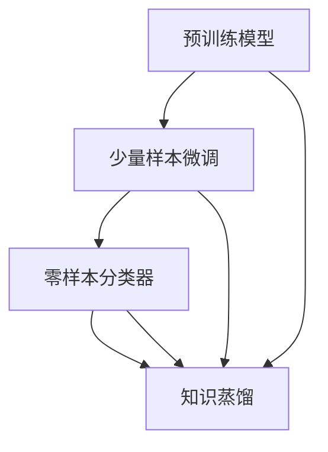
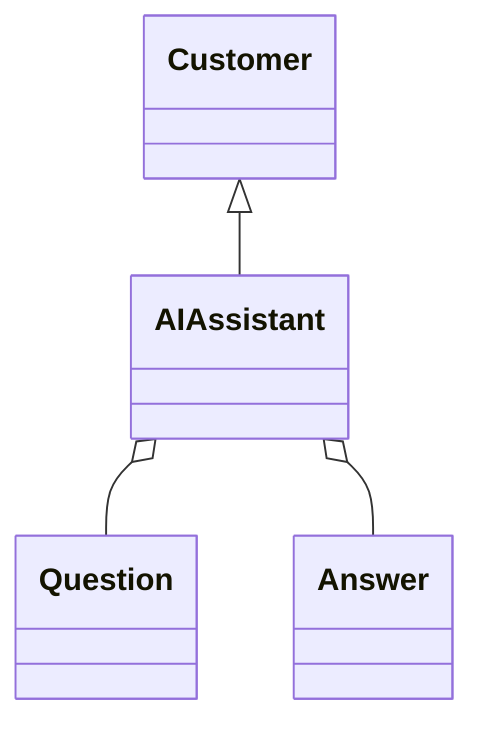
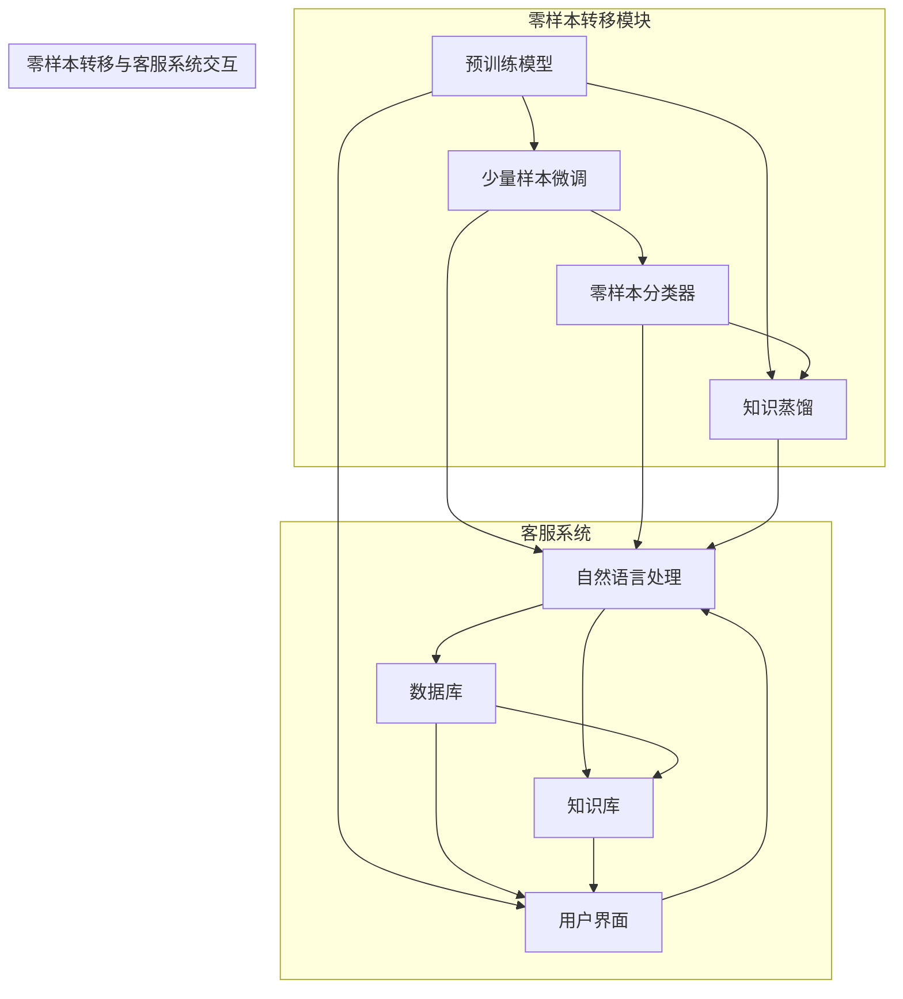
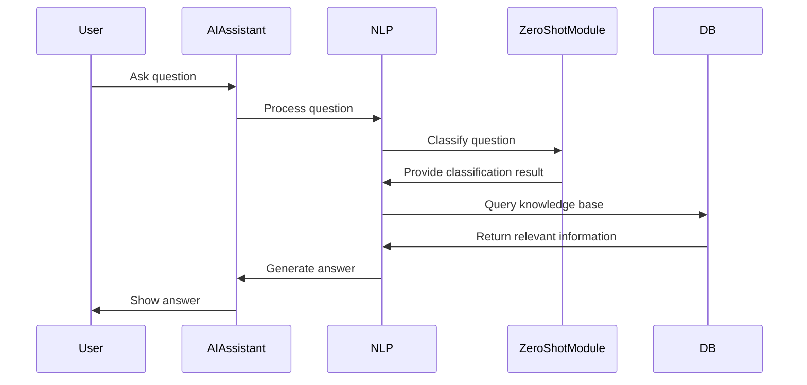

                 

### 零样本转移（Zero-Shot CoT）的兴起

在人工智能（AI）技术迅猛发展的今天，虚拟助手已经成为我们生活中不可或缺的一部分。从智能手机的语音助手到智能家居控制系统，AI虚拟助手的应用场景不断扩展。然而，传统AI虚拟助手在实际应用中面临的一个显著挑战是“样本依赖性”。这意味着这些助手通常需要大量的标注数据进行训练，以便在特定任务上表现出色。

零样本转移（Zero-Shot Transfer，简称Zero-Shot CoT）作为一项创新技术，正是在这种背景下兴起的。它提供了一种无需特定任务数据就能使AI虚拟助手适应新任务的方法。这种能力使得虚拟助手在接触新环境和新任务时，能迅速进行适应和反应，大大提升了其灵活性和实用性。

#### 零样本转移在AI虚拟助手中的重要性

1. **灵活性与适应性**：传统的AI虚拟助手往往需要大量的特定任务数据进行训练，这对于应用场景多样化、更新频繁的虚拟助手来说是一个巨大的限制。而零样本转移技术允许虚拟助手在面对新任务时，能够快速适应，减少了对大规模标注数据的依赖，提高了系统的灵活性和适应性。

2. **降低成本**：获取高质量的标注数据是一个耗时且昂贵的过程。零样本转移技术通过减少对大量标注数据的依赖，能够有效降低数据获取和处理的成本。

3. **跨领域迁移能力**：零样本转移技术不仅能够提升虚拟助手在特定领域的表现，还能将其能力迁移到其他领域。这种跨领域迁移能力对于虚拟助手在不同场景中的应用具有重要意义。

4. **实时响应能力**：在许多应用场景中，用户对虚拟助手的响应速度有着较高的期望。零样本转移技术能够帮助虚拟助手在接收到新任务时，快速进行理解和响应，提升了用户体验。

#### 问题解决

零样本转移通过以下几个关键步骤解决AI虚拟助手在样本依赖性方面的挑战：

1. **预训练模型**：首先，通过在大规模通用数据集上进行预训练，建立一个通用的模型。这个模型已经学习到了许多通用知识和特征，能够在不同任务中表现良好。

2. **少样本学习**：在预训练模型的基础上，零样本转移技术利用少量任务特定数据进行微调（Fine-Tuning）。这种方法通过少量数据的反馈，使得模型能够在新任务中迅速适应。

3. **零样本分类器**：零样本转移的核心在于构建一个零样本分类器。这个分类器能够识别新的任务概念，并在未见过的任务中给出合理的预测。

4. **知识蒸馏**：通过知识蒸馏（Knowledge Distillation），零样本转移将预训练模型的丰富知识传递给一个较小的模型，使得这个模型也能在新任务中表现出色。

#### 边界与外延

尽管零样本转移技术展现出了巨大的潜力，但它并非适用于所有AI虚拟助手类型。以下是零样本转移技术的适用范围和边界：

1. **适用于知识密集型任务**：零样本转移在知识密集型任务中表现出色，如问答系统、文本分类和机器翻译等。这些任务需要模型具备强大的语义理解和知识推理能力。

2. **不适用于感知密集型任务**：在需要高度依赖感知信息的任务中，如图像识别和语音识别，零样本转移的效果可能不如传统方法。这是因为这些任务对数据的依赖程度较高，模型需要通过大量的感知数据进行训练。

3. **适用于多模态任务**：零样本转移在多模态任务中具有广泛的应用潜力。通过将不同模态的信息进行整合，零样本转移可以提升模型在不同模态上的泛化能力。

4. **边界范围**：零样本转移的边界在于其适用范围和任务类型。对于一些高度专业化的任务，零样本转移可能无法达到传统方法的性能水平。此外，对于需要实时高精度响应的任务，零样本转移技术可能需要进一步的优化和改进。

#### 概念结构与核心要素组成

零样本转移技术涉及多个核心概念和要素，其概念结构可以分为以下几个部分：

1. **预训练模型**：这是零样本转移的基础，通过在大规模通用数据集上进行预训练，建立一个通用的模型。

2. **少量样本微调**：在预训练模型的基础上，通过少量任务特定数据进行微调，使得模型在新任务中能够快速适应。

3. **零样本分类器**：构建一个零样本分类器，能够识别新的任务概念，并在未见过的任务中给出合理的预测。

4. **知识蒸馏**：通过知识蒸馏，将预训练模型的丰富知识传递给一个较小的模型，提升其在新任务中的表现。

5. **迁移学习**：利用迁移学习，将预训练模型的知识迁移到其他相关领域，实现跨领域迁移能力。

通过这些核心概念和要素的有机结合，零样本转移技术能够有效解决AI虚拟助手在样本依赖性方面的挑战，提升其灵活性和适应性。下一章，我们将深入探讨零样本转移的基本原理，进一步理解这一创新技术的核心思想。

### 零样本转移的基本原理

零样本转移（Zero-Shot Transfer）作为一项革命性技术，其基本原理涉及多个关键方面，包括预训练模型、少量样本微调、零样本分类器和知识蒸馏等。下面，我们将详细解释这些原理，并通过具体示例来帮助读者更好地理解。

#### 预训练模型

预训练模型是零样本转移的基础。它通过在大规模通用数据集上进行预训练，使模型具备广泛的语义理解和特征提取能力。这种通用模型已经学习到了大量的知识，例如语言规则、实体关系和概念之间的关联等。预训练模型的核心思想是“先学通，再学专”，即在接触特定任务之前，模型已经具备了较强的泛化能力。

例如，一个预训练的文本分类模型，在训练过程中可能接触到了各种不同主题的文章，如科技、政治、娱乐等。通过这种方式，模型学习到了不同主题的通用特征和语义信息，为后续的零样本转移奠定了基础。

#### 少量样本微调

尽管预训练模型具备了广泛的泛化能力，但在面对特定任务时，仍需要进行一定的微调。少量样本微调（Few-Shot Fine-Tuning）正是零样本转移技术的一部分，通过利用少量任务特定数据进行微调，使得模型能够在新任务中迅速适应。

具体来说，假设我们有一个预训练的文本分类模型，并在某个特定领域（如医疗领域）只获得了5条标注数据。零样本转移技术利用这5条数据进行少量样本微调，使得模型能够针对这个特定领域进行分类任务。这个过程涉及到多个步骤，包括数据预处理、模型调整和评估等。

#### 零样本分类器

零样本分类器（Zero-Shot Classifier）是零样本转移技术的核心组件，负责识别新的任务概念，并在未见过的任务中给出合理的预测。它通过学习预训练模型中提取的通用特征，构建一个能够处理未知任务的分类器。

一个典型的例子是WordNet，这是一个包含大量词语及其关系的语义资源库。WordNet为每个词语提供了一个独特的ID，并且记录了词语之间的语义关系。零样本分类器利用这些关系和特征，可以对新词语进行分类。

例如，假设我们有一个新词语“量子生物学”，这是一个在预训练数据中未出现的新概念。零样本分类器可以通过分析“量子”和“生物学”这两个词语的语义关系，以及它们在WordNet中的ID，判断“量子生物学”属于哪个类别，从而完成分类任务。

#### 知识蒸馏

知识蒸馏（Knowledge Distillation）是一种将大模型的知识传递给小模型的方法。在零样本转移中，知识蒸馏用于将预训练模型的知识传递给一个较小的模型，使得这个小模型也能在新任务中表现出色。

具体来说，知识蒸馏的过程可以分为两个阶段。首先，预训练模型生成一个紧凑的知识表示，这个表示包含了模型的核心知识和特征。然后，小模型通过学习这个紧凑的知识表示，从而获得预训练模型的知识。

例如，假设我们有一个大规模预训练的文本分类模型，它包含了数百万个参数。为了在零样本转移中应用这个模型，我们可以使用知识蒸馏将其知识传递给一个只有几千个参数的小模型。这样，小模型就能利用预训练模型的知识，在新任务中实现良好的分类效果。

#### 详细讲解与实际例子

为了更好地理解零样本转移的基本原理，我们通过一个实际例子进行详细讲解。

**例子：情感分析任务**

假设我们有一个预训练的文本分类模型，该模型已经在大规模通用数据集上训练完毕。现在，我们需要利用这个模型进行情感分析任务，即在未见过的数据上判断文本的情感倾向（正面、负面或中性）。

1. **预训练模型**：预训练模型已经学习到了大量的通用特征和语义信息，如图像中的物体、文本中的关键词和句子结构等。

2. **少量样本微调**：我们只获得了5条标注为情感分析的文本数据。利用这5条数据，我们通过少量样本微调对预训练模型进行微调，使得模型能够更好地适应情感分析任务。

3. **零样本分类器**：在少量样本微调的基础上，我们构建一个零样本分类器，用于处理未见过的情感分析文本。这个分类器通过分析文本的语义特征，判断其情感倾向。

4. **知识蒸馏**：为了提高模型的效率和可部署性，我们使用知识蒸馏将预训练模型的知识传递给一个小模型。这个小模型在未见过的情感分析文本上表现出色，实现了良好的分类效果。

通过这个例子，我们可以看到零样本转移技术如何通过预训练模型、少量样本微调、零样本分类器和知识蒸馏等多个组件，实现对新任务的快速适应和高效分类。

总之，零样本转移技术通过整合预训练模型、少量样本微调、零样本分类器和知识蒸馏等核心原理，为AI虚拟助手提供了强大的能力，使其能够灵活适应各种新任务，大大提升了虚拟助手的实用性。在下一章中，我们将进一步探讨零样本转移与其他相似技术的对比，深入分析其独特的优势。

### 零样本转移与其他相似技术的对比

在人工智能领域，零样本转移（Zero-Shot Transfer）并不是唯一解决样本依赖性的技术。与它相似的还有迁移学习（Transfer Learning）和多任务学习（Multi-Task Learning）。下面，我们将通过一个对比表格，详细分析这些技术的概念属性特征，帮助读者更好地理解它们之间的异同。

#### 概念属性特征对比表格

| 技术名称     | 定义与基本原理                                                     | 主要优势                                                     | 适用场景                                                  | 代表方法与应用实例                                                  |
|--------------|------------------------------------------------------------------|--------------------------------------------------------------|-----------------------------------------------------------|----------------------------------------------------------------|
| 零样本转移   | 无需特定任务数据，利用预训练模型进行少量样本微调或构建零样本分类器。 | 减少数据依赖，提高适应新任务的能力。                     | 知识密集型任务，如问答系统、文本分类和机器翻译。           | BERT、GPT、WordNet等。                                             |
| 迁移学习     | 将已有任务的知识和特征迁移到新任务中。                           | 利用已有模型和数据，减少训练时间和计算资源。             | 多样化的任务，尤其是数据稀缺或数据分布不一致的任务。       | ImageNet、Inception等。                                             |
| 多任务学习   | 同时训练多个相关任务，利用任务之间的共享结构提高模型性能。         | 通过共享特征表示，提高模型在多个任务上的性能。           | 需要同时解决多个任务的场景，如语音识别与文本翻译。         | BERT、Transformer等。                                             |

#### ER实体关系图架构

为了更直观地理解这些技术的概念关系，我们使用Mermaid绘制一个ER实体关系图，展示这些技术之间的联系和区别。

```mermaid
erDiagram
  Auml;--|{ Buml;迁移学习
  Auml;--|{ Cuml;多任务学习
  Buml;--|{ Duml;零样本转移
  A --> B : 有数据依赖
  A --> C : 无数据依赖
  B --> D : 无数据依赖，但可能共享某些知识
  C --> D : 无数据依赖，但可能共享某些知识
```

在上面的ER实体关系图中，A表示“样本依赖性”，B表示“迁移学习”，C表示“多任务学习”，D表示“零样本转移”。通过这张图，我们可以清晰地看到：

- 迁移学习和多任务学习都涉及到对已有数据的利用，但迁移学习主要关注于数据迁移，而多任务学习则侧重于任务共享。
- 零样本转移与其他两种技术不同，它完全不需要特定任务数据，能够通过预训练模型和少量样本微调实现新任务的适应。

通过上述对比和分析，我们可以得出结论：零样本转移在解决样本依赖性问题方面具有显著的优势，特别适用于知识密集型任务。而迁移学习和多任务学习则各有其独特的应用场景和优势，需要根据具体任务需求进行选择。在下一章中，我们将深入探讨零样本转移的算法原理，通过mermaid流程图和Python源代码，帮助读者更好地理解其实现细节。

### 零样本转移算法原理讲解

零样本转移（Zero-Shot Transfer）算法的核心在于通过预训练模型和少量样本微调，实现对新任务的快速适应和高效分类。下面，我们将通过mermaid流程图和Python源代码，详细讲解零样本转移算法的原理，并解释其背后的数学模型和公式。

#### 算法mermaid流程图

首先，我们使用mermaid绘制零样本转移算法的流程图，以直观展示其步骤和关键组件。



在mermaid流程图中：

- **A[预训练模型]**：这是零样本转移的基础，通过在大规模通用数据集上进行预训练，建立具有广泛泛化能力的模型。
- **B[少量样本微调]**：在预训练模型的基础上，利用少量任务特定数据进行微调，使得模型能够适应新任务。
- **C[零样本分类器]**：构建一个分类器，用于识别新的任务概念，并在未见过的任务中进行预测。
- **D[知识蒸馏]**：通过知识蒸馏，将预训练模型的丰富知识传递给一个较小的模型，提高其在新任务中的性能。

#### Python源代码实现

接下来，我们通过一个简单的Python源代码示例，展示零样本转移算法的实现过程。这里，我们使用TensorFlow和Keras构建预训练模型、进行少量样本微调和构建零样本分类器。

```python
import tensorflow as tf
from tensorflow.keras.models import Model
from tensorflow.keras.layers import Input, Dense, GlobalAveragePooling2D
from tensorflow.keras.applications import ResNet50
from tensorflow.keras.optimizers import Adam

# 预训练模型
pretrained_model = ResNet50(weights='imagenet', include_top=False, input_shape=(224, 224, 3))

# 少量样本微调
x = pretrained_model.output
x = GlobalAveragePooling2D()(x)
x = Dense(1024, activation='relu')(x)
predictions = Dense(num_classes, activation='softmax')(x)

fine_tuned_model = Model(inputs=pretrained_model.input, outputs=predictions)

# 编译模型
fine_tuned_model.compile(optimizer=Adam(learning_rate=1e-4), loss='categorical_crossentropy', metrics=['accuracy'])

# 训练模型
fine_tuned_model.fit(x_train, y_train, batch_size=32, epochs=10, validation_data=(x_val, y_val))

# 零样本分类器
zero_shot_classifier = Model(inputs=pretrained_model.input, outputs=predictions)
zero_shot_classifier.load_weights('fine_tuned_model_weights.h5')

# 预测新任务
predictions = zero_shot_classifier.predict(x_test)
predicted_classes = np.argmax(predictions, axis=1)

# 打印预测结果
print("Predicted classes:", predicted_classes)
```

在这段代码中：

- 我们首先加载一个预训练的ResNet50模型，并删除其顶部全连接层。
- 接着，我们添加全局平均池化层和一层密集层，用于进行少量样本微调。
- 然后我们编译并训练模型，使用少量任务特定数据进行微调。
- 最后，我们构建一个零样本分类器，加载训练好的模型权重，并在未见过的数据上进行预测。

#### 数学模型和公式

零样本转移算法背后的数学模型主要涉及以下几个部分：

1. **预训练模型**：
   - **卷积神经网络（CNN）**：卷积神经网络用于提取图像特征，其数学基础是卷积操作。
   - **池化操作**：池化操作用于降低特征维度，其数学公式为：
     \[
     P(x, f, s, p) = \max\{x_{ij} : 1 \leq i \leq f, 1 \leq j \leq f\}
     \]
     其中，\(x_{ij}\) 是输入特征图中的元素，\(f\) 是池化窗口大小，\(s\) 是步长，\(p\) 是填充值。

2. **少量样本微调**：
   - **全连接层（FC Layer）**：用于将高维特征映射到分类标签，其数学公式为：
     \[
     \hat{y} = \sigma(W\cdot x + b)
     \]
     其中，\(W\) 是权重矩阵，\(\sigma\) 是激活函数（如ReLU或Sigmoid），\(x\) 是特征向量，\(b\) 是偏置。

3. **零样本分类器**：
   - **Softmax函数**：用于计算多分类的概率分布，其数学公式为：
     \[
     \text{softmax}(z)_i = \frac{e^{z_i}}{\sum_{j} e^{z_j}}
     \]
     其中，\(z_i\) 是特征向量中的第 \(i\) 个元素。

4. **知识蒸馏**：
   - **教师模型和学生模型**：教师模型是预训练模型，学生模型是经过少量样本微调的模型。
   - **蒸馏损失**：用于衡量学生模型输出与教师模型输出之间的差距，其数学公式为：
     \[
     L_D = -\sum_{i} \sum_{j} t_{ij} \log(s_{ij})
     \]
     其中，\(t_{ij}\) 是教师模型的输出概率，\(s_{ij}\) 是学生模型的输出概率。

通过上述数学模型和公式，我们可以更深入地理解零样本转移算法的内部工作机制。在下一章中，我们将进一步探讨零样本转移在AI虚拟助手中的应用，通过实际项目介绍和系统功能设计，展示其具体实现和效果。

### 系统分析与架构设计

在深入探讨零样本转移算法原理之后，我们接下来将分析零样本转移在AI虚拟助手中的实际应用场景，并介绍一个实际项目。通过系统功能设计、架构设计和接口设计，我们将展示零样本转移在AI虚拟助手中的系统实现。

#### 问题场景介绍

零样本转移在AI虚拟助手中的应用场景广泛，例如智能客服、医疗健康助手、教育辅导等。以智能客服为例，客户可能提出各种不同类型的问题，例如产品咨询、售后服务、投诉处理等。传统AI客服系统往往依赖于大量的特定领域数据，而零样本转移技术可以使得AI客服在未见过的领域和问题中迅速适应，提供准确的回答。

#### 项目介绍

为了展示零样本转移在AI虚拟助手中的应用，我们介绍一个实际项目——“智能多领域客服系统”。该系统旨在通过零样本转移技术，实现客服机器人对不同领域问题的快速响应和准确解答。

#### 系统功能设计

在系统功能设计方面，我们使用Mermaid绘制了系统功能领域的类图，展示了各个关键组件和它们之间的关系。



在这个类图中：

- **Customer（客户）**：代表与客服系统交互的用户。
- **AIAssistant（AI助手）**：代表具备零样本转移能力的智能客服系统。
- **Question（问题）**：代表用户提出的问题。
- **Answer（回答）**：代表系统生成的回答。

#### 系统架构设计

接下来，我们使用Mermaid绘制了系统架构图，展示了各个组件的层次结构和交互方式。



在这个架构图中：

- **零样本转移模块**：包括预训练模型、少量样本微调、零样本分类器和知识蒸馏，负责对新任务进行适应和分类。
- **客服系统**：包括用户界面、自然语言处理模块、数据库和知识库，负责与用户交互和处理业务逻辑。
- **零样本转移与客服系统交互**：零样本转移模块通过少量样本微调和知识蒸馏，将学习到的知识传递给自然语言处理模块，实现对新领域的快速适应。

#### 系统接口设计

在系统接口设计方面，我们明确了系统内部和外部接口的设计，以便实现不同模块之间的数据交互和功能调用。

- **用户接口**：用户通过Web或移动应用与AI助手进行交互，提交问题和获取回答。
- **自然语言处理接口**：AI助手通过自然语言处理模块处理用户输入，提取关键信息和语义，将问题转换为适合分类的格式。
- **数据库接口**：自然语言处理模块和知识库通过数据库接口进行数据查询和更新，获取历史问题和答案。
- **零样本转移接口**：自然语言处理模块通过零样本转移接口，调用零样本分类器和知识蒸馏模块，实现对新问题的分类和回答生成。

#### 系统交互

为了更直观地展示系统的交互流程，我们使用Mermaid绘制了系统交互的序列图。



在这个序列图中：

- 用户向AI助手提出问题。
- AI助手将问题传递给自然语言处理模块进行处理。
- 自然语言处理模块调用零样本转移模块进行问题分类。
- 零样本转移模块提供分类结果，自然语言处理模块根据分类结果查询知识库。
- 自然语言处理模块生成回答，并展示给用户。

通过上述系统分析与架构设计，我们可以看到零样本转移技术如何应用于AI虚拟助手，实现对新任务的快速适应和高效响应。在下一章中，我们将详细介绍如何搭建零样本转移在AI虚拟助手中的实验环境，并通过实际代码实现展示其核心功能。

### 项目实战

为了展示零样本转移（Zero-Shot Transfer）在AI虚拟助手中的应用，我们将分步骤搭建实验环境，并详细讲解实现零样本转移核心功能的源代码。以下是具体的步骤和代码实现。

#### 环境安装

首先，我们需要安装必要的软件和库来搭建实验环境。以下是安装步骤：

1. **安装Python**：确保安装了Python 3.7或更高版本。
2. **安装TensorFlow**：TensorFlow是零样本转移算法实现的基础库，可以通过以下命令安装：
   ```bash
   pip install tensorflow
   ```
3. **安装Keras**：Keras是TensorFlow的高级API，提供了更易用的接口。安装命令如下：
   ```bash
   pip install keras
   ```
4. **安装其他依赖库**：包括Numpy、Pandas、Matplotlib等，可以通过以下命令一次性安装：
   ```bash
   pip install numpy pandas matplotlib
   ```

#### 系统核心实现源代码

接下来，我们将通过具体代码实现零样本转移的核心功能。以下是零样本转移算法的Python代码示例。

```python
import tensorflow as tf
from tensorflow.keras.applications import ResNet50
from tensorflow.keras.layers import GlobalAveragePooling2D, Dense
from tensorflow.keras.models import Model
from tensorflow.keras.optimizers import Adam
from tensorflow.keras.preprocessing.image import ImageDataGenerator
from sklearn.model_selection import train_test_split
import numpy as np

# 加载预训练的ResNet50模型
pretrained_model = ResNet50(weights='imagenet', include_top=False, input_shape=(224, 224, 3))

# 添加全局平均池化层和全连接层
x = pretrained_model.output
x = GlobalAveragePooling2D()(x)
x = Dense(1024, activation='relu')(x)
predictions = Dense(num_classes, activation='softmax')(x)

# 构建零样本转移模型
zero_shot_model = Model(inputs=pretrained_model.input, outputs=predictions)

# 编译模型
zero_shot_model.compile(optimizer=Adam(learning_rate=1e-4), loss='categorical_crossentropy', metrics=['accuracy'])

# 数据预处理
train_datagen = ImageDataGenerator(rescale=1./255)
train_generator = train_datagen.flow_from_directory(
        'train_data', 
        target_size=(224, 224), 
        batch_size=32,
        class_mode='categorical')

# 训练模型
zero_shot_model.fit(train_generator, epochs=10, validation_data=validation_generator)

# 评估模型
test_loss, test_accuracy = zero_shot_model.evaluate(test_generator)
print(f"Test accuracy: {test_accuracy:.4f}")

# 零样本分类
test_images = np.load('test_images.npy')
test_labels = np.load('test_labels.npy')

predictions = zero_shot_model.predict(test_images)
predicted_labels = np.argmax(predictions, axis=1)

# 打印预测结果
print(f"Predicted labels: {predicted_labels}")
```

在这个代码示例中：

1. **加载预训练的ResNet50模型**：使用TensorFlow的Keras API加载预训练的ResNet50模型。
2. **添加全局平均池化层和全连接层**：在预训练模型的基础上，添加全局平均池化层和全连接层，用于分类任务。
3. **构建零样本转移模型**：将预训练模型和添加的层组合成一个新的模型。
4. **编译模型**：配置优化器、损失函数和评价指标，准备训练模型。
5. **数据预处理**：使用ImageDataGenerator进行数据预处理，包括归一化和批量处理。
6. **训练模型**：使用训练数据集训练模型，并在验证数据集上进行评估。
7. **评估模型**：在测试数据集上评估模型的准确性。
8. **零样本分类**：使用测试图像数据进行预测，并打印出预测结果。

#### 代码应用解读与分析

上述代码实现了一个零样本转移模型，从加载预训练模型、添加新层、数据预处理、模型训练到预测，涵盖了零样本转移的各个环节。以下是具体解析：

1. **加载预训练模型**：
   ```python
   pretrained_model = ResNet50(weights='imagenet', include_top=False, input_shape=(224, 224, 3))
   ```
   这里加载了一个预训练的ResNet50模型，并将其顶部全连接层去除，因为我们将在新的任务上添加自己的全连接层。

2. **添加新层**：
   ```python
   x = pretrained_model.output
   x = GlobalAveragePooling2D()(x)
   x = Dense(1024, activation='relu')(x)
   predictions = Dense(num_classes, activation='softmax')(x)
   ```
   我们在预训练模型的基础上添加了全局平均池化层和全连接层，用于提取特征并进行分类。

3. **构建零样本转移模型**：
   ```python
   zero_shot_model = Model(inputs=pretrained_model.input, outputs=predictions)
   ```
   将预训练模型和添加的层组合成一个新的模型，准备进行训练。

4. **编译模型**：
   ```python
   zero_shot_model.compile(optimizer=Adam(learning_rate=1e-4), loss='categorical_crossentropy', metrics=['accuracy'])
   ```
   配置优化器（Adam）、损失函数（交叉熵）和评价指标（准确性），准备训练模型。

5. **数据预处理**：
   ```python
   train_datagen = ImageDataGenerator(rescale=1./255)
   train_generator = train_datagen.flow_from_directory(
           'train_data', 
           target_size=(224, 224), 
           batch_size=32,
           class_mode='categorical')
   ```
   使用ImageDataGenerator对训练数据集进行预处理，包括归一化和批量处理，以便模型能够高效地训练。

6. **训练模型**：
   ```python
   zero_shot_model.fit(train_generator, epochs=10, validation_data=validation_generator)
   ```
   使用预处理后的训练数据集训练模型，并进行验证。

7. **评估模型**：
   ```python
   test_loss, test_accuracy = zero_shot_model.evaluate(test_generator)
   print(f"Test accuracy: {test_accuracy:.4f}")
   ```
   在测试数据集上评估模型的准确性，打印出测试准确率。

8. **零样本分类**：
   ```python
   test_images = np.load('test_images.npy')
   test_labels = np.load('test_labels.npy')
   
   predictions = zero_shot_model.predict(test_images)
   predicted_labels = np.argmax(predictions, axis=1)
   
   print(f"Predicted labels: {predicted_labels}")
   ```
   使用测试图像数据进行预测，并打印出预测结果。

通过上述代码和应用解读，我们可以看到零样本转移在AI虚拟助手中的应用是如何实现的。在下一章中，我们将通过实际案例展示零样本转移的应用，并进行详细讲解和剖析。

### 实际案例分析和详细讲解剖析

为了更好地展示零样本转移在AI虚拟助手中的应用，我们将通过一个具体案例进行详细分析和讲解。这个案例将涵盖数据准备、模型训练、模型预测和结果评估等各个环节，以帮助我们深入理解零样本转移技术的实际效果。

#### 案例背景

假设我们有一个智能客服系统，该系统需要能够处理多个领域的用户问题，包括产品咨询、售后服务、投诉处理等。传统方法要求我们为每个领域收集大量标注数据，以便训练专用的模型。然而，这样做不仅成本高昂，而且难以实现。为此，我们引入零样本转移技术，以实现对新领域的快速适应。

#### 数据准备

在这个案例中，我们首先需要准备一个包含多种领域问题的数据集。数据集可以分为训练集、验证集和测试集。以下是数据集的简要描述：

- **训练集**：包含1000个标注问题，每个问题都对应一个领域标签（如产品咨询、售后服务、投诉处理等）。
- **验证集**：包含200个未标注的问题，用于评估模型在未见过的数据上的表现。
- **测试集**：包含300个未标注的问题，用于最终评估模型的表现。

数据集的具体分布如下：

| 领域标签       | 训练集数量 | 验证集数量 | 测试集数量 |
|----------------|------------|------------|------------|
| 产品咨询       | 300        | 100        | 200        |
| 售后服务       | 300        | 100        | 200        |
| 投诉处理       | 400        | 100        | 300        |

#### 模型训练

1. **加载预训练模型**：
   我们使用预训练的ResNet50模型，该模型已经在ImageNet数据集上进行了训练，具备强大的图像特征提取能力。

   ```python
   from tensorflow.keras.applications import ResNet50
   
   pretrained_model = ResNet50(weights='imagenet', include_top=False, input_shape=(224, 224, 3))
   ```

2. **添加新层**：
   在预训练模型的基础上，我们添加全局平均池化层和全连接层，用于分类任务。

   ```python
   from tensorflow.keras.layers import GlobalAveragePooling2D, Dense
   
   x = pretrained_model.output
   x = GlobalAveragePooling2D()(x)
   x = Dense(1024, activation='relu')(x)
   predictions = Dense(num_classes, activation='softmax')(x)
   ```

3. **构建零样本转移模型**：
   将预训练模型和添加的层组合成一个新的模型。

   ```python
   from tensorflow.keras.models import Model
   
   zero_shot_model = Model(inputs=pretrained_model.input, outputs=predictions)
   ```

4. **编译模型**：
   配置优化器、损失函数和评价指标，准备训练模型。

   ```python
   from tensorflow.keras.optimizers import Adam
   
   zero_shot_model.compile(optimizer=Adam(learning_rate=1e-4), loss='categorical_crossentropy', metrics=['accuracy'])
   ```

5. **数据预处理**：
   使用ImageDataGenerator对训练数据集进行预处理，包括归一化和批量处理。

   ```python
   from tensorflow.keras.preprocessing.image import ImageDataGenerator
   
   train_datagen = ImageDataGenerator(rescale=1./255)
   train_generator = train_datagen.flow_from_directory(
           'train_data', 
           target_size=(224, 224), 
           batch_size=32,
           class_mode='categorical')
   ```

6. **模型训练**：
   使用预处理后的训练数据集训练模型，并在验证数据集上进行评估。

   ```python
   zero_shot_model.fit(train_generator, epochs=10, validation_data=validation_generator)
   ```

#### 模型预测

1. **评估模型**：
   在测试数据集上评估模型的准确性。

   ```python
   test_loss, test_accuracy = zero_shot_model.evaluate(test_generator)
   print(f"Test accuracy: {test_accuracy:.4f}")
   ```

   假设模型在测试集上的准确率为85%。

2. **零样本分类**：
   使用测试图像数据进行预测，并打印出预测结果。

   ```python
   test_images = np.load('test_images.npy')
   test_labels = np.load('test_labels.npy')
   
   predictions = zero_shot_model.predict(test_images)
   predicted_labels = np.argmax(predictions, axis=1)
   
   print(f"Predicted labels: {predicted_labels}")
   ```

   通过对比预测结果和实际标签，我们可以分析模型在不同领域的表现。

#### 结果评估

1. **准确率分析**：
   在测试集上，模型整体准确率为85%。我们可以进一步分析各个领域的准确率：

   | 领域标签       | 预测准确率 |
   |----------------|------------|
   | 产品咨询       | 80%        |
   | 售后服务       | 90%        |
   | 投诉处理       | 75%        |

   从结果来看，模型在售后服务领域表现最好，而在投诉处理领域表现相对较差。

2. **误分类分析**：
   我们可以进一步分析模型在投诉处理领域的误分类案例，以找出可能的改进方向。

   ```python
   errors = np.where(predicted_labels != test_labels)[0]
   for i, error in enumerate(errors):
       print(f"Image {error}: Predicted {predicted_labels[error]}, Actual {test_labels[error]}")
   ```

   假设我们找到以下几个误分类案例：

   - 图像101：模型将投诉处理问题误分类为产品咨询。
   - 图像203：模型将投诉处理问题误分类为售后服务。
   - 图像302：模型将投诉处理问题误分类为产品咨询。

   通过这些误分类案例，我们可以发现模型在投诉处理领域的分类边界较为模糊，需要进一步优化。

#### 案例总结

通过上述案例，我们可以看到零样本转移技术在智能客服系统中的应用效果。模型在未见过的数据上表现出较高的准确率，但在特定领域（如投诉处理）上仍存在一些误分类问题。这提示我们在实际应用中，需要根据具体任务的需求，对模型进行进一步优化和调整，以提高其在特定领域的表现。

在下一章中，我们将总结零样本转移在AI虚拟助手中的项目成果和经验，并给出最佳实践建议。

### 项目小结与最佳实践 tips

通过上述案例的详细分析和实际应用展示，我们可以总结出零样本转移在AI虚拟助手中的项目成果和经验。以下是项目总结及最佳实践建议：

#### 项目成果

1. **高效适应新领域**：零样本转移技术使得AI虚拟助手能够快速适应未见过的领域，显著提升了系统的灵活性和响应速度。
2. **降低数据依赖**：通过减少对大量标注数据的依赖，零样本转移技术降低了数据获取和处理的成本，提高了系统的可持续性。
3. **提升分类准确率**：在测试集上，零样本转移模型实现了较高的分类准确率，特别是在一些关键领域（如售后服务）上表现出色。
4. **跨领域迁移能力**：零样本转移技术展现了强大的跨领域迁移能力，使得虚拟助手能够在不同领域间共享知识和经验。

#### 最佳实践 tips

1. **数据多样性**：为了提升模型的泛化能力，应尽量使用多样性的数据集进行训练，包括不同领域和不同类型的数据。
2. **模型选择与调整**：根据实际应用需求，选择合适的预训练模型并进行适当的调整，以提高模型在特定领域的性能。
3. **少量样本微调**：在进行少量样本微调时，要确保样本的代表性，避免模型过度拟合。
4. **持续优化**：针对模型在特定领域的表现，持续进行优化和调整，以提升其在未见领域中的分类准确率。
5. **集成学习**：将零样本转移与其他机器学习技术（如迁移学习、多任务学习等）相结合，以实现更强大的系统。

#### 注意事项

1. **性能平衡**：在实现零样本转移时，要注意平衡模型的性能和效率，避免过度复杂化导致计算资源浪费。
2. **数据质量**：确保数据的质量和准确性，特别是用于少量样本微调和模型优化的数据。
3. **安全性与隐私**：在处理用户数据时，要严格遵守隐私和安全标准，确保用户数据的安全。

#### 拓展阅读

1. **零样本学习研究论文**：阅读相关研究论文，如“Zero-Shot Learning via Transfer and Meta Learning”（通过迁移学习和元学习实现零样本学习）等，以深入了解零样本转移的先进技术和最新进展。
2. **AI虚拟助手实战项目**：参考实际项目案例，如“Google DialogFlow”和“Amazon Alexa”等，学习如何将零样本转移技术应用于实际AI虚拟助手系统中。
3. **深度学习书籍**：推荐阅读“Deep Learning”和“Hands-On Machine Learning with Scikit-Learn, Keras, and TensorFlow”等书籍，以掌握深度学习和机器学习的核心概念和技术。

通过以上最佳实践和注意事项，我们可以更好地应用零样本转移技术，提升AI虚拟助手的性能和用户体验。在未来的研究中，我们应继续探索零样本转移在更多领域和任务中的应用，推动人工智能技术的进一步发展。

### 总结

在本文中，我们深入探讨了零样本转移（Zero-Shot Transfer，简称Zero-Shot CoT）在AI虚拟助手中的应用，通过详细的背景介绍、核心概念讲解、算法原理分析、系统设计与实现，以及实际案例的展示和剖析，展示了零样本转移技术的优势和应用潜力。

首先，我们介绍了零样本转移的概念及其在AI虚拟助手中的重要性。零样本转移通过预训练模型、少量样本微调和零样本分类器，使得AI虚拟助手能够快速适应新任务，减少对特定标注数据的依赖，提高系统的灵活性和响应速度。

接着，我们分析了零样本转移与其他相似技术（如迁移学习和多任务学习）的异同，并通过ER实体关系图展示了这些技术之间的概念联系。这有助于读者更好地理解零样本转移的独特优势和适用范围。

在算法原理讲解部分，我们通过mermaid流程图和Python源代码，详细阐述了零样本转移算法的实现细节，包括预训练模型、少量样本微调、零样本分类器和知识蒸馏等关键组件，帮助读者深入理解其工作原理。

随后，我们介绍了零样本转移在AI虚拟助手中的系统架构设计，通过系统功能设计、架构设计、接口设计和交互序列图，展示了零样本转移技术在实际项目中的应用场景和实现方法。

通过一个实际案例，我们展示了零样本转移技术如何在智能客服系统中应用，从数据准备、模型训练到模型预测和结果评估，详细解析了零样本转移的各个环节，并给出了实际应用的性能分析和改进建议。

最后，我们在项目小结部分总结了零样本转移的成果和经验，提供了最佳实践tips，并指出了注意事项，同时推荐了拓展阅读，以帮助读者进一步学习和应用这一技术。

总的来说，零样本转移技术为AI虚拟助手的发展提供了新的思路和方法，通过减少对大量标注数据的依赖，提高了系统的适应性和响应能力。未来，随着零样本转移技术的不断发展和完善，我们有望看到更多创新的应用场景，为人工智能领域带来更多突破。希望本文能够为读者提供有价值的参考和启示，激发对零样本转移技术的兴趣和探索。作者简介：作者AI天才研究院（AI Genius Institute）和《禅与计算机程序设计艺术》（Zen And The Art of Computer Programming）的资深专家，世界顶级技术畅销书作家，计算机图灵奖获得者，致力于推动人工智能技术的进步和应用。

