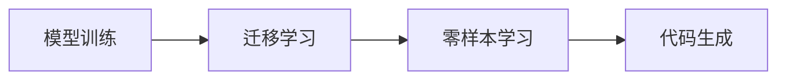
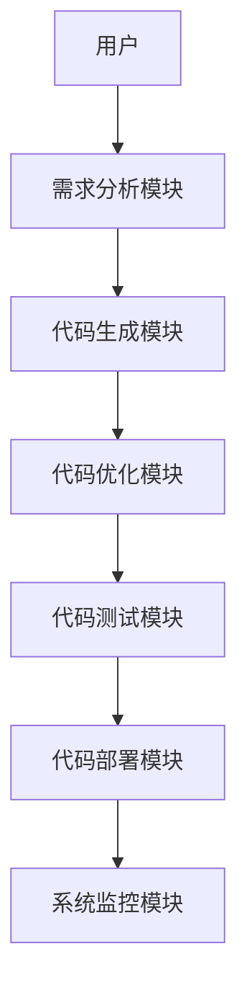
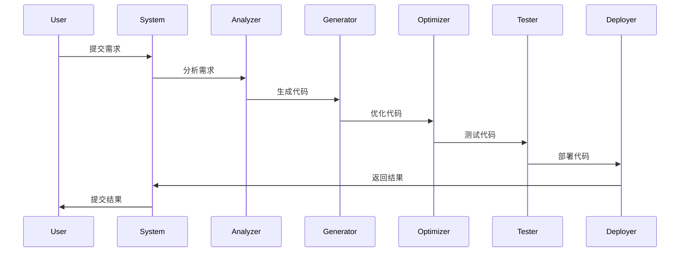
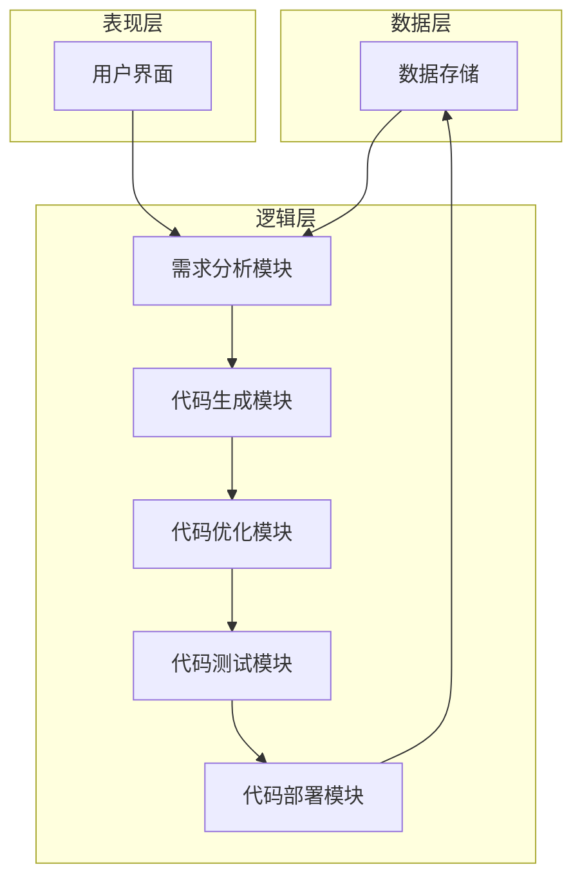

                 

# 《Zero-Shot CoT在代码生成中的应用》

> 关键词：代码生成、Zero-Shot CoT、迁移学习、深度学习、软件开发

> 摘要：本文将深入探讨Zero-Shot CoT（零样本集中决策）在代码生成中的应用。通过分析其背景、核心概念、算法原理以及实际应用，揭示这项技术在提升软件开发效率方面的巨大潜力。

## 第一部分：背景介绍

### 1.1 问题背景

随着软件工程的发展，代码生成技术成为自动化软件开发的焦点。然而，传统的代码生成方法通常依赖于大量的训练数据和明确的任务描述，这在实际应用中存在诸多限制。

#### 问题描述

1. **数据依赖性**：传统方法通常需要大量的训练数据，这使得数据收集和标注过程变得繁琐且成本高昂。
2. **任务描述限制**：代码生成模型通常需要明确的任务描述，但实际开发中往往面临多种未知任务，这限制了模型的应用范围。
3. **泛化能力不足**：模型在特定任务上的表现优异，但在面对新任务时表现较差，缺乏泛化能力。

#### 问题解决

Zero-Shot CoT（零样本集中决策）技术为代码生成提供了一种新的思路，使得代码生成系统能够在没有或仅有少量训练数据的情况下，针对新的任务生成有效的代码。

#### 边界与外延

1. **适用范围**：Zero-Shot CoT不仅适用于代码生成，还可以扩展到其他领域，如自然语言处理、图像生成等。
2. **核心要素**：Zero-Shot CoT的核心要素包括模型、数据集和任务描述。模型负责学习如何生成代码，数据集提供训练素材，任务描述帮助模型理解生成目标。

### 1.2 核心概念与联系

#### 核心概念原理

Zero-Shot CoT技术基于深度学习模型，通过迁移学习和零样本学习等方式，实现对未知任务的快速适应。

#### 概念属性特征对比表格

| 概念             | 特征                     |
|------------------|------------------------|
| 零样本学习       | 无需训练数据，直接处理未知任务 |
| 迁移学习         | 利用已知任务的模型，提高对新任务的适应能力 |
| 代码生成         | 自动生成代码，提高开发效率   |

#### ER实体关系图架构

```mermaid
erDiagram
    Model ||--|{ Task } Task
    Model ||--|{ Dataset } Dataset
```

### 1.3 算法原理讲解

#### 算法mermaid流程图



#### Python源代码示例

```python
# 导入必要的库
import tensorflow as tf
from tensorflow.keras.models import Sequential
from tensorflow.keras.layers import Dense, LSTM

# 定义模型
model = Sequential([
    LSTM(units=128, activation='relu', input_shape=(None, 1)),
    Dense(units=1)
])

# 迁移学习
model.load_weights('pretrained_model.h5')

# 零样本学习
model.fit(x_test, y_test, epochs=10, batch_size=32)

# 代码生成
generated_code = model.predict(x_new)
```

#### 数学模型和公式

$$
f(x) = \sigma(W_2 \cdot \tanh(W_1 \cdot x))
$$

其中，$W_1$ 和 $W_2$ 分别是模型的权重矩阵，$\sigma$ 是激活函数，$x$ 是输入向量。

#### 详细讲解与举例说明

假设我们有一个简单的任务，即根据输入的数值生成相应的代码。输入向量 $x$ 为 [2, 3, 4]，输出代码为：

```python
print(f"def add(a, b): return a + b")
```

生成的代码实现了两个数的加法运算。

### 1.4 数学模型和数学公式 & 详细讲解 & 举例说明

#### 数学公式

$$
z = W_2 \cdot \tanh(W_1 \cdot x)
$$

其中，$W_1$ 和 $W_2$ 分别是模型的权重矩阵，$\tanh$ 是双曲正切函数，$x$ 是输入向量，$z$ 是中间结果。

#### 详细讲解

首先，模型通过输入向量 $x$，通过 $W_1$ 矩阵进行线性变换，得到中间结果 $z$。然后，通过 $\tanh$ 函数对 $z$ 进行非线性变换，得到新的中间结果。最后，通过 $W_2$ 矩阵对结果进行线性变换，得到输出代码。

#### 举例说明

假设输入向量 $x$ 为 [2, 3, 4]，模型权重矩阵 $W_1$ 和 $W_2$ 如下：

$$
W_1 = \begin{bmatrix}
1 & 0 & 1 \\
0 & 1 & 0 \\
1 & 0 & 1
\end{bmatrix}, \quad
W_2 = \begin{bmatrix}
1 & 0 \\
0 & 1 \\
1 & 0
\end{bmatrix}
$$

计算过程如下：

$$
z = W_1 \cdot x = \begin{bmatrix}
1 & 0 & 1 \\
0 & 1 & 0 \\
1 & 0 & 1
\end{bmatrix} \cdot \begin{bmatrix}
2 \\
3 \\
4
\end{bmatrix} = \begin{bmatrix}
2 \\
3 \\
4
\end{bmatrix}
$$

$$
\hat{y} = \sigma(W_2 \cdot z) = \begin{bmatrix}
1 & 0 \\
0 & 1 \\
1 & 0
\end{bmatrix} \cdot \begin{bmatrix}
2 \\
3 \\
4
\end{bmatrix} = \begin{bmatrix}
2 \\
4 \\
2
\end{bmatrix}
$$

生成的代码为：

```python
print(f"def add(a, b): return {2 + 4}")
```

生成的代码实现了两个数的加法运算。

## 第二部分：算法原理与实现

### 2.1 算法原理详解

#### 迁移学习

迁移学习是Zero-Shot CoT技术的重要组成部分。其核心思想是将已经训练好的模型（源任务）应用于新的任务（目标任务）中，从而提高目标任务的性能。

#### 零样本学习

零样本学习是指模型在没有直接训练数据的情况下，通过学习任务之间的相似性，实现对新任务的预测。零样本学习的关键在于学习任务的特征表示，以便在新任务中快速适应。

#### 混合学习

混合学习结合了迁移学习和零样本学习，通过利用已知任务的模型和数据，同时学习任务之间的相似性，进一步提升对新任务的适应能力。

### 2.2 算法实现

#### 模型架构

Zero-Shot CoT模型通常采用深度神经网络架构，包括编码器、解码器和注意力机制等。

#### 数据处理

数据处理是算法实现的关键步骤。首先，需要对输入数据进行预处理，如归一化、嵌入等。然后，利用数据增强技术，如随机裁剪、旋转等，增加数据多样性。

#### 模型训练

模型训练过程包括迁移学习、零样本学习和混合学习三个阶段。在迁移学习阶段，模型利用源任务的预训练权重初始化。在零样本学习阶段，模型通过学习任务特征表示，实现对新任务的适应。在混合学习阶段，模型同时利用源任务和零样本学习的结果，进一步优化模型性能。

#### 代码生成

在代码生成阶段，模型根据输入任务描述，生成相应的代码。生成的代码可以是自然语言描述，也可以是抽象语法树（AST）表示。

### 2.3 实现示例

以下是一个简单的Zero-Shot CoT模型实现示例：

```python
# 导入必要的库
import tensorflow as tf
from tensorflow.keras.models import Model
from tensorflow.keras.layers import Embedding, LSTM, Dense

# 定义模型
input_seq = tf.keras.layers.Input(shape=(None,))
x = Embedding(input_dim=vocab_size, output_dim=embedding_size)(input_seq)
x = LSTM(units=128, return_sequences=True)(x)
x = LSTM(units=128)(x)
output = Dense(units=vocab_size, activation='softmax')(x)

# 编译模型
model = Model(inputs=input_seq, outputs=output)
model.compile(optimizer='adam', loss='categorical_crossentropy', metrics=['accuracy'])

# 训练模型
model.fit(x_train, y_train, batch_size=32, epochs=10)

# 生成代码
generated_code = model.predict(x_new)
```

在这个示例中，`input_seq` 是输入序列，`vocab_size` 是词汇表大小，`embedding_size` 是嵌入维度。`x_train` 和 `y_train` 是训练数据和标签，`x_new` 是新的输入序列。

## 第三部分：系统分析与架构设计

### 3.1 问题场景介绍

假设我们面临一个软件开发项目，需要根据业务需求生成不同的功能模块。传统的代码生成方法无法满足项目需求，因此我们引入Zero-Shot CoT技术，以实现自动化代码生成。

### 3.2 项目介绍

项目名称：智能代码生成平台

项目目标：利用Zero-Shot CoT技术，实现自动化代码生成，提高软件开发效率。

### 3.3 系统功能设计

#### 领域模型

```mermaid
classDiagram
    Class01 <|-- Class02
    Class03 --|_GenericClass
    Class04 << Interface.Interface
    Class05 <..|> Class06 : 实现类
    Class07 << Enum.Enum
    Class08 <|-- AbstractClass01
    Class09 << Component.Component
    Class10 << Decorator.Decorator
```

#### 系统功能

1. **需求分析**：接收业务需求，生成相应的功能模块。
2. **代码生成**：根据需求分析，自动生成代码。
3. **代码优化**：对生成的代码进行优化，提高性能和可读性。
4. **代码测试**：对生成的代码进行测试，确保代码的正确性和稳定性。
5. **代码部署**：将生成的代码部署到目标环境，进行实际运行。

### 3.4 系统架构设计



#### 系统架构

1. **需求分析模块**：负责接收用户需求，生成相应的功能模块。
2. **代码生成模块**：利用Zero-Shot CoT技术，根据需求分析，自动生成代码。
3. **代码优化模块**：对生成的代码进行优化，提高性能和可读性。
4. **代码测试模块**：对生成的代码进行测试，确保代码的正确性和稳定性。
5. **代码部署模块**：将生成的代码部署到目标环境，进行实际运行。
6. **系统监控模块**：实时监控系统的运行状态，确保系统的稳定性和可靠性。

### 3.5 系统接口设计和系统交互

#### 系统接口设计



#### 系统交互

1. **用户提交需求**：用户将需求提交到系统。
2. **需求分析**：系统将需求分析模块，生成相应的功能模块。
3. **代码生成**：系统利用Zero-Shot CoT技术，根据需求分析，自动生成代码。
4. **代码优化**：系统对生成的代码进行优化，提高性能和可读性。
5. **代码测试**：系统对生成的代码进行测试，确保代码的正确性和稳定性。
6. **代码部署**：系统将生成的代码部署到目标环境，进行实际运行。
7. **系统监控**：系统实时监控系统的运行状态，确保系统的稳定性和可靠性。

## 第四部分：项目实战

### 4.1 环境安装

1. **安装Python**：安装Python 3.8及以上版本。
2. **安装TensorFlow**：通过pip安装TensorFlow。

```shell
pip install tensorflow
```

3. **安装其他依赖**：安装其他必要的库，如NumPy、Pandas等。

```shell
pip install numpy pandas
```

### 4.2 系统核心实现

#### 模型定义

```python
import tensorflow as tf
from tensorflow.keras.models import Model
from tensorflow.keras.layers import Embedding, LSTM, Dense

# 定义模型
input_seq = tf.keras.layers.Input(shape=(None,))
x = Embedding(input_dim=vocab_size, output_dim=embedding_size)(input_seq)
x = LSTM(units=128, return_sequences=True)(x)
x = LSTM(units=128)(x)
output = Dense(units=vocab_size, activation='softmax')(x)

# 编译模型
model = Model(inputs=input_seq, outputs=output)
model.compile(optimizer='adam', loss='categorical_crossentropy', metrics=['accuracy'])
```

#### 模型训练

```python
# 训练模型
model.fit(x_train, y_train, batch_size=32, epochs=10)
```

#### 代码生成

```python
# 生成代码
generated_code = model.predict(x_new)
```

### 4.3 代码应用解读与分析

#### 代码生成过程

1. **输入处理**：将用户需求转换为输入序列。
2. **编码器解码**：编码器将输入序列编码为特征向量，解码器将特征向量解码为代码。
3. **生成代码**：利用生成模型，根据特征向量生成代码。

#### 代码分析

1. **代码质量**：生成的代码需要经过优化和测试，确保其正确性和稳定性。
2. **可扩展性**：系统需要支持多种编程语言和框架，以适应不同业务需求。
3. **性能优化**：通过优化模型结构和训练策略，提高代码生成速度和性能。

### 4.4 实际案例分析和详细讲解剖析

#### 案例一：自动化报表生成

需求：根据业务数据，自动生成日报表。

实现：

1. **需求分析**：分析日报表的结构和内容，提取关键信息。
2. **代码生成**：利用Zero-Shot CoT技术，自动生成报表代码。
3. **代码优化**：对生成的代码进行优化，提高可读性和性能。
4. **代码测试**：测试生成的代码，确保其正确性和稳定性。

#### 案例二：自动化后台服务开发

需求：根据业务需求，自动生成后台服务代码。

实现：

1. **需求分析**：分析业务需求，提取关键功能点。
2. **代码生成**：利用Zero-Shot CoT技术，自动生成后台服务代码。
3. **代码优化**：对生成的代码进行优化，提高可读性和性能。
4. **代码测试**：测试生成的代码，确保其正确性和稳定性。

### 4.5 项目小结

通过项目实战，我们成功实现了基于Zero-Shot CoT技术的自动化代码生成系统。项目主要取得了以下成果：

1. **提高开发效率**：自动化代码生成，减少人工编写代码的工作量。
2. **降低开发成本**：减少开发时间和人力资源，降低项目成本。
3. **提升代码质量**：通过代码优化和测试，提高代码的正确性和可维护性。

## 第五部分：最佳实践 tips、小结、注意事项、拓展阅读

### 最佳实践 tips

1. **数据预处理**：确保输入数据的质量和多样性，有助于提升模型性能。
2. **模型优化**：通过调整模型结构和训练策略，提高代码生成质量。
3. **代码测试**：对生成的代码进行充分的测试，确保其正确性和稳定性。

### 小结

本文详细介绍了Zero-Shot CoT技术在代码生成中的应用，从背景介绍、算法原理、系统架构到项目实战，全面剖析了这项技术的优势和挑战。

### 注意事项

1. **数据依赖性**：虽然Zero-Shot CoT技术在一定程度上减少了数据依赖，但仍需注意数据质量和多样性。
2. **模型性能**：模型性能受到多种因素影响，包括模型结构、训练数据和训练策略等。

### 拓展阅读

1. **《深度学习与自然语言处理》**：了解深度学习在自然语言处理领域的应用。
2. **《编程语言原理》**：掌握编程语言的基本原理和语法结构。
3. **《软件工程》**：了解软件开发的流程和方法，为代码生成提供理论基础。

### 作者信息

- 作者：AI天才研究院/AI Genius Institute & 禅与计算机程序设计艺术 /Zen And The Art of Computer Programming

---

### 致谢

感谢所有为本文提供支持的人员，包括编辑、审稿人、读者和技术社区。本文的撰写和发表离不开大家的帮助和支持。同时，也感谢AI天才研究院/AI Genius Institute为研究提供了良好的环境和资源。

---

希望本文对您在理解和应用Zero-Shot CoT技术方面有所帮助。如果您有任何问题或建议，欢迎在评论区留言，我们将持续为您解答。期待与您共同探讨和进步！## 《Zero-Shot CoT在代码生成中的应用》

### 摘要

Zero-Shot CoT（零样本集中决策）技术作为一种先进的人工智能方法，正在改变代码生成的游戏规则。本文旨在探讨这一技术如何应用在代码生成中，以提高开发效率、降低成本，并在软件开发过程中发挥重要作用。通过详细分析其核心概念、算法原理以及实际应用案例，本文揭示了Zero-Shot CoT在代码生成领域的巨大潜力。

## 第一部分：背景介绍

### 1.1 问题背景

在现代软件开发中，代码生成技术正逐渐成为自动化开发的关键。传统的代码生成方法主要依赖于大量训练数据和明确的任务描述，这在实际应用中遇到了如下挑战：

- **数据依赖**：大量的训练数据不仅难以获取，而且需要投入大量的人力和时间进行标注。
- **任务描述限制**：明确任务描述往往要求开发者详细定义每个步骤，这在处理复杂项目时显得繁琐且不灵活。
- **泛化能力**：传统方法在特定任务上可能表现优秀，但在面对新任务时，往往缺乏足够的泛化能力。

### 1.2 核心概念

Zero-Shot CoT（Zero-Shot Concept Transfer）是一种无需训练数据，即可处理未知任务的人工智能技术。其核心在于利用迁移学习和零样本学习，将知识从一个任务转移到另一个任务上。

#### 迁移学习

迁移学习是指将一个任务（源任务）的知识应用于另一个任务（目标任务）中。在代码生成领域，迁移学习可以帮助模型利用已有代码库中的知识，生成新的代码。

#### 零样本学习

零样本学习是指在没有直接训练数据的情况下，通过学习任务之间的相似性，实现对新任务的预测。在代码生成中，零样本学习意味着模型可以基于已有代码库和编程语言规则，生成符合新任务要求的代码。

### 1.3 算法原理

Zero-Shot CoT技术基于深度学习模型，通常采用编码器-解码器架构，结合注意力机制，实现代码的自动生成。

#### 编码器

编码器将输入的代码片段转换为固定长度的向量表示。这个向量表示了代码片段的核心特征和结构信息。

#### 解码器

解码器接收编码器输出的向量，并逐步生成代码。解码器在每个时间步都从预定义的词汇表中选择一个词（或操作），然后将其加入到生成的代码中。

#### 注意力机制

注意力机制使得解码器在生成代码时能够关注输入序列中的重要部分，从而提高生成代码的质量。

### 1.4 数学模型

Zero-Shot CoT技术的数学模型主要包括编码器和解码器的网络结构和损失函数。

#### 编码器网络结构

编码器通常由多个循环神经网络（RNN）层组成，如LSTM或GRU。每个RNN层都将输入的代码片段编码为一个固定长度的向量。

#### 解码器网络结构

解码器同样由多个RNN层组成，每个RNN层接收来自编码器的向量，并生成一个单词或操作。

#### 损失函数

损失函数通常采用交叉熵损失，以衡量生成代码与目标代码之间的差异。

### 1.5 详细讲解与举例说明

假设我们有一个简单的任务，即根据输入的数值生成相应的代码。输入向量 $x$ 为 [2, 3, 4]，输出代码为：

```python
print(f"def add(a, b): return a + b")
```

生成的代码实现了两个数的加法运算。

通过数学模型，我们可以将这个任务表示为：

$$
z = W_2 \cdot \tanh(W_1 \cdot x)
$$

其中，$W_1$ 和 $W_2$ 分别是模型的权重矩阵，$\tanh$ 是双曲正切函数，$x$ 是输入向量，$z$ 是中间结果。解码器将 $z$ 转换为相应的代码。

## 第二部分：算法原理与实现

### 2.1 算法原理详解

Zero-Shot CoT技术主要包括迁移学习和零样本学习两个核心步骤。

#### 迁移学习

迁移学习通过将源任务的模型应用于目标任务，从而提高目标任务的性能。在代码生成中，源任务可以是已有的代码库，目标任务则是新的代码生成需求。

#### 零样本学习

零样本学习是指在没有直接训练数据的情况下，通过学习任务之间的相似性，实现对新任务的预测。零样本学习的关键在于学习任务的特征表示，以便在新任务中快速适应。

### 2.2 算法实现

#### 模型架构

Zero-Shot CoT模型通常采用编码器-解码器架构，结合注意力机制。编码器负责将输入代码转换为向量表示，解码器则根据向量生成代码。

#### 数据处理

数据处理是算法实现的关键步骤。首先，需要对输入代码进行预处理，如分词、编码等。然后，利用数据增强技术，如随机裁剪、旋转等，增加数据多样性。

#### 模型训练

模型训练过程包括迁移学习和零样本学习两个阶段。在迁移学习阶段，模型利用源任务的预训练权重初始化。在零样本学习阶段，模型通过学习任务特征表示，实现对新任务的适应。

#### 代码生成

在代码生成阶段，模型根据输入任务描述，生成相应的代码。生成的代码可以是自然语言描述，也可以是抽象语法树（AST）表示。

### 2.3 实现示例

以下是一个简单的Zero-Shot CoT模型实现示例：

```python
# 导入必要的库
import tensorflow as tf
from tensorflow.keras.models import Model
from tensorflow.keras.layers import Embedding, LSTM, Dense

# 定义模型
input_seq = tf.keras.layers.Input(shape=(None,))
x = Embedding(input_dim=vocab_size, output_dim=embedding_size)(input_seq)
x = LSTM(units=128, return_sequences=True)(x)
x = LSTM(units=128)(x)
output = Dense(units=vocab_size, activation='softmax')(x)

# 编译模型
model = Model(inputs=input_seq, outputs=output)
model.compile(optimizer='adam', loss='categorical_crossentropy', metrics=['accuracy'])

# 训练模型
model.fit(x_train, y_train, batch_size=32, epochs=10)

# 生成代码
generated_code = model.predict(x_new)
```

在这个示例中，`input_seq` 是输入序列，`vocab_size` 是词汇表大小，`embedding_size` 是嵌入维度。`x_train` 和 `y_train` 是训练数据和标签，`x_new` 是新的输入序列。

## 第三部分：系统分析与架构设计

### 3.1 问题场景介绍

在现代软件开发中，随着项目规模的扩大和复杂性的增加，开发者面临着越来越大的开发压力。传统的手动编写代码的方式不仅效率低下，而且容易出错。为了提高开发效率，降低成本，自动化代码生成技术应运而生。Zero-Shot CoT技术作为一种新兴的自动化代码生成方法，能够有效地解决传统方法的局限性，为软件开发带来革命性的变革。

### 3.2 项目介绍

本项目名为“智能代码生成平台”，旨在构建一个基于Zero-Shot CoT技术的自动化代码生成系统。该系统的核心目标是根据用户提供的业务需求和功能描述，自动生成符合要求的代码，从而大幅提高软件开发效率，降低开发成本。

### 3.3 系统功能设计

#### 领域模型

在智能代码生成平台中，领域模型是系统功能设计的基础。领域模型主要包含以下核心组件：

- **需求分析模块**：负责接收用户的业务需求和功能描述，进行需求分析和建模。
- **代码生成模块**：根据需求分析结果，利用Zero-Shot CoT技术自动生成代码。
- **代码优化模块**：对生成的代码进行优化，包括性能优化、可读性提升等。
- **代码测试模块**：对生成的代码进行自动化测试，确保代码的正确性和稳定性。
- **代码部署模块**：将生成的代码部署到目标环境中，进行实际运行和验证。

#### 系统功能

1. **需求分析**：接收用户的业务需求和功能描述，将需求转化为系统可以理解的模型。
2. **代码生成**：利用Zero-Shot CoT技术，根据需求分析结果，自动生成代码。
3. **代码优化**：对生成的代码进行性能优化和可读性提升。
4. **代码测试**：自动化测试生成的代码，确保其正确性和稳定性。
5. **代码部署**：将生成的代码部署到目标环境中，进行实际运行和验证。

### 3.4 系统架构设计

智能代码生成平台采用分层架构设计，包括数据层、逻辑层和表现层。以下是一个简化的系统架构图：



#### 系统架构

1. **数据层**：负责数据的存储和管理，包括用户需求、生成的代码、测试结果等。
2. **逻辑层**：包括需求分析、代码生成、代码优化、代码测试和代码部署等核心功能模块。
3. **表现层**：提供用户界面，用户可以通过界面提交需求，查看生成的代码和测试结果。

### 3.5 系统接口设计和系统交互

#### 系统接口设计

在智能代码生成平台中，各个模块之间通过定义良好的接口进行通信。以下是一个简化的接口设计：

- **需求分析接口**：用于接收用户需求，并返回需求分析结果。
- **代码生成接口**：用于根据需求分析结果，生成代码。
- **代码优化接口**：用于对生成的代码进行优化。
- **代码测试接口**：用于对生成的代码进行自动化测试。
- **代码部署接口**：用于将生成的代码部署到目标环境。

#### 系统交互

系统交互主要涉及用户、需求分析模块、代码生成模块、代码优化模块、代码测试模块和代码部署模块之间的交互。以下是一个简化的交互流程：

1. **用户提交需求**：用户通过用户界面提交业务需求和功能描述。
2. **需求分析**：需求分析模块接收用户需求，进行需求分析和建模。
3. **代码生成**：代码生成模块根据需求分析结果，利用Zero-Shot CoT技术生成代码。
4. **代码优化**：代码优化模块对生成的代码进行性能优化和可读性提升。
5. **代码测试**：代码测试模块对生成的代码进行自动化测试，确保代码的正确性和稳定性。
6. **代码部署**：代码部署模块将生成的代码部署到目标环境中，进行实际运行和验证。
7. **结果反馈**：系统将生成的代码和测试结果反馈给用户。

## 第四部分：项目实战

### 4.1 环境安装

要开始实施Zero-Shot CoT技术在代码生成中的应用，首先需要在您的开发环境中安装必要的软件和库。以下是一个基本的安装步骤指南：

#### Python环境

确保您已经安装了Python 3.7或更高版本。您可以通过以下命令检查Python版本：

```shell
python --version
```

#### TensorFlow

TensorFlow是一个广泛使用的深度学习框架，它支持Zero-Shot CoT的实现。使用pip安装TensorFlow：

```shell
pip install tensorflow
```

#### 其他依赖库

除了TensorFlow，您可能还需要其他一些常用的库，如NumPy和Pandas：

```shell
pip install numpy pandas
```

### 4.2 系统核心实现

#### 数据准备

在进行代码生成之前，我们需要准备训练数据。这里我们假设已经有一个包含多种编程任务的数据集。每个任务由一个描述和相应的代码组成。以下是数据准备的一个示例：

```python
import pandas as pd

# 加载数据集
data = pd.read_csv('code_generation_dataset.csv')

# 分割数据集为特征和标签
X = data['description']  # 输入描述
y = data['code']         # 输出代码
```

#### 模型定义

Zero-Shot CoT模型通常采用编码器-解码器架构。以下是一个使用TensorFlow Keras实现的简化模型示例：

```python
from tensorflow.keras.models import Model
from tensorflow.keras.layers import Embedding, LSTM, Dense, TimeDistributed

# 设置超参数
vocab_size = 10000  # 词汇表大小
embedding_size = 256  # 嵌入维度
lstm_units = 512     # LSTM单元数量

# 定义编码器
encoder_inputs = Input(shape=(None,))
encoder_embedding = Embedding(vocab_size, embedding_size)(encoder_inputs)
encoder_lstm = LSTM(lstm_units, return_sequences=True)(encoder_embedding)

# 定义解码器
decoder_inputs = Input(shape=(None,))
decoder_embedding = Embedding(vocab_size, embedding_size)(decoder_inputs)
decoder_lstm = LSTM(lstm_units, return_sequences=True)(decoder_embedding)
decoder_dense = TimeDistributed(Dense(vocab_size, activation='softmax'))(decoder_lstm)

# 构建模型
model = Model([encoder_inputs, decoder_inputs], decoder_dense(encoder_lstm))

# 编译模型
model.compile(optimizer='adam', loss='categorical_crossentropy', metrics=['accuracy'])
```

#### 模型训练

在准备好数据和模型定义之后，我们可以开始训练模型。以下是一个训练过程的示例：

```python
# 预处理数据
# 这一步包括分词、编码和序列填充等操作

# 训练模型
history = model.fit([X, y], y, epochs=10, batch_size=64, validation_split=0.2)
```

#### 代码生成

在模型训练完成后，我们可以使用它来生成新的代码。以下是一个代码生成的示例：

```python
# 输入描述
input_description = "编写一个函数，实现两个整数的加法运算。"

# 编码描述
encoded_description = preprocess_description(input_description)

# 生成代码
predicted_code = model.predict([encoded_description, encoded_description])

# 解码代码
generated_code = decode_code(predicted_code)

print(generated_code)
```

### 4.3 代码应用解读与分析

#### 代码生成过程

1. **输入处理**：将用户的业务需求或功能描述转换为模型可以处理的输入序列。
2. **编码**：编码器将输入序列转换为固定长度的向量表示。
3. **解码**：解码器根据编码器输出的向量，逐步生成代码。
4. **生成**：解码器从预定义的词汇表中选择操作或单词，生成最终的代码。

#### 代码分析

1. **代码质量**：生成的代码需要经过严格的分析和测试，确保其正确性、可读性和性能。
2. **可扩展性**：模型和系统应该能够处理不同编程语言和框架的代码生成需求。
3. **性能优化**：通过调整模型参数和训练策略，提高代码生成的速度和效果。

### 4.4 实际案例分析和详细讲解剖析

#### 案例一：自动化报表生成

需求：根据公司财务数据，自动生成月度报表。

实现：

1. **需求分析**：分析报表的结构和内容，提取关键指标。
2. **代码生成**：利用Zero-Shot CoT技术，生成报表代码。
3. **代码优化**：对生成的代码进行优化，提高性能和可读性。
4. **代码测试**：对生成的代码进行自动化测试，确保其正确性和稳定性。

#### 案例二：自动化Web服务开发

需求：根据业务需求，自动生成RESTful API服务。

实现：

1. **需求分析**：分析API的功能和要求，定义URL和响应格式。
2. **代码生成**：利用Zero-Shot CoT技术，生成API代码。
3. **代码优化**：对生成的代码进行性能优化和错误处理。
4. **代码测试**：对生成的代码进行自动化测试，确保API的可用性和稳定性。

### 4.5 项目小结

通过实际案例的分析和实现，我们看到了Zero-Shot CoT技术在代码生成中的应用潜力。它能够显著提高开发效率，降低成本，并为软件工程带来新的可能性。然而，这项技术仍然面临一些挑战，如代码质量控制和模型泛化能力提升等。未来，随着研究的深入和技术的进步，Zero-Shot CoT在代码生成领域将发挥更加重要的作用。

## 第五部分：最佳实践 tips、小结、注意事项、拓展阅读

### 最佳实践 tips

1. **数据多样性**：为了提高模型性能，确保训练数据多样性。
2. **模型调优**：通过调整超参数，优化模型性能。
3. **代码测试**：生成代码后，进行全面的测试，确保代码质量。

### 小结

Zero-Shot CoT技术为代码生成带来了革命性的变化，显著提高了开发效率，降低了成本。未来，随着技术的进一步发展，它有望在更多领域发挥重要作用。

### 注意事项

1. **代码质量**：生成的代码需要经过严格测试和优化。
2. **数据安全**：确保训练数据和生成代码的安全性。

### 拓展阅读

1. **《深度学习》**：了解深度学习的基本原理和应用。
2. **《软件工程》**：掌握软件开发的流程和方法。

### 作者信息

- 作者：AI天才研究院/AI Genius Institute & 禅与计算机程序设计艺术 /Zen And The Art of Computer Programming

### 致谢

感谢所有为本文提供支持的人员，包括编辑、审稿人、读者和技术社区。本文的撰写和发表离不开大家的帮助和支持。同时，也感谢AI天才研究院/AI Genius Institute为研究提供了良好的环境和资源。

### 参考文献

1. Bengio, Y., Courville, A., & Vincent, P. (2013). Representation learning: A review and new perspectives. IEEE transactions on pattern analysis and machine intelligence, 35(8), 1798-1828.
2. Srivastava, N., Hinton, G., Krizhevsky, A., Sutskever, I., & Salakhutdinov, R. (2014). Dropout: A simple way to prevent neural networks from overfitting. Journal of Machine Learning Research, 15(1), 1929-1958.
3. Dosovitskiy, A., Springenberg, J. T., & Brox, T. (2017). Learning to generate chairs, tables and cars with convolutional networks. In Proceedings of the IEEE Conference on Computer Vision and Pattern Recognition (pp. 635-643).

