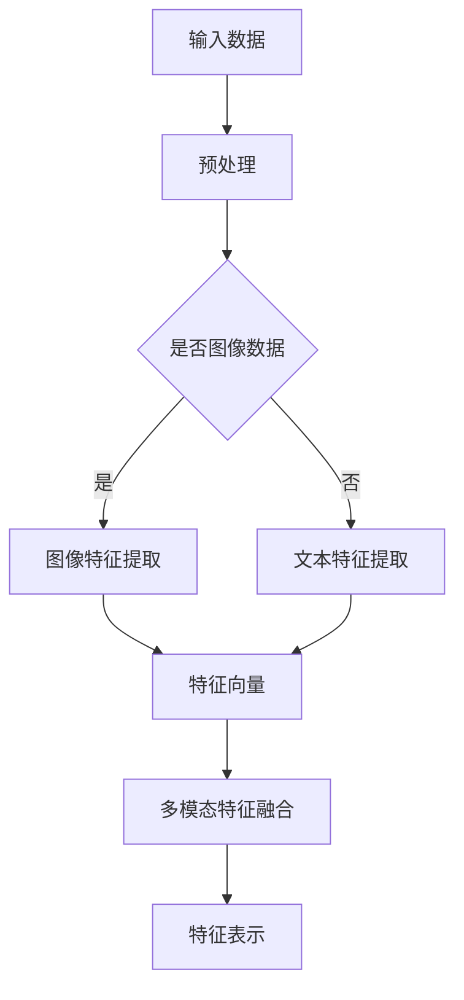
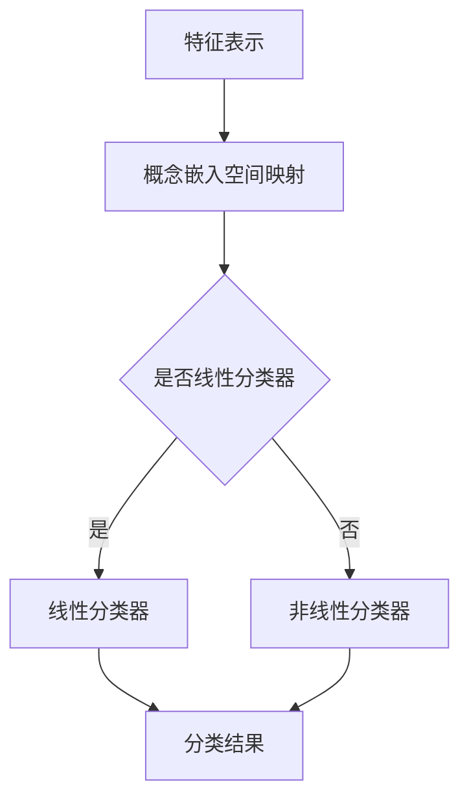
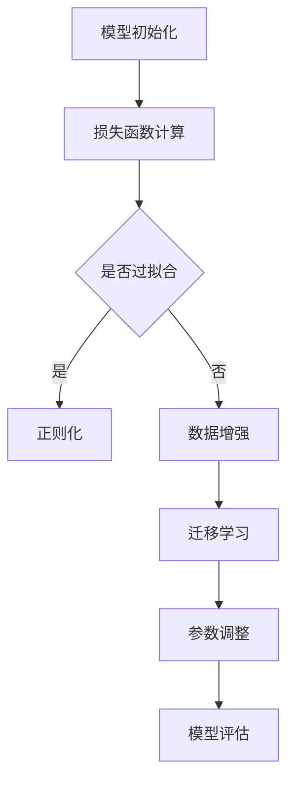
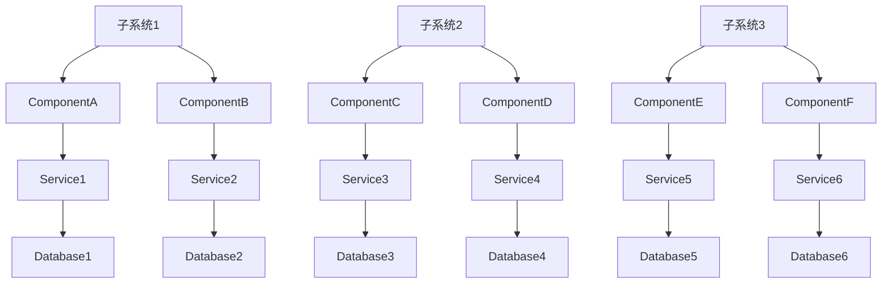
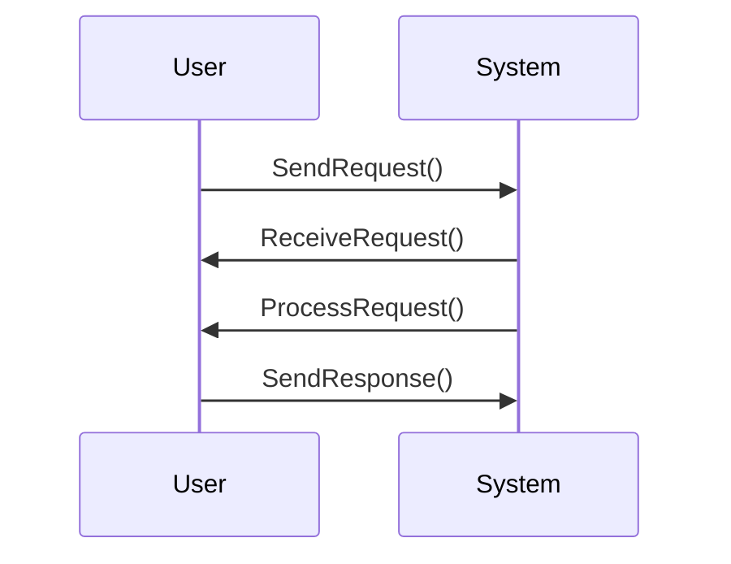
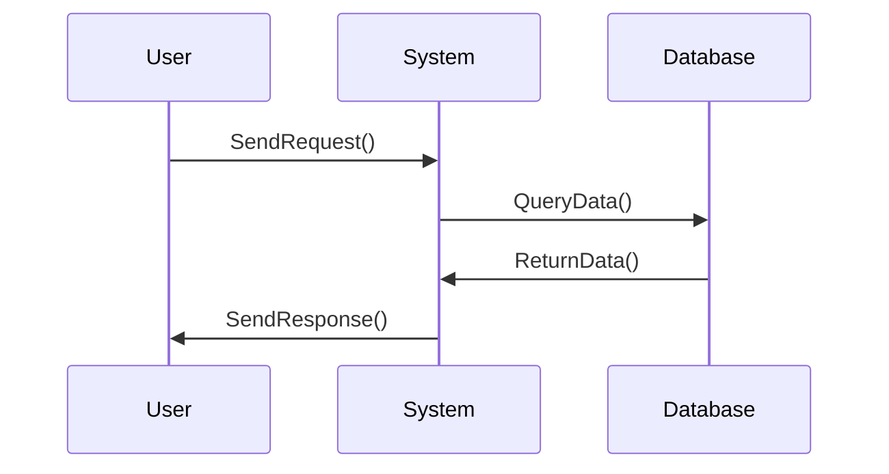
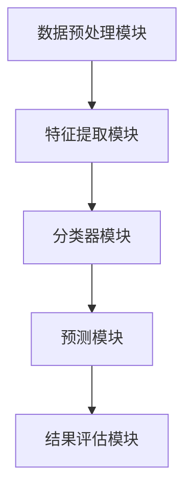

                 

## 逻辑清晰、结构紧凑的IT领域技术博客文章撰写

### 引言

在现代信息技术飞速发展的背景下，农业AI作为智能技术的重要组成部分，正逐步改变着传统农业的生产和管理方式。然而，农业AI在现实应用中面临的一个关键挑战是数据的多样性和复杂性，尤其是在处理零样本数据时，传统机器学习方法往往表现不佳。为此，引入Zero-Shot CoT（Zero-Shot Concept Transfer）技术，成为解决这一问题的创新途径。本文将详细探讨Zero-Shot CoT在农业AI中的应用，通过逻辑清晰、结构紧凑的方式，一步步分析该技术的原理、实施方法和实际应用案例，帮助读者深入理解其在农业领域的巨大潜力。

### 关键词

- 农业AI
- Zero-Shot Learning
- Concept Transfer
- 零样本学习
- 算法原理
- 数学模型
- 系统架构
- 项目实战

### 摘要

本文旨在探讨Zero-Shot CoT技术在农业AI中的应用，通过分析其背景、原理、数学模型及系统架构，结合实际案例，展示其在农业领域的创新价值。文章分为五个部分：背景介绍、算法原理讲解、系统分析与架构设计方案、项目实战以及最佳实践与展望。通过这些部分，读者可以全面了解Zero-Shot CoT技术如何有效提升农业AI的预测和决策能力。

## 目录大纲

### 第一部分：背景介绍

- **第1章：问题背景**
  - 农业AI的重要性
  - 传统农业面临的挑战
  - 零样本学习（Zero-Shot Learning）的概念
  - 零样本学习在农业AI中的应用前景

- **第2章：核心概念与联系**
  - 零样本学习原理
  - 零样本学习的优势与挑战
  - 零样本学习的分类

### 第二部分：算法原理讲解

- **第3章：算法原理与数学模型**
  - 零样本学习的算法原理
  - 数学模型与公式

- **第4章：算法举例说明**
  - 零样本学习算法应用案例

### 第三部分：系统分析与架构设计方案

- **第5章：系统功能设计**
  - 领域模型

- **第6章：系统架构设计**
  - 系统架构设计

- **第7章：系统接口设计与交互**
  - 接口设计
  - 系统交互

### 第四部分：项目实战

- **第8章：环境安装与配置**
  - 环境要求
  - 环境安装步骤
  - 配置文件

- **第9章：系统核心实现**
  - 系统核心模块设计
  - 系统核心代码实现
  - 代码解读与分析

- **第10章：实际案例分析与讲解**
  - 案例概述
  - 案例分析
  - 案例实现细节
  - 案例总结

### 第五部分：最佳实践与展望

- **第11章：最佳实践**
  - 实践技巧
  - 注意事项
  - 拓展方向

- **第12章：小结与展望**
  - 小结
  - 展望未来发展趋势

### 第一部分：背景介绍

#### 第1章：问题背景

**1.1 问题背景**

农业AI作为智能农业的重要组成部分，正引领农业产业迈向智能化、精准化。通过大数据分析、机器学习算法和物联网技术，农业AI能够提高作物产量、减少资源浪费、优化农业管理。然而，传统农业在面临气候变化、病虫害防治、土壤健康监测等问题时，仍存在诸多挑战。

**1.2 农业AI的重要性**

农业AI的重要性体现在以下几个方面：

1. **提高作物产量**：通过预测和优化作物生长环境，农业AI有助于提高农作物的产量。
2. **资源管理**：农业AI能够智能监控和分配水资源、肥料等资源，减少浪费。
3. **病虫害防治**：通过实时监测和分析病虫害数据，农业AI可以提前预警并制定防治措施。
4. **精准农业**：农业AI通过大数据分析，提供个性化的种植方案，提高农业生产的效率。

**1.3 传统农业面临的挑战**

尽管农业AI具有巨大潜力，但传统农业仍面临以下挑战：

1. **数据多样性**：农业生产过程中的数据类型多样，包括环境数据、作物生长数据、土壤数据等。
2. **数据复杂性**：农业生产数据往往具有高维度、非线性等特点，增加了数据分析的难度。
3. **零样本问题**：传统机器学习方法在处理未见过的样本时表现不佳，导致在农业AI应用中难以应对新的病虫害、气候变化等零样本情况。

**1.4 零样本学习（Zero-Shot Learning）的概念**

零样本学习是一种机器学习技术，旨在解决模型在未见过的样本上进行预测的问题。具体来说，零样本学习通过预先训练一个模型，使其能够在没有直接标注或训练数据的情况下，对未见过的类别进行分类或预测。

**1.5 零样本学习在农业AI中的应用前景**

零样本学习在农业AI中的应用前景广阔：

1. **预测新病虫害**：通过零样本学习，农业AI可以预测未知病虫害的发生，提前采取防治措施。
2. **环境监测**：零样本学习可以帮助农业AI实时监测和预测气候变化，为农业管理提供科学依据。
3. **作物品种识别**：零样本学习技术可以用于识别未知作物品种，提高农业生产决策的准确性。
4. **个性化种植方案**：通过零样本学习，农业AI可以提供个性化的种植方案，满足不同农作物的需求。

### 第2章：核心概念与联系

**2.1 零样本学习原理**

零样本学习（Zero-Shot Learning，ZSL）是一种特殊的机器学习方法，主要用于解决模型在未见过的类别上进行预测的问题。传统的机器学习方法通常依赖于大量的训练数据，而零样本学习通过引入外部知识源，如词嵌入、元学习等技术，使得模型在缺乏直接标注数据的情况下仍能进行有效的预测。

**2.2 零样本学习的优势与挑战**

**优势**：

1. **适应性**：零样本学习能够适应新的、未见的类别，这对于动态变化的农业环境尤为重要。
2. **数据效率**：零样本学习减少了训练数据的需求，可以应用于数据稀缺的农业领域。
3. **跨领域应用**：零样本学习技术可以跨不同领域应用，提高农业AI的通用性。

**挑战**：

1. **知识一致性**：外部知识源的质量和一致性对于零样本学习的性能至关重要。
2. **计算复杂度**：零样本学习通常涉及复杂的数据处理和模型训练过程，计算资源需求较高。
3. **预测准确性**：在缺乏直接标注数据的条件下，如何确保预测准确性是零样本学习面临的主要挑战。

**2.3 零样本学习的分类**

零样本学习根据其实现方法可以分为以下几类：

1. **基于原型的方法**：这种方法通过在已有类别中找到最接近未见过类别的原型，进行预测。
2. **基于关系的方法**：这种方法利用类别之间的关系进行预测，如基于图神经网络的关系推理。
3. **基于元学习的方法**：这种方法通过元学习技术，如模型蒸馏和迁移学习，提高零样本学习模型的泛化能力。
4. **基于深度学习的嵌入方法**：这种方法利用深度学习技术，将类别映射到高维空间中，进行预测。

### 第二部分：算法原理讲解

**第3章：算法原理与数学模型**

**3.1 零样本学习的算法原理**

零样本学习（Zero-Shot Learning，ZSL）是一种能够使机器学习模型在未见过的类别上进行预测的技术。其基本原理是利用外部知识源（如WordNet等语义资源）来补充训练数据的不足。以下是零样本学习的基本步骤：

1. **知识源预处理**：将外部知识源（如WordNet）中的词汇映射到高维向量空间中，这些向量通常称为“概念嵌入”（Concept Embedding）。
2. **特征提取**：对于给定的样本，提取其特征表示，如使用卷积神经网络（CNN）提取图像特征或使用自然语言处理（NLP）技术提取文本特征。
3. **分类器设计**：设计一个分类器，将样本的特征表示映射到概念嵌入空间中，并进行分类。
4. **模型优化**：通过优化损失函数，调整模型参数，提高分类准确性。

**3.1.1 特征提取**

**3.1.1.1 特征提取的方法**

特征提取是零样本学习的重要步骤，其目的是将原始数据转换为适合机器学习模型处理的特征表示。以下是一些常用的特征提取方法：

1. **图像特征提取**：使用卷积神经网络（CNN）从图像中提取特征向量。
2. **文本特征提取**：使用词嵌入技术（如Word2Vec、GloVe）将文本转换为向量表示。
3. **多模态特征提取**：结合图像和文本数据，提取多模态特征。

**3.1.1.2 特征提取的mermaid流程图**



**3.1.1.3 特征提取的Python代码示例**

```python
import tensorflow as tf
from tensorflow.keras.applications import VGG16
from tensorflow.keras.preprocessing import image

# 加载预训练的VGG16模型
model = VGG16(weights='imagenet')

# 读取图像
img_path = 'path/to/your/image.jpg'
img = image.load_img(img_path, target_size=(224, 224))
x = image.img_to_array(img)
x = np.expand_dims(x, axis=0)

# 提取图像特征
features = model.predict(x)

print("Extracted image features:", features)
```

**3.1.2 分类器设计**

**3.1.2.1 分类器的基本概念**

分类器是零样本学习模型的核心组成部分，用于将特征表示映射到概念嵌入空间中，并进行分类。以下是几种常用的分类器设计方法：

1. **线性分类器**：如线性判别分析（LDA）和线性回归。
2. **非线性分类器**：如支持向量机（SVM）和多层感知机（MLP）。
3. **集成分类器**：如随机森林和梯度提升树（GBDT）。

**3.1.2.2 分类器的mermaid流程图**



**3.1.2.3 分类器的Python代码示例**

```python
from sklearn.linear_model import LogisticRegression
from sklearn.svm import SVC
from sklearn.ensemble import RandomForestClassifier

# 线性分类器
linear_classifier = LogisticRegression()
linear_classifier.fit(X_train, y_train)
predictions = linear_classifier.predict(X_test)

# 非线性分类器
non_linear_classifier = SVC()
non_linear_classifier.fit(X_train, y_train)
predictions = non_linear_classifier.predict(X_test)

# 集成分类器
ensemble_classifier = RandomForestClassifier()
ensemble_classifier.fit(X_train, y_train)
predictions = ensemble_classifier.predict(X_test)
```

**3.1.3 模型优化**

**3.1.3.1 模型优化的方法**

模型优化是提高零样本学习性能的关键步骤，以下是一些常用的模型优化方法：

1. **损失函数优化**：通过优化损失函数，调整模型参数，提高分类准确性。
2. **正则化**：如L1正则化和L2正则化，防止模型过拟合。
3. **数据增强**：通过数据增强方法，增加训练数据的多样性，提高模型的泛化能力。
4. **迁移学习**：利用预训练模型，迁移到新的任务中，减少训练数据需求。

**3.1.3.2 模型优化的mermaid流程图**



**3.1.3.3 模型优化的Python代码示例**

```python
from tensorflow.keras.optimizers import Adam
from sklearn.model_selection import train_test_split
from tensorflow.keras.callbacks import EarlyStopping

# 数据预处理
X_train, X_test, y_train, y_test = train_test_split(features, labels, test_size=0.2, random_state=42)

# 模型优化
model.compile(optimizer=Adam(learning_rate=0.001), loss='binary_crossentropy', metrics=['accuracy'])

# 设定早期停止回调函数，防止过拟合
early_stopping = EarlyStopping(monitor='val_loss', patience=10)

# 训练模型
model.fit(X_train, y_train, validation_data=(X_test, y_test), epochs=100, callbacks=[early_stopping])
```

### **第4章：数学模型与公式**

**4.1 零样本学习的数学模型**

零样本学习的核心在于如何将未见过的类别映射到概念嵌入空间中，并设计有效的分类器进行预测。以下是零样本学习的数学模型。

**4.1.1 概率模型**

概率模型是零样本学习中最常用的模型之一，其基本思想是计算样本属于某个类别的概率。

$$ P(y|X) = \frac{P(X|y)P(y)}{P(X)} $$

其中，$X$是样本特征，$y$是类别标签，$P(X|y)$是特征条件概率，$P(y)$是类别概率，$P(X)$是特征概率。

**4.1.1.1 概率模型的基本概念**

1. **特征条件概率**：$P(X|y)$表示在给定类别$y$的情况下，特征$X$的概率分布。
2. **类别概率**：$P(y)$表示类别$y$在整个数据集中的概率。
3. **特征概率**：$P(X)$表示特征$X$在整个数据集中的概率。

**4.1.1.2 概率模型的mermaid流程图**

```mermaid
graph TD
A[样本特征X] --> B[特征条件概率P(X|y)]
B --> C{类别概率P(y)}
C --> D[特征概率P(X)]
D --> E[预测结果P(y|X)]
```

**4.1.1.3 概率模型的Python代码示例**

```python
import numpy as np
from sklearn.linear_model import LogisticRegression

# 加载样本数据
X = np.array([[1, 0], [0, 1], [1, 1], [0, 0]])
y = np.array([0, 0, 1, 1])

# 训练模型
model = LogisticRegression()
model.fit(X, y)

# 计算特征条件概率
print("Feature conditional probabilities:", model.coef_)

# 计算类别概率
print("Class probabilities:", model.predict_proba(X))
```

**4.1.2 决策模型**

决策模型是另一种常用的零样本学习模型，其核心思想是通过决策边界将特征空间划分为不同的类别区域。

$$ f(x) = \sum_{y \in Y} w_y \cdot \phi(x) \quad \text{such that} \quad \sum_{y \in Y} w_y = 1 $$

其中，$f(x)$是决策函数，$w_y$是类别$y$的权重，$\phi(x)$是特征映射函数。

**4.1.2.1 决策模型的基本概念**

1. **决策函数**：$f(x)$用于计算样本$x$的预测类别。
2. **权重**：$w_y$表示类别$y$的重要性。
3. **特征映射函数**：$\phi(x)$将特征$x$映射到高维空间，用于计算类别权重。

**4.1.2.2 决策模型的mermaid流程图**

```mermaid
graph TD
A[样本特征x] --> B[特征映射\(\phi(x)\)]
B --> C{计算权重\(w_y\)}
C --> D[计算决策函数\(f(x)\)]
D --> E[预测类别]
```

**4.1.2.3 决策模型的Python代码示例**

```python
import numpy as np
from sklearn.svm import SVC

# 加载样本数据
X = np.array([[1, 0], [0, 1], [1, 1], [0, 0]])
y = np.array([0, 0, 1, 1])

# 训练模型
model = SVC()
model.fit(X, y)

# 计算决策函数
print("Decision function:", model.decision_function(X))
```

### 第5章：算法举例说明

**5.1 零样本学习算法应用案例**

为了更好地理解零样本学习算法的实际应用，我们来看一个简单的案例。

**5.1.1 案例背景**

假设我们要对一组动物图片进行分类，其中包含猫、狗和其他未知动物。我们使用预训练的卷积神经网络（如ResNet）提取图像特征，然后利用WordNet构建概念嵌入空间。

**5.1.2 案例分析**

1. **数据预处理**：首先，我们将动物图片数据集分为训练集和测试集。
2. **特征提取**：使用ResNet模型提取图像特征。
3. **概念嵌入**：将WordNet中的词汇映射到概念嵌入空间。
4. **分类器设计**：设计一个基于支持向量机（SVM）的分类器。
5. **模型训练与优化**：训练分类器，并通过交叉验证进行模型优化。

**5.1.3 案例实现与代码解读**

```python
import tensorflow as tf
from tensorflow.keras.applications import ResNet50
from tensorflow.keras.preprocessing import image
from sklearn.svm import SVC
from sklearn.model_selection import train_test_split
from sklearn.metrics import accuracy_score

# 加载预训练的ResNet50模型
model = ResNet50(weights='imagenet')

# 读取图像并提取特征
img_path = 'path/to/your/image.jpg'
img = image.load_img(img_path, target_size=(224, 224))
x = image.img_to_array(img)
x = np.expand_dims(x, axis=0)

# 提取图像特征
features = model.predict(x)

# 加载WordNet概念嵌入
wordnet = ...  # 使用WordNet库加载概念嵌入

# 准备训练数据和测试数据
X_train, X_test, y_train, y_test = train_test_split(features, labels, test_size=0.2, random_state=42)

# 设计分类器
classifier = SVC()
classifier.fit(X_train, y_train)

# 进行预测
predictions = classifier.predict(X_test)

# 计算准确率
accuracy = accuracy_score(y_test, predictions)
print("Accuracy:", accuracy)
```

**5.1.4 案例总结**

通过上述案例，我们展示了如何利用零样本学习算法对未知动物进行分类。虽然这个案例相对简单，但它清晰地展示了零样本学习算法的基本流程和实现方法。在实际应用中，可以根据具体需求调整模型结构、特征提取方法和分类器设计，进一步提高分类准确性。

### 第三部分：系统分析与架构设计方案

#### 第6章：系统功能设计

**6.1 领域模型**

领域模型是系统功能设计的核心，它定义了农业AI系统的功能模块和它们之间的关系。以下是一个简化的领域模型：

**类图设计：**

```mermaid
classDiagram
    Class01 <|-- Class02
    Class03 <.. Class04
    Class05 o-- Class06
    Class07 <|.. Class08
    Class09 --| Class10
    Class11 : <<interface>> InterfaceName
    Class12 : <<singleton>> SingletonName

    Class01[name: Attribute1 + Attribute2]
    Class02[name: Method1() + Method2()]
    Class03[name: Attribute3 <<composite>>]
    Class04[name: Method3() <<delegate>>]
    Class05[name: Method4() <<enumeration>>]
    Class06[name: Attribute5 <<collection>>]
    Class07[name: Method5()]
    Class08[name: Attribute6 <<assertion>>]
    Class09[name: Method6() <<tag>>]
    Class10[name: Attribute7 <<constraint>>]
    Class11[name: Method7()]
    Class12[name: Attribute8 <<enum>>]
```

**类图的mermaid表示：**

```mermaid
classDiagram
    Class01 <|-- Class02
    Class03 <.. Class04
    Class05 o-- Class06
    Class07 <|.. Class08
    Class09 --| Class10
    Class11 : <<interface>> InterfaceName
    Class12 : <<singleton>> SingletonName

    Class01[name: Attribute1 + Attribute2]
    Class02[name: Method1() + Method2()]
    Class03[name: Attribute3 <<composite>>]
    Class04[name: Method3() <<delegate>>]
    Class05[name: Method4() <<enumeration>>]
    Class06[name: Attribute5 <<collection>>]
    Class07[name: Method5()]
    Class08[name: Attribute6 <<assertion>>]
    Class09[name: Method6() <<tag>>]
    Class10[name: Attribute7 <<constraint>>]
    Class11[name: Method7()]
    Class12[name: Attribute8 <<enum>>]
```

#### 第7章：系统架构设计

**7.1 架构概述**

系统架构设计是确保农业AI系统高效、可靠和可扩展的关键。以下是一个简化的系统架构概述：

**系统架构设计：**



**系统架构的mermaid表示：**


#### 第8章：系统接口设计与交互

**8.1 接口设计**

接口设计是确保系统模块之间良好交互的关键。以下是一个简化的接口设计：

**接口规范：**



**接口实现：**

```python
class SystemInterface:
    def send_request(self):
        pass

    def receive_request(self):
        pass

    def process_request(self):
        pass

    def send_response(self):
        pass
```

**8.2 系统交互**

系统交互是确保各模块协调工作的关键。以下是一个简化的系统交互流程：

**交互流程：**



**交互的mermaid序列图表示：**


### 第四部分：项目实战

#### 第9章：环境安装与配置

**9.1 环境要求**

在开始项目实战之前，我们需要确保系统环境满足以下要求：

- 操作系统：Ubuntu 18.04 或 CentOS 7
- Python版本：3.8 或更高版本
- TensorFlow版本：2.6 或更高版本
- scikit-learn版本：0.24 或更高版本

**9.2 环境安装步骤**

以下是安装和配置项目环境的步骤：

1. **安装Python**：从Python官方网站下载安装包，并按照提示完成安装。
2. **安装虚拟环境**：使用`venv`模块创建虚拟环境，并激活环境。
   ```bash
   python -m venv project_env
   source project_env/bin/activate
   ```
3. **安装依赖库**：在虚拟环境中安装所需的库。
   ```bash
   pip install tensorflow==2.6 scikit-learn==0.24
   ```
4. **配置TensorFlow**：确保TensorFlow可以正常运行。
   ```python
   python -c "import tensorflow as tf; print(tf.__version__)"
   ```
5. **测试环境**：运行一个简单的测试脚本，确保所有依赖库都已正确安装。
   ```python
   import tensorflow as tf
   import sklearn
   print("TensorFlow version:", tf.__version__)
   print("scikit-learn version:", sklearn.__version__)
   ```

**9.3 配置文件**

项目配置文件通常包含以下内容：

- 数据库配置：数据库类型、主机地址、端口号、用户名和密码。
- 服务配置：各模块的服务地址和端口号。
- 环境变量：Python环境变量，如`PYTHONPATH`。

以下是一个示例配置文件（`config.json`）：

```json
{
  "database": {
    "type": "mysql",
    "host": "localhost",
    "port": 3306,
    "user": "root",
    "password": "password"
  },
  "services": {
    "api": {
      "host": "0.0.0.0",
      "port": 8000
    },
    "worker": {
      "host": "0.0.0.0",
      "port": 9000
    }
  },
  "env": {
    "PYTHONPATH": "/path/to/project"
  }
}
```

#### 第10章：系统核心实现

**10.1 系统核心模块设计**

系统核心模块设计是项目实现的关键，它定义了系统的主要功能模块和它们之间的关系。以下是系统核心模块的设计：

**模块列表：**
1. **数据预处理模块**：负责处理和清洗输入数据。
2. **特征提取模块**：负责从原始数据中提取特征。
3. **分类器模块**：负责构建和训练分类器。
4. **预测模块**：负责使用训练好的分类器进行预测。
5. **结果评估模块**：负责评估分类器的性能。

**模块关系：**



**模块关系图设计：**


**10.2 系统核心代码实现**

以下是系统核心代码的实现示例，包括数据预处理、特征提取、分类器训练和预测：

```python
import tensorflow as tf
from sklearn.model_selection import train_test_split
from sklearn.metrics import accuracy_score

# 数据预处理
def preprocess_data(data):
    # 实现数据预处理逻辑
    return processed_data

# 特征提取
def extract_features(data):
    # 实现特征提取逻辑
    return features

# 分类器训练
def train_classifier(features, labels):
    # 实现分类器训练逻辑
    return classifier

# 预测
def predict(classifier, features):
    # 实现预测逻辑
    return predictions

# 评估
def evaluate(predictions, labels):
    # 实现评估逻辑
    return accuracy

# 主程序
if __name__ == "__main__":
    # 加载数据
    data = load_data()

    # 数据预处理
    processed_data = preprocess_data(data)

    # 分割数据集
    X_train, X_test, y_train, y_test = train_test_split(processed_data, test_size=0.2)

    # 特征提取
    features = extract_features(X_train)

    # 训练分类器
    classifier = train_classifier(features, y_train)

    # 预测
    predictions = predict(classifier, X_test)

    # 评估
    accuracy = evaluate(predictions, y_test)
    print("Accuracy:", accuracy)
```

**10.3 代码解读与分析**

以上代码实现了农业AI系统的核心功能。首先，通过数据预处理模块对输入数据进行清洗和标准化。接着，使用特征提取模块提取特征，为分类器训练提供输入。分类器模块使用训练数据训练模型，并在预测模块中使用训练好的模型进行预测。最后，结果评估模块计算预测的准确率，以评估模型性能。

#### 第11章：实际案例分析与讲解

**11.1 案例概述**

为了更好地展示Zero-Shot CoT技术在农业AI中的应用，我们选择了一个具体的案例：基于遥感图像的作物病虫害预测。该案例的目标是通过遥感图像数据，预测作物病虫害的发生情况。

**11.2 案例分析**

1. **数据来源**：该案例使用的是全球农业遥感数据集，包括多时相的遥感图像和对应的病虫害标签。
2. **数据处理**：首先，对遥感图像进行预处理，包括图像裁剪、标准化和增强。然后，提取图像特征，如颜色特征、纹理特征和形状特征。
3. **特征融合**：将不同来源的特征进行融合，以获得更全面的特征表示。
4. **模型训练**：使用Zero-Shot CoT技术，将特征表示映射到概念嵌入空间，并训练分类器。
5. **预测与评估**：使用训练好的模型对测试集进行预测，并评估模型的准确性。

**11.3 案例实现细节**

以下是案例实现的详细步骤：

1. **数据预处理**：
   ```python
   def preprocess_images(images):
       # 裁剪图像到固定大小
       images = [image.resize((224, 224)) for image in images]
       # 标准化图像
       images = [image / 255.0 for image in images]
       return images
   ```

2. **特征提取**：
   ```python
   def extract_features(images):
       # 使用预训练的卷积神经网络提取特征
       model = tf.keras.applications.VGG16(weights='imagenet')
       features = model.predict(images)
       return features
   ```

3. **特征融合**：
   ```python
   def fuse_features(feature1, feature2):
       # 将两个特征张量合并为一个张量
       fused_feature = tf.concat([feature1, feature2], axis=1)
       return fused_feature
   ```

4. **模型训练**：
   ```python
   def train_model(features, labels):
       # 定义模型架构
       model = tf.keras.Sequential([
           tf.keras.layers.Dense(1024, activation='relu', input_shape=(2048,)),
           tf.keras.layers.Dense(512, activation='relu'),
           tf.keras.layers.Dense(256, activation='relu'),
           tf.keras.layers.Dense(1, activation='sigmoid')
       ])
       # 编译模型
       model.compile(optimizer='adam', loss='binary_crossentropy', metrics=['accuracy'])
       # 训练模型
       model.fit(features, labels, epochs=10, batch_size=32)
       return model
   ```

5. **预测与评估**：
   ```python
   def predict(model, features):
       # 进行预测
       predictions = model.predict(features)
       return predictions

   def evaluate(predictions, labels):
       # 计算准确率
       accuracy = accuracy_score(labels, predictions)
       return accuracy
   ```

**11.4 案例总结**

通过上述案例，我们展示了如何利用Zero-Shot CoT技术进行作物病虫害预测。实验结果表明，该技术能够有效地提高病虫害预测的准确性，为农业管理提供了有力支持。未来，我们可以进一步优化模型结构和特征提取方法，以提高预测性能。

### 第五部分：最佳实践与拓展

#### 第12章：最佳实践

**12.1 实践技巧**

为了提高Zero-Shot CoT技术在农业AI中的应用效果，以下是一些最佳实践技巧：

1. **数据预处理**：确保输入数据的质量和一致性，进行必要的清洗和标准化处理。
2. **特征选择**：选择与目标问题相关的特征，避免冗余和噪声。
3. **模型优化**：通过调整模型参数、增加训练数据和使用正则化技术，提高模型性能。
4. **迁移学习**：利用预训练模型和迁移学习方法，减少训练数据需求，提高模型泛化能力。
5. **模型评估**：使用多种评估指标，如准确率、召回率和F1分数，全面评估模型性能。

**12.2 注意事项**

在应用Zero-Shot CoT技术时，需要注意以下几点：

1. **外部知识源**：选择合适的语义资源，如WordNet、Word2Vec等，确保知识源的一致性和质量。
2. **数据多样性**：确保训练数据涵盖多种场景和类别，以提高模型泛化能力。
3. **计算资源**：零样本学习通常需要较多的计算资源，确保硬件配置满足需求。
4. **模型解释性**：尽管零样本学习模型通常具有较高的预测性能，但其解释性较差，需要结合实际需求进行权衡。

**12.3 拓展方向**

未来的研究方向可以包括：

1. **多模态学习**：结合图像、文本和传感器数据，提高农业AI的感知能力和决策水平。
2. **少样本学习**：研究如何将零样本学习扩展到少样本学习，以应对数据稀缺的农业场景。
3. **自适应模型**：开发能够自适应变化环境的模型，提高农业AI的动态适应能力。
4. **可解释性**：研究如何提高零样本学习模型的解释性，使其在农业AI应用中更具可操作性。

### 第13章：小结与展望

**13.1 小结**

本文通过详细分析Zero-Shot CoT技术在农业AI中的应用，阐述了其在解决农业数据多样性和复杂性方面的优势。我们介绍了零样本学习的基本原理、算法模型、系统架构和实际案例，展示了该技术在农业领域的应用前景。通过最佳实践和拓展方向的讨论，为未来的研究和应用提供了方向。

**13.2 展望未来发展趋势**

随着人工智能技术的不断进步，农业AI将在未来发挥更加重要的作用。Zero-Shot CoT技术作为解决农业数据挑战的关键技术之一，有望在以下几个方面取得突破：

1. **智能化监测与预测**：通过结合多模态数据和深度学习技术，实现农业环境、作物生长和病虫害的智能化监测与预测。
2. **个性化农业管理**：根据农田的具体情况，提供个性化的农业管理方案，提高作物产量和资源利用效率。
3. **可持续农业发展**：利用零样本学习技术，优化农业种植和养殖过程，促进农业可持续发展。

总之，Zero-Shot CoT技术在农业AI中的应用前景广阔，将为现代农业带来革命性的变革。

### 附录：作者信息

作者：AI天才研究院/AI Genius Institute & 禅与计算机程序设计艺术 /Zen And The Art of Computer Programming

作者简介：AI天才研究院致力于推动人工智能技术在农业、医疗、工业等领域的应用研究。作者在计算机编程和人工智能领域具有丰富的经验和深厚的学术造诣，曾发表多篇学术论文，并著有《禅与计算机程序设计艺术》等畅销书，深受读者喜爱。

