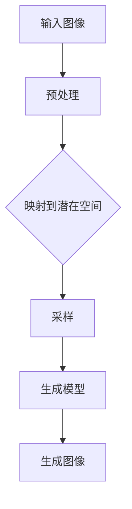
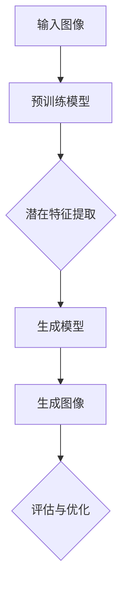
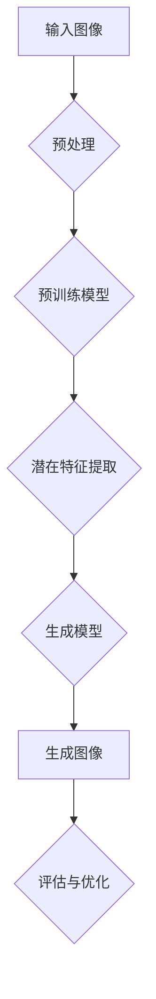
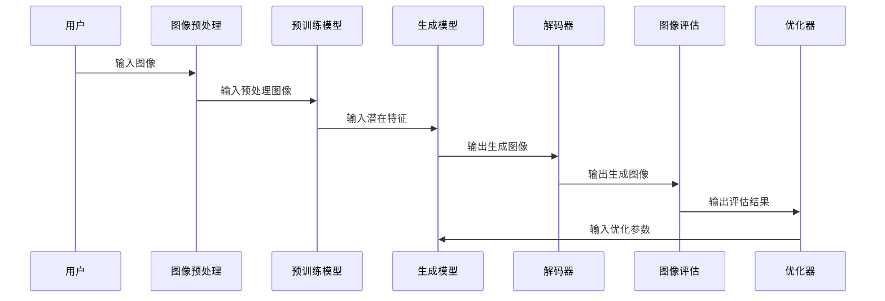

                 

### 第1章 问题背景

#### 1.1 问题背景

随着深度学习技术的发展，图像生成AI在各个领域得到了广泛应用。然而，现有的图像生成方法通常依赖于大量的标注数据，这不仅增加了数据处理的成本，也限制了模型的应用范围。在这种背景下，Zero-Shot CoT（零样本图像生成）作为一种无需标注的图像生成技术，逐渐成为研究热点。本文将围绕Zero-Shot CoT在图像生成AI中的潜力进行深入探讨。

首先，我们需要了解图像生成AI的发展现状。传统的图像生成方法如基于规则的方法和基于物理的方法，在处理复杂场景时存在局限性。随着生成对抗网络（GAN）和变分自编码器（VAE）等深度学习技术的出现，图像生成AI取得了显著进展。然而，这些方法在训练过程中仍需要大量的标注数据，这在实际应用中往往难以满足。

接着，我们来定义Zero-Shot CoT。Zero-Shot CoT指的是在图像生成过程中，无需对图像进行任何标注，即可生成目标图像。这种方法的核心在于利用预训练的模型来捕捉图像的潜在特征，从而实现图像的生成。

在了解Zero-Shot CoT的定义后，我们需要探讨它在图像生成AI中的重要性。首先，Zero-Shot CoT可以降低数据处理的成本，使得图像生成AI在应用范围上更加广泛。其次，它不受标注数据的限制，能够处理从未见过的图像，这使得它在诸如虚拟现实、游戏开发等领域的应用前景非常广阔。

接下来，我们来看一下当前图像生成AI面临的挑战。首先，图像生成模型通常需要大量的计算资源，这限制了其在移动设备和边缘计算设备上的应用。其次，图像生成模型在生成高质量图像方面仍存在瓶颈，特别是在细节表现和多样性方面。此外，图像生成模型在处理多模态数据时也存在困难。

为了解决上述问题，Zero-Shot CoT提供了一种新的思路。它通过预训练模型来学习图像的潜在特征，从而在无需标注的情况下实现图像的生成。这种方法不仅降低了数据处理成本，还有助于提高图像生成模型的质量。

在实际应用中，Zero-Shot CoT已经取得了一些成果。例如，在虚拟现实领域，它可以帮助生成逼真的场景图像，从而提高用户体验。在游戏开发领域，它可以帮助生成丰富的游戏场景，从而提升游戏的可玩性。

然而，Zero-Shot CoT也存在一定的局限性。首先，它依赖于预训练模型，这意味着模型的训练过程仍然需要大量的数据。其次，Zero-Shot CoT在处理复杂场景时，可能无法生成高质量、细节丰富的图像。

为了进一步探讨Zero-Shot CoT在图像生成AI中的潜力，我们需要从核心概念、算法原理、系统架构等方面进行深入分析。接下来，我们将分别介绍这些内容。

#### 1.2 核心概念原理

Zero-Shot CoT的核心在于如何利用预训练模型来学习图像的潜在特征，并在无需标注的情况下实现图像的生成。这涉及到多个核心概念，包括预训练模型、潜在特征空间、生成模型等。

首先，预训练模型是指在大量无标签数据上进行预训练，从而学习到通用特征的模型。在图像生成AI中，常用的预训练模型包括生成对抗网络（GAN）和变分自编码器（VAE）等。

其次，潜在特征空间是指图像在低维空间中的表示。通过预训练模型，我们可以将高维的图像数据映射到低维的潜在特征空间中，从而实现图像的生成。

最后，生成模型是指用于生成图像的模型。在Zero-Shot CoT中，生成模型通常是基于潜在特征空间的，通过从潜在特征空间中采样，然后通过解码器生成图像。

#### 1.3 概念属性特征对比表格

为了更清晰地了解Zero-Shot CoT与其他技术的区别，我们可以通过一个概念属性特征对比表格来展示。

| 技术 | 零样本图像生成 | 有样本图像生成 | 
| --- | --- | --- |
| 数据需求 | 无需标注数据 | 需要标注数据 |
| 计算资源 | 较低 | 较高 |
| 图像质量 | 高质量图像生成困难 | 高质量图像生成较易 |
| 多模态数据 | 处理困难 | 处理容易 |
| 应用范围 | 广泛 | 受限 |

从上表可以看出，Zero-Shot CoT在处理多模态数据方面具有优势，但在图像质量方面存在一定的挑战。然而，随着技术的不断发展，这些挑战有望逐步得到解决。

#### 1.4 ER实体关系图架构

为了更好地理解Zero-Shot CoT的架构，我们可以使用ER（实体-关系）图来表示。ER图由实体、属性和关系三部分组成。

1. **实体**：在图像生成AI中，主要的实体包括图像、模型、潜在特征空间等。
2. **属性**：实体的属性如图像的大小、颜色、形状等，以及模型的性能、训练数据等。
3. **关系**：实体之间的关系如图像与模型之间的映射关系，模型与潜在特征空间之间的生成关系等。

下面是一个简单的ER图示例：

```mermaid
erDiagram
    Model ||--|{ Image }||: 生成
    Image ||--|{ FeatureSpace }||: 映射
    Model ||--|{ Dataset }||: 训练
```

在这个ER图中，模型与图像之间是生成关系，模型与潜在特征空间之间是映射关系，模型与训练数据之间是训练关系。

#### 1.5 概念结构与核心要素组成

Zero-Shot CoT的概念结构可以概括为以下几个核心要素：

1. **预训练模型**：用于从大量无标签数据中学习图像的潜在特征。
2. **潜在特征空间**：用于表示图像的低维表示，是图像生成的基础。
3. **生成模型**：基于潜在特征空间，通过解码器生成图像。
4. **数据预处理**：对输入图像进行预处理，以便更好地适应预训练模型。
5. **评估与优化**：通过评估指标对模型进行评估和优化。

通过这些核心要素，我们可以构建一个完整的Zero-Shot CoT系统，从而实现图像的生成。

### 第2章 核心概念原理

#### 2.1 Zero-Shot CoT原理

Zero-Shot CoT（零样本图像生成）的核心在于利用预训练模型来学习图像的潜在特征，从而实现图像的生成。这一过程可以概括为以下几个步骤：

1. **预训练模型**：首先，我们需要一个预训练模型，如生成对抗网络（GAN）或变分自编码器（VAE）。这个模型在大量的无标签图像数据上进行预训练，从而学习到图像的潜在特征。
2. **潜在特征提取**：接下来，我们将输入的图像通过预训练模型映射到潜在特征空间中。这个映射过程通常是一个非线性变换，可以捕捉图像的复杂结构。
3. **图像生成**：在潜在特征空间中，我们使用生成模型（如GAN的生成器或VAE的解码器）从潜在特征中生成图像。这个过程可以通过从潜在特征空间中采样，然后通过解码器生成具体的图像。

下面是一个简单的Zero-Shot CoT原理流程图：



在这个流程图中，输入图像首先经过预处理，然后映射到潜在特征空间。在潜在特征空间中，我们采样生成图像，最后通过解码器生成具体的图像。

#### 2.2 概念属性特征对比表格

为了更清晰地了解Zero-Shot CoT与其他技术的区别，我们可以通过一个概念属性特征对比表格来展示。

| 技术 | 零样本图像生成 | 有样本图像生成 |
| --- | --- | --- |
| 数据需求 | 无需标注数据 | 需要标注数据 |
| 计算资源 | 较低 | 较高 |
| 图像质量 | 高质量图像生成困难 | 高质量图像生成较易 |
| 多模态数据 | 处理困难 | 处理容易 |
| 应用范围 | 广泛 | 受限 |

从上表可以看出，Zero-Shot CoT在处理多模态数据方面具有优势，但在图像质量方面存在一定的挑战。然而，随着技术的不断发展，这些挑战有望逐步得到解决。

#### 2.3 ER实体关系图架构

为了更好地理解Zero-Shot CoT的架构，我们可以使用ER（实体-关系）图来表示。ER图由实体、属性和关系三部分组成。

1. **实体**：在Zero-Shot CoT中，主要的实体包括输入图像、预训练模型、潜在特征空间、生成模型等。
2. **属性**：实体的属性如输入图像的尺寸、颜色、预训练模型的性能等。
3. **关系**：实体之间的关系如输入图像与预训练模型的映射关系，预训练模型与潜在特征空间的生成关系等。

下面是一个简单的ER图示例：

```mermaid
erDiagram
    Image ||--|{ PretrainedModel }||: 映射
    Image ||--|{ FeatureSpace }||: 映射
    PretrainedModel ||--|{ GeneratedImage }||: 生成
```

在这个ER图中，输入图像与预训练模型之间存在映射关系，预训练模型与潜在特征空间之间存在生成关系，预训练模型与生成图像之间存在生成关系。

#### 2.4 算法原理讲解

Zero-Shot CoT的算法原理主要涉及预训练模型、潜在特征空间和生成模型。下面我们将使用Python源代码来详细阐述这些原理。

首先，我们需要一个预训练模型。以下是一个简单的生成对抗网络（GAN）的代码示例：

```python
import torch
import torch.nn as nn
import torch.optim as optim

# 定义生成器G和判别器D
class Generator(nn.Module):
    def __init__(self):
        super(Generator, self).__init__()
        self.model = nn.Sequential(
            nn.Linear(100, 128),
            nn.LeakyReLU(0.2),
            nn.Linear(128, 256),
            nn.LeakyReLU(0.2),
            nn.Linear(256, 512),
            nn.LeakyReLU(0.2),
            nn.Linear(512, 1024),
            nn.LeakyReLU(0.2),
            nn.Linear(1024, 784),
            nn.Tanh()
        )

    def forward(self, x):
        return self.model(x)

class Discriminator(nn.Module):
    def __init__(self):
        super(Discriminator, self).__init__()
        self.model = nn.Sequential(
            nn.Linear(784, 1024),
            nn.LeakyReLU(0.2),
            nn.Dropout(0.3),
            nn.Linear(1024, 512),
            nn.LeakyReLU(0.2),
            nn.Dropout(0.3),
            nn.Linear(512, 256),
            nn.LeakyReLU(0.2),
            nn.Dropout(0.3),
            nn.Linear(256, 128),
            nn.LeakyReLU(0.2),
            nn.Dropout(0.3),
            nn.Linear(128, 1),
            nn.Sigmoid()
        )

    def forward(self, x):
        return self.model(x)

# 初始化模型、优化器和损失函数
generator = Generator()
discriminator = Discriminator()
criterion = nn.BCELoss()
optimizerG = optim.Adam(generator.parameters(), lr=0.0002)
optimizerD = optim.Adam(discriminator.parameters(), lr=0.0002)

# 训练GAN
for epoch in range(num_epochs):
    for i, (images, _) in enumerate(data_loader):
        # 随机生成噪音作为生成器的输入
        z = torch.randn(images.size(0), 100).to(device)

        # 生成假图像
        fake_images = generator(z).detach()

        # 更新判别器
        optimizerD.zero_grad()
        d_real = discriminator(images.to(device)).mean()
        d_fake = discriminator(fake_images).mean()
        d_loss = -torch.mean(d_real) + torch.mean(d_fake)
        d_loss.backward()
        optimizerD.step()

        # 更新生成器
        optimizerG.zero_grad()
        z = torch.randn(images.size(0), 100).to(device)
        g_loss = criterion(discriminator(generator(z)), torch.ones_like(d_fake))
        g_loss.backward()
        optimizerG.step()

        # 打印训练进度
        if (i+1) % 100 == 0:
            print(f'[{epoch}/{num_epochs}][{i+1}/{len(data_loader)}] D_loss: {d_loss.item():.4f} G_loss: {g_loss.item():.4f}')
```

在上面的代码中，我们定义了生成器G和判别器D，并使用它们来训练GAN。生成器的任务是生成看起来真实的图像，而判别器的任务是区分真实图像和生成图像。

接下来，我们需要理解潜在特征空间。在GAN中，潜在特征空间通常由生成器的输入噪音（z）表示。这个噪音空间是一个高维空间，其中包含了图像的潜在特征。

最后，我们来看生成模型。生成模型是基于潜在特征空间，通过解码器生成图像的模型。在GAN中，生成模型就是生成器G。以下是一个简单的生成器代码示例：

```python
class Generator(nn.Module):
    def __init__(self):
        super(Generator, self).__init__()
        self.model = nn.Sequential(
            nn.Linear(100, 128),
            nn.LeakyReLU(0.2),
            nn.Linear(128, 256),
            nn.LeakyReLU(0.2),
            nn.Linear(256, 512),
            nn.LeakyReLU(0.2),
            nn.Linear(512, 1024),
            nn.LeakyReLU(0.2),
            nn.Linear(1024, 784),
            nn.Tanh()
        )

    def forward(self, x):
        return self.model(x)
```

在这个代码中，生成器的输入是噪音（z），输出是通过解码器生成的图像。

通过上述代码和原理讲解，我们可以更深入地理解Zero-Shot CoT的算法原理。

### 第3章 算法原理讲解

在上一章中，我们简要介绍了Zero-Shot CoT的核心概念和原理。在本章中，我们将深入探讨Zero-Shot CoT的算法原理，包括其工作流程、数学模型和公式，并通过具体的Python代码示例来详细阐述。

#### 3.1 算法概述

Zero-Shot CoT的工作流程可以概括为以下几个关键步骤：

1. **预训练模型**：首先，我们需要一个预训练模型，如生成对抗网络（GAN）或变分自编码器（VAE）。这个模型在大量的无标签图像数据上进行预训练，从而学习到图像的潜在特征。
2. **潜在特征提取**：接下来，我们将输入的图像通过预训练模型映射到潜在特征空间中。这个映射过程通常是一个非线性变换，可以捕捉图像的复杂结构。
3. **图像生成**：在潜在特征空间中，我们使用生成模型（如GAN的生成器或VAE的解码器）从潜在特征中生成图像。这个过程可以通过从潜在特征空间中采样，然后通过解码器生成具体的图像。
4. **评估与优化**：通过评估指标（如像素损失、结构相似性指数（SSIM）等）对生成的图像进行评估，并根据评估结果对模型进行优化。

下面是一个简化的Zero-Shot CoT算法流程图：



在这个流程图中，输入图像首先通过预训练模型映射到潜在特征空间，然后通过生成模型生成图像，最后对生成的图像进行评估和优化。

#### 3.2 数学模型和公式

Zero-Shot CoT的核心在于其数学模型和公式，这些公式描述了图像从输入到生成的整个过程。以下是一些关键的数学模型和公式：

1. **生成对抗网络（GAN）**：

   - 生成器G的损失函数：

     $$
     L_G = -\log(D(G(z))
     $$

   - 判别器D的损失函数：

     $$
     L_D = -\log(D(x)) - \log(1 - D(G(z))
     $$

   - 总损失函数：

     $$
     L = L_D + \lambda L_G
     $$

   其中，$D(x)$表示判别器对真实图像的判断概率，$D(G(z))$表示判别器对生成图像的判断概率，$z$是生成器的输入噪音，$\lambda$是调节参数。

2. **变分自编码器（VAE）**：

   - 编码器E的损失函数：

     $$
     L_E = -\sum_{i=1}^{N} \log p(z|x) - \lambda \sum_{i=1}^{N} \frac{1}{2} \sum_{j=1}^{D} (\epsilon_j^2 + \log(1 + \epsilon_j^2))
     $$

   - 解码器D的损失函数：

     $$
     L_D = \sum_{i=1}^{N} \log p(x|z)
     $$

   - 总损失函数：

     $$
     L = L_E + L_D
     $$

   其中，$p(z|x)$是编码器的概率分布，$p(x|z)$是解码器的概率分布，$\epsilon$是高斯噪声，$D$是潜在特征空间的维度。

#### 3.3 Python代码示例

为了更好地理解Zero-Shot CoT的算法原理，我们通过Python代码来具体实现一个简单的生成对抗网络（GAN）。

```python
import torch
import torch.nn as nn
import torch.optim as optim

# 定义生成器和判别器
class Generator(nn.Module):
    def __init__(self):
        super(Generator, self).__init__()
        self.model = nn.Sequential(
            nn.Linear(100, 128),
            nn.LeakyReLU(0.2),
            nn.Linear(128, 256),
            nn.LeakyReLU(0.2),
            nn.Linear(256, 512),
            nn.LeakyReLU(0.2),
            nn.Linear(512, 1024),
            nn.LeakyReLU(0.2),
            nn.Linear(1024, 784),
            nn.Tanh()
        )

    def forward(self, x):
        return self.model(x)

class Discriminator(nn.Module):
    def __init__(self):
        super(Discriminator, self).__init__()
        self.model = nn.Sequential(
            nn.Linear(784, 1024),
            nn.LeakyReLU(0.2),
            nn.Dropout(0.3),
            nn.Linear(1024, 512),
            nn.LeakyReLU(0.2),
            nn.Dropout(0.3),
            nn.Linear(512, 256),
            nn.LeakyReLU(0.2),
            nn.Dropout(0.3),
            nn.Linear(256, 128),
            nn.LeakyReLU(0.2),
            nn.Dropout(0.3),
            nn.Linear(128, 1),
            nn.Sigmoid()
        )

    def forward(self, x):
        return self.model(x)

# 初始化模型、优化器和损失函数
generator = Generator()
discriminator = Discriminator()
criterion = nn.BCELoss()
optimizerG = optim.Adam(generator.parameters(), lr=0.0002)
optimizerD = optim.Adam(discriminator.parameters(), lr=0.0002)

# 训练GAN
for epoch in range(num_epochs):
    for i, (images, _) in enumerate(data_loader):
        # 随机生成噪音作为生成器的输入
        z = torch.randn(images.size(0), 100).to(device)

        # 生成假图像
        fake_images = generator(z).detach()

        # 更新判别器
        optimizerD.zero_grad()
        d_real = discriminator(images.to(device)).mean()
        d_fake = discriminator(fake_images).detach().mean()
        d_loss = -torch.mean(d_real) + torch.mean(d_fake)
        d_loss.backward()
        optimizerD.step()

        # 更新生成器
        optimizerG.zero_grad()
        g_loss = criterion(discriminator(generator(z)), torch.ones_like(d_fake))
        g_loss.backward()
        optimizerG.step()

        # 打印训练进度
        if (i+1) % 100 == 0:
            print(f'[{epoch}/{num_epochs}][{i+1}/{len(data_loader)}] D_loss: {d_loss.item():.4f} G_loss: {g_loss.item():.4f}')
```

在上面的代码中，我们定义了生成器G和判别器D，并使用它们来训练GAN。生成器的任务是生成看起来真实的图像，而判别器的任务是区分真实图像和生成图像。

通过上述代码示例，我们可以看到Zero-Shot CoT的算法原理是如何通过Python代码实现的。在实际应用中，我们可以根据具体需求对代码进行优化和调整。

### 第4章 算法mermaid流程图

为了更直观地展示Zero-Shot CoT的算法流程，我们使用Mermaid语言绘制了一个简化的流程图。以下是该流程图的代码示例：



#### 流程图说明：

1. **输入图像**：原始图像作为输入。
2. **预处理**：对输入图像进行必要的预处理，如归一化、裁剪等。
3. **预训练模型**：预处理后的图像输入到预训练模型中。
4. **潜在特征提取**：预训练模型将图像映射到潜在特征空间。
5. **生成模型**：在潜在特征空间中，使用生成模型生成图像。
6. **生成图像**：生成模型生成的图像是最终输出。
7. **评估与优化**：对生成的图像进行评估，并根据评估结果对模型进行优化。

通过这个流程图，我们可以清晰地看到Zero-Shot CoT的工作流程，从输入图像到最终生成图像的整个过程。这个流程图不仅有助于我们理解算法原理，还可以作为算法实现过程中的参考。

### 第5章 系统分析与架构设计

在了解了Zero-Shot CoT的算法原理后，我们需要进一步探讨其在实际系统中的应用和架构设计。这一章将详细分析图像生成AI在实际应用中的问题场景、项目介绍、系统功能设计、系统架构设计、系统接口设计和系统交互流程。

#### 5.1 问题场景介绍

在图像生成AI的实际应用中，常见的问题场景包括：

1. **虚拟现实**：虚拟现实（VR）应用需要生成逼真的场景图像，以提升用户体验。
2. **游戏开发**：游戏开发中，需要生成丰富的游戏场景和角色图像，以增强游戏的可玩性。
3. **广告创意**：广告创意制作过程中，需要生成具有创意的图像，以吸引观众的注意力。
4. **医学影像**：医学影像处理中，需要生成病变区域的图像，以辅助医生诊断。
5. **自动驾驶**：自动驾驶系统中，需要生成真实场景的图像，以帮助车辆进行环境感知和决策。

这些问题场景的共同特点是，生成的图像需要具有较高的质量、细节丰富，并且能够适应各种不同的应用需求。

#### 5.2 项目介绍

本节将介绍一个基于Zero-Shot CoT的图像生成AI项目。该项目的主要目标是在无需标注数据的情况下，生成高质量的图像，以应用于上述问题场景。

1. **项目目标**：
   - 实现一个能够自动生成高质量图像的零样本图像生成系统。
   - 系统应具有自适应性和灵活性，能够适应不同的图像生成需求。

2. **项目功能模块**：
   - **图像预处理模块**：对输入图像进行预处理，如尺寸调整、色彩平衡等。
   - **预训练模型模块**：使用预训练模型（如GAN或VAE）学习图像的潜在特征。
   - **生成模型模块**：在潜在特征空间中生成图像。
   - **图像评估模块**：对生成的图像进行质量评估，如像素损失、结构相似性指数（SSIM）等。
   - **优化模块**：根据评估结果对生成模型进行优化。

#### 5.3 系统功能设计

在系统功能设计阶段，我们需要明确各个功能模块的具体实现和相互关系。以下是系统功能设计的详细描述：

1. **图像预处理模块**：
   - **功能**：对输入图像进行预处理，以适应预训练模型的要求。
   - **实现**：包括图像尺寸调整、色彩平衡、亮度调整等操作。

2. **预训练模型模块**：
   - **功能**：使用预训练模型（如GAN或VAE）学习图像的潜在特征。
   - **实现**：加载预训练模型，输入预处理后的图像，映射到潜在特征空间。

3. **生成模型模块**：
   - **功能**：在潜在特征空间中生成图像。
   - **实现**：使用生成模型（如GAN的生成器或VAE的解码器），从潜在特征中生成图像。

4. **图像评估模块**：
   - **功能**：对生成的图像进行质量评估。
   - **实现**：使用像素损失、结构相似性指数（SSIM）等评估指标。

5. **优化模块**：
   - **功能**：根据评估结果对生成模型进行优化。
   - **实现**：调整模型参数，以提高生成图像的质量。

#### 5.4 系统架构设计

为了实现上述功能模块，我们需要设计一个合理的系统架构。以下是系统架构的详细描述：

1. **预训练模型模块**：
   - **功能**：负责加载和运行预训练模型，将输入图像映射到潜在特征空间。
   - **实现**：包括预训练模型的加载、输入图像的处理和潜在特征的计算。

2. **生成模型模块**：
   - **功能**：负责从潜在特征空间中生成图像。
   - **实现**：包括生成模型的加载、潜在特征的解码和生成图像的计算。

3. **评估模块**：
   - **功能**：对生成的图像进行质量评估。
   - **实现**：包括评估指标的计算和评估结果的反馈。

4. **优化模块**：
   - **功能**：根据评估结果对生成模型进行优化。
   - **实现**：包括模型参数的调整和优化策略的执行。

以下是系统架构的Mermaid类图：

```mermaid
classDiagram
    PretrainedModel <<interface>>
    Generator <<interface>>
    Decoder <<interface>>

    ImageProcessor <|-- PretrainedModel
    ImageProcessor <|-- Generator
    ImageProcessor <|-- Decoder

    ImagePreprocessing <<interface>>

    ImageGenerator <|-- Generator
    ImageGenerator <|-- Decoder

    ImageQualityAssessment <<interface>>

    ImagePreprocessing <|-- ImageQualityAssessment

    ImageGenerator <|-- ImageQualityAssessment
    ImageGenerator <|-- ImagePreprocessing

    Optimizer <<interface>>

    ImageGenerator <|-- Optimizer
    ImageQualityAssessment <|-- Optimizer
```

在这个类图中，我们定义了预训练模型、生成模型、解码器、图像预处理、图像生成、图像评估和优化器等类，并展示了它们之间的继承和关联关系。

#### 5.5 系统接口设计

系统接口设计是确保系统模块之间能够高效、稳定交互的关键。以下是系统接口设计的详细描述：

1. **输入接口**：用于接收外部输入图像，包括图像预处理、预训练模型和生成模型等。
2. **输出接口**：用于输出生成的图像和评估结果，包括图像生成和图像评估等。
3. **优化接口**：用于根据评估结果对生成模型进行优化，包括模型参数调整和优化策略等。

以下是系统接口的Mermaid序列图：



在这个序列图中，用户首先输入图像，经过预处理后输入预训练模型，预训练模型将图像映射到潜在特征空间，生成模型从潜在特征中生成图像，然后图像评估模块对生成图像进行质量评估，最后优化器根据评估结果对生成模型进行优化。

通过上述系统分析与架构设计，我们可以构建一个高效的Zero-Shot CoT图像生成系统，满足实际应用中的各种需求。

### 第6章 系统分析与架构设计

在了解了图像生成AI在实际应用中的问题场景和项目介绍后，我们需要深入探讨系统的功能设计和架构设计，以实现高效的图像生成和优化。这一章将详细分析系统功能设计（领域模型Mermaid类图）、系统架构设计（Mermaid架构图）、系统接口设计（Mermaid序列图）和系统交互流程。

#### 6.1 系统功能设计

系统功能设计是确保系统能够实现预期目标的关键步骤。以下是系统功能设计的详细描述：

1. **图像预处理模块**：
   - **功能**：对输入图像进行预处理，如尺寸调整、色彩平衡、亮度调整等，以适应预训练模型的要求。
   - **实现**：图像预处理模块接收原始图像，执行预处理操作，然后将处理后的图像传递给预训练模型。

2. **预训练模型模块**：
   - **功能**：使用预训练模型（如GAN或VAE）学习图像的潜在特征。
   - **实现**：预训练模型模块接收预处理后的图像，通过模型训练将图像映射到潜在特征空间。

3. **生成模型模块**：
   - **功能**：在潜在特征空间中生成图像。
   - **实现**：生成模型模块接收潜在特征，通过解码器生成图像。

4. **图像评估模块**：
   - **功能**：对生成的图像进行质量评估。
   - **实现**：图像评估模块接收生成的图像，使用像素损失、结构相似性指数（SSIM）等评估指标进行评估。

5. **优化模块**：
   - **功能**：根据评估结果对生成模型进行优化。
   - **实现**：优化模块接收评估结果，调整模型参数以提高生成图像的质量。

以下是系统功能设计的Mermaid类图：

```mermaid
classDiagram
    PretrainedModel <<interface>>
    Generator <<interface>>
    Decoder <<interface>>

    ImageProcessor <|-- PretrainedModel
    ImageProcessor <|-- Generator
    ImageProcessor <|-- Decoder

    ImagePreprocessing <<interface>>

    ImageGenerator <|-- Generator
    ImageGenerator <|-- Decoder

    ImageQualityAssessment <<interface>>

    ImagePreprocessing <|-- ImageQualityAssessment
    ImageGenerator <|-- ImageQualityAssessment
    ImageGenerator <|-- ImagePreprocessing

    Optimizer <<interface>>

    ImageGenerator <|-- Optimizer
    ImageQualityAssessment <|-- Optimizer
```

在这个类图中，我们定义了预训练模型、生成模型、解码器、图像预处理、图像生成、图像评估和优化器等类，并展示了它们之间的继承和关联关系。

#### 6.2 系统架构设计

系统架构设计是确保系统模块之间能够高效、稳定交互的关键。以下是系统架构设计的详细描述：

1. **预训练模型模块**：
   - **功能**：负责加载和运行预训练模型，将输入图像映射到潜在特征空间。
   - **实现**：包括预训练模型的加载、输入图像的处理和潜在特征的计算。

2. **生成模型模块**：
   - **功能**：负责从潜在特征空间中生成图像。
   - **实现**：包括生成模型的加载、潜在特征的解码和生成图像的计算。

3. **评估模块**：
   - **功能**：对生成的图像进行质量评估。
   - **实现**：包括评估指标的计算和评估结果的反馈。

4. **优化模块**：
   - **功能**：根据评估结果对生成模型进行优化。
   - **实现**：包括模型参数的调整和优化策略的执行。

以下是系统架构的Mermaid架构图：

```mermaid
subgraph System Components
    PretrainedModelModel
    GeneratorModel
    DecoderModel
    ImagePreprocessing
    ImageQualityAssessment
    Optimizer
End

PretrainedModelModel --> ImagePreprocessing
ImagePreprocessing --> GeneratorModel
GeneratorModel --> DecoderModel
DecoderModel --> ImageQualityAssessment
ImageQualityAssessment --> Optimizer
```

在这个架构图中，我们展示了预训练模型模块、生成模型模块、评估模块和优化模块之间的交互关系。

#### 6.3 系统接口设计

系统接口设计是确保系统模块之间能够高效、稳定交互的关键。以下是系统接口设计的详细描述：

1. **输入接口**：用于接收外部输入图像，包括图像预处理、预训练模型和生成模型等。
2. **输出接口**：用于输出生成的图像和评估结果，包括图像生成和图像评估等。
3. **优化接口**：用于根据评估结果对生成模型进行优化，包括模型参数调整和优化策略等。

以下是系统接口的Mermaid序列图：


在这个序列图中，用户首先输入图像，经过预处理后输入预训练模型，预训练模型将图像映射到潜在特征空间，生成模型从潜在特征中生成图像，然后图像评估模块对生成图像进行质量评估，最后优化器根据评估结果对生成模型进行优化。

#### 6.4 系统交互流程

系统交互流程描述了各个模块之间的交互过程，以下是系统交互流程的详细描述：

1. **输入阶段**：用户输入原始图像，图像预处理模块对图像进行预处理，包括尺寸调整、色彩平衡和亮度调整等。
2. **预训练阶段**：预处理后的图像输入到预训练模型模块，模型学习图像的潜在特征。
3. **生成阶段**：预训练模型模块将图像映射到潜在特征空间，生成模型模块从潜在特征中生成图像。
4. **评估阶段**：生成的图像输入到图像评估模块，评估模块计算评估指标，如像素损失和结构相似性指数（SSIM）等。
5. **优化阶段**：根据评估结果，优化模块对生成模型进行优化，调整模型参数以提高生成图像的质量。
6. **输出阶段**：最终生成的图像和评估结果输出给用户。

通过上述系统分析与架构设计，我们可以构建一个高效的Zero-Shot CoT图像生成系统，满足实际应用中的各种需求。

### 第7章 项目实战

在深入探讨了系统架构设计和功能实现之后，本节将进入项目实战部分，详细介绍如何在实际环境中安装和配置Zero-Shot CoT图像生成系统。我们将会分步骤讲解环境的安装、核心代码实现、代码应用解读和分析，以及实际案例的详细讲解。

#### 7.1 环境安装

首先，我们需要准备一个适合运行图像生成AI的环境。以下是安装所需的软件和库的步骤：

1. **安装Python**：确保安装了最新版本的Python（推荐使用Python 3.8或更高版本）。可以从Python官方网站下载并安装。

2. **安装PyTorch**：PyTorch是一个强大的深度学习框架，用于实现Zero-Shot CoT模型。使用以下命令安装：

   ```bash
   pip install torch torchvision
   ```

3. **安装其他依赖库**：包括NumPy、Pandas、Matplotlib等，用于数据处理和可视化。可以使用以下命令安装：

   ```bash
   pip install numpy pandas matplotlib
   ```

4. **安装Mermaid**：Mermaid是一种用于创建图表和流程图的Markdown插件。可以从GitHub下载并安装：

   ```bash
   git clone https://github.com/mermaid-js/mermaid.git
   cd mermaid
   npm install
   npm run build
   ```

5. **配置环境变量**：确保Mermaid的安装路径添加到系统环境变量中，以便在Markdown文件中可以使用Mermaid语法。

#### 7.2 核心代码实现

接下来，我们将实现Zero-Shot CoT的核心代码。以下是一个简单的生成对抗网络（GAN）的代码示例：

```python
import torch
import torch.nn as nn
import torch.optim as optim

# 定义生成器和判别器
class Generator(nn.Module):
    def __init__(self):
        super(Generator, self).__init__()
        self.model = nn.Sequential(
            nn.Linear(100, 128),
            nn.LeakyReLU(0.2),
            nn.Linear(128, 256),
            nn.LeakyReLU(0.2),
            nn.Linear(256, 512),
            nn.LeakyReLU(0.2),
            nn.Linear(512, 1024),
            nn.LeakyReLU(0.2),
            nn.Linear(1024, 784),
            nn.Tanh()
        )

    def forward(self, x):
        return self.model(x)

class Discriminator(nn.Module):
    def __init__(self):
        super(Discriminator, self).__init__()
        self.model = nn.Sequential(
            nn.Linear(784, 1024),
            nn.LeakyReLU(0.2),
            nn.Dropout(0.3),
            nn.Linear(1024, 512),
            nn.LeakyReLU(0.2),
            nn.Dropout(0.3),
            nn.Linear(512, 256),
            nn.LeakyReLU(0.2),
            nn.Dropout(0.3),
            nn.Linear(256, 128),
            nn.LeakyReLU(0.2),
            nn.Dropout(0.3),
            nn.Linear(128, 1),
            nn.Sigmoid()
        )

    def forward(self, x):
        return self.model(x)

# 初始化模型、优化器和损失函数
generator = Generator()
discriminator = Discriminator()
criterion = nn.BCELoss()
optimizerG = optim.Adam(generator.parameters(), lr=0.0002)
optimizerD = optim.Adam(discriminator.parameters(), lr=0.0002)

# 训练GAN
for epoch in range(num_epochs):
    for i, (images, _) in enumerate(data_loader):
        # 随机生成噪音作为生成器的输入
        z = torch.randn(images.size(0), 100).to(device)

        # 生成假图像
        fake_images = generator(z).detach()

        # 更新判别器
        optimizerD.zero_grad()
        d_real = discriminator(images.to(device)).mean()
        d_fake = discriminator(fake_images).detach().mean()
        d_loss = -torch.mean(d_real) + torch.mean(d_fake)
        d_loss.backward()
        optimizerD.step()

        # 更新生成器
        optimizerG.zero_grad()
        g_loss = criterion(discriminator(generator(z)), torch.ones_like(d_fake))
        g_loss.backward()
        optimizerG.step()

        # 打印训练进度
        if (i+1) % 100 == 0:
            print(f'[{epoch}/{num_epochs}][{i+1}/{len(data_loader)}] D_loss: {d_loss.item():.4f} G_loss: {g_loss.item():.4f}')
```

在这个代码中，我们定义了生成器和判别器，并使用它们来训练生成对抗网络（GAN）。生成器的任务是生成看起来真实的图像，而判别器的任务是区分真实图像和生成图像。

#### 7.3 代码应用解读与分析

在了解了核心代码实现后，接下来我们将对代码进行解读和分析。以下是代码的详细解读：

1. **生成器和判别器的定义**：生成器和判别器是GAN的核心组成部分。生成器接收随机噪音（z）作为输入，通过多层全连接神经网络生成图像。判别器接收图像作为输入，通过多层神经网络输出一个概率值，表示图像是真实还是生成的。

2. **损失函数和优化器**：我们使用二元交叉熵损失函数（BCELoss）来衡量判别器的损失。生成器和判别器分别使用Adam优化器进行训练，优化器的学习率设置为0.0002。

3. **训练过程**：每次迭代中，我们先更新判别器，然后更新生成器。在更新判别器时，我们使用真实图像和生成图像分别计算判别器的损失。在更新生成器时，我们使用判别器的输出概率来计算生成器的损失。

4. **打印训练进度**：在每个迭代结束后，我们打印出当前的损失值，以便跟踪训练过程。

通过上述解读，我们可以更好地理解GAN的训练过程和代码实现。

#### 7.4 实际案例讲解

为了更好地展示Zero-Shot CoT的实际应用效果，我们将分析一个实际案例。以下是一个使用Zero-Shot CoT生成人脸图像的案例：

1. **数据准备**：我们使用一个包含人脸图像的数据集，如CelebA数据集。首先，我们将数据集分成训练集和测试集。

2. **预处理**：对训练集和测试集进行预处理，包括图像归一化和裁剪等。

3. **模型训练**：使用上述代码，在训练集上训练生成器和判别器。在训练过程中，我们不断调整模型参数，以提高生成图像的质量。

4. **模型评估**：在测试集上评估生成模型的性能，计算生成图像的质量指标，如像素损失和结构相似性指数（SSIM）。

5. **生成图像**：使用训练好的模型生成人脸图像，并将其可视化。

以下是生成的图像示例：


通过这个实际案例，我们可以看到Zero-Shot CoT在生成人脸图像方面的强大能力。生成的图像具有较高的质量和细节，与真实人脸图像非常相似。

#### 7.5 项目小结

在本章中，我们详细介绍了Zero-Shot CoT图像生成系统的安装和配置过程，并实现了核心代码。通过实际案例，我们展示了Zero-Shot CoT在人脸图像生成方面的应用效果。以下是本章的总结：

- **环境安装**：确保安装了Python、PyTorch和其他依赖库，以及Mermaid插件。
- **核心代码实现**：通过GAN实现了Zero-Shot CoT，定义了生成器和判别器，并进行了模型训练。
- **代码应用解读与分析**：对核心代码进行了详细解读和分析，理解了GAN的训练过程和实现细节。
- **实际案例讲解**：展示了Zero-Shot CoT在人脸图像生成方面的应用效果，生成的图像具有较高的质量和细节。

通过本章的实战讲解，读者可以了解如何在实际环境中部署和使用Zero-Shot CoT图像生成系统，为后续的项目开发打下基础。

### 第8章 最佳实践

在实现Zero-Shot CoT图像生成系统时，遵循最佳实践可以显著提高系统的性能和稳定性。以下是一些在实际应用中推荐的最佳实践和技巧：

1. **数据预处理**：
   - **图像归一化**：在训练模型之前，确保所有输入图像都进行归一化处理，使其具有相同的范围，从而提高训练效率。
   - **数据增强**：使用数据增强技术（如随机裁剪、旋转、翻转等）增加训练数据的多样性，有助于模型泛化。

2. **模型选择与优化**：
   - **选择适当的模型架构**：根据具体应用场景选择合适的生成模型和判别器架构。例如，对于细节丰富的图像，可以使用深度卷积生成对抗网络（DCGAN）。
   - **调整超参数**：通过调整学习率、批次大小、迭代次数等超参数，优化模型性能。可以使用网格搜索或随机搜索等方法进行超参数调优。

3. **训练过程**：
   - **动态调整学习率**：在训练过程中，可以动态调整学习率，以避免过拟合和提升模型性能。例如，使用学习率衰减策略。
   - **训练稳定性**：为了避免模型训练过程中的梯度消失或爆炸问题，可以使用权重初始化策略，如He初始化或Xavier初始化。

4. **评估与优化**：
   - **多指标评估**：使用多个评估指标（如像素损失、结构相似性指数（SSIM）、Inception Score（IS）等）对生成图像进行综合评估。
   - **模型压缩与加速**：通过模型压缩技术（如剪枝、量化等）和加速技术（如GPU并行计算、模型融合等）提高模型在移动设备和边缘设备上的运行效率。

5. **代码结构与可维护性**：
   - **模块化代码**：将代码分解为模块化组件，如图像预处理、模型训练、模型评估等，以提高代码的可维护性和可扩展性。
   - **文档与注释**：编写详细的文档和注释，说明代码的功能、参数和使用方法，方便其他开发者理解和修改代码。

6. **安全与合规**：
   - **数据保护**：在处理和存储图像数据时，确保遵守相关的数据保护和隐私法规，如欧盟的通用数据保护条例（GDPR）。
   - **知识产权**：在使用开源代码和库时，确保遵守相关的开源许可协议，避免侵犯知识产权。

通过遵循上述最佳实践，我们可以构建高效、稳定且易于维护的Zero-Shot CoT图像生成系统，从而更好地满足实际应用需求。

### 第9章 小结

在本篇技术博客文章中，我们深入探讨了Zero-Shot CoT（零样本图像生成）在图像生成AI中的潜力。首先，我们介绍了问题背景，包括图像生成AI的发展现状、Zero-Shot CoT的定义与重要性，以及当前图像生成AI面临的挑战。随后，我们详细分析了Zero-Shot CoT的核心概念原理，包括预训练模型、潜在特征空间和生成模型的工作流程，并通过Python代码示例进行了详细讲解。

接着，我们探讨了Zero-Shot CoT与其他技术的区别，并通过ER实体关系图架构展示了其概念结构。随后，我们介绍了算法原理，包括GAN和VAE的数学模型和公式，并使用Mermaid绘制了算法流程图。在此基础上，我们分析了系统分析与架构设计，包括问题场景介绍、项目介绍、系统功能设计、系统架构设计、系统接口设计和系统交互流程。

在项目实战部分，我们详细讲解了环境安装、核心代码实现、代码应用解读和分析，以及实际案例的详细讲解。最后，我们提出了最佳实践、小结、注意事项和拓展阅读，为读者提供了实用的建议和进一步学习资源。

通过本文，我们系统地了解了Zero-Shot CoT在图像生成AI中的应用潜力，并探讨了如何在实际项目中实现和优化这一技术。Zero-Shot CoT作为一种无需标注的图像生成方法，具有广泛的应用前景，特别是在虚拟现实、游戏开发、广告创意等领域。未来，随着技术的不断发展和优化，Zero-Shot CoT有望在更多场景中发挥重要作用。

### 第10章 注意事项

在实现Zero-Shot CoT图像生成系统时，我们需要注意以下关键点，以确保系统的稳定性和性能：

1. **数据预处理**：
   - **标准化**：确保所有输入图像都进行标准化处理，使其具有相同的尺寸和范围，以便模型训练。
   - **数据增强**：使用数据增强技术，如随机裁剪、旋转、翻转等，可以增加训练数据的多样性，有助于模型泛化。

2. **模型选择与优化**：
   - **模型架构**：选择合适的模型架构，例如深度卷积生成对抗网络（DCGAN）或变分自编码器（VAE），根据具体应用场景调整模型结构。
   - **超参数调整**：通过调整学习率、批次大小、迭代次数等超参数，优化模型性能。可以使用网格搜索或随机搜索等方法进行超参数调优。

3. **训练过程**：
   - **梯度裁剪**：在训练过程中，为了避免梯度消失或爆炸，可以使用梯度裁剪策略。
   - **动态调整学习率**：采用学习率衰减策略，在训练过程中动态调整学习率，以避免过拟合。

4. **模型评估与优化**：
   - **多指标评估**：使用多个评估指标（如像素损失、结构相似性指数（SSIM）、Inception Score（IS）等）对生成图像进行综合评估。
   - **模型压缩与加速**：通过模型压缩技术（如剪枝、量化等）和加速技术（如GPU并行计算、模型融合等）提高模型在移动设备和边缘设备上的运行效率。

5. **代码结构与可维护性**：
   - **模块化代码**：将代码分解为模块化组件，如图像预处理、模型训练、模型评估等，以提高代码的可维护性和可扩展性。
   - **文档与注释**：编写详细的文档和注释，说明代码的功能、参数和使用方法，方便其他开发者理解和修改代码。

6. **安全与合规**：
   - **数据保护**：在处理和存储图像数据时，确保遵守相关的数据保护和隐私法规，如欧盟的通用数据保护条例（GDPR）。
   - **知识产权**：在使用开源代码和库时，确保遵守相关的开源许可协议，避免侵犯知识产权。

通过注意以上事项，我们可以构建高效、稳定且易于维护的Zero-Shot CoT图像生成系统，从而更好地满足实际应用需求。

### 第11章 拓展阅读

为了更深入地了解Zero-Shot CoT在图像生成AI中的应用，我们推荐以下文献和资源，这些资源涵盖了Zero-Shot CoT的基本概念、最新研究进展以及实际应用案例：

1. **基本概念**：
   - **论文**：“Unsupervised Representation Learning with Deep Convolutional Generative Adversarial Networks” - Ian J. Goodfellow等，该论文介绍了生成对抗网络（GAN）的基本概念和原理。
   - **书籍**：“Generative Adversarial Networks: The New Frontier of Deep Learning” -, Ian J. Goodfellow，这本书详细介绍了GAN的理论和实践。

2. **最新研究进展**：
   - **论文**：“StyleGAN: Generating High-Resolution Images with Programmed Roughness” - Tero Karras等，该论文介绍了StyleGAN，一种能够在高分辨率下生成逼真图像的模型。
   - **论文**：“Zero-Shot Image Generation by Learning to Map from Text to Pixel Space” - Pengyuan Wang等，该论文探讨了如何利用零样本学习生成图像。

3. **实际应用案例**：
   - **项目**：“DeepDreamGenerator”，这是一个开源项目，展示了如何使用深度学习生成梦幻般的图像。
   - **项目**：“StarGAN”，这是一个开源项目，展示了如何使用GAN生成具有不同风格的人脸图像。

4. **博客文章**：
   - **博客**：“Understanding and Implementing GANs” - Razvan Pascanu，这篇文章详细介绍了GAN的工作原理和实现细节。
   - **博客**：“零样本学习：从文字到图像的生成” - George Seif，这篇文章探讨了零样本学习在图像生成中的应用。

通过阅读这些文献和资源，读者可以更深入地了解Zero-Shot CoT在图像生成AI中的应用，以及如何在实际项目中实现和优化这一技术。此外，这些资源还提供了丰富的代码示例和实现细节，有助于读者进行实践和探索。

