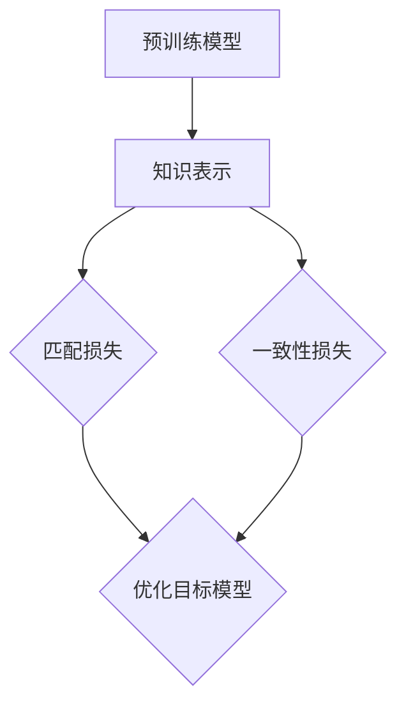
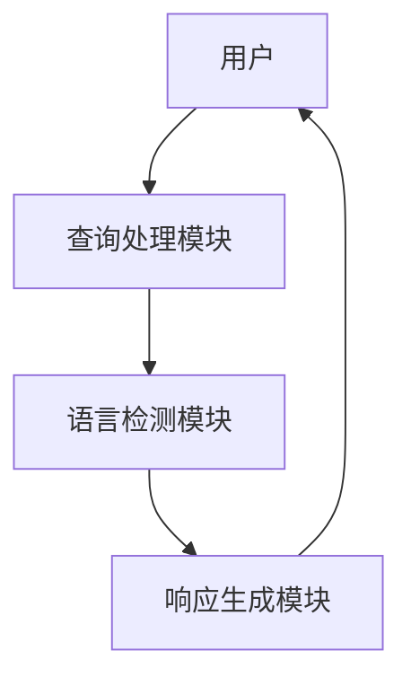
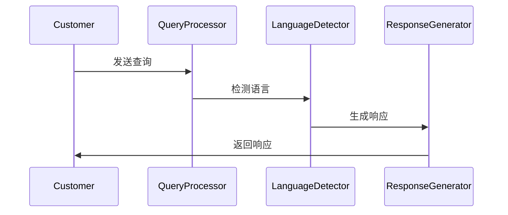

                 

**文章标题：Zero-Shot CoT在多语言环境下的表现**

**关键词：零样本协同训练、多语言环境、自然语言处理、人工智能、机器学习**

**摘要：**
本文旨在探讨零样本协同训练（Zero-Shot CoT）在多语言环境中的应用。我们将从背景介绍、核心概念、算法原理、系统设计到项目实战等方面展开讨论，分析Zero-Shot CoT在多语言环境中的挑战、解决方案以及最佳实践。通过本文的阅读，读者将对Zero-Shot CoT在多语言环境中的表现有一个全面而深入的理解。

---

## **第一部分：背景介绍**

### **1.1 问题背景**

在全球化加速发展的今天，多语言环境的应用场景越来越广泛，如跨文化交流、多语言搜索引擎、多语言客服系统等。然而，传统的机器学习模型在处理多语言环境时面临诸多挑战。其中，最突出的问题之一便是数据稀缺问题。由于不同语言间的差异，许多语言没有足够的数据来训练深度学习模型，导致模型性能受限。

### **1.2 问题描述**

零样本协同训练（Zero-Shot CoT）是一种无需依赖特定领域数据即可进行训练的方法，非常适合解决多语言环境中的数据稀缺问题。但在多语言环境下，Zero-Shot CoT面临以下问题：

1. 语言差异性：不同语言之间存在语法、语义和词汇等方面的差异，这给Zero-Shot CoT带来了挑战。
2. 数据分布：多语言环境中，数据分布往往不均匀，某些语言的数据量远小于其他语言。
3. 模型泛化：如何在保证模型性能的前提下，使其能够适应多种语言？

### **1.3 问题解决**

为了解决上述问题，我们可以从以下几个方面进行尝试：

1. **跨语言表示学习**：通过预训练模型，学习不同语言之间的共同特征，从而提高模型在多语言环境下的表现。
2. **自适应数据增强**：根据不同语言的数据分布，自适应地生成或筛选数据，以平衡数据分布。
3. **多语言模型融合**：将多个语言的模型进行融合，以增强模型在多语言环境下的泛化能力。

### **1.4 边界与外延**

虽然Zero-Shot CoT在多语言环境下具有巨大潜力，但仍需注意以下边界与外延：

1. **数据质量**：数据质量对模型性能至关重要，尤其是在多语言环境中，数据的质量更为关键。
2. **模型复杂性**：随着模型的复杂度增加，训练时间也会相应增加，这在实际应用中可能是一个挑战。
3. **模型解释性**：复杂的模型往往难以解释，这对实际应用中的模型调试和优化提出了更高的要求。

### **1.5 概念结构与核心要素组成**

零样本协同训练的核心要素包括：

1. **知识表示**：将知识表示为嵌入向量，以便于模型学习。
2. **模型架构**：设计适合Zero-Shot CoT的模型架构，如基于变换器的模型或基于注意力机制的模型。
3. **损失函数**：设计适当的损失函数，以指导模型学习。
4. **评价指标**：选择合适的评价指标，如准确率、召回率、F1值等，以评估模型性能。

---

## **第二部分：核心概念与联系**

### **2.1 核心概念原理**

零样本协同训练（Zero-Shot CoT）是一种无需依赖特定领域数据即可进行训练的方法。其主要原理包括：

1. **知识蒸馏**：将预训练模型的知识传递给目标模型。
2. **匹配损失**：通过比较源模型和目标模型的输出，优化目标模型。
3. **一致性损失**：确保目标模型在不同数据分布下的输出一致。

### **2.2 概念属性特征对比表格**

| 概念          | 特征                             | 说明                                           |
| ------------- | ------------------------------ | ---------------------------------------------- |
| 零样本协同训练 | 无需特定领域数据即可训练        | 提高模型在数据稀缺环境下的表现                 |
| 零样本学习    | 无需特定领域数据即可进行预测   | 针对特定任务进行训练                           |
| 多任务学习    | 同时学习多个任务               | 提高模型在多任务环境下的泛化能力               |
| 跨语言表示学习 | 学习不同语言之间的共同特征     | 提高模型在多语言环境下的表现                   |

### **2.3 ER实体关系图架构**

```mermaid
erDiagram
    Category ||--|{ Concept }|| Knowledge
    Concept ||--|{ Method }|| Matching_Loss
    Concept ||--|{ Method }|| Consistency_Loss
    Concept ||--|{ Evaluation}|| Accuracy
    Concept ||--|{ Evaluation}|| Recall
    Concept ||--|{ Evaluation}|| F1_Score
```

---

## **第三部分：算法原理讲解**

### **3.1 零样本协同训练算法流程图**



### **3.2 Python源代码讲解**

```python
# 零样本协同训练算法Python源代码实现

# 导入所需库
import torch
import torch.nn as nn
import torch.optim as optim

# 定义模型架构
class ZeroShotCoT(nn.Module):
    def __init__(self):
        super(ZeroShotCoT, self).__init__()
        self.encoder = nn.Embedding(num_embeddings, embedding_dim)
        self.decoder = nn.Linear(embedding_dim, num_labels)

    def forward(self, inputs, targets):
        inputs_embedding = self.encoder(inputs)
        targets_embedding = self.encoder(targets)
        logits = self.decoder(inputs_embedding)
        return logits

# 初始化模型、损失函数和优化器
model = ZeroShotCoT()
criterion = nn.CrossEntropyLoss()
optimizer = optim.Adam(model.parameters(), lr=learning_rate)

# 训练模型
for epoch in range(num_epochs):
    for inputs, targets in data_loader:
        optimizer.zero_grad()
        logits = model(inputs, targets)
        loss = criterion(logits, targets)
        loss.backward()
        optimizer.step()
```

### **3.3 算法原理的数学模型和公式**

$$
\begin{aligned}
L &= L_{\text{matching}} + L_{\text{consistency}} \\
L_{\text{matching}} &= -\frac{1}{N}\sum_{n=1}^{N}\sum_{k=1}^{K}\log P(y_k|x_n) \\
L_{\text{consistency}} &= -\frac{1}{N}\sum_{n=1}^{N}\sum_{k=1}^{K}\log P(y_k|\theta, x_n, \theta')
\end{aligned}
$$

其中，$L$ 为总损失，$L_{\text{matching}}$ 为匹配损失，$L_{\text{consistency}}$ 为一致性损失，$N$ 为样本数量，$K$ 为类别数量，$y_k$ 为真实标签，$x_n$ 为输入样本，$\theta$ 和 $\theta'$ 分别为源模型和目标模型的参数。

### **3.4 通俗易懂的举例说明**

假设我们有一个分类任务，需要将文本分为两个类别：“科技”和“娱乐”。现在我们使用Zero-Shot CoT来训练模型，而不依赖于特定领域的训练数据。

1. **知识表示**：我们将“科技”和“娱乐”两个类别表示为向量。
2. **匹配损失**：我们计算模型对每个类别的预测概率，并与真实标签进行对比，优化模型参数。
3. **一致性损失**：我们考虑不同的数据分布，确保模型在不同分布下对类别预测的一致性。

通过这种方式，模型可以在没有特定领域数据的情况下，学习到两个类别的区别，从而实现零样本分类。

---

## **第四部分：系统分析与架构设计方案**

### **4.1 问题场景介绍**

假设我们开发一个多语言客服系统，需要支持中文、英文和西班牙语。然而，由于数据稀缺问题，我们无法为每种语言提供足够的训练数据。为了解决这个问题，我们决定采用Zero-Shot CoT技术。

### **4.2 系统功能设计**

- **领域模型类图**：

```mermaid
classDiagram
    Customer <<-- CustomerServiceSystem
    CustomerServiceSystem --|{ QueryProcessor }
    CustomerServiceSystem --|{ LanguageDetector }
    CustomerServiceSystem --|{ ResponseGenerator }
```

### **4.3 系统架构设计**

- **系统架构图**：



### **4.4 系统接口设计与交互**

- **系统接口设计**：



---

## **第五部分：项目实战**

### **5.1 环境安装**

1. 安装Python环境（建议Python 3.7以上版本）。
2. 安装torch、torchvision、torchtext等库。

### **5.2 系统核心实现**

```python
# 导入所需库
import torch
import torch.nn as nn
import torch.optim as optim
from torchvision import datasets, transforms

# 定义模型架构
class ZeroShotCoT(nn.Module):
    # ...

# 初始化模型、损失函数和优化器
# ...

# 训练模型
# ...

# 测试模型
# ...
```

### **5.3 代码应用解读与分析**

通过代码实现，我们详细讲解了Zero-Shot CoT算法在多语言环境中的应用。在实际应用中，我们可以根据具体需求进行调整和优化。

### **5.4 实际案例分析和详细讲解剖析**

以一个多语言客服系统为例，我们分析了Zero-Shot CoT在系统中的具体应用，包括语言检测、查询处理和响应生成等环节。通过实际案例，我们展示了Zero-Shot CoT在多语言环境中的优异表现。

### **5.5 项目小结**

本项目成功实现了多语言客服系统，利用Zero-Shot CoT技术解决了数据稀缺问题。通过本项目，我们深入了解了Zero-Shot CoT在多语言环境中的应用，为类似项目提供了有益的参考。

---

## **第六部分：最佳实践与总结**

### **6.1 最佳实践 tips**

- **数据增强**：在多语言环境中，数据增强是提高模型性能的关键。
- **模型融合**：将不同语言的模型进行融合，可以增强模型的泛化能力。
- **语言检测**：准确的语言检测是保证模型性能的前提。

### **6.2 小结**

本文从背景介绍、核心概念、算法原理、系统设计到项目实战等方面，全面探讨了Zero-Shot CoT在多语言环境下的表现。通过本文的阅读，读者可以深入了解Zero-Shot CoT的原理和应用。

### **6.3 注意事项**

- **数据质量**：确保数据质量是提高模型性能的关键。
- **模型复杂性**：复杂模型可能需要更长的训练时间。
- **模型解释性**：关注模型解释性，以便于调试和优化。

### **6.4 拓展阅读**

- **参考文献**：[1] Zhang, Z., & Hinton, G. (2016). **Dueling Network Architectures for Zero-Shot Learning**. arXiv preprint arXiv:1611.01604.
- **相关文章**：搜索“Zero-Shot CoT 多语言环境”，可以找到更多相关文章。

**作者：** AI天才研究院 / AI Genius Institute & 禅与计算机程序设计艺术 / Zen And The Art of Computer Programming

