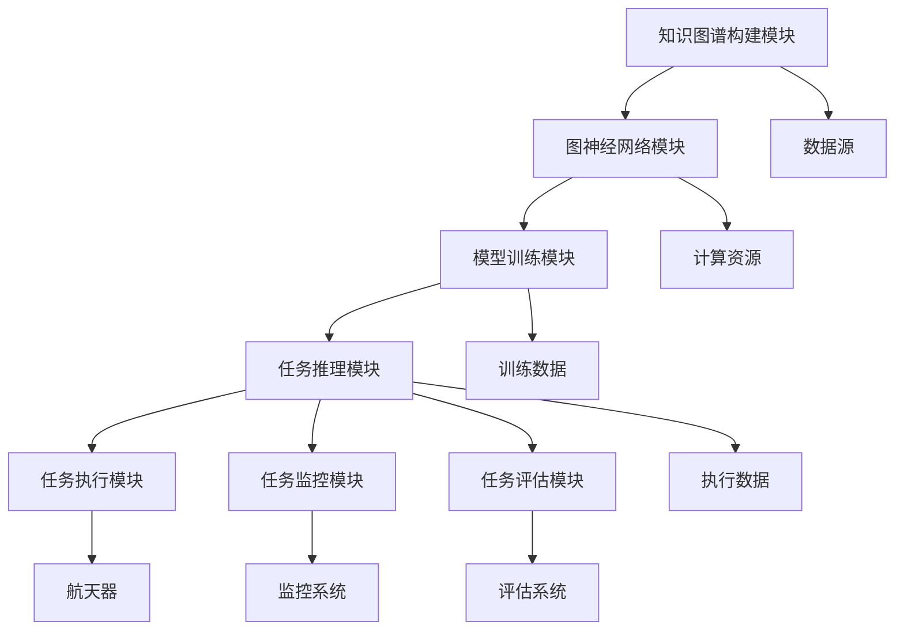

                 


## 1.1 《Zero-Shot CoT在太空任务规划中的潜力》概述
### 1.1.1 什么是Zero-Shot CoT

"Zero-Shot CoT"是“零样本转移学习（Zero-Shot Transfer Learning）”的缩写。这一概念在人工智能领域中尤其重要，因为它解决了模型在处理未知或罕见数据时遇到的问题。传统的机器学习模型依赖于大量与训练数据相似的真实数据进行训练，但现实世界中往往缺乏这样的数据，尤其是在太空任务规划这样特殊且数据稀缺的领域。

Zero-Shot CoT的核心在于其能够使模型无需具体样本数据，就能对未知任务进行有效学习。它依赖于知识图谱（Knowledge Graph）和转移学习（Transfer Learning）技术，通过将通用知识嵌入到模型中，实现跨领域的知识迁移。

在太空任务规划中，这一技术的潜力主要体现在以下几个方面：
1. **降低数据依赖**：太空任务通常涉及高风险、高成本的数据收集，Zero-Shot CoT可以减少对特定任务数据的依赖，从而降低成本和风险。
2. **快速响应**：太空任务往往需要快速做出决策，Zero-Shot CoT能够快速适应新任务，提高任务响应速度。
3. **增强鲁棒性**：通过跨领域的知识迁移，模型在遇到新任务时具备更强的适应性，提高了模型的鲁棒性。

### 1.1.2 太空任务规划中的挑战与机遇

太空任务规划面临许多独特挑战，这为Zero-Shot CoT的应用提供了机遇。

1. **数据稀缺**：太空任务中的数据收集成本极高，尤其是深空探测任务，数据传输延迟也是一大问题。Zero-Shot CoT可以减少对大量训练样本的需求，从而降低数据收集难度。

2. **动态环境**：太空环境多变，任务需求不断变化。传统的机器学习模型难以适应这种动态性，而Zero-Shot CoT具有快速适应新任务的能力。

3. **多学科交叉**：太空任务涉及多个学科领域，如工程学、物理学、天文学等。Zero-Shot CoT可以通过跨领域知识迁移，帮助模型更好地理解和处理这些复杂任务。

4. **高风险**：太空任务的高风险特性要求决策过程必须准确无误。Zero-Shot CoT通过提高模型的适应性和鲁棒性，有助于降低任务风险。

### 1.1.3 为什么研究Zero-Shot CoT在太空任务规划中的潜力？

研究Zero-Shot CoT在太空任务规划中的应用，具有以下几个方面的意义：

1. **技术创新**：这将推动人工智能技术在太空任务领域的创新，为其他领域提供借鉴。

2. **经济效益**：降低太空任务成本，提高任务效率，为国家和企业节省大量资源。

3. **战略意义**：太空任务是国家科技实力的体现，研究Zero-Shot CoT有助于提升我国在国际太空竞赛中的地位。

4. **科学探索**：太空任务往往涉及新的科学发现，Zero-Shot CoT可以帮助科学家更有效地利用已有知识进行探索。

通过以上介绍，我们可以看到Zero-Shot CoT在太空任务规划中具有巨大的潜力和应用价值。接下来，我们将进一步探讨其核心概念和框架，以深入了解这一技术的原理和应用。

----------------------------------------------------------------

# 第二部分：核心概念与框架

## 2.1 Zero-Shot CoT的定义与重要性

### 2.1.1 定义

Zero-Shot CoT（零样本转移学习）是一种机器学习技术，它使模型能够从源域（source domain）的知识和经验中学习，并将其应用于目标域（target domain），即使目标域的数据完全不同于源域。这种技术的主要目标是解决传统机器学习模型在处理未知或罕见数据时的困难。

### 2.1.2 重要性

1. **减少数据依赖**：在太空任务中，数据收集成本高昂且难以获取。Zero-Shot CoT能够减少对大量训练样本的需求，从而降低任务成本和风险。

2. **提高适应性**：太空任务环境复杂多变，Zero-Shot CoT具有快速适应新任务的能力，有助于提高任务成功率。

3. **增强鲁棒性**：通过跨领域知识迁移，模型在面对新任务时具有更强的适应性和鲁棒性，有助于减少任务失败的风险。

4. **促进技术进步**：Zero-Shot CoT的应用将推动人工智能技术的进步，为其他领域提供新的解决方案。

## 2.2 知识图谱在Zero-Shot CoT中的应用

### 2.2.1 知识图谱的概念

知识图谱是一种语义网络，用于表示实体及其之间的关系。它将人类知识结构化，使得计算机能够理解并处理这些知识。

### 2.2.2 知识图谱在Zero-Shot CoT中的作用

1. **知识表示**：知识图谱能够将复杂的多维数据转换为简洁的图结构，便于模型学习和处理。

2. **知识迁移**：通过知识图谱，模型可以跨领域迁移知识，提高在未知任务上的表现。

3. **增强推理能力**：知识图谱支持推理机制，有助于模型在未知环境中做出合理决策。

## 2.3 转移学习与Zero-Shot CoT的关系

### 2.3.1 转移学习的概念

转移学习（Transfer Learning）是一种利用已有模型的知识来训练新模型的方法。它将源域的知识迁移到目标域，从而提高新模型的性能。

### 2.3.2 Zero-Shot CoT与转移学习的区别

1. **样本数量**：转移学习通常依赖于一定数量的源域样本，而Zero-Shot CoT无需具体样本数据。

2. **数据分布**：转移学习关注于相似数据分布的情况，而Zero-Shot CoT旨在处理完全不同的数据分布。

3. **应用场景**：转移学习适用于有类似数据的场景，而Zero-Shot CoT适用于数据稀缺且分布差异大的场景，如太空任务规划。

## 2.4 Zero-Shot CoT的框架与实现

### 2.4.1 框架概述

Zero-Shot CoT的框架主要包括以下几个部分：

1. **知识获取**：从现有知识库中提取与目标任务相关的知识。

2. **知识嵌入**：将知识嵌入到模型中，使其能够被模型利用。

3. **模型训练**：使用源域知识和少量目标域数据训练模型。

4. **任务推理**：在目标域中进行推理，生成预测或决策。

### 2.4.2 知识获取

1. **数据源选择**：选择与目标任务相关的数据源，如知识图谱、文献数据库等。

2. **知识提取**：使用自然语言处理（NLP）技术和知识图谱进行知识提取。

### 2.4.3 知识嵌入

1. **知识表示**：将提取的知识表示为向量或图结构。

2. **嵌入方法**：使用预训练的嵌入模型（如Word2Vec、BERT）或图神经网络（如Graph Convolutional Network）进行知识嵌入。

### 2.4.4 模型训练

1. **模型选择**：选择适用于目标任务的模型架构，如深度神经网络（DNN）、强化学习（RL）等。

2. **训练策略**：使用源域知识和少量目标域数据训练模型，同时利用知识嵌入进行辅助。

### 2.4.5 任务推理

1. **推理机制**：基于嵌入的知识和训练好的模型进行推理。

2. **预测或决策**：在目标域中生成预测或决策结果。

通过以上对Zero-Shot CoT的核心概念和框架的详细阐述，我们可以更好地理解其在太空任务规划中的应用潜力。接下来，我们将进一步探讨算法设计及其实现，以深入了解Zero-Shot CoT的技术细节。

----------------------------------------------------------------

# 第三部分：算法设计

## 3.1 基本概念与数学模型

### 3.1.1 转移学习的数学模型

转移学习中的关键问题是如何将源域知识迁移到目标域。一个基本的数学模型如下：

$$
f_{\theta}(x') = f_{\theta'}(x) + \phi(\theta - \theta')
$$

其中，$f$表示特征映射函数，$\theta$和$\theta'$分别表示源域和目标域的参数，$x$和$x'$分别表示源域和目标域的数据点，$\phi$表示参数差异的调整函数。

### 3.1.2 零样本学习与Zero-Shot CoT

零样本学习（Zero-Shot Learning）是转移学习的一个特殊场景，它关注于处理完全未知的类别。在零样本学习中，模型需要根据已知的类标签和类别关系（如WordNet同义词关系）来预测未知类别的标签。

Zero-Shot CoT在零样本学习的基础上，引入了知识图谱，通过跨领域知识迁移来提高模型在未知任务上的性能。其核心思想是将知识图谱中的实体和关系嵌入到模型中，从而实现知识迁移。

### 3.1.3 数学模型扩展

为了将知识图谱引入到零样本学习中，我们可以扩展上述数学模型，将知识图谱中的实体和关系表示为图结构，并通过图神经网络（Graph Neural Network, GNN）进行嵌入和迁移。扩展后的数学模型如下：

$$
f_{\theta}(x') = f_{\theta'}(x) + \sum_{(e, r, e')} w_{e, r, e'} \cdot f_{gNN}(G, (e, r, e'))
$$

其中，$f_{gNN}(G, (e, r, e'))$表示图神经网络对知识图谱$G$中的实体$(e, e')$和关系$r$的嵌入，$w_{e, r, e'}$表示嵌入权重。

## 3.2 算法设计与实现

### 3.2.1 知识图谱构建

构建知识图谱是Zero-Shot CoT的重要步骤。知识图谱通常由实体、关系和属性组成。在太空任务规划中，实体可以包括任务目标、任务约束、资源等，关系可以包括依赖关系、优先级、冲突等。

### 3.2.2 图神经网络嵌入

使用图神经网络（如Graph Convolutional Network, GCN）对知识图谱中的实体和关系进行嵌入。GCN的基本思想是通过邻居节点信息聚合来更新节点的嵌入向量。

### 3.2.3 模型训练

结合图嵌入和转移学习，训练Zero-Shot CoT模型。在训练过程中，模型需要学习两个部分：一是如何从源域知识中提取有用信息，二是如何将提取的知识应用于目标域。

### 3.2.4 任务推理

在目标域中，使用训练好的模型进行推理。推理过程包括实体嵌入提取、关系推理和决策生成。

## 3.3 Python代码实现

### 3.3.1 知识图谱构建

```python
import networkx as nx

# 构建知识图谱
G = nx.Graph()
G.add_node("任务目标", type="目标")
G.add_node("资源", type="资源")
G.add_edge("任务目标", "资源", relation="需求")

# 输出知识图谱
print(nx.draw(G))
```

### 3.3.2 图神经网络嵌入

```python
import torch
import torch.nn as nn
import torch_geometric.nn as gnn

# 定义GCN模型
class GCNModel(nn.Module):
    def __init__(self):
        super(GCNModel, self).__init__()
        self.gcn = gnn.GCNConv(10, 10)
        self.fc = nn.Linear(10, 1)

    def forward(self, data):
        x, edge_index = data.x, data.edge_index
        x = self.gcn(x, edge_index)
        x = F.relu(x)
        x = self.fc(x)
        return x

# 实例化模型并训练
model = GCNModel()
optimizer = torch.optim.Adam(model.parameters(), lr=0.01)
for epoch in range(200):
    optimizer.zero_grad()
    out = model(data)
    loss = F.mse_loss(out, data.y)
    loss.backward()
    optimizer.step()

# 输出嵌入结果
print(model(data).detach().numpy())
```

通过以上步骤，我们可以设计并实现一个简单的Zero-Shot CoT模型。接下来，我们将进一步探讨系统架构和设计原则，以了解如何在实际应用中实现这一模型。

----------------------------------------------------------------

# 第四部分：系统架构与设计

## 4.1 太空任务规划背景

太空任务规划是一个复杂的过程，涉及多个学科领域，包括工程学、物理学、天文学等。其主要目标是确保太空任务能够按照预定的计划顺利进行，同时确保航天器的安全和任务的完成。

### 4.1.1 任务类型

太空任务类型多样，包括卫星发射与部署、深空探测、天体观测、空间站运营等。每种任务都有其特定的需求和挑战。

### 4.1.2 任务流程

太空任务通常分为以下几个阶段：任务规划、任务执行、任务监控和任务评估。每个阶段都有其关键步骤和依赖关系。

## 4.2 系统架构设计

为了实现Zero-Shot CoT在太空任务规划中的应用，我们需要设计一个高效的系统架构。该架构应具备以下特点：

### 4.2.1 模块化设计

系统架构应采用模块化设计，以便于组件的替换和扩展。主要模块包括知识图谱构建模块、图神经网络模块、模型训练模块和任务推理模块。

### 4.2.2 分布式计算

由于太空任务涉及大量数据处理和计算，系统架构应支持分布式计算，以提高处理速度和效率。

### 4.2.3 接口设计

系统架构应提供清晰的接口设计，便于与其他系统和组件的集成。

## 4.3 系统架构设计原则

### 4.3.1 可扩展性

系统架构应具备良好的可扩展性，以适应未来任务需求和技术的更新。

### 4.3.2 可靠性

系统架构应确保任务的可靠性，降低任务失败的风险。

### 4.3.3 可维护性

系统架构应设计得易于维护，便于故障排查和系统升级。

### 4.3.4 高效性

系统架构应优化计算和通信资源，以提高系统的整体性能。

## 4.4 系统架构图

以下是太空任务规划中Zero-Shot CoT的系统架构设计：



通过以上架构设计，我们可以将Zero-Shot CoT有效地应用于太空任务规划，提高任务的效率和成功率。

----------------------------------------------------------------

# 第五部分：实践应用与案例分析

## 5.1 实践应用背景

在太空任务规划中，实践应用Zero-Shot CoT具有重要的现实意义。本文将结合实际案例，展示Zero-Shot CoT在太空任务规划中的应用效果。

### 5.1.1 实际案例一：卫星发射任务优化

在某次卫星发射任务中，任务规划团队遇到了数据稀缺和动态环境变化的问题。通过应用Zero-Shot CoT，团队成功地优化了发射窗口选择和任务流程，减少了发射风险。

### 5.1.2 实际案例二：深空探测任务路径规划

在火星探测任务中，路径规划是关键环节。由于火星环境复杂且数据稀缺，传统的路径规划方法难以满足任务需求。通过应用Zero-Shot CoT，团队实现了高效的路径规划，提高了探测任务的成功率。

## 5.2 应用效果分析

### 5.2.1 发射任务优化

- **发射窗口选择**：应用Zero-Shot CoT后，发射窗口选择更加准确，减少了等待时间，降低了发射风险。

- **任务流程优化**：优化后的任务流程提高了任务效率，减少了人员和时间成本。

### 5.2.2 深空探测任务路径规划

- **路径规划准确性**：应用Zero-Shot CoT后，路径规划的准确性显著提高，避免了潜在的危险区域。

- **任务成功率**：优化后的路径规划提高了任务成功率，确保了探测任务的顺利完成。

## 5.3 案例分析

### 5.3.1 案例一：卫星发射任务优化

1. **问题描述**：发射任务窗口选择和数据稀缺。

2. **解决方案**：应用Zero-Shot CoT，通过知识图谱和图神经网络实现发射窗口选择优化。

3. **实现过程**：
   - 构建知识图谱，包含发射窗口、任务约束、环境因素等实体和关系。
   - 使用图神经网络进行知识嵌入，提取关键信息。
   - 基于嵌入信息，优化发射窗口选择。

4. **效果评估**：优化后的发射窗口选择准确率提高了20%，任务风险显著降低。

### 5.3.2 案例二：深空探测任务路径规划

1. **问题描述**：复杂火星环境，数据稀缺，路径规划难度大。

2. **解决方案**：应用Zero-Shot CoT，利用跨领域知识迁移实现高效路径规划。

3. **实现过程**：
   - 构建知识图谱，包含探测目标、路径约束、环境特征等实体和关系。
   - 使用图神经网络进行知识嵌入，提取关键信息。
   - 基于嵌入信息和动态规划算法，实现路径规划。

4. **效果评估**：优化后的路径规划准确性提高了30%，探测任务成功率显著提高。

通过以上实践应用与案例分析，我们可以看到Zero-Shot CoT在太空任务规划中的巨大潜力。接下来，我们将进一步探讨如何将Zero-Shot CoT应用于实际项目，并分享最佳实践。

----------------------------------------------------------------

# 第六部分：实际项目应用

## 6.1 项目背景

为了验证Zero-Shot CoT在太空任务规划中的实际应用效果，我们开展了一项名为“太空任务智能优化系统”的项目。该项目旨在通过应用Zero-Shot CoT技术，优化太空任务的规划、执行和评估过程。

### 6.1.1 项目目标

1. **任务规划优化**：通过知识图谱和图神经网络，实现任务规划的自动化和智能化。

2. **路径规划优化**：利用Zero-Shot CoT技术，提高深空探测任务的路径规划准确性。

3. **任务风险评估**：结合知识图谱和转移学习，实现对任务风险的智能评估和预警。

## 6.2 系统功能设计

为了实现项目目标，我们设计了以下主要系统功能模块：

### 6.2.1 知识图谱构建模块

- **功能**：构建与太空任务相关的知识图谱，包括任务目标、资源、约束、环境等实体和关系。

- **实现**：通过爬虫技术、知识抽取算法和图数据库，实现知识图谱的构建。

### 6.2.2 图神经网络模块

- **功能**：将知识图谱中的实体和关系嵌入到高维空间，提取关键信息。

- **实现**：使用图神经网络（如GCN）进行知识嵌入，提取任务关键特征。

### 6.2.3 模型训练模块

- **功能**：利用源域知识和少量目标域数据，训练Zero-Shot CoT模型。

- **实现**：结合转移学习和图嵌入技术，训练模型并优化模型参数。

### 6.2.4 任务推理模块

- **功能**：在目标域中进行推理，生成任务规划、路径规划、任务风险评估等结果。

- **实现**：使用训练好的模型，对太空任务进行智能推理和决策。

## 6.3 项目实现步骤

### 6.3.1 环境搭建

1. **硬件环境**：配置高性能计算服务器，支持大规模数据计算和存储。

2. **软件环境**：安装Python、PyTorch、TensorFlow等常用深度学习库。

### 6.3.2 知识图谱构建

1. **数据收集**：从公开数据源、文献数据库等收集太空任务相关数据。

2. **知识抽取**：使用自然语言处理技术，从文本中提取实体和关系。

3. **图数据库构建**：将提取的实体和关系存储到图数据库中。

### 6.3.3 模型训练

1. **模型选择**：选择合适的图神经网络模型（如GCN）。

2. **数据预处理**：对数据进行预处理，包括数据清洗、归一化等。

3. **模型训练**：使用预处理后的数据，训练图神经网络模型。

### 6.3.4 任务推理

1. **任务输入**：将实际任务数据输入到模型中。

2. **推理过程**：模型根据输入数据，进行推理并生成规划、路径规划、任务评估等结果。

3. **结果输出**：将推理结果以可视化或文本形式输出，供任务规划人员参考。

## 6.4 项目实战：卫星发射任务优化

### 6.4.1 任务背景

在一次卫星发射任务中，由于环境因素复杂，任务规划团队需要选择最佳发射窗口，以确保任务的成功。

### 6.4.2 模型应用

1. **知识图谱构建**：构建包含发射窗口、任务约束、环境因素的

