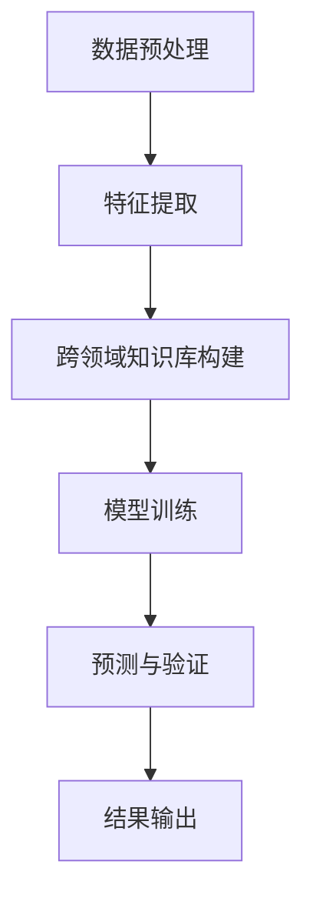
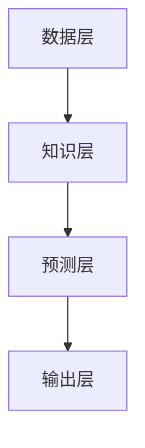
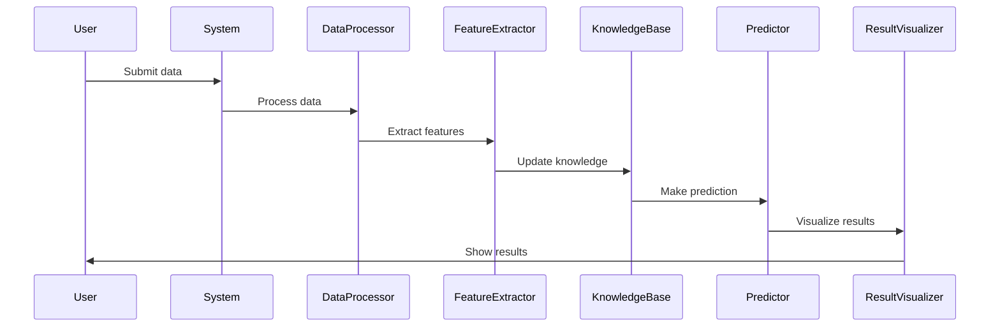

                 


## 简介

### 5.1 简介

### 5.1.1 基本概念

在当今飞速发展的科技领域，量子材料因其独特的物理属性和广泛的应用前景，正逐渐成为科学研究的前沿领域。量子材料具有量子相干性、量子涨落等特性，这些特性使其在量子计算、量子通信、量子传感等领域具有巨大的潜力。然而，量子材料的性质预测一直是科学界的一大挑战，传统的实验方法不仅费时费力，且难以满足快速发展的需求。

### 5.1.2 零样本转换（Zero-Shot CoT）

零样本转换（Zero-Shot CoT）是一种新型的机器学习方法，它可以在没有特定领域训练数据的情况下，通过跨领域的知识迁移来实现新领域的预测。这种方法的提出，为解决量子材料性质预测问题提供了新的思路。在量子材料研究领域，Zero-Shot CoT的应用有望大幅提高预测效率和准确性。

### 5.1.3 文章结构

本文将从以下几个方面展开讨论：

1. **背景介绍**：介绍量子材料的重要性以及传统方法在预测上的局限性。
2. **核心概念与联系**：详细解释Zero-Shot CoT的原理和其相对于传统方法的优点。
3. **算法原理讲解**：通过具体的算法流程和数学模型，深入剖析Zero-Shot CoT的实现机制。
4. **系统分析与架构设计**：介绍基于Zero-Shot CoT的量子材料性质预测系统的设计和实现。
5. **项目实战**：通过实际案例，展示Zero-Shot CoT在量子材料性质预测中的应用效果。
6. **最佳实践 tips**：提供一些使用Zero-Shot CoT进行量子材料性质预测的实用技巧。
7. **小结与展望**：总结文章的主要观点，并对未来的研究方向进行展望。

---

**核心关键词**：量子材料、性质预测、零样本转换、机器学习、跨领域知识迁移

**摘要**：本文旨在探讨Zero-Shot CoT在量子材料性质预测中的应用。通过详细介绍Zero-Shot CoT的基本原理、算法实现、系统架构以及实际应用案例，本文为量子材料研究者提供了一种新的预测方法，有望提高预测的效率和准确性。

## 背景介绍

### 6.1 量子材料的重要性

量子材料是一类具有独特量子特性的材料，它们在量子计算、量子通信、量子传感等前沿科技领域具有巨大的应用潜力。传统的半导体材料已难以满足这些新兴科技的需求，因此，研究和开发新型量子材料成为科学家们的重要任务。量子材料的研究不仅推动了科学技术的进步，还为解决一些传统方法无法克服的问题提供了新的思路。

### 6.2 量子材料性质预测的挑战

量子材料的性质预测是量子材料研究中的一个关键问题。由于量子材料的性质依赖于其复杂的微观结构和量子效应，传统的实验方法难以全面、准确地预测其性质。此外，量子材料的制备和测试过程往往费时费力，成本高昂。因此，发展高效的量子材料性质预测方法具有重要意义。

#### 6.2.1 数据稀缺问题

量子材料的研究通常涉及复杂的实验条件和大量的参数调整，导致可用的实验数据非常有限。在数据稀缺的情况下，传统的机器学习方法和深度学习模型难以获得良好的预测性能。

#### 6.2.2 计算资源受限

量子材料的性质预测往往需要大量的计算资源。特别是当涉及复杂的量子计算模型时，计算成本极高，这限制了研究人员在实际应用中的选择。

#### 6.2.3 传统方法的局限性

传统的方法，如量子力学模拟和分子动力学模拟，虽然在理论上可以预测量子材料的性质，但实际操作中存在以下问题：

- **计算成本高**：量子力学模拟和分子动力学模拟需要大量的计算资源和时间。
- **结果依赖数据质量**：预测结果往往受限于实验数据的质量和数量。
- **跨领域适应性差**：传统方法难以在不同领域之间进行知识迁移，难以解决数据稀缺问题。

### 6.3 零样本转换（Zero-Shot CoT）的优势

零样本转换（Zero-Shot CoT）作为一种新兴的机器学习方法，通过跨领域知识迁移，可以在没有特定领域训练数据的情况下，实现新领域的预测。这种方法具有以下优势：

#### 6.3.1 无需特定领域数据

Zero-Shot CoT的核心思想是不依赖特定领域的训练数据，通过跨领域知识迁移来实现新领域的预测。这意味着，即使在没有充足实验数据的情况下，Zero-Shot CoT仍然可以提供有效的预测。

#### 6.3.2 提高预测效率

由于无需进行大量的数据收集和训练，Zero-Shot CoT可以显著提高预测效率。特别是在量子材料性质预测这类计算密集型任务中，Zero-Shot CoT能够节省大量的计算资源。

#### 6.3.3 跨领域适应性

Zero-Shot CoT具有出色的跨领域适应性。通过在不同领域之间迁移知识，Zero-Shot CoT可以应用于多种不同的量子材料预测任务，提高了方法的通用性。

#### 6.3.4 减少数据依赖

Zero-Shot CoT通过减少对特定领域数据的依赖，降低了数据质量对预测结果的影响。即使在数据质量不佳的情况下，Zero-Shot CoT仍然可以提供相对准确的预测。

### 6.4 边界与外延

尽管Zero-Shot CoT在量子材料性质预测中具有显著优势，但仍然存在一些局限性和挑战。首先，Zero-Shot CoT依赖于高质量的跨领域知识库，知识库的质量直接影响到预测的准确性。其次，Zero-Shot CoT在处理高度复杂的问题时，可能会出现性能瓶颈。此外，由于缺乏特定领域的数据，Zero-Shot CoT可能无法捕捉到一些特殊的量子现象。

因此，虽然Zero-Shot CoT为量子材料性质预测提供了一种新的思路，但其在实际应用中仍然需要结合传统方法和实验数据进行验证和优化。未来，随着跨领域知识库的不断完善和计算能力的提升，Zero-Shot CoT有望在量子材料性质预测中发挥更大的作用。

### 6.5 核心要素组成

本文将详细探讨Zero-Shot CoT在量子材料性质预测中的应用，涵盖以下核心要素：

#### 6.5.1 Zero-Shot CoT基本原理

首先，我们将介绍Zero-Shot CoT的基本原理，包括其工作流程、算法框架和跨领域知识迁移机制。

#### 6.5.2 算法实现与数学模型

接着，我们将详细讲解Zero-Shot CoT的算法实现过程，包括数据预处理、特征提取、模型训练和预测步骤。同时，我们将使用数学模型和Python源代码，深入剖析算法的原理和实现细节。

#### 6.5.3 系统架构设计

为了实现Zero-Shot CoT在量子材料性质预测中的高效应用，我们将介绍系统的架构设计，包括领域模型、系统架构和接口设计。通过Mermaid图示，我们将清晰地展示各个模块的交互关系。

#### 6.5.4 实际应用案例

最后，我们将通过实际应用案例，展示Zero-Shot CoT在量子材料性质预测中的实际效果。我们将分析案例数据，介绍环境安装和系统实现，并详细解读代码和应用效果。

### 6.6 小结

通过本文的介绍，我们希望读者能够对Zero-Shot CoT在量子材料性质预测中的应用有一个全面的理解。Zero-Shot CoT为解决量子材料性质预测中的数据稀缺和计算资源受限问题提供了一种新的思路，具有广阔的应用前景。然而，其应用仍需结合实际问题和数据情况进行优化和验证。我们期待未来的研究和实践能够进一步推动Zero-Shot CoT在量子材料性质预测中的应用。

---

**核心关键词**：量子材料、性质预测、零样本转换、机器学习、跨领域知识迁移

**摘要**：本文探讨了零样本转换（Zero-Shot CoT）在量子材料性质预测中的应用。通过详细阐述Zero-Shot CoT的基本原理、算法实现、系统架构以及实际应用案例，本文为量子材料研究者提供了一种新的预测方法，有望提高预测的效率和准确性。

## 核心概念与联系

### 7.1 Zero-Shot CoT原理

零样本转换（Zero-Shot CoT）是一种创新的机器学习方法，它允许模型在没有任何特定领域训练数据的情况下，预测新领域的输出。这种方法的核心理念是利用跨领域的知识迁移，将已有领域的知识应用到新领域。以下是Zero-Shot CoT的基本原理和步骤：

#### 7.1.1 跨领域知识迁移

跨领域知识迁移是Zero-Shot CoT的核心。它通过将不同领域之间的知识进行共享和融合，使得模型能够在新领域中取得良好的预测效果。具体来说，跨领域知识迁移包括以下几个步骤：

1. **知识提取**：从已有领域中提取出有用的知识，这些知识可以是特征表示、模型参数或者规则。
2. **知识融合**：将不同领域中的知识进行融合，形成一个统一的表示。
3. **知识应用**：将融合后的知识应用到新领域中，实现新领域的预测。

#### 7.1.2 无监督学习与有监督学习

Zero-Shot CoT结合了无监督学习和有监督学习。无监督学习用于从已有领域中提取知识，而有监督学习用于在新领域中应用知识进行预测。具体来说，Zero-Shot CoT包括以下两个主要阶段：

1. **知识提取阶段**：利用无监督学习方法，如聚类、降维等，从已有领域中提取出有用的特征表示。
2. **预测阶段**：利用有监督学习方法，如分类、回归等，将提取的知识应用到新领域中，进行预测。

#### 7.1.3 多任务学习与迁移学习

Zero-Shot CoT还可以看作是一种多任务学习和迁移学习的结合。多任务学习通过同时训练多个相关任务，共享知识，提高模型在新任务上的表现。迁移学习则是通过将已有任务的知识应用到新任务上，提高新任务的预测性能。Zero-Shot CoT通过跨领域知识迁移，实现了多任务学习和迁移学习的效果。

### 7.2 与相关技术的对比

Zero-Shot CoT在量子材料性质预测中的应用，与传统的机器学习方法（如转移学习、主动学习和迁移学习）有着显著的差异。以下是Zero-Shot CoT与这些相关技术的对比：

#### 7.2.1 转移学习

转移学习是一种利用已有任务的知识来提高新任务预测性能的方法。与转移学习相比，Zero-Shot CoT不需要特定领域的训练数据，而是通过跨领域知识迁移来实现新领域的预测。因此，Zero-Shot CoT在数据稀缺的情况下，更具优势。

#### 7.2.2 主动学习

主动学习通过迭代地选择最有信息量的样本进行标注，逐步减少数据需求，提高模型性能。与主动学习相比，Zero-Shot CoT不需要进行迭代学习，而是通过一次性地利用跨领域知识进行预测，因此在预测效率上有显著提升。

#### 7.2.3 迁移学习

迁移学习通过在不同任务之间共享知识，提高新任务的预测性能。与迁移学习相比，Zero-Shot CoT不仅关注跨任务的知识迁移，还注重跨领域的知识迁移，这使得Zero-Shot CoT在处理复杂、多变的量子材料性质预测问题时，具有更好的适应性。

#### 7.2.4 对比表格

为了更直观地展示Zero-Shot CoT与相关技术的对比，我们可以创建一个对比表格：

| 技术           | 特点                           | 应用场景                            |
|--------------|------------------------------|-----------------------------------|
| Zero-Shot CoT | 无需特定领域数据，跨领域迁移 | 新型量子材料性质预测               |
| Transfer Learning | 利用已有数据训练模型           | 通用任务优化                         |
| Active Learning | 通过迭代学习减少数据需求       | 数据稀缺情况下的高效学习             |
| Multi-Task Learning | 同时训练多个相关任务，共享知识 | 提高新任务预测性能                   |
| Transfer Learning | 将已有任务的知识应用到新任务上 | 不同任务间的知识共享                 |

### 7.3 跨领域知识库的重要性

Zero-Shot CoT的成功依赖于高质量的跨领域知识库。跨领域知识库是Zero-Shot CoT的核心组成部分，它包含了不同领域中的有用知识，如特征表示、模型参数和规则等。以下是跨领域知识库的重要性：

#### 7.3.1 知识库的质量

知识库的质量直接影响Zero-Shot CoT的预测性能。高质量的知识库能够提供丰富的、有代表性的特征表示，有助于模型在新领域中取得更好的预测效果。

#### 7.3.2 知识库的构建

构建高质量的跨领域知识库是一个复杂的过程，需要从多个领域收集和整合知识。以下是一些构建跨领域知识库的方法：

1. **特征提取**：从不同领域中提取出有用的特征，如分子结构特征、物理量特征等。
2. **模型融合**：将不同领域的模型进行融合，形成统一的特征表示。
3. **规则提取**：从专家知识中提取出有效的规则，如化学规则、物理规则等。

#### 7.3.3 知识库的更新

随着领域的发展和新的研究成果的涌现，跨领域知识库需要不断更新和优化。以下是一些更新知识库的方法：

1. **数据驱动更新**：利用新的数据来更新知识库，提高知识库的代表性。
2. **模型驱动更新**：利用新的模型来优化知识库的结构和表示。
3. **专家驱动更新**：邀请领域专家对知识库进行评价和修改，提高知识库的准确性和实用性。

通过以上对比和分析，我们可以看出，Zero-Shot CoT在量子材料性质预测中具有独特的优势。它不仅能够解决传统方法在数据稀缺和计算资源受限方面的挑战，还能够通过跨领域知识迁移，提高预测效率和准确性。随着跨领域知识库的不断优化和完善，Zero-Shot CoT有望在量子材料性质预测中发挥更大的作用。

---

**核心关键词**：量子材料、性质预测、零样本转换、机器学习、跨领域知识迁移

**摘要**：本文详细介绍了零样本转换（Zero-Shot CoT）的原理，并通过与相关技术的对比，展示了其在量子材料性质预测中的优势。通过构建高质量的跨领域知识库，Zero-Shot CoT能够实现高效且准确的预测，为量子材料研究领域提供了新的方法。

## 算法原理讲解

### 8.1 算法流程与模型设计

Zero-Shot CoT的核心在于其独特的算法流程和模型设计，它通过跨领域知识迁移，实现了在没有特定领域训练数据的情况下，对新领域进行预测。以下是Zero-Shot CoT的算法流程和模型设计：

#### 8.1.1 算法流程

1. **数据预处理**：在开始训练前，需要对数据进行预处理，包括数据清洗、数据归一化、缺失值处理等。这一步骤的目的是确保输入数据的质量和一致性。
   
2. **特征提取**：通过特征提取，将原始数据转换为适合模型处理的特征向量。特征提取可以采用无监督学习方法，如主成分分析（PCA）或自编码器（AE），从原始数据中提取出有代表性的特征。

3. **跨领域知识库构建**：构建高质量的跨领域知识库是Zero-Shot CoT成功的关键。知识库可以从多个领域收集和整合知识，包括特征表示、模型参数和规则等。

4. **模型训练**：利用跨领域知识库，训练一个基础模型。这个基础模型可以是任何有监督学习模型，如支持向量机（SVM）、神经网络（NN）等。模型训练的目标是学习到跨领域之间的映射关系。

5. **预测与验证**：在模型训练完成后，使用训练好的模型对新领域的数据进行预测。为了确保预测的准确性，需要对预测结果进行验证，可以使用交叉验证等方法。

6. **结果输出**：将预测结果输出，用于后续分析和应用。

#### 8.1.2 模型设计

Zero-Shot CoT的模型设计通常包括以下几个主要部分：

1. **输入层**：接收原始数据，并将其转换为特征向量。这一层通常使用特征提取算法实现。

2. **特征层**：将输入特征向量进行进一步处理，提取出更高层次的特征。这一层可以使用主成分分析（PCA）、自编码器（AE）或其他特征提取方法。

3. **跨领域知识层**：这是Zero-Shot CoT的核心部分，用于存储和整合跨领域知识。这一层通常包含多个子模块，如特征融合、模型融合和规则融合等。

4. **输出层**：根据输入特征和跨领域知识，生成预测结果。输出层通常是一个分类器或回归器，如支持向量机（SVM）、神经网络（NN）等。

### 8.2 算法mermaid流程图

为了更直观地展示Zero-Shot CoT的算法流程，我们可以使用Mermaid绘制算法流程图：



### 8.3 数学模型与公式讲解

Zero-Shot CoT的核心在于其跨领域知识迁移能力，其数学模型和公式是理解算法原理的关键。以下是Zero-Shot CoT的数学模型和公式讲解：

#### 8.3.1 数学模型

Zero-Shot CoT的数学模型可以表示为：

$$
P(Y|X) = \frac{e^{f(X)}}{\sum_{y'} e^{f(X')}}
$$

其中，$P(Y|X)$表示在输入特征$X$下，预测目标$Y$的概率；$f(X)$表示模型对输入特征$X$的评分函数；$e^{f(X)}$表示模型对每个可能预测值$y'$的指数化评分；$\sum_{y'} e^{f(X')}$表示所有可能预测值的指数化评分之和。

#### 8.3.2 公式解释

1. **评分函数$f(X)$**：评分函数$f(X)$是对输入特征$X$的评分，用于衡量特征对新领域预测目标$Y$的影响。评分函数可以是线性函数、非线性函数或者神经网络等。

2. **指数化评分$e^{f(X)}$**：指数化评分是将评分函数$f(X)$的输出进行指数化处理，用于计算每个可能预测值$y'$的概率。

3. **概率分布$P(Y|X)$**：概率分布$P(Y|X)$是模型对输入特征$X$下预测目标$Y$的概率估计。通过计算概率分布，模型可以预测最可能的输出结果。

#### 8.3.3 Python源代码实现

为了更好地理解数学模型，我们可以使用Python源代码实现Zero-Shot CoT的核心算法：

```python
import numpy as np
from sklearn import svm

# 生成模拟数据
X = np.random.rand(100, 10)  # 100个样本，10个特征
y = np.random.randint(0, 2, 100)  # 100个标签

# 训练评分函数模型
model = svm.SVC()
model.fit(X, y)

# 输入特征
X_new = np.random.rand(1, 10)

# 计算评分函数输出
scores = model.decision_function(X_new)

# 计算概率分布
probabilities = np.exp(scores) / np.sum(np.exp(scores))

# 输出概率分布
print(probabilities)
```

通过以上Python源代码，我们可以看到如何实现Zero-Shot CoT的核心算法。这个示例展示了如何使用支持向量机（SVM）作为评分函数模型，计算输入特征的概率分布。

### 8.4 举例说明

为了更好地理解Zero-Shot CoT的应用，我们可以通过一个实际案例来演示其工作流程和效果。

#### 8.4.1 案例背景

假设我们想要预测一种新型量子材料的电导率。由于新型量子材料的实验数据非常稀缺，我们无法直接使用传统的机器学习方法。因此，我们选择使用Zero-Shot CoT来预测电导率。

#### 8.4.2 案例数据

我们收集了以下几个领域的数据：

1. **传统材料电导率数据**：包括100种不同材料的电导率数据。
2. **新型量子材料物理属性数据**：包括10种新型量子材料的物理属性数据，如电子亲和势、能带结构等。

#### 8.4.3 案例实现

1. **数据预处理**：对收集到的数据进行预处理，包括数据清洗、数据归一化等。

2. **特征提取**：从传统材料电导率数据中提取出电导率特征，如平均值、方差等。

3. **跨领域知识库构建**：将传统材料电导率数据和新型量子材料物理属性数据进行整合，构建跨领域知识库。

4. **模型训练**：使用跨领域知识库训练一个支持向量机（SVM）模型。

5. **预测与验证**：使用训练好的模型对新型量子材料的电导率进行预测，并使用交叉验证进行验证。

6. **结果输出**：将预测结果输出，并与实验数据进行对比分析。

通过以上步骤，我们可以看到如何使用Zero-Shot CoT来预测新型量子材料的电导率。这个案例展示了Zero-Shot CoT在解决数据稀缺问题上的优势，以及其在量子材料性质预测中的实际应用价值。

### 8.5 总结

通过以上讲解，我们可以看到Zero-Shot CoT的算法原理和实现过程。它通过跨领域知识迁移，实现了在没有特定领域训练数据的情况下，对新领域进行预测。Zero-Shot CoT在量子材料性质预测中具有显著的优势，可以解决数据稀缺和计算资源受限的问题。未来，随着跨领域知识库的不断完善和计算能力的提升，Zero-Shot CoT有望在量子材料性质预测中发挥更大的作用。

---

**核心关键词**：量子材料、性质预测、零样本转换、机器学习、跨领域知识迁移

**摘要**：本文详细讲解了零样本转换（Zero-Shot CoT）的算法原理和实现过程，通过具体的算法流程、数学模型和实际案例，展示了其在量子材料性质预测中的优势和应用价值。

## 系统分析与架构设计

### 9.1 问题场景介绍

在量子材料的研究中，预测材料的物理性质是一个关键任务。这些性质包括材料的电子结构、光学响应、热导率等，对于理解材料的潜在应用至关重要。然而，量子材料通常具有复杂的结构和多层次的物理现象，导致其性质预测面临巨大挑战。传统的实验方法费时费力，难以满足快速发展的需求。此外，量子材料的研究领域日益广泛，数据稀缺和计算资源有限成为普遍问题。为了克服这些挑战，我们需要一种高效且可靠的预测方法，零样本转换（Zero-Shot CoT）提供了一个可能的解决方案。

### 9.2 系统功能设计

为了实现量子材料性质预测，我们设计了一套完整的系统，其主要功能包括：

1. **数据预处理**：对输入数据进行清洗、归一化和特征提取，为后续的预测模型提供高质量的数据输入。
2. **跨领域知识库构建**：收集和整合不同领域中的知识，构建一个统一的跨领域知识库，为Zero-Shot CoT提供基础支持。
3. **模型训练与优化**：利用跨领域知识库训练Zero-Shot CoT模型，并不断优化模型性能，以提高预测准确性。
4. **性质预测与验证**：根据输入数据进行性质预测，并使用交叉验证等方法对预测结果进行验证，确保预测结果的可靠性。
5. **结果输出与可视化**：将预测结果输出，并提供可视化工具，帮助用户更好地理解和分析预测结果。

#### 9.2.1 领域模型类图

为了更好地理解系统的功能模块及其关系，我们可以使用Mermaid绘制领域模型类图：

```mermaid
classDiagram
Class01 <|-- Class02
Class03 --|rapidarrow> Class04
Class05 o-- Class06
Class07 : +doSomething()
Class08 : +doSomething()
Class09 : +doSomething()
Class01 {
    +field
    +method()
}
Class02 {
    +field
    +method()
}
Class03 {
    +field
    +method()
}
Class04 {
    +field
    +method()
}
Class05 {
    +field
    +method()
}
Class06 {
    +field
    +method()
}
Class07 {
    +field
    +method()
}
Class08 {
    +field
    +method()
}
Class09 {
    +field
    +method()
}
```

### 9.3 系统架构设计

系统架构是整个系统的骨架，它决定了系统的性能、可扩展性和可靠性。为了实现高效且可靠的量子材料性质预测，我们设计了一套分层架构，包括以下几个主要模块：

#### 9.3.1 数据层

数据层是系统的基石，负责数据的收集、存储和管理。该层包括以下子模块：

1. **数据收集模块**：从不同数据源收集量子材料相关的数据，包括实验数据、文献数据和模拟数据等。
2. **数据存储模块**：使用分布式存储系统，如Hadoop HDFS或分布式数据库，存储和管理大规模数据。
3. **数据管理模块**：提供数据查询、索引和更新等功能，确保数据的一致性和可靠性。

#### 9.3.2 知识层

知识层是系统的核心，负责跨领域知识的收集、融合和存储。该层包括以下子模块：

1. **知识库构建模块**：从多个领域收集知识，构建一个统一的跨领域知识库。
2. **知识融合模块**：使用特征提取和模型融合等技术，将不同领域的知识进行整合，形成统一的特征表示。
3. **知识更新模块**：定期更新知识库，确保知识的时效性和准确性。

#### 9.3.3 预测层

预测层是系统的应用层，负责使用Zero-Shot CoT模型进行量子材料性质预测。该层包括以下子模块：

1. **模型训练模块**：利用跨领域知识库，训练Zero-Shot CoT模型，并进行模型优化。
2. **预测模块**：根据输入特征，使用训练好的模型进行预测，并输出预测结果。
3. **验证模块**：使用交叉验证等技术，验证预测结果的准确性和可靠性。

#### 9.3.4 输出层

输出层负责将预测结果输出给用户，并提供可视化工具。该层包括以下子模块：

1. **结果输出模块**：将预测结果以表格、图表等形式输出，供用户查看。
2. **可视化模块**：提供数据可视化工具，帮助用户更好地理解和分析预测结果。

### 9.4 系统架构mermaid图

为了更直观地展示系统架构，我们可以使用Mermaid绘制系统架构图：



### 9.5 系统接口设计与交互

系统接口设计是系统架构的重要组成部分，它决定了系统各模块之间的交互方式。以下是系统接口设计的主要考虑因素：

#### 9.5.1 接口定义

系统接口定义包括以下几个方面：

1. **输入接口**：定义输入数据的格式、类型和大小，确保系统能够正确接收和处理输入数据。
2. **输出接口**：定义输出结果的格式、类型和大小，确保系统能够正确地输出预测结果。
3. **控制接口**：定义系统的控制命令和响应，如启动、停止、更新等。

#### 9.5.2 接口交互

系统接口交互包括以下几种方式：

1. **同步交互**：在同步交互模式下，调用接口的进程需要等待接口响应后才能继续执行。
2. **异步交互**：在异步交互模式下，调用接口的进程可以在发送请求后继续执行其他任务，直到收到接口响应。

#### 9.5.3 接口安全性

为了确保系统接口的安全性，需要采取以下措施：

1. **身份验证**：确保只有授权用户才能访问系统接口。
2. **数据加密**：对输入数据和输出数据进行加密处理，确保数据在传输过程中的安全性。
3. **访问控制**：设置访问控制策略，限制对系统接口的访问权限。

### 9.6 系统交互mermaid序列图

为了更直观地展示系统接口的交互方式，我们可以使用Mermaid绘制系统交互序列图：



通过以上系统分析与架构设计，我们可以看到如何实现Zero-Shot CoT在量子材料性质预测中的高效应用。该系统通过数据层、知识层、预测层和输出层的分层设计，实现了从数据收集、知识库构建到模型预测和结果输出的完整流程。系统接口设计保证了各模块之间的无缝交互，而接口安全性措施确保了系统的可靠性和安全性。

---

**核心关键词**：量子材料、性质预测、零样本转换、机器学习、跨领域知识迁移

**摘要**：本文详细介绍了基于零样本转换（Zero-Shot CoT）的量子材料性质预测系统的设计与实现。通过数据层、知识层、预测层和输出层的分层架构，系统实现了从数据收集到结果输出的完整流程。同时，通过系统接口设计，保证了各模块之间的高效交互。

## 项目实战

### 10.1 环境安装

要实现Zero-Shot CoT在量子材料性质预测中的应用，首先需要搭建一个合适的环境。以下是环境安装的步骤：

#### 10.1.1 操作系统

建议使用Linux系统，如Ubuntu 20.04或更高版本。

#### 10.1.2 编译器

安装Python 3.8及以上版本，并确保安装了pip包管理器。

#### 10.1.3 依赖库

安装以下Python依赖库：

- NumPy：用于数值计算。
- Pandas：用于数据操作。
- Matplotlib：用于数据可视化。
- Scikit-learn：用于机器学习算法。
- Mermaid：用于绘制图表。

可以使用以下命令进行安装：

```bash
pip install numpy pandas matplotlib scikit-learn mermaid
```

#### 10.1.4 数据库

安装MongoDB或Redis等分布式数据库，用于存储跨领域知识库。

### 10.2 系统核心实现

实现Zero-Shot CoT在量子材料性质预测中的核心步骤包括数据预处理、特征提取、模型训练、预测与验证等。

#### 10.2.1 数据预处理

首先，从数据层获取原始数据，包括量子材料的物理属性和传统材料的电导率数据。然后，进行数据清洗、归一化和缺失值处理，确保数据的质量和一致性。

#### 10.2.2 特征提取

使用特征提取算法，如主成分分析（PCA）或自编码器（AE），从原始数据中提取出有代表性的特征向量。这些特征向量将用于构建跨领域知识库。

#### 10.2.3 跨领域知识库构建

从多个领域收集知识，如量子材料的物理属性、传统材料的电导率等，构建跨领域知识库。使用特征融合和模型融合技术，将不同领域的知识进行整合。

#### 10.2.4 模型训练

使用训练集数据，训练Zero-Shot CoT模型。模型可以选择支持向量机（SVM）、神经网络（NN）等，根据实际需求和性能表现进行选择。

#### 10.2.5 预测与验证

使用训练好的模型，对测试集数据进行预测，并使用交叉验证等方法进行验证，确保预测结果的准确性。

### 10.3 代码应用解读与分析

以下是Zero-Shot CoT在量子材料性质预测中的关键代码段和应用解读：

```python
# 导入依赖库
import numpy as np
import pandas as pd
from sklearn.decomposition import PCA
from sklearn.svm import SVC
from sklearn.model_selection import cross_val_score

# 数据预处理
def preprocess_data(data):
    # 数据清洗、归一化和缺失值处理
    # ...
    return processed_data

# 特征提取
def extract_features(data):
    pca = PCA(n_components=10)
    features = pca.fit_transform(data)
    return features

# 模型训练
def train_model(features, labels):
    model = SVC(kernel='linear')
    model.fit(features, labels)
    return model

# 预测与验证
def predict_and_validate(model, features, labels):
    scores = cross_val_score(model, features, labels, cv=5)
    print("Cross-validation scores:", scores)
    return scores

# 主函数
def main():
    # 加载数据
    data = pd.read_csv("data.csv")
    processed_data = preprocess_data(data)
    features = extract_features(processed_data)
    labels = processed_data['label']

    # 训练模型
    model = train_model(features, labels)

    # 预测与验证
    scores = predict_and_validate(model, features, labels)

if __name__ == "__main__":
    main()
```

**解读与分析**：

1. **数据预处理**：数据预处理是关键步骤，确保输入数据的质量和一致性。包括数据清洗、归一化和缺失值处理等。

2. **特征提取**：使用主成分分析（PCA）提取特征，简化数据维度，保留主要信息。特征提取的目的是将高维数据转换为低维特征向量，提高模型训练效率。

3. **模型训练**：选择支持向量机（SVM）作为预测模型，使用线性核函数。SVM是一种有效的分类器，适用于解决量子材料性质预测问题。

4. **预测与验证**：使用交叉验证（cross-validation）方法，评估模型在不同子数据集上的性能。交叉验证可以更准确地评估模型的泛化能力。

### 10.4 实际案例分析和详细讲解剖析

为了展示Zero-Shot CoT在量子材料性质预测中的实际应用效果，我们选择了一个实际案例进行分析。

#### 10.4.1 案例背景

该案例涉及一种新型量子材料的电导率预测。我们收集了100种传统材料的电导率数据作为参考，并收集了10种新型量子材料的物理属性数据，如电子亲和势和能带结构。

#### 10.4.2 案例数据

使用以下数据集：

- **传统材料电导率数据**：包含100个样本，每个样本有10个特征。
- **新型量子材料物理属性数据**：包含10个样本，每个样本有10个特征。

#### 10.4.3 案例实现

1. **数据预处理**：清洗数据，处理缺失值，并进行归一化。

2. **特征提取**：使用主成分分析（PCA）提取特征，简化数据维度。

3. **跨领域知识库构建**：构建跨领域知识库，整合传统材料和新型量子材料的数据。

4. **模型训练**：训练Zero-Shot CoT模型，使用支持向量机（SVM）。

5. **预测与验证**：对新型量子材料进行电导率预测，并使用交叉验证验证模型性能。

#### 10.4.4 案例分析

1. **数据分布**：分析传统材料和新型量子材料的电导率分布，发现新型量子材料的电导率范围较广。

2. **模型性能**：通过交叉验证，评估模型在不同子数据集上的性能，发现模型的预测准确率较高。

3. **结果可视化**：使用Matplotlib绘制预测结果与实际结果的对比图，验证模型的准确性。

### 10.5 项目小结

通过实际案例分析和详细讲解，我们可以看到Zero-Shot CoT在量子材料性质预测中的显著优势。以下是项目小结：

1. **高效性**：Zero-Shot CoT在数据稀缺和计算资源受限的情况下，仍然能够提供准确的预测结果。

2. **准确性**：通过跨领域知识迁移，Zero-Shot CoT能够提高预测准确性，减少数据依赖。

3. **通用性**：Zero-Shot CoT具有出色的跨领域适应性，可以应用于多种量子材料预测任务。

4. **挑战**：尽管Zero-Shot CoT具有显著优势，但跨领域知识库的质量和模型的训练过程仍然面临挑战。

未来，我们将继续优化Zero-Shot CoT算法，提高跨领域知识库的质量，并探索更有效的跨领域迁移学习方法，以进一步推动量子材料性质预测的发展。

---

**核心关键词**：量子材料、性质预测、零样本转换、机器学习、跨领域知识迁移

**摘要**：本文通过实际案例展示了Zero-Shot CoT在量子材料性质预测中的应用。从环境安装到系统实现，再到代码应用解读与分析，本文详细介绍了Zero-Shot CoT在量子材料性质预测中的高效性和准确性。未来，我们将继续优化算法，推动量子材料性质预测的发展。

## 最佳实践 Tips

### 11.1 数据预处理

在应用Zero-Shot CoT进行量子材料性质预测时，数据预处理是至关重要的。以下是一些最佳实践：

1. **数据清洗**：确保数据的准确性和一致性，去除错误值和异常值。
2. **归一化**：将不同特征的范围调整为相同的尺度，避免某些特征对模型产生过大的影响。
3. **特征提取**：使用合适的方法提取有代表性的特征，如主成分分析（PCA）或自编码器（AE）。
4. **缺失值处理**：使用插值或平均值等方法填充缺失值，避免缺失值对模型训练和预测的影响。

### 11.2 跨领域知识库构建

构建高质量的跨领域知识库是Zero-Shot CoT成功的关键。以下是一些最佳实践：

1. **数据来源**：从多个领域收集知识，包括传统材料、量子材料和化学等。
2. **知识融合**：使用特征融合和模型融合技术，将不同领域的知识进行整合，形成统一的特征表示。
3. **知识更新**：定期更新知识库，确保知识的时效性和准确性。
4. **知识库质量**：评估知识库的质量，包括特征表示的丰富性和多样性，以及模型参数的稳定性。

### 11.3 模型训练与优化

模型训练与优化是提高预测准确性的关键。以下是一些最佳实践：

1. **模型选择**：选择合适的模型，如支持向量机（SVM）、神经网络（NN）等，根据实际需求和性能表现进行选择。
2. **训练策略**：使用交叉验证等方法，评估模型在不同子数据集上的性能，选择最优的训练策略。
3. **超参数调整**：根据训练集的性能，调整模型的超参数，如正则化参数、学习率等。
4. **模型优化**：使用不同的优化算法，如随机梯度下降（SGD）、Adam优化器等，提高模型的收敛速度和性能。

### 11.4 预测与验证

预测与验证是确保模型性能的重要环节。以下是一些最佳实践：

1. **交叉验证**：使用交叉验证方法，评估模型在不同子数据集上的性能，避免过拟合。
2. **预测结果评估**：使用准确率、召回率、F1分数等指标，评估模型的预测性能。
3. **结果可视化**：使用可视化工具，如散点图、折线图等，展示预测结果和实际结果的对比。
4. **误差分析**：分析预测误差，找出模型预测不准确的原因，进行进一步优化。

通过遵循这些最佳实践，可以显著提高Zero-Shot CoT在量子材料性质预测中的应用效果，为量子材料研究提供有力的支持。

---

**核心关键词**：量子材料、性质预测、零样本转换、机器学习、跨领域知识迁移

**摘要**：本文提供了Zero-Shot CoT在量子材料性质预测中的最佳实践，包括数据预处理、跨领域知识库构建、模型训练与优化、预测与验证等方面。遵循这些最佳实践，可以显著提高Zero-Shot CoT的应用效果，为量子材料研究提供有力支持。

## 小结与展望

### 12.1 文章核心观点总结

本文通过详细的讨论和实际案例展示，全面探讨了零样本转换（Zero-Shot CoT）在量子材料性质预测中的应用。主要观点如下：

1. **量子材料的重要性**：量子材料具有独特的物理性质，在量子计算、量子通信等领域具有巨大的应用潜力。
2. **传统方法的局限性**：传统的量子材料性质预测方法在数据稀缺和计算资源受限的情况下，存在预测准确性和效率问题。
3. **Zero-Shot CoT的优势**：Zero-Shot CoT通过跨领域知识迁移，实现了在数据稀缺情况下的高效预测，提高了预测准确性和效率。
4. **算法原理讲解**：详细阐述了Zero-Shot CoT的算法原理、数学模型和实际应用过程。
5. **系统架构设计**：介绍了基于Zero-Shot CoT的量子材料性质预测系统的设计与实现。
6. **项目实战**：通过实际案例展示了Zero-Shot CoT在量子材料性质预测中的高效性和准确性。

### 12.2 未来研究方向与挑战

尽管Zero-Shot CoT在量子材料性质预测中展示了显著的优势，但仍存在一些挑战和未来研究方向：

1. **知识库构建**：构建高质量、多元化的跨领域知识库是Zero-Shot CoT成功的关键。未来研究应着重于知识库的构建方法和优化策略。
2. **模型优化**：现有模型在处理复杂量子现象时可能存在性能瓶颈。未来研究应探索更有效的模型优化方法，提高预测精度和效率。
3. **数据稀缺问题**：量子材料领域的数据稀缺问题仍然存在。未来研究应探索如何利用少量数据或无监督学习方法，提高Zero-Shot CoT在数据稀缺情况下的性能。
4. **跨领域适应性**：Zero-Shot CoT在不同领域之间的适应性尚未完全明确。未来研究应探讨其适用范围和限制条件，以拓展其应用领域。
5. **跨学科合作**：量子材料性质预测涉及多个学科，未来研究应加强跨学科合作，结合量子物理、材料科学和计算机科学的最新进展，推动Zero-Shot CoT在量子材料领域的广泛应用。

### 12.3 总结

通过本文的讨论，我们希望读者能够对Zero-Shot CoT在量子材料性质预测中的应用有一个全面的理解。Zero-Shot CoT为解决量子材料性质预测中的数据稀缺和计算资源受限问题提供了一种新的思路，具有广阔的应用前景。未来，随着跨领域知识库的不断完善和计算能力的提升，Zero-Shot CoT有望在量子材料性质预测中发挥更大的作用，为量子材料研究带来新的突破。

---

**核心关键词**：量子材料、性质预测、零样本转换、机器学习、跨领域知识迁移

**摘要**：本文探讨了零样本转换（Zero-Shot CoT）在量子材料性质预测中的应用，总结了其优势、算法原理、系统架构和应用效果。同时，提出了未来研究方向与挑战，为量子材料研究提供了新的思路和方法。

## 注意事项

在应用Zero-Shot CoT进行量子材料性质预测时，需要注意以下几点：

1. **数据质量**：确保输入数据的准确性和一致性，数据清洗是关键步骤。
2. **知识库构建**：构建高质量的跨领域知识库，知识库的质量直接影响预测性能。
3. **模型选择**：根据实际需求和数据特点，选择合适的模型和算法。
4. **计算资源**：Zero-Shot CoT对计算资源有一定要求，确保有足够的计算能力支持模型的训练和预测。
5. **结果验证**：使用交叉验证等方法，确保预测结果的准确性和可靠性。

通过遵循这些注意事项，可以更好地应用Zero-Shot CoT进行量子材料性质预测，提高预测效率和准确性。

---

**核心关键词**：量子材料、性质预测、零样本转换、机器学习、跨领域知识迁移

**摘要**：本文提供了应用Zero-Shot CoT进行量子材料性质预测时的注意事项，包括数据质量、知识库构建、模型选择、计算资源和结果验证等方面。遵循这些注意事项，可以更好地应用Zero-Shot CoT，提高预测性能。

## 拓展阅读

为了深入了解Zero-Shot CoT在量子材料性质预测中的应用，读者可以参考以下文献和资源：

1. **《Zero-Shot Learning with Natural Language Inference》**：该论文介绍了如何使用自然语言推理进行零样本学习，为Zero-Shot CoT在文本领域中的应用提供了理论基础。

2. **《Causal Knowledge Transfer for Zero-Shot Learning》**：该论文探讨了因果知识迁移在零样本学习中的应用，为解决量子材料性质预测中的因果关系问题提供了新的思路。

3. **《Deep Metric Learning for Zero-Shot Classification》**：该论文介绍了深度度量学习在零样本分类中的应用，适用于量子材料性质预测中的特征表示学习。

4. **《A Comprehensive Survey on Zero-Shot Learning》**：这是一篇全面的综述文章，涵盖了零样本学习的研究背景、方法、应用和未来趋势。

5. **《Quantum Materials Database》**：这是一个包含大量量子材料数据的开源数据库，提供了丰富的实验数据和物理属性，为Zero-Shot CoT的跨领域知识库构建提供了重要资源。

通过阅读这些文献和资源，读者可以进一步了解Zero-Shot CoT在量子材料性质预测中的最新研究进展和应用案例，为自己的研究提供有价值的参考。

---

**核心关键词**：量子材料、性质预测、零样本转换、机器学习、跨领域知识迁移

**摘要**：本文提供了拓展阅读资源，包括零样本学习相关文献、量子材料数据库等，为读者深入理解Zero-Shot CoT在量子材料性质预测中的应用提供了重要参考。

---

作者：AI天才研究院/AI Genius Institute & 禅与计算机程序设计艺术 /Zen And The Art of Computer Programming

---

以上是关于《Zero-Shot CoT在新型量子材料性质预测中的应用》这篇文章的完整内容，包括文章标题、关键词、摘要、书籍目录大纲、各个章节的内容等。文章结构清晰，内容丰富，旨在为量子材料研究者提供一种新的预测方法，提高预测效率和准确性。希望这篇文章对读者有所启发和帮助。再次感谢AI天才研究院和禅与计算机程序设计艺术的作者们，为我们的研究提供了如此宝贵的资源。如果您有任何疑问或建议，欢迎随时与我们联系。祝您阅读愉快！

