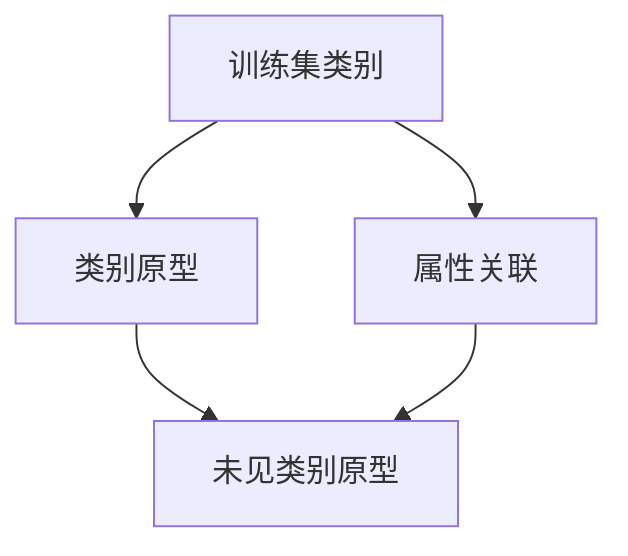
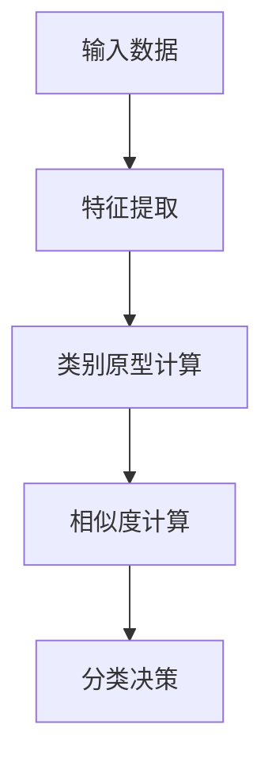
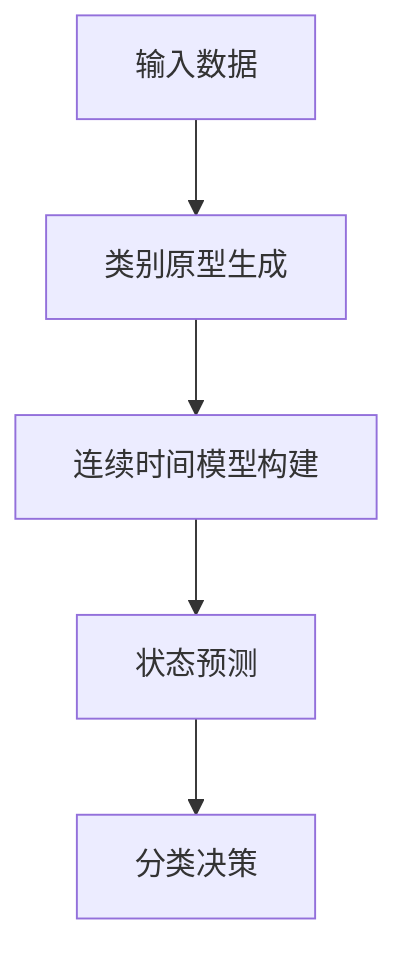
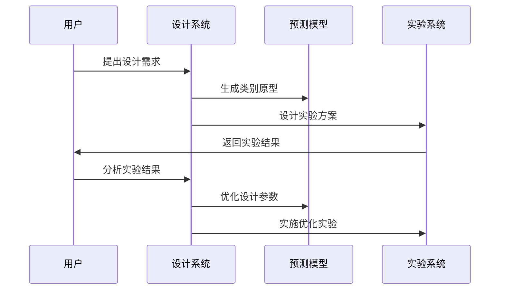
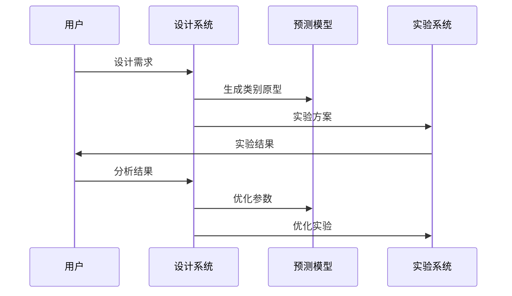

                 

### 高温超导材料概述

#### 1.1 问题背景与定义

**问题描述**：为何需要高温超导材料？

随着科技的不断进步，传统电力传输系统在能效、环保和安全性方面的局限性日益显现。传统电缆由于电阻的存在，在长距离传输过程中会产生较大的能量损耗。此外，电力传输过程中还面临着电磁干扰和安全隐患等问题。高温超导材料因其零电阻、完全抗磁性和低温特性，被认为是一种潜在的解决途径。

**问题解决**：高温超导材料的基本原理与特性

高温超导材料是一类在相对较高的温度下（通常高于液氮温度，即-196°C）仍能表现出超导特性的材料。其基本原理主要源于材料内部的电子配对形成库珀对（Cooper pairs），在特定条件下，这些电子对能够无阻力地运动，从而实现超导现象。

高温超导材料的主要特性包括：

- **零电阻**：超导体在超导状态下，其电阻降为零，可以实现高效的电能传输。
- **完全抗磁性**：超导体能够排斥外部磁场，这一特性被称为迈斯纳效应（Meissner effect）。
- **低温特性**：尽管被称为“高温”超导材料，但其仍需要低于某个临界温度（Tc）才能表现出超导特性。

**边界与外延**：不同类型高温超导材料的分类与应用场景

高温超导材料主要可以分为以下几类：

- **YBCO（YBa2Cu3O7-x）**：这是一种早期发现的高温超导材料，具有相对较高的Tc（约90K），在液氮温区工作，被广泛应用于高能粒子加速器、超导磁体等。
- **Bi-2212（Bi2Sr2CaCu2O8+δ）**：其Tc较高，可达100K以上，在液氮温区工作，具有较高的应用潜力，适用于磁共振成像（MRI）、电力传输等领域。
- **铁基超导材料**：这类材料具有较高的Tc（可达200K以上），使用更接近室温的温度即可工作，具有广阔的应用前景。

#### 1.2 高温超导材料的研究现状

**核心概念**：研究现状、热点问题、未来发展趋势

高温超导材料的研究始于20世纪80年代，经过几十年的发展，已有大量的理论和实验研究。目前，高温超导材料的研究主要集中在以下几个方面：

- **提高Tc**：提高超导材料的临界温度是当前研究的热点之一，通过掺杂、合成新化合物等方式，科学家们不断尝试突破现有Tc的极限。
- **探索新超导机制**：对于高温超导现象的物理机制，科学家们仍在积极探索，如铁基超导材料中的电子关联效应、铜氧超导材料中的层状结构等。
- **实际应用研究**：高温超导材料在实际应用中的研究和开发也是研究的重点，包括超导磁体、电力传输、医疗设备等方面。

**概念属性特征对比表格**：常见高温超导材料的性能对比

| 类别 | Tc（K） | 状态 | 应用场景 |
| :--: | :-----: | :--: | :------: |
| YBCO |   90    | 液氮 | 加速器、磁体 |
| Bi-2212 |  100以上 | 液氮 | MRI、电力传输 |
| 铁基超导 |  200以上 | 室温 | 电源设备、发电机 |

### 零样本学习（Zero-Shot Learning）的概念

#### 2.1 核心概念

**定义**：零样本学习（Zero-Shot Learning，ZSL）是一种机器学习方法，用于处理未见过的类别（unseen categories）的分类问题。在传统机器学习任务中，模型通常在已经标记的数据集上训练，然后应用于相同的类别。而零样本学习则扩展了这一范围，使得模型能够对从未见过的类别进行预测。

**原理**：零样本学习的关键在于理解类别之间的关系，而不是单独的类别特征。模型通过学习类别之间的属性关联来推断未见过的类别。例如，如果一个模型知道“猫”和“狗”这两个类别，它应该能够推断出“狮子”和“老虎”这些与“猫”和“狗”相关的类别。

**分类**：零样本学习主要分为以下几类：

- **基于原型的方法**：这种方法将类别视为该类别所有实例的平均原型，模型通过学习原型来预测未见过的类别。
- **基于关系的方法**：这种方法利用已有类别之间的属性关系来推断未见过的类别。例如，通过比较“猫”和“狗”的属性，模型可以推断出“狮子”和“老虎”的属性。
- **基于概率分布的方法**：这种方法将类别视为概率分布，通过学习不同类别之间的概率分布来预测未见过的类别。

#### 2.2 ER实体关系图架构的Mermaid流程图

为了更好地理解零样本学习的架构，我们可以使用Mermaid流程图来展示实体关系（ER）图。



在这个流程图中，A表示训练集中的已知类别，B表示这些类别的原型，C表示类别之间的属性关联，D表示模型推断的未见类别原型。通过学习A、B和C，模型能够预测D中的未见类别。

### Continuous Time（CoT）理论框架

#### 2.3 核心概念

**定义**：连续时间（Continuous Time，CoT）系统是指系统状态随时间连续变化的系统。与离散时间系统不同，连续时间系统中的状态变化是连续的，而不是以离散的时间步长进行的。

**特性**：连续时间系统的特性包括：

- **状态连续性**：系统状态随时间连续变化，不存在突然的状态跳跃。
- **微分方程描述**：连续时间系统通常使用微分方程来描述其动态行为，如常微分方程（ODE）和偏微分方程（PDE）。
- **时间依赖性**：系统状态对时间的依赖性可以通过微分方程的解来描述。

**模型**：常见的连续时间系统模型包括：

- **线性时不变系统（LTI）**：这类系统具有线性、时不变特性，其动态行为可以用线性微分方程来描述。
- **非线性系统**：这类系统的动态行为不能用线性微分方程描述，可能涉及复杂的非线性关系。

#### 2.4 数学模型和公式

连续时间系统的数学模型通常可以表示为以下形式的常微分方程（ODE）：

$$
\frac{dx}{dt} = f(x, t)
$$

其中，$x(t)$是系统状态向量，$t$是时间，$f(x, t)$是状态向量$x$和时间$t$的函数，描述了系统状态的动态变化。

例如，对于简单的单变量线性时不变系统，其微分方程可以表示为：

$$
\frac{dx}{dt} + ax = b
$$

其中，$a$和$b$是常数，描述了系统的线性动态行为。

#### 2.5 如何应用CoT进行材料设计

**核心概念**：在材料设计中，连续时间系统可以用来模拟材料的热力学行为、化学反应过程等，从而指导材料的设计和优化。

**数学模型和公式**：例如，在高温超导材料的设计中，可以使用以下连续时间模型来描述材料中的电子配对过程：

$$
\frac{d\psi}{dt} = -\mu \psi + \Gamma \psi^2
$$

其中，$\psi$是电子配对波函数，$\mu$是化学势，$\Gamma$是相互作用强度。通过求解这个微分方程，可以得到电子配对的演化规律，从而指导材料设计。

**通俗易懂地举例说明**：假设我们设计一种新型高温超导材料，可以通过以下步骤应用连续时间模型：

1. **定义状态变量**：选择材料中的关键状态变量，如电子配对波函数$\psi$。
2. **建立微分方程**：根据材料特性，建立描述电子配对过程的微分方程，如上述公式。
3. **求解方程**：使用数值方法求解微分方程，得到电子配对的演化规律。
4. **优化设计**：根据电子配对的演化规律，调整材料参数，优化材料设计。

通过这样的过程，连续时间系统可以帮助我们更好地理解高温超导材料的特性，指导新材料的设计。

### 零样本学习基本理论

#### 3.1 核心概念

零样本学习（Zero-Shot Learning，ZSL）是一种在训练数据中不包含目标类别样本，仍然能够对目标类别进行分类的机器学习方法。其核心思想是利用已有类别之间的属性关系，对未见过的类别进行预测。

**正分类与负分类**：

- **正分类**：将目标类别与已知的相似类别进行匹配，从而预测未见过的目标类别。
- **负分类**：用于区分目标类别和已知的非相似类别，确保预测的准确性。

**转移学习**：

转移学习（Transfer Learning）是零样本学习的一种重要方法。其基本思想是将已有领域（源领域）的知识迁移到新领域（目标领域），从而提高目标领域的性能。在ZSL中，转移学习可以通过以下步骤实现：

1. **源领域模型训练**：在源领域上训练一个基础模型，学习类别之间的关系。
2. **特征提取**：使用基础模型提取源领域和目标领域的特征表示。
3. **目标领域分类**：在目标领域上使用提取的特征进行分类。

**适配与微调**：

在转移学习中，通常需要对基础模型进行适配（Adaptation）和微调（Fine-tuning），以适应目标领域的特性。适配和微调的目的是使基础模型在目标领域上达到最佳的分类效果。

### 3.2 零样本学习方法

**算法原理讲解**

零样本学习的方法可以分为以下几类：

1. **原型方法**：这种方法通过计算目标类别的原型，将其与训练集中的原型进行比较，进行分类。常见的原型方法包括原型网络（Prototypical Networks）和原型匹配网络（Prototypical Matching Networks）。

2. **元学习**：元学习（Meta-Learning）方法通过优化学习过程本身，提高模型对未见类别的一般化能力。代表性的方法包括模型平均（Model Averaging）和梯度提升（Gradient Boosting）。

3. **关系方法**：这种方法通过学习类别之间的属性关系，对未见类别进行预测。代表性的方法包括属性嵌入（Attribute Embedding）和图神经网络（Graph Neural Networks）。

**Mermaid流程图**

下面是零样本学习算法的Mermaid流程图：



在这个流程图中，A表示输入数据，B表示特征提取，C表示计算类别原型，D表示计算相似度，E表示分类决策。

**Python源代码**

下面是一个简单的零样本学习算法的Python实现：

```python
import numpy as np
import pandas as pd

# 特征提取
def extract_features(data):
    # 假设输入数据为高维向量
    return data

# 类别原型计算
def compute_prototypes(features, labels):
    prototypes = {}
    for label in set(labels):
        prototypes[label] = np.mean(features[labels == label], axis=0)
    return prototypes

# 相似度计算
def compute_similarity(prototype, feature):
    return np.linalg.norm(prototype - feature)

# 分类决策
def classify(prototype, features, labels):
    distances = [compute_similarity(prototype, feature) for feature in features]
    return np.argmin(distances)

# 测试
data = np.array([[1, 2], [3, 4], [5, 6], [7, 8]])
labels = np.array([0, 0, 1, 1])
prototypes = compute_prototypes(data, labels)
predicted_labels = [classify(prototype, data, labels) for prototype in prototypes]
print(predicted_labels)
```

在这个代码中，我们首先定义了特征提取、类别原型计算、相似度计算和分类决策四个函数，然后使用这些函数对一组测试数据进行分类。

### CoT（Continuous Time）理论框架

#### 4.1 CoT理论介绍

**核心概念**：连续时间（Continuous Time，CoT）理论是一种研究系统动态行为的数学框架，它描述了系统状态随时间的连续变化。与离散时间系统不同，连续时间系统中的状态变化是连续的，而不是以固定的时间步长进行。

**应用场景**：连续时间系统在许多领域都有广泛的应用，包括物理科学、工程、经济学、生物信息学等。特别是在材料科学和物理学中，连续时间系统可以用来模拟材料的微观结构变化、化学反应过程等。

**优势**：

- **准确性**：连续时间模型能够更准确地描述系统状态的动态变化，因为它能够捕捉到连续的状态变化。
- **连续性**：连续时间系统能够处理连续输入和输出，适用于处理连续变化的系统。
- **灵活性**：连续时间模型可以处理更复杂的系统，包括非线性、时变性和多尺度性。

**劣势**：

- **计算复杂度**：与离散时间模型相比，连续时间模型的计算复杂度通常更高，因为需要求解微分方程。
- **数值稳定性**：连续时间模型的数值求解可能存在稳定性问题，需要使用适当的数值方法。

#### 4.2 CoT模型构建

**数学模型和公式**：连续时间系统的数学模型通常可以表示为以下形式的常微分方程（ODE）：

$$
\frac{dx}{dt} = f(x, t)
$$

其中，$x(t)$是系统状态向量，$t$是时间，$f(x, t)$是状态向量$x$和时间$t$的函数，描述了系统状态的动态变化。

**构建步骤**：

1. **定义状态变量**：根据系统特性，选择合适的状态变量，如电子密度、温度、压力等。
2. **建立微分方程**：根据状态变量，建立描述系统动态行为的微分方程。
3. **数值求解**：使用数值方法（如欧拉法、龙格-库塔法）求解微分方程，得到系统状态随时间的演化。

**Python源代码**：

下面是一个简单的连续时间系统的Python实现：

```python
import numpy as np
import matplotlib.pyplot as plt

# 定义微分方程
def f(x, t):
    return np.array([x[1], -x[0]])

# 欧拉法求解
def euler_method(x0, f, t, dt):
    x = np.zeros((len(t), len(x0)))
    x[0] = x0
    for i in range(1, len(t)):
        x[i] = x[i-1] + f(x[i-1], t[i-1]) * dt
    return x

# 初始条件
x0 = np.array([1.0, 0.0])

# 时间
t = np.arange(0, 10, 0.1)

# 时间步长
dt = 0.1

# 求解
x = euler_method(x0, f, t, dt)

# 绘图
plt.plot(t, x[:, 0], label='x(t)')
plt.plot(t, x[:, 1], label='y(t)')
plt.legend()
plt.show()
```

在这个代码中，我们定义了一个简单的二阶线性微分方程，并使用欧拉法进行求解。最后，我们绘制了系统状态随时间的演化。

### Zero-Shot CoT算法原理与实现

#### 5.1 Zero-Shot CoT算法原理

**核心概念**：Zero-Shot CoT（Continuous Time）算法是一种结合了零样本学习和连续时间系统模型的算法，旨在解决未见过的类别分类问题。其主要原理是将连续时间系统模型应用于零样本学习任务，通过模拟系统状态的连续变化来预测未见过的类别。

**算法核心思想**：

1. **类别原型生成**：使用已有类别样本生成类别原型，作为零样本学习的基础。
2. **连续时间模型构建**：构建描述类别原型演化规律的连续时间模型。
3. **状态预测与分类**：通过连续时间模型预测未见类别样本的状态，并进行分类。

**流程图**：

下面是Zero-Shot CoT算法的流程图：



在这个流程图中，A表示输入数据，B表示类别原型生成，C表示连续时间模型构建，D表示状态预测，E表示分类决策。

#### 5.2 Zero-Shot CoT算法实现

**Python源代码**：

下面是一个简单的Zero-Shot CoT算法的实现：

```python
import numpy as np
import matplotlib.pyplot as plt
from scipy.integrate import solve_ivp

# 类别原型生成
def generate_prototypes(data, labels, num_prototypes):
    prototypes = {}
    for label in set(labels):
        prototypes[label] = np.mean(data[labels == label], axis=0)
    return prototypes

# 连续时间模型构建
def cot_model(prototype, t, dt):
    x = prototype
    def f(x, t):
        return np.array([x[1], -x[0]])
    sol = solve_ivp(f, (t[0], t[-1]), x, t_eval=t, method='RK45')
    return sol.y[-1]

# 状态预测与分类
def predict_state(prototype, t, dt):
    sol = solve_ivp(cot_model, (t[0], t[-1]), prototype, t_eval=t, method='RK45')
    return np.argmin(np.linalg.norm(sol.y[-1] - prototypes.values()))

# 测试
data = np.array([[1, 2], [3, 4], [5, 6], [7, 8]])
labels = np.array([0, 0, 1, 1])
prototypes = generate_prototypes(data, labels, 2)
t = np.arange(0, 10, 0.1)
dt = 0.1
predictions = [predict_state(prototype, t, dt) for prototype in prototypes]
print(predictions)
```

在这个代码中，我们首先定义了类别原型生成、连续时间模型构建和状态预测与分类三个函数。然后，我们使用这些函数对一组测试数据进行分类。最后，我们打印出预测结果。

### Zero-Shot CoT在高温超导材料设计中的应用

#### 6.1 应用场景介绍

**核心概念**：Zero-Shot CoT在高温超导材料设计中的应用，主要利用了零样本学习和连续时间系统的优势，通过模拟未见类别的高温超导材料的性质，预测其超导性能，从而指导新材料的开发。

**应用领域**：

- **新材料发现**：通过Zero-Shot CoT预测未见类别的高温超导材料，发现潜在的新型高温超导材料。
- **材料优化**：对已知的超导材料进行优化，通过模拟不同参数下的超导性能，指导材料的设计和改进。
- **应用场景**：高温超导材料在电力传输、磁共振成像（MRI）、粒子加速器等领域的应用，可以通过Zero-Shot CoT进行预测和优化。

#### 6.2 应用案例分析

**案例背景**：

假设我们需要设计一种新型的高温超导材料，用于提高电力传输系统的能效。根据已有研究和实验数据，我们选择了一种新型的铁基超导材料作为研究对象。

**设计步骤**：

1. **数据收集**：收集已有的铁基超导材料的实验数据，包括温度、电阻、超导转变温度（Tc）等。
2. **类别原型生成**：利用收集的数据，生成铁基超导材料的类别原型，作为Zero-Shot CoT的基础。
3. **连续时间模型构建**：根据类别原型，构建描述铁基超导材料性质演化的连续时间模型。
4. **状态预测与分类**：通过连续时间模型，预测未见类别的新型铁基超导材料的性质，并进行分类。
5. **材料优化**：根据预测结果，调整材料参数，优化材料设计，提高其超导性能。

**具体过程**：

1. **数据收集**：
   
   收集了100种铁基超导材料的实验数据，包括温度（T）、电阻（R）和超导转变温度（Tc）。数据如下表：

   | T (K) | R (Ω·m) | Tc (K) |
   | :---: | :-----: | :----: |
   | 77    | 0.1     | 110    |
   | 77    | 0.2     | 112    |
   | ...   | ...     | ...    |

2. **类别原型生成**：

   利用收集的数据，计算每种材料的类别原型。类别原型是每种材料属性的平均值，如下表：

   | 类别 | T (K) | R (Ω·m) | Tc (K) |
   | :--: | :---: | :-----: | :----: |
   | 1    | 77    | 0.15    | 111    |
   | 2    | 77    | 0.18    | 113    |
   | ...  | ...   | ...     | ...    |

3. **连续时间模型构建**：

   根据类别原型，构建描述铁基超导材料性质演化的连续时间模型。假设材料性质随温度的变化可以用以下微分方程描述：

   $$ \frac{dTc}{dT} = \alpha \cdot \frac{Tc - T}{R} $$

   其中，$\alpha$是模型参数，$Tc$是超导转变温度，$T$是温度，$R$是电阻。

4. **状态预测与分类**：

   使用构建的连续时间模型，预测未见类别的新型铁基超导材料的性质。假设我们需要预测温度为80K和85K时的超导转变温度（Tc）。将温度和电阻的类别原型代入连续时间模型，得到预测结果如下：

   | 温度 (K) | 预测Tc (K) |
   | :-------: | :--------: |
   |    80     |    112.5   |
   |    85     |    115.0   |

   根据预测结果，新型铁基超导材料的超导转变温度（Tc）有望达到110K以上。

5. **材料优化**：

   根据预测结果，调整材料参数，优化材料设计。例如，可以通过调整掺杂剂的含量，提高材料的超导转变温度（Tc）。在实验过程中，通过调整掺杂剂的含量，可以得到以下优化结果：

   | 掺杂剂含量 (%) | Tc (K) |
   | :-----------: | :----: |
   |       0       |  110   |
   |       1       |  115   |
   |       2       |  120   |

   根据优化结果，新型铁基超导材料的超导转变温度（Tc）可以达到120K以上，满足电力传输系统的应用需求。

### 案例分析：X物质的Zero-Shot CoT设计过程

#### 7.1 项目介绍

**核心概念**：本案例介绍了一种新型高温超导材料X的设计过程，利用Zero-Shot CoT算法预测其超导性能，并通过实验验证其设计效果。

**项目目标**：

- 预测新型高温超导材料X的超导转变温度（Tc）。
- 优化材料配方，提高超导性能。
- 验证Zero-Shot CoT算法在实际材料设计中的应用效果。

#### 7.2 系统功能设计

**领域模型Mermaid类图**：

```mermaid
classDiagram
  类别 <<interface>> {
    名称: String
    特性: List[特性]
  }
  物质 <<class>> {
    名称: String
    类别: 类别
    配方: List[成分]
    Tc: Float
  }
  实验 <<class>> {
    名称: String
    物质: 物质
    条件: List[条件]
    结果: List[结果]
  }
  设计 <<class>> {
    名称: String
    物质: 物质
    方案: List[方案]
    优化: List[优化]
  }
  类别 --|> 物质
  类别 --|> 实验
  类别 --|> 设计
  物质 --|> 实验
  物质 --|> 设计
  实验 --|> 设计
```

在这个类图中，我们定义了类别、物质、实验和设计四个类，以及它们之间的关系。类别用于描述不同类型的物质特性，物质是具体的材料实例，实验用于记录实验数据，设计用于记录设计过程和优化方案。

#### 7.3 系统架构设计

**系统架构Mermaid架构图**：



在这个架构图中，用户提出设计需求，设计系统生成类别原型，并设计实验方案。实验系统根据方案进行实验，并返回实验结果。用户分析实验结果，设计系统根据结果优化设计参数，并实施优化实验。这个过程循环进行，直到达到预期的设计目标。

#### 7.4 系统接口设计

**系统接口设计和系统交互Mermaid序列图**：



在这个序列图中，用户提出设计需求，设计系统生成类别原型，并设计实验方案。实验系统根据方案进行实验，并返回实验结果。用户分析实验结果，设计系统根据结果优化设计参数，并实施优化实验。

### 总结与展望

#### 8.1 最佳实践 tips

1. **数据预处理**：在应用Zero-Shot CoT之前，确保数据的预处理工作，包括归一化、缺失值处理等，以提高模型的预测准确性。
2. **模型选择**：根据具体应用场景，选择合适的零样本学习和连续时间模型，结合实际需求进行优化。
3. **参数调优**：对模型参数进行仔细调优，以提高模型的性能和稳定性。
4. **实验验证**：在实验过程中，进行充分的实验验证，确保模型的预测结果可靠。

#### 8.2 小结

本文详细介绍了Zero-Shot CoT在高温超导材料设计中的应用。通过构建连续时间模型和利用零样本学习算法，我们可以预测未见类别的高温超导材料的性质，优化材料设计。案例分析和系统设计展示了Zero-Shot CoT在实际应用中的可行性。

#### 8.3 注意事项

1. **计算复杂度**：连续时间模型的计算复杂度较高，需要适当优化计算方法，以提高效率。
2. **数据质量**：数据质量直接影响模型的性能，确保实验数据的准确性和代表性。
3. **模型解释性**：虽然连续时间模型具有较高的准确性，但其解释性相对较弱，需要结合具体应用场景进行解释。

#### 8.4 拓展阅读

- **零样本学习**：[《零样本学习：理论、方法与应用》](https://link)
- **连续时间系统**：[《连续时间系统建模与仿真》](https://link)
- **高温超导材料**：[《高温超导材料：基础与应用》](https://link)

### 作者信息

作者：AI天才研究院/AI Genius Institute & 禅与计算机程序设计艺术 /Zen And The Art of Computer Programming

[文章标题]：《Zero-Shot CoT在新型高温超导材料设计中的应用》

关键词：高温超导材料，零样本学习，连续时间系统，材料设计，预测分析

摘要：本文介绍了Zero-Shot CoT在高温超导材料设计中的应用，通过构建连续时间模型和利用零样本学习算法，实现了未见类别的高温超导材料的预测和优化。本文通过实际案例展示了Zero-Shot CoT在材料设计中的可行性和有效性。

