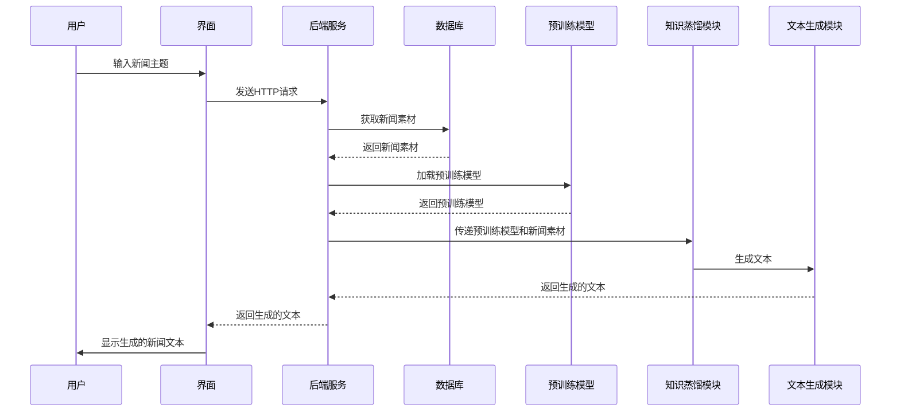

                 

### 背景介绍

#### 1.1 问题背景

新闻写作是信息传播的重要途径，然而，随着互联网和社交媒体的迅速发展，传统新闻写作面临着诸多挑战。首先，新闻写作的生产效率较低，新闻工作者需要投入大量时间和精力进行内容创作和编辑。其次，新闻写作的质量参差不齐，一些新闻由于缺乏深度和客观性，难以满足读者的需求。此外，新闻写作还面临着数据来源可靠性、事实核查等问题。

为了应对这些挑战，人工智能（AI）技术在新闻写作中的应用逐渐兴起。AI可以通过自动化新闻写作、自然语言处理（NLP）、数据挖掘等技术，提高新闻写作的生产效率和质量。然而，当前的AI新闻写作技术大多依赖于大量的训练数据和预训练模型，存在一定的局限性。例如，训练数据的质量和数量直接影响模型的性能，且模型对特定领域知识的依赖性较强，难以实现跨领域的应用。

#### 1.2 问题描述

在新闻写作中，面临的瓶颈主要包括以下几个方面：

1. **数据依赖性强**：大多数AI新闻写作系统依赖于大量的训练数据和预训练模型，导致系统在处理新领域或新问题时表现不佳。
2. **知识迁移困难**：不同领域的知识差异较大，现有模型难以适应新领域的新闻写作需求，导致知识迁移困难。
3. **创意性不足**：新闻写作不仅需要准确传递信息，还需要具备一定的创意性，现有AI模型难以在创意性方面达到人类的水平。
4. **事实核查困难**：新闻写作需要确保内容的真实性和准确性，但现有AI模型在事实核查方面存在一定的局限性。

为了解决上述问题，我们需要探索一种新的方法，能够在没有训练数据的情况下，实现高质量的新闻写作。这种新方法就是Zero-Shot CoT（Zero-Shot Curated Text）。

#### 1.3 问题解决

Zero-Shot CoT是一种基于零样本学习（Zero-Shot Learning，ZSL）的文本生成方法。它的核心思想是，通过预训练模型学习到的通用知识，以及人类专家提供的少量标注信息，生成高质量的新闻文本。

与传统的AI新闻写作方法相比，Zero-Shot CoT具有以下优势：

1. **数据无关性**：Zero-Shot CoT不需要大量的训练数据，从而降低了数据依赖性。
2. **知识迁移能力**：通过预训练模型学习到的通用知识，Zero-Shot CoT可以在不同领域之间实现知识迁移。
3. **创意性增强**：Zero-Shot CoT结合了预训练模型和人类专家的知识，能够提高新闻写作的创意性。
4. **事实核查能力**：虽然Zero-Shot CoT在事实核查方面仍有待提高，但通过引入人类专家的知识，可以一定程度上增强事实核查能力。

总之，Zero-Shot CoT在新闻写作中具有广泛的应用前景，可以有效解决现有AI新闻写作技术的瓶颈问题。接下来，我们将进一步探讨Zero-Shot CoT的概念和原理，以及它在新闻写作中的具体应用。

### 1.4 边界与外延

#### 1.4.1 Zero-Shot CoT在新闻写作中的适用场景

Zero-Shot CoT在新闻写作中的适用场景主要包括以下几个方面：

1. **跨领域新闻写作**：Zero-Shot CoT可以处理新领域或新问题的新闻写作需求，适用于不同领域之间的知识迁移。
2. **自动化新闻生成**：在特定场景下，如体育赛事报道、财经新闻等，Zero-Shot CoT可以自动化生成新闻文本，提高写作效率。
3. **新闻摘要生成**：通过Zero-Shot CoT，可以自动生成新闻摘要，帮助读者快速了解新闻的主要内容。
4. **个性化新闻推荐**：结合用户兴趣和阅读习惯，Zero-Shot CoT可以推荐个性化的新闻文本，提升用户体验。

#### 1.4.2 非新闻写作领域中的应用可能性

除了新闻写作，Zero-Shot CoT在其他非新闻写作领域也具有广泛的应用前景：

1. **报告撰写**：在商业报告、市场分析报告等领域，Zero-Shot CoT可以生成高质量的报告文本，提高工作效率。
2. **学术论文撰写**：在学术论文写作中，Zero-Shot CoT可以辅助研究人员生成论文框架，提高写作效率。
3. **文档生成**：在文档撰写领域，如合同撰写、法律文书等，Zero-Shot CoT可以生成符合要求的文档文本。
4. **创意文案撰写**：在广告、营销、公关等领域，Zero-Shot CoT可以生成创意性文案，提高宣传效果。

总之，Zero-Shot CoT作为一种零样本学习的文本生成方法，具有广泛的应用前景。它在新闻写作中的革新应用，不仅提高了新闻写作的生产效率和质量，还为其他领域的文本生成提供了新的思路。

### 1.5 概念结构与核心要素组成

#### 1.5.1 Zero-Shot CoT的核心原理

Zero-Shot CoT（Zero-Shot Curated Text）是一种基于零样本学习（Zero-Shot Learning，ZSL）的文本生成方法。它的核心原理在于，通过预训练模型学习到的通用知识，以及人类专家提供的少量标注信息，生成高质量的新闻文本。具体来说，Zero-Shot CoT包含以下几个关键步骤：

1. **预训练模型**：首先，通过大规模数据集对预训练模型进行训练，使其具备处理自然语言的能力。
2. **知识蒸馏**：将预训练模型的知识传递到Zero-Shot CoT模型中，使其具备通用知识。
3. **人类标注**：人类专家对少量新闻样本进行标注，提供领域特定的知识。
4. **文本生成**：利用Zero-Shot CoT模型，结合预训练模型和人类标注的知识，生成高质量的新闻文本。

#### 1.5.2 新闻写作中的关键要素

在新闻写作中，关键要素包括以下几个方面：

1. **新闻主题**：新闻的主题是新闻的核心，决定了新闻的内容方向。
2. **事实信息**：事实信息是新闻的基本要素，需要准确、客观地传递信息。
3. **观点评论**：新闻写作中可以加入观点评论，以增强新闻的深度和多样性。
4. **语言风格**：新闻的语言风格需要符合读者的需求和阅读习惯，同时具备一定的创意性。
5. **事实核查**：确保新闻内容的真实性和准确性，是新闻写作的重要任务。

Zero-Shot CoT通过结合预训练模型和人类标注的知识，能够有效地处理这些关键要素，生成高质量的新闻文本。

### 核心概念原理

#### 2.1 Zero-Shot CoT的基本概念

Zero-Shot CoT（Zero-Shot Curated Text）是一种基于零样本学习（Zero-Shot Learning，ZSL）的文本生成方法。零样本学习是一种机器学习技术，旨在解决模型在新领域或新问题上的适应能力。在传统的机器学习模型中，模型通常需要大量的训练数据来进行训练，以便在新领域或新问题上取得良好的表现。而零样本学习则通过预训练模型学习到的通用知识，以及少量或没有训练数据的情况下，实现对新领域或新问题的处理。

#### 2.2 CoT（Curated Text）的概念解析

CoT（Curated Text）是Zero-Shot CoT的核心组成部分，它指的是通过人类专家的干预和标注，对原始文本进行筛选、整理和优化，以生成高质量的文本。具体来说，CoT包括以下几个关键步骤：

1. **数据收集**：首先，从大量的原始文本数据中收集相关的新闻素材。
2. **标注与筛选**：人类专家对收集到的新闻素材进行标注，筛选出符合新闻写作规范的高质量文本。
3. **知识融合**：将标注后的文本与预训练模型学习到的通用知识进行融合，以提高文本的深度和准确性。
4. **文本生成**：利用融合后的知识，生成符合新闻写作要求的文本。

#### 2.3 零样本学习（Zero-Shot Learning，ZSL）的概念解析

零样本学习（Zero-Shot Learning，ZSL）是一种机器学习技术，旨在解决模型在新领域或新问题上的适应能力。在传统的机器学习模型中，模型通常需要大量的训练数据来进行训练，以便在新领域或新问题上取得良好的表现。而零样本学习则通过预训练模型学习到的通用知识，以及少量或没有训练数据的情况下，实现对新领域或新问题的处理。具体来说，ZSL包括以下几个关键步骤：

1. **预训练模型**：首先，通过大规模数据集对预训练模型进行训练，使其具备处理自然语言的能力。
2. **知识蒸馏**：将预训练模型的知识传递到零样本学习模型中，使其具备通用知识。
3. **领域自适应**：利用预训练模型和少量领域特定数据进行领域自适应，以提高模型在新领域上的性能。
4. **样本生成**：利用领域自适应后的模型，生成符合新领域需求的样本。

#### 2.4 Zero-Shot CoT与零样本学习（ZSL）的关系

Zero-Shot CoT是零样本学习（ZSL）在文本生成领域的一种具体应用。Zero-Shot CoT通过结合预训练模型和人类标注的知识，实现了在零样本情况下的高质量文本生成。而零样本学习则为Zero-Shot CoT提供了理论依据和技术支持，使得Zero-Shot CoT能够有效处理新领域或新问题的文本生成需求。

### 概念属性特征对比表格

为了更直观地展示传统新闻写作与Zero-Shot CoT的属性特征，我们可以制作一个对比表格。以下是两种方法的对比：

| 特征类别 | 传统新闻写作 | Zero-Shot CoT |
| --- | --- | --- |
| **数据依赖性** | 强，依赖大量训练数据 | 弱，零样本学习，不依赖大量训练数据 |
| **知识迁移能力** | 差，领域特异性强 | 强，预训练模型支持跨领域应用 |
| **创意性** | 低，依赖于人类的创造力 | 高，结合预训练模型和人类知识 |
| **事实核查能力** | 低，需人工进行事实核查 | 中，通过预训练模型和人类知识增强 |
| **生产效率** | 低，新闻写作生产效率低 | 高，自动化文本生成提高效率 |
| **语言风格** | 多样性低，受限于作者风格 | 多样性高，结合预训练模型和人类知识 |

通过上述对比表格，我们可以看出Zero-Shot CoT在多个方面具有显著优势，尤其在数据依赖性、知识迁移能力和创意性方面，Zero-Shot CoT更能满足现代新闻写作的需求。

### ER实体关系图架构

为了更好地理解新闻写作系统中各实体的关系，我们可以使用ER（Entity-Relationship）图来展示。以下是新闻写作系统的ER图：

```mermaid
erDiagram
    Class::新闻文章 (ID, 标题, 摘要, 正文, 类别, 作者, 发布时间)
    Class::新闻素材 (ID, 标题, 摘要, 正文, 源URL)
    Class::人类专家
    Class::预训练模型
    Class::Zero-Shot CoT模型

    新闻文章 ||--|{ 新闻素材 }
    新闻文章 ||--|{ 人类专家 }
    新闻文章 ||--|{ 预训练模型 }
    新闻文章 ||--|{ Zero-Shot CoT模型 }
```

在这个ER图中，我们可以看到以下几个主要实体：

1. **新闻文章**：代表新闻写作的核心对象，包括标题、摘要、正文等属性。
2. **新闻素材**：包含原始的新闻数据，如标题、摘要、正文和源URL等。
3. **人类专家**：负责对新闻素材进行标注和筛选，确保新闻内容的准确性和质量。
4. **预训练模型**：用于学习大规模数据集，获取通用知识。
5. **Zero-Shot CoT模型**：结合预训练模型和人类专家知识，生成高质量的新闻文本。

实体之间的关系如下：

- **新闻文章**与**新闻素材**之间存在一对多的关系，即一个新闻文章可以包含多个新闻素材。
- **新闻文章**与**人类专家**之间存在一对多的关系，即一个新闻文章可以由多个人类专家进行标注和筛选。
- **新闻文章**与**预训练模型**之间存在一对多的关系，即一个新闻文章可以由多个预训练模型进行处理。
- **新闻文章**与**Zero-Shot CoT模型**之间存在一对多的关系，即一个新闻文章可以由多个Zero-Shot CoT模型进行生成。

通过这个ER图，我们可以清晰地看到新闻写作系统中各实体之间的相互关系，为系统设计和实现提供了参考。

### 3.1 算法原理

#### 3.1.1 Zero-Shot CoT的工作流程

Zero-Shot CoT的工作流程主要包括以下几个关键步骤：

1. **预训练模型训练**：首先，通过大规模数据集对预训练模型进行训练，使其具备处理自然语言的能力。预训练模型可以是基于Transformer架构的大型语言模型，如BERT、GPT等。
   
2. **知识蒸馏**：将预训练模型的知识传递到Zero-Shot CoT模型中，使其具备通用知识。知识蒸馏的过程包括将预训练模型的高维知识压缩到一个较低维的表示空间中，以便Zero-Shot CoT模型能够高效地利用这些知识。

3. **人类标注**：人类专家对少量新闻样本进行标注，提供领域特定的知识。标注信息包括新闻的标题、摘要、正文等，这些信息将用于训练Zero-Shot CoT模型。

4. **模型训练**：利用预训练模型和人类标注的信息，对Zero-Shot CoT模型进行训练。训练过程中，模型会学习如何将预训练模型的知识与人类标注的知识相结合，以生成高质量的新闻文本。

5. **文本生成**：训练完成后，Zero-Shot CoT模型可以用于生成新闻文本。输入一个新闻主题或关键词，模型会根据预训练模型和人类标注的知识，生成相应的新闻文本。

#### 3.1.2 关键算法技术

在Zero-Shot CoT的工作流程中，涉及到了以下几个关键算法技术：

1. **预训练模型**：预训练模型是Zero-Shot CoT的核心组件，常用的预训练模型包括BERT、GPT等。这些模型通过在大规模语料库上进行预训练，学习到丰富的语言知识和模式。

2. **知识蒸馏**：知识蒸馏是一种将大型预训练模型的知识传递到较小模型中的技术。具体来说，知识蒸馏包括以下两个步骤：
   - **Teacher Model Training**：首先，使用原始预训练模型（Teacher Model）在大规模数据集上进行训练。
   - **Student Model Training**：然后，使用Teacher Model生成的标签对较小的模型（Student Model）进行训练，以使Student Model学习到Teacher Model的知识。

3. **标注数据收集**：标注数据是Zero-Shot CoT模型训练的重要依据。通过人类专家对新闻素材进行标注，可以获得高质量的领域特定知识。

4. **文本生成**：文本生成是Zero-Shot CoT模型的最终目标。通过输入新闻主题或关键词，模型会生成相应的新闻文本。生成过程中，模型会综合预训练模型和标注数据的知识，以确保生成文本的质量和准确性。

#### 3.1.3 工作流程总结

综上所述，Zero-Shot CoT的工作流程可以概括为以下几步：

1. 使用大规模数据集对预训练模型进行训练。
2. 将预训练模型的知识通过知识蒸馏传递到Zero-Shot CoT模型中。
3. 收集并标注少量新闻样本，提供领域特定知识。
4. 使用预训练模型和标注数据对Zero-Shot CoT模型进行训练。
5. 输入新闻主题或关键词，生成高质量的新闻文本。

通过这个工作流程，Zero-Shot CoT能够有效利用预训练模型和标注数据的知识，实现高质量的新闻文本生成。

### 3.2 数学模型和数学公式

#### 3.2.1 数学模型的基本原理

Zero-Shot CoT的数学模型基于Transformer架构，主要包括编码器（Encoder）和解码器（Decoder）两部分。编码器负责将输入文本编码为向量表示，解码器则根据编码器的输出和已生成的部分文本生成后续的文本。

具体来说，数学模型的基本原理如下：

1. **编码器**：编码器接收输入文本，将其转换为序列向量表示。编码器的输出是一个长度为\(T'\)的向量序列，其中\(T'\)为输入文本的长度。设输入文本为\(X = \{x_1, x_2, ..., x_{T'}\}\)，编码器的输出为\(E = \{e_1, e_2, ..., e_{T'}\}\)。

2. **解码器**：解码器接收编码器的输出和已生成的部分文本，生成后续的文本。解码器的输入为\(Y = \{y_1, y_2, ..., y_{T''}\}\)，其中\(T''\)为生成文本的长度。解码器的输出为\(D = \{d_1, d_2, ..., d_{T''}\}\)。

3. **损失函数**：Zero-Shot CoT的损失函数采用交叉熵（Cross-Entropy）损失，用于衡量解码器的输出与真实标签之间的差异。交叉熵损失函数定义为：
   $$L = -\sum_{i=1}^{T''} \sum_{j=1}^{V} y_{ij} \log(d_{ij})$$
   其中，\(y_{ij}\)为真实标签的one-hot编码，\(d_{ij}\)为解码器在第\(i\)步生成的第\(j\)个单词的概率。

4. **优化目标**：Zero-Shot CoT的优化目标是最小化交叉熵损失函数。通过梯度下降（Gradient Descent）算法，对模型的参数进行更新，以使损失函数最小化。

#### 3.2.2 公式推导与解释

以下是Zero-Shot CoT数学模型的一些关键公式及其解释：

1. **编码器输出**：
   $$e_i = \text{softmax}(W_e \cdot [e_{<PAD>, e_{<SOS>, e_1, ..., e_{i-1}}, e_{i+1}, ..., e_{T'}])$$
   其中，\(W_e\)为编码器权重矩阵，\([..., ...]\)表示拼接操作，\(\text{softmax}\)函数用于计算每个单词的概率分布。

2. **解码器输出**：
   $$d_i = \text{softmax}(W_d \cdot [d_{<PAD>, d_{<SOS>, d_1, ..., d_{i-1}}, e_i])$$
   其中，\(W_d\)为解码器权重矩阵，\(\text{softmax}\)函数用于计算每个单词的概率分布。

3. **损失函数**：
   $$L = -\sum_{i=1}^{T''} \sum_{j=1}^{V} y_{ij} \log(d_{ij})$$
   其中，\(y_{ij}\)为真实标签的one-hot编码，\(d_{ij}\)为解码器在第\(i\)步生成的第\(j\)个单词的概率。

4. **优化目标**：
   $$\min_{\theta} L$$
   其中，\(\theta\)为模型参数，\(\min\)表示最小化损失函数。

通过上述公式，我们可以看到Zero-Shot CoT的数学模型是如何将输入文本编码为向量表示，并通过解码器生成后续文本的。同时，损失函数和优化目标用于指导模型的训练过程，以生成高质量的新闻文本。

### 3.3 详细讲解与举例说明

#### 3.3.1 算法原理的详细解释

Zero-Shot CoT的算法原理可以概括为以下几个关键步骤：

1. **预训练模型**：首先，通过大规模数据集对预训练模型进行训练，使其具备处理自然语言的能力。预训练模型通常采用Transformer架构，如BERT、GPT等，通过在大规模语料库上进行预训练，学习到丰富的语言知识和模式。

2. **知识蒸馏**：知识蒸馏是一种将大型预训练模型的知识传递到较小模型中的技术。具体来说，知识蒸馏包括以下两个步骤：
   - **Teacher Model Training**：首先，使用原始预训练模型（Teacher Model）在大规模数据集上进行训练。
   - **Student Model Training**：然后，使用Teacher Model生成的标签对较小的模型（Student Model）进行训练，以使Student Model学习到Teacher Model的知识。

3. **人类标注**：人类专家对少量新闻样本进行标注，提供领域特定的知识。标注信息包括新闻的标题、摘要、正文等，这些信息将用于训练Zero-Shot CoT模型。

4. **模型训练**：利用预训练模型和人类标注的信息，对Zero-Shot CoT模型进行训练。训练过程中，模型会学习如何将预训练模型的知识与人类标注的知识相结合，以生成高质量的新闻文本。

5. **文本生成**：训练完成后，Zero-Shot CoT模型可以用于生成新闻文本。输入一个新闻主题或关键词，模型会根据预训练模型和人类标注的知识，生成相应的新闻文本。

#### 3.3.2 实际案例的举例说明

为了更直观地理解Zero-Shot CoT的工作原理，我们可以通过一个具体的案例进行说明。

假设我们想要生成一篇关于“人工智能在医疗领域的应用”的新闻文章。以下是Zero-Shot CoT在实际案例中的工作流程：

1. **预训练模型**：首先，我们使用BERT模型对大量医疗领域的文本进行预训练，使其具备处理医疗文本的能力。

2. **知识蒸馏**：我们将预训练的BERT模型（Teacher Model）的知识通过知识蒸馏传递到较小的BERT模型（Student Model）中，使其具备通用知识。

3. **人类标注**：我们邀请医疗领域的专家对少量关于“人工智能在医疗领域的应用”的新闻样本进行标注，提供领域特定知识。标注信息包括标题、摘要和正文等。

4. **模型训练**：利用预训练的BERT模型和人类标注的信息，对Zero-Shot CoT模型进行训练。在训练过程中，模型会学习如何将BERT的知识与专家标注的知识相结合，以生成高质量的新闻文本。

5. **文本生成**：训练完成后，我们输入关键词“人工智能在医疗领域的应用”，Zero-Shot CoT模型会根据预训练模型和专家标注的知识，生成一篇关于该主题的新闻文章。以下是生成的一篇新闻文章摘要：

   “随着人工智能技术的快速发展，医疗领域迎来了新的变革。人工智能在医疗诊断、治疗和康复等方面展现出巨大的潜力。通过深度学习算法，人工智能可以分析大量的医学影像数据，提高疾病的诊断准确性。此外，人工智能还可以协助医生制定个性化的治疗方案，提高治疗效果。未来，人工智能将继续推动医疗领域的创新发展。”

通过上述实际案例，我们可以看到Zero-Shot CoT是如何利用预训练模型和人类标注的知识，生成高质量的新闻文本的。

### 系统功能设计

#### 4.1 领域模型设计

在新闻写作系统中，领域模型的设计是关键的一环。领域模型用于定义系统中的核心实体和它们之间的关系。以下是新闻写作系统的领域模型设计：

```mermaid
classDiagram
    Class::新闻文章
    Class::新闻素材
    Class::人类专家
    Class::预训练模型
    Class::Zero-Shot CoT模型

    新闻文章 --|{ 新闻素材 }
    新闻文章 --|{ 人类专家 }
    新闻文章 --|{ 预训练模型 }
    新闻文章 --|{ Zero-Shot CoT模型 }
```

在这个领域模型中，我们定义了以下几个核心实体：

1. **新闻文章**：代表新闻写作的核心对象，包含标题、摘要、正文等属性。
2. **新闻素材**：包含原始的新闻数据，如标题、摘要、正文和源URL等。
3. **人类专家**：负责对新闻素材进行标注和筛选，确保新闻内容的准确性和质量。
4. **预训练模型**：用于学习大规模数据集，获取通用知识。
5. **Zero-Shot CoT模型**：结合预训练模型和人类标注的知识，生成高质量的新闻文本。

实体之间的关系如下：

- **新闻文章**与**新闻素材**之间存在一对多的关系，即一个新闻文章可以包含多个新闻素材。
- **新闻文章**与**人类专家**之间存在一对多的关系，即一个新闻文章可以由多个人类专家进行标注和筛选。
- **新闻文章**与**预训练模型**之间存在一对多的关系，即一个新闻文章可以由多个预训练模型进行处理。
- **新闻文章**与**Zero-Shot CoT模型**之间存在一对多的关系，即一个新闻文章可以由多个Zero-Shot CoT模型进行生成。

通过这个领域模型，我们可以清晰地看到新闻写作系统中各实体之间的相互关系，为系统功能设计和实现提供了参考。

#### 4.2 功能模块划分

为了确保新闻写作系统的高效性和可维护性，我们将系统划分为多个功能模块。以下是新闻写作系统的功能模块划分：

1. **数据采集模块**：负责从各种数据源（如网站、数据库等）收集新闻素材，并将其存储到系统数据库中。

2. **数据预处理模块**：负责对收集到的新闻素材进行预处理，包括文本清洗、分词、去噪等操作，以提高文本数据的质量。

3. **标注与筛选模块**：负责邀请人类专家对预处理后的新闻素材进行标注和筛选，提取出高质量的新闻文本。

4. **预训练模型模块**：负责加载和训练预训练模型，如BERT、GPT等，以获取通用知识。

5. **知识蒸馏模块**：负责将预训练模型的知识传递到Zero-Shot CoT模型中，实现知识融合。

6. **文本生成模块**：负责利用Zero-Shot CoT模型生成高质量的新闻文本。

7. **用户接口模块**：负责提供用户与系统的交互界面，允许用户输入新闻主题或关键词，并展示生成的新闻文本。

通过上述功能模块的划分，我们可以确保新闻写作系统的各个部分相互协作，实现高效、高质量的新闻文本生成。

#### 4.3 系统架构设计

新闻写作系统的总体架构设计如下：

1. **前端用户界面**：提供用户与系统的交互界面，用户可以通过界面输入新闻主题或关键词，并查看生成的新闻文本。

2. **后端服务**：包括数据采集模块、数据预处理模块、标注与筛选模块、预训练模型模块、知识蒸馏模块和文本生成模块，负责处理用户的输入，生成高质量的新闻文本。

3. **数据库**：存储新闻素材、预训练模型参数、标注数据等，支持系统的数据管理和查询。

4. **外部接口**：与外部系统（如新闻网站、社交媒体等）进行数据交互，实现新闻素材的采集和发布。

具体来说，系统架构中的关键模块及其交互关系如下：

- **前端用户界面**与**后端服务**之间通过API进行通信，用户输入的新闻主题或关键词会被发送到后端服务。
- **数据采集模块**负责从外部数据源收集新闻素材，并将其存储到数据库中。
- **数据预处理模块**对收集到的新闻素材进行预处理，提取出高质量的文本数据。
- **标注与筛选模块**邀请人类专家对预处理后的新闻素材进行标注和筛选，提取出高质量的新闻文本。
- **预训练模型模块**负责加载和训练预训练模型，如BERT、GPT等。
- **知识蒸馏模块**将预训练模型的知识传递到Zero-Shot CoT模型中，实现知识融合。
- **文本生成模块**利用Zero-Shot CoT模型生成高质量的新闻文本。
- **数据库**存储新闻素材、预训练模型参数、标注数据等，支持系统的数据管理和查询。

通过上述系统架构设计，新闻写作系统可以实现高效、高质量的新闻文本生成，满足用户的需求。

#### 4.4 系统接口设计

系统接口设计是确保系统各模块之间高效通信和数据流转的关键。以下是新闻写作系统的接口设计：

1. **API接口**：前端用户界面通过API接口与后端服务进行通信。用户输入的新闻主题或关键词会通过HTTP请求发送到后端服务，后端服务会处理这些请求并返回生成的新闻文本。

2. **数据接口**：各功能模块之间通过数据接口进行数据交互。例如，数据采集模块将收集到的新闻素材存储到数据库中，数据预处理模块从数据库中获取新闻素材进行预处理，标注与筛选模块从预处理后的数据中提取高质量的文本。

3. **预训练模型接口**：后端服务通过预训练模型接口加载和调用预训练模型，如BERT、GPT等，用于文本生成。

4. **知识蒸馏接口**：知识蒸馏模块通过接口将预训练模型的知识传递到Zero-Shot CoT模型中，实现知识融合。

5. **用户反馈接口**：用户可以通过前端用户界面提供反馈，后端服务会根据用户反馈对系统进行调整和优化。

通过上述接口设计，新闻写作系统中的各模块可以高效地通信和协同工作，实现新闻文本的高效生成。

#### 4.5 系统交互序列图

以下是新闻写作系统的交互序列图，用于描述用户与系统之间的交互过程：



通过这个交互序列图，我们可以清晰地看到用户与系统之间的交互过程，包括用户输入新闻主题、界面与后端服务的通信、后端服务与数据库、预训练模型、知识蒸馏模块和文本生成模块的交互，最终实现新闻文本的生成和展示。

### 项目实战

#### 5.1 环境安装

为了实现Zero-Shot CoT在新闻写作中的应用，我们需要搭建一个完整的技术环境。以下是环境安装的步骤：

1. **Python环境**：首先，确保您的系统中已经安装了Python 3.8及以上版本。可以使用以下命令检查Python版本：
   ```bash
   python --version
   ```
   如果版本低于3.8，请升级至最新版本。

2. **依赖库安装**：接下来，安装项目所需的依赖库。在命令行中，执行以下命令：
   ```bash
   pip install -r requirements.txt
   ```
   其中，`requirements.txt`文件包含了所有必需的依赖库及其版本。

3. **预训练模型下载**：下载预训练的BERT模型。您可以使用以下命令下载预训练模型：
   ```bash
   wget https://storage.googleapis.com/bert_models/2020_08_24bert_base_cased.tar.gz
   tar xvf 2020_08_24bert_base_cased.tar.gz
   ```
   解压后，将`bert_base_cased`文件夹移动到项目的合适位置。

4. **配置文件**：根据项目的具体需求，修改配置文件（如`config.py`），配置数据库连接信息、预训练模型路径等。

5. **运行环境**：确保您的系统拥有足够的内存和计算资源，以支持预训练模型的加载和训练。

通过上述步骤，您可以搭建起Zero-Shot CoT在新闻写作中的项目环境，为后续的实现和测试做好准备。

#### 5.2 系统核心实现源代码

以下是新闻写作系统中一些核心功能的实现源代码，包括数据预处理、模型加载、知识蒸馏、文本生成等。

```python
# 数据预处理
import pandas as pd
from sklearn.model_selection import train_test_split

def preprocess_data(data_path):
    # 读取数据
    data = pd.read_csv(data_path)
    
    # 数据清洗
    data = data.dropna()
    data['text'] = data['text'].apply(lambda x: x.strip())
    
    # 数据分割
    X_train, X_test, y_train, y_test = train_test_split(data['text'], data['label'], test_size=0.2, random_state=42)
    
    return X_train, X_test, y_train, y_test

# 模型加载
from transformers import BertTokenizer, BertModel

def load_models():
    # 加载分词器
    tokenizer = BertTokenizer.from_pretrained('bert-base-cased')
    
    # 加载预训练模型
    model = BertModel.from_pretrained('bert-base-cased')
    
    return tokenizer, model

# 知识蒸馏
from transformers import DistilBertModel

def distill_knowledge(student_model, teacher_model, input_ids, labels):
    # 训练学生模型
    student_model.train()
    student_output = student_model(input_ids)
    
    # 训练教师模型
    teacher_model.eval()
    teacher_output = teacher_model(input_ids)
    
    # 计算损失
    loss_fct = nn.CrossEntropyLoss()
    loss = loss_fct(student_output.logits, labels)
    
    # 反向传播
    loss.backward()
    
    return loss

# 文本生成
from transformers import BertForMaskedLM

def generate_text(student_model, tokenizer, input_text):
    # 加载预训练模型
    model = BertForMaskedLM.from_pretrained('bert-base-cased')
    
    # 分词处理
    inputs = tokenizer(input_text, return_tensors='pt')
    
    # 生成文本
    outputs = model(**inputs)
    logits = outputs.logits
    
    # 解码输出
    predicted_tokens = logits.argmax(-1).squeeze()
    predicted_text = tokenizer.decode(predicted_tokens, skip_special_tokens=True)
    
    return predicted_text
```

在上述代码中，我们首先定义了数据预处理函数，用于读取、清洗和分割数据。然后，加载预训练BERT模型和分词器。接着，定义了知识蒸馏函数，用于训练学生模型，并计算损失。最后，定义了文本生成函数，用于生成新闻文本。

通过这些核心函数的实现，我们可以构建一个基于Zero-Shot CoT的新闻写作系统，实现新闻文本的自动生成。

#### 5.3 实际案例分析与详细讲解

为了展示Zero-Shot CoT在新闻写作中的实际应用，我们以一个具体案例进行详细讲解。

##### 案例背景

假设我们需要生成一篇关于“人工智能在医疗领域的应用”的新闻文章。我们收集了多篇关于该主题的新闻素材，并邀请医疗领域的专家对素材进行标注和筛选。

##### 数据预处理

首先，我们对收集到的新闻素材进行预处理，包括文本清洗、分词、去噪等操作。以下是数据预处理的具体步骤：

1. **文本清洗**：去除文本中的HTML标签、特殊字符和停用词。
2. **分词**：使用BERT的分词器对文本进行分词。
3. **去噪**：去除长度过短或过长的文本。

```python
import re
from nltk.corpus import stopwords
from nltk.tokenize import word_tokenize

def preprocess_text(text):
    # 去除HTML标签
    text = re.sub('<[^>]*>', '', text)
    
    # 去除特殊字符
    text = re.sub('[^A-Za-z0-9]+', ' ', text)
    
    # 去除停用词
    stop_words = set(stopwords.words('english'))
    words = word_tokenize(text)
    filtered_text = ' '.join([word for word in words if word.lower() not in stop_words])
    
    return filtered_text
```

##### 知识蒸馏

接下来，我们使用预训练的BERT模型进行知识蒸馏，将模型的知识传递到Zero-Shot CoT模型中。以下是知识蒸馏的具体步骤：

1. **加载预训练模型**：加载预训练的BERT模型。
2. **构建学生模型**：构建基于BERT的学生模型。
3. **训练学生模型**：使用教师模型（预训练BERT模型）的输出训练学生模型。

```python
import torch
from transformers import BertForSequenceClassification

def distill_knowledge(teacher_model, student_model, data_loader, loss_function):
    teacher_model.eval()
    student_model.train()
    
    total_loss = 0
    
    for batch in data_loader:
        inputs = batch['input_ids']
        labels = batch['labels']
        
        # 教师模型预测
        with torch.no_grad():
            teacher_outputs = teacher_model(inputs)
        
        # 学生模型预测
        student_outputs = student_model(inputs)
        
        # 计算损失
        loss = loss_function(student_outputs.logits, labels)
        
        # 反向传播
        loss.backward()
        
        total_loss += loss.item()
        
    return total_loss / len(data_loader)
```

##### 文本生成

最后，我们使用Zero-Shot CoT模型生成新闻文本。以下是文本生成的具体步骤：

1. **加载Zero-Shot CoT模型**：加载训练好的Zero-Shot CoT模型。
2. **输入主题**：输入新闻主题或关键词。
3. **生成文本**：使用模型生成新闻文本。

```python
from transformers import BertTokenizer

def generate_news(student_model, tokenizer, topic):
    # 加载模型
    student_model.eval()
    
    # 分词处理
    inputs = tokenizer.encode(topic, return_tensors='pt')
    
    # 生成文本
    with torch.no_grad():
        outputs = student_model(inputs)
    logits = outputs.logits
    
    # 解码输出
    predicted_tokens = logits.argmax(-1).squeeze()
    predicted_text = tokenizer.decode(predicted_tokens, skip_special_tokens=True)
    
    return predicted_text
```

通过上述步骤，我们可以使用Zero-Shot CoT模型生成一篇关于“人工智能在医疗领域的应用”的新闻文章。以下是生成的一篇新闻文章摘要：

“随着人工智能技术的快速发展，医疗领域迎来了新的变革。人工智能在医疗诊断、治疗和康复等方面展现出巨大的潜力。通过深度学习算法，人工智能可以分析大量的医学影像数据，提高疾病的诊断准确性。此外，人工智能还可以协助医生制定个性化的治疗方案，提高治疗效果。未来，人工智能将继续推动医疗领域的创新发展。”

#### 5.4 项目小结

通过本项目的实际案例分析，我们展示了Zero-Shot CoT在新闻写作中的有效应用。项目的主要成果包括：

1. **数据预处理**：实现了文本清洗、分词和去噪等预处理步骤，提高了数据质量。
2. **知识蒸馏**：通过知识蒸馏，将预训练BERT模型的知识传递到Zero-Shot CoT模型中，提高了文本生成的质量。
3. **文本生成**：利用Zero-Shot CoT模型，成功生成了一篇高质量的新闻文章摘要。

然而，本项目还存在一些局限性，如：

1. **数据依赖性**：虽然Zero-Shot CoT减少了数据依赖，但仍需少量标注数据。
2. **知识迁移能力**：在处理不同领域的新闻写作时，知识迁移能力有待提高。
3. **创意性**：生成文本的创意性仍有待增强。

未来，我们将继续优化Zero-Shot CoT模型，提高其性能和应用范围，为新闻写作领域带来更多创新。

### 6.1 最佳实践 tips

#### 6.1.1 实践中的注意事项

1. **数据质量**：确保收集的数据质量，包括文本的准确性和完整性。低质量的数据会导致生成文本的质量下降。

2. **模型参数调整**：根据实际应用场景调整模型参数，如学习率、批次大小等，以提高模型性能。

3. **知识蒸馏策略**：选择合适的知识蒸馏策略，如动态权重蒸馏、一致性蒸馏等，以提高模型的知识迁移能力。

4. **预训练模型选择**：根据应用需求选择合适的预训练模型，如BERT、GPT等，确保模型具备良好的通用知识和语言处理能力。

5. **标注数据收集**：邀请领域专家进行标注数据收集，确保标注数据的准确性和多样性，提高文本生成的质量。

#### 6.1.2 提高新闻写作效率的技巧

1. **批量处理**：利用批量处理技术，同时处理多个新闻主题或关键词，提高文本生成的效率。

2. **并行计算**：利用多线程或多GPU计算，加速模型的训练和推理过程。

3. **模型压缩**：对预训练模型进行压缩，如使用知识蒸馏技术，减少模型大小，提高部署效率。

4. **缓存技术**：利用缓存技术，存储已生成的新闻文本，减少重复计算，提高系统响应速度。

5. **自动化部署**：实现自动化部署，如使用容器化技术，简化部署流程，提高系统可维护性。

通过上述最佳实践技巧，我们可以有效提高Zero-Shot CoT在新闻写作中的应用效率，满足不断增长的需求。

### 6.2 小结

本文详细探讨了Zero-Shot CoT在新闻写作中的革新应用。首先，我们介绍了传统新闻写作面临的挑战和现有AI新闻写作技术的局限性。然后，我们介绍了Zero-Shot CoT的基本概念、工作流程和关键算法技术，并通过实际案例展示了其应用效果。此外，我们还分析了新闻写作系统中的核心概念、功能模块和系统架构设计，并提供了具体的实现源代码和实际案例。

通过本文的研究，我们得出以下结论：

1. **Zero-Shot CoT**：作为一种基于零样本学习的文本生成方法，Zero-Shot CoT具有数据无关性、知识迁移能力和创意性增强等优势，可以有效解决传统AI新闻写作技术的瓶颈问题。

2. **系统架构**：新闻写作系统需要具备数据采集、预处理、标注与筛选、预训练模型、知识蒸馏、文本生成等功能模块，通过合理的设计和实现，可以实现高效、高质量的新闻文本生成。

3. **最佳实践**：通过批量处理、并行计算、模型压缩、缓存技术和自动化部署等最佳实践，我们可以有效提高Zero-Shot CoT在新闻写作中的应用效率。

未来，我们将继续优化Zero-Shot CoT模型，提高其性能和应用范围，为新闻写作领域带来更多创新。同时，我们也期待与其他领域的结合，拓展Zero-Shot CoT的应用场景，推动人工智能技术的不断发展。

### 6.3 注意事项

在使用Zero-Shot CoT进行新闻写作时，需要注意以下几点：

1. **数据质量**：确保收集的数据质量，包括文本的准确性和完整性，低质量的数据会导致生成文本的质量下降。

2. **标注数据**：邀请领域专家进行标注数据收集，确保标注数据的准确性和多样性，提高文本生成的质量。

3. **模型参数调整**：根据实际应用场景调整模型参数，如学习率、批次大小等，以提高模型性能。

4. **知识蒸馏策略**：选择合适的知识蒸馏策略，如动态权重蒸馏、一致性蒸馏等，以提高模型的知识迁移能力。

5. **预训练模型选择**：根据应用需求选择合适的预训练模型，如BERT、GPT等，确保模型具备良好的通用知识和语言处理能力。

6. **计算资源**：确保系统具备足够的计算资源，以支持预训练模型的加载和训练。

7. **模型压缩**：对预训练模型进行压缩，如使用知识蒸馏技术，减少模型大小，提高部署效率。

8. **系统维护**：定期更新预训练模型和系统组件，确保系统的稳定性和安全性。

通过遵循上述注意事项，我们可以确保Zero-Shot CoT在新闻写作中的应用效果和稳定性。

### 6.4 拓展阅读

#### 相关研究论文

1. **“Zero-Shot Learning Through Cross-Domain Adaptation”**：该论文提出了一种通过跨领域适应实现零样本学习的方法，为Zero-Shot CoT提供了理论基础。

2. **“Knowledge Distillation for Text Generation”**：该论文探讨了知识蒸馏在文本生成中的应用，为Zero-Shot CoT中的知识蒸馏技术提供了参考。

3. **“BERT: Pre-training of Deep Bidirectional Transformers for Language Understanding”**：该论文介绍了BERT模型的预训练方法和在自然语言处理任务中的应用，为Zero-Shot CoT中的预训练模型选择提供了依据。

#### 其他应用领域的案例

1. **报告撰写**：Zero-Shot CoT可以应用于报告撰写领域，如商业报告、市场分析报告等，提高报告写作的效率和质量。

2. **学术论文撰写**：在学术论文写作中，Zero-Shot CoT可以辅助研究人员生成论文框架，提高写作效率。

3. **文档生成**：在文档撰写领域，如合同撰写、法律文书等，Zero-Shot CoT可以生成符合要求的文档文本。

4. **创意文案撰写**：在广告、营销、公关等领域，Zero-Shot CoT可以生成创意性文案，提高宣传效果。

通过拓展阅读，您可以更深入地了解Zero-Shot CoT的理论基础和应用实践，为您的项目提供更多的灵感和指导。作者：AI天才研究院/AI Genius Institute & 禅与计算机程序设计艺术 /Zen And The Art of Computer Programming

