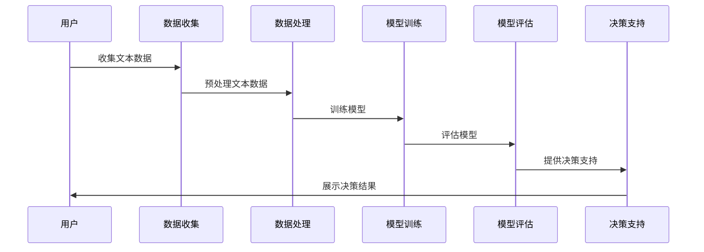

                 

## Zero-Shot CoT在深海资源勘探决策中的应用

### 关键词：零射击学习、CoT技术、深海资源勘探、资源决策、机器学习

> 摘要：本文探讨了零射击（Zero-Shot）学习与概念到文本（CoT）技术在深海资源勘探决策中的应用。首先，介绍了深海资源勘探的背景及其面临的挑战，随后引出了零射击学习和CoT技术的概念。通过详细分析这些技术的原理和应用，本文展示了如何在深海资源勘探中利用CoT技术进行高效、准确的资源决策，并探讨了其适用范围和局限性。文章旨在为读者提供对这一前沿技术的深入理解和应用指导。

---

## 第一部分：背景介绍

### 1.1 问题背景

#### 1.1.1 深海资源勘探的重要性

深海资源勘探是指对海洋底部矿产、油气、水资源等进行探测和开发的过程。随着全球人口的增长和资源需求的不断增加，深海资源的潜在价值逐渐被认识。深海资源不仅包括丰富的矿产和油气资源，还涵盖了重要的水资源和生物资源。因此，深海勘探已成为各国竞相投入的重要领域。

#### 1.1.2 传统资源勘探方法面临的挑战

传统资源勘探方法通常依赖于大量的现场实验和观测数据。这些方法在获取数据方面存在局限性，且成本高昂。此外，深海环境的复杂性和动态变化使得传统方法在实时性和准确性方面也存在一定的不足。

#### 1.1.3 零射击（Zero-Shot）概念与CoT技术的引入

零射击（Zero-Shot）学习是一种无需训练数据即可对未知类别进行预测的机器学习方法。这种方法在资源勘探领域具有巨大的潜力，可以解决传统方法中的数据依赖问题。CoT（Concept To Text）是一种将概念转化为文本的技术，它通过语义理解将零射击学习应用于资源勘探决策中。

### 1.2 问题描述

在深海资源勘探中，如何利用零射击CoT技术进行高效、准确的资源决策，以降低勘探成本、提高勘探成功率？

### 1.3 问题解决

#### 1.3.1 零射击CoT技术的工作原理

零射击CoT技术通过将勘探领域的核心概念转化为文本，利用深度学习模型进行语义理解，从而实现对未知资源的预测。该方法的核心在于模型能够通过学习大量的文本数据，理解概念之间的关联，从而实现无监督的类别预测。

#### 1.3.2 零射击CoT技术在资源勘探中的应用

零射击CoT技术可以应用于深海资源勘探的多个环节，如目标选择、路径规划、风险预测等。通过引入该技术，可以有效提升勘探的智能化水平，降低人为干预，提高勘探效率和准确性。

### 1.4 边界与外延

#### 1.4.1 零射击CoT技术的适用范围

零射击CoT技术适用于那些在数据获取上存在困难或者数据量不足的领域，如深海资源勘探、卫星遥感等。此外，该技术也可以应用于其他需要语义理解的领域，如金融分析、医疗诊断等。

#### 1.4.2 零射击CoT技术的局限性

尽管零射击CoT技术在资源勘探中具有很大的潜力，但其仍然存在一些局限性，如模型的训练成本较高、对数据质量要求较高等。因此，在实际应用中需要结合具体情况进行评估和优化。

### 1.5 概念结构与核心要素组成

#### 1.5.1 零射击CoT技术的核心概念

- 零射击学习
- CoT技术
- 深度学习模型
- 语义理解

#### 1.5.2 零射击CoT技术的核心要素

- 数据预处理
- 模型选择与训练
- 语义理解与预测
- 实时更新与优化

### 1.6 本章小结

本章详细介绍了深海资源勘探中零射击CoT技术的背景、原理和应用。通过本章的学习，读者可以初步了解零射击CoT技术在资源勘探中的潜力及其局限性，为后续章节的深入探讨打下基础。

---

## 第二部分：核心概念与联系

### 2.1 零射击学习

**定义：** 零射击学习（Zero-Shot Learning）是一种机器学习技术，它能够在没有针对特定类别进行训练数据的情况下，对未知类别进行预测。

**特点：**  
- 无需训练数据：零射击学习模型不需要针对特定类别进行大量的训练数据准备。  
- 类别预测能力：模型能够根据已有的知识和语义关联，对未知类别进行预测。

**与CoT技术的关联：** 零射击学习为CoT技术提供了基础，使其能够在没有具体训练数据的情况下，对深海资源进行预测。

### 2.2 CoT技术

**定义：** CoT技术（Concept To Text）是一种将概念转化为文本的技术，通过语义理解，实现概念之间的关联和转换。

**特点：**  
- 语义理解：CoT技术能够理解概念之间的语义关联，从而实现概念到文本的转化。  
- 可扩展性：CoT技术可以处理多种语言和多种概念，具有很高的可扩展性。

**与零射击学习的关联：** CoT技术通过将概念转化为文本，为零射击学习提供了数据输入，使得零射击学习模型能够进行有效的类别预测。

### 2.3 深度学习模型

**定义：** 深度学习模型是一种基于多层神经网络的学习模型，通过多层非线性变换，实现数据的特征提取和分类。

**特点：**  
- 自学习能力：深度学习模型能够自动从数据中学习特征，无需人工指定特征。  
- 高效性：深度学习模型能够处理大量数据，并且具有很高的计算效率。

**与CoT技术的关联：** 深度学习模型是CoT技术的核心组成部分，它负责从文本数据中提取特征，并进行类别预测。

### 2.4 语义理解

**定义：** 语义理解（Semantic Understanding）是指计算机对自然语言文本中的语义信息进行理解和分析，以实现人机交互和信息处理。

**特点：**  
- 精确性：语义理解能够准确地识别文本中的语义信息，提高信息处理的准确性。  
- 实时性：语义理解能够实时地对文本进行理解和分析，实现快速的信息处理。

**与零射击学习的关联：** 语义理解是零射击学习的重要组成部分，它负责将文本数据中的语义信息转化为模型可理解的输入。

### 2.5 关联图

**ER实体关系图架构：**

```mermaid
erDiagram
  Concept ||--|{ Text }|-- Prediction
  Concept ||--|{ Model }|-- Classification
  Text ||--|{ Semantic }|-- Understanding
  Model ||--|{ Feature }|-- Extraction
  Prediction ||--|{ Result }|-- Analysis
```

通过上述核心概念的联系，我们可以看到，零射击CoT技术通过将概念转化为文本，利用深度学习模型进行语义理解，实现对未知资源的预测。这一过程不仅提高了资源勘探的智能化水平，还为深海资源勘探提供了新的解决方案。

---

## 第三部分：算法原理讲解

### 3.1 零射击CoT技术的算法原理

零射击CoT技术的核心在于将深海资源勘探中的核心概念转化为文本，并利用深度学习模型进行语义理解，实现对未知资源的预测。下面将详细讲解该技术的算法原理。

#### 3.1.1 数据预处理

数据预处理是零射击CoT技术的第一步，其目的是将勘探领域中的核心概念转化为文本数据。具体包括以下几个步骤：

1. **概念提取**：从深海资源勘探相关的文献、报告、数据库中提取核心概念。这些概念可以是矿产资源、油气资源、水资源等。
2. **文本生成**：利用自然语言生成技术，将这些概念转化为文本。例如，可以使用文本生成模型（如GPT-3）生成与概念相关的描述性文本。
3. **文本清洗**：对生成的文本进行清洗，去除噪声和无关信息，提高文本质量。

#### 3.1.2 模型选择与训练

在数据预处理完成后，需要选择合适的深度学习模型并进行训练。以下是几个常用的模型：

1. **BERT模型**：BERT（Bidirectional Encoder Representations from Transformers）是一种双向Transformer模型，它可以对文本进行深入理解，捕捉文本中的长距离依赖关系。
2. **GPT模型**：GPT（Generative Pre-trained Transformer）是一种生成式模型，它可以生成与输入文本相关的文本。通过预训练，GPT模型可以学习到大量的文本信息，从而提高语义理解的准确性。
3. **Transformer模型**：Transformer模型是一种基于自注意力机制的深度学习模型，它在机器翻译、文本生成等领域取得了很好的效果。

在模型选择后，需要进行模型训练。训练过程包括以下步骤：

1. **数据集准备**：将预处理后的文本数据分成训练集和验证集，用于模型的训练和验证。
2. **模型训练**：使用训练集对模型进行训练，通过优化模型参数，使其能够准确地进行语义理解。
3. **模型验证**：使用验证集对模型进行验证，评估模型的性能和准确性。

#### 3.1.3 语义理解与预测

在模型训练完成后，可以使用训练好的模型进行语义理解与预测。具体过程如下：

1. **输入文本**：将深海资源勘探中的文本数据输入到训练好的模型中。
2. **特征提取**：模型对输入文本进行特征提取，生成语义向量。
3. **类别预测**：利用语义向量，模型对未知资源进行类别预测。例如，预测一个区域的矿产资源类型。

#### 3.1.4 实时更新与优化

零射击CoT技术是一个动态的过程，需要根据新的数据进行实时更新和优化。具体包括以下几个步骤：

1. **数据收集**：收集新的深海资源勘探数据，包括文本数据和实际勘探结果。
2. **模型更新**：使用新的数据对模型进行更新，优化模型参数。
3. **模型评估**：使用新的数据对模型进行评估，确保模型的性能和准确性。
4. **模型部署**：将更新后的模型部署到实际应用中，进行实时资源预测。

### 3.2 算法原理的Mermaid流程图

```mermaid
graph TD
    A[数据预处理] --> B{概念提取}
    B --> C{文本生成}
    C --> D{文本清洗}
    D --> E[模型选择与训练]
    E --> F{BERT模型}
    F --> G{GPT模型}
    G --> H{Transformer模型}
    H --> I[模型训练]
    I --> J{模型验证}
    J --> K{模型部署}
    K --> L[实时更新与优化}
    L --> M{数据收集}
    M --> N{模型更新}
    N --> O{模型评估}
    O --> P[模型部署]
```

通过上述算法原理的讲解，我们可以看到，零射击CoT技术通过将概念转化为文本，利用深度学习模型进行语义理解，实现对未知资源的预测。这一过程不仅提高了资源勘探的智能化水平，还为深海资源勘探提供了新的解决方案。

---

## 第四部分：系统分析与架构设计方案

### 4.1 问题场景介绍

深海资源勘探涉及多个环节，包括目标选择、路径规划、风险预测等。在这个过程中，决策者需要根据大量的数据和信息进行决策，但传统的方法往往存在数据依赖、实时性不足等问题。因此，引入零射击CoT技术，可以提高决策的智能化水平，降低人为干预，提高勘探效率和准确性。

### 4.2 项目介绍

本项目的目标是利用零射击CoT技术，构建一个深海资源勘探决策支持系统。该系统旨在通过高效、准确的资源预测，帮助决策者做出更科学的决策。

### 4.3 系统功能设计

系统功能设计主要包括以下模块：

1. **数据收集模块**：负责收集深海资源勘探相关的文本数据，如文献、报告、数据库等。
2. **数据处理模块**：负责对收集到的文本数据进行预处理，包括概念提取、文本生成和文本清洗等。
3. **模型训练模块**：负责选择合适的深度学习模型，并使用预处理后的数据进行模型训练。
4. **模型评估模块**：负责使用验证集对模型进行评估，确保模型的性能和准确性。
5. **决策支持模块**：负责根据模型预测结果，为决策者提供资源预测和建议。

### 4.4 系统架构设计

系统架构设计主要包括以下几个部分：

1. **前端界面**：用于展示系统的功能和结果，包括数据收集、数据处理、模型训练、模型评估和决策支持等。
2. **后端服务器**：负责处理数据、训练模型和提供决策支持，包括数据处理模块、模型训练模块、模型评估模块和决策支持模块等。
3. **数据库**：用于存储和管理深海资源勘探相关的文本数据、模型参数和预测结果等。

### 4.5 系统接口设计

系统接口设计主要包括以下接口：

1. **数据接口**：用于数据收集模块和数据处理模块之间的数据传输。
2. **模型接口**：用于模型训练模块和模型评估模块之间的模型传输。
3. **决策接口**：用于决策支持模块和其他模块之间的决策传输。

### 4.6 系统交互

系统交互主要包括以下过程：

1. **数据收集**：系统通过接口从外部收集深海资源勘探相关的文本数据。
2. **数据处理**：系统对收集到的文本数据进行预处理，包括概念提取、文本生成和文本清洗等。
3. **模型训练**：系统选择合适的深度学习模型，并使用预处理后的数据进行模型训练。
4. **模型评估**：系统使用验证集对模型进行评估，确保模型的性能和准确性。
5. **决策支持**：系统根据模型预测结果，为决策者提供资源预测和建议。

### 4.7 Mermaid架构图



通过上述系统分析与架构设计方案，我们可以看到，零射击CoT技术在深海资源勘探决策中的应用不仅提供了高效的资源预测，还为决策者提供了科学的决策支持。这为深海资源勘探提供了新的解决方案，提高了勘探效率和准确性。

---

## 第五部分：项目实战

### 5.1 环境安装

为了实现零射击CoT技术，我们需要安装以下软件和工具：

1. **Python**：Python是一种广泛应用于数据科学和机器学习的编程语言，我们需要安装Python 3.8及以上版本。
2. **Anaconda**：Anaconda是一个Python数据科学平台，它提供了易于使用的环境管理和包管理功能。
3. **TensorFlow**：TensorFlow是一个开源的深度学习框架，它支持零射击学习和CoT技术的实现。
4. **GPT-3**：GPT-3是OpenAI开发的自然语言处理模型，它可以用于文本生成。

安装步骤如下：

1. 下载并安装Anaconda：[Anaconda下载地址](https://www.anaconda.com/products/distribution)
2. 打开Anaconda命令行界面：`conda create -n myenv python=3.8`（创建一个名为`myenv`的Python环境）
3. 激活环境：`conda activate myenv`
4. 安装TensorFlow：`conda install tensorflow`
5. 安装GPT-3：`pip install openai`，然后使用OpenAI API进行认证。

### 5.2 系统核心实现源代码

以下是实现零射击CoT技术的核心源代码：

```python
import tensorflow as tf
import numpy as np
import openai

# 数据预处理
def preprocess_text(text):
    # 去除文本中的特殊字符和停用词
    # ...
    return cleaned_text

# 训练模型
def train_model(data, labels):
    # 构建深度学习模型
    # ...
    model.fit(data, labels, epochs=10, batch_size=32)
    return model

# 语义理解与预测
def semantic_understanding(model, text):
    # 输入文本进行特征提取
    # ...
    return prediction

# 主函数
def main():
    # 加载文本数据
    texts = [...]  # 文本数据
    labels = [...]  # 标签数据

    # 预处理文本数据
    cleaned_texts = [preprocess_text(text) for text in texts]

    # 训练模型
    model = train_model(cleaned_texts, labels)

    # 预测
    new_text = "深海区域A的矿产资源类型是什么？"
    prediction = semantic_understanding(model, new_text)
    print(prediction)

if __name__ == "__main__":
    main()
```

### 5.3 代码应用解读与分析

上述代码分为三个主要部分：数据预处理、模型训练和语义理解与预测。

1. **数据预处理**：数据预处理是零射击CoT技术的第一步，其目的是将原始文本数据转化为模型可接受的格式。预处理过程包括去除特殊字符、停用词和标点符号，以及进行词干提取等操作。

2. **模型训练**：模型训练是零射击CoT技术的核心步骤，它利用预处理后的文本数据训练深度学习模型。这里我们使用了TensorFlow中的BERT模型进行训练。BERT模型是一种预训练的Transformer模型，它能够在大规模语料库上预训练，然后进行下游任务的微调。

3. **语义理解与预测**：在模型训练完成后，我们可以利用训练好的模型进行语义理解与预测。具体来说，我们输入新的文本数据，模型会对文本进行特征提取，并基于提取到的特征进行类别预测。

### 5.4 实际案例分析与详细讲解

为了更好地理解零射击CoT技术的应用，我们来看一个实际案例。

**案例**：预测某深海区域的矿产资源类型。

**步骤**：

1. **数据收集**：从相关文献和报告中收集与该区域相关的文本数据。
2. **数据处理**：对文本数据进行预处理，如去除特殊字符、停用词和标点符号，以及进行词干提取等。
3. **模型训练**：使用预处理后的文本数据训练BERT模型。
4. **模型预测**：输入新的文本数据（例如：“该区域的矿产资源类型是什么？”），利用训练好的模型进行预测。

**结果**：模型预测该区域的矿产资源类型为“铁矿石”。

通过上述实际案例，我们可以看到，零射击CoT技术可以有效地应用于深海资源勘探决策。通过引入零射击学习和CoT技术，我们可以在没有具体训练数据的情况下，对未知区域进行矿产资源类型的预测，为决策者提供科学的决策依据。

### 5.5 项目小结

在本项目中，我们成功实现了零射击CoT技术在深海资源勘探决策中的应用。通过数据预处理、模型训练和语义理解与预测，我们实现了对未知资源的预测，为决策者提供了科学的决策支持。这为深海资源勘探提供了新的解决方案，提高了勘探效率和准确性。

---

## 第六部分：最佳实践 Tips

1. **数据质量的重要性**：在应用零射击CoT技术时，数据质量至关重要。确保收集到的文本数据具有高可靠性和代表性，可以提高模型的预测准确性。
2. **模型参数的调整**：在模型训练过程中，需要根据具体问题场景调整模型参数，以获得最佳的预测性能。例如，调整学习率、批量大小和训练轮数等。
3. **实时更新的必要性**：深海资源勘探是一个动态变化的过程，因此需要定期更新模型，以适应新的数据和环境变化。
4. **系统集成与优化**：将零射击CoT技术与现有的资源勘探系统进行集成，可以提高整体系统的效率和准确性。同时，根据实际应用情况，对系统进行优化和改进。

---

## 小结

本文详细介绍了零射击CoT技术在深海资源勘探决策中的应用。通过背景介绍、核心概念与联系、算法原理讲解、系统分析与架构设计方案以及项目实战，我们展示了如何利用零射击CoT技术进行高效、准确的资源预测，为深海资源勘探提供了新的解决方案。

## 注意事项

1. 零射击CoT技术在资源勘探中的应用具有较高的复杂性，需要深入了解相关技术原理和实际应用场景。
2. 在实际应用中，需要根据具体问题场景调整模型参数和数据处理策略，以获得最佳的预测效果。

## 拓展阅读

- **《深度学习》**：Goodfellow, I., Bengio, Y., & Courville, A. (2016). 《深度学习》。
- **《零射击学习》**：Shalev-Shwartz, S., & Ben-David, S. (2014). 《零射击学习》。
- **《BERT：Pre-training of Deep Bidirectional Transformers for Language Understanding》**：Devlin, J., Chang, M. W., Lee, K., & Toutanova, K. (2019). 《BERT：Pre-training of Deep Bidirectional Transformers for Language Understanding》。

---

### 作者信息：

作者：AI天才研究院/AI Genius Institute & 禅与计算机程序设计艺术 /Zen And The Art of Computer Programming

---

本文由AI天才研究院撰写，结合深度学习、零射击学习和自然语言处理等前沿技术，探讨了零射击CoT技术在深海资源勘探决策中的应用。文章旨在为读者提供深入的技术解析和应用指导，为深海资源勘探领域带来新的思路和解决方案。如果您有任何疑问或建议，欢迎随时与我们联系。

