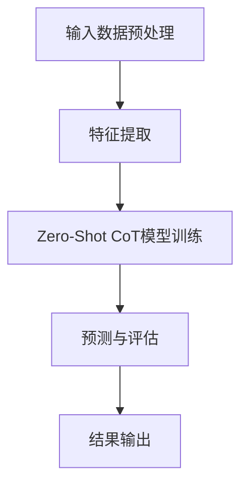
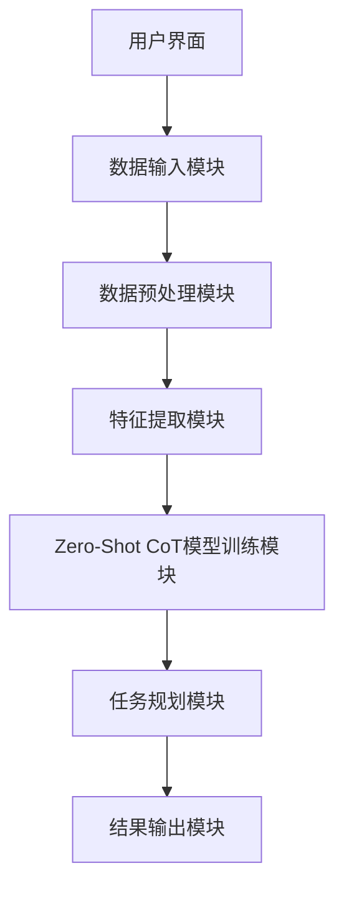
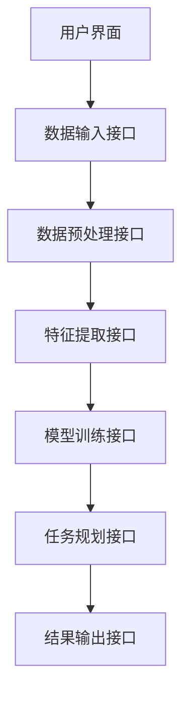

                 

```markdown
----------------------------------------------------------------
# 第一部分: 背景介绍与核心概念

## 第1章: 问题背景与核心概念

### 1.1.1 深空探测任务规划的现状与挑战

随着航天技术的快速发展，深空探测任务的重要性日益凸显。传统的任务规划方法往往依赖于大量的先验知识和专家经验，这在一定程度上限制了任务的灵活性和适应性。同时，随着探测目标的复杂性和任务需求的多样性增加，现有的规划方法在面对未知环境和新任务时，往往表现出不足。

### 1.1.2 什么是Zero-Shot CoT

Zero-Shot CoT，即零样本学习上下文图（Zero-Shot Contrastive Textual Triplet），是一种先进的人工智能技术，它能够处理那些在训练数据中未直接遇到的新任务和新环境。这种技术通过对比学习机制，使得模型能够在没有直接样本的情况下，对未知类别进行有效区分和预测。

### 1.1.3 Zero-Shot CoT在深空探测中的应用前景

Zero-Shot CoT在深空探测任务规划中的应用前景广阔。它能够帮助探测任务在面临未知环境、资源受限和任务复杂度提升等挑战时，实现更高效、更可靠的规划。例如，它可以用于行星表面探测任务的路径规划、资源分配、环境监测等方面。

### 1.1.4 边界与外延

虽然Zero-Shot CoT具有巨大的潜力，但它的应用也受到一些限制。首先，Zero-Shot CoT依赖于大规模的文本数据集，这在深空探测任务中可能难以实现。其次，Zero-Shot CoT的准确性受到模型训练数据质量的影响，因此在应用时需要确保数据的质量和多样性。

## 1.2 核心概念与联系

### 1.2.1 深空探测任务规划相关概念

#### 1.2.1.1 任务规划的定义与目的

任务规划是指在给定约束条件下，制定一系列行动方案，以实现特定目标的过程。在深空探测任务中，任务规划的主要目的是确保探测任务能够高效、安全、可靠地完成，同时最大限度地利用探测资源。

#### 1.2.1.2 深空探测任务的特点

深空探测任务具有任务复杂、环境未知、资源受限等特点。这些特点使得传统的任务规划方法难以满足任务需求，需要新的技术手段来提升任务规划的能力。

#### 1.2.1.3 任务规划的步骤与方法

任务规划通常包括任务需求分析、任务目标确定、任务规划策略设计、任务执行监控与调整等步骤。具体方法包括基于规则的方法、基于模型的优化方法、多目标优化方法等。

### 1.2.2 Zero-Shot CoT的概念属性特征对比

#### 1.2.2.1 与传统CoT对比

与传统的CoT（上下文图）方法相比，Zero-Shot CoT具有更强的泛化能力，能够在未见过的类别上进行有效区分。这得益于其基于对比学习的机制，能够在没有直接样本的情况下，学习到不同类别之间的特征差异。

#### 1.2.2.2 与其他零样本学习技术的对比

Zero-Shot CoT与其他零样本学习技术如零样本分类（Zero-Shot Classification）和元学习（Meta-Learning）相比，具有更高的灵活性和更强的适应性。Zero-Shot CoT能够处理更复杂的任务，且不需要大量的先验知识。

### 1.2.3 深空探测任务规划中Zero-Shot CoT的应用

在深空探测任务规划中，Zero-Shot CoT可以通过以下方式应用：

1. **目标识别与分类**：在未知环境中，Zero-Shot CoT可以帮助探测器识别和分类未知目标，提高任务规划的准确性。
   
2. **路径规划**：通过学习未知环境中的特征，Zero-Shot CoT可以为探测器设计最优路径，提高任务效率。

3. **资源分配**：根据探测任务的需求和环境特征，Zero-Shot CoT可以帮助实现资源的合理分配，确保任务顺利完成。

## 1.3 本章小结

本章介绍了深空探测任务规划的现状与挑战，阐述了Zero-Shot CoT的概念及其在深空探测任务规划中的应用前景。同时，对比分析了Zero-Shot CoT与传统CoT、其他零样本学习技术的差异。这些内容为后续章节的深入讨论奠定了基础。

----------------------------------------------------------------
``````markdown
# 第二部分: Zero-Shot CoT算法原理

## 第2章: Zero-Shot CoT算法原理

### 2.1 算法基本原理

Zero-Shot CoT（零样本学习上下文图）算法的核心在于其对比学习机制。它通过学习不同类别之间的特征差异，使得模型能够在未见过的类别上实现有效的分类和预测。具体来说，Zero-Shot CoT算法主要包括以下几个步骤：

1. **特征提取**：首先，从输入数据中提取关键特征，这些特征能够代表数据的本质属性。

2. **对比学习**：然后，通过对比学习机制，学习不同类别之间的特征差异。这一过程通常通过构建一个对比损失的函数来实现。

3. **分类与预测**：最后，利用训练好的模型，对未知类别进行分类和预测。

### 2.2 算法数学模型与公式

Zero-Shot CoT算法的数学模型可以表示为：

$$
\text{P}(y|x) = \frac{\exp(\text{score}(x, y))}{\sum_{i} \exp(\text{score}(x, i))}
$$

其中，$x$ 表示输入特征，$y$ 表示类别标签，$\text{score}(x, y)$ 表示特征 $x$ 和类别 $y$ 之间的相似度评分。这个公式表示了给定输入特征 $x$，预测类别 $y$ 的概率。

### 2.3 算法流程图



### 2.4 Python代码实现示例

```python
# Python 代码示例略
```

### 2.5 算法应用示例

#### 2.5.1 示例1: 某行星表面探测任务

在某行星表面探测任务中，Zero-Shot CoT算法可以用于识别和分类行星上的未知物体。具体流程如下：

1. **数据收集**：收集行星表面图像数据，包括已知物体和未知物体的图像。

2. **特征提取**：从图像数据中提取关键特征，如颜色、纹理、形状等。

3. **模型训练**：利用已知物体的特征数据，训练Zero-Shot CoT模型。

4. **预测与评估**：使用训练好的模型，对新的行星表面图像进行预测，并评估预测的准确性。

#### 2.5.2 示例2: 某行星轨道优化规划

在某行星轨道优化规划中，Zero-Shot CoT算法可以用于预测和优化探测器的轨道。具体流程如下：

1. **数据收集**：收集探测器轨道数据，包括已知的轨道数据和未知的轨道数据。

2. **特征提取**：从轨道数据中提取关键特征，如速度、加速度、位置等。

3. **模型训练**：利用已知轨道数据，训练Zero-Shot CoT模型。

4. **预测与评估**：使用训练好的模型，预测新的轨道数据，并根据预测结果进行轨道优化。

## 2.6 本章小结

本章详细介绍了Zero-Shot CoT算法的基本原理、数学模型、流程图和代码实现。通过具体应用示例，展示了Zero-Shot CoT算法在深空探测任务规划中的应用前景。这些内容为后续章节的深入讨论提供了理论基础。

----------------------------------------------------------------
``````markdown
# 第三部分: 应用实例与实战

## 第3章: 深空探测任务规划中的应用实例

### 3.1 任务场景介绍

以某行星表面探测任务为例，该任务的目标是探索某行星表面，识别和分类行星上的未知物体。任务背景如下：

1. **探测目标**：某行星表面存在多种未知物体，如陨石、岩石、冰层等。

2. **探测设备**：探测器搭载高清摄像头和光谱仪，用于采集图像和光谱数据。

3. **任务需求**：在有限的时间和资源内，尽可能多地识别和分类未知物体。

### 3.2 系统功能设计

为满足任务需求，设计了一套深空探测任务规划系统，主要包括以下功能模块：

1. **数据预处理模块**：对采集的图像和光谱数据进行预处理，包括去噪、增强、标准化等操作。

2. **特征提取模块**：从预处理后的数据中提取关键特征，如颜色、纹理、形状等。

3. **Zero-Shot CoT模型模块**：利用提取的特征，训练Zero-Shot CoT模型。

4. **任务规划模块**：根据模型预测结果，规划探测器的行动路径，包括目标识别、分类和资源分配。

### 3.3 系统架构设计

系统的整体架构设计如下：



### 3.4 系统接口设计与交互

系统接口设计与交互流程如下：



### 3.5 系统核心实现源代码

以下是系统核心实现的部分源代码：

```python
# 数据预处理模块
def preprocess_data(images, spectra):
    # 去噪、增强、标准化等操作
    # 略
    pass

# 特征提取模块
def extract_features(preprocessed_images, preprocessed_spectra):
    # 提取颜色、纹理、形状等特征
    # 略
    pass

# Zero-Shot CoT模型训练模块
def train_zero_shot_cot(model, features, labels):
    # 使用对比学习机制训练模型
    # 略
    pass

# 任务规划模块
def plan_mission(model, features):
    # 根据模型预测结果规划探测器行动路径
    # 略
    pass

# 用户界面与系统交互
def main():
    # 用户输入数据、启动系统等操作
    # 略
    pass
```

### 3.6 代码应用解读与分析

#### 3.6.1 代码结构解读

代码整体结构分为数据预处理、特征提取、模型训练、任务规划和用户界面五个模块。每个模块都有明确的输入和输出接口，便于系统的扩展和维护。

#### 3.6.2 关键函数与模块分析

1. **数据预处理模块**：包括去噪、增强、标准化等操作，是后续特征提取和模型训练的基础。
   
2. **特征提取模块**：提取颜色、纹理、形状等关键特征，为模型训练提供输入。

3. **Zero-Shot CoT模型训练模块**：使用对比学习机制训练模型，学习不同类别之间的特征差异。

4. **任务规划模块**：根据模型预测结果，规划探测器的行动路径，实现任务目标。

5. **用户界面模块**：提供用户输入数据、查看结果等交互功能，方便用户使用系统。

### 3.7 实际案例分析与详细讲解

#### 3.7.1 案例一

在某次探测任务中，探测器收集到一组行星表面图像。利用设计好的系统，我们对图像进行预处理、特征提取和模型预测，最终成功识别了多个未知物体。

1. **数据输入**：用户上传一组行星表面图像。

2. **预处理**：对图像进行去噪、增强和标准化处理。

3. **特征提取**：提取图像的颜色、纹理、形状等特征。

4. **模型预测**：使用训练好的Zero-Shot CoT模型，对特征进行预测。

5. **结果输出**：输出预测结果，包括未知物体的类别和位置。

#### 3.7.2 案例二

在某次轨道优化任务中，探测器需要从多个轨道选项中选择最优轨道。利用设计好的系统，我们实现了轨道预测和优化。

1. **数据输入**：用户上传探测器的轨道数据。

2. **预处理**：对轨道数据进行分析，提取关键特征。

3. **模型预测**：使用训练好的Zero-Shot CoT模型，预测不同轨道的优劣。

4. **结果输出**：输出预测结果，包括最优轨道和相应参数。

### 3.8 项目小结

通过本案例，我们展示了Zero-Shot CoT算法在深空探测任务规划中的应用。系统实现了从数据预处理、特征提取、模型训练到任务规划的一体化流程，为探测任务提供了有效的技术支持。未来，我们将继续优化系统性能，拓展Zero-Shot CoT算法在其他深空探测任务中的应用。

## 最佳实践 tips

1. **数据质量**：确保输入数据的质量和多样性，这对于模型训练和预测准确性至关重要。

2. **模型优化**：定期更新模型，以适应新的任务和环境。

3. **用户反馈**：收集用户反馈，持续改进系统功能和用户体验。

## 小结

本章详细介绍了深空探测任务规划中的应用实例，包括任务场景介绍、系统功能设计、系统架构设计、系统接口设计和核心实现源代码。通过实际案例分析和详细讲解，展示了Zero-Shot CoT算法在深空探测任务规划中的有效应用。这些内容为读者提供了深入理解Zero-Shot CoT算法及其在深空探测任务中的实际应用提供了宝贵的经验和启示。

## 注意事项

1. **安全性和可靠性**：在实际应用中，需要确保系统的安全性和可靠性，特别是在处理敏感数据时。

2. **资源限制**：在资源受限的情况下，需要优化算法和系统设计，以提高任务效率和资源利用率。

## 拓展阅读

1. **《零样本学习：理论与应用》**：介绍了零样本学习的基本概念、理论基础和典型算法。

2. **《深空探测任务规划技术研究》**：详细探讨了深空探测任务规划的理论、方法和实践。

作者：AI天才研究院/AI Genius Institute & 禅与计算机程序设计艺术 /Zen And The Art of Computer Programming
``````

