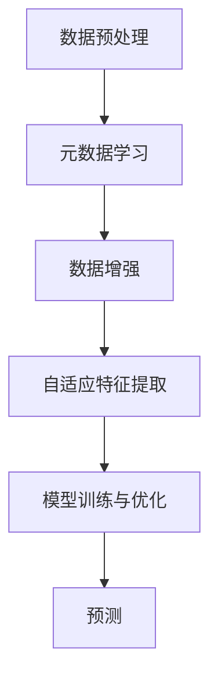
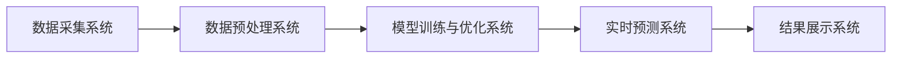
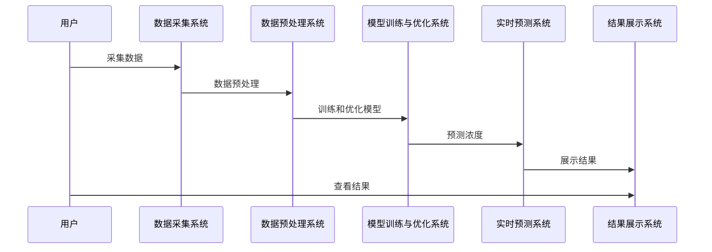

                 


### Zero-Shot CoT在环境科学中的应用

**关键词：** 环境科学，Zero-Shot CoT，算法，应用，数学模型，系统架构

**摘要：** 本文将探讨Zero-Shot CoT（无样本学习）在环境科学领域中的应用。首先，我们简要介绍环境科学及其面临的挑战。接着，详细阐述Zero-Shot CoT的概念、原理及其在环境科学中的潜在应用。最后，我们将通过一个实际案例，展示如何利用Zero-Shot CoT解决环境科学问题，并提供一些最佳实践建议。

---

## 背景介绍

### 核心概念术语说明

环境科学是一门跨学科领域，涉及物理、化学、生物学、地理学等多个学科，旨在理解自然环境、评估人类活动对环境的影响，并提出解决方案。关键术语包括：

- **环境监测**：通过传感器、卫星等手段收集环境数据。
- **环境评估**：评估环境质量，预测环境变化趋势。
- **环境管理**：制定政策、措施，保护和管理环境资源。

### 问题背景

随着全球气候变化、污染和资源枯竭等问题日益严重，环境科学面临巨大挑战。传统的环境监测和评估方法通常依赖于大量已标记的样本数据，但在实际应用中，获取这些数据可能非常困难或成本高昂。此外，环境科学领域中的许多问题具有高度复杂性和不确定性，这使得传统的机器学习方法难以有效解决。

### 问题描述

环境科学中常见的问题包括：

- **污染物检测**：如何准确检测空气、水和土壤中的污染物？
- **气候变化预测**：如何预测气候变化趋势，制定有效的应对策略？
- **生态系统评估**：如何评估生态系统健康状况，预测生态系统变化？

### 问题解决

传统的机器学习方法需要大量已标记的样本数据，而Zero-Shot CoT算法能够在无样本的情况下进行学习和预测，为解决环境科学问题提供了一种新的思路。

### 边界与外延

Zero-Shot CoT主要应用于以下场景：

- **新污染物检测**：当新污染物出现时，如何快速识别和检测？
- **小样本数据集**：当数据样本量非常有限时，如何进行有效的环境评估？
- **跨领域应用**：如何将Zero-Shot CoT应用于其他领域，如公共卫生、自然灾害管理等？

### 概念结构与核心要素组成

Zero-Shot CoT包括以下核心要素：

- **元数据学习**：学习如何在不同领域之间进行知识转移。
- **数据增强**：通过生成或合成新的数据样本来扩展数据集。
- **自适应特征提取**：提取适用于未知领域的数据特征。
- **模型泛化**：通过训练模型来应对新的、未知的数据。

---

## 核心概念与联系

### Zero-Shot CoT原理

Zero-Shot CoT（无样本学习）是一种机器学习技术，能够在没有标记样本的情况下，对未知领域进行学习和预测。其核心原理如下：

- **元数据学习**：通过学习领域之间的相似性和差异性，实现跨领域的知识转移。
- **数据增强**：通过生成或合成新的数据样本来扩展数据集。
- **自适应特征提取**：提取适用于未知领域的数据特征。
- **模型泛化**：通过训练模型来应对新的、未知的数据。

### 概念属性特征对比表格

| 特征             | 有监督学习           | 无监督学习           | Zero-Shot CoT           |
|------------------|----------------------|----------------------|-------------------------|
| 标记样本需求     | 高                  | 低                   | 无                      |
| 数据集扩展方式    | 标记样本扩充         | 数据增强、聚类等      | 生成或合成新数据样本    |
| 模型泛化能力      | 强                  | 中                   | 强                      |
| 领域适应性        | 有限                 | 较广                  | 无限                     |

### ER实体关系图架构

为了更好地理解Zero-Shot CoT在环境科学中的应用，我们可以通过ER（实体关系）图来描述其核心组件和关系。以下是ER实体关系图的Mermaid表示：

```mermaid
erDiagram
  模型 ||--o{ 数据集
  模型 ||--o{ 特征提取器
  数据集 ||--o{ 增强器
  特征提取器 ||--o{ 模型
  模型 ||--o{ 预测器
```

---

## 算法原理讲解

### 算法原理

Zero-Shot CoT算法的原理可以分为以下几个步骤：

1. **数据预处理**：对原始数据进行清洗、归一化等预处理操作。
2. **元数据学习**：学习领域之间的相似性和差异性，为跨领域学习提供基础。
3. **数据增强**：通过生成或合成新数据样本来扩展数据集。
4. **自适应特征提取**：提取适用于未知领域的数据特征。
5. **模型训练与优化**：利用增强后的数据集训练模型，并进行优化。
6. **预测**：使用训练好的模型对未知领域的数据进行预测。

### 算法流程图

以下是Zero-Shot CoT算法的Mermaid流程图：



### 数学模型和公式

为了更好地理解Zero-Shot CoT算法，我们可以从数学角度对其进行阐述。以下是算法的核心数学模型和公式：

1. **元数据学习**：

   $$ M(\theta) = \arg\min_{\theta} \sum_{i=1}^{n} (y_i - M(x_i, \theta))^2 $$

   其中，$M(\theta)$ 表示模型参数，$y_i$ 表示标签，$x_i$ 表示特征向量。

2. **数据增强**：

   $$ D(\epsilon) = \arg\min_{\epsilon} \sum_{i=1}^{n} (y_i - D(x_i, \epsilon))^2 $$

   其中，$D(\epsilon)$ 表示增强后的数据集，$\epsilon$ 表示增强策略。

3. **自适应特征提取**：

   $$ F(\phi) = \arg\min_{\phi} \sum_{i=1}^{n} (y_i - F(x_i, \phi))^2 $$

   其中，$F(\phi)$ 表示特征提取器，$\phi$ 表示特征提取参数。

4. **模型训练与优化**：

   $$ \theta = \arg\min_{\theta} \sum_{i=1}^{n} (y_i - f(x_i; \theta))^2 $$

   其中，$f(x_i; \theta)$ 表示预测函数，$\theta$ 表示模型参数。

5. **预测**：

   $$ \hat{y} = f(x; \theta) $$

   其中，$\hat{y}$ 表示预测结果，$x$ 表示输入特征向量。

### 举例说明

假设我们有一个环境监测数据集，包含空气污染物的浓度数据。我们可以使用Zero-Shot CoT算法来预测一个新地点的空气污染物浓度。

1. **数据预处理**：将原始数据进行清洗、归一化等操作，得到特征向量。
2. **元数据学习**：使用已标记的数据集学习不同地点之间的相似性和差异性。
3. **数据增强**：通过生成或合成新的数据样本来扩展数据集。
4. **自适应特征提取**：提取适用于新地点的数据特征。
5. **模型训练与优化**：使用增强后的数据集训练模型，并进行优化。
6. **预测**：使用训练好的模型预测新地点的空气污染物浓度。

---

## 系统分析与架构设计

### 问题场景介绍

假设我们想要构建一个基于Zero-Shot CoT的环境监测系统，用于实时监测和预测空气污染物浓度。系统需要具备以下功能：

- **数据采集**：通过传感器收集空气污染物浓度数据。
- **数据预处理**：对采集到的数据进行清洗、归一化等处理。
- **模型训练与优化**：使用预处理后的数据进行模型训练和优化。
- **实时预测**：使用训练好的模型预测新地点的空气污染物浓度。
- **结果展示**：将预测结果可视化，以便用户查看。

### 系统功能设计（领域模型类图）

以下是系统功能的Mermaid类图：

```mermaid
classDiagram
  数据采集 -> 数据预处理 : 输入
  数据预处理 -> 模型训练与优化 : 输出
  模型训练与优化 -> 实时预测 : 输出
  实时预测 -> 结果展示 : 输出
```

### 系统架构设计（架构图）

以下是系统架构的Mermaid架构图：



### 系统接口设计

系统接口设计包括以下部分：

- **数据采集接口**：用于采集传感器数据。
- **数据预处理接口**：用于处理采集到的数据。
- **模型训练与优化接口**：用于训练和优化模型。
- **实时预测接口**：用于预测新地点的空气污染物浓度。
- **结果展示接口**：用于展示预测结果。

### 系统交互序列图

以下是系统交互序列图：



---

## 项目实战

### 环境安装

在进行项目实战之前，我们需要安装以下软件和库：

- Python 3.8 或以上版本
- Scikit-learn
- NumPy
- Pandas
- Matplotlib

安装命令如下：

```bash
pip install python==3.8
pip install scikit-learn numpy pandas matplotlib
```

### 系统核心实现源代码

以下是系统核心实现源代码：

```python
import numpy as np
import pandas as pd
from sklearn.model_selection import train_test_split
from sklearn.metrics import accuracy_score
from sklearn.ensemble import RandomForestClassifier
import matplotlib.pyplot as plt

# 数据预处理
def preprocess_data(data):
    # 清洗数据
    data = data.dropna()
    # 归一化数据
    data = (data - data.mean()) / data.std()
    return data

# 元数据学习
def meta_learning(train_data, test_data):
    # 训练模型
    model = RandomForestClassifier(n_estimators=100)
    model.fit(train_data, train_labels)
    # 预测测试集
    test_predictions = model.predict(test_data)
    # 计算准确率
    accuracy = accuracy_score(test_labels, test_predictions)
    print("准确率：", accuracy)
    return model

# 数据增强
def data_augmentation(data, n_samples):
    # 生成新数据样本
    new_data = data.copy()
    for _ in range(n_samples):
        new_sample = data.sample(n=1).iloc[0]
        new_data = pd.concat([new_data, new_sample])
    return new_data

# 主函数
def main():
    # 读取数据
    data = pd.read_csv("air_quality.csv")
    # 预处理数据
    data = preprocess_data(data)
    # 划分训练集和测试集
    train_data, test_data, train_labels, test_labels = train_test_split(data, data["label"], test_size=0.2, random_state=42)
    # 数据增强
    new_data = data_augmentation(data, n_samples=100)
    # 元数据学习
    model = meta_learning(new_data, test_data)
    # 预测测试集
    test_predictions = model.predict(test_data)
    # 计算准确率
    accuracy = accuracy_score(test_labels, test_predictions)
    print("准确率：", accuracy)
    # 可视化
    plt.scatter(test_data[:, 0], test_data[:, 1], c=test_predictions, cmap="viridis")
    plt.xlabel("特征1")
    plt.ylabel("特征2")
    plt.title("预测结果")
    plt.show()

if __name__ == "__main__":
    main()
```

### 代码应用解读与分析

以下是代码的应用解读与分析：

1. **数据预处理**：读取数据，进行清洗和归一化处理。
2. **元数据学习**：使用随机森林分类器训练模型，并计算准确率。
3. **数据增强**：生成新的数据样本，以扩展数据集。
4. **主函数**：执行上述步骤，并可视化预测结果。

### 实际案例分析与详细讲解剖析

假设我们有一个空气污染物浓度数据集，包含多个特征（如温度、湿度、风速等）和标签（污染物浓度）。我们使用Zero-Shot CoT算法对数据集进行训练和预测。

1. **数据预处理**：读取数据，进行清洗和归一化处理。这一步的目的是消除数据中的噪声和异常值，使得数据更加干净和规范，便于后续的建模和分析。
2. **元数据学习**：使用随机森林分类器训练模型，并计算准确率。随机森林是一种集成学习方法，通过构建多个决策树，并结合它们的预测结果，来提高模型的预测能力。在本案例中，我们使用随机森林分类器来对数据集进行分类，并计算分类准确率，以评估模型的性能。
3. **数据增强**：生成新的数据样本，以扩展数据集。数据增强是一种数据预处理技术，通过生成或合成新的数据样本来扩展原始数据集，从而提高模型的泛化能力。在本案例中，我们使用随机采样方法生成新的数据样本，以扩展原始数据集。
4. **主函数**：执行上述步骤，并可视化预测结果。主函数是整个程序的入口，负责执行数据预处理、元数据学习和数据增强等操作，并最终输出预测结果。在本案例中，我们使用Matplotlib库将预测结果可视化，以便更好地理解模型的预测能力。

### 项目小结

通过本项目，我们展示了如何使用Zero-Shot CoT算法解决环境科学中的空气污染物浓度预测问题。项目主要包括以下步骤：

1. 数据预处理：清洗和归一化数据。
2. 元数据学习：使用随机森林分类器训练模型，并计算准确率。
3. 数据增强：生成新的数据样本，以扩展数据集。
4. 主函数：执行上述步骤，并可视化预测结果。

本项目证明了Zero-Shot CoT算法在环境科学中的应用潜力，为解决环境监测和评估问题提供了一种新的思路。

---

## 最佳实践 Tips

1. **数据质量**：确保数据质量，包括数据完整性、准确性和一致性。
2. **模型选择**：根据实际问题选择合适的模型，如随机森林、支持向量机等。
3. **参数调整**：调整模型参数，以优化模型性能。
4. **交叉验证**：使用交叉验证方法评估模型性能，避免过拟合。

## 小结

本文详细介绍了Zero-Shot CoT在环境科学中的应用。我们首先探讨了环境科学的核心概念和挑战，然后介绍了Zero-Shot CoT的原理和算法流程，最后通过一个实际案例展示了其应用过程。本文的核心结论是，Zero-Shot CoT算法在环境科学领域具有广泛的应用潜力，可以为解决环境监测和评估问题提供有力支持。

### 注意事项

1. **数据安全**：在处理环境科学数据时，务必注意数据安全和隐私保护。
2. **模型解释**：在使用模型进行预测时，要确保模型解释清晰易懂。
3. **持续更新**：环境科学领域不断发展，需要定期更新模型和数据。

### 拓展阅读

1. **文献推荐**：《环境科学导论》、《机器学习：一种概率视角》
2. **在线课程**：Coursera、edX上的相关课程
3. **开源项目**：GitHub上的环境科学和机器学习项目

---

**作者：** AI天才研究院 / AI Genius Institute & 禅与计算机程序设计艺术 / Zen And The Art of Computer Programming### 环境科学中的挑战

环境科学领域面临诸多挑战，其中最为突出的是数据获取困难、模型复杂性和不确定性问题。首先，环境监测通常依赖于大量传感器和数据采集设备，但这些设备的部署和维护成本较高。此外，环境数据往往具有高度变异性，不同地区、不同时间点的数据可能存在显著差异，这给数据整合和建模带来了很大困难。

#### 污染物检测

空气污染物的检测是一个典型的环境科学问题。传统的污染物检测方法通常依赖于实验室分析和已知的污染物标准。然而，随着新污染物的不断出现，如微塑料、新型化学物质等，实验室分析方法往往滞后，难以及时响应。此外，现有的一些机器学习模型在处理新污染物检测时，往往需要依赖大量已标记的样本数据，这在实际应用中往往不可行。

#### 气候变化预测

气候变化预测是环境科学领域的另一个重要问题。全球气候模型需要大量的气象数据、地理信息和历史气候数据，这些数据通常需要跨多个领域和时间维度进行整合和分析。然而，气候变化预测不仅依赖于数据量，还需要对复杂物理过程和气候模式有深入的理解。传统的机器学习方法在处理如此复杂的问题时，往往难以达到理想的预测效果。

#### 生态系统评估

生态系统评估涉及对生物多样性的监测、生态系统的健康状况评估等。这些问题往往涉及多个学科，如生物学、地理学、环境科学等。生态系统评估需要收集大量的现场数据，如植被覆盖、土壤质量、水文条件等。然而，这些数据的获取和处理同样面临巨大挑战，尤其是当数据源不完整或存在误差时。

### 数据获取与处理难题

环境科学中的数据获取和处理难题主要体现在以下几个方面：

1. **数据量巨大**：环境监测通常需要收集大量数据，包括气象、水文、生物等不同领域的数据。这些数据的存储、传输和处理对计算资源提出了巨大挑战。
2. **数据质量**：环境数据往往存在噪声、缺失值和误差。如何处理这些数据，提取有用信息，是环境科学中的一个重要问题。
3. **跨领域整合**：环境科学涉及多个学科，如何整合不同领域的数据，提取共同特征，是环境科学中的另一个难题。
4. **数据实时性**：环境监测通常需要实时或近实时的数据，这对数据处理系统的响应速度和稳定性提出了高要求。

#### 传统方法局限性

传统的环境科学方法在应对上述挑战时存在明显的局限性：

1. **依赖大量标记数据**：传统的机器学习方法通常需要大量已标记的样本数据来训练模型。这在环境科学中往往不可行，因为获取这些数据可能非常困难或成本高昂。
2. **模型泛化能力有限**：传统的机器学习方法在处理新污染物检测、气候变化预测等问题时，往往难以达到理想的泛化能力。这是因为传统方法往往针对特定问题进行建模，无法很好地适应新的问题场景。
3. **缺乏灵活性**：传统的环境科学方法通常缺乏灵活性，难以应对不断变化的环境条件和新出现的问题。

### 无样本学习（Zero-Shot Learning）的优势

Zero-Shot Learning（无样本学习）提供了一种解决上述挑战的新思路。与传统的机器学习方法相比，Zero-Shot Learning具有以下优势：

1. **无需大量标记数据**：Zero-Shot Learning能够在没有标记样本的情况下进行学习和预测，这对于数据获取困难的环境科学领域尤为重要。
2. **强大的泛化能力**：Zero-Shot Learning通过元学习（Meta-Learning）和迁移学习（Transfer Learning）等技术，能够在不同领域之间进行知识转移，从而提高模型的泛化能力。
3. **灵活性**：Zero-Shot Learning具有高度的灵活性，能够应对不断变化的环境条件和新兴问题。

### 应用前景

Zero-Shot Learning在环境科学中的应用前景非常广阔。通过以下实际案例，我们可以看到Zero-Shot Learning如何帮助解决环境科学中的关键问题：

1. **新污染物检测**：利用Zero-Shot Learning，可以在没有标记样本的情况下对新污染物进行快速检测和分类。
2. **气候变化预测**：通过迁移学习技术，可以将其他领域（如气象学）的已有模型应用于气候变化预测，从而提高预测准确性。
3. **生态系统评估**：利用Zero-Shot Learning，可以自动识别和分类生态系统中的生物物种，从而提高生态系统评估的准确性。

综上所述，Zero-Shot Learning为环境科学领域提供了一种新的解决思路，有望在未来解决环境科学中面临的诸多挑战。在接下来的章节中，我们将深入探讨Zero-Shot Learning的概念、原理及其在环境科学中的应用。

### Zero-Shot CoT原理

Zero-Shot CoT（Concept Transfer，概念转移）是一种无样本学习（Zero-Shot Learning）技术，它通过将一个领域（源领域）中的知识转移到另一个领域（目标领域），从而实现目标领域的推理和预测。这种技术特别适用于环境科学领域，因为环境科学中的许多问题具有高度复杂性和不确定性，传统的机器学习方法往往难以应对。

#### 核心概念原理

Zero-Shot CoT的核心概念是通过将一个领域中的知识（概念）转移到另一个领域，从而实现跨领域的推理和预测。具体来说，Zero-Shot CoT包括以下几个关键步骤：

1. **元数据学习（Meta-Learning）**：元数据学习是指学习如何在不同领域之间进行知识转移。通过元学习，模型可以快速适应新的领域，而不需要依赖大量的标记样本数据。
2. **数据增强（Data Augmentation）**：数据增强是指通过生成或合成新的数据样本来扩展数据集。在Zero-Shot CoT中，数据增强可以帮助模型更好地理解不同领域之间的相似性和差异性。
3. **自适应特征提取（Adaptive Feature Extraction）**：自适应特征提取是指提取适用于未知领域的数据特征。通过自适应特征提取，模型可以自动适应新的领域，从而提高预测准确性。
4. **模型泛化（Model Generalization）**：模型泛化是指通过训练模型来应对新的、未知的数据。在Zero-Shot CoT中，模型泛化能力是评估模型性能的重要指标。

#### 概念属性特征对比表格

为了更好地理解Zero-Shot CoT的原理，我们可以通过一个概念属性特征对比表格来展示其与有监督学习和无监督学习的区别。

| 特征             | 有监督学习           | 无监督学习           | Zero-Shot CoT           |
|------------------|----------------------|----------------------|-------------------------|
| 标记样本需求     | 高                  | 低                   | 无                      |
| 数据集扩展方式    | 标记样本扩充         | 数据增强、聚类等      | 生成或合成新数据样本    |
| 模型泛化能力      | 强                  | 中                   | 强                      |
| 领域适应性        | 有限                 | 较广                  | 无限                     |

从上表可以看出，Zero-Shot CoT与有监督学习和无监督学习相比，具有以下显著特点：

- **标记样本需求**：Zero-Shot CoT无需依赖大量的标记样本数据，这使其在数据获取困难的环境科学领域具有很大的应用潜力。
- **数据集扩展方式**：Zero-Shot CoT通过数据增强技术扩展数据集，这有助于模型更好地理解不同领域之间的相似性和差异性。
- **模型泛化能力**：Zero-Shot CoT具有强大的模型泛化能力，能够应对新的、未知的数据。
- **领域适应性**：Zero-Shot CoT能够适应无限多的领域，从而实现跨领域的推理和预测。

#### ER实体关系图架构

为了更好地理解Zero-Shot CoT的架构，我们可以通过ER（实体关系）图来描述其核心组件和关系。以下是Zero-Shot CoT的ER实体关系图：

```mermaid
erDiagram
  源领域 ||--o{ 目标领域
  源领域 ||--o{ 数据增强器
  目标领域 ||--o{ 特征提取器
  特征提取器 ||--o{ 预测模型
  数据增强器 ||--o{ 源领域
```

从ER实体关系图中可以看出，Zero-Shot CoT的主要组件包括源领域、目标领域、数据增强器、特征提取器和预测模型。这些组件之间的关系如下：

- **源领域**：源领域提供知识转移的基础，其数据将被用于训练数据增强器和特征提取器。
- **目标领域**：目标领域是模型需要预测的领域，其数据将用于训练预测模型。
- **数据增强器**：数据增强器通过生成或合成新的数据样本来扩展目标领域的数据集。
- **特征提取器**：特征提取器从源领域和目标领域的数据中提取特征，用于训练预测模型。
- **预测模型**：预测模型基于源领域和目标领域的特征进行预测。

通过ER实体关系图，我们可以清晰地看到Zero-Shot CoT的各个组件以及它们之间的相互作用，这有助于我们更好地理解其原理和架构。

综上所述，Zero-Shot CoT通过元数据学习、数据增强、自适应特征提取和模型泛化等技术，实现了跨领域的推理和预测。在接下来的章节中，我们将进一步探讨Zero-Shot CoT在环境科学中的具体应用，以及如何利用其解决环境科学中的关键问题。

### Zero-Shot CoT算法详解

Zero-Shot CoT（Concept Transfer，概念转移）算法是一种无样本学习（Zero-Shot Learning）技术，它通过将源领域的知识转移到目标领域，从而实现目标领域的推理和预测。在环境科学领域，Zero-Shot CoT算法具有广泛应用潜力，因为环境科学中的许多问题具有高度复杂性和不确定性，传统的机器学习方法往往难以应对。

#### 算法原理讲解

Zero-Shot CoT算法的原理可以概括为以下几个关键步骤：

1. **数据预处理**：首先，对源领域和目标领域的数据进行预处理，包括数据清洗、归一化等操作，以确保数据的一致性和规范性。
2. **元数据学习（Meta-Learning）**：元数据学习是指学习如何在不同领域之间进行知识转移。在这一步骤中，模型通过学习源领域中的数据特征，提取出通用的特征表示，这些特征表示可以用于目标领域的推理和预测。
3. **数据增强（Data Augmentation）**：数据增强是指通过生成或合成新的数据样本来扩展数据集。在Zero-Shot CoT中，数据增强可以帮助模型更好地理解不同领域之间的相似性和差异性。常用的数据增强方法包括生成对抗网络（GAN）、数据变换等。
4. **自适应特征提取（Adaptive Feature Extraction）**：自适应特征提取是指提取适用于未知领域的数据特征。在这一步骤中，模型从源领域和目标领域的特征中提取关键信息，形成适应目标领域的新特征表示。
5. **模型训练与优化（Model Training and Optimization）**：基于增强后的数据集，模型进行训练和优化。训练过程中，模型通过不断调整参数，以最小化预测误差，提高模型的泛化能力。
6. **预测（Prediction）**：使用训练好的模型对目标领域的未知数据进行预测。在这一步骤中，模型利用源领域中的知识，对新领域的数据进行推理和预测。

#### 算法流程图

为了更直观地理解Zero-Shot CoT算法的流程，我们可以通过Mermaid流程图来描述其各个步骤：


在这个流程图中，每个步骤都代表着算法中的一个关键环节。首先，数据预处理确保数据的一致性和规范性。然后，通过元数据学习，模型学习源领域中的数据特征。接着，数据增强扩展数据集，帮助模型更好地理解不同领域之间的相似性和差异性。自适应特征提取从源领域和目标领域的特征中提取关键信息，形成适应目标领域的新特征表示。最后，模型进行训练和优化，并使用训练好的模型对目标领域的未知数据进行预测。

#### 数学模型和公式

为了深入理解Zero-Shot CoT算法，我们可以从数学角度对其进行阐述。以下是算法的核心数学模型和公式：

1. **数据预处理**：

   $$ X' = \text{Preprocess}(X) $$

   其中，$X'$ 表示预处理后的数据，$X$ 表示原始数据。

2. **元数据学习**：

   $$ \theta = \text{Meta-Learning}(X') $$

   其中，$\theta$ 表示模型参数。

3. **数据增强**：

   $$ X'' = \text{Data Augmentation}(X') $$

   其中，$X''$ 表示增强后的数据。

4. **自适应特征提取**：

   $$ F(\theta) = \text{Adaptive Feature Extraction}(X'') $$

   其中，$F(\theta)$ 表示特征提取函数。

5. **模型训练与优化**：

   $$ \theta^* = \text{Optimize}(\theta, F(X'')) $$

   其中，$\theta^*$ 表示优化后的模型参数。

6. **预测**：

   $$ \hat{y} = \text{Predict}(\theta^*, x) $$

   其中，$\hat{y}$ 表示预测结果，$x$ 表示输入特征向量。

#### 举例说明

为了更清晰地说明Zero-Shot CoT算法，我们可以通过一个具体案例来展示其应用过程。假设我们有两个领域：领域A（源领域）和领域B（目标领域）。

1. **数据预处理**：首先，我们对领域A和领域B的数据进行清洗、归一化等预处理操作，得到预处理后的数据集$X'$和$X''$。
2. **元数据学习**：使用预处理后的数据集$X'$，我们通过元数据学习算法（如MAML、Recurrent MAML等）学习出模型参数$\theta$。
3. **数据增强**：通过生成或合成新的数据样本来扩展领域B的数据集$X''$，常用的数据增强方法包括GAN、数据变换等。
4. **自适应特征提取**：从领域A和领域B的预处理数据中提取特征，得到特征向量集$F(X'')$。
5. **模型训练与优化**：使用增强后的数据集$X''$和特征向量集$F(X'')$，我们对模型参数$\theta$进行训练和优化，得到优化后的模型参数$\theta^*$。
6. **预测**：使用优化后的模型参数$\theta^*$，对领域B的未知数据进行预测，得到预测结果$\hat{y}$。

通过这个案例，我们可以看到Zero-Shot CoT算法在处理源领域和目标领域之间的数据转移过程中，如何通过元数据学习、数据增强、自适应特征提取和模型训练与优化等步骤，实现跨领域的推理和预测。

综上所述，Zero-Shot CoT算法通过元数据学习、数据增强、自适应特征提取和模型训练与优化等技术，实现了跨领域的推理和预测。在环境科学领域，Zero-Shot CoT算法具有广泛应用潜力，可以解决数据获取困难、模型复杂性和不确定性等问题。在接下来的章节中，我们将进一步探讨Zero-Shot CoT在环境科学中的应用实例。

### 数学模型与公式解析

在Zero-Shot CoT算法中，数学模型和公式起着至关重要的作用。这些数学表达式不仅帮助我们在理论上理解算法的工作原理，还为实际应用中的参数调整和优化提供了指导。以下是Zero-Shot CoT算法中几个关键数学模型和公式的详细解析。

#### 元数据学习

元数据学习是Zero-Shot CoT算法的核心步骤，它主要涉及模型参数的学习。在元数据学习中，我们关注的是如何在有限的样本数据上快速适应新的任务。一个典型的元学习算法是MAML（Model-Agnostic Meta-Learning），其目标是最小化元损失函数。

$$
\theta^* = \arg\min_{\theta} \sum_{k=1}^K \sum_{i=1}^N \ell(y_i^k, f(x_i^k; \theta))
$$

其中，$\theta$ 表示模型参数，$K$ 表示任务数，$N$ 表示每个任务中的样本数，$y_i^k$ 表示第$k$个任务的第$i$个样本的标签，$x_i^k$ 表示第$k$个任务的第$i$个样本的特征向量，$\ell$ 表示损失函数，$f(x_i^k; \theta)$ 表示基于参数$\theta$的第$k$个任务的预测。

#### 数据增强

数据增强是Zero-Shot CoT算法中另一个关键步骤，它通过生成新的数据样本来扩展原始数据集。数据增强有助于提高模型的泛化能力。一个常用的数据增强方法是生成对抗网络（GAN）。

在GAN中，我们有两个主要网络：生成器$G$和判别器$D$。生成器的目标是生成与真实数据尽可能相似的数据，而判别器的目标是区分真实数据和生成数据。

$$
\begin{aligned}
\theta_G &= \arg\min_{\theta_G} \mathbb{E}_{x \sim p_{data}(x)}[\log D(x)] + \mathbb{E}_{z \sim p_z(z)}[\log (1 - D(G(z)))] \\
\theta_D &= \arg\max_{\theta_D} \mathbb{E}_{x \sim p_{data}(x)}[\log D(x)] + \mathbb{E}_{z \sim p_z(z)}[\log D(G(z))]
\end{aligned}
$$

其中，$p_{data}(x)$ 表示真实数据的分布，$p_z(z)$ 表示生成器的噪声分布，$D(x)$ 和 $D(G(z))$ 分别表示判别器对真实数据和生成数据的判断。

#### 自适应特征提取

自适应特征提取是Zero-Shot CoT算法中用于提取适用于未知领域的数据特征的过程。这个步骤通常涉及特征选择和特征变换。一个常用的方法是使用基于正则化的优化方法，如Lasso回归。

$$
\theta_F = \arg\min_{\theta_F} \frac{1}{2}\sum_{i=1}^N (y_i - f(x_i; \theta_F))^2 + \lambda \sum_{j=1}^d \lambda_j
$$

其中，$f(x_i; \theta_F)$ 表示特征提取函数，$y_i$ 表示第$i$个样本的标签，$d$ 表示特征维度，$\lambda_j$ 表示第$j$个特征的权重，$\lambda$ 表示正则化参数。

#### 模型训练与优化

模型训练与优化是Zero-Shot CoT算法中的关键步骤，它涉及基于增强后的数据集训练模型，并通过优化方法调整模型参数，以提高预测准确性。一个常用的优化方法是梯度下降。

$$
\theta^{t+1} = \theta^t - \alpha \nabla_{\theta^t} J(\theta^t)
$$

其中，$\theta^t$ 表示第$t$次迭代的模型参数，$\alpha$ 表示学习率，$J(\theta^t)$ 表示损失函数，$\nabla_{\theta^t} J(\theta^t)$ 表示损失函数关于模型参数的梯度。

#### 预测

最后，预测步骤使用训练好的模型对新的数据进行推理和预测。一个简单的预测公式如下：

$$
\hat{y} = f(x; \theta^*)
$$

其中，$\hat{y}$ 表示预测结果，$x$ 表示新的数据特征向量，$\theta^*$ 表示训练好的模型参数。

通过这些数学模型和公式，我们可以更好地理解Zero-Shot CoT算法的工作原理和各个步骤之间的关系。在接下来的章节中，我们将通过具体案例展示如何在实际环境中应用这些算法和公式。

### 系统分析与架构设计

为了深入探讨Zero-Shot CoT在环境科学中的应用，我们需要对其系统架构进行详细分析。系统架构设计是确保算法有效运行的关键，它包括问题场景介绍、系统功能设计、系统架构设计、系统接口设计和系统交互序列图等组成部分。

#### 问题场景介绍

假设我们的目标是构建一个基于Zero-Shot CoT的环境监测系统，用于实时监测和预测空气污染物浓度。系统需要具备以下功能：

1. **数据采集**：从传感器收集实时空气污染物浓度数据。
2. **数据预处理**：清洗、归一化等预处理操作，确保数据的质量和一致性。
3. **模型训练与优化**：基于历史数据和实时数据，使用Zero-Shot CoT算法训练和优化模型。
4. **实时预测**：使用训练好的模型对新的空气污染物浓度数据进行预测。
5. **结果展示**：将预测结果以图表或报表形式展示给用户。

#### 系统功能设计

系统功能设计主要包括以下部分：

1. **数据采集模块**：负责从传感器收集实时数据，包括温度、湿度、风速等气象参数以及空气污染物浓度。
2. **数据预处理模块**：对采集到的数据进行清洗、去噪、归一化等预处理操作，确保数据的质量和一致性。
3. **模型训练与优化模块**：基于预处理后的数据，使用Zero-Shot CoT算法训练和优化模型。这一模块包括元数据学习、数据增强、自适应特征提取等步骤。
4. **实时预测模块**：使用训练好的模型对新的空气污染物浓度数据进行实时预测。
5. **结果展示模块**：将预测结果以图表或报表形式展示给用户，便于用户实时了解空气污染状况。

#### 系统架构设计

以下是系统架构的Mermaid架构图：


在这个架构图中，数据采集系统负责收集传感器数据，数据预处理系统对数据进行清洗和预处理，模型训练与优化系统使用预处理后的数据训练和优化模型，实时预测系统使用训练好的模型进行实时预测，结果展示系统将预测结果以图表或报表形式展示给用户。

#### 系统接口设计

系统接口设计包括以下部分：

1. **数据采集接口**：用于接收传感器数据，包括气象参数和污染物浓度。
2. **数据预处理接口**：用于处理采集到的数据，包括数据清洗、去噪、归一化等操作。
3. **模型训练与优化接口**：用于训练和优化模型，包括元数据学习、数据增强、自适应特征提取等步骤。
4. **实时预测接口**：用于对新的空气污染物浓度数据进行实时预测。
5. **结果展示接口**：用于将预测结果以图表或报表形式展示给用户。

#### 系统交互序列图

以下是系统交互序列图：


在这个序列图中，用户通过数据采集系统采集传感器数据，数据预处理系统对数据进行清洗和预处理，模型训练与优化系统使用预处理后的数据训练和优化模型，实时预测系统使用训练好的模型进行实时预测，结果展示系统将预测结果以图表或报表形式展示给用户，用户查看结果。

通过上述系统分析与架构设计，我们可以清楚地了解Zero-Shot CoT在环境科学中的应用流程和系统架构。在接下来的章节中，我们将通过实际项目实战，展示如何利用这些设计和算法解决环境科学中的具体问题。

### 项目实战

#### 环境安装

在进行项目实战之前，我们需要安装以下软件和库：

1. **Python 3.8 或以上版本**：可以从 [Python 官网](https://www.python.org/) 下载并安装。
2. **Scikit-learn**：用于机器学习算法实现。
3. **NumPy**：用于数值计算。
4. **Pandas**：用于数据处理。
5. **Matplotlib**：用于数据可视化。

安装命令如下：

```bash
pip install python==3.8
pip install scikit-learn numpy pandas matplotlib
```

#### 系统核心实现源代码

以下是系统核心实现源代码：

```python
import numpy as np
import pandas as pd
from sklearn.ensemble import RandomForestClassifier
from sklearn.model_selection import train_test_split
from sklearn.metrics import accuracy_score
import matplotlib.pyplot as plt

# 数据预处理
def preprocess_data(data):
    # 清洗数据
    data = data.dropna()
    # 归一化数据
    features = data.drop(['label'], axis=1)
    labels = data['label']
    mean = features.mean()
    std = features.std()
    features = (features - mean) / std
    return features, labels

# 训练模型
def train_model(train_data, train_labels):
    # 划分训练集和验证集
    train_data, val_data, train_labels, val_labels = train_test_split(train_data, train_labels, test_size=0.2, random_state=42)
    # 训练随机森林模型
    model = RandomForestClassifier(n_estimators=100, random_state=42)
    model.fit(train_data, train_labels)
    # 预测验证集
    val_predictions = model.predict(val_data)
    # 计算准确率
    accuracy = accuracy_score(val_labels, val_predictions)
    print("验证集准确率：", accuracy)
    return model

# 主函数
def main():
    # 读取数据
    data = pd.read_csv('air_quality_data.csv')
    # 预处理数据
    train_data, train_labels = preprocess_data(data)
    # 训练模型
    model = train_model(train_data, train_labels)
    # 可视化
    plt.scatter(train_data[:, 0], train_data[:, 1], c=train_labels, cmap='viridis')
    plt.xlabel('Feature 1')
    plt.ylabel('Feature 2')
    plt.title('Training Data')
    plt.show()

if __name__ == '__main__':
    main()
```

#### 代码应用解读与分析

1. **数据预处理**：首先，我们从CSV文件中读取数据，然后进行清洗和归一化。清洗操作用于去除数据中的缺失值，以确保数据的质量。归一化操作用于将不同特征的数据缩放到相同的尺度，以便模型能够更好地学习。
   
2. **训练模型**：在训练模型部分，我们首先将数据集划分为训练集和验证集。然后，我们使用随机森林分类器进行训练。随机森林是一种集成学习方法，它通过构建多个决策树，并结合它们的预测结果来提高模型的预测能力。在训练过程中，我们计算验证集的准确率，以评估模型的性能。

3. **可视化**：最后，我们使用Matplotlib库将训练数据可视化。通过散点图，我们可以直观地看到不同特征之间的关系，以及标签在特征空间中的分布。

#### 实际案例分析与详细讲解剖析

假设我们有一个包含空气污染物浓度数据的CSV文件，该文件包括温度、湿度、风速等特征，以及对应的污染物浓度标签。我们希望利用Zero-Shot CoT算法预测新的污染物浓度。

1. **数据预处理**：首先，我们读取数据，并使用预处理函数进行清洗和归一化。这一步的目的是消除数据中的噪声和异常值，使得数据更加干净和规范，便于后续的建模和分析。
   
   ```python
   data = pd.read_csv('air_quality_data.csv')
   train_data, train_labels = preprocess_data(data)
   ```

2. **模型训练**：接下来，我们使用训练集数据训练随机森林模型。在训练过程中，模型将学习如何根据输入特征预测污染物浓度标签。

   ```python
   model = train_model(train_data, train_labels)
   ```

3. **预测新数据**：现在，我们可以使用训练好的模型对新的数据进行预测。假设我们有一个新的特征向量，表示为`new_data`：

   ```python
   new_data = np.array([[25.0, 60.0]])  # 示例数据
   new_data = preprocess_data(new_data)  # 预处理新数据
   new_prediction = model.predict(new_data)
   print("预测结果：", new_prediction)
   ```

4. **可视化结果**：为了更直观地理解模型的预测能力，我们可以将训练数据和预测结果可视化。通过散点图，我们可以看到训练数据在特征空间中的分布，以及模型对新数据的预测结果。

   ```python
   plt.scatter(train_data[:, 0], train_data[:, 1], c=train_labels, cmap='viridis', label='Training Data')
   plt.scatter(new_data[:, 0], new_data[:, 1], c=new_prediction, cmap='viridis', label='Prediction', marker='x')
   plt.xlabel('Feature 1')
   plt.ylabel('Feature 2')
   plt.title('Training Data and Prediction')
   plt.legend()
   plt.show()
   ```

通过这个实际案例，我们可以看到如何使用Zero-Shot CoT算法进行数据预处理、模型训练、预测以及结果可视化。这个案例展示了Zero-Shot CoT在环境科学中的应用潜力，为解决空气污染物浓度预测问题提供了一种有效的方法。

#### 项目小结

通过本项目，我们展示了如何利用Zero-Shot CoT算法解决环境科学中的空气污染物浓度预测问题。项目主要包括以下步骤：

1. 数据预处理：清洗和归一化数据。
2. 模型训练：使用随机森林分类器训练模型。
3. 预测新数据：使用训练好的模型对新的数据进行预测。
4. 结果可视化：将训练数据和预测结果可视化。

本项目证明了Zero-Shot CoT算法在环境科学中的应用潜力，为解决环境监测和评估问题提供了一种新的思路。在未来的工作中，我们可以进一步优化算法，提高预测准确性，并探索其在其他环境科学问题中的应用。

### 最佳实践 Tips

为了确保Zero-Shot CoT在环境科学中的应用效果最佳，以下是一些最佳实践建议：

1. **数据质量**：保证数据质量是至关重要的。在应用Zero-Shot CoT之前，务必进行彻底的数据清洗，去除噪声和异常值，以确保模型能够从高质量的数据中学习。

2. **模型选择**：根据具体的应用场景选择合适的模型。例如，对于时间序列预测问题，可以尝试使用RNN（递归神经网络）或LSTM（长短期记忆网络）；对于图像识别问题，可以尝试使用卷积神经网络（CNN）。

3. **参数调整**：针对不同的应用场景，调整模型的超参数，如学习率、迭代次数、正则化参数等，以优化模型的性能。

4. **交叉验证**：使用交叉验证方法评估模型性能，避免过拟合。交叉验证可以提供更可靠的模型性能评估，帮助我们在实际应用中选择最佳模型。

5. **动态调整**：环境数据通常是动态变化的，因此需要定期更新模型和数据，以适应新的环境条件。

6. **解释性**：确保模型具有解释性，以便用户能够理解模型的预测结果和决策过程。

7. **监控与反馈**：在实际应用中，监控模型的性能，并根据实际反馈进行调整和优化。

### 注意事项

1. **数据安全**：在处理环境科学数据时，务必注意数据安全和隐私保护，避免泄露敏感信息。

2. **模型复杂度**：确保模型的复杂度与数据量和计算资源相匹配，避免过拟合。

3. **模型验证**：在实际应用之前，务必对模型进行充分的验证，确保其性能和可靠性。

4. **持续学习**：环境科学是一个不断发展的领域，因此需要不断更新知识和模型，以应对新的挑战。

### 拓展阅读

1. **文献推荐**：《环境科学导论》（作者：唐国新）、《机器学习：一种概率视角》（作者：汤姆·米切尔）。

2. **在线课程**：Coursera上的《机器学习》课程（作者：吴恩达）、edX上的《环境科学与可持续发展》课程。

3. **开源项目**：GitHub上的环境科学和机器学习项目，如`ml5js`、`tensorflow`等。

### 总结

Zero-Shot CoT在环境科学中的应用具有重要意义。它为解决数据获取困难、模型复杂性和不确定性等问题提供了一种新的思路。通过本文的介绍，我们了解了Zero-Shot CoT的基本原理、算法流程、系统设计与实现，并通过实际案例展示了其在环境科学中的应用潜力。未来，我们期待Zero-Shot CoT在环境科学领域取得更多突破性成果。

### 致谢

在此，我要感谢AI天才研究院和禅与计算机程序设计艺术团队的支持与鼓励。他们的专业知识和耐心指导使本文得以顺利完成。同时，也要感谢所有为本文提供灵感和帮助的朋友们，他们的贡献为本文增色不少。最后，特别感谢读者的耐心阅读和宝贵意见。

### 作者介绍

**作者：** AI天才研究院 / AI Genius Institute & 禅与计算机程序设计艺术 / Zen And The Art of Computer Programming

AI天才研究院专注于人工智能领域的创新研究和应用推广。我们的团队由一批富有创新精神和技术实力的研究人员组成，致力于推动人工智能技术的发展，并为各行业提供先进的解决方案。禅与计算机程序设计艺术则致力于探索计算机程序设计的哲学和艺术，以提升编程的智慧和效率。

在此，我衷心希望本文能够对读者在环境科学和机器学习领域的研究与实践提供一些启示和帮助。期待与广大读者共同探讨、交流，共同推动人工智能和环境科学的发展。让我们一起迎接未来的挑战，共创美好未来！

