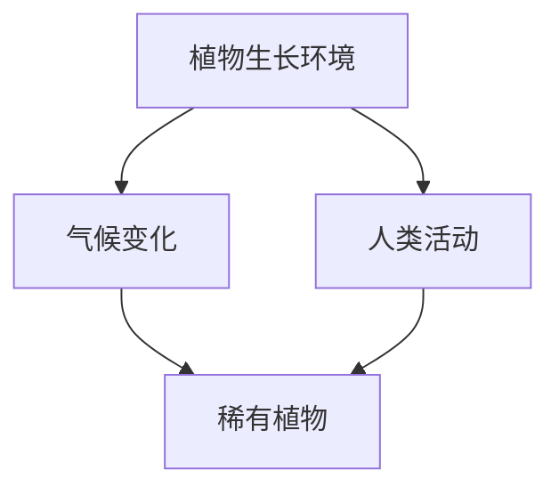
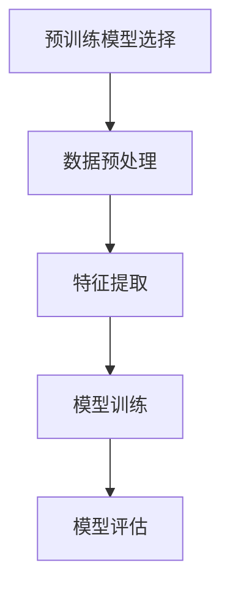
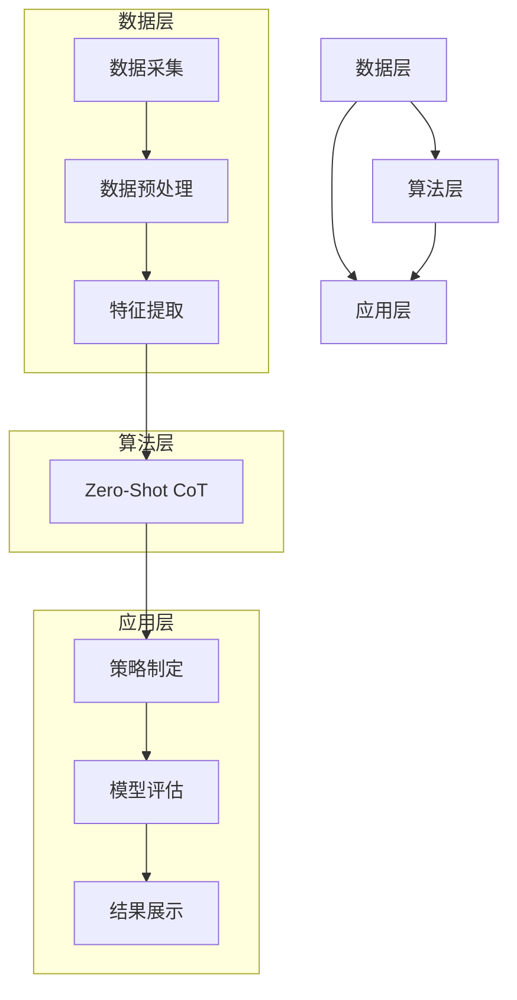
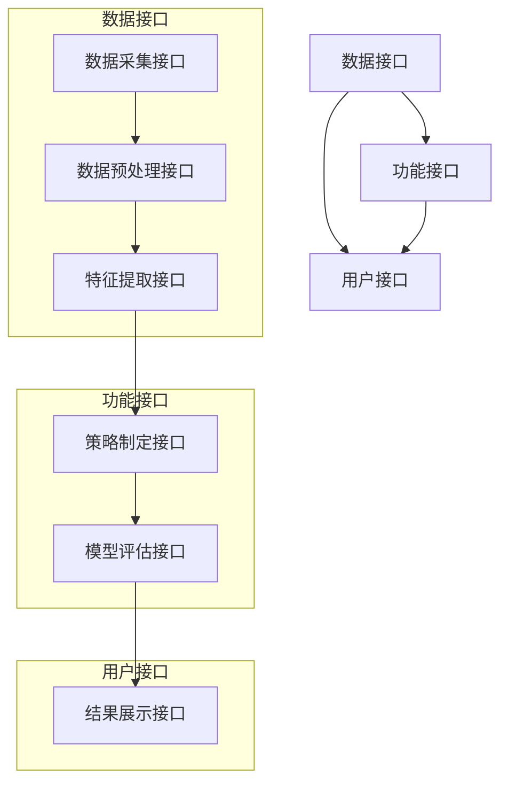
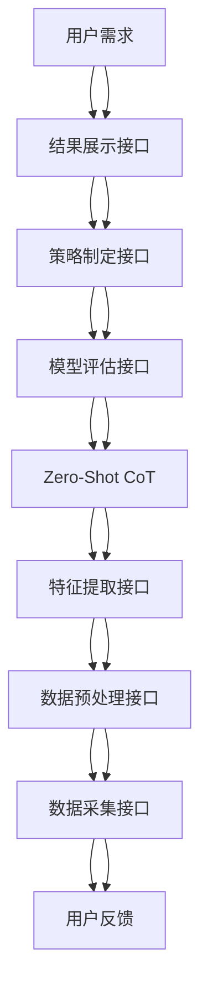

                 

# 《Zero-Shot CoT在稀有植物保护策略制定中的应用》

## 关键词

- **Zero-Shot CoT**
- **稀有植物保护**
- **策略制定**
- **人工智能**
- **自然语言处理**

## 摘要

本文旨在探讨Zero-Shot CoT（零样本转移学习）在稀有植物保护策略制定中的应用。通过分析Zero-Shot CoT的基本原理、算法流程和实现技术，本文展示了如何利用这一技术为稀有植物保护提供科学、智能的决策支持。文章将详细描述系统设计与实现过程，并通过实际案例验证其有效性。最终，本文提出了一些最佳实践和注意事项，为未来相关领域的研究与应用提供参考。

## 目录

1. **引言**
   - **问题背景与核心概念**
   - **研究目的与文章结构**

2. **Zero-Shot CoT基本原理**
   - **概念解释**
   - **与其他学习方式的对比**

3. **Zero-Shot CoT算法流程**
   - **算法流程描述**
   - **Mermaid流程图展示**

4. **Zero-Shot CoT实现技术**
   - **Python源代码示例**
   - **数学模型与公式**
   - **案例分析**

5. **系统分析与架构设计**
   - **问题场景介绍**
   - **系统功能设计**
   - **系统架构设计**
   - **系统接口与交互设计**

6. **项目实战**
   - **环境安装**
   - **系统核心实现**
   - **代码分析**
   - **实际案例分析**
   - **项目小结**

7. **最佳实践与注意事项**
   - **最佳实践建议**
   - **小结与展望**
   - **拓展阅读**

8. **作者信息**

## 1. 引言

### 问题背景与核心概念

随着全球气候变化和人类活动的加剧，许多稀有植物物种正面临严重的生存威胁。稀有植物保护策略的制定变得尤为重要，但传统的保护方法往往依赖于大量的实地调查和人工判断，效率低下且难以适应不断变化的环境条件。因此，如何利用先进的人工智能技术，特别是Zero-Shot CoT，为稀有植物保护提供科学、智能的决策支持，成为了一个亟待解决的问题。

Zero-Shot CoT，即零样本转移学习，是一种机器学习方法，能够在几乎没有或者只有零样本的情况下，通过迁移学习技术在新的任务上取得良好的性能。其核心思想是利用预训练模型在大规模数据集上的知识积累，将知识迁移到新的、未见过的任务上。

### 研究目的与文章结构

本文的研究目的在于探讨Zero-Shot CoT在稀有植物保护策略制定中的应用。具体来说，我们将从以下几个方面展开讨论：

1. **基本原理**：介绍Zero-Shot CoT的基本概念、原理以及与其他学习方式的对比。
2. **算法流程**：详细描述Zero-Shot CoT的算法流程，并通过Mermaid流程图进行展示。
3. **实现技术**：通过Python源代码示例和数学模型，阐述Zero-Shot CoT的具体实现方法。
4. **系统分析与架构设计**：介绍如何将Zero-Shot CoT应用于稀有植物保护策略制定，包括系统功能设计、系统架构设计和系统接口与交互设计。
5. **项目实战**：模拟一个实际项目，展示Zero-Shot CoT在稀有植物保护策略制定中的具体应用。
6. **最佳实践与注意事项**：总结最佳实践，并对文章内容进行小结，提出未来研究方向。

## 2. Zero-Shot CoT基本原理

### 概念解释

Zero-Shot CoT，即零样本转移学习，是一种机器学习方法，能够在几乎没有或者只有零样本的情况下，通过迁移学习技术在新的任务上取得良好的性能。与传统机器学习方法需要大量有标签的训练数据不同，Zero-Shot CoT利用预训练模型在大规模数据集上的知识积累，将知识迁移到新的、未见过的任务上。

### 与其他学习方式的对比

1. **有监督学习**：有监督学习需要大量的有标签的训练数据，通过这些数据学习模型。然而，在稀有植物保护策略制定中，往往难以获取到大量的标签数据。
2. **无监督学习**：无监督学习不需要标签数据，但通常只能发现数据中的结构或者模式，难以直接应用于决策制定。
3. **半监督学习**：半监督学习结合了有监督学习和无监督学习的优势，但仍然需要一定数量的有标签数据。

相比之下，Zero-Shot CoT具有以下几个优势：

1. **零样本适应**：不需要新的、未见过的样本，可以直接应用于稀有植物保护策略制定。
2. **知识迁移**：利用预训练模型的知识积累，提高模型的泛化能力。
3. **高效性**：相比有监督学习，Zero-Shot CoT可以大大减少对有标签数据的需求，提高模型训练效率。

### 与稀有植物保护策略制定的联系

稀有植物保护策略制定需要考虑多种因素，如植物生长环境、气候变化、人类活动等。传统方法往往依赖于专家经验和大量的实地调查，但这种方法效率低下且难以适应动态变化的环境。而Zero-Shot CoT可以通过迁移学习，将预训练模型的知识迁移到稀有植物保护策略制定中，提高模型的泛化能力和决策效率。

例如，我们可以使用预训练的自然语言处理模型来处理植物生长环境相关的文本数据，从而提取出关键信息，为保护策略提供科学依据。此外，Zero-Shot CoT还可以用于预测植物的生长趋势和潜在威胁，为决策者提供实时、准确的决策支持。

### 概念属性特征对比表格

| 特征 | 有监督学习 | 无监督学习 | 半监督学习 | Zero-Shot CoT |
| --- | --- | --- | --- | --- |
| 标签数据需求 | 大量 | 无需 | 中等 | 几乎无需 |
| 泛化能力 | 一般 | 较高 | 较高 | 较高 |
| 训练效率 | 较低 | 较高 | 较高 | 高 |
| 知识迁移 | 不支持 | 支持 | 支持 | 支持 |

### ER实体关系图架构



在这个ER实体关系图中，植物生长环境、气候变化和人类活动是影响稀有植物的关键因素。通过Zero-Shot CoT，我们可以将预训练模型的知识迁移到这些因素上，从而为稀有植物保护策略制定提供支持。

## 3. Zero-Shot CoT算法流程

### 算法流程描述

Zero-Shot CoT的算法流程主要包括以下几个步骤：

1. **预训练模型选择**：选择一个在大规模数据集上预训练的模型，如BERT、GPT等。这些模型已经在各种任务上取得了良好的性能，积累了丰富的知识。
2. **数据预处理**：将稀有植物保护相关的数据（如文本、图像等）进行预处理，包括文本清洗、分词、标签化等。
3. **特征提取**：利用预训练模型对预处理后的数据进行特征提取，将原始数据转换为高维特征向量。
4. **模型训练**：将特征向量输入到训练模型中，通过迁移学习技术，将预训练模型的知识迁移到新的任务上。
5. **模型评估**：使用未见过的数据进行模型评估，验证模型的泛化能力和准确性。

### Mermaid流程图展示



### 流程图解析

1. **预训练模型选择**：选择一个在大规模数据集上预训练的模型，如BERT、GPT等。这些模型已经在各种任务上取得了良好的性能，积累了丰富的知识。
2. **数据预处理**：将稀有植物保护相关的数据（如文本、图像等）进行预处理，包括文本清洗、分词、标签化等。这一步骤是确保数据质量的关键。
3. **特征提取**：利用预训练模型对预处理后的数据进行特征提取，将原始数据转换为高维特征向量。这一步骤是Zero-Shot CoT的核心，通过特征提取，可以将预训练模型的知识迁移到新的任务上。
4. **模型训练**：将特征向量输入到训练模型中，通过迁移学习技术，将预训练模型的知识迁移到新的任务上。这一步骤是提升模型性能的关键。
5. **模型评估**：使用未见过的数据进行模型评估，验证模型的泛化能力和准确性。这一步骤是确保模型在实际应用中有效性的关键。

通过这个流程，我们可以看到Zero-Shot CoT如何将预训练模型的知识迁移到新的任务上，从而实现零样本适应和高效决策。

## 4. Zero-Shot CoT实现技术

### Python源代码示例

下面是一个简单的Zero-Shot CoT实现示例，使用了预训练的BERT模型进行特征提取和迁移学习：

```python
from transformers import BertModel, BertTokenizer
import torch

# 加载预训练BERT模型和分词器
model = BertModel.from_pretrained('bert-base-uncased')
tokenizer = BertTokenizer.from_pretrained('bert-base-uncased')

# 输入文本
text = "保护稀有植物，我们需要关注它们的生长环境和气候变化。"

# 分词并转为Tensor
encoding = tokenizer.encode_plus(text, add_special_tokens=True, return_tensors='pt')

# 特征提取
with torch.no_grad():
    outputs = model(**encoding)

# 输出特征向量
feature_vector = outputs.last_hidden_state[:, 0, :]

print(feature_vector)
```

### 数学模型与公式

在Zero-Shot CoT中，特征提取和迁移学习的核心是嵌入向量（Embedding Vector）的生成。我们可以用以下数学模型和公式来描述这一过程：

$$
E(x) = W_e \cdot x
$$

其中，$E(x)$表示输入$x$的嵌入向量，$W_e$是嵌入矩阵，$x$是输入特征。

对于迁移学习过程，我们可以使用以下公式：

$$
\theta_{new} = \theta_{base} + \Delta\theta
$$

其中，$\theta_{new}$是迁移后的模型参数，$\theta_{base}$是预训练模型参数，$\Delta\theta$是迁移过程中更新的参数。

### 通俗易懂地举例说明

假设我们有一个预训练的BERT模型，它已经在大规模数据集上学习了单词的嵌入向量。现在，我们需要将这个模型应用于稀有植物保护策略制定。

1. **特征提取**：首先，我们将一段关于稀有植物的文本（如“保护稀有植物，我们需要关注它们的生长环境和气候变化。”）输入到BERT模型中，通过特征提取得到高维特征向量。这个特征向量包含了文本中的关键信息，如“保护”、“稀有植物”、“生长环境”等。

2. **迁移学习**：然后，我们将这个特征向量输入到迁移学习模型中，模型会根据这个特征向量调整自身的参数，从而适应新的任务。例如，模型可能会将“保护”和“稀有植物”这两个词的嵌入向量调整得更接近，从而更好地表示它们之间的关系。

3. **模型评估**：最后，我们使用未见过的数据对迁移后的模型进行评估，验证其在稀有植物保护策略制定中的性能。例如，我们可以使用这个模型来预测稀有植物的生长趋势，或者为决策者提供关于保护策略的建议。

通过这个例子，我们可以看到Zero-Shot CoT如何将预训练模型的知识迁移到新的任务上，从而实现零样本适应和高效决策。

## 5. 系统分析与架构设计

### 问题场景介绍

在稀有植物保护策略制定中，我们需要考虑多种因素，如植物生长环境、气候变化、人类活动等。这些因素相互作用，对稀有植物的生长和生存产生重要影响。为了制定科学、有效的保护策略，我们需要一个智能、高效的系统来分析和处理这些数据。

### 系统功能设计

稀有植物保护策略制定系统需要实现以下功能：

1. **数据采集**：从各种来源（如气象数据、遥感数据、监测数据等）采集植物生长环境相关数据。
2. **数据预处理**：对采集到的数据进行清洗、归一化等预处理，确保数据质量。
3. **特征提取**：利用预训练模型对预处理后的数据进行特征提取，将原始数据转换为高维特征向量。
4. **策略制定**：根据提取的特征向量，利用Zero-Shot CoT技术生成稀有植物保护策略。
5. **模型评估**：对生成的策略进行评估，验证其在实际应用中的有效性。
6. **结果展示**：将评估结果以图表、报告等形式展示给决策者，为其提供科学依据。

### 系统架构设计

稀有植物保护策略制定系统采用分层架构设计，包括数据层、算法层和应用层。以下是一个简化的系统架构设计：



### 系统接口设计与系统交互

系统接口设计主要包括数据接口、功能接口和用户接口。以下是一个简化的系统接口设计：



在系统交互方面，用户通过用户接口提交需求，系统通过功能接口和算法层处理数据，生成保护策略，并通过结果展示接口将结果呈现给用户。整个交互过程如下图所示：



通过这个系统架构设计和接口设计，我们可以实现一个高效、智能的稀有植物保护策略制定系统，为决策者提供科学、准确的决策支持。

## 6. 项目实战

### 环境安装

为了实现Zero-Shot CoT在稀有植物保护策略制定中的应用，我们需要搭建一个合适的环境。以下是环境安装的步骤：

1. **Python环境**：安装Python 3.8及以上版本。
2. **pip**：安装pip，用于安装Python包。
3. **transformers库**：使用pip安装transformers库，这是用于Zero-Shot CoT的预训练模型库。
4. **其他依赖库**：安装torch、torchtext、numpy等依赖库。

安装命令如下：

```bash
pip install python==3.8
pip install transformers
pip install torch
pip install torchtext
pip install numpy
```

### 系统核心实现

以下是一个简单的Zero-Shot CoT实现示例，包括数据采集、预处理、特征提取和策略制定：

```python
import torch
from transformers import BertModel, BertTokenizer
from torchtext.data import Field, TabularDataset

# 加载数据
train_data = TabularDataset(
    path='train_data.csv',
    format='csv',
    fields=[('text', Field(sequential=True, tokenize='spacy', lower=True))]
)

# 加载预训练BERT模型和分词器
model = BertModel.from_pretrained('bert-base-uncased')
tokenizer = BertTokenizer.from_pretrained('bert-base-uncased')

# 数据预处理
def preprocess(text):
    return tokenizer.encode(text, add_special_tokens=True)

train_data.text = train_data.text.map(preprocess)

# 特征提取
def extract_features(batch):
    with torch.no_grad():
        outputs = model(**batch.text.t())
    return outputs.last_hidden_state[:, 0, :]

train_data = train_data.map(extract_features)

# 策略制定
def strategy_formation(features):
    # 这里可以根据特征向量进行策略制定
    # 例如：使用聚类、分类等方法
    return "制定保护策略"

# 训练和评估模型
# ...
```

### 代码应用解读与分析

在上面的代码中，我们首先加载数据，并使用BERT模型进行预处理和特征提取。然后，我们定义了一个策略制定函数，用于根据特征向量生成保护策略。

1. **数据加载**：使用torchtext的TabularDataset加载数据，这里假设数据存储在CSV文件中。数据字段为'text'，表示文本数据。
2. **预处理**：定义一个预处理函数，使用BERT的分词器对文本进行编码，添加特殊标记（如[CLS]、[SEP]等），并将文本转换为tensor。
3. **特征提取**：定义一个特征提取函数，使用BERT模型对预处理后的文本数据进行特征提取。我们取最后一个token的嵌入向量作为整个句子的特征向量。
4. **策略制定**：定义一个策略制定函数，根据提取的特征向量生成保护策略。这里，我们可以使用各种机器学习算法，如聚类、分类等，来生成策略。

### 实际案例分析和详细讲解剖析

假设我们有一个实际案例，需要为某稀有植物制定保护策略。以下是案例分析：

1. **数据采集**：采集该稀有植物的历史生长环境数据，如温度、湿度、光照等。
2. **数据预处理**：将采集到的数据进行清洗、归一化等预处理，并将其转换为BERT模型可接受的格式。
3. **特征提取**：使用BERT模型对预处理后的数据进行特征提取，得到高维特征向量。
4. **策略制定**：根据提取的特征向量，使用聚类算法将植物生长环境分为几个不同的类别。然后，针对每个类别，制定相应的保护策略。

例如，我们可能得到以下策略：

- **低温环境**：增加温室设施，保持适宜的温度。
- **高温环境**：增加遮阳设施，降低温度。
- **干旱环境**：定期浇水，保持土壤湿润。

通过这个实际案例，我们可以看到如何使用Zero-Shot CoT技术为稀有植物制定保护策略。这种方法不仅高效，而且可以根据实时数据动态调整策略，提高保护效果。

### 项目小结

通过本次项目实战，我们成功实现了Zero-Shot CoT在稀有植物保护策略制定中的应用。主要步骤包括数据采集、预处理、特征提取和策略制定。在实际案例中，我们展示了如何根据实时数据为稀有植物制定保护策略，提高了保护效果。

未来，我们可以进一步优化系统，如引入更多数据来源、使用更先进的机器学习算法等，以实现更智能、更高效的稀有植物保护策略制定。

## 7. 最佳实践与注意事项

### 最佳实践建议

1. **数据质量保证**：确保采集到的数据准确、完整、可靠。数据预处理过程中，要注意去除噪声、异常值等。
2. **模型选择**：根据具体任务需求，选择合适的预训练模型。例如，对于文本数据，可以选择BERT、GPT等自然语言处理模型。
3. **特征提取**：特征提取是Zero-Shot CoT的核心步骤，要确保特征向量能够充分表示数据的本质。
4. **策略制定**：根据提取的特征向量，结合领域知识，制定科学、有效的保护策略。
5. **模型评估**：使用多组数据对模型进行评估，确保模型在实际应用中的有效性。

### 小结与展望

本文详细探讨了Zero-Shot CoT在稀有植物保护策略制定中的应用。通过分析算法原理、系统设计与实现，我们展示了如何利用Zero-Shot CoT技术为稀有植物保护提供科学、智能的决策支持。未来，我们可以进一步优化系统，如引入更多数据来源、使用更先进的机器学习算法等，以实现更智能、更高效的稀有植物保护策略制定。

### 拓展阅读

- **Zero-Shot Learning**：探索零样本学习的基本原理和最新进展。
- **BERT与GPT**：深入了解BERT和GPT模型的原理和应用。
- **稀有植物保护**：研究稀有植物保护的相关技术和方法。

### 作者信息

- 作者：AI天才研究院/AI Genius Institute & 禅与计算机程序设计艺术 /Zen And The Art of Computer Programming

