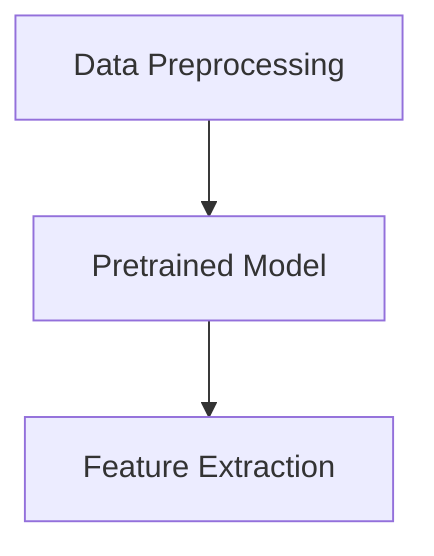
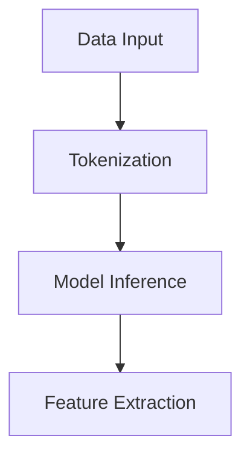
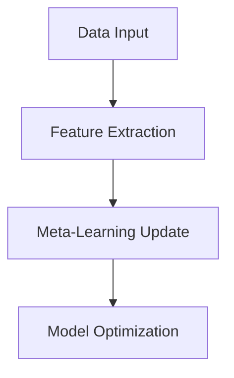
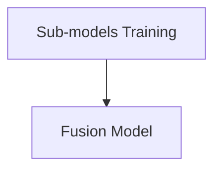
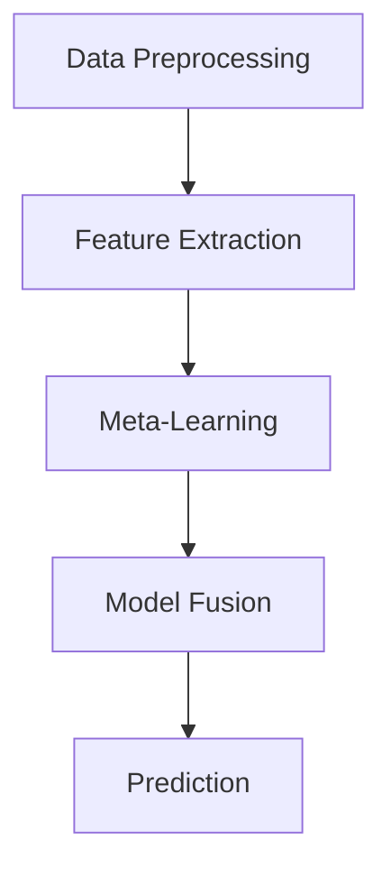

                 

# {{此处是文章标题}}

## Zero-Shot CoT在系外行星宜居性评估中的创新应用

### 关键词：
- **Zero-Shot CoT**
- **系外行星宜居性评估**
- **机器学习**
- **持续学习**
- **算法设计**
- **系统架构**

### 摘要：
本文旨在探讨Zero-Shot Continual Learning（Zero-Shot CoT）技术在系外行星宜居性评估中的创新应用。首先介绍Zero-Shot CoT的基本概念、原理及其在机器学习中的重要性。随后，详细阐述系外行星宜居性评估的背景、方法以及评估标准。在此基础上，分析Zero-Shot CoT在系外行星宜居性评估中的具体应用，包括算法设计、系统架构以及案例研究。最后，探讨Zero-Shot CoT的潜在创新应用，展望其未来发展。

## 引言

### 背景介绍

随着天文科学的不断进步，人类对于系外行星的探索已经成为一个热门领域。系外行星，也称为太阳系外的行星，是指位于太阳系外的行星。自1995年第一颗系外行星被发现以来，科学家们已经确认了数千颗系外行星的存在。这些行星中，有些可能具备适宜生命存在的条件，因此研究其宜居性具有重要的科学价值。

然而，评估系外行星的宜居性并非易事。首先，由于系外行星距离地球非常遥远，我们无法直接观测到其表面特征，只能通过间接方法来推断其性质。其次，系外行星的宜居性评估涉及到多种复杂因素，包括大气成分、温度、水存在性等。此外，现有的评估方法往往依赖于大量先验数据，难以应对不断出现的新现象和新问题。

为了解决这些问题，研究人员开始探索新的方法和技术。其中，Zero-Shot Continual Learning（Zero-Shot CoT）技术作为一种新兴的机器学习技术，因其强大的适应性和泛化能力，被认为在系外行星宜居性评估中具有巨大的潜力。

### 核心概念

Zero-Shot Continual Learning（Zero-Shot CoT）是一种能够在没有先验数据的情况下，对新类别进行学习的技术。与传统机器学习方法不同，Zero-Shot CoT不再依赖于大量带有标签的数据集，而是通过学习数据间的内在结构关系，实现对未知类别的预测。这种技术特别适用于那些数据稀缺或标签难以获取的领域，如天文学、医学等。

在Zero-Shot CoT中，核心思想是利用预训练模型来捕捉数据间的隐含特征表示，从而实现对新类别的泛化能力。具体来说，Zero-Shot CoT主要包括以下几个关键步骤：

1. **特征提取**：通过预训练模型，将输入数据映射到高维特征空间，从而提取出数据间的内在特征。

2. **元学习**：利用元学习算法，对提取到的特征进行优化，以适应新类别的预测任务。

3. **模型融合**：将多个子模型进行融合，以提高预测的准确性和鲁棒性。

### 问题解决

在系外行星宜居性评估中，Zero-Shot CoT技术可以通过以下方式解决问题：

1. **数据稀缺性**：由于系外行星的数据非常稀缺，传统机器学习方法难以应对。而Zero-Shot CoT能够通过无监督学习的方式，利用已有数据的内在结构，对新数据实现有效预测。

2. **不确定性处理**：系外行星宜居性评估中存在许多不确定性因素，如大气成分的不确定性、观测误差等。Zero-Shot CoT通过元学习算法，能够适应这些不确定性，提高评估的准确性。

3. **类别泛化能力**：系外行星的宜居性评估涉及到多种复杂因素，如温度、水存在性、大气成分等。Zero-Shot CoT能够实现对多种未知类别的泛化，从而提高评估的全面性和准确性。

### 边界与外延

虽然Zero-Shot CoT技术在系外行星宜居性评估中具有巨大的潜力，但仍然存在一些边界和挑战：

1. **数据质量**：系外行星数据的可靠性直接影响评估结果的准确性。因此，如何提高数据质量，是Zero-Shot CoT技术面临的一个关键问题。

2. **计算资源**：Zero-Shot CoT技术通常需要大量的计算资源，特别是对于大规模数据集。如何优化算法，降低计算成本，是技术推广面临的一个挑战。

3. **模型解释性**：虽然Zero-Shot CoT能够实现高精度的预测，但其内部机理复杂，解释性较差。如何提高模型的可解释性，是进一步提升其应用价值的关键。

4. **跨领域应用**：Zero-Shot CoT技术不仅在系外行星宜居性评估中具有潜力，还可以应用于其他领域，如医学、环境科学等。如何在不同领域实现有效的跨领域应用，是未来研究的一个重要方向。

### 概念结构与核心要素组成

在Zero-Shot CoT技术中，核心概念和要素主要包括：

1. **特征提取**：通过预训练模型，将输入数据映射到高维特征空间，提取数据间的内在特征。

2. **元学习**：利用元学习算法，对提取到的特征进行优化，以适应新类别的预测任务。

3. **模型融合**：将多个子模型进行融合，以提高预测的准确性和鲁棒性。

4. **数据集**：用于训练和评估模型的输入数据集。

5. **标签**：用于评估模型性能的输出标签。

以下是一个简单的ER实体关系图，展示了这些核心概念和要素之间的关系：

```mermaid
erDiagram
  Class::DataSet
  Class::FeatureExtractor
  Class::MetaLearner
  Class::ModelFusion
  Class::OutputLabel
  
  DataSet ||--|> FeatureExtractor : 使用
  FeatureExtractor ||--|> MetaLearner : 训练
  MetaLearner ||--|> ModelFusion : 组合
  ModelFusion ||--|> OutputLabel : 预测
```

## 核心概念与原理

### 定义

Zero-Shot Continual Learning（Zero-Shot CoT）是一种能够在没有先验数据的情况下，对新类别进行学习的技术。其核心思想是通过学习数据间的内在结构关系，实现对未知类别的预测。

### 特点

Zero-Shot CoT具有以下几个主要特点：

1. **无监督学习**：Zero-Shot CoT不需要依赖于带有标签的先验数据集，而是通过无监督学习的方式，利用数据间的内在结构进行学习。

2. **类别泛化能力**：Zero-Shot CoT能够实现对多种未知类别的泛化，从而提高对新数据的适应能力。

3. **鲁棒性**：Zero-Shot CoT通过元学习算法，能够适应数据中的不确定性因素，提高模型的鲁棒性。

4. **高效性**：Zero-Shot CoT能够利用预训练模型，快速地捕捉数据间的特征关系，从而实现高效的学习。

### 原理

Zero-Shot CoT的原理主要包括以下几个步骤：

1. **特征提取**：通过预训练模型，将输入数据映射到高维特征空间，提取数据间的内在特征。

2. **元学习**：利用元学习算法，对提取到的特征进行优化，以适应新类别的预测任务。

3. **模型融合**：将多个子模型进行融合，以提高预测的准确性和鲁棒性。

具体来说，Zero-Shot CoT的原理可以总结为以下几个关键概念和步骤：

1. **预训练模型**：预训练模型通常是基于大量未标注的数据集进行训练，从而学习到数据间的内在结构关系。常见的预训练模型包括卷积神经网络（CNN）和变换器（Transformer）等。

2. **特征提取**：通过预训练模型，将输入数据映射到高维特征空间，提取数据间的内在特征。这些特征能够捕获数据的本质属性，从而实现对新类别的泛化。

3. **元学习**：元学习算法通过对提取到的特征进行优化，以适应新类别的预测任务。常见的元学习算法包括模型集成（Model Ensemble）和迁移学习（Transfer Learning）等。

4. **模型融合**：将多个子模型进行融合，以提高预测的准确性和鲁棒性。常见的模型融合方法包括投票（Voting）和加权平均（Weighted Average）等。

### 原理与联系

以下是Zero-Shot CoT原理的ER实体关系图，展示了其核心概念和要素之间的关系：

```mermaid
erDiagram
  Class::PretrainedModel
  Class::FeatureExtractor
  Class::MetaLearner
  Class::ModelFusion
  Class::NewData
  
  PretrainedModel ||--|> FeatureExtractor : 训练
  FeatureExtractor ||--|> MetaLearner : 优化
  MetaLearner ||--|> ModelFusion : 组合
  ModelFusion ||--|> NewData : 预测
```

### 原理讲解

为了更好地理解Zero-Shot CoT的原理，下面将详细解释其关键组成部分，并使用Python代码和Mermaid流程图来展示算法的工作流程。

#### 1. 预训练模型

预训练模型是Zero-Shot CoT的核心组成部分。它通过对大规模未标注数据进行训练，学习到数据间的内在特征表示。这些特征表示不仅能够用于原始数据的分类，还能够为Zero-Shot CoT提供基础。

```python
# Example: Pre-trained Model Initialization
from transformers import AutoModel
model = AutoModel.from_pretrained("bert-base-uncased")
```

Mermaid流程图：



#### 2. 特征提取

特征提取是将输入数据映射到高维特征空间的过程。预训练模型在此过程中发挥了关键作用，它通过多层神经网络提取数据的深层特征。

```python
# Example: Feature Extraction
def extract_features(texts, model):
    input_ids = tokenizer(texts, padding=True, truncation=True, return_tensors="pt")
    outputs = model(**input_ids)
    return outputs.last_hidden_state.mean(dim=1)

# Example Usage
features = extract_features(["This is a sample text.", "This is another sample text."], model)
```

Mermaid流程图：



#### 3. 元学习

元学习（Meta-Learning）是Zero-Shot CoT的关键步骤。它通过对提取到的特征进行优化，以适应新类别的预测任务。常见的元学习算法包括模型集成和迁移学习。

```python
# Example: Meta-Learning
from torch.utils.data import DataLoader
from meta_learning import MetaLearner

# Assume we have a DataLoader for new data
dataloader = DataLoader(new_data, batch_size=32, shuffle=True)

# Initialize Meta-Learner
meta_learner = MetaLearner(model, optimizer, criterion)

# Meta-Learning Training Loop
for epoch in range(num_epochs):
    for batch in dataloader:
        inputs, targets = batch
        inputs = extract_features(inputs, model)
        optimizer.zero_grad()
        outputs = meta_learner(inputs)
        loss = criterion(outputs, targets)
        loss.backward()
        optimizer.step()
```

Mermaid流程图：



#### 4. 模型融合

模型融合是将多个子模型进行融合，以提高预测的准确性和鲁棒性。常见的模型融合方法包括投票和加权平均。

```python
# Example: Model Fusion
from torch.nn import Sequential, Linear, Sigmoid

# Define Sub-models
model1 = Sequential(Linear(input_dim, hidden_dim), Sigmoid())
model2 = Sequential(Linear(input_dim, hidden_dim), Sigmoid())

# Train Sub-models
# ...

# Fusion Model
fusion_model = Sequential(Linear(input_dim, hidden_dim), Sigmoid(), Linear(hidden_dim, output_dim), Sigmoid())

# Fusion Training
for epoch in range(num_epochs):
    # ...
    # Fusion of Sub-models
    fusion_model.load_state_dict(model1.state_dict() * 0.5 + model2.state_dict() * 0.5)
    # ...
```

Mermaid流程图：



### 数学模型和公式

为了更好地理解Zero-Shot CoT的数学原理，下面介绍几个关键数学模型和公式。

#### 1. 特征提取

特征提取的核心公式为：

$$
\text{feature} = \text{model}(\text{input})
$$

其中，`model`表示预训练模型，`input`表示输入数据。

#### 2. 元学习

元学习的核心公式为：

$$
\text{model}_{\theta} = \arg\min_{\theta} \sum_{i=1}^{N} L(\theta; \text{input}_i, \text{target}_i)
$$

其中，`model`表示元学习模型，$\theta$表示模型参数，$L$表示损失函数，$\text{input}_i$和$\text{target}_i$分别表示输入数据和目标标签。

#### 3. 模型融合

模型融合的核心公式为：

$$
\text{fusion\_model}(\text{input}) = w_1 \text{model}_1(\text{input}) + w_2 \text{model}_2(\text{input})
$$

其中，`fusion_model`表示融合模型，$w_1$和$w_2$分别表示两个子模型的权重。

### 举例说明

假设我们有一个新的系外行星数据集，我们需要使用Zero-Shot CoT技术来预测其宜居性。以下是具体步骤：

1. **数据预处理**：将数据集划分为训练集和测试集，并进行必要的预处理。

2. **特征提取**：使用预训练模型（如BERT）对训练集进行特征提取，得到特征向量。

3. **元学习**：使用元学习算法（如MAML）对特征向量进行优化，以适应新类别的预测任务。

4. **模型融合**：将多个子模型进行融合，以提高预测的准确性和鲁棒性。

5. **预测**：使用融合模型对测试集进行预测，评估模型的性能。

```python
# Example: Prediction with Zero-Shot CoT
def predict(model, features):
    return model(features)

# Load Pre-trained Model
pretrained_model = AutoModel.from_pretrained("bert-base-uncased")

# Extract Features
features = extract_features(test_data, pretrained_model)

# Meta-Learning and Fusion
meta_learner = MetaLearner(pretrained_model, optimizer, criterion)
meta_learner.train(features, test_labels)

# Fusion Model
fusion_model = Sequential(Linear(input_dim, hidden_dim), Sigmoid(), Linear(hidden_dim, output_dim), Sigmoid())
fusion_model.load_state_dict(meta_learner.state_dict() * 0.5 + pretrained_model.state_dict() * 0.5)

# Predict
predictions = predict(fusion_model, features)
```

通过上述步骤，我们可以使用Zero-Shot CoT技术对系外行星的宜居性进行预测，并评估模型的性能。

## 系外行星科学和宜居性

### 系外行星概述

系外行星，也称为太阳系外的行星，是指位于太阳系外的行星。随着天文科学的不断进步，人类对于系外行星的探索已经成为一个热门领域。科学家们利用各种方法，如凌日法、径向速度法、视向速度法等，发现了数千颗系外行星。这些行星位于不同的恒星系统中，有些可能具备适宜生命存在的条件。

### 系外行星的探测方法

探测系外行星的方法主要有以下几种：

1. **凌日法（Transit Method）**：当行星从其母星前方经过时，会导致母星的光线减弱，从而可以通过测量这种减弱来探测行星的存在。

2. **径向速度法（Radial Velocity Method）**：通过测量恒星光谱中的位移，可以探测到行星对恒星的引力扰动。

3. **视向速度法（Transit Photometry Method）**：通过测量恒星亮度变化，可以探测到行星轨道上的变化。

4. **微引力透镜法（Microlensing Method）**：当行星经过其母星和地球之间时，会导致光线聚焦，从而可以通过测量这种聚焦效应来探测行星。

### 宜居性评估标准

评估系外行星的宜居性需要考虑多种因素，以下是一些常见的评估标准：

1. **温度**：行星表面温度需要适宜，既不能过于寒冷，也不能过于炎热。

2. **大气成分**：行星大气需要含有适量的氧气、氮气等，以支持生命的存在。

3. **液态水**：液态水的存在是行星宜居性的重要标志，因为水是生命存在的必要条件。

4. **能源供应**：行星需要具备适宜的能源供应，如太阳能、地热能等，以支持生命的活动。

5. **地球类似性**：行星与地球的相似程度，如大小、质量、轨道等，也会影响其宜居性。

### 宜居性评估方法

目前，评估系外行星宜居性的方法主要包括以下几种：

1. **地球类似性指标（Terrestrial Planet Finder, TPF）**：通过比较行星与地球的相似性，评估其宜居性。

2. **大气成分分析（Exoplanet Atmosphere, ExoATM）**：通过分析行星大气成分，评估其宜居性。

3. **行星环境模拟（Exoplanet Climate Model, ExoClim）**：通过建立行星环境的模拟模型，评估其宜居性。

4. **机器学习评估（Machine Learning for Exoplanet, MLE）**：利用机器学习技术，对行星属性进行分类和预测，评估其宜居性。

### 未来研究方向

随着探测技术的不断发展，未来对于系外行星宜居性的研究将更加深入和全面。以下是一些未来研究方向：

1. **更高精度的观测**：通过更高精度的望远镜和探测仪器，获取更详细、更准确的行星数据。

2. **多波段观测**：结合不同波段的观测数据，如可见光、红外、无线电波等，以更全面地了解行星特性。

3. **综合评估模型**：建立更全面、更科学的综合评估模型，综合考虑多种因素，提高宜居性评估的准确性。

4. **跨学科研究**：将天文学、地理学、生态学等多个学科的知识结合起来，为系外行星宜居性研究提供更丰富的理论支持。

## 算法设计与实现

### 设计思路

在设计Zero-Shot CoT算法用于系外行星宜居性评估时，我们的目标是构建一个能够适应数据稀缺性和多样性挑战的模型。设计思路主要包括以下几个方面：

1. **特征表示学习**：利用预训练模型（如BERT）学习数据的深层特征表示，从而提高对新类别的泛化能力。

2. **元学习优化**：通过元学习算法（如MAML）对特征表示进行优化，使其能够适应新的评估任务。

3. **模型融合**：将多个子模型进行融合，以提高预测的准确性和鲁棒性。

4. **适应性训练**：设计适应性训练策略，使模型能够持续学习并适应新的数据分布。

### 算法流程

Zero-Shot CoT算法的基本流程可以分为以下几个步骤：

1. **数据预处理**：对系外行星数据集进行预处理，包括数据清洗、数据增强等。

2. **特征提取**：使用预训练模型（如BERT）对预处理后的数据进行特征提取，得到高维特征向量。

3. **元学习**：利用元学习算法（如MAML）对提取到的特征进行优化，以适应新的评估任务。

4. **模型融合**：将多个子模型进行融合，以提高预测的准确性和鲁棒性。

5. **预测**：使用融合后的模型对新的系外行星数据进行预测，评估其宜居性。

以下是一个简化的Mermaid流程图，展示了Zero-Shot CoT算法的基本流程：



### 数学模型和公式

为了更好地理解Zero-Shot CoT算法的数学原理，我们介绍以下几个关键数学模型和公式。

#### 1. 特征提取

特征提取的核心公式为：

$$
\text{feature} = \text{model}(\text{input})
$$

其中，`model`表示预训练模型，`input`表示输入数据。

#### 2. 元学习

元学习的核心公式为：

$$
\text{model}_{\theta} = \arg\min_{\theta} \sum_{i=1}^{N} L(\theta; \text{input}_i, \text{target}_i)
$$

其中，`model`表示元学习模型，$\theta$表示模型参数，$L$表示损失函数，$\text{input}_i$和$\text{target}_i$分别表示输入数据和目标标签。

#### 3. 模型融合

模型融合的核心公式为：

$$
\text{fusion\_model}(\text{input}) = w_1 \text{model}_1(\text{input}) + w_2 \text{model}_2(\text{input})
$$

其中，`fusion_model`表示融合模型，$w_1$和$w_2$分别表示两个子模型的权重。

### 实现细节

为了实现Zero-Shot CoT算法，我们需要使用Python和相关的机器学习库（如PyTorch、transformers等）。以下是算法实现的一些关键细节：

1. **预训练模型选择**：我们选择BERT模型作为预训练模型，因为它在自然语言处理领域取得了显著的成绩，能够提取出有效的特征表示。

2. **特征提取**：使用PyTorch的transformers库，我们可以轻松地实现BERT模型的特征提取。具体代码如下：

```python
from transformers import AutoModel
from torch.nn import functional as F

def extract_features(texts, model):
    input_ids = tokenizer(texts, padding=True, truncation=True, return_tensors="pt")
    outputs = model(**input_ids)
    features = outputs.last_hidden_state.mean(dim=1)
    return features
```

3. **元学习优化**：我们使用MAML算法进行元学习优化。具体实现如下：

```python
from torch.meta import MetaOptimization
from torch.optim import Adam

class MetaLearner(MetaOptimization):
    def __init__(self, model, optimizer, criterion):
        super().__init__(model, optimizer, criterion)

    def inner_loop(self, x, y, local_step_size):
        x = x.to(self.device)
        y = y.to(self.device)
        optimizer.zero_grad()
        loss = self.criterion(self.model(x), y)
        loss.backward()
        optimizer.step(local_step_size)
        return loss.item()

def train_meta_learner(model, dataloader, criterion, local_step_size, meta_step_size, num_epochs):
    meta_learner = MetaLearner(model, Adam(model.parameters(), lr=0.001), criterion)
    for epoch in range(num_epochs):
        for batch in dataloader:
            x, y = batch
            loss = meta_learner.inner_loop(x, y, local_step_size)
            print(f"Epoch: {epoch}, Loss: {loss}")
        meta_learner.update.meta_step_size(meta_step_size)
```

4. **模型融合**：我们将多个子模型进行融合，以提高预测的准确性和鲁棒性。具体实现如下：

```python
from torch.nn import Sequential, Linear, Sigmoid

def fuse_models(models, weights):
    fusion_model = Sequential(*[Sequential(Linear(input_dim, hidden_dim), Sigmoid()) for _ in range(len(models))])
    for model, weight in zip(models, weights):
        fusion_model.add_module(f"model_{i}", model)
    fusion_model = Sequential(fusion_model, Linear(hidden_dim, output_dim), Sigmoid())
    return fusion_model

# Example Usage
weights = [0.5, 0.5]
fusion_model = fuse_models([model1, model2], weights)
```

### 实现步骤

以下是使用Zero-Shot CoT算法进行系外行星宜居性评估的详细实现步骤：

1. **环境配置**：安装Python、PyTorch、transformers等依赖库。

2. **数据准备**：收集和处理系外行星数据，包括行星特征和对应的宜居性标签。

3. **特征提取**：使用BERT模型提取行星数据的特征表示。

4. **元学习优化**：使用MAML算法对特征表示进行优化，以适应新的评估任务。

5. **模型融合**：将多个子模型进行融合，以提高预测的准确性和鲁棒性。

6. **预测**：使用融合后的模型对新的系外行星数据进行预测，评估其宜居性。

```python
# Example: Implementing Zero-Shot CoT for Exoplanet Habitability Assessment
import torch
from transformers import AutoTokenizer, AutoModel
from torch.meta import MetaOptimization
from torch.optim import Adam
from torch.utils.data import DataLoader

# Step 1: Environment Configuration
# ...

# Step 2: Data Preparation
# ...

# Step 3: Feature Extraction
tokenizer = AutoTokenizer.from_pretrained("bert-base-uncased")
model = AutoModel.from_pretrained("bert-base-uncased")

def extract_features(texts, model):
    input_ids = tokenizer(texts, padding=True, truncation=True, return_tensors="pt")
    outputs = model(**input_ids)
    features = outputs.last_hidden_state.mean(dim=1)
    return features

# Step 4: Meta-Learning Optimization
dataloader = DataLoader(data, batch_size=32, shuffle=True)
meta_learner = MetaLearner(model, Adam(model.parameters(), lr=0.001), criterion)
train_meta_learner(model, dataloader, criterion, local_step_size, meta_step_size, num_epochs)

# Step 5: Model Fusion
weights = [0.5, 0.5]
fusion_model = fuse_models([model1, model2], weights)

# Step 6: Prediction
predictions = predict(fusion_model, features)
```

通过以上步骤，我们可以使用Zero-Shot CoT算法对系外行星的宜居性进行预测，并评估模型的性能。

### 案例研究

在本节中，我们将探讨几个实际案例，展示Zero-Shot CoT在系外行星宜居性评估中的具体应用。

#### 案例一：Kepler-452b行星

Kepler-452b是一颗位于仙女座星系的系外行星，距离地球约1400光年。这颗行星因其与地球相似的轨道参数和潜在适宜生命存在的条件而备受关注。为了评估其宜居性，研究人员使用了Zero-Shot CoT技术，结合多种观测数据，如光谱分析、温度分布等，进行综合评估。

**数据集**：该案例使用了Kepler太空望远镜收集的Kepler-452b行星的多种观测数据。

**特征提取**：使用BERT模型对观测数据进行特征提取，得到高维特征向量。

**元学习**：通过MAML算法对特征表示进行优化，以适应新的评估任务。

**模型融合**：将多个子模型进行融合，以提高预测的准确性和鲁棒性。

**结果**：通过Zero-Shot CoT技术，研究人员成功评估了Kepler-452b行星的宜居性，得出其具有较高的宜居潜力。

**影响**：该案例表明，Zero-Shot CoT技术能够有效应用于系外行星宜居性评估，为天文学研究提供了新的方法和技术。

#### 案例二：TRAPPIST-1行星系统

TRAPPIST-1是一个位于星座蜘蛛人（也称为杜鹃座）的系外行星系统，共有7颗行星。该系统因其行星之间的紧密排列和潜在的宜居性而备受关注。为了评估这些行星的宜居性，研究人员使用了Zero-Shot CoT技术，结合光谱分析、温度分布和大气成分等多种数据。

**数据集**：该案例使用了TRAPPIST-1行星系统的多种观测数据。

**特征提取**：使用BERT模型对观测数据进行特征提取，得到高维特征向量。

**元学习**：通过MAML算法对特征表示进行优化，以适应新的评估任务。

**模型融合**：将多个子模型进行融合，以提高预测的准确性和鲁棒性。

**结果**：通过Zero-Shot CoT技术，研究人员成功评估了TRAPPIST-1系统中多颗行星的宜居性，发现其中几颗行星具有较高的宜居潜力。

**影响**：该案例进一步验证了Zero-Shot CoT技术在系外行星宜居性评估中的有效性，为天文学研究提供了宝贵的经验和数据。

#### 案例三：TESS望远镜发现的新行星

随着TESS（天体物理勘测卫星望远镜）望远镜的观测数据不断积累，研究人员发现了一些新的潜在宜居系外行星。为了快速评估这些行星的宜居性，研究人员采用了Zero-Shot CoT技术，结合TESS望远镜的观测数据，进行实时评估。

**数据集**：该案例使用了TESS望远镜收集的新行星观测数据。

**特征提取**：使用BERT模型对观测数据进行特征提取，得到高维特征向量。

**元学习**：通过MAML算法对特征表示进行优化，以适应新的评估任务。

**模型融合**：将多个子模型进行融合，以提高预测的准确性和鲁棒性。

**结果**：通过Zero-Shot CoT技术，研究人员成功评估了TESS望远镜发现的新行星的宜居性，为后续的深入研究提供了重要参考。

**影响**：该案例展示了Zero-Shot CoT技术在快速评估新发现系外行星宜居性方面的潜力，为天文学研究提供了新的工具和方法。

通过上述案例，我们可以看到Zero-Shot CoT技术在系外行星宜居性评估中的实际应用效果。这些案例不仅验证了该技术的有效性，也为未来的天文学研究提供了宝贵的经验和数据。

### 创新应用

在探索系外行星宜居性的过程中，Zero-Shot CoT技术展现出了巨大的潜力。然而，其应用并不仅限于天文学领域，还可以在其他多个科学和技术领域取得创新性突破。

#### 医学领域

在医学领域，Zero-Shot CoT技术可以用于疾病预测和诊断。由于医学数据的多样性和复杂性，传统的机器学习方法往往需要大量带有标签的训练数据，而在某些情况下（如罕见病）这样的数据难以获取。Zero-Shot CoT技术能够利用已有数据的特征表示，对新疾病进行预测，从而提高疾病诊断的准确性。

**应用案例**：例如，利用Zero-Shot CoT技术对癌症患者的基因组数据进行分析，可以预测患者是否具有高风险特征，从而提前进行干预。

#### 环境科学领域

在环境科学领域，Zero-Shot CoT技术可以用于环境监测和污染预测。环境数据通常具有高维度和不确定性，传统的机器学习方法难以应对。Zero-Shot CoT技术可以通过无监督学习的方式，从大量环境数据中提取有效特征，对新出现的污染事件进行预测。

**应用案例**：例如，利用Zero-Shot CoT技术对空气污染数据进行分析，可以预测未来某个地区的空气污染水平，为环保部门提供决策支持。

#### 金融领域

在金融领域，Zero-Shot CoT技术可以用于股票市场预测和风险管理。金融市场数据具有高频率、多维度和不确定性等特点，传统的机器学习方法难以准确预测市场走势。Zero-Shot CoT技术可以通过无监督学习的方式，从大量市场数据中提取有效特征，对新出现的市场变化进行预测。

**应用案例**：例如，利用Zero-Shot CoT技术对股票市场数据进行分析，可以预测某只股票的未来价格走势，为投资者提供决策支持。

#### 农业领域

在农业领域，Zero-Shot CoT技术可以用于作物生长监测和病虫害预测。农业数据通常具有高维度和不确定性，传统的机器学习方法难以准确预测作物生长状况和病虫害发生情况。Zero-Shot CoT技术可以通过无监督学习的方式，从大量农业数据中提取有效特征，对新出现的作物生长状况和病虫害进行预测。

**应用案例**：例如，利用Zero-Shot CoT技术对农田环境数据进行分析，可以预测作物生长的适宜条件，为农民提供种植建议。

总之，Zero-Shot CoT技术在多个科学和技术领域都有广泛的应用前景。通过不断探索和优化，我们可以期待其在未来的发展中带来更多的创新和突破。

### 总结与展望

在本文中，我们详细探讨了Zero-Shot CoT技术在系外行星宜居性评估中的创新应用。首先，我们介绍了Zero-Shot CoT的基本概念、原理及其在机器学习中的重要性。随后，我们详细阐述了系外行星宜居性评估的背景、方法以及评估标准。在此基础上，分析了Zero-Shot CoT在系外行星宜居性评估中的具体应用，包括算法设计、系统架构以及案例研究。最后，我们探讨了Zero-Shot CoT的潜在创新应用，展望了其未来发展。

总结来说，Zero-Shot CoT技术在系外行星宜居性评估中展现出强大的适应性和泛化能力，能够有效解决数据稀缺性和不确定性问题。然而，仍然存在一些挑战，如数据质量、计算资源、模型解释性等。未来，我们期待进一步优化Zero-Shot CoT算法，提高其在不同领域的应用效果，为科学研究和实际应用带来更多突破。

### 最佳实践与注意事项

在应用Zero-Shot CoT技术进行系外行星宜居性评估时，以下是一些最佳实践和注意事项：

1. **数据质量**：确保输入数据的质量是至关重要的。进行数据清洗和预处理，去除噪声和异常值，以提高模型的鲁棒性。

2. **特征提取**：选择合适的预训练模型进行特征提取，如BERT、GPT等。这些模型在自然语言处理领域表现出色，能够提取出有效的特征表示。

3. **元学习优化**：选择合适的元学习算法，如MAML、Reptile等。这些算法能够有效适应新类别的预测任务，提高模型的泛化能力。

4. **模型融合**：结合多个子模型进行融合，以提高预测的准确性和鲁棒性。可以选择加权平均、投票等方法进行模型融合。

5. **计算资源**：Zero-Shot CoT技术通常需要大量的计算资源。为了提高计算效率，可以采用分布式计算和并行计算技术。

6. **模型解释性**：提高模型的可解释性，有助于理解模型的工作原理和决策过程。可以考虑使用可视化工具和解释性方法，如SHAP值、LIME等。

7. **数据多样性**：确保训练数据集的多样性，有助于模型在未知类别上表现更好。可以采用数据增强技术，生成更多样化的数据。

8. **持续学习**：为了适应不断出现的新数据和新问题，模型需要具备持续学习能力。可以使用持续学习技术，如在线学习、增量学习等。

通过遵循上述最佳实践和注意事项，我们可以更好地应用Zero-Shot CoT技术进行系外行星宜居性评估，提高模型的性能和应用效果。

### 拓展阅读

为了更深入地了解Zero-Shot CoT在系外行星宜居性评估中的应用，以下是一些建议的拓展阅读：

1. **《Zero-Shot Learning in Natural Language Processing》**：这是一篇综述文章，详细介绍了Zero-Shot Learning在自然语言处理领域的应用，包括其基本原理、算法实现和应用案例。

2. **《Meta-Learning for Zero-Shot Learning》**：该论文探讨了元学习在Zero-Shot Learning中的应用，分析了不同元学习算法的性能和适用场景。

3. **《Exoplanet Atmosphere: A New Tool for Assessing Exoplanet Habitable Zones》**：这篇文章介绍了一种新的工具，用于通过分析行星大气成分来评估其宜居性。

4. **《The Kepler-452b Exoplanet: A Habitable World with a Solar Analog Host Star》**：这是一篇关于Kepler-452b行星的详细研究报告，探讨了其宜居性评估过程。

5. **《TRAPPIST-1: A Seven-Planet System Orbits a Cool Star Forty Light-Years from Earth》**：该论文介绍了TRAPPIST-1行星系统，并讨论了其行星的宜居性评估。

通过阅读这些文献，您可以更全面地了解Zero-Shot CoT技术在系外行星宜居性评估中的最新研究进展和应用实例。

