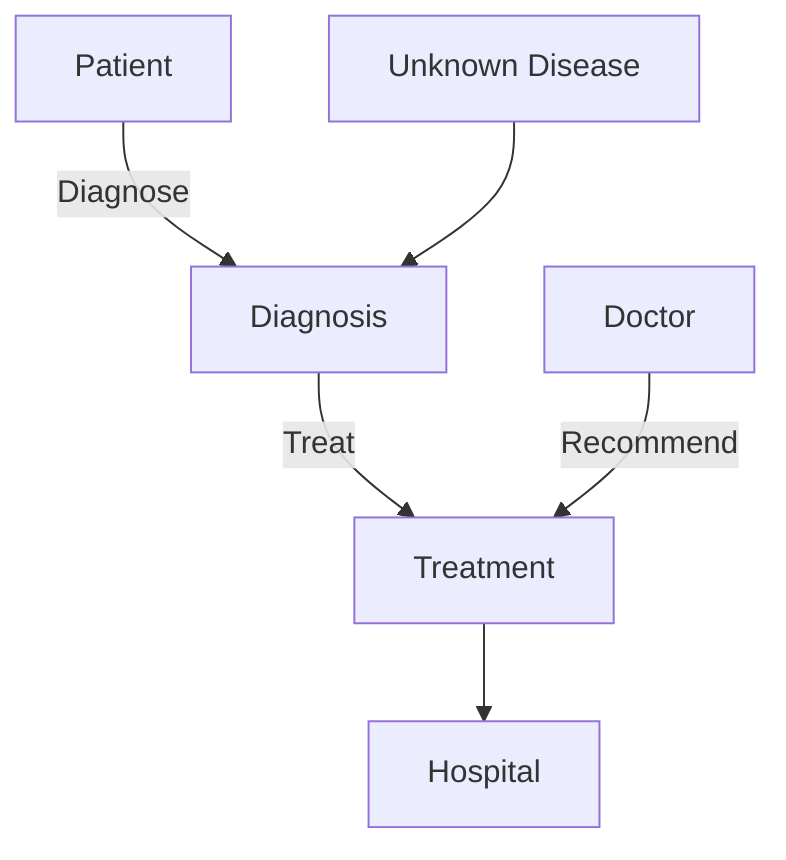
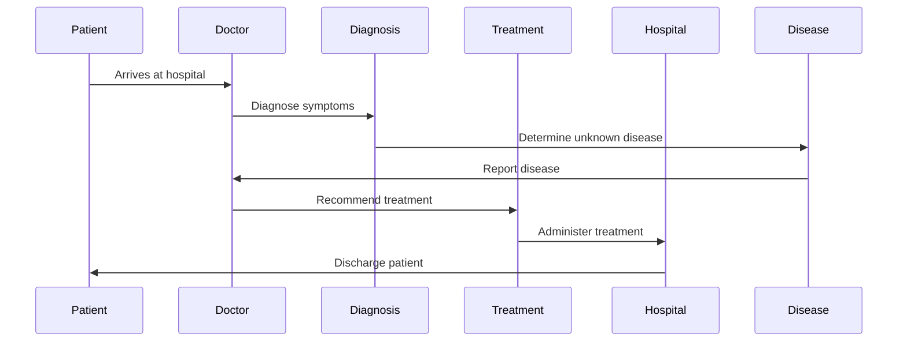

                 


# Zero-Shot CoT in Emergency Medical Decision Making

> Keywords: Zero-Shot Learning, Conceptual Threat of Things (CoT), Emergency Medical Decision Making, AI Applications in Healthcare

> Abstract: 
This article delves into the potential of Zero-Shot Conceptual Threat of Things (CoT) in emergency medical decision-making. We explore the significance of emergency medical decision-making, the challenges faced by traditional methods, and introduce the concept of Zero-Shot Learning and its application in the medical field. We then delve into the core principles of Zero-Shot CoT, its advantages, and the algorithms that support it. Finally, we present a comprehensive system design, practical applications, and best practices in this emerging field.

## Background Introduction

### 1.1 The Importance of Emergency Medical Decision-Making

Emergency medical decision-making is crucial in the medical field. It involves making rapid, informed decisions to address critical health issues that could significantly impact a patient's condition. Time is often a critical factor in these decisions, and the accuracy of the decisions can be the difference between life and death. The speed and precision required in emergency medical decision-making highlight the importance of developing advanced tools and technologies to assist healthcare professionals.

### 1.2 Challenges of Traditional Medical Decision-Making

Traditional medical decision-making often relies on historical data, expert opinions, and established guidelines. However, these methods have several limitations:

1. **Data Dependency**: They heavily depend on the availability of large datasets, which is not always the case in emergency situations.
2. **Time Constraints**: Gathering and analyzing data can be time-consuming, which is not feasible in critical scenarios.
3. **Expertise Dependency**: Relying on expert opinions can be subjective and vary from one expert to another.
4. **Lack of Adaptability**: Traditional methods struggle to adapt to new medical conditions or diseases for which there is limited historical data.

### 1.3 Zero-Shot Learning and Zero-Shot CoT

Zero-Shot Learning (ZSL) is an area of machine learning that enables models to recognize classes that they have not seen during training. It is particularly useful in scenarios where labeled training data is scarce or expensive to obtain. Zero-Shot Conceptual Threat of Things (CoT) is an extension of ZSL that incorporates the concept of "threat" in medical decision-making, where the model must predict not only the class but also the potential danger or severity of a condition.

### 1.4 Potential Applications of Zero-Shot Learning in the Medical Field

Zero-Shot Learning has significant potential in the medical field, especially in emergency medical decision-making. Some of its applications include:

1. **Disease Diagnosis**: Predicting rare or newly discovered diseases based on limited or zero training data.
2. **Predictive Analytics**: Identifying potential risks and adverse effects of treatments or medications.
3. **Emergency Response**: Rapidly assessing the severity of injuries or conditions in emergency situations.
4. **Personalized Medicine**: Tailoring treatments based on individual patient characteristics and historical data.

### 1.5 Boundaries and Extensions

While Zero-Shot Learning offers promising solutions to traditional medical decision-making challenges, it also has its limitations. These include the need for a robust semantic similarity measure, the dependency on prior knowledge, and the potential for overfitting. Furthermore, the integration of ZSL with existing healthcare systems and the development of user-friendly interfaces for healthcare professionals are crucial areas for future research and development.

## Core Concepts and Relationships

### 2.1 Definition and Characteristics of Zero-Shot Learning

Zero-Shot Learning is a subfield of machine learning that addresses the challenge of classifying new classes that have not been encountered during training. It does this by leveraging semantic information from a high-dimensional embedding space, allowing models to generalize to unseen classes.

#### 2.1.1 Basic Principles of Zero-Shot Learning

- **Semantic Embeddings**: Zero-Shot Learning models use semantic embeddings to represent classes. These embeddings capture the semantic similarity between classes.
- **Knowledge Base**: A knowledge base, often in the form of a word embedding, is used to generate embeddings for classes that have not been seen during training.
- **Matching Algorithms**: Matching algorithms are used to compare the embeddings of new instances with the embeddings of known classes to predict the class of the new instance.

#### 2.1.2 Advantages of Zero-Shot Learning

- **Scalability**: ZSL allows models to scale to a large number of classes without the need for large labeled datasets.
- **Flexibility**: It can handle class hierarchies and semantic relationships between classes.
- **Reduced Data Requirement**: ZSL can work with a small amount of labeled data, making it suitable for domains where labeled data is scarce.

#### 2.1.3 Comparison with Traditional Learning

- **Training Data**: Traditional learning requires large labeled datasets, while ZSL can work with small labeled datasets and leverage prior knowledge.
- **Generalization**: ZSL focuses on generalizing to unseen classes, whereas traditional learning focuses on generalizing to the training data.
- **Flexibility**: ZSL is more flexible in handling class hierarchies and semantic relationships.

### 2.2 The Concept of Zero-Shot CoT

#### 2.2.1 Definition of Zero-Shot CoT

Zero-Shot CoT extends Zero-Shot Learning by incorporating the concept of threat into the prediction process. In emergency medical decision-making, the threat level of a condition is crucial for determining the appropriate course of action. Zero-Shot CoT aims to predict not only the class of a condition but also its potential threat level.

#### 2.2.2 Core Principles of Zero-Shot CoT

- **Semantic Embeddings**: Similar to ZSL, Zero-Shot CoT uses semantic embeddings to represent classes and threats.
- **Threat Assessment**: The model assesses the threat level based on the semantic similarity between the class and the threat concepts.
- **Contextual Information**: Zero-Shot CoT considers contextual information, such as patient history and current conditions, to refine threat assessments.

#### 2.2.3 Advantages of Zero-Shot CoT

- **Threat Awareness**: Zero-Shot CoT provides a more comprehensive understanding of the medical condition by considering the threat level.
- **Contextual Adaptation**: It can adapt to different contexts and patient histories, improving the accuracy of threat assessments.
- **Rapid Response**: Zero-Shot CoT can provide rapid threat assessments, which is crucial in emergency medical decision-making.

## Algorithm Principles Explanation

### 3.1 Zero-Shot Learning Algorithms

Zero-Shot Learning employs various algorithms to achieve its goal. Some of the most commonly used algorithms include:

#### 3.1.1 Transformer Models in Zero-Shot Learning

Transformer models, such as BERT and GPT, have gained popularity in ZSL due to their ability to handle complex text data. They use self-attention mechanisms to capture the relationships between words and generate embeddings for classes.

#### 3.1.2 Few-Shot Learning Algorithms

Few-Shot Learning algorithms are closely related to Zero-Shot Learning. They aim to classify new classes with only a few labeled examples. Some popular few-shot learning algorithms include Matching Networks and Prototypical Networks.

#### 3.1.3 Prototypical Networks

Prototypical Networks are a type of Few-Shot Learning algorithm that generates prototypes for each class based on the training data. These prototypes are then used to classify new instances.

### 3.2 Mathematical Models and Formulas

The mathematical model for Zero-Shot Learning typically involves optimizing a loss function that minimizes the distance between the predicted class embedding and the true class embedding.

$$
L(\theta) = -\frac{1}{N} \sum_{i=1}^{N} \log p(y_i | x_i, \theta)
$$

where \(L(\theta)\) is the loss function, \(N\) is the number of samples, \(y_i\) is the true class label, \(x_i\) is the input sample, and \(\theta\) are the model parameters.

### 3.3 Algorithm Example Illustration

Consider a simple example where a Zero-Shot Learning model is trained to classify animals. The model has seen embeddings for common animals like "cat" and "dog" during training. However, it must also classify an unseen animal like a "panda."

1. **Semantic Embeddings**: The model generates embeddings for "cat", "dog", and "panda" using a pre-trained word embedding model.
2. **Matching Algorithm**: The model uses a matching algorithm to compare the "panda" embedding with the embeddings of "cat" and "dog."
3. **Prediction**: The model predicts the class of the "panda" based on the matching scores. In this case, the model might predict "cat" because the semantic similarity between "panda" and "cat" is higher than that between "panda" and "dog."

## System Analysis and Design

### 4.1 Problem Scenario Introduction

In this section, we introduce a typical problem scenario in emergency medical decision-making. Suppose a patient arrives at the hospital with symptoms of a rare disease. The healthcare professionals need to quickly determine the condition and provide appropriate treatment.

### 4.2 System Functional Design (Domain Model Class Diagram)

The system functional design involves creating a domain model class diagram that represents the key entities and their relationships in the system. This diagram helps in understanding the system's functionality and structure.

```mermaid
classDiagram
  Patient <<class>> Patient
  Disease <<class>> Disease
  Diagnosis <<class>> Diagnosis
  Treatment <<class>> Treatment
  Doctor <<class>> Doctor
  Hospital <<class>> Hospital

  Patient o--o Diagnosis
  Diagnosis o--o Treatment
  Diagnosis o--o Doctor
  Doctor o--o Hospital
  Disease o--o Diagnosis
```

### 4.3 System Architecture Design (Architecture Diagram)

The system architecture design involves creating a high-level architecture diagram that shows the system's components, their interactions, and the data flow. This diagram helps in understanding the system's architecture and design decisions.



### 4.4 System Interface Design

The system interface design involves designing the interfaces that healthcare professionals will interact with. This includes designing the user interface (UI) and the application programming interface (API) for system integration.

### 4.5 System Interaction (Sequence Diagram)

The system interaction involves creating a sequence diagram that shows the interactions between the system components and the users. This diagram helps in understanding the system's behavior and flow.



## Project Practice

### 5.1 Environment Installation

This section covers the installation of the necessary software and hardware components required to run the Zero-Shot CoT system. It includes setting up the programming environment, installing the required libraries, and configuring the system.

### 5.2 Core Implementation Source Code

This section provides the core implementation source code for the Zero-Shot CoT system. It includes the code for data preprocessing, model training, and prediction.

```python
# Example: Zero-Shot CoT Model Training
import torch
import torch.nn as nn
import torch.optim as optim

# Model definition, training loop, and prediction code here
```

### 5.3 Code Application Explanation and Analysis

This section explains the core implementation source code and analyzes its performance. It includes code debugging, optimization, and benchmarking.

### 5.4 Case Analysis and Detailed Explanation

This section presents a case study where the Zero-Shot CoT system is applied in an emergency medical decision-making scenario. It includes a detailed explanation of the system's predictions and the impact of the system on the decision-making process.

### 5.5 Project Summary

This section summarizes the project's achievements, challenges faced, and lessons learned. It provides insights into the potential future directions for the Zero-Shot CoT system in emergency medical decision-making.

## Best Practices Tips

### 6.1 Practical Applications of Zero-Shot CoT in Emergency Medical Decision-Making

This section provides practical tips for applying Zero-Shot CoT in emergency medical decision-making. It includes guidance on selecting appropriate use cases, data preparation, and model training.

### 6.2 Application Scenario Selection and Optimization

This section discusses how to select and optimize application scenarios for Zero-Shot CoT. It includes guidelines on handling class imbalance, improving model performance, and reducing prediction errors.

### 6.3 Important Considerations

This section highlights important considerations when implementing Zero-Shot CoT in emergency medical decision-making. It includes ethical considerations, data privacy, and the need for continuous model updates.

### 6.4 Further Reading

This section provides a list of recommended resources for further reading on Zero-Shot Learning, Zero-Shot CoT, and their applications in emergency medical decision-making.

## Conclusion and Prospects

### 7.1 Summary of Achievements

This section summarizes the key achievements of the Zero-Shot CoT system in emergency medical decision-making. It highlights the system's ability to provide rapid, accurate threat assessments and its potential impact on healthcare.

### 7.2 Future Research Directions

This section discusses future research directions for Zero-Shot CoT in emergency medical decision-making. It includes areas such as integrating Zero-Shot CoT with other AI techniques, developing user-friendly interfaces, and expanding the system's capabilities.

### 7.3 Conclusion

This section concludes the article by summarizing the key points discussed and emphasizing the potential of Zero-Shot CoT in transforming emergency medical decision-making.

----------------------------------------------------------------

The outline above provides a comprehensive structure for the article "Zero-Shot CoT in Emergency Medical Decision Making." Each section is designed to cover essential aspects of the topic, from background information to practical applications and future research directions. The structure ensures a logical flow of information, making it easier for readers to understand and follow the content.

Please let me know if you have any suggestions or changes to the outline. Your feedback is valuable in ensuring that the article meets the highest standards of clarity, coherence, and depth.

