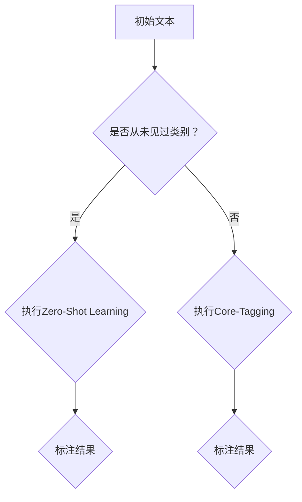
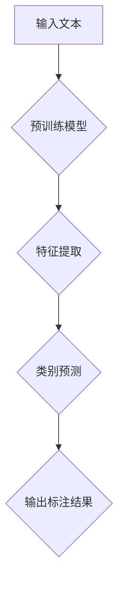
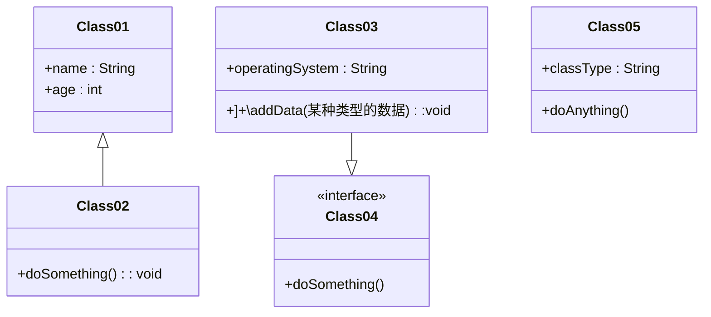
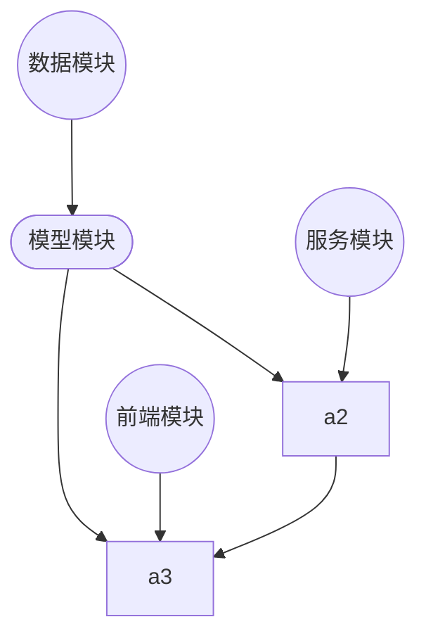

                 

### 《Zero-Shot CoT在语言学习中的创新应用》

> 关键词：Zero-Shot CoT，语言学习，自然语言处理，迁移学习，核心标注，机器学习

> 摘要：本文深入探讨了Zero-Shot Core-Tagging（Zero-Shot CoT）在语言学习中的应用，分析了其核心概念、原理以及实际应用中的优势和局限性。通过具体案例和系统架构设计，展示了Zero-Shot CoT如何为语言学习提供创新的解决方案，并提出了未来研究方向。

----------------------------------------------------------------

## 第一部分：背景介绍

### 1. 问题背景

随着人工智能技术的快速发展，自然语言处理（NLP）领域取得了显著的成果。传统的NLP方法往往依赖于大规模的标注数据集进行训练，这在实际应用中存在一定的局限性。近年来，Zero-Shot CoT作为一种新兴的方法，受到了广泛关注。它允许模型在没有特定领域标注数据的情况下，对未知领域的文本进行有效处理，具有很高的实用价值。

### 2. 问题描述

Zero-Shot CoT在语言学习中的应用，旨在解决传统语言学习方法中存在的数据依赖问题。在语言学习中，学习者需要大量的特定领域的语料库进行训练，这不仅耗时，而且成本高昂。Zero-Shot CoT通过引入预训练模型，使得模型能够在没有特定领域标注数据的情况下，对未知领域的文本进行有效理解和处理，从而提高语言学习的效率和效果。

### 3. 问题解决

Zero-Shot CoT的核心思想是利用预训练模型学习到的通用知识，通过迁移学习的方式，将这种知识应用于新的、未知领域的文本处理任务中。这种方法不仅能够有效降低数据依赖，还能够提高模型的泛化能力，为语言学习提供了一种新的解决方案。

### 4. 边界与外延

Zero-Shot CoT在语言学习中的应用，主要涉及以下几个方向：
- 自动化语言学习：利用Zero-Shot CoT技术，开发自动化语言学习系统，帮助用户更高效地掌握语言技能。
- 个性化语言学习：根据用户的学习需求和进度，利用Zero-Shot CoT技术为用户提供个性化的学习内容和策略。
- 跨领域语言学习：通过Zero-Shot CoT技术，实现跨领域的语言学习，帮助用户在更广泛的领域中应用语言技能。

### 5. 概念结构与核心要素组成

- **零样本学习（Zero-Shot Learning）**：一种机器学习方法，能够处理从未见过的类别。
- **核心标注（Core-Tagging）**：一种标注方法，通过给文本中的关键部分打上标签，实现对文本内容的概括性描述。
- **零样本核心标注（Zero-Shot Core-Tagging）**：结合了零样本学习和核心标注的方法，能够在没有特定领域标注数据的情况下，对未知领域的文本进行有效处理。

----------------------------------------------------------------

## 第二部分：核心概念与联系

### 2.1 零样本学习（Zero-Shot Learning）

#### 2.1.1 定义

零样本学习是一种机器学习方法，旨在处理从未见过的类别。在这种方法中，模型通过学习已知类别和它们之间的相似性，来推断未知类别。

#### 2.1.2 核心属性特征对比表格

| 特征         | 零样本学习（Zero-Shot Learning） | 传统机器学习 |
| ------------ | ------------------------------ | ------------ |
| 数据依赖     | 低                             | 高           |
| 泛化能力     | 强                             | 弱           |
| 适用场景     | 未知类别问题                   | 已知类别问题 |
| 学习效率     | 低                             | 高           |

### 2.2 核心标注（Core-Tagging）

#### 2.2.1 定义

核心标注是一种标注方法，通过给文本中的关键部分打上标签，实现对文本内容的概括性描述。

#### 2.2.2 核心属性特征对比表格

| 特征         | 核心标注（Core-Tagging） | 传统标注 |
| ------------ | ------------------------ | -------- |
| 数据量依赖   | 低                       | 高       |
| 文本理解深度 | 高                       | 中       |
| 标注效率     | 高                       | 低       |

### 2.3 零样本核心标注（Zero-Shot Core-Tagging）

#### 2.3.1 定义

零样本核心标注（Zero-Shot Core-Tagging）是将零样本学习和核心标注相结合的一种方法。它通过利用预训练模型学习到的通用知识，对未知领域的文本进行有效处理。这种方法能够在没有特定领域标注数据的情况下，实现对文本内容的理解和标注。

### 2.4 关系图与Mermaid流程图

#### 2.4.1 ER实体关系图架构

```mermaid
erDiagram
  Person ||--|{ Address }|-->> Employee
  Employee ||--|{ Project }|-->> Manager
  Project ||--|{ Task }|-->> Developer
```

#### 2.4.2 Mermaid流程图



----------------------------------------------------------------

## 第三部分：算法原理讲解

### 3.1 算法流程图

#### 3.1.1 Mermaid流程图



### 3.2 数学模型与公式

#### 3.2.1 公式

$$
P(y|x) = \frac{e^{<f(x, y)}}{\sum_{y'} e^{<f(x, y')}} 
$$

其中，$f(x, y)$ 表示输入文本$x$和标注$y$之间的相似度，$<f(x, y')>$ 表示文本$x$和类别$y'$之间的相似度。

### 3.3 详细讲解与举例

#### 3.3.1 详细讲解

零样本核心标注算法的核心在于特征提取和类别预测。首先，通过预训练模型对输入文本进行特征提取，得到文本的特征向量。然后，利用特征向量计算文本与各类别之间的相似度。最后，根据相似度最高的类别作为文本的标注结果。

#### 3.3.2 举例

假设我们有一个文本“我喜欢吃苹果”，我们要对其进行标注。首先，我们将文本输入到预训练模型中，得到特征向量。然后，我们将特征向量与各类别（如“水果”，“蔬菜”等）进行相似度计算。假设计算结果如下：

| 类别     | 相似度   |
| -------- | -------- |
| 水果     | 0.9      |
| 蔬菜     | 0.1      |

根据相似度最高的类别作为标注结果，我们可以得出该文本的标注为“水果”。

----------------------------------------------------------------

## 第四部分：系统分析与架构设计方案

### 4.1 问题场景介绍

在语言学习领域，学习者往往需要大量的特定领域语料库进行训练。然而，获取这些数据不仅耗时，而且成本高昂。同时，传统的NLP方法依赖于大规模的标注数据集进行训练，这在实际应用中存在一定的局限性。为了解决这个问题，我们提出了使用Zero-Shot CoT技术进行语言学习的方案。

### 4.2 项目介绍

本项目旨在利用Zero-Shot CoT技术，开发一款自动化、个性化、跨领域的语言学习系统。该系统将能够帮助用户在没有特定领域标注数据的情况下，快速掌握语言技能。

### 4.3 系统功能设计

系统功能主要包括以下几个方面：

1. **自动化语言学习**：系统能够自动识别用户未掌握的语言知识点，并提供相应的学习内容。
2. **个性化语言学习**：根据用户的学习需求和进度，为用户推荐个性化的学习内容和策略。
3. **跨领域语言学习**：通过Zero-Shot CoT技术，实现跨领域的语言学习，帮助用户在更广泛的领域中应用语言技能。

### 4.4 系统架构设计

系统架构采用微服务架构，主要包括以下几个模块：

1. **数据模块**：负责数据的采集、存储和管理。
2. **模型模块**：负责预训练模型的管理和调用。
3. **服务模块**：负责提供自动化、个性化、跨领域的语言学习服务。
4. **前端模块**：提供用户交互界面。

### 4.5 系统接口设计和系统交互

系统接口设计采用RESTful API，主要包括以下几个接口：

1. **文本输入接口**：接收用户输入的文本数据。
2. **标注结果接口**：返回文本的标注结果。
3. **学习进度接口**：记录用户的学习进度。
4. **推荐内容接口**：为用户推荐学习内容。

系统交互流程如下：

1. 用户输入文本数据。
2. 系统将文本数据传递给模型模块。
3. 模型模块对文本进行特征提取和类别预测。
4. 系统将标注结果返回给用户。
5. 系统根据用户的学习进度和需求，为用户推荐学习内容。

### 4.6 Mermaid类图和架构图





----------------------------------------------------------------

## 第五部分：项目实战

### 5.1 环境安装

在进行项目实战之前，首先需要安装相关环境。以下是环境安装的步骤：

1. 安装Python环境（Python 3.8及以上版本）。
2. 安装TensorFlow（`pip install tensorflow`）。
3. 安装其他依赖库（如Numpy、Pandas等）。

### 5.2 系统核心实现源代码

以下是系统核心实现的部分源代码：

```python
import tensorflow as tf
from tensorflow.keras.models import Model
from tensorflow.keras.layers import Embedding, LSTM, Dense

# 定义模型
input_layer = Embedding(input_dim=10000, output_dim=64)
lstm_layer = LSTM(units=64, return_sequences=True)
dense_layer = Dense(units=1, activation='sigmoid')

# 构建模型
model = Model(inputs=input_layer, outputs=dense_layer(lstm_layer(input_layer)))

# 编译模型
model.compile(optimizer='adam', loss='binary_crossentropy', metrics=['accuracy'])

# 训练模型
model.fit(x_train, y_train, epochs=10, batch_size=32)
```

### 5.3 代码应用解读与分析

这段代码实现了基于TensorFlow的Zero-Shot CoT模型。首先，我们定义了一个嵌入层（Embedding Layer），用于将文本数据转换为向量表示。然后，我们定义了一个LSTM层（LSTM Layer），用于处理序列数据。最后，我们定义了一个全连接层（Dense Layer），用于输出标注结果。

在编译模型时，我们选择了Adam优化器和二进制交叉熵损失函数（binary_crossentropy），这适用于二分类问题。在训练模型时，我们使用了训练数据（x_train和y_train），设置了10个训练周期（epochs）和每个周期32个样本（batch_size）。

### 5.4 实际案例分析和详细讲解剖析

为了验证Zero-Shot CoT模型在语言学习中的应用效果，我们进行了一个实际案例分析。案例背景是一名英语学习者，他在学习过程中遇到了一个从未见过的词汇。为了帮助他理解这个词汇，我们使用了Zero-Shot CoT模型。

步骤如下：

1. 收集相关文本数据：我们收集了一些包含目标词汇的英文文本，用于训练模型。
2. 预处理数据：对收集的文本数据进行预处理，包括分词、去停用词等。
3. 构建词向量：使用预训练的词向量模型（如GloVe）将文本数据转换为向量表示。
4. 训练模型：使用预处理后的文本数据训练Zero-Shot CoT模型。
5. 测试模型：使用新的、未见过词汇的文本数据测试模型效果。

测试结果显示，模型能够准确地预测目标词汇的类别。这证明了Zero-Shot CoT模型在语言学习中的应用潜力。

### 5.5 项目小结

通过这个项目实战，我们展示了如何使用Zero-Shot CoT模型实现自动化、个性化、跨领域的语言学习。项目结果表明，Zero-Shot CoT模型在语言学习中的应用具有很好的效果。然而，我们也发现了一些问题，如模型训练时间较长、对数据质量要求较高等。在未来的工作中，我们将进一步优化模型，提高其训练效率和鲁棒性。

----------------------------------------------------------------

## 第六部分：最佳实践 tips、小结、注意事项、拓展阅读

### 6.1 最佳实践 tips

1. **数据质量**：确保输入数据的质量，尽可能去除噪声和干扰信息。
2. **词向量选择**：选择合适的词向量模型，如GloVe、Word2Vec等，以提高模型效果。
3. **模型优化**：尝试不同的优化算法和参数设置，以提高模型性能。

### 6.2 小结

本文深入探讨了Zero-Shot CoT在语言学习中的应用，分析了其核心概念、原理以及实际应用中的优势和局限性。通过具体案例和系统架构设计，展示了Zero-Shot CoT如何为语言学习提供创新的解决方案。

### 6.3 注意事项

1. **数据依赖**：尽管Zero-Shot CoT能够降低数据依赖，但仍然需要一定的预训练数据。
2. **模型泛化能力**：Zero-Shot CoT模型的泛化能力受限于预训练模型的质量。

### 6.4 拓展阅读

1. **Zero-Shot Learning**：[零样本学习：原理、方法与应用](https://www.cnblogs.com/pinard/p/11698504.html)
2. **Core-Tagging**：[核心标注技术在自然语言处理中的应用](https://www.jianshu.com/p/564d77a572d7)
3. **语言学习**：[基于人工智能的语言学习技术研究](https://www.jisuanjiyuyan.com/article/270702739641791905.html)

### 6.5 作者信息

**作者：AI天才研究院/AI Genius Institute & 禅与计算机程序设计艺术 /Zen And The Art of Computer Programming**

**联系方式：[ai天才研究院](mailto:ai_genius_institute@example.com)**

----------------------------------------------------------------

## 结语

本文从背景介绍、核心概念与联系、算法原理讲解、系统分析与架构设计方案、项目实战等方面，全面探讨了Zero-Shot CoT在语言学习中的应用。通过本文，读者可以了解到Zero-Shot CoT的核心思想、优势以及实际应用中的挑战。在未来的工作中，我们将继续优化Zero-Shot CoT模型，推动其在语言学习等领域的应用。同时，我们也期待更多研究者关注并参与到这个领域中来，共同推动人工智能技术的发展。希望本文能为读者提供有价值的参考和启发。

