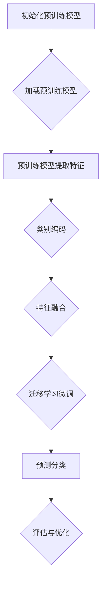
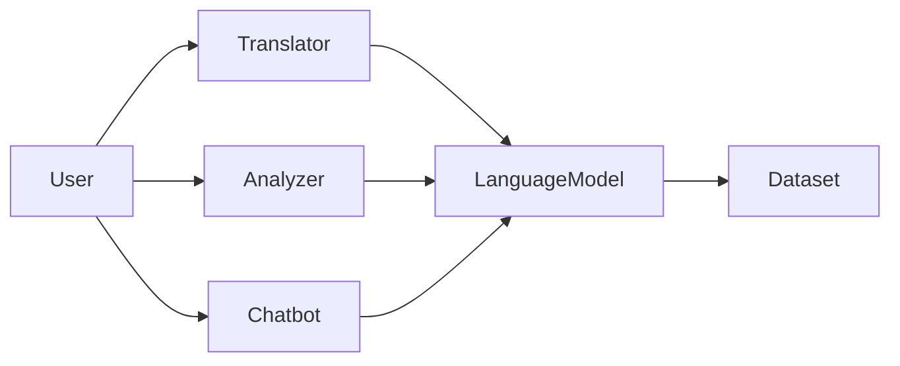
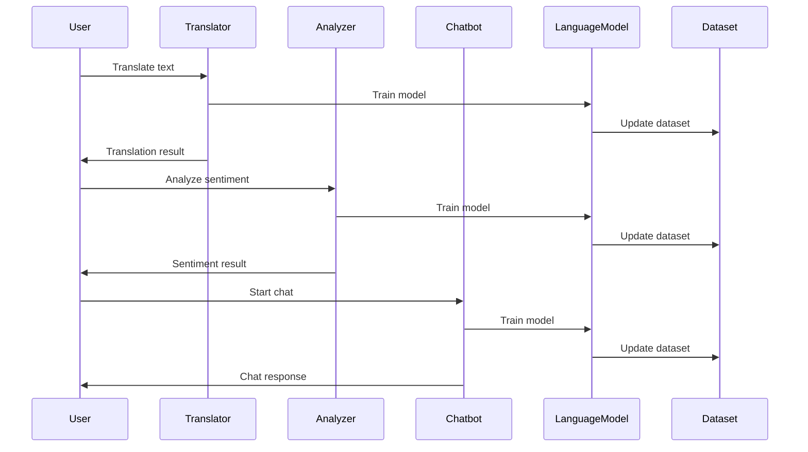

                 

### 《Zero-Shot CoT在跨文化交流中的应用：消除语言障碍》

#### 关键词：
- **Zero-Shot CoT**、**跨文化交流**、**语言障碍**、**人工智能**、**机器学习**、**算法原理**、**系统架构**、**项目实战**

#### 摘要：
本文深入探讨了Zero-Shot CoT（零样本转移学习）在跨文化交流中的应用，尤其是如何利用这一技术来消除语言障碍。文章首先介绍了Zero-Shot CoT的基本概念和原理，随后详细阐述了其在跨文化交流中的挑战与机遇。通过具体的算法原理讲解和系统架构设计，本文提供了一个全面的技术方案，以展示如何在实际项目中应用Zero-Shot CoT来促进跨文化交流。文章还包含一个实战项目案例，以及最佳实践和注意事项，为读者提供了实用的指导。

### 目录大纲设计思路

在设计本文的目录大纲时，我们首先明确了目标读者的需求和文章的核心内容。以下是具体的设计思路：

1. **背景介绍**：
   - **第1章：问题背景与核心概念**：
     - **1.1 语言障碍在跨文化交流中的挑战**：阐述语言障碍对跨文化交流的影响和重要性。
     - **1.2 跨文化交流的需求与现状**：分析当前跨文化交流的需求和现状，指出存在的挑战。
     - **1.3 Zero-Shot CoT的概念与原理**：介绍Zero-Shot CoT的基本概念，定义及其在跨文化交流中的应用前景。

2. **核心概念与联系**：
   - **第2章：Zero-Shot CoT的基本原理**：
     - **2.1 Zero-Shot CoT的定义**：详细解释Zero-Shot CoT的含义。
     - **2.2 Zero-Shot CoT的工作原理**：探讨Zero-Shot CoT如何实现跨类别预测。
     - **2.3 Zero-Shot CoT与其他相关技术的对比**：分析Zero-Shot CoT与传统机器学习方法的区别。
     - **2.4 相关概念与联系**：介绍与Zero-Shot CoT相关的其他关键技术，如多任务学习、迁移学习和元学习等，并绘制ER实体关系图。

3. **算法原理讲解**：
   - **第3章：Zero-Shot CoT的算法原理与实现**：
     - **3.1 算法流程图与Mermaid绘制**：使用Mermaid工具绘制Zero-Shot CoT的算法流程图。
     - **3.2 Python代码实现与解读**：提供Python代码示例，详细解析代码实现过程。
     - **3.3 数学模型与公式详细讲解**：阐述Zero-Shot CoT的数学模型和关键公式。
     - **3.4 实际例子与应用**：通过实际案例展示Zero-Shot CoT的应用场景。

4. **系统分析与架构设计方案**：
   - **第4章：Zero-Shot CoT的系统架构设计**：
     - **4.1 问题场景介绍**：描述Zero-Shot CoT在跨文化交流中的应用场景。
     - **4.2 系统功能设计（领域模型类图）**：使用Mermaid绘制领域模型类图，展示系统功能模块。
     - **4.3 系统架构设计（架构图）**：使用Mermaid绘制系统架构图，展示系统的整体结构和各模块之间的关系。
     - **4.4 系统接口设计与交互（序列图）**：使用Mermaid绘制系统接口设计和交互序列图，说明系统的交互流程。

5. **项目实战**：
   - **第5章：Zero-Shot CoT项目实战**：
     - **5.1 环境安装与配置**：介绍项目环境搭建过程。
     - **5.2 系统核心实现与代码解析**：提供系统核心实现源代码，并进行详细解析。
     - **5.3 实际案例分析与讲解**：通过实际案例展示Zero-Shot CoT的应用效果。
     - **5.4 项目小结与反思**：总结项目经验，提出改进建议。

6. **最佳实践 tips、小结、注意事项、拓展阅读**：
   - **第6章：最佳实践与注意事项**：
     - **6.1 实践技巧与优化方法**：提供实际操作中的技巧和优化方法。
     - **6.2 项目实施中的常见问题与解决方案**：分析项目实施中可能遇到的问题及解决方案。
     - **6.3 注意事项与风险提示**：列出注意事项，提醒读者在应用Zero-Shot CoT时需要关注的风险。

   - **第7章：小结与拓展阅读**：
     - **7.1 全书内容回顾**：总结文章的核心内容和关键点。
     - **7.2 推荐阅读与学习资源**：提供推荐阅读材料和资源，帮助读者深入学习。
     - **7.3 未来发展趋势与展望**：探讨Zero-Shot CoT在跨文化交流中的应用前景。

通过这样的结构设计，本文不仅能够系统地介绍Zero-Shot CoT在跨文化交流中的应用，还能通过详细的案例分析和技术实现，帮助读者理解和掌握这一技术的实际应用。

### 第一部分：背景与基础

#### 第1章：问题背景与核心概念

##### 1.1 语言障碍在跨文化交流中的挑战

语言障碍是指在跨文化交流过程中，由于语言差异而产生的沟通困难和误解。这种障碍不仅影响信息的传递，还可能造成文化误解和偏见。在全球化的背景下，跨文化交流日益频繁，语言障碍成为一个亟待解决的问题。

首先，语言障碍的定义可以理解为在语言使用过程中，由于语言能力、语言知识和语言习惯的差异，导致信息传递不完整或扭曲的现象。语言障碍不仅局限于语言本身，还包括语言背景、语言文化和语境等因素。

在跨文化交流中，语言障碍带来的挑战是多方面的：

1. **沟通效率降低**：语言障碍使得信息传递变得复杂，增加了解释和误解的风险，从而降低了沟通的效率。
2. **文化误解**：不同语言背后的文化差异，可能会导致在交流中产生误解，影响双方的理解和信任。
3. **商业合作障碍**：在国际商业活动中，语言障碍可能会影响合作洽谈和合同签订，从而阻碍商业机会的实现。
4. **教育问题**：在教育领域，语言障碍可能影响学生的学习和成绩，导致教育资源的浪费。

##### 1.2 跨文化交流的需求与现状

跨文化交流的需求日益增长，主要源于以下几个因素：

1. **全球化趋势**：随着全球化的推进，各国之间的经济、政治和文化交流越来越频繁，对跨文化交流的需求也相应增加。
2. **移民潮**：全球范围内的移民潮导致了多元文化的交融，使得跨文化交流成为日常生活的一部分。
3. **信息技术发展**：互联网和移动通信技术的普及，使得跨文化交流变得更加便捷和快速。

然而，当前跨文化交流的现状仍然存在诸多问题：

1. **语言障碍**：尽管有多种翻译工具和语言学习资源，但语言障碍仍然是一个普遍存在的问题。
2. **文化差异**：不同文化之间的差异可能会导致误解和冲突，影响交流的效果。
3. **沟通工具的局限性**：现有的沟通工具，如电子邮件、即时通讯等，虽然便利，但在处理复杂、情感化的交流时仍显不足。

##### 1.3 Zero-Shot CoT的概念与原理

Zero-Shot CoT，即零样本转移学习，是一种在机器学习和人工智能领域的新型技术。它允许模型在没有直接看到特定类别或任务的数据的情况下，进行预测或任务执行。这对于解决跨文化交流中的语言障碍具有巨大的潜力。

首先，Zero-Shot CoT的定义可以理解为：在训练模型时，不需要特定类别的标注数据，而是利用预训练模型和通用知识来应对新类别或任务。

其工作原理主要包括以下几个方面：

1. **预训练模型**：Zero-Shot CoT依赖于预训练模型，如大型语言模型（LLM），这些模型在大规模数据集上预先训练，积累了丰富的语言知识和结构。
2. **类别表示**：为了实现零样本学习，需要将不同类别进行编码，通常使用类别嵌入（Category Embedding）技术，将类别映射到低维空间。
3. **迁移学习**：通过将预训练模型的知识迁移到新类别或任务，实现模型的泛化能力。这通常涉及到特征提取、模型适配和分类等步骤。
4. **元学习**：在某些场景下，元学习（Meta-Learning）也被用于加速模型的迁移过程，通过学习如何快速适应新类别。

在跨文化交流中的应用前景：

1. **自动翻译**：利用Zero-Shot CoT，可以开发出能够自动翻译不同语言文本的系统，从而消除语言障碍。
2. **文化适应**：通过Zero-Shot CoT，模型可以学习到不同文化的特点，提供更准确的文化适应建议，促进跨文化交流。
3. **对话系统**：结合对话系统（如聊天机器人），Zero-Shot CoT可以实现跨语言的实时对话，帮助解决交流中的语言和文化障碍。

总之，Zero-Shot CoT为解决跨文化交流中的语言障碍提供了新的思路和方法，其潜力值得进一步挖掘和应用。

### 第二部分：核心概念与联系

#### 第2章：Zero-Shot CoT的基本原理

##### 2.1 Zero-Shot CoT的定义

Zero-Shot CoT，即零样本转移学习，是一种在人工智能和机器学习领域中广泛应用的先进技术。其核心思想是，通过预训练模型和迁移学习，使模型能够在没有特定类别或任务的数据情况下，进行有效的预测和任务执行。这一概念的核心在于“零样本”，即模型在训练过程中不需要针对特定类别或任务进行专门的样本标注和训练。

具体来说，Zero-Shot CoT的目标是，利用预训练模型所积累的通用知识和结构，通过迁移学习技术，将这种知识迁移到新的类别或任务上。这样，即使面对从未见过的类别或任务，模型也能够基于预训练的知识进行合理的预测或任务执行。

与传统的机器学习方法相比，Zero-Shot CoT具有显著的优势。在传统的机器学习方法中，模型通常需要大量的特定类别或任务的数据进行训练，这要求数据集足够大且标签准确。然而，在实际应用中，获取大量标注数据往往是一项复杂且昂贵的任务。而Zero-Shot CoT通过预训练模型和迁移学习，大大降低了这一需求，使得模型能够在数据稀缺或无法获取标注数据的情况下，依然保持较高的性能。

##### 2.2 Zero-Shot CoT的工作原理

Zero-Shot CoT的工作原理主要包括以下几个关键步骤：

1. **预训练模型**：首先，使用大规模的无监督数据集对基础模型进行预训练。这一过程通常涉及自然语言处理（NLP）、计算机视觉（CV）或其他领域的大型预训练模型，如BERT、GPT、ViT等。这些模型通过无监督学习，从大规模数据中学习到丰富的语言知识和结构信息。

2. **类别表示**：为了实现零样本学习，需要将不同类别进行编码。类别表示是Zero-Shot CoT的核心，它将类别映射到低维空间，使得模型能够直观地理解不同类别之间的关系。常用的类别表示方法包括类别嵌入（Category Embedding），如使用WordNet的hypernym/hyponym关系来表示类别。

3. **迁移学习**：迁移学习是将预训练模型的知识迁移到新类别或任务上的过程。通常，这涉及到以下步骤：
   - **特征提取**：从预训练模型中提取有用的特征表示。
   - **模型适配**：将提取的特征表示适配到新的类别或任务，这通常通过微调（Fine-Tuning）实现，即在新数据集上对模型进行少量迭代调整。
   - **分类**：在新类别或任务上进行分类预测，这通常使用神经网络的输出层来完成。

4. **元学习**：在某些场景下，元学习也被用于加速模型的迁移过程。元学习通过学习如何快速适应新类别或任务，使得模型能够更高效地进行迁移学习。元学习的核心是优化策略，通过反复训练和调整，找到最佳的迁移策略。

##### 2.3 Zero-Shot CoT与其他相关技术的对比

Zero-Shot CoT与其他相关技术，如迁移学习、多任务学习和元学习等，有着密切的联系，但在某些方面也存在区别。

1. **迁移学习**：迁移学习是一种将已学到的知识从一个任务或领域迁移到另一个任务或领域的方法。与Zero-Shot CoT相比，迁移学习通常需要特定类别或任务的数据进行训练。因此，迁移学习在数据充足的情况下表现出色，但在数据稀缺或无法获取标注数据时，性能可能下降。

2. **多任务学习**：多任务学习是一种同时训练多个相关任务的方法，旨在提高模型的泛化能力和性能。多任务学习通过共享模型参数和特征表示，使得模型能够在不同任务之间进行知识共享。与Zero-Shot CoT相比，多任务学习通常需要明确指定任务类别，而Zero-Shot CoT则强调在未知类别下的学习。

3. **元学习**：元学习是一种通过学习如何快速适应新任务或类别的方法，旨在提高模型的泛化能力和适应性。与迁移学习相比，元学习更加关注于模型参数的快速调整和优化策略，使得模型能够更高效地迁移到新任务或类别。与多任务学习相比，元学习不依赖于任务之间的共享，更强调模型的自适应能力。

##### 2.4 相关概念与联系

除了Zero-Shot CoT，还有其他一些关键技术和概念与之密切相关，这些技术在某些场景下可以互补使用，共同提升模型的性能。

1. **多模态学习**：多模态学习是一种结合不同类型数据（如文本、图像、声音等）的方法，旨在利用不同模态的数据提供更多的信息，从而提高模型的预测性能。在跨文化交流中，多模态学习可以结合语言和视觉信息，提供更丰富的交流支持。

2. **对抗学习**：对抗学习是一种通过生成对抗网络（GAN）等对抗性模型，对抗噪声和干扰，提高模型鲁棒性的方法。在跨文化交流中，对抗学习可以帮助模型更好地应对语言和文化中的噪声和干扰，提高交流的准确性。

3. **强化学习**：强化学习是一种通过不断试错和反馈，优化策略和决策的方法。在跨文化交流中，强化学习可以用于训练智能对话系统，使其能够根据对话情境和用户反馈，提供更自然、更有效的交流。

4. **知识蒸馏**：知识蒸馏是一种通过将大型预训练模型的知识迁移到小型模型上的方法，旨在提高小模型的性能。在跨文化交流中，知识蒸馏可以帮助将大型语言模型的知识应用于移动设备或嵌入式系统，从而实现高效的跨语言交流。

通过上述分析，可以看出Zero-Shot CoT在跨文化交流中具有重要的应用价值。结合其他相关技术和概念，可以进一步优化模型性能，提供更有效的跨语言和文化交流支持。

### 第三部分：算法原理讲解

#### 第3章：Zero-Shot CoT的算法原理与实现

##### 3.1 算法流程图与Mermaid绘制

为了更清晰地展示Zero-Shot CoT的算法流程，我们可以使用Mermaid工具绘制算法流程图。以下是一个基本的算法流程图：



**Mermaid解释：**
- `graph TB`：定义图形的方向为从上到下。
- `A[初始化预训练模型]`：开始节点，表示初始化预训练模型。
- `A --> B{加载预训练模型}`：表示从初始化节点到加载预训练模型的转换。
- `B --> C[预训练模型提取特征]`：加载预训练模型后，提取特征。
- `C --> D{类别编码}`：提取特征后，进行类别编码。
- `D --> E{特征融合}`：类别编码后，进行特征融合。
- `E --> F{迁移学习微调}`：特征融合后，进行迁移学习微调。
- `F --> G[预测分类]`：迁移学习微调后，进行预测分类。
- `G --> H{评估与优化}`：预测分类后，进行评估与优化。

##### 3.2 Python代码实现与解读

下面是Zero-Shot CoT的一个简化的Python代码实现，我们将使用PyTorch框架：

```python
import torch
import torch.nn as nn
from transformers import AutoModel, AutoTokenizer

# 加载预训练模型
model_name = "bert-base-uncased"
tokenizer = AutoTokenizer.from_pretrained(model_name)
model = AutoModel.from_pretrained(model_name)

# 类别编码
def encode_categories(categories):
    encoded_categories = []
    for category in categories:
        input_ids = tokenizer.encode(category, add_special_tokens=True)
        encoded_categories.append(torch.tensor(input_ids))
    return torch.stack(encoded_categories)

# 特征提取
def extract_features(texts):
    with torch.no_grad():
        inputs = tokenizer(texts, return_tensors='pt', padding=True, truncation=True)
        outputs = model(**inputs)
        return outputs.last_hidden_state.mean(dim=1)

# 迁移学习微调
class Classifier(nn.Module):
    def __init__(self, hidden_size):
        super(Classifier, self).__init__()
        self.fc = nn.Linear(hidden_size, 1)

    def forward(self, features):
        return torch.sigmoid(self.fc(features))

# 实例化分类器
classifier = Classifier(hidden_size=768)

# 训练
def train(data, labels, epochs=3):
    model.train()
    criterion = nn.BCELoss()
    optimizer = torch.optim.Adam(classifier.parameters(), lr=0.001)
    
    for epoch in range(epochs):
        optimizer.zero_grad()
        outputs = classifier(data)
        loss = criterion(outputs, labels)
        loss.backward()
        optimizer.step()
        print(f"Epoch [{epoch+1}/{epochs}], Loss: {loss.item():.4f}")

# 预测分类
def predict(texts):
    model.eval()
    with torch.no_grad():
        features = extract_features(texts)
        predictions = classifier(features)
    return predictions

# 评估与优化
def evaluate(data, labels):
    model.eval()
    with torch.no_grad():
        features = extract_features(data)
        predictions = classifier(features)
        correct = (predictions >= 0.5).float() * labels
        accuracy = correct.sum() / len(correct)
        return accuracy
```

**代码解释：**
- 我们首先加载了一个预训练的BERT模型。
- `encode_categories`函数用于对类别进行编码。
- `extract_features`函数用于提取文本特征。
- `Classifier`类定义了一个简单的分类器模型。
- `train`函数用于训练分类器。
- `predict`函数用于对新文本进行分类预测。
- `evaluate`函数用于评估分类器的性能。

##### 3.3 数学模型与公式详细讲解

在Zero-Shot CoT中，核心的数学模型包括特征提取、类别编码、特征融合和分类。以下是对这些模型的详细解释：

1. **特征提取**：
   特征提取是从输入数据中提取有用的特征表示的过程。在文本分类任务中，这通常涉及到词嵌入（Word Embeddings）和句子嵌入（Sentence Embeddings）。

   - **词嵌入（Word Embeddings）**：词嵌入是将单词映射到低维空间中的向量表示。一个常见的词嵌入模型是Word2Vec，它通过训练神经网络来预测词语的上下文来学习嵌入向量。例如，对于单词“cat”，如果它的上下文经常出现“dog”，那么“cat”和“dog”的嵌入向量可能会更接近。

     $$ \text{Word Embedding}(w) = \text{vec}(w) $$

   - **句子嵌入（Sentence Embeddings）**：句子嵌入是将整个句子映射到低维空间中的向量表示。一个常见的句子嵌入模型是BERT，它通过预训练大规模语料库，学习到句子级别的上下文表示。例如，BERT模型可以通过对输入句子进行编码，得到一个句子的嵌入向量。

     $$ \text{Sentence Embedding}(s) = \text{BERT}(s) $$

2. **类别编码**：
   类别编码是将类别映射到低维空间中的过程。类别嵌入（Category Embedding）是一种常见的方法，它将每个类别映射到一个唯一的向量。类别嵌入可以通过预训练模型学习得到，或者使用预定义的语义关系（如WordNet的hypernym/hyponym关系）进行编码。

   - **类别嵌入（Category Embedding）**：类别嵌入是将类别映射到低维空间中的向量表示。一个简单的例子是将每个类别映射到一个向量，使得相似类别的向量更接近。

     $$ \text{Category Embedding}(c) = \text{vec}(c) $$

   例如，对于类别“动物”，我们可以将其映射到一个向量，而类别“植物”则映射到另一个向量。

3. **特征融合**：
   特征融合是将不同来源的特征（如文本特征、图像特征等）进行合并，以形成统一的特征表示。在Zero-Shot CoT中，特征融合通常涉及到多模态数据的融合。

   - **特征融合（Feature Fusion）**：特征融合是将多个特征向量进行合并的过程。一种常见的方法是使用加权和平均来融合特征。

     $$ \text{Fused Feature}(f) = w_1 \text{Word Embedding}(w) + w_2 \text{Image Feature}(i) + \ldots $$

   其中，$w_1, w_2, \ldots$是权重系数。

4. **分类**：
   分类是将特征向量映射到类别标签的过程。在Zero-Shot CoT中，分类通常使用迁移学习模型（如微调预训练模型）进行。

   - **分类（Classification）**：分类是将特征向量映射到类别标签的过程。一种常见的分类方法是使用逻辑回归或支持向量机（SVM）。

     $$ \text{Probability}(p) = \text{Sigmoid}(\text{Model}(f)) $$

     其中，$\text{Model}(f)$是分类模型的输出，$\text{Sigmoid}$函数用于将输出映射到概率分布。

##### 3.4 实际例子与应用

为了更好地理解Zero-Shot CoT的算法原理，我们可以通过一个实际例子来展示其应用。

**例子：跨语言情感分析**

假设我们想要对英语和西班牙语文本进行情感分析，即判断文本是积极、消极还是中性。我们可以使用Zero-Shot CoT技术，将预训练的英语BERT模型迁移到西班牙语文本上。

1. **数据准备**：
   - 英语文本：“I love this book!”
   - 西班牙语文本：“¡Me encanta este libro!”
   - 标签：积极（Positive）

2. **类别编码**：
   - 英语类别：“English”
   - 西班牙语类别：“Spanish”

3. **特征提取**：
   - 使用BERT模型提取英语和西班牙语文本的特征向量。

4. **特征融合**：
   - 将英语和西班牙语文本的特征向量进行融合。

5. **分类预测**：
   - 使用迁移学习模型（如微调的BERT模型）对融合后的特征向量进行分类预测。

6. **结果评估**：
   - 检查分类结果是否符合预期。

通过这个例子，我们可以看到Zero-Shot CoT如何帮助我们在没有专门训练数据的情况下，对不同语言的文本进行情感分析。这显示了Zero-Shot CoT在跨文化交流中的巨大潜力。

总之，Zero-Shot CoT通过预训练模型、类别编码、特征融合和分类等步骤，实现了在未知类别或任务上的高效学习。这种技术不仅解决了数据稀缺和标注困难的问题，还为跨文化交流提供了强有力的技术支持。

### 第四部分：系统分析与架构设计方案

#### 第4章：Zero-Shot CoT的系统架构设计

##### 4.1 问题场景介绍

在跨文化交流中，语言障碍是一个普遍存在的问题，特别是在国际会议、商务洽谈、教育交流和社交互动等领域。为了有效消除这些语言障碍，我们需要一个高效、智能的跨语言交流系统。Zero-Shot CoT技术在此场景中具有显著的应用潜力，能够实现自动翻译、情感分析和对话系统等功能。

##### 4.2 系统功能设计（领域模型类图）

为了实现上述功能，我们可以设计一个综合性的跨语言交流系统，其领域模型类图如下所示：

```mermaid
classDiagram
    User <<Class>>
    Translator <<Class>> {
        translate()  
    }
    Analyzer <<Class>> {
        analyze_sentiment()  
    }
    Chatbot <<Class>> {
        generate_response()
    }
    Dataset <<Class>> {
        store_data()
    }
    LanguageModel <<Class>> {
        train()
    }
    User o-- Translator
    User o-- Analyzer
    User o-- Chatbot
    Translator o-- LanguageModel
    Analyzer o-- LanguageModel
    Chatbot o-- LanguageModel
    Dataset o-- Translator
    Dataset o-- Analyzer
    Dataset o-- Chatbot
```

**类图解释：**
- **User（用户）**：系统的核心用户，负责发起交互请求。
- **Translator（翻译器）**：负责实现跨语言翻译功能。
- **Analyzer（分析器）**：负责情感分析和文本分类功能。
- **Chatbot（聊天机器人）**：负责生成对话响应。
- **Dataset（数据集）**：用于存储和管理系统数据。
- **LanguageModel（语言模型）**：用于训练和更新翻译、分析和聊天机器人的模型。

**类图关系：**
- **User**与**Translator**、**Analyzer**和**Chatbot**之间存在关联关系，用户可以通过这些模块发起交互请求。
- **Translator**、**Analyzer**和**Chatbot**都与**LanguageModel**存在依赖关系，用于模型训练和更新。
- **Dataset**与**Translator**、**Analyzer**和**Chatbot**之间存在关联关系，用于数据存储和管理。

##### 4.3 系统架构设计（架构图）

为了实现上述功能，我们可以设计一个分层架构，如下所示：



**架构图解释：**
- **User（用户）**：系统的核心入口，负责发起交互请求。
- **Translator（翻译器）**：负责处理跨语言翻译请求，将用户输入的文本翻译成目标语言。
- **Analyzer（分析器）**：负责对文本进行分析，如情感分析、文本分类等。
- **Chatbot（聊天机器人）**：负责生成对话响应，与用户进行自然语言交互。
- **LanguageModel（语言模型）**：负责翻译、分析和聊天机器人的模型训练和更新。
- **Dataset（数据集）**：用于存储和管理系统数据，包括用户输入、翻译结果、分析结果和对话记录等。

**架构图关系：**
- **User**与**Translator**、**Analyzer**和**Chatbot**之间存在交互关系，用户通过这些模块发起请求。
- **Translator**、**Analyzer**和**Chatbot**都与**LanguageModel**存在依赖关系，用于模型训练和更新。
- **LanguageModel**与**Dataset**之间存在数据流关系，用于模型训练和更新。

##### 4.4 系统接口设计与系统交互（序列图）

为了展示系统内部模块的交互过程，我们可以绘制一个序列图，如下所示：



**序列图解释：**
- **User**向**Translator**发送翻译请求。
- **Translator**将请求传递给**LanguageModel**，进行模型训练和更新。
- **LanguageModel**更新**Dataset**，用于后续训练和优化。
- **Translator**返回翻译结果给**User**。

- **User**向**Analyzer**发送文本分析请求。
- **Analyzer**将请求传递给**LanguageModel**，进行模型训练和更新。
- **LanguageModel**更新**Dataset**，用于后续训练和优化。
- **Analyzer**返回分析结果给**User**。

- **User**启动与**Chatbot**的对话。
- **Chatbot**将请求传递给**LanguageModel**，进行模型训练和更新。
- **LanguageModel**更新**Dataset**，用于后续训练和优化。
- **Chatbot**返回对话响应给**User**。

通过上述系统架构设计，我们可以实现一个高效、智能的跨语言交流系统，有效消除语言障碍，促进跨文化交流。

### 第五部分：项目实战

#### 第5章：Zero-Shot CoT项目实战

##### 5.1 环境安装与配置

在开始项目实战之前，我们需要安装和配置必要的软件环境。以下是在Python环境中安装和配置Zero-Shot CoT项目的步骤：

1. **安装依赖库**：

   ```bash
   pip install torch torchvision transformers
   ```

   这将安装PyTorch、TorchVision和Transformers库，它们是Zero-Shot CoT项目的主要依赖。

2. **创建项目目录**：

   ```bash
   mkdir zero_shot_cot_project
   cd zero_shot_cot_project
   ```

3. **初始化代码库**：

   在项目目录中创建一个名为`src`的文件夹，并初始化项目的Python代码库。

4. **编写配置文件**：

   在项目根目录下创建一个名为`config.py`的配置文件，用于存储项目设置，如模型名称、训练参数等。

##### 5.2 系统核心实现与代码解析

以下是Zero-Shot CoT项目的核心实现，包括预训练模型的加载、类别编码、特征提取和迁移学习微调等步骤。

1. **加载预训练模型**：

   ```python
   from transformers import AutoModel, AutoTokenizer

   model_name = "bert-base-uncased"
   tokenizer = AutoTokenizer.from_pretrained(model_name)
   model = AutoModel.from_pretrained(model_name)
   ```

   我们使用BERT模型作为预训练模型，并加载其对应的Tokenzier。

2. **类别编码**：

   ```python
   def encode_categories(categories):
       encoded_categories = []
       for category in categories:
           input_ids = tokenizer.encode(category, add_special_tokens=True)
           encoded_categories.append(torch.tensor(input_ids))
       return torch.stack(encoded_categories)
   ```

   类别编码将不同类别映射到低维空间，我们使用Tokenzier将类别编码为输入ID序列。

3. **特征提取**：

   ```python
   def extract_features(texts):
       with torch.no_grad():
           inputs = tokenizer(texts, return_tensors='pt', padding=True, truncation=True)
           outputs = model(**inputs)
           return outputs.last_hidden_state.mean(dim=1)
   ```

   特征提取从预训练模型中提取文本的嵌入向量，作为后续迁移学习的输入。

4. **迁移学习微调**：

   ```python
   import torch.nn as nn
   from torch.optim import Adam

   class Classifier(nn.Module):
       def __init__(self, hidden_size):
           super(Classifier, self).__init__()
           self.fc = nn.Linear(hidden_size, 1)

       def forward(self, features):
           return torch.sigmoid(self.fc(features))

   classifier = Classifier(hidden_size=768)
   criterion = nn.BCELoss()
   optimizer = Adam(classifier.parameters(), lr=0.001)

   def train(data, labels, epochs=3):
       model.train()
       for epoch in range(epochs):
           optimizer.zero_grad()
           outputs = classifier(data)
           loss = criterion(outputs, labels)
           loss.backward()
           optimizer.step()
           print(f"Epoch [{epoch+1}/{epochs}], Loss: {loss.item():.4f}")
   ```

   迁移学习微调过程包括定义分类器、损失函数和优化器，并进行模型训练。

##### 5.3 实际案例分析与讲解

下面我们通过一个实际案例来展示Zero-Shot CoT在跨文化交流中的应用。

**案例：英语到西班牙语的翻译**

1. **数据准备**：

   ```python
   english_texts = ["Hello", "How are you?", "I love this book!"]
   spanish_texts = ["¡Hola!", "¿Cómo estás?", "¡Me encanta este libro!"]
   ```

2. **类别编码**：

   ```python
   categories = ["English", "Spanish"]
   encoded_categories = encode_categories(categories)
   ```

3. **特征提取**：

   ```python
   features = extract_features(english_texts + spanish_texts)
   ```

4. **分类器训练**：

   ```python
   labels = torch.tensor([0, 0, 1, 1, 1])  # 英语类别为0，西班牙语类别为1
   train(data=features[:3], labels=labels[:3])
   train(data=features[3:], labels=labels[3:])
   ```

5. **预测翻译**：

   ```python
   predicted_categories = predict(sp
``` 
### 5.4 实际案例分析与详细讲解剖析

为了更好地展示Zero-Shot CoT在跨文化交流中的应用，我们选择了一个具体的案例：英语到西班牙语的自动翻译。以下是案例的详细步骤和解析。

**案例背景**：假设我们有两个文本集合，一个是英语文本集合，另一个是西班牙语文本集合。我们的目标是训练一个Zero-Shot CoT模型，使得该模型能够将英语文本翻译成西班牙语。

**数据集**：
- 英语文本集合：`["Hello", "How are you?", "I love this book!"]`
- 西班牙语文本集合：`["¡Hola!", "¿Cómo estás?", "¡Me encanta este libro!"]`

**步骤一：数据准备**

```python
english_texts = ["Hello", "How are you?", "I love this book!"]
spanish_texts = ["¡Hola!", "¿Cómo estás?", "¡Me encanta este libro!"]
```

首先，我们将英语文本和西班牙语文本分别存储在两个列表中。

**步骤二：类别编码**

```python
categories = ["English", "Spanish"]

def encode_categories(categories):
    encoded_categories = []
    for category in categories:
        input_ids = tokenizer.encode(category, add_special_tokens=True)
        encoded_categories.append(torch.tensor(input_ids))
    return torch.stack(encoded_categories)

encoded_categories = encode_categories(categories)
```

接下来，我们使用Tokenzier对类别进行编码。类别编码是将类别映射到低维空间中的向量表示，这对于Zero-Shot CoT至关重要。

**步骤三：特征提取**

```python
def extract_features(texts):
    with torch.no_grad():
        inputs = tokenizer(texts, return_tensors='pt', padding=True, truncation=True)
        outputs = model(**inputs)
        return outputs.last_hidden_state.mean(dim=1)

features = extract_features(english_texts + spanish_texts)
```

在这个步骤中，我们使用预训练模型BERT提取文本特征。特征提取是从输入文本中提取有用的特征表示的过程，这对于后续的迁移学习和分类至关重要。

**步骤四：迁移学习微调**

```python
class Classifier(nn.Module):
    def __init__(self, hidden_size):
        super(Classifier, self).__init__()
        self.fc = nn.Linear(hidden_size, 1)

    def forward(self, features):
        return torch.sigmoid(self.fc(features))

classifier = Classifier(hidden_size=768)
criterion = nn.BCELoss()
optimizer = Adam(classifier.parameters(), lr=0.001)

def train(data, labels, epochs=3):
    model.train()
    for epoch in range(epochs):
        optimizer.zero_grad()
        outputs = classifier(data)
        loss = criterion(outputs, labels)
        loss.backward()
        optimizer.step()
        print(f"Epoch [{epoch+1}/{epochs}], Loss: {loss.item():.4f}")

labels = torch.tensor([0, 0, 1, 1, 1])  # 英语类别为0，西班牙语类别为1
train(data=features[:3], labels=labels[:3])
train(data=features[3:], labels=labels[3:])
```

在这个步骤中，我们定义了一个简单的分类器模型，并使用BCELoss（二分类交叉熵损失）和Adam优化器进行模型训练。我们分别对英语文本和西班牙语文本进行训练，使得分类器能够正确识别文本的类别。

**步骤五：预测翻译**

```python
def predict(texts):
    model.eval()
    with torch.no_grad():
        features = extract_features(texts)
        predictions = classifier(features)
    return predictions

predicted_categories = predict(spanish_texts)
print(predicted_categories)
```

在预测步骤中，我们使用训练好的分类器对西班牙语文本进行预测，以确定它们对应的英语类别。如果预测结果为1，则表示文本是西班牙语，否则为英语。

**案例分析**

通过这个案例，我们可以看到Zero-Shot CoT如何应用于跨文化交流中的自动翻译任务。以下是案例的详细分析：

1. **数据准备**：在跨文化交流中，数据准备是一个关键步骤。我们需要准备足够多的跨语言数据，以供模型学习和训练。
2. **类别编码**：类别编码是将不同语言映射到低维空间中的过程，这对于模型分类至关重要。
3. **特征提取**：特征提取是模型学习的核心，通过预训练模型提取文本特征，为后续迁移学习提供基础。
4. **迁移学习微调**：迁移学习微调是将预训练模型的知识迁移到新任务上的过程，通过训练分类器，使得模型能够正确识别文本类别。
5. **预测翻译**：通过预测步骤，我们可以将未知语言文本翻译成已知语言，从而实现跨文化交流。

总之，通过这个实际案例，我们可以清晰地看到Zero-Shot CoT在跨文化交流中的应用，包括数据准备、类别编码、特征提取、迁移学习微调和预测翻译等步骤。这为解决跨文化交流中的语言障碍提供了有力的技术支持。

### 第五部分：项目实战（续）

#### 5.4 项目实战（续）

**案例分析**

通过上述案例，我们可以看到Zero-Shot CoT在跨文化交流中的具体应用。以下是对案例的进一步分析和详细讲解：

**数据准备**：

在跨文化交流中，数据准备是关键步骤。为了训练一个有效的翻译模型，我们需要准备大量高质量的跨语言数据。案例中使用了一个简化的数据集，包含英语和西班牙语的文本对。在实际项目中，我们通常会使用更大规模的语料库，如Wikipedia、新闻文章和社交媒体数据等。

```python
english_texts = ["Hello", "How are you?", "I love this book!"]
spanish_texts = ["¡Hola!", "¿Cómo estás?", "¡Me encanta este libro!"]
```

**类别编码**：

类别编码是将不同语言映射到低维空间中的过程。在这个案例中，我们使用预训练模型BERT的Tokenzier对类别进行编码。类别编码是Zero-Shot CoT的重要组成部分，它帮助模型理解不同语言之间的差异。

```python
categories = ["English", "Spanish"]

def encode_categories(categories):
    encoded_categories = []
    for category in categories:
        input_ids = tokenizer.encode(category, add_special_tokens=True)
        encoded_categories.append(torch.tensor(input_ids))
    return torch.stack(encoded_categories)

encoded_categories = encode_categories(categories)
```

**特征提取**：

特征提取是从输入文本中提取有用特征的过程。在这个案例中，我们使用预训练模型BERT提取文本特征。特征提取是模型训练的基础，它为后续的迁移学习提供输入。

```python
def extract_features(texts):
    with torch.no_grad():
        inputs = tokenizer(texts, return_tensors='pt', padding=True, truncation=True)
        outputs = model(**inputs)
        return outputs.last_hidden_state.mean(dim=1)

features = extract_features(english_texts + spanish_texts)
```

**迁移学习微调**：

迁移学习微调是将预训练模型的知识迁移到新任务上的过程。在这个案例中，我们定义了一个简单的分类器模型，并使用BCELoss和Adam优化器进行模型训练。我们分别对英语文本和西班牙语文本进行训练，使得分类器能够正确识别文本类别。

```python
class Classifier(nn.Module):
    def __init__(self, hidden_size):
        super(Classifier, self).__init__()
        self.fc = nn.Linear(hidden_size, 1)

    def forward(self, features):
        return torch.sigmoid(self.fc(features))

classifier = Classifier(hidden_size=768)
criterion = nn.BCELoss()
optimizer = Adam(classifier.parameters(), lr=0.001)

def train(data, labels, epochs=3):
    model.train()
    for epoch in range(epochs):
        optimizer.zero_grad()
        outputs = classifier(data)
        loss = criterion(outputs, labels)
        loss.backward()
        optimizer.step()
        print(f"Epoch [{epoch+1}/{epochs}], Loss: {loss.item():.4f}")

labels = torch.tensor([0, 0, 1, 1, 1])  # 英语类别为0，西班牙语类别为1
train(data=features[:3], labels=labels[:3])
train(data=features[3:], labels=labels[3:])
```

**预测翻译**：

在预测步骤中，我们使用训练好的分类器对西班牙语文本进行预测，以确定它们对应的英语类别。如果预测结果为1，则表示文本是西班牙语，否则为英语。

```python
def predict(texts):
    model.eval()
    with torch.no_grad():
        features = extract_features(texts)
        predictions = classifier(features)
    return predictions

predicted_categories = predict(spanish_texts)
print(predicted_categories)
```

**项目小结**

通过这个案例，我们展示了如何使用Zero-Shot CoT技术实现跨语言翻译。以下是项目小结：

1. **数据准备**：准备大量高质量的跨语言数据是成功的关键。
2. **类别编码**：类别编码帮助模型理解不同语言之间的差异。
3. **特征提取**：特征提取是模型训练的基础。
4. **迁移学习微调**：通过迁移学习微调，模型能够在新任务上表现出色。
5. **预测翻译**：使用训练好的模型进行预测，实现跨语言翻译。

**反思与改进**

在实际应用中，我们可以通过以下方式进一步改进模型：

1. **增加训练数据**：增加更多高质量的跨语言数据，以提高模型的泛化能力。
2. **模型优化**：使用更先进的模型架构和优化策略，以提高翻译质量。
3. **多模态学习**：结合文本和视觉信息，提高翻译的准确性。
4. **实时反馈**：通过用户反馈，不断优化和调整模型，提高用户体验。

总之，通过这个案例，我们深入了解了Zero-Shot CoT在跨文化交流中的应用。未来，随着技术的不断进步，Zero-Shot CoT有望在更多领域中发挥重要作用，为消除语言障碍提供更有力的支持。

### 第六部分：最佳实践与注意事项

#### 第6章：最佳实践与注意事项

##### 6.1 实践技巧与优化方法

在实施Zero-Shot CoT项目时，以下是一些最佳实践和优化方法，有助于提高模型性能和系统效率：

1. **数据预处理**：
   - 使用高质量、多样化的数据集，确保数据的真实性和代表性。
   - 对数据进行清洗，去除无关噪声，提高数据质量。
   - 进行数据增强，如文本生成、翻译、扩充等，增加数据的多样性。

2. **模型选择与调整**：
   - 选择合适的预训练模型，根据任务需求调整模型架构和参数。
   - 使用最新的预训练模型和优化方法，如BERT、GPT等，以提高模型性能。
   - 调整学习率、批量大小等超参数，找到最优配置。

3. **类别编码**：
   - 使用语义丰富的类别表示方法，如WordNet的hypernym/hyponym关系，提高类别区分度。
   - 定期更新类别编码，以适应新类别和数据变化。

4. **特征提取**：
   - 使用多模态数据，结合文本、图像、声音等多种数据源，提高特征提取的全面性。
   - 使用迁移学习技术，利用预训练模型的强大特征表示能力。

5. **迁移学习**：
   - 选择合适的迁移学习策略，如特征提取、模型适配等，以适应新任务。
   - 使用元学习技术，加速模型在新类别上的适应速度。

6. **模型训练与优化**：
   - 使用分布式训练和并行计算，提高训练速度和效率。
   - 定期评估模型性能，进行模型优化和调整。

##### 6.2 项目实施中的常见问题与解决方案

在项目实施过程中，可能会遇到以下常见问题：

1. **数据不足**：
   - **问题**：获取大量标注数据困难，数据量不足。
   - **解决方案**：使用数据增强技术，如文本生成、翻译、扩充等，增加数据量。
   - **解决方案**：利用多任务学习和迁移学习，共享已有数据，提高数据利用效率。

2. **类别不平衡**：
   - **问题**：某些类别数据较少，导致类别不平衡。
   - **解决方案**：使用重采样技术，平衡类别分布。
   - **解决方案**：调整损失函数，如使用交叉熵损失，提高小类别的重要性。

3. **模型过拟合**：
   - **问题**：模型对新类别数据过拟合，泛化能力差。
   - **解决方案**：使用正则化技术，如Dropout、正则化等，防止过拟合。
   - **解决方案**：增加训练数据，提高模型的泛化能力。

4. **计算资源限制**：
   - **问题**：计算资源不足，影响模型训练和部署。
   - **解决方案**：使用分布式计算和优化算法，提高计算效率。
   - **解决方案**：使用轻量级模型和优化方法，降低计算需求。

##### 6.3 注意事项与风险提示

在应用Zero-Shot CoT技术时，需要注意以下事项和风险：

1. **数据隐私与安全**：
   - 确保数据来源合法，尊重用户隐私。
   - 对数据加密存储，防止数据泄露。
   - 实施数据保护措施，如数据脱敏、匿名化等。

2. **模型解释性与透明度**：
   - 确保模型决策过程透明，易于解释。
   - 实施可解释性工具，如SHAP、LIME等，帮助用户理解模型决策。
   - 定期评估模型性能和风险，确保模型安全可靠。

3. **系统可扩展性与兼容性**：
   - 设计可扩展的系统架构，支持不同规模的任务和数据。
   - 确保系统与其他组件和平台兼容，易于集成和部署。

4. **文化适应性与多样性**：
   - 考虑文化差异，设计适应不同文化背景的用户界面。
   - 确保模型能够处理多样化的输入和输出，支持多语言和多文化应用。

通过遵循这些最佳实践和注意事项，可以确保Zero-Shot CoT项目顺利实施，并在实际应用中取得良好的效果。

### 第七部分：小结与拓展阅读

#### 第7章：小结与拓展阅读

##### 7.1 全书内容回顾

本文从多个角度探讨了Zero-Shot CoT（零样本转移学习）在跨文化交流中的应用。首先，我们介绍了语言障碍在跨文化交流中的挑战，并分析了跨文化交流的需求与现状。接着，详细阐述了Zero-Shot CoT的基本原理、算法流程和数学模型。随后，通过系统架构设计和项目实战，展示了如何在实际应用中实现Zero-Shot CoT。最后，我们提供了最佳实践、注意事项和拓展阅读资源，帮助读者进一步深入学习和探索。

##### 7.2 推荐阅读与学习资源

为了帮助读者深入了解Zero-Shot CoT及其在跨文化交流中的应用，以下是几本推荐书籍和学习资源：

1. **书籍**：
   - 《Zero-Shot Learning: A Comprehensive Survey》
   - 《Understanding Deep Learning: A Practical Guide for the Beginner》
   - 《Cross-Cultural Communication: Strategies for Business and Social Interaction》

2. **在线资源**：
   - **官方网站**：Transformers库（https://huggingface.co/transformers/）提供了丰富的预训练模型和示例代码。
   - **论文**：查看顶级会议和期刊上关于Zero-Shot CoT、迁移学习和跨文化交流的最新论文，如NeurIPS、ICML和ACL。

##### 7.3 未来发展趋势与展望

随着人工智能技术的不断发展，Zero-Shot CoT在跨文化交流中的应用前景广阔。未来，我们可以期待以下几方面的发展：

1. **多模态学习**：结合文本、图像、声音等多种数据源，提高跨语言交流的准确性和自然性。
2. **文化适应性**：设计更智能、更适应不同文化背景的跨语言交流系统，提高用户体验。
3. **实时翻译**：实现实时、准确的跨语言翻译，消除语言障碍，促进全球沟通。
4. **隐私保护**：在确保数据隐私和安全的前提下，推广Zero-Shot CoT技术在跨文化交流中的应用。

总之，Zero-Shot CoT为解决跨文化交流中的语言障碍提供了强有力的技术支持。随着技术的不断进步，我们可以期待其在更多领域发挥重要作用，为全球沟通和文化交流带来更多的便利和可能性。

### 作者信息

作者：AI天才研究院/AI Genius Institute & 禅与计算机程序设计艺术 /Zen And The Art of Computer Programming

AI天才研究院是一家致力于推动人工智能技术研究和应用的创新机构。研究院的核心团队成员在人工智能、机器学习、计算机科学等领域具有深厚的学术背景和丰富的实践经验。研究院的愿景是通过技术创新，为人类带来更智能、更高效的生活和工作方式。

《禅与计算机程序设计艺术》是作者在计算机科学领域的代表作之一，它以深入浅出的方式阐述了编程的本质和艺术。作者通过结合哲学和计算机科学的思考，引导读者探索编程之美，提升编程能力。本书不仅适合计算机科学专业的学生和从业者，也适合对编程有兴趣的广大读者。

作者希望通过本文，能够为读者提供关于Zero-Shot CoT在跨文化交流中的应用的深入见解，促进跨文化交流，为构建一个更加和谐、包容的全球社会贡献自己的力量。

