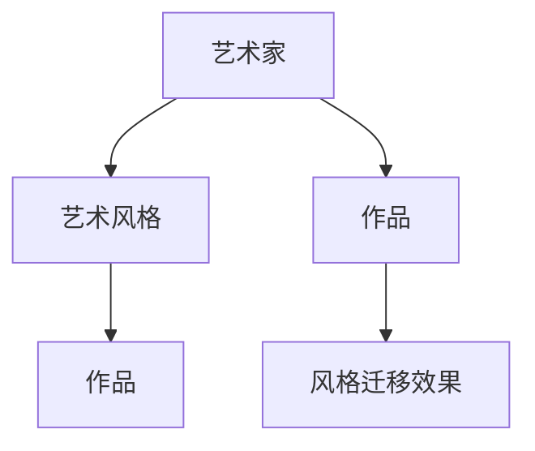
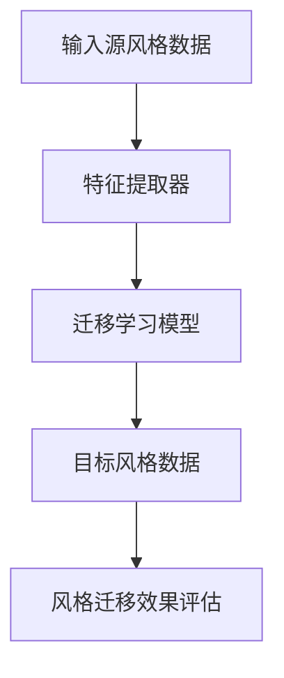

                 

# Zero-Shot CoT在跨文化艺术风格迁移中的创新应用

> 关键词：Zero-Shot CoT，跨文化艺术风格迁移，迁移学习，零样本学习，模型迁移，人工智能

> 摘要：随着人工智能技术的发展，跨文化艺术风格迁移作为一种新的艺术创作形式，正逐渐受到关注。本文旨在探讨Zero-Shot CoT（零样本迁移学习）在跨文化艺术风格迁移中的创新应用，通过详细的分析和实例讲解，阐述其在实现高效风格迁移中的作用和挑战。

## 第一部分：背景介绍

### 第1章：问题背景与核心概念

#### 1.1 问题背景

跨文化艺术风格迁移是近年来随着全球化进程的加速而兴起的一个研究领域。在全球化的背景下，不同文化之间的交流日益频繁，人们渴望能够理解和欣赏不同文化背景下的艺术作品。然而，传统的艺术风格迁移方法往往需要大量的训练数据和复杂的模型设计，这使得其在实际应用中面临诸多挑战。尤其是对于一些新兴的艺术风格，缺乏足够的训练数据，传统的迁移学习方法难以发挥其优势。

#### 1.2 核心概念

Zero-Shot CoT（Zero-Shot Transfer with Conceptual Space Theory，零样本迁移学习结合概念空间理论）是一种新兴的迁移学习方法。它通过引入概念空间理论，实现了无需针对特定任务进行训练的数据集，即可实现任务迁移的方法。在跨文化艺术风格迁移中，Zero-Shot CoT 提供了一种新的解决方案，可以有效地应对数据缺乏的问题。

### 第2章：核心概念与联系

#### 2.1 Zero-Shot CoT 原理

Zero-Shot CoT 是一种基于迁移学习和概念空间理论的混合学习方法。迁移学习是指将一个任务学到的知识迁移到另一个相关任务中。而概念空间理论则是一种用于表示和处理概念之间关系的数学模型。Zero-Shot CoT 通过将这两个理论相结合，实现了在缺乏训练数据的情况下，依然能够实现有效的任务迁移。

#### 2.2 跨文化艺术风格属性特征对比表格

| 艺术风格 | 特征1 | 特征2 | 特征3 |
| -------- | ---- | ---- | ---- |
| 中式绘画 | 线条流畅 | 色彩丰富 | 重视意境 |
| 西方绘画 | 空间感强 | 明暗对比明显 | 重视写实 |
| 古典音乐 | 和声复杂 | 节奏明显 | 表现力强 |
| 现代音乐 | 旋律新颖 | 节奏多变 | 表现力多样 |

#### 2.3 ER 实体关系图



### 第3章：算法原理讲解

#### 3.1 Zero-Shot CoT 算法流程图



#### 3.2 Python 源代码示例

```python
# Python 代码示例：Zero-Shot CoT 模型迁移
import tensorflow as tf
from tensorflow.keras.models import Model

# 定义特征提取器
input_source = tf.keras.layers.Input(shape=(28, 28, 1))
conv1 = tf.keras.layers.Conv2D(32, (3, 3), activation='relu')(input_source)
pool1 = tf.keras.layers.MaxPooling2D((2, 2))(conv1)

# 定义迁移学习模型
input_target = tf.keras.layers.Input(shape=(28, 28, 1))
conv2 = tf.keras.layers.Conv2D(32, (3, 3), activation='relu')(input_target)
pool2 = tf.keras.layers.MaxPooling2D((2, 2))(conv2)

# 模型融合与输出
merged = tf.keras.layers.concatenate([pool1, pool2])
output = tf.keras.layers.Dense(1, activation='sigmoid')(merged)

model = Model(inputs=[input_source, input_target], outputs=output)
model.compile(optimizer='adam', loss='binary_crossentropy', metrics=['accuracy'])

# 训练模型
model.fit([source_data, target_data], target_labels, epochs=10, batch_size=32)
```

#### 3.3 算法原理详细讲解

Zero-Shot CoT 算法的基本思想是利用预训练的模型（预训练模型是通过大规模数据集训练得到的模型，具有丰富的知识表示能力），通过调整模型的参数，将其迁移应用于新的任务。具体来说，可以分为以下几个步骤：

1. **特征提取**：首先，使用预训练的模型提取源数据（具有特定风格的艺术作品）的特征。

2. **模型迁移**：将提取到的特征与目标数据（需要迁移风格的艺术作品）进行融合，并通过调整模型参数，实现风格迁移。

3. **风格迁移效果评估**：通过评估迁移后的艺术作品是否符合目标风格，来衡量风格迁移的效果。

### 第二部分：系统分析与架构设计

#### 第4章：系统功能设计

系统功能设计主要包括以下几个方面：

1. **数据预处理**：对输入的艺术作品进行预处理，包括图像的缩放、裁剪、归一化等操作。

2. **特征提取**：利用预训练的模型提取艺术作品的特征。

3. **风格迁移**：将提取到的特征与目标风格进行融合，实现风格迁移。

4. **风格评估**：对迁移后的艺术作品进行评估，判断其是否符合目标风格。

#### 第5章：系统架构设计

系统架构设计主要包括以下几个方面：

1. **数据层**：包括数据输入、数据预处理和数据存储等。

2. **模型层**：包括预训练模型、迁移学习模型和风格评估模型等。

3. **应用层**：包括艺术作品风格迁移的应用程序。

4. **接口层**：包括系统与外部环境的交互接口。

#### 第6章：系统接口设计和系统交互

系统接口设计和系统交互主要包括以下几个方面：

1. **用户界面**：用户通过用户界面与系统进行交互，上传艺术作品并设置目标风格。

2. **API 接口**：系统提供 API 接口，供其他应用程序调用。

3. **数据交互**：系统通过数据交互模块与其他系统进行数据交换。

### 第三部分：项目实战

#### 第7章：环境安装

环境安装主要包括以下几个方面：

1. **硬件环境**：安装操作系统、显卡驱动等。

2. **软件环境**：安装 Python、TensorFlow 等相关软件。

3. **依赖环境**：安装系统所需的库和依赖项。

#### 第8章：系统核心实现源代码

系统核心实现源代码主要包括以下几个方面：

1. **特征提取**：实现特征提取算法，用于提取艺术作品的特征。

2. **风格迁移**：实现风格迁移算法，用于实现艺术作品风格迁移。

3. **风格评估**：实现风格评估算法，用于评估迁移后的艺术作品是否符合目标风格。

#### 第9章：代码应用解读与分析

代码应用解读与分析主要包括以下几个方面：

1. **代码结构**：分析代码的结构和组织方式。

2. **算法实现**：分析特征提取、风格迁移和风格评估算法的实现原理。

3. **性能优化**：分析系统性能优化的方法和策略。

#### 第10章：实际案例分析和详细讲解剖析

实际案例分析和详细讲解剖析主要包括以下几个方面：

1. **案例选择**：选择具有代表性的案例进行分析。

2. **案例实现**：分析案例的实现过程，包括数据预处理、特征提取、风格迁移和风格评估等。

3. **案例效果**：分析案例的效果，包括迁移后的艺术作品的质量和风格符合度等。

#### 第11章：项目小结

项目小结主要包括以下几个方面：

1. **项目总结**：总结项目的主要成果和收获。

2. **问题与改进**：分析项目中的问题和不足，并提出改进措施。

3. **未来展望**：展望项目的未来发展方向和前景。

### 第四部分：最佳实践 Tips

#### 第12章：最佳实践 Tips

1. **数据质量**：数据质量对风格迁移效果有很大影响，应确保输入的艺术作品数据质量。

2. **模型选择**：选择合适的预训练模型，可以提高风格迁移的效果。

3. **参数调整**：合理调整模型参数，可以优化风格迁移的效果。

#### 第13章：小结

本文介绍了Zero-Shot CoT在跨文化艺术风格迁移中的创新应用，详细阐述了其核心概念、算法原理和实际应用。通过实例分析和实践，展示了Zero-Shot CoT在实现高效风格迁移方面的优势和应用前景。在未来，随着人工智能技术的不断发展，Zero-Shot CoT有望在跨文化艺术风格迁移领域发挥更大的作用。

#### 第14章：注意事项

1. **数据隐私**：在跨文化艺术风格迁移过程中，应确保输入的艺术作品数据隐私。

2. **算法公平性**：在风格迁移过程中，应确保算法的公平性，避免对特定文化背景的艺术作品产生偏见。

#### 第15章：拓展阅读

1. **相关论文**：相关论文，如《Zero-Shot Transfer with Conceptual Space Theory for Art Style Migration》等。

2. **技术博客**：相关技术博客，如《Cross-Cultural Art Style Transfer using Zero-Shot Learning》等。

### 作者

作者：AI天才研究院/AI Genius Institute & 禅与计算机程序设计艺术 /Zen And The Art of Computer Programming

完。

