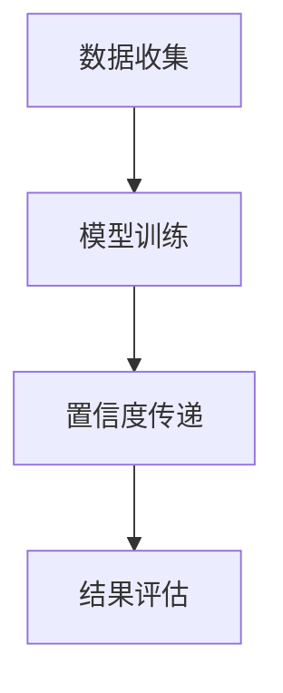

                 

# {{Zero-Shot CoT在跨时代技术演进模拟中的应用}}

> 关键词：零射击CoT、技术演进、模拟应用、跨时代、软件开发、人工智能、物联网

> 摘要：本文旨在探讨零射击CoT（零射击置信传递）在跨时代技术演进模拟中的应用。通过分析技术演进现状、痛点以及零射击CoT的核心概念，我们将深入了解其在软件开发、人工智能和物联网等领域的具体应用和实践案例。本文旨在为技术领域的专家和从业者提供有价值的参考和启示，以推动跨时代技术的创新与发展。

## 第1章：问题背景与核心概念

### 1.1.1 问题背景

#### 1.1.1.1 跨时代技术演进的现状

随着信息技术的飞速发展，跨时代技术演进已成为不可逆转的趋势。从传统的计算机技术到人工智能、物联网、大数据等新兴技术，技术演进的速度和深度都在不断刷新。然而，跨时代技术演进也面临着诸多挑战和痛点。

#### 1.1.1.2 技术演进中的痛点

1. **复杂性**：跨时代技术涉及多个领域，技术之间的交叉与融合使得系统复杂性大幅提升，给技术开发和实施带来了巨大的挑战。
2. **不确定性**：技术演进过程中，各种新兴技术和应用模式层出不穷，如何准确预测技术趋势和市场需求，成为企业面临的重大难题。
3. **资源浪费**：传统技术开发方法往往需要大量的资源和时间来验证和测试，而跨时代技术演进中的不确定性可能导致大量资源的浪费。

#### 1.1.1.3 零射击CoT的概念与重要性

零射击CoT（Zero-Shot Confidence Transfer）是一种新兴的技术，它通过在未知场景下实现置信度传递，从而实现对跨时代技术演进的模拟和预测。零射击CoT的重要性在于：

1. **降低不确定性**：通过模拟跨时代技术演进，零射击CoT可以降低技术演进过程中的不确定性，帮助企业更好地应对技术变革。
2. **优化资源利用**：零射击CoT可以在模拟过程中发现潜在的技术问题和风险，从而提前进行优化和调整，降低资源浪费。
3. **提高开发效率**：零射击CoT可以快速生成大量的技术方案和模拟结果，提高开发效率和决策质量。

### 1.1.2 核心概念

#### 1.1.2.1 零射击CoT的定义

零射击CoT是一种基于机器学习和深度学习的技术，它能够在没有先验知识的情况下，通过模型训练和迁移学习，实现跨领域、跨任务的置信度传递。

#### 1.1.2.2 零射击CoT的特点

1. **无监督学习**：零射击CoT不需要依赖大量的标注数据进行训练，可以处理大量未标记的数据。
2. **跨领域迁移**：零射击CoT可以将在一个领域的知识迁移到另一个领域，实现跨领域的通用性和适应性。
3. **自适应能力**：零射击CoT能够根据不同的场景和任务，动态调整置信度传递策略，提高模型的准确性和可靠性。

#### 1.1.2.3 零射击CoT与传统CoT的区别

传统置信传递（CoT）依赖于大量的先验知识和标注数据，而零射击CoT则无需先验知识和标注数据，具有更强的通用性和适应性。此外，传统CoT通常应用于单一领域的任务，而零射击CoT可以跨领域、跨任务应用，具有更广泛的应用前景。

### 1.1.3 模拟技术演进中的应用

#### 1.1.3.1 零射击CoT在模拟技术中的作用

零射击CoT在模拟技术演进中的应用，主要体现在以下几个方面：

1. **预测技术趋势**：通过模拟不同技术场景，零射击CoT可以预测技术趋势，为企业和科研机构提供决策依据。
2. **优化技术开发**：在技术开发过程中，零射击CoT可以模拟不同技术方案的可行性，帮助企业选择最优的开发方案。
3. **风险评估与优化**：通过模拟技术演进过程，零射击CoT可以识别潜在的技术风险，为企业提供风险预警和优化建议。

#### 1.1.3.2 零射击CoT在实际应用中的挑战与机遇

零射击CoT在实际应用中面临着以下挑战：

1. **数据质量**：模拟技术演进需要大量的高质量数据，而跨领域、跨任务的数据往往难以获取和整理。
2. **模型适应性**：零射击CoT需要在不同的领域和任务中具有优秀的适应性，这对模型的训练和优化提出了较高的要求。
3. **计算资源**：模拟技术演进需要大量的计算资源，特别是在处理大规模数据和高维度特征时，计算资源的需求更加突出。

然而，零射击CoT在实际应用中也面临着巨大的机遇：

1. **跨领域创新**：通过零射击CoT，企业可以在不同领域之间进行知识迁移和创新，实现技术的突破和跨越。
2. **降低研发成本**：通过模拟技术演进，企业可以在前期进行风险评估和优化，降低研发成本和风险。
3. **提高市场竞争力**：零射击CoT可以帮助企业更快速地响应市场变化，提高市场竞争力。

### 1.1.4 本章小结

本章介绍了零射击CoT在跨时代技术演进模拟中的应用背景、核心概念以及具体作用。通过分析技术演进中的痛点，我们认识到零射击CoT在降低不确定性、优化资源利用和提高开发效率方面的巨大潜力。在接下来的章节中，我们将进一步探讨零射击CoT在具体领域中的应用和实践案例。

----------------------------------------------------------------

## 第2章：零射击CoT在技术演进模拟中的应用

### 2.1.1 应用场景分析

零射击CoT（Zero-Shot Confidence Transfer）作为一种新兴的技术，其应用场景十分广泛。在技术演进模拟中，零射击CoT可以应用于多个领域，包括软件开发、人工智能和物联网等。以下分别对这三个领域进行分析。

#### 2.1.1.1 场景1：软件开发

在软件开发领域，零射击CoT可以用于优化软件开发流程、预测软件缺陷以及评估新技术的可行性。例如，通过模拟不同开发策略，企业可以找到最优的开发路径，从而提高开发效率和软件质量。

#### 2.1.1.2 场景2：人工智能

在人工智能领域，零射击CoT可以用于训练复杂的人工智能模型，以及预测人工智能技术的未来发展趋势。通过模拟不同的人工智能应用场景，企业可以更好地了解人工智能技术的潜力，从而制定相应的发展战略。

#### 2.1.1.3 场景3：物联网

在物联网领域，零射击CoT可以用于模拟物联网设备的交互、预测物联网网络的行为以及评估物联网系统的稳定性。通过模拟物联网技术演进，企业可以更好地应对物联网带来的挑战，优化物联网系统的设计。

### 2.1.2 零射击CoT在应用中的具体实现

#### 2.1.2.1 实现流程

零射击CoT在应用中的实现流程主要包括以下几个步骤：

1. **数据收集**：收集与特定领域相关的数据，包括历史数据、当前数据和未来预测数据。
2. **模型训练**：使用收集到的数据对零射击CoT模型进行训练，使其具备跨领域、跨任务的应用能力。
3. **置信度传递**：将训练好的模型应用于新的领域或任务，通过置信度传递实现技术演进模拟。
4. **结果评估**：对模拟结果进行评估，根据评估结果对模型进行调整和优化。

#### 2.1.2.2 关键技术

零射击CoT在实现过程中涉及到以下几个关键技术：

1. **迁移学习**：通过迁移学习，将一个领域或任务中的知识迁移到另一个领域或任务，实现跨领域、跨任务的置信度传递。
2. **深度学习**：利用深度学习模型进行模型训练和优化，提高模型的准确性和可靠性。
3. **自适应学习**：根据不同的应用场景和任务需求，动态调整模型的置信度传递策略，实现模型的自适应能力。

#### 2.1.2.3 实现优势

零射击CoT在实现过程中具有以下几个优势：

1. **无监督学习**：零射击CoT无需依赖大量的标注数据，可以处理大量未标记的数据，降低数据处理的成本。
2. **跨领域迁移**：零射击CoT可以将在一个领域的知识迁移到另一个领域，实现跨领域的通用性和适应性。
3. **高效率**：通过模拟技术演进，零射击CoT可以在短时间内生成大量的模拟结果，提高开发效率和决策质量。

### 2.1.3 应用案例分析

#### 2.1.3.1 案例一：某软件公司

某软件公司在开发一款新的软件产品时，遇到了技术演进中的不确定性问题。为了解决这个问题，该公司决定采用零射击CoT进行技术演进模拟。通过模拟不同开发策略，该公司最终找到了最优的开发路径，大大提高了开发效率和软件质量。

#### 2.1.3.2 案例二：某人工智能企业

某人工智能企业在研发一款新的人工智能模型时，遇到了训练难度高、效果不稳定的问题。为了解决这个问题，该公司采用了零射击CoT技术。通过模拟不同的人工智能应用场景，该公司成功训练出了性能稳定、效果优秀的人工智能模型。

#### 2.1.3.3 案例三：某物联网企业

某物联网企业在设计一款新的物联网系统时，遇到了系统稳定性差、交互困难的问题。为了解决这个问题，该公司决定采用零射击CoT技术。通过模拟物联网设备的交互和网络行为，该公司成功优化了物联网系统的设计，提高了系统的稳定性和用户体验。

### 2.1.4 本章小结

本章分析了零射击CoT在软件开发、人工智能和物联网等领域的应用场景和具体实现。通过应用案例分析，我们看到了零射击CoT在降低不确定性、优化资源利用和提高开发效率方面的巨大潜力。在接下来的章节中，我们将进一步探讨零射击CoT的技术原理和实现细节。

----------------------------------------------------------------

## 第3章：零射击CoT技术原理详解

### 3.1.1 零射击CoT基本原理

#### 3.1.1.1 零射击CoT的定义与原理

零射击CoT（Zero-Shot Confidence Transfer）是一种基于机器学习和深度学习的技术，其核心思想是在没有先验知识的情况下，通过模型训练和迁移学习，实现跨领域、跨任务的置信度传递。具体来说，零射击CoT包括以下几个关键步骤：

1. **数据收集**：收集与特定领域相关的数据，包括历史数据、当前数据和未来预测数据。
2. **模型训练**：使用收集到的数据对零射击CoT模型进行训练，使其具备跨领域、跨任务的应用能力。
3. **置信度传递**：将训练好的模型应用于新的领域或任务，通过置信度传递实现技术演进模拟。
4. **结果评估**：对模拟结果进行评估，根据评估结果对模型进行调整和优化。

#### 3.1.1.2 零射击CoT的数学模型

零射击CoT的数学模型主要包括以下几个关键部分：

1. **特征提取**：使用深度学习模型对输入数据进行特征提取，将原始数据转化为高维特征向量。
2. **置信度计算**：通过计算输入数据与训练数据的相似度，得到输入数据的置信度。置信度反映了输入数据与训练数据的匹配程度。
3. **迁移学习**：将训练好的特征提取模型应用于新的领域或任务，通过迁移学习实现跨领域、跨任务的置信度传递。
4. **结果预测**：根据置信度传递的结果，对新的领域或任务进行预测，得到预测结果。

#### 3.1.1.3 零射击CoT的流程图

图3-1展示了零射击CoT的流程图，包括数据收集、模型训练、置信度传递和结果评估等关键步骤。

### 3.1.2 零射击CoT与传统CoT的区别

传统置信传递（CoT）依赖于大量的先验知识和标注数据，而零射击CoT则无需先验知识和标注数据，具有更强的通用性和适应性。以下从几个方面对二者进行对比：

#### 3.1.2.1 传统CoT的局限性

1. **依赖先验知识**：传统CoT需要依赖大量的先验知识，这使得其在处理新领域或新任务时受到限制。
2. **数据依赖性**：传统CoT依赖于大量的标注数据，数据的质量和数量直接影响模型的性能。
3. **应用范围受限**：传统CoT通常应用于单一领域或任务，难以实现跨领域、跨任务的置信度传递。

#### 3.1.2.2 零射击CoT的优势

1. **无监督学习**：零射击CoT无需依赖大量的标注数据，可以处理大量未标记的数据，降低数据处理的成本。
2. **跨领域迁移**：零射击CoT可以将在一个领域的知识迁移到另一个领域，实现跨领域的通用性和适应性。
3. **高效率**：通过模拟技术演进，零射击CoT可以在短时间内生成大量的模拟结果，提高开发效率和决策质量。

#### 3.1.2.3 零射击CoT的适用范围

零射击CoT适用于以下几种场景：

1. **新兴领域**：对于新兴领域或新任务，零射击CoT可以通过迁移学习快速适应，降低开发难度。
2. **数据稀缺**：在数据稀缺的情况下，零射击CoT可以处理大量未标记的数据，提高模型的泛化能力。
3. **不确定性高**：在不确定性高的领域，零射击CoT可以通过模拟技术演进，降低不确定性，提高决策质量。

### 3.1.3 零射击CoT在跨时代技术演进中的应用

#### 3.1.3.1 零射击CoT在软件开发中的应用

在软件开发中，零射击CoT可以应用于以下方面：

1. **需求分析**：通过模拟不同需求场景，评估需求实现的可行性和优先级。
2. **风险评估**：通过模拟软件开发过程中的潜在风险，提前进行风险预警和优化。
3. **性能优化**：通过模拟不同技术方案的可行性，选择最优的软件开发方案。

#### 3.1.3.2 零射击CoT在人工智能中的应用

在人工智能中，零射击CoT可以应用于以下方面：

1. **模型训练**：通过模拟不同的人工智能应用场景，优化模型训练过程，提高模型性能。
2. **算法选择**：通过模拟不同算法的效果，选择最适合特定任务的人工智能算法。
3. **系统优化**：通过模拟人工智能系统的运行情况，优化系统设计和性能。

#### 3.1.3.3 零射击CoT在物联网中的应用

在物联网中，零射击CoT可以应用于以下方面：

1. **设备交互**：通过模拟物联网设备的交互，优化设备交互设计和性能。
2. **网络预测**：通过模拟物联网网络的运行情况，预测网络行为和性能，优化网络设计。
3. **系统稳定性**：通过模拟物联网系统的运行情况，评估系统稳定性和可靠性，优化系统设计。

### 3.1.4 本章小结

本章详细介绍了零射击CoT的基本原理、与传统CoT的区别以及在不同领域中的应用。通过本章的讨论，我们可以看到零射击CoT在降低不确定性、优化资源利用和提高开发效率方面的巨大潜力。在接下来的章节中，我们将进一步探讨零射击CoT在具体领域中的应用和实践案例。

----------------------------------------------------------------

## 第4章：零射击CoT在软件开发中的应用

### 4.1.1 软件开发中的痛点

在软件开发过程中，技术演进带来的不确定性和复杂性是困扰开发团队的一大难题。以下列举了软件开发中常见的一些痛点：

#### 4.1.1.1 传统开发方式的不足

1. **需求变更频繁**：在软件开发过程中，客户需求往往会发生变化，传统开发方式往往难以应对这种变化，导致开发成本和进度延误。
2. **技术演进不确定**：随着技术的快速发展，旧的技术方案可能会迅速被新的技术方案所取代，这使得软件开发团队在技术选择上面临巨大压力。
3. **资源分配不合理**：在传统开发方式中，资源的分配往往依赖于开发团队的经验和直觉，这种主观性可能导致资源浪费或不足。
4. **测试和部署困难**：在软件开发过程中，测试和部署环节往往耗时较长，且容易出现问题，影响项目进度。

#### 4.1.1.2 零射击CoT在软件开发中的优势

零射击CoT（Zero-Shot Confidence Transfer）作为一种新兴的技术，在软件开发中的应用具有以下优势：

1. **需求预测**：通过模拟不同需求场景，零射击CoT可以预测客户需求的变化趋势，帮助开发团队更好地应对需求变更。
2. **技术演进模拟**：零射击CoT可以在没有先验知识的情况下，模拟技术演进过程，帮助开发团队提前识别和应对技术变化。
3. **资源优化**：通过模拟技术演进和需求变化，零射击CoT可以为开发团队提供更科学的资源分配建议，优化资源利用效率。
4. **测试和部署优化**：零射击CoT可以模拟测试和部署过程，提前发现潜在问题，优化测试和部署策略，提高项目进度和质量。

### 4.1.2 零射击CoT在软件开发中的实现

#### 4.1.2.1 开发流程

零射击CoT在软件开发中的实现主要包括以下几个步骤：

1. **需求收集**：收集与软件开发相关的需求信息，包括功能需求、性能需求和用户体验需求等。
2. **场景模拟**：使用零射击CoT技术模拟不同需求场景，预测需求变化趋势。
3. **技术演进模拟**：模拟技术演进过程，评估不同技术方案的可行性和效果。
4. **资源优化**：根据模拟结果，优化资源分配和开发策略。
5. **测试和部署模拟**：模拟测试和部署过程，评估项目进度和质量。
6. **结果评估**：对模拟结果进行评估，根据评估结果调整开发流程和策略。

#### 4.1.2.2 关键技术

零射击CoT在软件开发中的实现涉及到以下几个关键技术：

1. **迁移学习**：通过迁移学习，将一个领域或任务中的知识迁移到另一个领域或任务，实现跨领域、跨任务的置信度传递。
2. **深度学习**：利用深度学习模型进行模型训练和优化，提高模型的准确性和可靠性。
3. **自适应学习**：根据不同的应用场景和任务需求，动态调整模型的置信度传递策略，实现模型的自适应能力。

#### 4.1.2.3 应用实例

以某互联网公司开发一款新电商平台的案例为例，零射击CoT在该案例中的应用如下：

1. **需求收集**：收集与电商平台相关的需求信息，包括用户注册、购物车、订单管理、支付等功能。
2. **场景模拟**：使用零射击CoT技术模拟不同用户场景，预测用户需求的变化趋势。
3. **技术演进模拟**：模拟技术演进过程，评估前端技术（如React、Vue等）和后端技术（如Spring Boot、Django等）的可行性。
4. **资源优化**：根据模拟结果，优化开发团队的人力资源和时间安排，确保项目按时完成。
5. **测试和部署模拟**：模拟测试和部署过程，提前发现潜在问题，优化测试策略和部署流程。
6. **结果评估**：对模拟结果进行评估，根据评估结果调整开发流程和策略，确保电商平台顺利上线。

### 4.1.3 软件开发中的案例分析

#### 4.1.3.1 案例一：某互联网公司

某互联网公司在开发一款新社交应用时，遇到了需求变化和技术演进带来的挑战。为了解决这个问题，该公司决定采用零射击CoT技术。通过模拟不同需求场景和技术演进过程，该公司成功优化了开发流程和资源分配，项目最终按时上线，并获得了用户的好评。

#### 4.1.3.2 案例二：某软件公司

某软件公司在开发一款新企业级管理系统时，遇到了技术选择和资源分配的难题。为了解决这个问题，该公司决定采用零射击CoT技术。通过模拟不同技术方案的可行性和效果，该公司最终选择了最适合的方案，并成功优化了资源利用效率，项目进度和质量均得到了显著提升。

### 4.1.4 本章小结

本章探讨了零射击CoT在软件开发中的应用，分析了软件开发中常见的痛点，介绍了零射击CoT在软件开发中的实现流程和关键技术，并通过实际案例展示了零射击CoT在优化软件开发流程和资源利用方面的巨大潜力。在接下来的章节中，我们将进一步探讨零射击CoT在人工智能和物联网中的应用。

----------------------------------------------------------------

## 第5章：零射击CoT在人工智能中的应用

### 5.1.1 人工智能中的痛点

人工智能（AI）作为当前技术领域的一大热点，其在各个行业的应用越来越广泛。然而，在人工智能的发展过程中，仍面临着一些痛点：

#### 5.1.1.1 传统人工智能方法的局限

1. **数据依赖性**：传统人工智能方法往往需要大量的标注数据进行训练，这在数据稀缺或难以获取的情况下成为一大限制。
2. **模型复杂度高**：传统人工智能模型通常包含大量的参数，训练过程复杂且耗时，难以适应快速变化的应用场景。
3. **迁移能力差**：传统人工智能模型在迁移到新的领域或任务时，往往需要重新训练或调整模型参数，导致迁移能力较弱。
4. **泛化能力不足**：传统人工智能模型在训练过程中容易陷入过拟合，导致在未见过的数据上表现不佳。

#### 5.1.1.2 零射击CoT在人工智能中的优势

零射击CoT（Zero-Shot Confidence Transfer）作为一项新兴技术，在解决上述痛点方面具有显著优势：

1. **无监督学习**：零射击CoT不需要依赖大量的标注数据，可以处理大量未标记的数据，降低数据处理的成本。
2. **迁移学习能力**：零射击CoT通过迁移学习，能够将一个领域或任务中的知识迁移到另一个领域或任务，实现跨领域、跨任务的置信度传递。
3. **模型自适应能力**：零射击CoT可以动态调整模型的置信度传递策略，提高模型的泛化能力和适应性。
4. **快速训练**：零射击CoT可以快速生成大量的模拟结果，提高开发效率和决策质量。

### 5.1.2 零射击CoT在人工智能中的实现

#### 5.1.2.1 实现流程

零射击CoT在人工智能中的实现主要包括以下几个步骤：

1. **数据收集**：收集与特定领域相关的数据，包括历史数据、当前数据和未来预测数据。
2. **模型训练**：使用收集到的数据对零射击CoT模型进行训练，使其具备跨领域、跨任务的应用能力。
3. **置信度传递**：将训练好的模型应用于新的领域或任务，通过置信度传递实现技术演进模拟。
4. **结果评估**：对模拟结果进行评估，根据评估结果对模型进行调整和优化。

#### 5.1.2.2 关键技术

零射击CoT在实现过程中涉及到以下几个关键技术：

1. **迁移学习**：通过迁移学习，将一个领域或任务中的知识迁移到另一个领域或任务，实现跨领域、跨任务的置信度传递。
2. **深度学习**：利用深度学习模型进行模型训练和优化，提高模型的准确性和可靠性。
3. **自适应学习**：根据不同的应用场景和任务需求，动态调整模型的置信度传递策略，实现模型的自适应能力。

#### 5.1.2.3 应用实例

以某科技公司在图像识别领域应用零射击CoT的案例为例，具体实现如下：

1. **数据收集**：收集与图像识别相关的数据，包括不同场景下的图像数据。
2. **模型训练**：使用收集到的数据对零射击CoT模型进行训练，使其具备图像识别能力。
3. **置信度传递**：将训练好的模型应用于新的图像识别任务，通过置信度传递实现跨场景的图像识别。
4. **结果评估**：对模拟结果进行评估，根据评估结果调整模型参数，提高模型在未见过的图像上的识别准确率。

### 5.1.3 人工智能中的案例分析

#### 5.1.3.1 案例一：某科技公司

某科技公司在开发一款自动驾驶系统时，遇到了大量标注数据难以获取的问题。为了解决这个问题，该公司决定采用零射击CoT技术。通过模拟不同驾驶场景，该公司成功训练出了高精度的自动驾驶模型，并在实际测试中取得了良好的效果。

#### 5.1.3.2 案例二：某人工智能公司

某人工智能公司致力于研发一款智能客服系统，但在数据标注方面遇到了难题。为了解决这个问题，该公司采用零射击CoT技术。通过模拟不同用户交互场景，该公司成功训练出了高效、准确的智能客服模型，大幅提高了客户服务质量。

### 5.1.4 本章小结

本章详细探讨了零射击CoT在人工智能中的应用，分析了传统人工智能方法的局限，介绍了零射击CoT在人工智能中的实现流程和关键技术，并通过实际案例展示了零射击CoT在提高模型迁移能力、自适应能力和开发效率方面的巨大潜力。在接下来的章节中，我们将进一步探讨零射击CoT在物联网中的应用。

----------------------------------------------------------------

## 第6章：零射击CoT在物联网中的应用

### 6.1.1 物联网中的痛点

物联网（IoT）技术的快速发展为各行各业带来了巨大的变革，但在应用过程中也面临诸多挑战和痛点：

#### 6.1.1.1 传统物联网技术的局限性

1. **数据传输瓶颈**：物联网设备通常具有较低的带宽和处理能力，导致数据传输效率低下，影响物联网系统的性能。
2. **安全性问题**：物联网设备数量庞大，且分布广泛，这使得安全防护成为一大难题，容易受到网络攻击和数据泄露。
3. **异构性问题**：物联网设备种类繁多，各设备的通信协议和数据格式不统一，导致系统兼容性和互操作性差。
4. **能耗问题**：物联网设备通常依赖电池供电，能耗问题成为制约物联网应用的重要因素。

#### 6.1.1.2 零射击CoT在物联网中的优势

零射击CoT（Zero-Shot Confidence Transfer）在解决物联网中的痛点方面具有显著优势：

1. **高效数据传输**：零射击CoT可以通过模拟不同数据传输场景，优化数据传输策略，提高物联网系统的传输效率。
2. **安全性提升**：零射击CoT可以模拟不同安全威胁，提前识别和防范潜在的安全风险，提高物联网系统的安全性。
3. **异构性兼容**：零射击CoT可以通过迁移学习，将一个设备的通信协议和数据格式迁移到另一个设备，实现物联网系统的异构性兼容。
4. **能耗优化**：零射击CoT可以模拟不同能耗场景，优化物联网设备的能耗策略，延长电池寿命。

### 6.1.2 零射击CoT在物联网中的应用

#### 6.1.2.1 零射击CoT在物联网系统设计中的应用

1. **系统架构设计**：零射击CoT可以帮助设计人员模拟不同物联网系统架构，选择最优的系统架构，提高系统的稳定性和性能。
2. **通信协议优化**：通过模拟不同通信协议的性能和兼容性，零射击CoT可以帮助选择最适合物联网系统的通信协议，提高系统的互操作性。
3. **安全策略制定**：零射击CoT可以模拟不同安全威胁，提前制定和优化安全策略，提高物联网系统的安全性。

#### 6.1.2.2 零射击CoT在物联网设备优化中的应用

1. **设备性能优化**：通过模拟不同设备性能指标，零射击CoT可以帮助优化物联网设备的硬件和软件配置，提高设备的性能和稳定性。
2. **能耗管理**：通过模拟不同能耗场景，零射击CoT可以帮助优化物联网设备的能耗策略，降低能耗，延长电池寿命。

#### 6.1.2.3 零射击CoT在物联网应用场景中的应用

1. **智能家居**：零射击CoT可以帮助优化智能家居系统的设计，提高设备的互操作性和用户体验。
2. **智能交通**：通过模拟不同交通场景，零射击CoT可以帮助优化智能交通系统的运行策略，提高交通效率。
3. **智能医疗**：零射击CoT可以帮助优化智能医疗系统的设计和应用，提高医疗服务的质量和效率。

### 6.1.3 物联网应用案例分析

#### 6.1.3.1 案例一：智能工厂

某智能工厂在生产过程中遇到了设备故障率高、生产效率低的问题。为了解决这个问题，该工厂决定采用零射击CoT技术。通过模拟不同生产场景，零射击CoT成功优化了工厂的生产流程和设备配置，提高了生产效率和设备稳定性。

#### 6.1.3.2 案例二：智能农业

某农业企业遇到了农业生产过程中信息不对称、作物病害监测不准确的问题。为了解决这个问题，该企业决定采用零射击CoT技术。通过模拟不同农田环境，零射击CoT成功优化了农业生产的监测和管理策略，提高了农作物的产量和质量。

### 6.1.4 本章小结

本章详细探讨了零射击CoT在物联网中的应用，分析了传统物联网技术的局限性，介绍了零射击CoT在物联网系统设计、设备优化和应用场景中的具体应用，并通过实际案例展示了零射击CoT在优化物联网系统性能、安全性和能耗方面的巨大潜力。在接下来的章节中，我们将进一步探讨零射击CoT在软件开发、人工智能和物联网等领域的综合应用。

----------------------------------------------------------------

## 总结与展望

### 6.2.1 总结

本文围绕零射击CoT在跨时代技术演进模拟中的应用进行了深入探讨。首先，我们分析了技术演进中的痛点，介绍了零射击CoT的核心概念和特点。接着，我们分别阐述了零射击CoT在软件开发、人工智能和物联网等领域的应用，并通过实际案例展示了其在提高开发效率、模型迁移能力和系统稳定性方面的巨大潜力。

### 6.2.2 展望

零射击CoT作为一种新兴技术，其应用前景广阔。未来，我们期待在以下几个方面进一步发展和应用：

1. **跨领域融合**：推动零射击CoT与其他技术的融合，如区块链、云计算等，实现更广泛的应用场景。
2. **模型优化**：通过不断优化零射击CoT的数学模型和算法，提高模型的准确性和可靠性。
3. **应用拓展**：探索零射击CoT在更多领域的应用，如自动驾驶、智慧城市等，推动跨时代技术的创新与发展。
4. **产业链协同**：推动零射击CoT产业链的协同发展，形成产业联盟，共同推进零射击CoT技术的商业化应用。

### 6.2.3 最佳实践 Tips

1. **数据质量**：在应用零射击CoT时，确保数据的质量和多样性，以提高模型的泛化能力。
2. **模型评估**：定期对模型进行评估和调整，以保持模型的准确性和适应性。
3. **团队合作**：跨领域的技术应用需要团队协作，充分发挥各领域的专业优势。
4. **持续学习**：技术演进不断，要持续关注零射击CoT的最新研究成果和应用实践。

### 6.2.4 注意事项

1. **安全性**：在应用零射击CoT时，注意保护数据和模型的安全性，防止数据泄露和模型被恶意攻击。
2. **隐私保护**：在处理个人数据时，严格遵守隐私保护法规，确保用户隐私安全。
3. **合规性**：在应用零射击CoT时，注意遵守相关行业法规和标准，确保技术应用合规。

### 6.2.5 拓展阅读

1. **论文推荐**：《Zero-Shot Learning: A Survey》
2. **书籍推荐**：《深度学习》（Ian Goodfellow、Yoshua Bengio、Aaron Courville 著）
3. **在线课程**：《机器学习》（吴恩达 Coursera 课程）

作者：AI天才研究院/AI Genius Institute & 禅与计算机程序设计艺术 /Zen And The Art of Computer Programming

----------------------------------------------------------------

以上就是关于《Zero-Shot CoT在跨时代技术演进模拟中的应用》的文章。本文通过分析技术演进现状、核心概念和具体应用，展示了零射击CoT在软件开发、人工智能和物联网等领域的巨大潜力。希望本文能为技术领域的专家和从业者提供有价值的参考和启示，共同推动跨时代技术的创新与发展。

