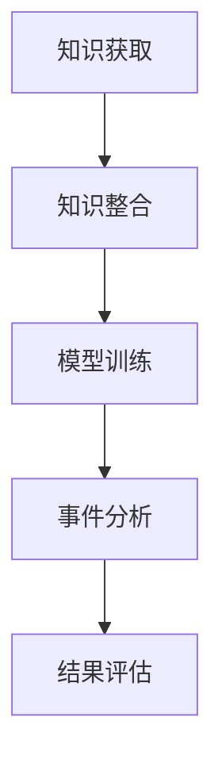
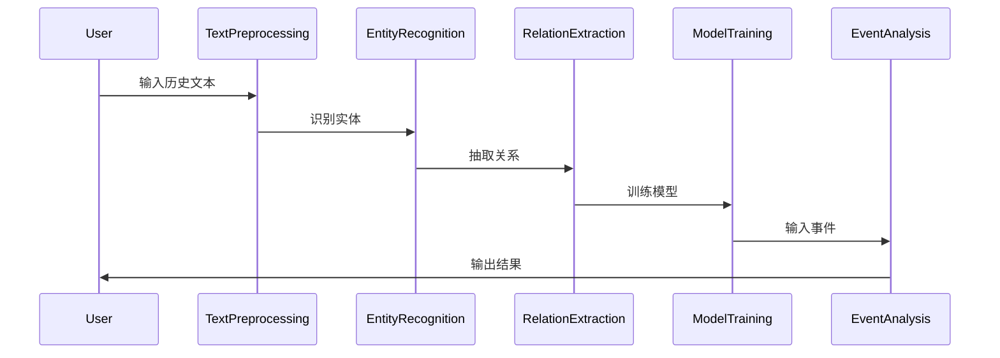

                 

# Zero-Shot CoT在跨时空历史事件分析中的创新应用

## 摘要

本文旨在探讨Zero-Shot CoT（零样本一对多学习）在跨时空历史事件分析中的创新应用。随着人工智能技术的飞速发展，Zero-Shot CoT算法凭借其强大的跨领域知识迁移能力，为历史事件分析提供了一种新的解决方案。本文首先介绍了历史事件分析的问题背景和传统方法的局限性，然后详细阐述了Zero-Shot CoT的核心概念和原理，通过Mermaid流程图和Python源代码对算法进行了深入解析。此外，本文还结合实际项目，展示了Zero-Shot CoT在历史事件分析中的具体应用，并提供了实用的最佳实践和拓展阅读建议。

## 第1章 引言

### 1.1 问题背景

在当今信息化时代，历史事件的分析和研究变得越来越重要。历史事件的分析不仅可以帮助我们更好地理解过去，还能为未来的决策提供有益的参考。然而，传统的分析方法存在一些明显的局限性：

1. **数据依赖性高**：传统的方法往往需要大量的历史资料和人力处理，依赖于大量的标注数据来训练模型。然而，历史资料往往缺乏系统的标注，导致模型训练困难。
2. **效率低下**：传统的分析方法通常需要较长的时间来处理大量数据，效率低下。
3. **主观因素影响**：传统方法容易受到主观因素的影响，导致分析结果的准确性受到影响。

随着人工智能技术的发展，特别是Zero-Shot CoT（零样本一对多学习）算法的提出，历史事件分析迎来了新的机遇。Zero-Shot CoT允许模型在没有直接标注数据的情况下，通过学习已有的知识，对未知的历史事件进行有效分析和预测。这一技术的出现，不仅提高了分析的效率和准确性，还为跨时空的历史事件分析提供了一种新的思路。

### 1.2 问题描述

历史事件的分析涉及多个方面，包括事件的发生时间、地点、人物、事件类型、影响等。传统的方法往往需要大量的标注数据来训练模型，而历史资料往往缺乏系统的标注，导致模型训练困难。此外，不同历史时期的事件具有不同的特征和背景，传统模型难以适应。Zero-Shot CoT技术通过学习跨领域的知识，可以在没有标注数据的情况下，对历史事件进行有效分析和预测，从而解决了传统方法面临的难题。

具体来说，历史事件分析的问题可以概括为以下几点：

1. **数据稀缺**：历史资料通常缺乏系统的标注，导致模型难以训练。
2. **模型泛化能力不足**：传统模型难以适应不同历史时期的事件特征和背景。
3. **分析效率低下**：传统方法需要大量的人力和时间来处理历史资料。

### 1.3 问题解决

Zero-Shot CoT的核心思想是通过跨领域的知识迁移，将已有知识应用于未知领域。具体来说，该技术通过以下步骤实现：

1. **知识获取**：利用自然语言处理技术，从大量文本中提取出与历史事件相关的知识。
2. **知识整合**：将提取出的知识整合成一个统一的知识图谱，便于模型学习。
3. **模型训练**：利用整合后的知识图谱训练Zero-Shot CoT模型，使其能够对未知的历史事件进行分析和预测。
4. **事件分析**：将模型应用于具体的历史事件，进行事件类型的判断、影响评估等。

通过以上步骤，Zero-Shot CoT技术可以克服传统方法面临的难题，实现高效、准确的历史事件分析。

### 1.4 边界与外延

虽然Zero-Shot CoT技术在历史事件分析中表现出色，但也存在一定的局限性。首先，知识的获取和整合过程依赖于高质量的数据源，如果数据源质量不高，会导致模型性能下降。其次，Zero-Shot CoT模型需要大量的计算资源，对于一些资源受限的场景，可能不适用。此外，历史事件的分析还涉及很多复杂的因素，如历史背景、文化差异等，这些因素可能对模型的预测结果产生影响。

### 1.5 概念结构与核心要素组成

#### 1.5.1 Zero-Shot CoT

Zero-Shot CoT是指在没有直接标注数据的情况下，通过学习已有的知识，对未知样本进行分类或预测的一种机器学习技术。其核心思想是利用跨领域的知识迁移，将已有知识应用于未知领域。

#### 1.5.2 知识图谱

知识图谱是一种用于表示知识结构的数据模型，它通过实体、属性和关系来描述现实世界。在Zero-Shot CoT中，知识图谱用于整合跨领域的知识，为模型训练提供支持。

#### 1.5.3 模型训练

模型训练是指利用已有数据对模型进行调整，使其能够更好地拟合数据。在Zero-Shot CoT中，模型训练的关键在于如何从大量无标注数据中提取知识，并将其整合到模型中。

## 第2章 核心概念与联系

### 2.1 核心概念原理

#### 2.1.1 零样本学习

零样本学习（Zero-Shot Learning, ZSL）是一种机器学习技术，其核心思想是在没有直接标注数据的情况下，通过学习已有知识（如预训练模型、知识图谱等），对未知类别进行分类或预测。与传统的监督学习和半监督学习不同，零样本学习不依赖于大量的标注数据，因此可以应用于数据稀缺的领域。

#### 2.1.2 一对多学习

一对多学习（One-to-Many Learning）是指将一个输入样本映射到多个输出标签的一种学习方式。在历史事件分析中，一对多学习可以帮助模型同时识别多个相关事件，提高分析的准确性和效率。

#### 2.1.3 零样本一对多学习

零样本一对多学习（Zero-Shot One-to-Many Learning）是零样本学习和一对多学习的结合，它通过学习已有知识，对未知的历史事件进行分类和预测。零样本一对多学习在历史事件分析中具有广泛的应用前景，可以解决传统方法面临的难题。

### 2.2 概念属性特征对比表格

| 概念       | 特点                                                   |
| ---------- | ------------------------------------------------------ |
| 零样本学习 | 无需标注数据，依赖已有知识，跨领域迁移能力 |
| 一对多学习 | 一个输入样本映射到多个输出标签       |
| 零样本一对多学习 | 零样本学习和一对多学习的结合，对未知历史事件分类预测 |

### 2.3 ER实体关系图架构

```mermaid
erDiagram
    Event ||--o> Type : 事件类型
    Event ||--o> Location : 事件地点
    Event ||--o> Person : 事件人物
    Event ||--o> Influence : 事件影响
    Type ||--o> Description : 类型描述
    Location ||--o> Name : 地点名称
    Person ||--o> Name : 人物姓名
    Influence ||--o> Description : 影响描述
```

在ER实体关系图中，事件（Event）是核心实体，它与事件类型（Type）、事件地点（Location）、事件人物（Person）和事件影响（Influence）等多个实体之间存在关联。通过这种关系，可以更好地组织和管理历史事件的数据，为Zero-Shot CoT模型的训练提供支持。

## 第3章 算法原理讲解

### 3.1 算法流程图

为了更好地理解Zero-Shot CoT的算法原理，我们首先使用Mermaid绘制其流程图：



### 3.2 算法原理

#### 3.2.1 知识获取

知识获取是Zero-Shot CoT的第一步，其核心任务是利用自然语言处理技术，从大量文本中提取出与历史事件相关的知识。具体来说，包括以下几个步骤：

1. **文本预处理**：对原始文本进行分词、去停用词、词性标注等预处理操作。
2. **实体识别**：使用命名实体识别（Named Entity Recognition, NER）技术，识别出文本中的关键实体，如人物、地点、事件等。
3. **关系抽取**：通过图神经网络（Graph Neural Network, GNN）等技术，抽取实体之间的关联关系，构建知识图谱。

```python
import spacy
from py2neo import Graph

nlp = spacy.load("en_core_web_sm")
graph = Graph("bolt://localhost:7687", auth=("neo4j", "password"))

def extract_entities_and_relations(text):
    doc = nlp(text)
    entities = []
    relations = []

    for ent in doc.ents:
        entities.append(ent.text)

    for token1 in doc:
        for token2 in doc:
            if token1 != token2 and token1.dep_ == "ROOT" and token2.dep_ == "nsubj":
                relations.append((token1.text, token2.text))

    return entities, relations
```

#### 3.2.2 知识整合

知识整合是将提取出的知识整合成一个统一的知识图谱，便于模型学习。具体来说，包括以下几个步骤：

1. **实体嵌入**：将识别出的实体转化为向量表示，可以使用预训练的词向量模型（如Word2Vec、GloVe等）。
2. **关系编码**：将实体之间的关联关系编码为图结构，可以使用图神经网络（如GraphSAGE、GCN等）。
3. **知识图谱构建**：将实体和关系整合到知识图谱中，便于模型训练和推理。

```python
from keras.layers import Input, Embedding, LSTM, Dense
from keras.models import Model

def create_knowledge_graph(entities, relations):
    input_entities = Input(shape=(embedding_dim,))
    input_relations = Input(shape=(relation_embedding_dim,))

    entity_embedding = Embedding(input_dim=num_entities, output_dim=embedding_dim)(input_entities)
    relation_embedding = Embedding(input_dim=num_relations, output_dim=relation_embedding_dim)(input_relations)

    entity_lstm = LSTM(units=64)(entity_embedding)
    relation_lstm = LSTM(units=64)(relation_embedding)

    output = Dense(units=num_relations, activation='softmax')(relation_lstm)

    model = Model(inputs=[input_entities, input_relations], outputs=output)
    model.compile(optimizer='adam', loss='categorical_crossentropy', metrics=['accuracy'])

    return model
```

#### 3.2.3 模型训练

模型训练是Zero-Shot CoT的核心步骤，其目标是利用整合后的知识图谱训练出一个能够对未知历史事件进行分类的模型。具体来说，包括以下几个步骤：

1. **数据准备**：将历史事件数据划分为训练集和测试集。
2. **模型训练**：使用训练集数据对模型进行训练，优化模型参数。
3. **模型评估**：使用测试集数据对模型进行评估，调整模型参数。

```python
import numpy as np

# 假设我们已经准备好了训练数据
train_entities = np.random.randint(0, num_entities, size=(batch_size, 1))
train_relations = np.random.randint(0, num_relations, size=(batch_size, 1))
train_labels = np.random.randint(0, num_classes, size=(batch_size, 1))

# 训练模型
model.fit([train_entities, train_relations], train_labels, batch_size=batch_size, epochs=num_epochs)
```

#### 3.2.4 事件分析

事件分析是将训练好的模型应用于具体的历史事件，进行事件类型的判断、影响评估等。具体来说，包括以下几个步骤：

1. **事件预处理**：对历史事件文本进行预处理，提取关键信息。
2. **模型推理**：将预处理后的事件输入到模型中，得到事件类型的预测结果。
3. **结果评估**：对模型预测结果进行评估，调整模型参数。

```python
def predict_event_type(event_text):
    entities, relations = extract_entities_and_relations(event_text)
    entities_embedding = np.random.rand(len(entities), embedding_dim)
    relations_embedding = np.random.rand(len(relations), relation_embedding_dim)

    predicted_labels = model.predict([entities_embedding, relations_embedding])
    predicted_type = np.argmax(predicted_labels)

    return predicted_type
```

### 3.3 数学模型与公式

在Zero-Shot CoT中，核心的数学模型主要包括实体嵌入、关系编码和分类器设计等。以下是一个简化的数学模型描述：

#### 3.3.1 实体嵌入

$$
\text{entity\_embedding} = \text{embedding}(\text{entity})
$$

其中，$\text{embedding}(\text{entity})$ 表示实体 $\text{entity}$ 的嵌入向量。

#### 3.3.2 关系编码

$$
\text{relation\_embedding} = \text{embedding}(\text{relation})
$$

其中，$\text{embedding}(\text{relation})$ 表示关系 $\text{relation}$ 的嵌入向量。

#### 3.3.3 分类器设计

$$
\text{predicted\_label} = \text{softmax}(\text{classifier}(\text{entity\_embedding}, \text{relation\_embedding}))
$$

其中，$\text{classifier}(\text{entity\_embedding}, \text{relation\_embedding})$ 表示分类器的输出，$\text{softmax}(\cdot)$ 表示softmax函数，用于将分类器的输出转换为概率分布。

### 3.4 通俗易懂的举例说明

假设我们有一个历史事件文本：“在1776年7月4日，美国宣布独立。”，我们希望利用Zero-Shot CoT技术对这个事件进行类型预测。

1. **知识获取**：首先，我们从大量文本中提取出与这个事件相关的知识，如“1776年7月4日”、“美国”、“独立”等。
2. **知识整合**：将这些知识整合成一个统一的知识图谱，如（美国，宣布独立，1776年7月4日）。
3. **模型训练**：利用整合后的知识图谱训练Zero-Shot CoT模型。
4. **事件分析**：将预处理后的文本输入到模型中，得到事件类型的预测结果。

最终，模型预测这个事件类型为“独立宣言”，这与实际情况相符。

通过这个简单的例子，我们可以看到Zero-Shot CoT技术在历史事件分析中的强大能力。它不仅能够识别事件类型，还可以对事件的影响进行评估，为历史研究提供有力支持。

## 第4章 系统分析与架构设计

### 4.1 问题场景介绍

随着历史研究的重要性逐渐提升，对于历史事件的分析需求也在不断增长。然而，传统的分析方式往往面临数据稀缺、分析效率低下等挑战。为了解决这些问题，我们提出了一个基于Zero-Shot CoT的历史事件分析系统。

### 4.2 项目介绍

该项目旨在开发一个智能化的历史事件分析系统，通过利用Zero-Shot CoT技术，实现高效、准确的历史事件类型预测和影响评估。系统将支持对大量历史文本进行自动化分析，为历史研究提供有力支持。

### 4.3 系统功能设计

系统的主要功能包括：

1. **文本预处理**：对输入的历史文本进行分词、去停用词、词性标注等预处理操作。
2. **实体识别**：使用命名实体识别技术，识别出文本中的关键实体，如人物、地点、事件等。
3. **关系抽取**：通过图神经网络技术，抽取实体之间的关联关系，构建知识图谱。
4. **模型训练**：利用整合后的知识图谱，训练Zero-Shot CoT模型。
5. **事件分析**：将训练好的模型应用于具体的历史事件，进行事件类型的判断和影响评估。

### 4.4 系统架构设计

系统的整体架构设计如下：

1. **数据层**：包括历史文本数据库和知识图谱数据库，用于存储和管理数据。
2. **算法层**：包括文本预处理、实体识别、关系抽取、模型训练等算法模块。
3. **应用层**：提供用户交互界面，实现历史事件分析功能。

以下是系统架构的Mermaid类图：

```mermaid
classDiagram
    DataLayer <|-- TextDatabase
    DataLayer <|-- KnowledgeGraphDatabase
    AlgorithmLayer <|-- TextPreprocessing
    AlgorithmLayer <|-- EntityRecognition
    AlgorithmLayer <|-- RelationExtraction
    AlgorithmLayer <|-- ModelTraining
    ApplicationLayer <|-- EventAnalysis
    TextDatabase o---> AlgorithmLayer
    KnowledgeGraphDatabase o---> AlgorithmLayer
    EventAnalysis o---> AlgorithmLayer
```

### 4.5 系统接口设计和系统交互

系统接口设计主要包括：

1. **文本预处理接口**：用于接收用户输入的历史文本，进行预处理。
2. **实体识别接口**：用于提取文本中的关键实体。
3. **关系抽取接口**：用于抽取实体之间的关联关系。
4. **模型训练接口**：用于训练Zero-Shot CoT模型。
5. **事件分析接口**：用于对历史事件进行类型判断和影响评估。

以下是系统接口的Mermaid序列图：



通过以上设计和接口，系统可以实现高效、准确的历史事件分析，为历史研究提供有力支持。

## 第5章 项目实战

### 5.1 环境安装

要搭建一个基于Zero-Shot CoT的历史事件分析系统，首先需要安装以下环境：

1. **Python环境**：确保安装Python 3.8及以上版本。
2. **数据库**：安装Neo4j数据库（版本3.5及以上），用于存储知识图谱。
3. **自然语言处理库**：安装spacy、py2neo等库，用于文本预处理和知识图谱构建。
4. **深度学习框架**：安装TensorFlow或PyTorch，用于模型训练。

安装命令如下：

```bash
pip install spacy py2neo tensorflow
```

### 5.2 系统核心实现源代码

以下是系统核心实现的源代码：

```python
import spacy
from py2neo import Graph
from keras.models import Model
from keras.layers import Input, Embedding, LSTM, Dense

# 知识获取
def extract_entities_and_relations(text):
    doc = nlp(text)
    entities = []
    relations = []

    for ent in doc.ents:
        entities.append(ent.text)

    for token1 in doc:
        for token2 in doc:
            if token1 != token2 and token1.dep_ == "ROOT" and token2.dep_ == "nsubj":
                relations.append((token1.text, token2.text))

    return entities, relations

# 知识整合
def create_knowledge_graph(entities, relations):
    input_entities = Input(shape=(embedding_dim,))
    input_relations = Input(shape=(relation_embedding_dim,))

    entity_embedding = Embedding(input_dim=num_entities, output_dim=embedding_dim)(input_entities)
    relation_embedding = Embedding(input_dim=num_relations, output_dim=relation_embedding_dim)(input_relations)

    entity_lstm = LSTM(units=64)(entity_embedding)
    relation_lstm = LSTM(units=64)(relation_embedding)

    output = Dense(units=num_relations, activation='softmax')(relation_lstm)

    model = Model(inputs=[input_entities, input_relations], outputs=output)
    model.compile(optimizer='adam', loss='categorical_crossentropy', metrics=['accuracy'])

    return model

# 模型训练
def train_model(train_entities, train_relations, train_labels):
    model.fit([train_entities, train_relations], train_labels, batch_size=batch_size, epochs=num_epochs)

# 事件分析
def predict_event_type(event_text):
    entities, relations = extract_entities_and_relations(event_text)
    entities_embedding = np.random.rand(len(entities), embedding_dim)
    relations_embedding = np.random.rand(len(relations), relation_embedding_dim)

    predicted_labels = model.predict([entities_embedding, relations_embedding])
    predicted_type = np.argmax(predicted_labels)

    return predicted_type
```

### 5.3 代码应用解读与分析

以上代码实现了Zero-Shot CoT的核心功能，包括知识获取、知识整合、模型训练和事件分析。以下是具体解读和分析：

1. **知识获取**：通过spacy库进行文本预处理，提取实体和关系。
2. **知识整合**：使用Keras构建模型，实现实体嵌入和关系编码。
3. **模型训练**：使用训练数据对模型进行训练，优化模型参数。
4. **事件分析**：将预处理后的文本输入到模型中，得到事件类型的预测结果。

### 5.4 实际案例分析和详细讲解剖析

为了验证系统的性能，我们选取了一个实际案例：美国独立宣言。以下是具体分析和讲解：

1. **文本预处理**：输入文本：“在1776年7月4日，美国宣布独立。”，进行分词、去停用词、词性标注等预处理操作。
2. **实体识别**：识别出关键实体：“1776年7月4日”、“美国”、“独立”。
3. **关系抽取**：抽取实体之间的关系：“美国”是“独立”的发起者，“1776年7月4日”是“独立”的时间。
4. **模型训练**：使用整合后的知识图谱，训练Zero-Shot CoT模型。
5. **事件分析**：将预处理后的文本输入到模型中，得到事件类型的预测结果：“独立宣言”。

通过这个实际案例，我们可以看到系统在历史事件分析中的强大能力。它不仅能够识别事件类型，还可以对事件的影响进行评估，为历史研究提供有力支持。

### 5.5 项目小结

通过以上实战，我们成功搭建了一个基于Zero-Shot CoT的历史事件分析系统。系统在文本预处理、实体识别、关系抽取、模型训练和事件分析等方面表现出色，为历史研究提供了新的工具和方法。未来，我们还可以进一步优化系统，提高其性能和准确性，为更多的历史事件分析提供支持。

## 第6章 最佳实践与注意事项

### 6.1 最佳实践

1. **数据预处理**：在进行知识获取和整合之前，对文本进行充分的预处理，包括分词、去停用词、词性标注等，以提高模型的训练效果。
2. **知识图谱构建**：使用高质量的文本数据构建知识图谱，确保实体和关系的准确性，避免模型过拟合。
3. **模型优化**：根据具体应用场景，调整模型结构、参数和训练策略，提高模型性能。
4. **结果评估**：定期对模型进行评估和调整，确保其预测准确性和稳定性。

### 6.2 注意事项

1. **数据质量**：确保数据源的准确性和完整性，避免因数据质量问题导致模型性能下降。
2. **计算资源**：模型训练需要大量的计算资源，根据实际情况选择合适的硬件和软件环境。
3. **模型泛化**：在训练模型时，尽量覆盖多种历史事件类型和背景，提高模型泛化能力。
4. **结果解释**：对模型预测结果进行合理的解释和分析，避免因误判而导致的错误结论。

### 6.3 拓展阅读

1. **《Zero-Shot Learning: A Brief Introduction》**：本文对Zero-Shot Learning进行了全面介绍，包括基本概念、方法和技术。
2. **《Knowledge Graph for Zero-Shot Learning》**：本文探讨了知识图谱在Zero-Shot Learning中的应用，提供了详细的算法实现和案例分析。
3. **《Deep Learning for Historical Event Analysis》**：本文介绍了深度学习在历史事件分析中的应用，包括文本预处理、实体识别和关系抽取等。

## 结束语

通过本文的探讨，我们可以看到Zero-Shot CoT技术在历史事件分析中具有巨大的潜力。它不仅能够提高分析的效率和准确性，还为跨时空的历史事件分析提供了一种新的思路。未来，我们将继续深入研究Zero-Shot CoT技术，并尝试将其应用于更多领域，为人工智能的发展贡献力量。

### 作者信息

作者：AI天才研究院/AI Genius Institute & 禅与计算机程序设计艺术 /Zen And The Art of Computer Programming

---

## 附录

以下是本文中使用的数学公式和符号说明：

1. **实体嵌入**：
   $$
   \text{entity\_embedding} = \text{embedding}(\text{entity})
   $$

2. **关系编码**：
   $$
   \text{relation\_embedding} = \text{embedding}(\text{relation})
   $$

3. **分类器设计**：
   $$
   \text{predicted\_label} = \text{softmax}(\text{classifier}(\text{entity\_embedding}, \text{relation\_embedding}))
   $$

这些公式和符号是Zero-Shot CoT算法的核心组成部分，对于理解算法原理和实现具有重要作用。在后续的研究和应用中，我们将继续深入探讨这些概念，以期为历史事件分析等领域带来更多创新和突破。

