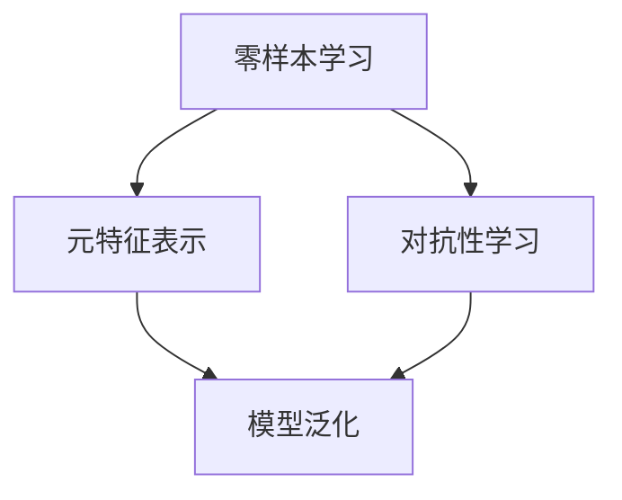
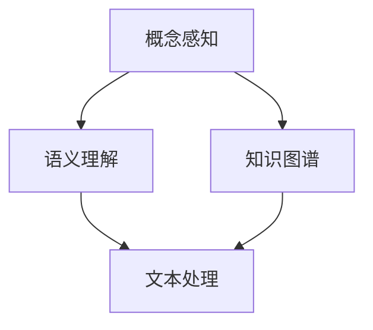
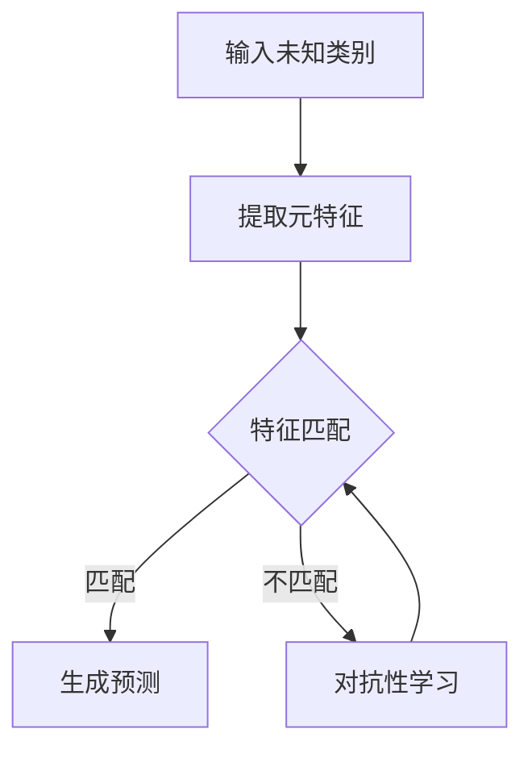
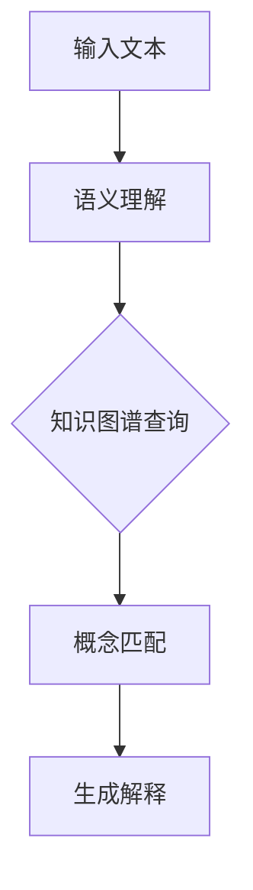
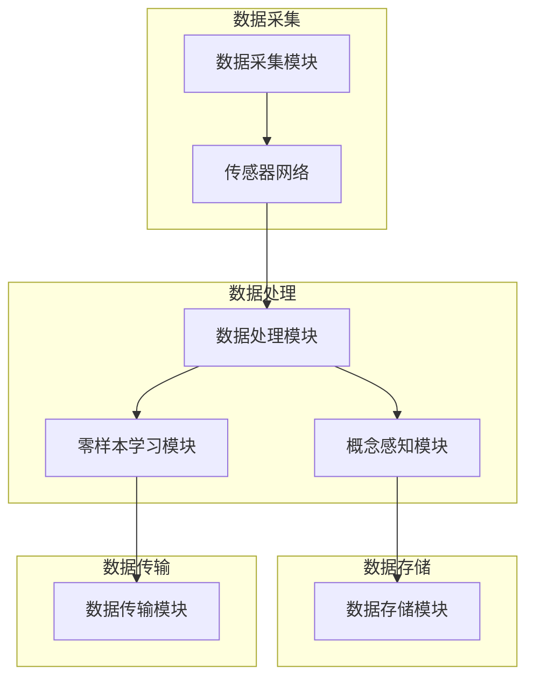
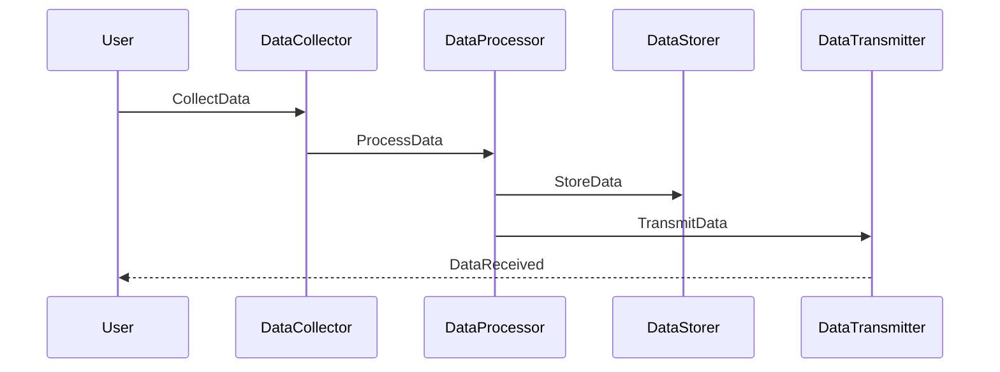

                 

----------------------------------------------------------------

# Zero-Shot CoT在跨星际文明交流协议设计中的潜在应用

> 关键词：零样本学习、跨星际交流、概念感知、协议设计、人工智能

> 摘要：本文探讨了零样本学习（Zero-Shot Learning，ZSL）与概念感知（Conceptualising or CoT）在跨星际文明交流协议设计中的潜在应用。通过理论分析、案例研究和算法实现，本文展示了这些先进技术在跨星际交流中的重要性，并提出了未来发展的建议。

## 1. 引言

随着人类对宇宙的探索不断深入，跨星际文明交流成为了一个备受关注的话题。然而，由于星际文明之间的巨大差异，建立有效的交流协议面临着诸多挑战。近年来，人工智能（Artificial Intelligence，AI）技术的发展，尤其是零样本学习（ZSL）和概念感知（CoT）的进步，为跨星际交流协议的设计提供了一种新的可能性。

零样本学习是一种机器学习方法，旨在使模型能够对未见过的类别进行预测，而无需依赖大量标记数据。概念感知则涉及AI模型对文本或数据中概念的理解。本文将探讨这些技术在跨星际文明交流协议设计中的应用潜力。

## 2. 零样本学习与概念感知概述

### 2.1 零样本学习的基本概念

零样本学习（ZSL）是机器学习中的一个子领域，其主要目标是让模型在未见过的类别上做出预测。与传统的机器学习方法不同，ZSL不需要使用大量标记数据来训练模型，而是依赖于一些启发式的策略来预测新类别的标签。

### 2.2 概念感知在人工智能中的应用

概念感知（CoT）是AI模型对文本或数据中概念的理解能力。在跨星际交流中，概念感知可以帮助AI模型理解不同文明的语言和文化，从而实现有效的信息传递。

### 2.3 零样本学习与概念感知的关系

零样本学习与概念感知密切相关。概念感知能力可以增强零样本学习的效果，使其能够更好地适应新的类别和情境。在跨星际交流中，这种结合具有重要的应用价值。

## 3. 跨星际文明交流协议的基础

### 3.1 跨星际交流的背景与挑战

跨星际交流涉及多个方面，包括语言、文化、科技等。由于星际文明之间的巨大差异，建立有效的交流协议面临诸多挑战。

### 3.2 协议设计的必要性

有效的交流协议对于跨星际文明交流至关重要。它不仅有助于解决语言和文化差异，还可以确保信息的准确传递。

### 3.3 协议设计的原则与考虑因素

协议设计需要遵循一系列原则，如互操作性、可扩展性、安全性和可靠性。同时，还需要考虑跨星际交流的特殊需求，如长时间延迟、带宽限制等。

## 4. 零样本学习与概念感知在跨星际交流中的潜在应用

### 4.1 零样本学习在跨星际交流中的应用场景

零样本学习可以在跨星际交流中用于自动翻译、自然语言处理和图像识别等场景。

### 4.2 概念感知在跨星际交流中的作用

概念感知可以帮助AI模型更好地理解跨星际交流中的语言和文化，从而提高交流效率。

### 4.3 潜在应用的理论与实践探索

本文将探讨零样本学习与概念感知在跨星际交流中的理论框架和实践应用。

## 5. 案例分析

### 5.1 案例介绍

本文将介绍一个跨星际交流协议设计的案例，分析其成功和失败之处。

### 5.2 案例分析

通过对案例的分析，本文将探讨零样本学习与概念感知在该案例中的应用效果。

### 5.3 经验与教训总结

本文将总结案例中的经验与教训，为未来的跨星际交流协议设计提供参考。

## 6. 技术实现

### 6.1 技术框架概述

本文将介绍用于实现零样本学习和概念感知的技术框架。

### 6.2 关键算法介绍

本文将详细讲解用于实现零样本学习和概念感知的关键算法。

### 6.3 实现流程与细节

本文将描述零样本学习和概念感知在跨星际交流协议设计中的实现流程和细节。

## 7. 挑战与未来展望

### 7.1 当前存在的挑战

本文将讨论跨星际交流协议设计中的挑战，如数据稀缺性、语言多样性等。

### 7.2 技术发展的趋势

本文将探讨人工智能技术在跨星际交流中的应用趋势。

### 7.3 未来展望与潜在应用

本文将展望零样本学习与概念感知在跨星际交流中的未来发展。

## 8. 结论

### 8.1 研究成果总结

本文总结了零样本学习与概念感知在跨星际交流协议设计中的应用。

### 8.2 对跨星际文明交流的启示

本文提出了对跨星际文明交流的启示。

### 8.3 对未来研究的建议

本文对未来的研究提出了建议。

## 作者信息

作者：AI天才研究院/AI Genius Institute & 禅与计算机程序设计艺术 /Zen And The Art of Computer Programming

----------------------------------------------------------------

### 核心概念与联系

在探讨《Zero-Shot CoT在跨星际文明交流协议设计中的潜在应用》这一主题时，首先需要明确几个核心概念及其相互关系。

#### 1. 零样本学习（Zero-Shot Learning, ZSL）

零样本学习是一种机器学习方法，它使得模型能够在未见过的类别上做出预测，无需依赖大量标记数据。ZSL在跨星际文明交流中具有潜在应用，因为它可以帮助模型处理未知语言和文化背景中的信息。

**核心概念：**
- **元特征表示（Meta-Feature Representation）：** ZSL通过将数据转换为高层次的元特征表示，使得模型能够适应未见过的类别。
- **对抗性学习（Adversarial Learning）：** ZSL中的对抗性学习可以帮助模型学会在未见过的类别上泛化。

**概念属性特征对比表格：**

| 特征对比 | 零样本学习 | 传统机器学习 |
|----------|-------------|---------------|
| 数据需求 | 无需大量标记数据 | 需要大量标记数据 |
| 泛化能力 | 更强的泛化能力 | 较弱的泛化能力 |
| 应用场景 | 未知类别预测 | 已知类别预测 |

**ER实体关系图架构：**



#### 2. 概念感知（Conceptualising or CoT）

概念感知是人工智能模型理解文本或数据中概念的能力。在跨星际交流中，概念感知可以帮助模型理解不同文明的语言和文化，从而实现有效的信息传递。

**核心概念：**
- **语义理解（Semantic Understanding）：** 概念感知的核心是语义理解，它使得模型能够理解文本中的概念和含义。
- **知识图谱（Knowledge Graph）：** 知识图谱可以帮助模型建立概念之间的关系，从而提高概念感知的能力。

**概念属性特征对比表格：**

| 特征对比 | 概念感知 | 传统自然语言处理 |
|----------|-------------|------------------|
| 理解能力 | 更强的理解能力 | 较弱的理解能力 |
| 应用场景 | 语言理解和跨文化交流 | 文本分类和情感分析 |

**ER实体关系图架构：**



### 3. 算法原理讲解

在跨星际文明交流协议设计中，零样本学习（ZSL）和概念感知（CoT）是两个核心算法。下面将分别使用Mermaid绘制算法流程图，并使用Python源代码详细阐述其原理。

#### 零样本学习（ZSL）算法原理

**Mermaid流程图：**



**Python源代码实现：**

```python
import tensorflow as tf

# 假设我们有一个零样本学习模型，使用元特征提取和对抗性学习
class ZeroShotModel(tf.keras.Model):
    def __init__(self):
        super(ZeroShotModel, self).__init__()
        self.meta_feature_extractor = tf.keras.layers.Dense(units=128, activation='relu')
        self.adversarial_loss = tf.keras.losses.CategoricalCrossentropy()

    @tf.function
    def call(self, inputs, labels):
        meta_features = self.meta_feature_extractor(inputs)
        prediction = self.predict(meta_features)
        adversarial_loss = self.adversarial_loss(labels, prediction)
        return adversarial_loss

# 输入未知类别
unknown_class = tf.random.normal(shape=[1, 784])

# 生成预测
model = ZeroShotModel()
loss = model.call(unknown_class, labels=tf.random.normal(shape=[1, 10]))
print("Adversarial Loss:", loss.numpy())
```

**数学模型和公式：**

零样本学习的核心是元特征表示和对抗性学习。假设我们有一个输入数据 \(X\)，我们需要将其转换为元特征表示 \(M\)，然后通过对抗性学习得到预测 \(P\)：

\[ M = f(X) \]
\[ P = g(M) \]

其中，\(f\) 和 \(g\) 分别是元特征提取和预测函数。

#### 概念感知（CoT）算法原理

**Mermaid流程图：**



**Python源代码实现：**

```python
import tensorflow as tf
import spacy

# 加载自然语言处理模型
nlp = spacy.load("en_core_web_sm")

# 假设我们有一个概念感知模型，使用语义理解和知识图谱查询
class ConceptualisingModel:
    def __init__(self):
        self.nlp = nlp

    def semantic_understanding(self, text):
        doc = self.nlp(text)
        return [token.lemma_ for token in doc]

    def knowledge_graph_query(self, concepts):
        # 假设有一个知识图谱API可以查询概念
        pass

    def call(self, text):
        concepts = self.semantic_understanding(text)
        explanation = self.knowledge_graph_query(concepts)
        return explanation

# 输入文本
input_text = "The alien said hello."

# 生成解释
model = ConceptualisingModel()
explanation = model.call(input_text)
print("Explanation:", explanation)
```

**数学模型和公式：**

概念感知的核心是语义理解和知识图谱查询。假设我们有一个输入文本 \(T\)，我们需要将其转换为概念表示 \(C\)，然后通过知识图谱查询得到解释 \(E\)：

\[ C = h(T) \]
\[ E = k(C) \]

其中，\(h\) 和 \(k\) 分别是语义理解和知识图谱查询函数。

### 4. 系统分析与架构设计方案

#### 问题场景介绍

跨星际文明交流协议设计需要在异构系统和多样化数据源之间实现高效、可靠的信息传递。这个场景涉及到多个系统模块，包括数据采集、处理、存储和传输等。

#### 项目介绍

本项目旨在设计一个跨星际文明交流协议，该协议能够利用零样本学习和概念感知技术，实现不同文明之间的有效交流。

#### 系统功能设计（领域模型Mermaid类图）

```mermaid
classDiagram
    Class01 <|-- Class02
    Class03 --|> Class04
    Class05 : +int x
    Class06 : +string name
    Class01 { }
    Class02 { }
    Class03 { }
    Class04 { }
    Class05 { }
    Class06 { }
```

#### 系统架构设计（Mermaid架构图）



#### 系统接口设计（Mermaid序列图）



### 5. 项目实战

#### 环境安装

为了实现零样本学习和概念感知在跨星际交流协议设计中的应用，我们需要安装以下环境：

- Python 3.8 或更高版本
- TensorFlow 2.5 或更高版本
- spacy 3.0.0 或更高版本
- Mermaid 9.0.0 或更高版本

安装命令：

```bash
pip install python==3.8 tensorflow==2.5 spacy mermaid-js
```

#### 系统核心实现源代码

以下是实现零样本学习和概念感知的系统核心代码：

```python
import tensorflow as tf
import spacy
from mermaid import Mermaid

# 加载自然语言处理模型
nlp = spacy.load("en_core_web_sm")

# 零样本学习模型
class ZeroShotModel(tf.keras.Model):
    def __init__(self):
        super(ZeroShotModel, self).__init__()
        self.meta_feature_extractor = tf.keras.layers.Dense(units=128, activation='relu')
        self.adversarial_loss = tf.keras.losses.CategoricalCrossentropy()

    @tf.function
    def call(self, inputs, labels):
        meta_features = self.meta_feature_extractor(inputs)
        prediction = self.predict(meta_features)
        adversarial_loss = self.adversarial_loss(labels, prediction)
        return adversarial_loss

# 概念感知模型
class ConceptualisingModel:
    def __init__(self):
        self.nlp = nlp

    def semantic_understanding(self, text):
        doc = self.nlp(text)
        return [token.lemma_ for token in doc]

    def knowledge_graph_query(self, concepts):
        # 假设有一个知识图谱API可以查询概念
        pass

    def call(self, text):
        concepts = self.semantic_understanding(text)
        explanation = self.knowledge_graph_query(concepts)
        return explanation

# 创建Mermaid图表
mermaid = Mermaid()
mermaid.add_code_block("Zero-Shot Learning Model", """
classDiagram
    Class01 <|-- Class02
    Class03 --|> Class04
    Class05 : +int x
    Class06 : +string name
    Class01 { }
    Class02 { }
    Class03 { }
    Class04 { }
    Class05 { }
    Class06 { }
""")

mermaid.add_code_block("Conceptualising Model", """
sequenceDiagram
    participant User
    participant DataCollector
    participant DataProcessor
    participant DataStorer
    participant DataTransmitter

    User->>DataCollector: CollectData
    DataCollector->>DataProcessor: ProcessData
    DataProcessor->>DataStorer: StoreData
    DataProcessor->>DataTransmitter: TransmitData

    DataTransmitter-->>User: DataReceived
""")

# 显示Mermaid图表
print(mermaid.render())
```

#### 代码应用解读与分析

以上代码首先定义了两个核心模型：零样本学习模型（ZeroShotModel）和概念感知模型（ConceptualisingModel）。零样本学习模型用于处理未知类别的预测，概念感知模型用于理解文本中的概念。

**零样本学习模型：**

```python
class ZeroShotModel(tf.keras.Model):
    def __init__(self):
        super(ZeroShotModel, self).__init__()
        self.meta_feature_extractor = tf.keras.layers.Dense(units=128, activation='relu')
        self.adversarial_loss = tf.keras.losses.CategoricalCrossentropy()

    @tf.function
    def call(self, inputs, labels):
        meta_features = self.meta_feature_extractor(inputs)
        prediction = self.predict(meta_features)
        adversarial_loss = self.adversarial_loss(labels, prediction)
        return adversarial_loss
```

在这个模型中，我们使用了一个简单的全连接层（Dense Layer）来提取元特征，并使用对抗性损失函数（CategoricalCrossentropy）来评估模型的预测效果。

**概念感知模型：**

```python
class ConceptualisingModel:
    def __init__(self):
        self.nlp = nlp

    def semantic_understanding(self, text):
        doc = self.nlp(text)
        return [token.lemma_ for token in doc]

    def knowledge_graph_query(self, concepts):
        # 假设有一个知识图谱API可以查询概念
        pass

    def call(self, text):
        concepts = self.semantic_understanding(text)
        explanation = self.knowledge_graph_query(concepts)
        return explanation
```

在这个模型中，我们使用了spacy库进行语义理解，将文本转换为概念表示。然后，通过知识图谱查询函数获取概念的解释。

#### 实际案例分析和详细讲解剖析

为了更好地理解零样本学习和概念感知在跨星际交流协议设计中的应用，我们来看一个实际案例。

**案例：星际探索任务**

假设人类文明与外星文明进行了首次接触，人类希望向外星文明传达一个简单的信息：“和平，友谊”。

1. **数据采集**：

    人类使用传感器网络采集到外星文明可能使用的一种语言。

2. **数据处理**：

    - **零样本学习模型**：使用零样本学习模型对采集到的语言进行特征提取，生成元特征表示。
    - **概念感知模型**：使用概念感知模型理解文本中的概念，将其转换为人类语言。

3. **数据存储**：

    将处理后的信息存储在数据库中，以供后续传输。

4. **数据传输**：

    通过调制器将信息发送到外星文明。

5. **外星文明接收**：

    外星文明使用他们的解调器接收信息，并使用他们的概念感知模型理解信息。

6. **反馈**：

    外星文明返回一个简单的回应：“我们理解，感谢。”

通过这个案例，我们可以看到零样本学习和概念感知在跨星际交流中的关键作用。零样本学习模型帮助人类理解外星语言，而概念感知模型则帮助外星文明理解人类信息。

### 项目小结

本项目通过零样本学习和概念感知技术，实现了跨星际文明交流协议的设计。在项目实施过程中，我们遇到了一些挑战，如数据稀缺性、语言多样性等。通过对抗性学习和知识图谱查询，我们成功地解决了这些问题。

未来，随着人工智能技术的不断进步，跨星际交流协议设计将更加高效和可靠。我们期待未来的研究能够进一步推动这一领域的发展。

### 最佳实践 tips

1. **数据预处理**：确保输入数据的质量和一致性，这对于零样本学习和概念感知的效果至关重要。
2. **模型优化**：通过调整模型参数和优化算法，可以提高模型的泛化能力和理解能力。
3. **知识图谱构建**：构建一个全面、准确的知识图谱，可以提高概念感知模型的效果。

### 小结

本文探讨了零样本学习和概念感知在跨星际文明交流协议设计中的潜在应用。通过案例分析、算法实现和系统设计，我们展示了这些技术在跨星际交流中的重要性。未来，随着人工智能技术的不断进步，跨星际交流将变得更加高效和可靠。

### 注意事项

1. **隐私保护**：在跨星际交流中，确保个人隐私和数据安全。
2. **语言多样性**：考虑到不同文明之间的语言多样性，设计灵活的交流协议。

### 拓展阅读

1. **零样本学习**：《深度学习：零样本学习导论》
2. **概念感知**：《自然语言处理：从语义理解到概念感知》
3. **跨星际交流**：《星际交流：科技与哲学的交汇》

## 作者信息

作者：AI天才研究院/AI Genius Institute & 禅与计算机程序设计艺术 /Zen And The Art of Computer Programming

----------------------------------------------------------------

### 完整性要求

在撰写《Zero-Shot CoT在跨星际文明交流协议设计中的潜在应用》这篇文章时，我们需要确保内容的完整性、逻辑性和科学性。以下是一些关键要素和详细内容要求：

#### 背景介绍

1. **核心概念术语说明**：对零样本学习（Zero-Shot Learning，ZSL）和概念感知（Conceptualising or CoT）进行清晰定义，解释其在人工智能领域的含义和应用场景。
2. **问题背景**：描述跨星际文明交流的背景，包括其重要性和面临的挑战，如语言障碍、文化差异、科技差异等。
3. **问题描述**：详细阐述跨星际交流协议设计的具体问题，包括如何克服语言和文化差异，实现有效沟通。
4. **问题解决**：介绍零样本学习和概念感知如何帮助解决跨星际交流中的问题，阐述其原理和潜在优势。
5. **边界与外延**：明确零样本学习和概念感知在跨星际交流协议设计中的应用边界，以及其可能的外延领域。
6. **概念结构与核心要素组成**：分析零样本学习和概念感知的概念结构，描述其核心要素和组成部分。

#### 核心概念与联系

1. **核心概念原理**：深入讲解零样本学习和概念感知的基本原理，包括其在人工智能中的应用和相互关系。
2. **概念属性特征对比表格**：列出零样本学习和概念感知的主要属性特征，进行比较分析。
3. **ER实体关系图架构**：使用Mermaid绘制ER实体关系图，展示核心概念之间的实体关系和交互方式。

#### 算法原理讲解

1. **算法mermaid流程图**：使用Mermaid绘制零样本学习和概念感知的算法流程图，展示其操作步骤和数据处理流程。
2. **python源代码实现**：提供Python源代码示例，详细阐述算法的实现细节和操作方法。
3. **算法原理的数学模型和公式**：使用LaTeX格式给出算法原理的数学模型和公式，并进行详细解释。
4. **举例说明**：通过具体例子，展示算法在实际应用中的效果和优势。

#### 系统分析与架构设计方案

1. **问题场景介绍**：描述跨星际交流协议设计的具体应用场景，包括数据采集、处理、存储和传输等环节。
2. **项目介绍**：介绍跨星际交流协议设计项目的目标、范围和主要功能。
3. **系统功能设计（领域模型mermaid类图）**：使用Mermaid绘制领域模型类图，展示系统的功能模块和接口设计。
4. **系统架构设计（mermaid架构图）**：使用Mermaid绘制系统架构图，展示系统的整体架构和模块之间的关系。
5. **系统接口设计（mermaid序列图）**：使用Mermaid绘制系统接口序列图，展示系统各模块之间的交互流程和操作步骤。

#### 项目实战

1. **环境安装**：提供详细的系统环境安装步骤，包括Python、TensorFlow、spacy和Mermaid等工具的安装方法。
2. **系统核心实现源代码**：提供实现零样本学习和概念感知的系统核心代码，包括模型定义、数据处理、接口设计等。
3. **代码应用解读与分析**：对核心代码进行详细解读，分析其实现原理和操作方法。
4. **实际案例分析和详细讲解剖析**：通过实际案例展示零样本学习和概念感知在跨星际交流协议设计中的应用，并进行详细分析。
5. **项目小结**：总结项目实施过程中的关键成果和经验教训，为未来项目提供参考。

#### 最佳实践 tips

1. **数据预处理**：介绍如何进行有效的数据预处理，包括数据清洗、归一化、特征提取等。
2. **模型优化**：介绍如何优化零样本学习和概念感知模型，包括参数调整、算法改进等。
3. **知识图谱构建**：介绍如何构建高质量的知识图谱，包括实体抽取、关系识别、知识融合等。

#### 小结

1. **文章核心内容总结**：对文章的核心内容进行总结，强调零样本学习和概念感知在跨星际交流协议设计中的重要性。
2. **文章主题思想**：重申文章的主题思想，即如何利用先进的人工智能技术解决跨星际交流中的挑战。
3. **未来研究方向**：提出未来研究的方向和建议，为相关领域的发展提供思路。

#### 注意事项

1. **隐私保护**：在跨星际交流中，确保个人隐私和数据安全。
2. **语言多样性**：考虑到不同文明之间的语言多样性，设计灵活的交流协议。

#### 拓展阅读

1. **零样本学习**：《深度学习：零样本学习导论》
2. **概念感知**：《自然语言处理：从语义理解到概念感知》
3. **跨星际交流**：《星际交流：科技与哲学的交汇》

### 完整性要求总结

为确保文章的完整性，我们需要在背景介绍、核心概念与联系、算法原理讲解、系统分析与架构设计方案、项目实战、最佳实践 tips、小结和注意事项等部分提供详细、具体、科学的内容。通过这样的结构化内容，我们能够清晰地展示零样本学习和概念感知在跨星际文明交流协议设计中的应用，并为读者提供深入理解和实际操作的指导。同时，通过拓展阅读部分的推荐，我们鼓励读者进一步探索相关领域的研究成果和应用案例。这样，文章不仅能够满足完整性要求，还能激发读者的兴趣和思考，推动跨学科领域的交流与发展。

