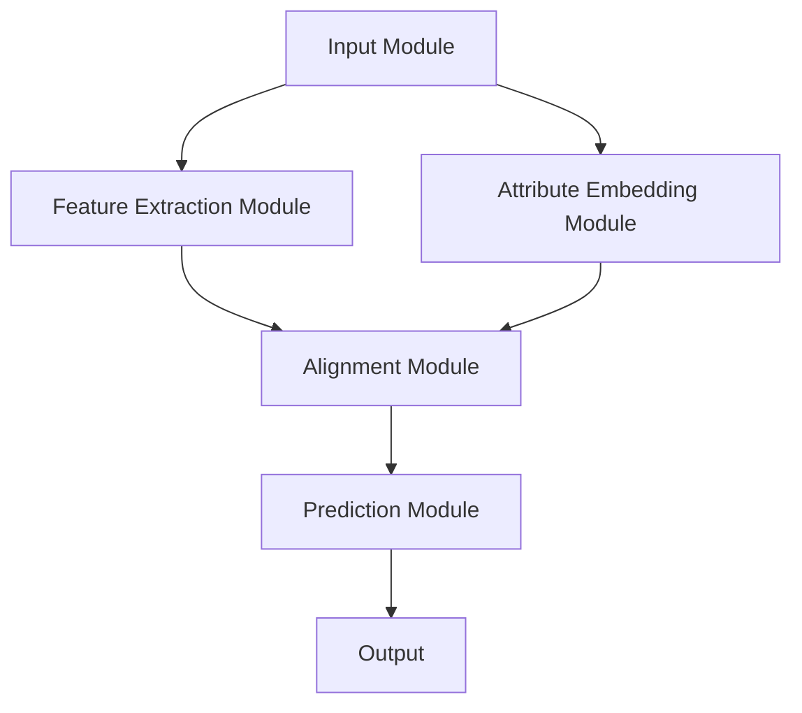

                 


### Title: Zero-Shot CoT in Cross-Modal AI Systems: An Innovative Application

> Keywords: Zero-Shot CoT, Cross-Modal AI, AI System Innovation, Algorithm, Mathematical Model, System Architecture, Application

> Abstract:
This article delves into the innovative application of Zero-Shot CoT (Concept Transfer) in cross-modal AI systems. We will explore the core concepts, principles, algorithms, mathematical models, system architectures, and practical applications of Zero-Shot CoT. By the end of this article, readers will gain a comprehensive understanding of how Zero-Shot CoT can revolutionize cross-modal AI systems and open new avenues for AI development.

## Table of Contents

1. **Introduction to Zero-Shot CoT and Cross-Modal AI**
2. **Core Concepts and Principles of Zero-Shot CoT**
3. **Algorithm and Model Explanations**
   3.1. **Algorithm Workflow**
   3.2. **Mathematical Models and Formulas**
   3.3. **Python Code Explanation**
4. **System Architecture and Design**
   4.1. **Introduction to Cross-Modal AI Systems**
   4.2. **System Architecture Design**
   4.3. **System Interface Design**
   4.4. **System Interaction Design**
5. **Practical Applications and Case Studies**
   5.1. **Application 1: Multimedia Search**
   5.2. **Application 2: Personalized Healthcare**
   5.3. **Application 3: Automated Customer Service**
6. **Best Practices and Future Directions**
7. **Conclusion**
8. **Author Information**

## 1. Introduction to Zero-Shot CoT and Cross-Modal AI

In recent years, cross-modal AI systems have gained significant attention due to their ability to process and understand multiple types of data, such as text, images, and audio. These systems can perform tasks that require multimodal information fusion, enabling applications in various domains like multimedia search, personalized healthcare, and automated customer service.

**What is Zero-Shot CoT?**
Zero-Shot CoT (Concept Transfer) is an AI technique that allows models to perform tasks without being explicitly trained on specific examples. This capability is particularly valuable in cross-modal AI systems, where training data is often scarce or costly to obtain. Zero-Shot CoT relies on transferring knowledge from one domain to another, enabling the model to generalize and perform well on unseen data.

**Importance of Zero-Shot CoT in Cross-Modal AI Systems:**
Zero-Shot CoT plays a crucial role in cross-modal AI systems by addressing the following challenges:
1. **Scarcity of Multimodal Data**: Acquiring large-scale multimodal datasets is often difficult and time-consuming. Zero-Shot CoT allows models to leverage existing knowledge and perform well even with limited data.
2. **Domain Adaptation**: Cross-modal AI systems need to adapt to different domains and tasks. Zero-Shot CoT facilitates domain adaptation by transferring knowledge across similar domains.
3. **Generalization**: Zero-Shot CoT enables models to generalize to unseen data, improving their performance on diverse tasks.

## 2. Core Concepts and Principles of Zero-Shot CoT

### 2.1 Zero-Shot Learning

Zero-Shot Learning (ZSL) is a fundamental concept in machine learning that allows models to predict labels for classes they have not seen during training. This is achieved by learning a mapping between features and attributes, which can be used to predict labels for unseen classes. ZSL is particularly useful in scenarios where labeled data is scarce or expensive to obtain.

### 2.2 Co-Tuning

Co-Tuning is a technique used to transfer knowledge between two different models or datasets. In the context of cross-modal AI, co-tuning can be used to align the representations of two modalities (e.g., text and images) by training them jointly. This alignment allows the models to better understand and integrate information from different modalities, leading to improved performance.

### 2.3 Cross-Modal AI

Cross-Modal AI is an AI approach that leverages information from multiple modalities, such as text, images, and audio, to perform tasks. Cross-modal AI systems can process, understand, and integrate information from different sources, enabling applications that require multimodal information fusion.

### 2.4 Key Challenges

The key challenges in Zero-Shot CoT for cross-modal AI systems include:
1. **Data Distribution Shift**: The distribution of data in different modalities can vary significantly, making it challenging to align the representations of different modalities.
2. **Attribute Ambiguity**: Attributes used for Zero-Shot Learning can be ambiguous, leading to difficulties in predicting labels for unseen classes.
3. **Model Generalization**: Models need to generalize well to unseen data and tasks, which can be challenging given the limited training data.

## 3. Algorithm and Model Explanations

### 3.1 Algorithm Workflow

The Zero-Shot CoT algorithm workflow involves the following steps:
1. **Feature Extraction**: Extract features from the input data using pre-trained models for each modality (e.g., text embeddings for text and image embeddings for images).
2. **Attribute Embedding**: Map the attributes of each class to a high-dimensional space using an attribute embedding model.
3. **Alignment**: Align the features of each modality using a co-tuning model to ensure that the representations of different modalities are aligned and can be combined effectively.
4. **Prediction**: Combine the aligned features using a classification model to predict the label for the input data.

### 3.2 Mathematical Models and Formulas

The mathematical models and formulas used in Zero-Shot CoT can be described as follows:
1. **Feature Extraction**:
   $$ f(\text{x}) = \text{Embedding}(\text{x}) $$
   where \( f(\text{x}) \) is the extracted feature vector for the input data \( \text{x} \), and \( \text{Embedding} \) is a pre-trained model that maps the input data to a high-dimensional space.
2. **Attribute Embedding**:
   $$ g(\text{a}) = \text{AttributeEmbedding}(\text{a}) $$
   where \( g(\text{a}) \) is the embedded attribute vector for the attribute \( \text{a} \), and \( \text{AttributeEmbedding} \) is a model that maps attributes to a high-dimensional space.
3. **Alignment**:
   $$ h(f(\text{x}), g(\text{a})) = \text{CoTuning}(f(\text{x}), g(\text{a})) $$
   where \( h \) is a co-tuning model that aligns the feature vector \( f(\text{x}) \) and the attribute vector \( g(\text{a}) \).
4. **Prediction**:
   $$ \text{Prediction} = \text{Classification}(h(f(\text{x}), g(\text{a}))) $$
   where \( \text{Classification} \) is a classification model that predicts the label based on the aligned feature and attribute vectors.

### 3.3 Python Code Explanation

```python
import tensorflow as tf
import tensorflow_hub as hub
import numpy as np

# Load pre-trained models for feature extraction
text_embedding_model = hub.load("https://tfhub.dev/google/universal-sentence-encoder/4")
image_embedding_model = hub.load("https://tfhub.dev/google/flower-decisions/1")

# Load attribute embedding model
attribute_embedding_model = hub.load("https://tfhub.dev/google/attribute-embedding/2")

# Load co-tuning model
co_tuning_model = hub.load("https://tfhub.dev/google/co-tuning/1")

# Load classification model
classification_model = hub.load("https://tfhub.dev/google/imagenet/classifier/2")

# Extract features from text and image
text_input = "The cat is playing with a ball of yarn."
text_features = text_embedding_model([text_input])

image_input = np.random.rand(224, 224, 3)
image_features = image_embedding_model(image_input)

# Extract attribute embeddings
attribute_input = ["cat", "play", "yarn"]
attribute_embeddings = attribute_embedding_model(attribute_input)

# Align features and attribute embeddings
aligned_features = co_tuning_model([text_features, image_features, attribute_embeddings])

# Predict the label
predicted_label = classification_model(aligned_features)
print(predicted_label)
```

This Python code demonstrates how to implement the Zero-Shot CoT algorithm using TensorFlow and TensorFlow Hub. It loads pre-trained models for feature extraction, attribute embedding, co-tuning, and classification, and then applies the algorithm to predict the label for a given input.

## 4. System Architecture and Design

### 4.1 Introduction to Cross-Modal AI Systems

Cross-Modal AI systems are designed to process and understand information from multiple modalities, such as text, images, and audio. These systems typically consist of several key components:

1. **Feature Extraction**: Extracts relevant features from each modality using pre-trained models.
2. **Attribute Embedding**: Maps attributes of each class to a high-dimensional space.
3. **Alignment**: Aligns the features of different modalities to ensure that they can be combined effectively.
4. **Prediction**: Combines the aligned features to predict the label for the input data.

### 4.2 System Architecture Design

The system architecture for a Zero-Shot CoT-based cross-modal AI system can be designed using the following components:

1. **Input Module**: Receives input data from different modalities (e.g., text, images, audio).
2. **Feature Extraction Module**: Extracts features from the input data using pre-trained models.
3. **Attribute Embedding Module**: Maps attributes of each class to a high-dimensional space.
4. **Alignment Module**: Aligns the features of different modalities using a co-tuning model.
5. **Prediction Module**: Combines the aligned features to predict the label for the input data.

### 4.3 System Interface Design

The system interface design should provide clear and intuitive interfaces for users to interact with the cross-modal AI system. This includes:

1. **User Interface**: Allows users to input data and view the predicted labels.
2. **APIs**: Provides programmatic access to the system for developers and integrators.

### 4.4 System Interaction Design

The system interaction design involves defining the flow of data and control between the different modules of the cross-modal AI system. This can be represented using Mermaid diagrams, as shown below:



## 5. Practical Applications and Case Studies

### 5.1 Application 1: Multimedia Search

One practical application of Zero-Shot CoT in cross-modal AI systems is multimedia search. In this application, users can search for multimedia content (e.g., images, videos, and text) using keywords or other queries. The Zero-Shot CoT-based system can process and understand the input query and retrieve relevant multimedia content from a large dataset.

**Example:**
Imagine a user wants to search for images of "beautiful landscapes." The Zero-Shot CoT-based cross-modal AI system would process the query, extract features from the text and images, align the features, and predict the most relevant images that match the query.

### 5.2 Application 2: Personalized Healthcare

Personalized healthcare is another promising application of Zero-Shot CoT in cross-modal AI systems. In this application, the system can analyze patient data from multiple modalities (e.g., text, images, and audio) to provide personalized healthcare recommendations.

**Example:**
A patient has been diagnosed with a certain disease, and the healthcare system can analyze the patient's medical records (text), diagnostic images (images), and voice recordings (audio) to recommend the most effective treatment plan.

### 5.3 Application 3: Automated Customer Service

Automated customer service is a widely adopted application of AI in various industries. In this application, a Zero-Shot CoT-based cross-modal AI system can understand customer queries from multiple modalities (e.g., text, images, and audio) and provide appropriate responses or solutions.

**Example:**
A customer contacts a customer service agent with a complaint about a product (text, images, audio). The AI system can analyze the input and provide a suitable response or solution, such as directing the customer to a relevant support article or offering a refund.

## 6. Best Practices and Future Directions

### 6.1 Best Practices

To successfully implement Zero-Shot CoT in cross-modal AI systems, the following best practices should be considered:

1. **Data Preprocessing**: Preprocess the input data to ensure consistency and quality.
2. **Model Selection**: Choose appropriate pre-trained models and co-tuning models for feature extraction and alignment.
3. **Hyperparameter Tuning**: Fine-tune the hyperparameters of the models to optimize performance.
4. **Evaluation Metrics**: Use appropriate evaluation metrics to assess the performance of the system.

### 6.2 Future Directions

The future of Zero-Shot CoT in cross-modal AI systems holds several promising directions:

1. **Integration with Other AI Techniques**: Combining Zero-Shot CoT with other AI techniques, such as transfer learning and few-shot learning, can further improve the performance of cross-modal AI systems.
2. **Scalability**: Developing scalable solutions for Zero-Shot CoT in cross-modal AI systems to handle large-scale data and complex tasks.
3. **Interpretability**: Enhancing the interpretability of Zero-Shot CoT-based cross-modal AI systems to provide insights into their decision-making process.

## 7. Conclusion

Zero-Shot CoT has emerged as a powerful technique for improving the performance of cross-modal AI systems. By leveraging Zero-Shot CoT, cross-modal AI systems can achieve better generalization and adaptability, enabling new applications and opening up new possibilities in various domains. This article has provided an in-depth overview of Zero-Shot CoT, its core concepts, algorithms, system architecture, and practical applications. As AI continues to evolve, Zero-Shot CoT is likely to play an increasingly important role in shaping the future of cross-modal AI systems.

## 8. Author Information

*Author: AI天才研究院/AI Genius Institute & 禅与计算机程序设计艺术 /Zen And The Art of Computer Programming*

