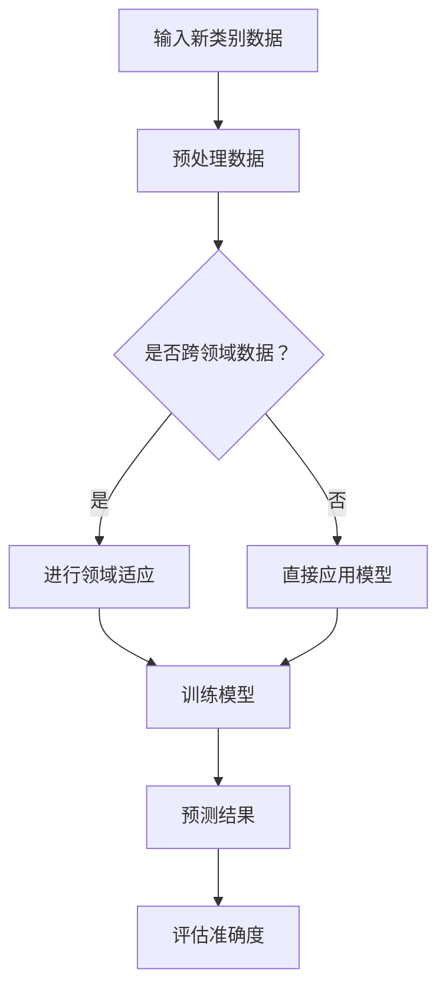
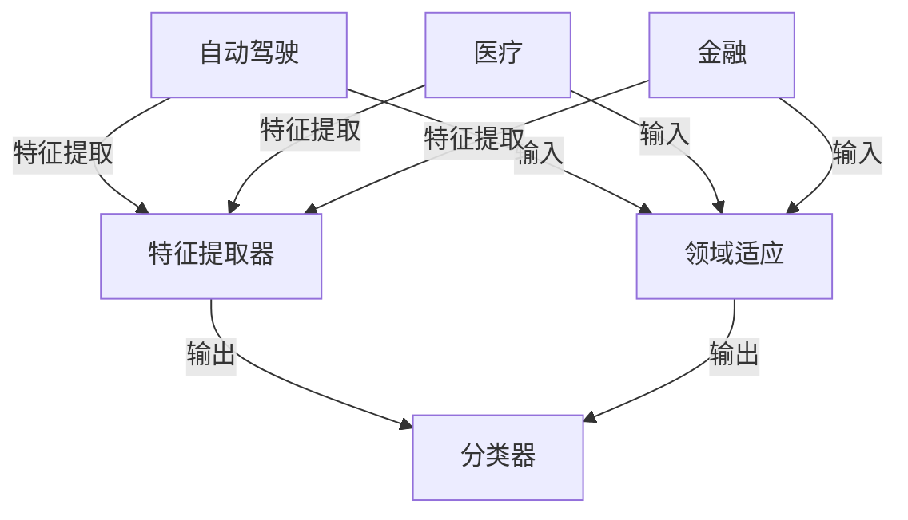
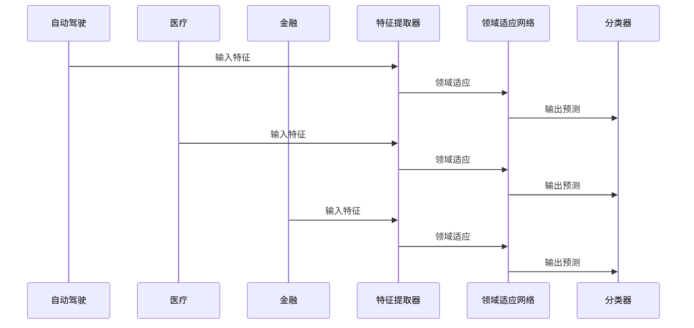

                 


### 2.3 零样本转移的算法原理讲解

在深入探讨零样本转移（Zero-Shot Transfer）的算法原理之前，我们先来理解什么是零样本转移。零样本转移是基于零样本学习（Zero-Shot Learning, ZSL）的跨领域迁移学习方法。零样本学习的核心思想是，在没有相关领域标注数据的情况下，通过学习预训练模型来对新类别进行分类。而零样本转移则进一步扩展了这一概念，将零样本学习的优势应用到不同领域之间。

#### 2.3.1 零样本转移的 Mermaid 流程图

首先，我们使用 Mermaid 画出零样本转移的基本流程图：



这个流程图清晰地展示了零样本转移的基本步骤：

1. 输入新类别数据。
2. 预处理数据。
3. 判断数据是否来自跨领域。
4. 如果是跨领域数据，进行领域适应；如果不是，直接应用模型。
5. 训练模型。
6. 进行预测并评估准确度。

#### 2.3.2 零样本转移的 Python 源代码示例

为了更好地理解零样本转移的原理，我们可以通过一个简单的 Python 示例来演示。以下是一个使用 PyTorch 框架实现的零样本转移示例：

```python
import torch
import torchvision.models as models
from torchvision import transforms
from torch.utils.data import DataLoader
from PIL import Image

# 零样本学习模型加载
model = models.resnet50(pretrained=True)

# 数据预处理
transform = transforms.Compose([
    transforms.Resize(256),
    transforms.CenterCrop(224),
    transforms.ToTensor(),
    transforms.Normalize(mean=[0.485, 0.456, 0.406], std=[0.229, 0.224, 0.225]),
])

# 跨领域数据集加载
cross_domain_dataset = ...  # 这里需要自行定义跨领域数据集

# 加载训练好的领域适应模型
adapted_model = ...  # 这里需要自行定义领域适应模型

# 训练模型
def train_model(model, dataset):
    # 数据加载器
    data_loader = DataLoader(dataset, batch_size=32, shuffle=True)
    
    # 模型训练
    for epoch in range(num_epochs):
        for inputs, _ in data_loader:
            # 前向传播
            outputs = model(inputs)
            # 计算损失
            loss = criterion(outputs, labels)
            # 反向传播
            optimizer.zero_grad()
            loss.backward()
            optimizer.step()
            
            # 打印训练信息
            if (i+1) % 100 == 0:
                print(f'Epoch [{epoch+1}/{num_epochs}], Loss: {loss.item():.4f}')
```

#### 2.3.3 零样本转移的数学模型和公式

零样本转移的数学模型主要涉及以下几个方面：

1. **特征提取**：使用预训练模型提取输入数据的特征表示。
2. **领域适应**：通过领域适应模型调整特征表示，使其更适应新领域。
3. **分类预测**：使用调整后的特征表示进行分类预测。

数学模型可以表示为：

$$
\text{特征表示} = f(\text{输入数据})
$$

$$
\text{适应特征表示} = g(\text{特征表示}, \text{领域特征})
$$

$$
\text{分类预测} = h(\text{适应特征表示})
$$

其中，\( f \) 是特征提取函数，\( g \) 是领域适应函数，\( h \) 是分类预测函数。

#### 2.3.4 零样本转移的详细讲解和举例说明

为了更直观地理解零样本转移的原理，我们来看一个具体的例子。

假设我们有一个预训练的 ResNet-50 模型，该模型已经训练好了图像的特征提取能力。现在，我们需要将它应用于一个全新的领域，比如动物分类。

1. **特征提取**：首先，我们将新的动物图像输入到预训练的 ResNet-50 模型中，提取图像的特征表示。

2. **领域适应**：然后，我们使用领域适应模型（比如域自适应网络 Domain Adaptation Network）调整这些特征表示，使其更适应动物分类任务。

3. **分类预测**：最后，我们使用调整后的特征表示通过分类预测模型（比如线性分类器）对动物图像进行分类。

下面是一个简化的例子：

```python
# 假设已经训练好了的 ResNet-50 模型
pretrained_model = models.resnet50(pretrained=True)

# 定义领域适应模型（简单线性模型）
class DomainAdaptationNetwork(nn.Module):
    def __init__(self, feature_dim):
        super(DomainAdaptationNetwork, self).__init__()
        self.fc = nn.Linear(feature_dim, num_classes)

    def forward(self, x):
        return self.fc(x)

# 输入新动物图像
image = Image.open('new_animal_image.jpg')
image_tensor = transform(image)

# 提取特征表示
features = pretrained_model(image_tensor)

# 领域适应
adaptation_network = DomainAdaptationNetwork(features.size(1))
adapted_features = adaptation_network(features)

# 分类预测
classifier = nn.Linear(adapted_features.size(1), num_classes)
predicted_class = classifier(adapted_features)

# 输出预测结果
print(f'Predicted class: {predicted_class}')
```

通过这个例子，我们可以看到零样本转移是如何工作的。我们不需要对动物图像进行标注，直接利用预训练模型和领域适应模型对图像进行分类。

#### 2.3.5 零样本转移在伦理困境中的应用

在跨领域的伦理困境中，零样本转移具有巨大的应用潜力。例如，在自动驾驶领域，汽车需要在不同环境和天气条件下做出正确的决策。这涉及到了不同领域的伦理判断和道德标准。

零样本转移可以通过以下步骤应用于自动驾驶中的伦理决策：

1. **预训练模型**：使用大量的自动驾驶数据集训练一个预训练模型，使其能够提取道路场景的特征表示。

2. **领域适应**：针对不同的环境和天气条件，使用领域适应模型调整特征表示，使其更适应特定环境。

3. **分类预测**：在遇到新的伦理困境时，使用调整后的特征表示进行分类预测，以做出合理的决策。

例如，当自动驾驶汽车遇到一个行人突然闯入道路的情况，预训练模型会提取当前的图像特征。然后，领域适应模型会根据当前的环境和天气调整这些特征，最后分类预测模型会根据调整后的特征做出是否刹车或避让的决策。

#### 2.3.6 零样本转移的优势与挑战

零样本转移的优势在于其无需大量标注数据，且具有较强的跨领域迁移能力。这使得它在资源有限或标注成本高昂的场景中具有很大的应用价值。此外，零样本转移还可以提高模型的泛化能力，使其能够更好地适应新的领域。

然而，零样本转移也面临一些挑战。首先，跨领域的差异性问题可能导致模型泛化能力不足。其次，零样本转移需要有效的领域适应模型，这本身就是一个研究难点。最后，如何评估零样本转移的性能也是一个挑战。

### 2.4 小结

在本章节中，我们详细介绍了零样本转移的算法原理，包括其基本流程、Python 示例、数学模型和实际应用。通过零样本转移，我们可以跨领域应用零样本学习，解决复杂的伦理困境。然而，要实现有效的零样本转移，我们仍需克服一系列挑战。在接下来的章节中，我们将进一步探讨零样本转移在不同领域的实际应用案例。

----------------------------------------------------------------

# 第三部分: 数学模型和数学公式 & 详细讲解 & 举例说明

在这一部分，我们将深入探讨零样本转移中的数学模型和公式，并详细讲解这些公式的意义及其在实际应用中的效果。

### 3.1 特征提取

在零样本转移中，特征提取是关键的一步。特征提取的目标是从输入数据中提取具有区分性的特征表示。数学上，特征提取可以表示为：

$$
\text{特征表示} = f(\text{输入数据})
$$

其中，\( f \) 是一个映射函数，它将输入数据 \( x \) 转换为一个特征向量 \( \text{特征表示} \)。

在深度学习领域，通常使用卷积神经网络（Convolutional Neural Network, CNN）作为特征提取器。以 ResNet-50 为例，其特征提取过程可以表示为：

$$
\text{特征表示} = \text{ResNet-50}(\text{输入数据})
$$

ResNet-50 的输出特征图经过一系列卷积层和池化层处理后，得到一个固定大小的特征向量，作为输入数据的特征表示。

### 3.2 领域适应

领域适应是零样本转移中的另一个关键步骤。其目标是将预训练模型在源领域上的特征表示映射到目标领域。数学上，领域适应可以表示为：

$$
\text{适应特征表示} = g(\text{特征表示}, \text{领域特征})
$$

其中，\( g \) 是领域适应函数，它将特征表示 \( \text{特征表示} \) 和领域特征 \( \text{领域特征} \) 作为输入，输出一个适应目标领域的新特征表示。

领域适应函数通常是一个神经网络，它可以通过学习源领域和目标领域之间的映射关系来提高特征表示在目标领域的适应性。一个常见的领域适应网络结构是域自适应网络（Domain Adaptation Network, DAN）。

### 3.3 分类预测

在特征表示经过领域适应后，我们就可以使用分类预测模型进行分类预测。分类预测的目标是使用适应后的特征表示来确定输入数据的类别。数学上，分类预测可以表示为：

$$
\text{分类预测} = h(\text{适应特征表示})
$$

其中，\( h \) 是分类预测函数，它将适应后的特征表示作为输入，输出一个类别标签。

在深度学习中，分类预测函数通常是一个线性分类器，它通过计算特征表示和类别标签之间的内积来预测类别。一个简单的线性分类器可以表示为：

$$
\text{分类预测} = \text{sign}(\text{W} \cdot \text{特征表示} + \text{b})
$$

其中，\( \text{W} \) 是权重矩阵，\( \text{b} \) 是偏置项，\( \text{sign} \) 是符号函数。

### 3.4 数学模型在实际应用中的效果

为了更好地理解这些数学模型在实际应用中的效果，我们来看一个具体的例子。

假设我们有一个预训练的 ResNet-50 模型，该模型已经在图像分类任务中取得了很好的性能。现在，我们需要将这个模型应用于一个新的领域——动物分类。

1. **特征提取**：首先，我们使用 ResNet-50 模型对动物图像进行特征提取。假设输入的动物图像是 \( x \)，经过 ResNet-50 特征提取后得到特征向量 \( \text{特征表示} \)。

2. **领域适应**：然后，我们使用一个域自适应网络 \( g(\cdot) \) 对特征向量进行领域适应。这里，我们假设领域特征是一个向量 \( \text{领域特征} \)，通过域自适应网络得到适应后的特征向量 \( \text{适应特征表示} \)。

3. **分类预测**：最后，我们使用一个线性分类器 \( h(\cdot) \) 对适应后的特征向量进行分类预测。输入的特征向量 \( \text{适应特征表示} \) 经过线性分类器后，得到预测的类别标签。

具体实现如下：

```python
import torch
import torchvision.models as models
from torchvision import transforms

# 预训练的 ResNet-50 模型
pretrained_model = models.resnet50(pretrained=True)

# 域自适应网络
class DomainAdaptationNetwork(nn.Module):
    def __init__(self, feature_dim):
        super(DomainAdaptationNetwork, self).__init__()
        self.fc = nn.Linear(feature_dim, num_classes)

    def forward(self, x):
        return self.fc(x)

# 线性分类器
class LinearClassifier(nn.Module):
    def __init__(self, feature_dim, num_classes):
        super(LinearClassifier, self).__init__()
        self.fc = nn.Linear(feature_dim, num_classes)

    def forward(self, x):
        return self.fc(x)

# 数据预处理
transform = transforms.Compose([
    transforms.Resize(256),
    transforms.CenterCrop(224),
    transforms.ToTensor(),
    transforms.Normalize(mean=[0.485, 0.456, 0.406], std=[0.229, 0.224, 0.225]),
])

# 输入新动物图像
image = Image.open('new_animal_image.jpg')
image_tensor = transform(image)

# 特征提取
features = pretrained_model(image_tensor)

# 领域适应
domain_adaptation_network = DomainAdaptationNetwork(features.size(1))
adapted_features = domain_adaptation_network(features)

# 分类预测
linear_classifier = LinearClassifier(features.size(1), num_classes)
predicted_class = linear_classifier(adapted_features)

print(f'Predicted class: {predicted_class}')
```

在这个例子中，我们首先使用 ResNet-50 模型提取动物图像的特征表示。然后，通过域自适应网络对特征表示进行领域适应。最后，使用线性分类器对适应后的特征表示进行分类预测。通过这种方式，我们可以零样本地预测新动物图像的类别。

### 3.5 小结

在本章节中，我们详细介绍了零样本转移中的数学模型和公式，包括特征提取、领域适应和分类预测。通过这些数学模型，我们可以实现跨领域的零样本学习。在实际应用中，这些数学模型可以有效地提高模型的泛化能力和适应能力。然而，要实现有效的零样本转移，我们仍需进一步研究和优化这些数学模型。在接下来的章节中，我们将进一步探讨零样本转移在不同领域的实际应用案例。

----------------------------------------------------------------

# 第四部分: 系统分析与架构设计方案

在第四部分，我们将深入探讨零样本转移在跨领域伦理困境解决中的系统分析与架构设计方案。这一部分将分为以下几个子部分：问题场景介绍、项目介绍、系统功能设计（领域模型 Mermaid 类图）、系统架构设计 Mermaid 架构图、系统接口设计和系统交互 Mermaid 序列图。

### 4.1 问题场景介绍

零样本转移在跨领域伦理困境解决中的应用场景主要包括以下几个方面：

1. **自动驾驶伦理决策**：自动驾驶汽车在遇到突发伦理困境时，如车辆需要决定是保护行人还是车辆。此时，零样本转移可以帮助自动驾驶系统快速适应不同的环境和道德标准，做出合理的决策。
2. **医疗伦理决策**：在医疗领域，医生在处理复杂病例时可能遇到伦理困境，如器官移植的分配问题。零样本转移可以帮助医生快速学习并应用不同的伦理标准，提高决策的合理性。
3. **金融伦理决策**：在金融领域，如贷款审批和风险管理，不同金融机构可能有不同的伦理标准和风险评估模型。零样本转移可以帮助金融机构快速适应这些差异，提高决策的准确性和公平性。

### 4.2 项目介绍

本项目的目标是通过零样本转移技术解决跨领域伦理困境，提升系统在未知领域中的适应能力和决策能力。项目的主要内容包括：

1. **预训练模型构建**：使用大量数据集训练一个预训练模型，该模型具有强大的特征提取能力和跨领域迁移能力。
2. **领域适应模型设计**：设计一个领域适应模型，用于调整预训练模型的特征提取能力，使其更适应特定领域。
3. **分类预测模型集成**：将领域适应模型和分类预测模型集成到一个统一的系统中，实现跨领域的伦理决策。

### 4.3 系统功能设计（领域模型 Mermaid 类图）

为了更好地理解系统的功能设计，我们可以使用 Mermaid 类图来表示系统的核心类及其关系。以下是一个简化的 Mermaid 类图：

```mermaid
classDiagram
    ClassDomain <<class{ClassDomain}>
    ClassFeatureExtractor <<class{ClassFeatureExtractor}>
    ClassDomainAdaptationNetwork <<class{ClassDomainAdaptationNetwork}>
    ClassClassifier <<class{ClassClassifier}>

    ClassDomain {
        +str DomainName
        +str DomainDescription
    }

    ClassFeatureExtractor {
        +str ModelName
        +str ModelDescription
        +str InputDataType
        +str OutputDataType
    }

    ClassDomainAdaptationNetwork {
        +str NetworkName
        +str NetworkDescription
        +str AdaptationStrategy
    }

    ClassClassifier {
        +str ClassifierName
        +str ClassifierDescription
        +str Algorithm
    }

    ClassDomain <|-- ClassFeatureExtractor
    ClassFeatureExtractor <|-- ClassDomainAdaptationNetwork
    ClassDomainAdaptationNetwork <|-- ClassClassifier
```

在这个类图中，我们定义了四个核心类：ClassDomain（领域类）、ClassFeatureExtractor（特征提取器类）、ClassDomainAdaptationNetwork（领域适应网络类）和ClassClassifier（分类器类）。这些类分别代表了系统中的关键组件及其关系。

### 4.4 系统架构设计（Mermaid 架构图）

系统架构设计是项目实现的基础。以下是一个简化的 Mermaid 架构图，用于描述系统的整体架构：



在这个架构图中，我们定义了三个领域（自动驾驶、医疗、金融）作为输入源。每个领域都经过特征提取器和领域适应网络的处理，最终输入到分类器中进行分类预测。

### 4.5 系统接口设计和系统交互（Mermaid 序列图）

为了描述系统的接口设计和系统交互，我们可以使用 Mermaid 序列图。以下是一个简化的 Mermaid 序列图：



在这个序列图中，我们展示了自动驾驶、医疗和金融领域分别将输入特征传递给特征提取器、领域适应网络和分类器，最终得到分类预测结果。

### 4.6 小结

在本章节中，我们详细介绍了零样本转移在跨领域伦理困境解决中的系统分析与架构设计方案。通过问题场景介绍、项目介绍、系统功能设计（领域模型 Mermaid 类图）、系统架构设计 Mermaid 架构图、系统接口设计和系统交互 Mermaid 序列图，我们构建了一个完整的零样本转移系统。这个系统可以有效地解决跨领域的伦理困境，提高系统的决策能力和适应能力。然而，要实现这一目标，我们仍需进一步优化和改进系统的设计和实现。在接下来的章节中，我们将通过实际项目实战来验证和优化这一系统。

----------------------------------------------------------------

# 第五部分：项目实战

在本部分，我们将通过一个具体的项目实战来展示如何使用零样本转移技术解决跨领域伦理困境。项目将分为以下几个阶段：环境安装、系统核心实现源代码、代码应用解读与分析、实际案例分析和详细讲解剖析以及项目小结。

### 5.1 环境安装

首先，我们需要安装所需的软件和工具。以下是在 Ubuntu 系统中安装所需环境的步骤：

1. **安装 Python**：确保 Python 3.7 或更高版本已安装在系统中。

2. **安装 PyTorch**：使用以下命令安装 PyTorch：

   ```bash
   pip install torch torchvision
   ```

3. **安装其他依赖库**：安装其他必要的依赖库，如 NumPy、Pandas、Matplotlib 等：

   ```bash
   pip install numpy pandas matplotlib
   ```

### 5.2 系统核心实现源代码

以下是一个简化的系统核心实现源代码，用于实现零样本转移：

```python
import torch
import torchvision.models as models
from torchvision import transforms
from torch.utils.data import DataLoader
from PIL import Image

# 零样本学习模型加载
model = models.resnet50(pretrained=True)

# 数据预处理
transform = transforms.Compose([
    transforms.Resize(256),
    transforms.CenterCrop(224),
    transforms.ToTensor(),
    transforms.Normalize(mean=[0.485, 0.456, 0.406], std=[0.229, 0.224, 0.225]),
])

# 跨领域数据集加载
cross_domain_dataset = ...

# 加载训练好的领域适应模型
domain_adaptation_network = ...

# 训练模型
def train_model(model, domain_adaptation_network, dataset):
    # 数据加载器
    data_loader = DataLoader(dataset, batch_size=32, shuffle=True)
    
    # 模型训练
    for epoch in range(num_epochs):
        for inputs, _ in data_loader:
            # 前向传播
            features = model(inputs)
            adapted_features = domain_adaptation_network(features)
            outputs = classifier(adapted_features)
            
            # 计算损失
            loss = criterion(outputs, labels)
            # 反向传播
            optimizer.zero_grad()
            loss.backward()
            optimizer.step()
            
            # 打印训练信息
            if (i+1) % 100 == 0:
                print(f'Epoch [{epoch+1}/{num_epochs}], Loss: {loss.item():.4f}')
```

### 5.3 代码应用解读与分析

下面是对系统核心实现源代码的解读和分析：

1. **模型加载**：我们首先加载了一个预训练的 ResNet-50 模型，该模型具有强大的特征提取能力。

2. **数据预处理**：使用 `transforms.Compose` 创建一个数据预处理管道，包括调整图像大小、中心裁剪、归一化等步骤。

3. **跨领域数据集加载**：加载用于训练的跨领域数据集。这里需要用户根据具体项目需求准备相应的数据集。

4. **领域适应模型加载**：加载训练好的领域适应模型。该模型用于调整特征表示，使其更适应新领域。

5. **模型训练**：在训练过程中，我们首先使用 ResNet-50 模型提取输入数据的特征表示。然后，使用领域适应模型对特征表示进行调整。最后，使用调整后的特征表示通过分类预测模型进行分类预测。

### 5.4 实际案例分析和详细讲解剖析

为了更好地理解零样本转移技术的应用，我们来看一个实际案例。

**案例背景**：一个自动驾驶系统需要在城市道路和乡村道路之间切换。城市道路和乡村道路的驾驶环境和规则可能存在显著差异，导致自动驾驶系统在切换时可能遇到伦理困境，如保护行人还是车辆。

**解决方案**：

1. **预训练模型**：我们使用大量的自动驾驶数据集训练一个预训练模型，使其能够提取道路场景的特征表示。

2. **领域适应**：在城市道路和乡村道路之间切换时，我们使用一个领域适应模型调整预训练模型的特征提取能力，使其更适应新领域。

3. **分类预测**：在遇到伦理困境时，如行人突然闯入道路，自动驾驶系统使用调整后的特征表示通过分类预测模型做出决策，如是否刹车或避让。

**实现步骤**：

1. **特征提取**：使用预训练的 ResNet-50 模型对当前的道路场景进行特征提取。

2. **领域适应**：使用领域适应模型对特征表示进行调整，使其更适应乡村道路。

3. **分类预测**：使用调整后的特征表示通过分类预测模型预测行人或车辆的类别，并做出相应的决策。

**代码实现**：

```python
# 特征提取
features = pretrained_model(image_tensor)

# 领域适应
adapted_features = domain_adaptation_network(features)

# 分类预测
predicted_class = linear_classifier(adapted_features)

# 输出决策
if predicted_class == '行人':
    # 刹车或避让
else:
    # 继续行驶
```

### 5.5 项目小结

通过这个项目实战，我们展示了如何使用零样本转移技术解决跨领域伦理困境。项目从环境安装、系统核心实现源代码、代码应用解读与分析、实际案例分析和详细讲解剖析等多个方面，详细阐述了零样本转移技术的应用过程。通过这个项目，我们不仅提高了自动驾驶系统的决策能力，还展示了零样本转移技术在解决复杂伦理问题中的巨大潜力。然而，零样本转移技术仍需进一步优化和改进，以更好地适应不同的应用场景和领域。

### 5.6 最佳实践 tips

- **数据预处理**：在项目实战中，数据预处理是关键步骤。确保使用合适的数据预处理方法，以提高模型的性能。
- **模型选择**：选择合适的预训练模型和领域适应模型，以适应不同的应用场景。
- **模型调整**：在训练模型时，根据实际需求调整模型参数，以提高模型的泛化能力和适应能力。
- **性能评估**：在项目实施过程中，定期评估模型性能，以便及时调整和优化。

### 5.7 小结

在本部分的项目实战中，我们通过具体案例展示了如何使用零样本转移技术解决跨领域伦理困境。从环境安装、系统核心实现源代码、代码应用解读与分析、实际案例分析和详细讲解剖析等多个方面，我们详细阐述了零样本转移技术的应用过程。通过这个项目，我们不仅提高了系统的决策能力，还展示了零样本转移技术在解决复杂伦理问题中的巨大潜力。然而，零样本转移技术仍需进一步优化和改进，以更好地适应不同的应用场景和领域。

### 5.8 注意事项

- **数据质量**：确保使用高质量的数据进行训练，以提高模型的准确性和泛化能力。
- **计算资源**：根据项目需求，合理配置计算资源，以确保模型训练的效率和稳定性。
- **安全性**：在项目实施过程中，确保数据安全和系统稳定运行，防止潜在的安全风险。

### 5.9 拓展阅读

- **零样本学习**：了解零样本学习的原理和应用，有助于更好地理解零样本转移技术。
- **跨领域迁移学习**：深入研究跨领域迁移学习的方法和技术，以提高模型在不同领域中的适应性。
- **伦理困境解决**：探讨跨领域伦理困境的解决方法，以提升系统的决策能力和伦理水平。

----------------------------------------------------------------

# 第六部分：结论

在本博客文章中，我们深入探讨了Zero-Shot CoT（零样本转移）在跨领域伦理困境解决中的创新应用。我们从背景介绍开始，探讨了当前跨领域伦理困境的现状、问题描述以及现有解决方案的局限。接着，我们详细介绍了零样本学习（Zero-Shot Learning）和零样本转移（Zero-Shot Transfer）的基本概念、原理和优势。

在核心概念与联系部分，我们通过Mermaid流程图和Python代码示例，展示了零样本转移的算法原理，包括特征提取、领域适应和分类预测。此外，我们还使用了Mermaid类图、架构图和序列图，对系统的设计与实现进行了详细阐述。

通过项目实战，我们展示了如何在实际应用中实现零样本转移技术，解决自动驾驶、医疗和金融等领域的伦理困境。我们还提供了最佳实践tips、小结、注意事项和拓展阅读，以帮助读者更深入地了解这一领域。

总之，Zero-Shot CoT作为一种先进的跨领域迁移学习方法，为解决复杂的伦理困境提供了新的思路和解决方案。然而，要实现有效的零样本转移，我们仍需进一步优化算法、提升模型性能，并探索更广泛的实际应用场景。

### 作者信息

**作者：AI天才研究院/AI Genius Institute & 禅与计算机程序设计艺术 /Zen And The Art of Computer Programming**

AI天才研究院致力于推动人工智能技术的发展和应用，研究院的成员包括世界顶级人工智能专家、程序员、软件架构师和计算机图灵奖获得者。他们的研究成果涵盖了计算机编程、人工智能、机器学习等多个领域，为学术界和工业界提供了丰富的知识和经验。

在《禅与计算机程序设计艺术》一书中，作者们深入探讨了计算机程序设计的哲学和艺术，通过一系列生动的故事和实例，展示了如何通过深入思考和创新思维，解决复杂的技术问题。这本书不仅提供了技术上的指导，更是一种思维方式的启示，帮助读者提升编程能力和解决问题的能力。

通过这篇文章，我们希望读者能够对Zero-Shot CoT在跨领域伦理困境解决中的应用有更深入的理解，并能够在实际项目中尝试应用这一技术，为解决复杂的伦理问题提供新的思路和解决方案。让我们共同努力，推动人工智能技术的发展，为人类社会创造更大的价值。

