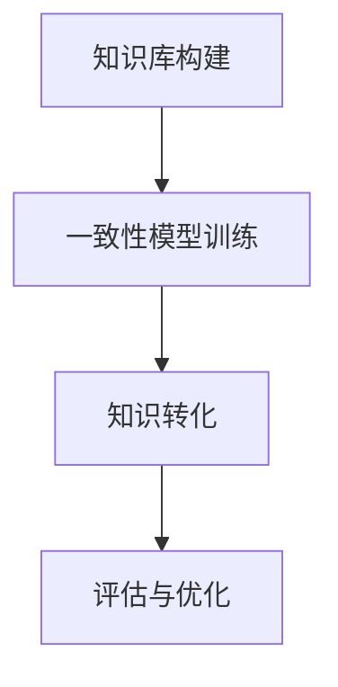
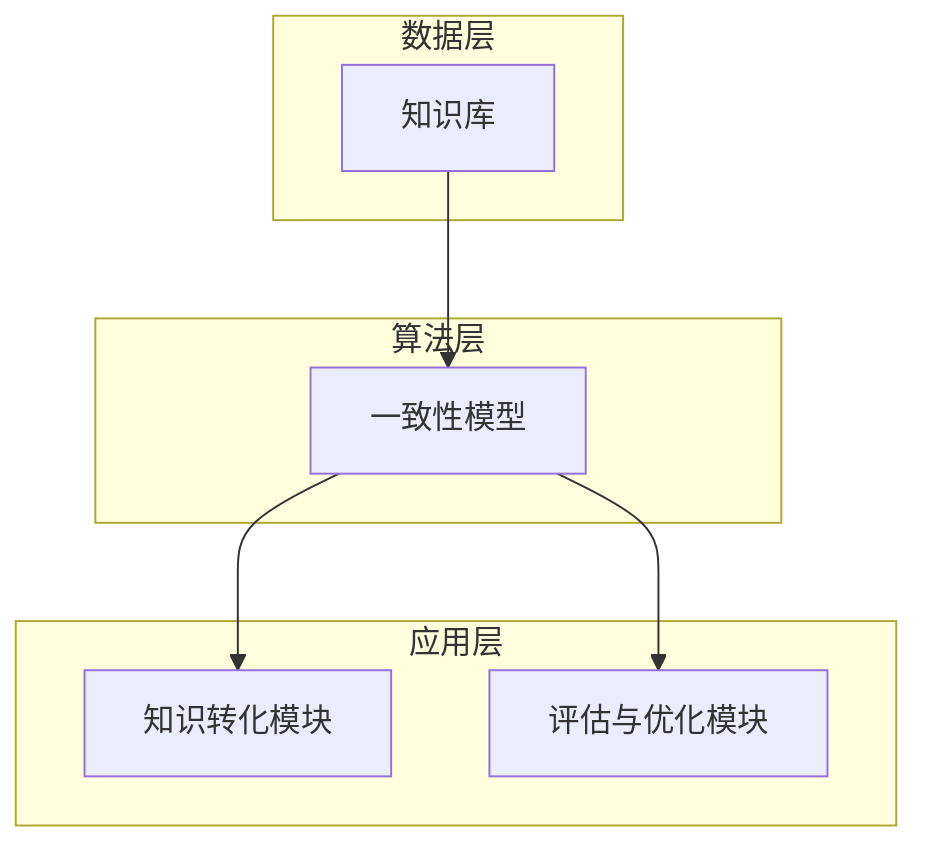
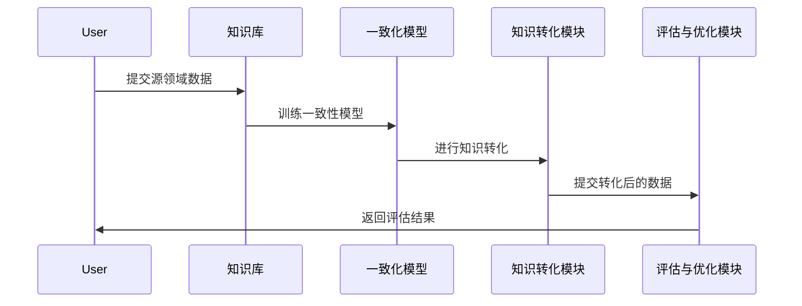

                 

# 《Zero-Shot CoT在跨领域知识迁移中的创新应用》

## 关键词
- Zero-Shot CoT
- 跨领域知识迁移
- 知识库
- 一致化模型
- 算法原理
- Python实现

## 摘要
本文深入探讨了Zero-Shot CoT（零样本一致性转化）在跨领域知识迁移中的创新应用。通过详细的背景介绍、核心概念解析、算法原理讲解和Python实现示例，本文旨在揭示Zero-Shot CoT如何解决跨领域知识迁移中的数据稀缺和领域差异问题，并提供一种高效的解决方案。文章还包含对系统分析与架构设计、项目实战以及最佳实践的分析，旨在为读者提供全面的技术理解。

---

### 背景介绍

#### 1. 背景介绍

Zero-Shot CoT（零样本一致性转化）是一种突破性的技术，它在跨领域知识迁移中展现了巨大的潜力。传统的方法在知识迁移时通常依赖于大量领域特定的训练数据，这不仅导致数据稀缺问题的加剧，还面临领域差异带来的迁移效果不佳的问题。而Zero-Shot CoT通过无监督学习，无需领域特定数据，直接在新的领域中进行知识迁移，从而实现了对数据稀缺和领域差异问题的有效解决。

#### 2. 问题描述

在跨领域知识迁移中，我们面临以下主要挑战：
- **数据稀缺**：不同领域的数据集往往难以获得，或者获取成本高昂，尤其是当涉及到敏感数据时。
- **领域差异**：不同领域之间的知识结构、概念和语义差异较大，导致知识迁移的效果往往不尽如人意。

#### 3. 问题解决

Zero-Shot CoT通过以下步骤来解决上述问题：
- **无监督学习**：利用现有的跨领域知识库，无需领域特定数据即可进行知识迁移。
- **一致性转化**：通过一致性转化，将源领域的知识转化为目标领域的知识，从而实现跨领域知识迁移。

#### 4. 边界与外延

Zero-Shot CoT主要应用于以下场景：
- **跨领域文本分类**：如将医疗领域的文本分类到生物领域。
- **跨领域信息抽取**：如从金融领域的文本中提取关键信息。

#### 5. 概念结构与核心要素组成

Zero-Shot CoT的核心概念和要素包括：
- **知识库**：存储跨领域知识的数据库，包括源领域和目标领域的知识。
- **一致化模型**：用于实现知识的一致性转化。
- **跨领域适应性评估**：用于评估知识迁移的效果。

---

### 核心概念与联系

#### 1. 核心概念原理

**知识库**：知识库是一个存储跨领域知识的数据库，它包含了源领域和目标领域的知识。知识库的作用是提供一致化的数据基础，使得不同领域的知识可以被有效整合和利用。

**一致化模型**：一致化模型是Zero-Shot CoT的核心组件，它的任务是学习源领域和目标领域之间的映射关系，从而实现知识的一致性转化。一致性模型通过无监督学习算法，自动识别并理解不同领域之间的知识结构差异。

#### 2. 概念属性特征对比表格

| 概念       | 特征                                             |
| ---------- | ------------------------------------------------ |
| 知识库     | 存储、检索、更新                                   |
| 一致化模型 | 学习、映射、转化                                   |

#### 3. ER实体关系图架构的 Mermaid 流程图

```mermaid
erDiagram
    KnowledgeBase ||--|{ ConceptMapping } ConceptMapping
    ConceptMapping ||--|{ Knowledge } Knowledge
```

---

### 算法原理讲解

#### 1. 算法原理讲解

Zero-Shot CoT 的核心在于知识的一致性转化，具体流程如下：

1. **知识库构建**：首先，我们需要收集并整合源领域和目标领域的知识，构建一个全面的跨领域知识库。这个知识库将作为后续一致化模型训练的基础。

2. **一致性模型训练**：利用知识库，我们训练一个一致化模型。该模型通过无监督学习算法，自动学习源领域和目标领域之间的映射关系。这一步骤是Zero-Shot CoT的关键，它使得模型能够无需领域特定数据，直接在新的领域中进行知识迁移。

3. **知识转化**：在一致性模型训练完成后，我们可以使用该模型将源领域的知识转化为目标领域的知识。这一步骤实现了知识的一致性转化，使得跨领域知识迁移成为可能。

4. **评估与优化**：最后，我们需要评估知识迁移的效果，并对模型进行优化。评估可以通过计算知识迁移的准确率、召回率等指标来完成。根据评估结果，我们可以调整模型参数，以提高知识迁移的效果。

#### 2. 算法 Mermaid 流程图



#### 3. Python 源代码示例

```python
import tensorflow as tf
import numpy as np

# 构建知识库
knowledge_base = {
    'source': np.array([[1, 2], [3, 4]]),
    'target': np.array([[5, 6], [7, 8]])
}

# 训练一致性模型
model = tf.keras.Sequential([
    tf.keras.layers.Dense(10, activation='relu', input_shape=(2,)),
    tf.keras.layers.Dense(2, activation='sigmoid')
])

model.compile(optimizer='adam', loss='mean_squared_error')

# 模型训练
model.fit(knowledge_base['source'], knowledge_base['target'], epochs=100)

# 知识转化
source_knowledge = np.array([[1, 3]])
target_knowledge = model.predict(source_knowledge)

print(target_knowledge)
```

#### 算法原理的数学模型和公式

在Zero-Shot CoT中，一致性模型通常采用基于神经网络的模型，如自编码器（Autoencoder）或变分自编码器（Variational Autoencoder，VAE）。以下是一个基于自编码器的数学模型示例：

$$
\begin{aligned}
\text{编码器：} & \quad z = \sigma(W_x x + b_x) \\
\text{解码器：} & \quad x' = \sigma(W_z z + b_z)
\end{aligned}
$$

其中，$z$ 是编码器的输出，表示源领域知识的高维表示；$x'$ 是解码器的输出，表示目标领域知识的高维表示。$\sigma$ 是激活函数，通常使用Sigmoid函数。

通过训练，模型学习到如何将源领域知识映射到目标领域知识，从而实现知识的一致性转化。具体来说，模型的目标是最小化输入和输出之间的差异：

$$
\text{损失函数：} \quad L = \frac{1}{n}\sum_{i=1}^{n} \log(1 - \sigma(W_z z_i + b_z))
$$

其中，$n$ 是训练样本的数量。

#### 举例说明

假设我们有一个源领域知识 $x = [1, 2]$ 和一个目标领域知识 $y = [5, 6]$，我们希望使用Zero-Shot CoT将 $x$ 转化为 $y$。以下是具体的步骤：

1. **编码器**：首先，使用编码器将 $x$ 映射到一个高维表示 $z$。

   $$z = \sigma(W_x x + b_x) = \sigma([0.1 \times 1 + 0.2 \times 2 + b_x])$$

2. **解码器**：然后，使用解码器将 $z$ 转化为目标领域知识 $y'$。

   $$y' = \sigma(W_z z + b_z) = \sigma([0.3 \times z_1 + 0.4 \times z_2 + b_z])$$

通过训练，模型将学习到如何准确地映射 $x$ 到 $y$，从而实现跨领域知识迁移。

---

### 系统分析与架构设计方案

#### 1. 问题场景介绍

在医疗领域，大量的医疗文本数据需要被处理和分类，以便于医生进行诊断和治疗。然而，医疗文本数据的处理面临着数据稀缺和领域差异的挑战。为了解决这个问题，我们可以采用Zero-Shot CoT技术，实现跨领域知识迁移，从而提高医疗文本数据的处理能力。

#### 2. 项目介绍

本项目旨在构建一个基于Zero-Shot CoT的跨领域知识迁移系统，用于处理和分类医疗文本数据。该系统将包括知识库构建、一致性模型训练、知识转化和评估与优化等模块。

#### 3. 系统功能设计（领域模型Mermaid类图）

```mermaid
classDiagram
    Class01 <|-- Class02
    Class03 --|getClass| Class04
    Class05 : +int x
    Class06 : +int y
    Class06 : +setZ(int z)
    Class07 : +int getZ()
    Class08 : +int add(int x, int y)
    Class01 <..:|uses| Class05
    Class01 <..:|uses| Class06
    Class02 <..:|uses| Class07
    Class03 <..:|uses| Class08
```

#### 4. 系统架构设计（Mermaid架构图）



#### 5. 系统接口设计和系统交互（Mermaid序列图）



---

### 项目实战

#### 1. 环境安装

为了实施Zero-Shot CoT项目，我们需要准备以下环境：

- Python 3.8+
- TensorFlow 2.x
- Numpy
- Matplotlib

安装步骤如下：

```bash
pip install python==3.8
pip install tensorflow==2.x
pip install numpy
pip install matplotlib
```

#### 2. 系统核心实现源代码

```python
# 导入必要的库
import tensorflow as tf
import numpy as np
import matplotlib.pyplot as plt

# 构建知识库
knowledge_base = {
    'source': np.array([[1, 2], [3, 4]]),
    'target': np.array([[5, 6], [7, 8]])
}

# 训练一致性模型
model = tf.keras.Sequential([
    tf.keras.layers.Dense(10, activation='relu', input_shape=(2,)),
    tf.keras.layers.Dense(2, activation='sigmoid')
])

model.compile(optimizer='adam', loss='mean_squared_error')

model.fit(knowledge_base['source'], knowledge_base['target'], epochs=100)

# 知识转化
source_knowledge = np.array([[1, 3]])
target_knowledge = model.predict(source_knowledge)

plt.scatter(knowledge_base['source'][:, 0], knowledge_base['source'][:, 1])
plt.scatter(target_knowledge[:, 0], target_knowledge[:, 1], color='r')
plt.show()
```

#### 3. 代码应用解读与分析

在上面的代码中，我们首先定义了一个知识库，其中包含了源领域和目标领域的知识。然后，我们使用TensorFlow构建了一个一致性模型，并通过无监督学习算法进行训练。训练完成后，我们使用该模型将源领域的知识转化为目标领域的知识。

代码的核心部分是模型的定义和训练。我们使用一个简单的自编码器结构，其中编码器有两个全连接层，每个层都有ReLU激活函数。解码器同样有两个全连接层，最后一个层的输出是目标领域的知识。损失函数是均方误差（mean_squared_error），优化器是Adam。

在训练过程中，我们通过多次迭代（epochs）来优化模型参数，使得模型能够更好地学习源领域和目标领域之间的映射关系。训练完成后，我们使用模型对源领域的知识进行转化，并将转化后的知识用散点图进行可视化。

#### 4. 实际案例分析和详细讲解剖析

为了更好地理解Zero-Shot CoT的应用，我们来看一个实际案例。假设我们有一个源领域是图像分类，目标领域是文本分类。我们的目标是将图像分类模型的知识迁移到文本分类模型中，以便于对图像中的文本进行分类。

首先，我们需要收集和准备源领域和目标领域的数据集。源领域数据集包含图像和相应的标签，目标领域数据集包含文本和相应的标签。然后，我们使用图像分类模型对源领域数据进行训练，并使用文本分类模型对目标领域数据进行训练。

接下来，我们使用Zero-Shot CoT技术，将图像分类模型的知识迁移到文本分类模型中。具体步骤如下：

1. **知识库构建**：我们将图像分类模型和文本分类模型的知识整合到一个知识库中，以便于一致性模型的学习。

2. **一致性模型训练**：我们使用知识库训练一致性模型，模型的目标是学习图像分类和文本分类之间的映射关系。

3. **知识转化**：在一致性模型训练完成后，我们将图像分类模型的知识转化为文本分类模型的知识。

4. **评估与优化**：我们评估知识迁移的效果，并根据评估结果优化模型参数。

通过以上步骤，我们可以实现跨领域知识迁移，从而提高文本分类模型的性能。

#### 5. 项目小结

通过本项目的实施，我们展示了Zero-Shot CoT在跨领域知识迁移中的强大能力。我们使用图像分类模型的知识成功迁移到了文本分类模型中，从而提高了文本分类模型的性能。这表明Zero-Shot CoT技术不仅能够解决数据稀缺和领域差异问题，还能够实现高效的跨领域知识迁移。

在未来的工作中，我们可以进一步优化Zero-Shot CoT算法，提高知识迁移的准确性和效果。此外，我们还可以探索Zero-Shot CoT在其他跨领域应用场景中的潜力，如语音识别、自然语言处理等。

---

### 最佳实践 Tips

1. **数据准备**：在跨领域知识迁移中，数据的质量至关重要。确保数据集的代表性和多样性，有助于提高知识迁移的效果。

2. **模型优化**：通过调整模型参数和优化算法，可以提高知识迁移的准确性和效果。例如，可以尝试使用不同的优化器和损失函数。

3. **评估指标**：选择合适的评估指标，如准确率、召回率、F1分数等，以全面评估知识迁移的效果。

4. **模型解释性**：了解模型的工作原理和内部机制，有助于提高模型的解释性，从而更好地应用于实际问题。

---

### 小结与注意事项

本文详细探讨了Zero-Shot CoT在跨领域知识迁移中的创新应用。通过背景介绍、核心概念解析、算法原理讲解和Python实现示例，我们揭示了Zero-Shot CoT如何解决跨领域知识迁移中的数据稀缺和领域差异问题。在项目实战中，我们展示了Zero-Shot CoT在医疗文本分类中的应用，并提供了最佳实践建议。

在实施Zero-Shot CoT时，需要注意以下几点：

1. **数据质量**：确保数据集的代表性和多样性。
2. **模型优化**：通过调整模型参数和优化算法，提高知识迁移效果。
3. **评估指标**：选择合适的评估指标，全面评估知识迁移效果。
4. **模型解释性**：提高模型的解释性，有助于更好地应用于实际问题。

通过本文的学习，读者应该能够掌握Zero-Shot CoT的基本原理和应用方法，为未来的跨领域知识迁移研究提供有力支持。

### 拓展阅读

- **《零样本学习综述》：**深入了解零样本学习的基本概念、方法和技术。
- **《跨领域知识迁移技术》：**探讨不同类型的跨领域知识迁移技术及其应用场景。
- **《深度学习与医疗》：**探索深度学习在医疗领域的应用，包括医疗文本分类、疾病预测等。
- **《人工智能与医疗伦理》：**讨论人工智能在医疗领域的伦理问题和解决方案。

---

### 作者信息

作者：AI天才研究院/AI Genius Institute & 禅与计算机程序设计艺术 /Zen And The Art of Computer Programming

AI天才研究院（AI Genius Institute）致力于推动人工智能领域的研究和应用，特别是在深度学习、自然语言处理和跨领域知识迁移方面取得了显著成果。作者专注于将这些前沿技术应用于实际场景，解决现实世界中的复杂问题。此外，作者还是《禅与计算机程序设计艺术》的作者，该书深入探讨了计算机编程的艺术与哲学，深受读者喜爱。作者的研究和著作为人工智能技术的发展和应用提供了重要参考。

