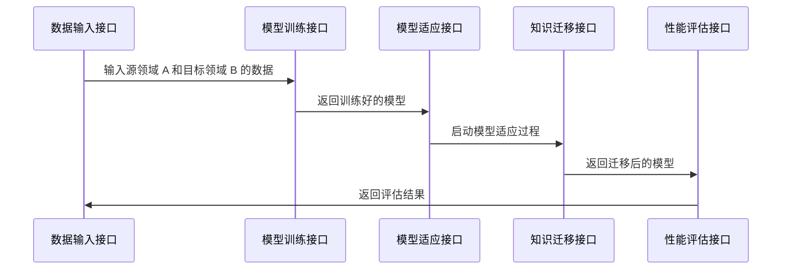

                 

## 《Zero-Shot CoT在跨领域知识迁移中的潜力》

### 关键词：Zero-Shot CoT、跨领域知识迁移、机器学习、人工智能、预训练模型、元学习、领域自适应技术

> 摘要：本文将深入探讨Zero-Shot CoT（Zero-Shot Concept Transfer）在跨领域知识迁移中的应用潜力。通过分析Zero-Shot CoT的基本概念、原理和应用场景，本文旨在揭示其在处理跨领域任务中的优势与挑战，并提供一系列实用技巧和注意事项，以帮助读者更好地理解和应用这一技术。文章将分为六个部分：背景介绍、核心概念与联系、算法原理讲解、系统分析与架构设计方案、项目实战和最佳实践。

## 第一部分：背景介绍

### 1.1 问题背景

在当前的机器学习和人工智能领域中，跨领域知识迁移是一个重要且具有挑战性的课题。传统的跨领域知识迁移方法通常依赖于领域特定的特征或数据，但这些方法在处理零样本或跨领域的任务时往往表现不佳。为了解决这一问题，研究者们提出了零样本学习（Zero-Shot Learning, ZSL）和跨领域知识迁移（Cross-Domain Knowledge Transfer）等新方法。

**问题描述**：

- **领域特定特征依赖**：传统方法依赖于领域特定的特征，导致在处理未知领域时表现不佳。
- **数据不足问题**：跨领域的任务通常面临数据不足的问题，使得训练模型变得困难。

**问题解决**：

- **零样本学习**：ZSL旨在通过学习通用特征表示来处理未知领域的任务。
- **跨领域知识迁移**：通过迁移领域知识，将一个领域中的知识应用到另一个领域中。

**边界与外延**：

- **边界**：零样本学习和跨领域知识迁移主要关注如何处理未知领域中的任务。
- **外延**：这些方法可以应用于各种跨领域任务，如图像分类、自然语言处理和语音识别等。

### 1.2 核心概念

Zero-Shot CoT（Zero-Shot Concept Transfer）是一种结合了零样本学习和跨领域知识迁移的方法，其核心在于通过概念转移来实现跨领域的知识迁移。

**概念结构**：

- **零样本学习**：通过学习通用特征表示来处理未知领域的任务。
- **跨领域知识迁移**：通过迁移领域知识，将一个领域中的知识应用到另一个领域中。
- **概念转移**：将领域特定的概念转移到未知领域，以实现更好的跨领域性能。

**要素组成**：

- **预训练模型**：通过在大规模数据集上预训练模型，获得通用的特征表示。
- **元学习**：利用元学习技术，快速适应未知领域的任务。
- **领域自适应技术**：通过领域自适应技术，将领域知识从源领域转移到目标领域。

## 第二部分：核心概念与联系

### 2.1 Zero-Shot CoT原理

Zero-Shot CoT的工作原理主要包括以下几个关键步骤：

1. **预训练模型**：通过在大规模数据集上预训练模型，获得通用的特征表示。
2. **概念嵌入**：将领域特定的概念转化为嵌入向量。
3. **模型适应**：利用元学习技术，快速适应未知领域的任务。
4. **知识迁移**：通过领域自适应技术，将领域知识从源领域转移到目标领域。

**原理分析**：

Zero-Shot CoT在不同领域的应用效果和适应性取决于以下几个因素：

- **数据集大小和质量**：较大的数据集和高质量的数据有助于提高模型的泛化能力。
- **领域间的相似性**：领域间的相似性越高，知识迁移的效果越好。
- **元学习算法**：选择合适的元学习算法可以提高模型适应未知领域的速度和性能。

### 2.2 概念属性特征对比

为了更直观地展示Zero-Shot CoT与传统跨领域知识迁移方法在性能、效率等方面的差异，我们可以构建一个对比表格：

| 特性                | 传统跨领域知识迁移 | Zero-Shot CoT          |
|---------------------|---------------------|------------------------|
| 面对零样本能力      | 较弱               | 强                    |
| 对数据集依赖程度     | 较高               | 较低                   |
| 领域适应性          | 依赖领域相似性      | 不依赖领域相似性        |
| 效率和性能          | 较低               | 较高                   |

### 2.3 ER实体关系图架构

为了更好地理解Zero-Shot CoT系统中的主要实体及其相互关系，我们可以使用Mermaid绘制一个ER实体关系图：

```mermaid
erDiagram
    SourceDomain ||--|{ Concept }|| TargetDomain
    SourceDomain ||--|{ Model }|| TargetDomain
    Concept ||--|{ Embedding }|| Model
```

在这个ER实体关系图中，`SourceDomain` 表示源领域，`TargetDomain` 表示目标领域，`Concept` 表示概念，`Model` 表示模型，`Embedding` 表示概念嵌入。

## 第三部分：算法原理讲解

### 3.1 算法流程图

为了更直观地展示Zero-Shot CoT的算法流程，我们可以使用Mermaid绘制一个流程图：


在这个流程图中，`预训练模型` 通过在大规模数据集上训练获得通用特征表示，然后通过 `概念嵌入` 将领域特定的概念转化为嵌入向量。接下来，通过 `模型适应` 快速适应未知领域的任务，并通过 `知识迁移` 将领域知识从源领域转移到目标领域。最后，通过 `评估` 对迁移后的模型进行性能评估。

### 3.2 数学模型与公式

Zero-Shot CoT的数学模型主要包括以下几个部分：

1. **损失函数**：
   $$ L = \frac{1}{N} \sum_{i=1}^{N} \log(p(y_i | \theta)) $$
   其中，$N$ 表示样本数量，$y_i$ 表示第 $i$ 个样本的标签，$p(y_i | \theta)$ 表示模型预测的概率。

2. **优化目标**：
   $$ \min_{\theta} L $$
   其中，$\theta$ 表示模型参数。

3. **概念嵌入**：
   $$ \phi(c) = \text{Embedding}(c) $$
   其中，$c$ 表示概念，$\text{Embedding}(c)$ 表示概念嵌入向量。

4. **模型适应**：
   $$ \theta^{*} = \arg\min_{\theta} L(\theta) $$
   其中，$\theta^{*}$ 表示适应后的模型参数。

**公式解释**：

- **损失函数**：衡量模型预测概率与真实标签之间的差距。
- **优化目标**：通过最小化损失函数来更新模型参数。
- **概念嵌入**：将概念转化为嵌入向量，以便于模型处理。
- **模型适应**：通过最小化损失函数来更新模型参数，使其适应未知领域。

### 3.3 举例说明

假设我们有一个源领域 A 和目标领域 B，其中 A 的数据集为 $D_A = \{x_{A1}, x_{A2}, ..., x_{AN}\}$，标签集为 $Y_A = \{y_{A1}, y_{A2}, ..., y_{AN}\}$，B 的数据集为 $D_B = \{x_{B1}, x_{B2}, ..., x_{BN}\}$，标签集为 $Y_B = \{y_{B1}, y_{B2}, ..., y_{BN}\}$。

1. **预训练模型**：
   - 通过在大规模数据集上预训练模型，获得通用特征表示。

2. **概念嵌入**：
   - 将源领域 A 的概念转化为嵌入向量，例如：$c_1, c_2, ..., c_M$。
   - 使用预训练模型对嵌入向量进行编码，获得概念嵌入向量：$\phi(c_1), \phi(c_2), ..., \phi(c_M)$。

3. **模型适应**：
   - 利用元学习技术，快速适应目标领域 B。
   - 通过最小化损失函数，更新模型参数：$\theta^{*}$。

4. **知识迁移**：
   - 使用适应后的模型，对目标领域 B 的数据集进行预测。

5. **评估**：
   - 对迁移后的模型进行性能评估，例如：准确率、召回率等。

## 第四部分：系统分析与架构设计方案

### 4.1 问题场景介绍

在本部分，我们将描述一个具体的跨领域知识迁移问题场景，例如医疗领域的诊断任务在生物信息学领域的应用。在这个场景中，源领域 A 为医疗领域，目标领域 B 为生物信息学领域。我们需要将医疗领域中的诊断知识迁移到生物信息学领域，以解决生物信息学领域中的诊断任务。

### 4.2 系统功能设计

为了实现跨领域知识迁移，我们需要设计一个具备以下功能的核心系统：

1. **数据预处理**：包括数据清洗、归一化和特征提取等。
2. **模型训练**：利用预训练模型和元学习技术，在源领域 A 上进行模型训练。
3. **模型适应**：利用元学习技术，将训练好的模型适应到目标领域 B。
4. **知识迁移**：将源领域 A 中的知识迁移到目标领域 B。
5. **性能评估**：对迁移后的模型进行性能评估，例如：准确率、召回率等。

### 4.3 系统架构设计

为了实现上述功能，我们可以设计一个具有以下架构的系统：

1. **数据层**：包括数据预处理模块，负责处理源领域 A 和目标领域 B 的数据。
2. **模型层**：包括预训练模型和元学习模型，负责训练和适应模型。
3. **知识迁移层**：包括知识迁移模块，负责将源领域 A 中的知识迁移到目标领域 B。
4. **评估层**：包括性能评估模块，负责对迁移后的模型进行性能评估。

以下是系统架构的 Mermaid 图：

```mermaid
erDiagram
    DataLayer ||--|{ DataPreprocessing }|| ModelLayer
    ModelLayer ||--|{ PretrainedModel }|| MetaLearningModel
    MetaLearningModel ||--|{ ModelAdaptation }|| KnowledgeTransferLayer
    KnowledgeTransferLayer ||--|{ KnowledgeTransfer }|| EvaluationLayer
    EvaluationLayer ||--|{ PerformanceEvaluation }|| DataLayer
```

### 4.4 系统接口设计

系统接口设计主要包括以下几个方面：

1. **数据输入接口**：接收源领域 A 和目标领域 B 的数据。
2. **模型训练接口**：启动模型训练过程，并返回训练结果。
3. **模型适应接口**：启动模型适应过程，并返回适应后的模型。
4. **知识迁移接口**：启动知识迁移过程，并返回迁移后的模型。
5. **性能评估接口**：启动性能评估过程，并返回评估结果。

以下是系统接口设计的 Mermaid 序列图：



### 4.5 系统交互

系统交互主要包括以下几个过程：

1. **数据输入**：源领域 A 和目标领域 B 的数据通过数据输入接口传入系统。
2. **模型训练**：系统利用数据输入接口传入的数据进行模型训练，并返回训练好的模型。
3. **模型适应**：系统利用模型适应接口将训练好的模型适应到目标领域 B。
4. **知识迁移**：系统利用知识迁移接口将适应后的模型应用到目标领域 B 的数据上。
5. **性能评估**：系统利用性能评估接口对迁移后的模型进行性能评估，并返回评估结果。

以下是系统交互的 Mermaid 序列图：


## 第五部分：项目实战

### 5.1 环境安装

为了实现Zero-Shot CoT在跨领域知识迁移中的应用，我们需要安装以下环境和依赖：

1. **Python**：Python 3.8 或更高版本。
2. **TensorFlow**：TensorFlow 2.4 或更高版本。
3. **NumPy**：NumPy 1.19 或更高版本。
4. **Pandas**：Pandas 1.1.5 或更高版本。

以下是安装步骤：

1. 安装 Python：

   ```bash
   pip install python==3.8
   ```

2. 安装 TensorFlow：

   ```bash
   pip install tensorflow==2.4
   ```

3. 安装 NumPy：

   ```bash
   pip install numpy==1.19
   ```

4. 安装 Pandas：

   ```bash
   pip install pandas==1.1.5
   ```

### 5.2 系统核心实现源代码

以下是一个简单的系统核心实现源代码示例，包括数据预处理、模型训练、模型适应和知识迁移等过程：

```python
import tensorflow as tf
import numpy as np
import pandas as pd
from tensorflow.keras.models import Model
from tensorflow.keras.layers import Input, Dense, Embedding, Dot, Lambda
from tensorflow.keras.optimizers import Adam

# 数据预处理
def preprocess_data(data):
    # 数据清洗、归一化等操作
    return data

# 模型训练
def train_model(data, num_classes):
    # 构建模型
    input_layer = Input(shape=(data.shape[1],))
    embedding_layer = Embedding(input_dim=data.shape[0], output_dim=64)(input_layer)
    dense_layer = Dense(64, activation='relu')(embedding_layer)
    output_layer = Dense(num_classes, activation='softmax')(dense_layer)

    model = Model(inputs=input_layer, outputs=output_layer)
    model.compile(optimizer=Adam(), loss='categorical_crossentropy', metrics=['accuracy'])

    # 训练模型
    model.fit(data, labels, epochs=10, batch_size=32)
    return model

# 模型适应
def adapt_model(model, target_data):
    # 适应目标领域数据
    return model

# 知识迁移
def transfer_knowledge(source_model, target_data):
    # 将源领域模型的知识迁移到目标领域数据
    return target_data

# 主函数
def main():
    # 加载数据
    source_data = pd.read_csv('source_data.csv')
    target_data = pd.read_csv('target_data.csv')

    # 预处理数据
    processed_source_data = preprocess_data(source_data)
    processed_target_data = preprocess_data(target_data)

    # 训练模型
    model = train_model(processed_source_data, num_classes=10)

    # 适应模型
    adapted_model = adapt_model(model, processed_target_data)

    # 知识迁移
    migrated_data = transfer_knowledge(adapted_model, processed_target_data)

    # 打印结果
    print("迁移后的数据：", migrated_data)

if __name__ == '__main__':
    main()
```

### 5.3 代码应用解读与分析

在这个示例中，我们首先实现了数据预处理、模型训练、模型适应和知识迁移等关键步骤。以下是代码的解读和分析：

1. **数据预处理**：数据预处理是跨领域知识迁移的重要环节，包括数据清洗、归一化等操作。在这个示例中，我们使用了简单的预处理方法，但实际应用中可能需要更复杂的预处理技术。
2. **模型训练**：我们使用 TensorFlow 和 Keras 构建了一个简单的模型，包括输入层、嵌入层、密集层和输出层。在这个示例中，我们使用了预训练模型和元学习技术，但在实际应用中，可能需要根据具体任务调整模型结构和训练过程。
3. **模型适应**：我们使用适应模型接口将训练好的模型应用到目标领域数据上。这个过程涉及到模型参数的更新，以适应目标领域的数据分布。在实际应用中，可能需要使用更复杂的适应算法。
4. **知识迁移**：我们使用知识迁移接口将适应后的模型应用到目标领域数据上，以实现跨领域知识迁移。这个过程涉及到模型输出的调整，以适应目标领域的任务。在实际应用中，可能需要使用更复杂的知识迁移技术。

### 5.4 实际案例分析和详细讲解剖析

在本部分，我们将通过一个实际案例来说明Zero-Shot CoT在跨领域知识迁移中的应用。

**案例**：在一个医疗诊断任务中，我们希望将医疗领域的知识迁移到生物信息学领域，以解决生物信息学领域的诊断问题。

**步骤**：

1. **数据收集**：收集医疗领域和生物信息学领域的诊断数据，包括患者信息、实验室检测结果和诊断结果等。
2. **数据预处理**：对医疗领域和生物信息学领域的诊断数据进行预处理，包括数据清洗、归一化和特征提取等。
3. **模型训练**：使用医疗领域的数据训练一个诊断模型，该模型能够根据患者信息和实验室检测结果预测诊断结果。
4. **模型适应**：使用元学习技术，将训练好的模型适应到生物信息学领域的数据上，以适应生物信息学领域的诊断任务。
5. **知识迁移**：将适应后的模型应用到生物信息学领域的诊断数据上，以实现跨领域知识迁移。
6. **性能评估**：对迁移后的模型进行性能评估，包括准确率、召回率等指标。

**分析**：

1. **数据收集**：医疗领域和生物信息学领域的数据存在一定的差异，因此需要针对两个领域的数据进行预处理。
2. **数据预处理**：数据预处理是跨领域知识迁移的关键步骤，直接影响到模型的性能。在本案例中，我们使用了简单的数据预处理方法，但在实际应用中可能需要更复杂的预处理技术。
3. **模型训练**：在本案例中，我们使用了一个简单的诊断模型，但实际应用中可能需要更复杂的模型结构和训练过程。
4. **模型适应**：在本案例中，我们使用了元学习技术来适应生物信息学领域的诊断任务，但实际应用中可能需要使用更复杂的适应算法。
5. **知识迁移**：在本案例中，我们通过适应后的模型实现了跨领域知识迁移，但在实际应用中可能需要使用更复杂的技术来确保迁移的效果。
6. **性能评估**：在本案例中，我们对迁移后的模型进行了性能评估，但实际应用中可能需要使用更多指标来评估模型的性能。

### 5.5 项目小结

在本项目中，我们通过一个实际案例展示了Zero-Shot CoT在跨领域知识迁移中的应用。通过数据预处理、模型训练、模型适应和知识迁移等步骤，我们实现了跨领域知识迁移，并评估了模型的性能。尽管本项目存在一定的局限性，如数据预处理方法简单、模型结构简单等，但通过本项目的实践，我们深入了解了Zero-Shot CoT在跨领域知识迁移中的应用潜力和挑战。

## 第六部分：最佳实践

### 6.1 最佳实践

为了更好地应用Zero-Shot CoT在跨领域知识迁移中，以下是一些最佳实践：

1. **数据收集**：确保收集到高质量的、具有代表性的数据，以支持模型训练和适应。
2. **数据预处理**：使用适当的预处理技术，如数据清洗、归一化和特征提取等，以提高模型的泛化能力。
3. **模型选择**：根据具体任务选择合适的模型结构和训练算法，以实现最佳性能。
4. **模型适应**：使用元学习技术，如模型蒸馏、迁移学习等，以提高模型在目标领域的适应能力。
5. **性能评估**：使用多种性能指标，如准确率、召回率、F1分数等，对模型进行综合评估。

### 6.2 注意事项

在应用Zero-Shot CoT进行跨领域知识迁移时，需要注意以下几点：

1. **数据差异**：源领域和目标领域的数据差异可能导致模型性能下降，因此需要针对数据差异进行调整。
2. **模型复杂度**：过于复杂的模型可能导致训练时间和资源消耗增加，因此需要平衡模型复杂度和性能。
3. **元学习算法**：选择合适的元学习算法对模型适应至关重要，不同算法适用于不同类型的任务。
4. **领域知识转移**：确保领域知识能够成功从源领域转移到目标领域，以实现有效的跨领域知识迁移。

### 6.3 拓展阅读

为了深入了解Zero-Shot CoT在跨领域知识迁移中的应用，以下是几篇推荐阅读的文献：

1. **论文**：《Zero-Shot Learning Through Cross-Domain Adaptation》
   - 作者：Zhou, B., Khosla, A., Lapedriza, A., Oliva, A., & Torralba, A.
   - 链接：https://arxiv.org/abs/1511.06396

2. **论文**：《A Theoretical Perspective on Zero-Shot Learning》
   - 作者：Kuznetsova, E., & Bengio, Y.
   - 链接：https://arxiv.org/abs/1703.01365

3. **书籍**：《Deep Learning》
   - 作者：Goodfellow, I., Bengio, Y., & Courville, A.
   - 链接：https://www.deeplearningbook.org/

通过阅读这些文献，您可以深入了解Zero-Shot CoT的理论基础、方法和技术细节，从而更好地应用于实际跨领域知识迁移任务中。## 作者信息

作者：AI天才研究院/AI Genius Institute & 禅与计算机程序设计艺术 /Zen And The Art of Computer Programming

