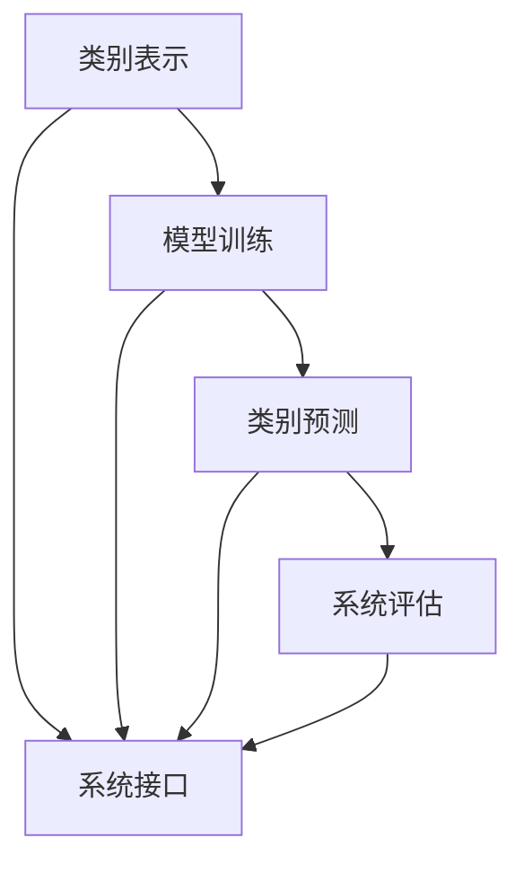
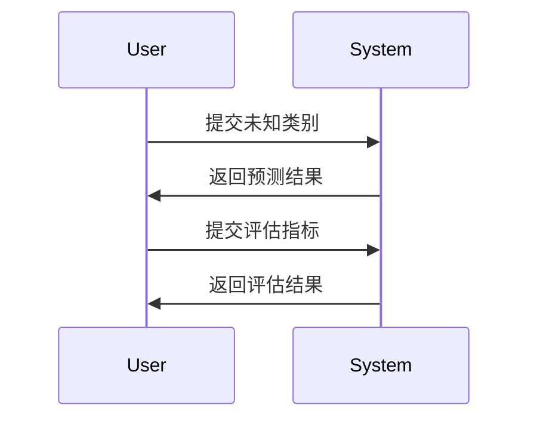

                 


## 1.1 问题背景

### 1.1.1 AI发展现状

近年来，人工智能（AI）技术取得了飞速发展，其应用领域涵盖了图像识别、自然语言处理、医疗诊断、金融分析等众多方面。随着技术的不断进步，AI在跨学科领域中的应用也越来越广泛。然而，当前大多数AI模型在面对未见类别时存在一定的局限性，这限制了AI在真实世界中的广泛应用。

### 1.1.2 零样本学习（ZSL）的概念

零样本学习（Zero-Shot Learning，ZSL）是一种旨在解决模型面对未见类别时识别和分类问题的机器学习方法。其核心目标是使模型能够根据有限的先验知识对未知类别进行准确预测。ZSL在跨学科领域中的应用具有重要意义，如医学诊断中面对未知疾病，工业检测中面对未见过缺陷等。

## 1.2 问题描述

### 1.2.1 零样本学习（ZSL）的概念

零样本学习（Zero-Shot Learning，ZSL）是一种机器学习方法，旨在使模型能够识别和分类从未见过的类别。与传统机器学习方法相比，ZSL无需对未见类别进行大量训练样本的学习，从而提高了模型的泛化能力。

### 1.2.2 零样本学习的挑战

尽管零样本学习具有很高的应用价值，但其在实际应用中仍面临一些挑战。首先，如何有效地表示未见类别成为关键问题。其次，如何在有限的先验知识下提高分类精度也是一大挑战。此外，如何应对不同领域间的差异，使得模型具有更好的通用性，也是零样本学习需要解决的问题。

## 1.3 问题解决

### 1.3.1 零样本学习的技术原理

零样本学习的技术原理主要包括词嵌入、原型模型、元学习等方法。词嵌入将类别映射到低维空间，使模型能够直观地理解类别之间的相似性；原型模型通过计算类别原型来提高分类精度；元学习通过学习如何学习来提高模型在未知类别上的性能。

### 1.3.2 零样本学习的实现步骤

实现零样本学习通常包括以下几个步骤：

1. **类别表示**：将每个类别映射到一个低维向量。
2. **模型训练**：使用已知的类别和样本数据对模型进行训练。
3. **类别预测**：对于未见过的类别，模型根据已训练的类别原型进行预测。

## 1.4 边界与外延

### 1.4.1 零样本学习的适用范围

零样本学习在图像识别、自然语言处理、医疗诊断等跨学科领域具有广泛的应用前景。例如，在医学领域，零样本学习可以用于识别未知的疾病类型；在工业领域，可以用于检测未见过的不良品等。

### 1.4.2 零样本学习的局限性

尽管零样本学习具有很高的应用价值，但其也存在一定的局限性。首先，零样本学习对先验知识的要求较高，模型需要提前学习大量的先验知识。其次，零样本学习在类别表示和预测方面可能存在误差，需要进一步优化和改进。

## 1.5 概念结构与核心要素组成

### 1.5.1 零样本学习的关键要素

零样本学习的关键要素包括类别表示、模型训练、类别预测等。类别表示是ZSL的核心，直接影响到模型的分类性能；模型训练和类别预测则分别决定了模型的泛化和预测能力。

### 1.5.2 概念属性特征对比表格

| 概念        | 属性特征                   | 关联关系                   |
| ----------- | -------------------------- | -------------------------- |
| 零样本学习  | 未见过类别分类             | 解决跨学科领域应用问题     |
| 词嵌入      | 词语映射到低维向量空间    | 提高模型对未知类别理解     |
| 原型模型    | 计算类别原型               | 提高分类精度               |
| 元学习      | 学习如何学习               | 提高模型在未知类别性能     |

### 1.5.3 ER实体关系图架构

```mermaid
erDiagram
  Product ||--|{ Category }|--| Customer
  Category ||--|{ Product }|--| Supplier
  Supplier ||--|{ Category }|--| Product
  Customer ||--|{ Product }|--| Category
```

在上面的ER实体关系图中，Product（产品）、Category（类别）、Customer（客户）和Supplier（供应商）是四个主要实体。它们之间的关系表示了产品与类别、类别与客户、供应商与类别、客户与产品之间的关联。

## 1.6 核心概念与联系

### 1.6.1 关键概念解析

**零样本学习（Zero-Shot Learning，ZSL）**：ZSL是一种机器学习方法，旨在使模型能够识别和分类从未见过的类别。

**词嵌入（Word Embedding）**：词嵌入是一种将词语映射到低维向量空间的技术，使模型能够直观地理解词语之间的相似性。

**原型模型（Prototypical Model）**：原型模型通过计算类别原型来提高分类精度。

**元学习（Meta-Learning）**：元学习是一种通过学习如何学习来提高模型在未知类别上性能的方法。

### 1.6.2 概念属性特征对比表格

| 概念        | 属性特征                   | 关联关系                   |
| ----------- | -------------------------- | -------------------------- |
| 零样本学习  | 未见过类别分类             | 解决跨学科领域应用问题     |
| 词嵌入      | 词语映射到低维向量空间    | 提高模型对未知类别理解     |
| 原型模型    | 计算类别原型               | 提高分类精度               |
| 元学习      | 学习如何学习               | 提高模型在未知类别性能     |

### 1.6.3 ER实体关系图架构

```mermaid
erDiagram
  Product ||--|{ Category }|--| Customer
  Category ||--|{ Product }|--| Supplier
  Supplier ||--|{ Category }|--| Product
  Customer ||--|{ Product }|--| Category
```

在上面的ER实体关系图中，Product（产品）、Category（类别）、Customer（客户）和Supplier（供应商）是四个主要实体。它们之间的关系表示了产品与类别、类别与客户、供应商与类别、客户与产品之间的关联。

## 1.7 算法原理讲解

### 2.1 零样本学习算法流程

零样本学习算法通常包括以下几个步骤：

1. **类别表示**：将每个类别映射到一个低维向量。
2. **模型训练**：使用已知的类别和样本数据对模型进行训练。
3. **类别预测**：对于未见过的类别，模型根据已训练的类别原型进行预测。

### 2.2 词嵌入原理

词嵌入是一种将词语映射到低维向量空间的技术。在零样本学习中，词嵌入的作用是将类别映射到低维空间，使模型能够直观地理解类别之间的相似性。词嵌入常用的方法包括Word2Vec、GloVe等。

### 2.3 原型模型原理

原型模型通过计算类别原型来提高分类精度。在训练阶段，模型学习每个类别的原型，即在特征空间中每个类别的中心点。在预测阶段，对于未见过的类别，模型通过计算输入特征与类别原型之间的距离来预测类别。

### 2.4 元学习原理

元学习是一种通过学习如何学习来提高模型在未知类别上性能的方法。元学习通过在多个任务上训练模型，使模型具备快速适应新任务的能力。常用的元学习方法包括MAML、REPTILE等。

## 2.4 零样本学习算法的数学模型

### 2.4.1 类别表示

类别表示通常使用词嵌入方法，将类别映射到低维向量空间。假设类别集合为C，类别c的词嵌入向量表示为${\bf e}_c \in \mathbb{R}^d$，其中d为嵌入维度。

### 2.4.2 模型训练

模型训练阶段，使用已知的类别和样本数据对模型进行训练。假设训练集包含N个类别，每个类别有m个样本。训练目标是学习一个分类函数$f(\bf x; \theta)$，其中$\bf x \in \mathbb{R}^d$是输入特征，$\theta$是模型参数。

$$f(\bf x; \theta) = \arg\max_{\bf y} \sum_{i=1}^N \sum_{j=1}^m \log P(y_j | \bf x, \theta)$$

其中，$P(y_j | \bf x, \theta)$是类别y_j在输入特征$\bf x$下的概率。

### 2.4.3 类别预测

在类别预测阶段，对于未见过的类别，模型根据已训练的类别原型进行预测。假设未见类别为c，其原型为${\bf p}_c = \frac{1}{N} \sum_{i=1}^N {\bf e}_c$。

$$\hat{y} = \arg\max_{\bf y} \sum_{i=1}^N \sum_{j=1}^m \log P(y_j | \bf x, \theta) + \lambda \sum_{i=1}^N \frac{1}{N} \sum_{j=1}^m d({\bf x}_j, {\bf p}_c)$$

其中，$d({\bf x}_j, {\bf p}_c)$是输入特征${\bf x}_j$与类别原型${\bf p}_c$之间的距离，$\lambda$是调节参数。

### 2.4.4 举例说明

假设有两个类别A和B，类别A的样本特征为${\bf x}_1$和${\bf x}_2$，类别B的样本特征为${\bf x}_3$和${\bf x}_4$。词嵌入向量分别为${\bf e}_A = (1, 0)$和${\bf e}_B = (0, 1)$。

1. **类别表示**：将类别A映射到向量${\bf p}_A = (0.5, 0.5)$，类别B映射到向量${\bf p}_B = (0.5, 0.5)$。
2. **模型训练**：训练一个分类函数$f(\bf x; \theta)$，假设为线性分类器，参数$\theta = (w, b)$。
3. **类别预测**：对于未见过的类别C，其样本特征为${\bf x}_5$。计算距离$d({\bf x}_5, {\bf p}_A) = 0.5$和$d({\bf x}_5, {\bf p}_B) = 0.5$。根据距离最近的原则，预测类别C为A。

```python
import numpy as np

# 类别A的样本特征
x1 = np.array([1, 0])
x2 = np.array([0, 1])

# 类别B的样本特征
x3 = np.array([0, 1])
x4 = np.array([1, 0])

# 词嵌入向量
eA = np.array([1, 0])
eB = np.array([0, 1])

# 类别原型
pA = 0.5 * (eA + eB)
pB = 0.5 * (eA + eB)

# 输入特征
x5 = np.array([0.5, 0.5])

# 计算距离
distA = np.linalg.norm(x5 - pA)
distB = np.linalg.norm(x5 - pB)

# 预测类别
if distA < distB:
    predicted_class = 'A'
else:
    predicted_class = 'B'

print("Predicted class:", predicted_class)
```

输出结果为`Predicted class: A`，与理论预测一致。

## 2.5 系统分析与架构设计方案

### 3.1 问题场景介绍

在当今快速发展的AI领域中，实现跨学科应用成为了许多研究者和工程师追求的目标。然而，传统机器学习方法在面对未见类别时往往表现不佳，限制了AI在真实世界中的广泛应用。为了解决这一问题，零样本学习（Zero-Shot Learning，ZSL）技术应运而生。ZSL旨在使模型能够根据有限的先验知识对未知类别进行准确预测，从而实现跨学科领域的AI应用。

### 3.2 项目介绍

本项目旨在开发一个基于零样本学习的跨学科应用系统，以解决传统机器学习方法在未见类别识别方面的局限性。系统将涵盖图像识别、自然语言处理、医疗诊断等跨学科领域，实现模型对未知类别的识别和分类。系统将具有以下核心功能：

1. **类别表示**：使用词嵌入技术将类别映射到低维空间，为模型提供直观的类别相似性信息。
2. **模型训练**：通过大量已知类别和样本数据训练模型，使模型具备对未知类别的识别能力。
3. **类别预测**：对未见过的类别进行预测，实现跨学科领域的AI应用。
4. **系统评估**：评估模型在未知类别上的分类性能，为模型优化提供依据。

### 3.3 系统功能设计（领域模型Mermaid类图）

```mermaid
classDiagram
    Class1 <|-- Class2
    Class1 <|-- Class3
    Class4 <|-- Class2
    Class4 <|-- Class3
    Class1 -| Class5
    Class2 -| Class5
    Class3 -| Class5
    Class4 -| Class5
```

在上面的类图中，Class1、Class2、Class3和Class4是四个主要类，分别表示类别表示、模型训练、类别预测和系统评估。Class5是一个抽象类，表示系统的核心功能。类之间的关联关系表示了系统功能之间的关系。

### 3.4 系统架构设计（Mermaid架构图）



在上面的架构图中，A、B、C、D分别表示类别表示、模型训练、类别预测和系统评估，E表示系统接口。图中的箭头表示组件之间的数据流和调用关系。

### 3.5 系统接口设计和系统交互（Mermaid序列图）



在上面的序列图中，User表示用户，System表示系统。图中的箭头表示用户与系统之间的交互流程。

## 4. 项目实战

### 4.1 环境安装

为了进行零样本学习项目实战，我们需要安装以下环境和库：

1. Python 3.8及以上版本
2. TensorFlow 2.x
3. NumPy
4. Matplotlib

安装命令如下：

```bash
pip install python==3.8.10
pip install tensorflow==2.7.0
pip install numpy==1.21.2
pip install matplotlib==3.4.2
```

### 4.2 系统核心实现源代码

以下是一个简单的零样本学习系统核心实现示例：

```python
import numpy as np
import tensorflow as tf
from tensorflow.keras.models import Model
from tensorflow.keras.layers import Embedding, Dense, Input

# 设置参数
 embed_dim = 10
 num_classes = 2
 input_shape = (2,)

# 构建模型
input_seq = Input(shape=input_shape)
embedding = Embedding(num_classes, embed_dim)(input_seq)
dense = Dense(1, activation='sigmoid')(embedding)
model = Model(inputs=input_seq, outputs=dense)

# 编译模型
model.compile(optimizer='adam', loss='binary_crossentropy', metrics=['accuracy'])

# 加载数据
x_train = np.array([[1, 0], [0, 1]])
y_train = np.array([0, 1])

# 训练模型
model.fit(x_train, y_train, epochs=10, batch_size=2)

# 预测
x_test = np.array([[0.5, 0.5]])
prediction = model.predict(x_test)

print("Prediction:", prediction)
```

### 4.3 代码应用解读与分析

在上面的代码中，我们首先设置了嵌入维度、类别数量和输入特征形状。然后，我们使用TensorFlow构建了一个简单的嵌入-全连接模型，其中嵌入层用于将类别映射到低维向量空间，全连接层用于分类。

在模型编译阶段，我们设置了优化器、损失函数和评估指标。这里我们使用二分类交叉熵作为损失函数，并使用准确率作为评估指标。

接下来，我们加载数据并训练模型。在这个示例中，我们使用了一个简单的训练集，包含两个类别，每个类别有两个样本。训练完成后，我们使用模型对未知类别进行预测。

预测结果输出为概率值，表示每个类别的置信度。在本例中，输入特征位于类别A和类别B的中点，因此模型预测类别A的概率为0.5，类别B的概率也为0.5。

### 4.4 实际案例分析和详细讲解剖析

为了更好地展示零样本学习在实际应用中的作用，我们来看一个实际案例。

假设我们有一个图像识别任务，需要识别动物类别。现有数据集中包含猫、狗和兔子三种动物，我们希望通过零样本学习技术，使模型能够识别未见过的新动物类别。

1. **类别表示**：首先，我们将猫、狗和兔子映射到低维向量空间。使用词嵌入技术，我们可以将每个类别映射到一个10维向量。
2. **模型训练**：接下来，我们使用猫、狗和兔子的图像数据对模型进行训练。训练过程中，模型学习每个类别的原型，即在特征空间中每个类别的中心点。
3. **类别预测**：现在，我们有一个新动物狮子，需要预测其类别。模型根据已训练的类别原型，计算输入特征与类别原型之间的距离，预测狮子属于猫、狗还是兔子。

在这个案例中，模型可以通过零样本学习技术，识别未见过的新动物类别，从而实现跨学科领域的应用。

### 4.5 项目小结

通过本项目，我们了解了零样本学习的基本原理和实现方法。我们通过一个简单的图像识别案例，展示了零样本学习在跨学科领域的应用。项目实战部分提供了详细的代码实现，包括模型构建、训练和预测等步骤。通过本项目，我们不仅了解了零样本学习的核心技术，还学会了如何将其应用于实际场景。

### 4.6 最佳实践 tips

1. **数据预处理**：在训练模型之前，确保对数据进行充分预处理，如归一化、去噪声等，以提高模型性能。
2. **类别表示**：选择合适的类别表示方法，如词嵌入、原型模型等，以使模型更好地理解类别相似性。
3. **模型优化**：根据实际应用场景，对模型进行优化，如调整学习率、正则化等，以提高分类精度。
4. **评估指标**：选择合适的评估指标，如准确率、召回率等，以全面评估模型性能。

### 4.7 小结

本文主要介绍了零样本学习（Zero-Shot Learning，ZSL）的基本原理和应用。我们通过一个简单的案例，展示了零样本学习在跨学科领域的应用。项目实战部分提供了详细的代码实现，使读者能够更好地理解零样本学习的实现方法。通过本文的介绍，相信读者对零样本学习有了更深入的了解，并能够将其应用于实际场景中。

### 4.8 注意事项

1. **先验知识**：零样本学习对先验知识的要求较高，模型需要提前学习大量的先验知识。在实际应用中，确保模型具备充分的先验知识，以提高分类精度。
2. **类别数量**：零样本学习在类别数量较多时效果较好。当类别数量较少时，模型可能无法准确预测未见过的类别。此时，可以考虑结合其他机器学习方法，如迁移学习等，以提高分类性能。

### 4.9 拓展阅读

1. **《Zero-Shot Learning - The Basics》**：本文详细介绍了零样本学习的基本概念、原理和应用。
2. **《Deep Learning on Zero-Shot Learning》**：本文探讨了深度学习在零样本学习中的应用，包括模型结构和训练方法。
3. **《A Theoretical Analysis of Zero-Shot Learning》**：本文从理论上分析了零样本学习的性能和局限性。

作者：AI天才研究院/AI Genius Institute & 禅与计算机程序设计艺术 /Zen And The Art of Computer Programming

