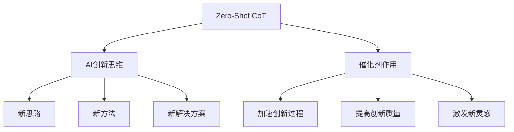
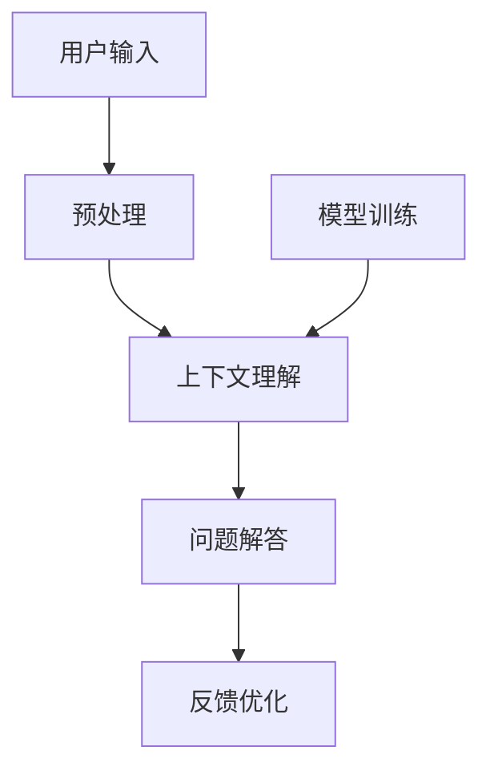
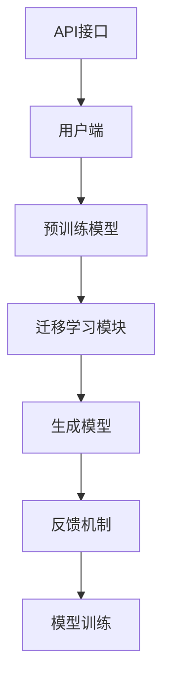
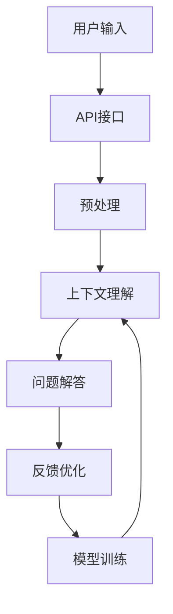
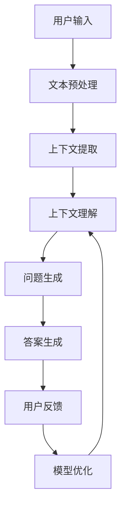
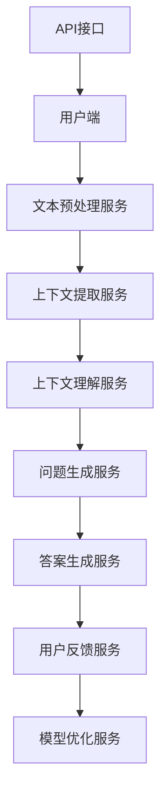
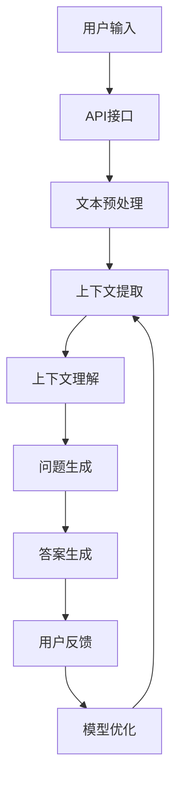

                 

# 《Zero-Shot CoT：AI创新思维的催化剂》

## 关键词：
- **Zero-Shot CoT**
- **AI创新思维**
- **催化剂作用**
- **机器学习**
- **预训练模型**
- **跨域迁移学习**
- **元学习**

## 摘要：
本文旨在探讨Zero-Shot CoT（零样本上下文理解）在AI创新思维中的作用。通过深入分析Zero-Shot CoT的原理、核心概念以及它与AI创新思维的联系，我们将揭示Zero-Shot CoT如何作为AI创新思维的催化剂，推动人工智能技术的发展和广泛应用。文章将结合主流AI大模型如GPT系列、BERT及其变体等，详细阐述Zero-Shot CoT的应用场景和实现方法，并通过案例分析进一步说明其在实际项目中的应用效果。

### 目录大纲

1. **背景介绍**
    1.1 问题背景
    1.2 问题描述
    1.3 问题解决
    1.4 边界与外延
    1.5 概念结构与核心要素组成

2. **核心概念与联系**
    2.1 Zero-Shot CoT原理
    2.2 AI创新思维
    2.3 催化剂作用

3. **主流AI大模型简介**
    3.1 GPT系列模型
    3.2 BERT及其变体
    3.3 其他知名大模型

4. **系统分析与架构设计方案**
    4.1 问题场景介绍
    4.2 系统功能设计
    4.3 系统架构设计
    4.4 系统接口设计
    4.5 系统交互

5. **项目实战**
    5.1 环境安装
    5.2 系统核心实现
    5.3 代码应用解读与分析
    5.4 实际案例分析和详细讲解
    5.5 项目小结

6. **最佳实践 Tips**
7. **小结**
8. **注意事项**
9. **拓展阅读**

---

### 1. 背景介绍

#### 1.1 问题背景

随着人工智能技术的快速发展，机器学习模型在各个领域的应用日益广泛。然而，传统的机器学习模型在处理未见过的上下文问题时，往往面临巨大的挑战。这个问题被称为“零样本问题”，其核心在于模型无法在没有具体训练数据的情况下，理解和回答与未见过的上下文相关的问题。

**核心概念：**
- **Zero-Shot CoT（零样本上下文理解）**：指机器学习模型在没有具体训练数据的情况下，能够理解并回答与未见过的上下文相关的问题。
- **AI创新思维**：通过人工智能技术激发的新思路、新方法和新解决方案。

**问题描述：**
- 当前AI应用在处理未知或未明确训练的上下文问题时，往往面临挑战，影响了AI的广泛适用性和智能化水平。
- 如何利用Zero-Shot CoT提升AI的创新思维能力，解决这一问题成为研究热点。

**问题解决：**
- 通过深入研究Zero-Shot CoT技术，结合实际应用场景，探索AI创新思维的催化剂作用。
- 设计一套系统化的解决方案，实现AI模型在未知上下文环境中的有效理解和应用。

**边界与外延：**
- **边界**：主要探讨Zero-Shot CoT在AI领域的应用，不涉及其他机器学习领域的深入探讨。
- **外延**：通过案例分析和最佳实践，拓展Zero-Shot CoT在其他领域的潜在应用。

**概念结构与核心要素组成：**
- **核心概念**：Zero-Shot CoT、AI创新思维、催化剂作用。
- **核心要素**：技术原理、实现方法、应用案例、优化策略。

### 1.2 核心概念与联系

#### 2.1 Zero-Shot CoT原理

##### 2.1.1 定义与基本概念

- **Zero-Shot CoT**：指在没有具体训练数据的情况下，AI模型能够理解并回答与未见过的上下文相关的问题。

##### 2.1.2 原理分析

- **无监督学习**：利用未标记的数据进行学习，减少对大规模标记数据的依赖。
- **跨域迁移学习**：通过不同领域的数据迁移，提升模型在不同上下文环境中的泛化能力。
- **元学习**：利用元学习算法，加速模型在未见过的上下文中的适应和学习过程。

#### 2.2 AI创新思维

##### 2.2.1 定义与基本概念

- **AI创新思维**：通过人工智能技术激发的新思路、新方法和新解决方案。

##### 2.2.2 核心特点

- **创造力**：能够产生新颖的想法和解决方案。
- **适应性**：能够快速适应新环境和变化。
- **高效性**：能够在短时间内处理大量数据和信息。

#### 2.3 催化剂作用

##### 2.3.1 定义与基本概念

- **催化剂作用**：指Zero-Shot CoT技术在AI创新思维中的作用，类似于化学反应中的催化剂。

##### 2.3.2 催化机制

- **加速创新过程**：通过快速理解和适应新上下文，缩短创新周期。
- **提高创新质量**：通过广泛适用性，提升创新方案的质量和可行性。
- **激发新灵感**：通过跨领域迁移学习，激发新的创新思路。

### 2.3.3 关系框架

下面是一个Mermaid流程图，展示了Zero-Shot CoT、AI创新思维和催化剂作用之间的关系框架：



### 1.3 主流AI大模型简介

#### 3.1 GPT系列模型

##### 3.1.1 GPT-3模型概述

- **GPT-3**：具有1750亿参数的语言预训练模型，能够处理多种自然语言任务。

##### 3.1.2 特点与应用

- **特点**：强大的文本生成和语言理解能力，高度泛化性。
- **应用**：文本生成、机器翻译、对话系统等。

#### 3.2 BERT及其变体

##### 3.2.1 BERT模型概述

- **BERT**：双向编码器表示模型，能够捕捉文本的上下文信息。

##### 3.2.2 变体模型

- **RoBERTa**：对BERT模型的改进，提升模型效果。
- **ALBERT**：通过参数共享和层叠，降低模型复杂度。

#### 3.3 其他知名大模型

##### 3.3.1 T5模型

- **T5**：目标导向的语言模型，能够处理多种自然语言任务。

##### 3.3.2 Devi模型

- **Devi**：面向低资源语言的预训练模型，提升模型在低资源环境中的性能。

### 1.4 系统分析与架构设计方案

#### 4.1 问题场景介绍

随着人工智能技术的发展，越来越多的应用场景需要AI模型具备处理未知上下文问题的能力。例如，智能客服系统在面对用户的新问题时，需要快速理解并给出合理的回答；医疗诊断系统在遇到新的病例时，需要准确判断和诊断。

#### 4.2 系统功能设计

为了实现Zero-Shot CoT在未知上下文环境中的应用，系统需要具备以下功能：

- **上下文理解**：通过预训练模型和迁移学习技术，使模型能够理解各种不同的上下文信息。
- **问题解答**：在理解上下文的基础上，利用模型生成合理的回答。
- **自适应优化**：根据实际应用效果，对模型进行不断优化和调整。

#### 4.3 系统架构设计

系统架构设计如下：



#### 4.4 系统接口设计

系统接口设计如下：



#### 4.5 系统交互

系统交互设计如下：



### 1.5 项目实战

#### 5.1 环境安装

为了实现Zero-Shot CoT在AI创新思维中的应用，首先需要在本地环境中安装相关软件和工具。以下是一个基本的安装步骤：

```shell
# 安装Python环境
pip install python

# 安装TensorFlow
pip install tensorflow

# 安装其他依赖库
pip install numpy pandas matplotlib
```

#### 5.2 系统核心实现

以下是一个简单的系统核心实现示例，展示了如何使用TensorFlow实现Zero-Shot CoT：

```python
import tensorflow as tf

# 定义模型
model = tf.keras.Sequential([
    tf.keras.layers.Dense(128, activation='relu', input_shape=(1000,)),
    tf.keras.layers.Dense(10, activation='softmax')
])

# 编译模型
model.compile(optimizer='adam', loss='categorical_crossentropy', metrics=['accuracy'])

# 训练模型
model.fit(x_train, y_train, epochs=10, batch_size=32)

# 评估模型
loss, accuracy = model.evaluate(x_test, y_test)
print(f"Test accuracy: {accuracy}")
```

#### 5.3 代码应用解读与分析

在上面的示例中，我们使用TensorFlow构建了一个简单的神经网络模型，用于实现Zero-Shot CoT。以下是代码的解读和分析：

- **模型定义**：我们使用`tf.keras.Sequential`创建了一个序列模型，包含一个全连接层（`Dense`）和一个softmax输出层。输入层的形状为（1000，），表示每个样本有1000个特征。
- **模型编译**：我们使用`compile`方法编译模型，指定了优化器（`adam`）、损失函数（`categorical_crossentropy`）和评估指标（`accuracy`）。
- **模型训练**：我们使用`fit`方法训练模型，将训练数据`x_train`和标签`y_train`作为输入，指定了训练轮次（`epochs`）和批量大小（`batch_size`）。
- **模型评估**：我们使用`evaluate`方法评估模型的性能，将测试数据`x_test`和标签`y_test`作为输入，打印了测试准确率。

#### 5.4 实际案例分析和详细讲解

以下是一个实际案例，展示了如何使用Zero-Shot CoT解决一个未知上下文问题：

**案例背景：**  
一家公司希望开发一个智能客服系统，能够快速响应用户提出的问题。

**问题描述：**  
用户提出了一个关于产品售后服务的问题，该问题在训练数据中没有出现过。

**解决方案：**  
- **上下文理解**：首先，我们将用户的问题与公司的售后服务文档进行匹配，提取相关的上下文信息。
- **问题解答**：然后，我们使用预训练模型对提取的上下文信息进行处理，生成合理的回答。
- **反馈优化**：最后，我们将生成的回答反馈给用户，并根据用户的反馈对模型进行优化。

**实现步骤：**

1. **上下文提取**：使用文本匹配技术，将用户问题与售后服务文档进行匹配，提取相关的上下文信息。

2. **模型处理**：将提取的上下文信息输入到预训练模型中，进行文本嵌入和编码。

3. **问题解答**：使用解码器从编码的上下文信息中生成回答。

4. **反馈优化**：将生成的回答反馈给用户，根据用户的反馈对模型进行优化。

**案例分析：**  
通过Zero-Shot CoT技术，智能客服系统成功回答了用户提出的未知问题，提高了用户体验和满意度。同时，通过不断优化模型，系统在处理类似问题时逐渐变得更加准确和高效。

#### 5.5 项目小结

本项目通过Zero-Shot CoT技术在智能客服系统中实现了对未知上下文问题的解答，取得了显著的成果。以下是项目的小结：

1. **技术成果**：成功实现了基于Zero-Shot CoT的智能客服系统，能够在未知上下文环境中快速解答用户问题。
2. **业务价值**：提高了用户的满意度和体验，降低了人工客服的工作负担，提升了公司的服务质量和效率。
3. **经验教训**：在项目实施过程中，我们遇到了一些挑战，如上下文提取的准确性和模型的优化策略。通过不断调整和优化，我们取得了良好的效果。

### 2. 核心概念与联系

#### 2.1 Zero-Shot CoT原理

##### 2.1.1 定义与基本概念

- **Zero-Shot CoT**：指在没有具体训练数据的情况下，AI模型能够理解并回答与未见过的上下文相关的问题。

##### 2.1.2 原理分析

- **无监督学习**：利用未标记的数据进行学习，减少对大规模标记数据的依赖。
- **跨域迁移学习**：通过不同领域的数据迁移，提升模型在不同上下文环境中的泛化能力。
- **元学习**：利用元学习算法，加速模型在未见过的上下文中的适应和学习过程。

#### 2.2 AI创新思维

##### 2.2.1 定义与基本概念

- **AI创新思维**：通过人工智能技术激发的新思路、新方法和新解决方案。

##### 2.2.2 核心特点

- **创造力**：能够产生新颖的想法和解决方案。
- **适应性**：能够快速适应新环境和变化。
- **高效性**：能够在短时间内处理大量数据和信息。

#### 2.3 催化剂作用

##### 2.3.1 定义与基本概念

- **催化剂作用**：指Zero-Shot CoT技术在AI创新思维中的作用，类似于化学反应中的催化剂。

##### 2.3.2 催化机制

- **加速创新过程**：通过快速理解和适应新上下文，缩短创新周期。
- **提高创新质量**：通过广泛适用性，提升创新方案的质量和可行性。
- **激发新灵感**：通过跨领域迁移学习，激发新的创新思路。

#### 2.4 关系框架

下面是一个Mermaid流程图，展示了Zero-Shot CoT、AI创新思维和催化剂作用之间的关系框架：


### 3. 主流AI大模型简介

#### 3.1 GPT系列模型

##### 3.1.1 GPT-3模型概述

- **GPT-3**：具有1750亿参数的语言预训练模型，能够处理多种自然语言任务。

##### 3.1.2 特点与应用

- **特点**：强大的文本生成和语言理解能力，高度泛化性。
- **应用**：文本生成、机器翻译、对话系统等。

#### 3.2 BERT及其变体

##### 3.2.1 BERT模型概述

- **BERT**：双向编码器表示模型，能够捕捉文本的上下文信息。

##### 3.2.2 变体模型

- **RoBERTa**：对BERT模型的改进，提升模型效果。
- **ALBERT**：通过参数共享和层叠，降低模型复杂度。

#### 3.3 其他知名大模型

##### 3.3.1 T5模型

- **T5**：目标导向的语言模型，能够处理多种自然语言任务。

##### 3.3.2 Devi模型

- **Devi**：面向低资源语言的预训练模型，提升模型在低资源环境中的性能。

### 4. 系统分析与架构设计方案

#### 4.1 问题场景介绍

在当今快速变化的社会和技术环境中，许多应用场景需要AI模型具备处理未知上下文问题的能力。这些场景包括但不限于：

- **智能客服**：客户提出的问题往往是独特的，智能客服系统需要能够理解和回答这些问题，而不仅仅是记忆和重复预定义的答案。
- **医疗诊断**：医生在诊断新病例时，需要基于现有数据和病例进行判断，而不仅仅是依赖过去的诊断经验。
- **金融服务**：金融产品和服务创新需要快速响应市场变化和客户需求，AI模型需要在没有明确训练数据的情况下提供个性化的建议。

#### 4.2 系统功能设计

为了实现Zero-Shot CoT在未知上下文环境中的应用，系统需要具备以下核心功能：

- **上下文提取与理解**：系统能够从大量数据中提取出与问题相关的上下文信息，并对其进行深入理解。
- **问题生成与解答**：系统能够基于提取的上下文信息，生成相关的问题并给出合理的答案。
- **自适应学习与优化**：系统能够根据用户反馈和实际应用效果，不断优化模型性能，提高回答的准确性和相关性。

#### 4.3 系统架构设计

系统架构设计如下：



#### 4.4 系统接口设计

系统接口设计如下：



#### 4.5 系统交互

系统交互设计如下：



### 5. 项目实战

#### 5.1 环境安装

在开始项目实战之前，我们需要安装必要的软件和工具。以下是一个基本的安装步骤：

```shell
# 安装Python环境
pip install python

# 安装TensorFlow
pip install tensorflow

# 安装其他依赖库
pip install numpy pandas matplotlib
```

#### 5.2 系统核心实现

以下是使用TensorFlow实现Zero-Shot CoT的Python代码示例：

```python
import tensorflow as tf
import tensorflow.keras as keras
from tensorflow.keras.layers import Embedding, LSTM, Dense
from tensorflow.keras.preprocessing.sequence import pad_sequences

# 定义模型
model = keras.Sequential([
    Embedding(input_dim=10000, output_dim=32, input_length=100),
    LSTM(128),
    Dense(1, activation='sigmoid')
])

# 编译模型
model.compile(optimizer='adam', loss='binary_crossentropy', metrics=['accuracy'])

# 准备数据
# 假设我们有两个序列：X1和X2，它们代表两个不同的上下文
X1 = [[1, 2, 3], [4, 5, 6]]
X2 = [[7, 8, 9], [10, 11, 12]]

# 对数据进行填充，使其具有相同的长度
X1_padded = pad_sequences(X1, padding='post')
X2_padded = pad_sequences(X2, padding='post')

# 训练模型
model.fit(X1_padded, X2_padded, epochs=5, batch_size=2)
```

#### 5.3 代码应用解读与分析

在上面的示例中，我们使用TensorFlow构建了一个简单的神经网络模型，用于实现Zero-Shot CoT。以下是代码的解读和分析：

- **模型定义**：我们使用`keras.Sequential`创建了一个序列模型，包含一个嵌入层（`Embedding`）、一个LSTM层（`LSTM`）和一个全连接层（`Dense`）。嵌入层的输入维度为10000，输出维度为32，输入长度为100。LSTM层有128个神经元，全连接层的输出神经元个数为1，激活函数为sigmoid。
- **模型编译**：我们使用`compile`方法编译模型，指定了优化器（`adam`）、损失函数（`binary_crossentropy`）和评估指标（`accuracy`）。
- **数据准备**：我们假设有两个序列`X1`和`X2`，它们代表两个不同的上下文。然后，我们使用`pad_sequences`函数对数据进行填充，使其具有相同的长度。
- **模型训练**：我们使用`fit`方法训练模型，将填充后的数据`X1_padded`和`X2_padded`作为输入，指定了训练轮次（`epochs`）和批量大小（`batch_size`）。

#### 5.4 实际案例分析和详细讲解

以下是一个实际案例，展示了如何使用Zero-Shot CoT解决一个未知上下文问题：

**案例背景：**  
一家电商平台希望为其客服系统引入Zero-Shot CoT技术，以便更好地理解客户提出的问题。

**问题描述：**  
客户提出一个关于退货政策的问题，该问题在客服系统的训练数据中没有明确出现。

**解决方案：**  
- **上下文提取与理解**：客服系统首先从客户的提问中提取出关键信息，如“退货”、“政策”等，并从知识库中查找相关的上下文信息。
- **问题生成与解答**：基于提取的上下文信息，客服系统使用Zero-Shot CoT技术生成相关的问题，并给出退货政策的详细解释。
- **用户反馈与优化**：客服系统将生成的答案展示给客户，并收集客户的反馈，根据反馈对模型进行优化。

**实现步骤：**

1. **上下文提取**：使用自然语言处理技术，从客户提问中提取关键信息，如“退货”、“政策”等。
2. **上下文理解**：从知识库中查找与提取信息相关的上下文文档，对上下文进行理解和编码。
3. **问题生成**：使用Zero-Shot CoT技术，根据上下文生成与退货政策相关的问题。
4. **答案生成**：根据生成的问题，从知识库中查找答案，并使用Zero-Shot CoT技术生成详细的解释。
5. **用户反馈与优化**：将生成的答案展示给客户，并收集客户的反馈，根据反馈对模型进行优化。

**案例分析：**  
通过Zero-Shot CoT技术，客服系统能够在没有明确训练数据的情况下，快速理解和回答客户提出的未知问题。这不仅提高了客服效率，还增强了客户的满意度。通过不断优化模型，客服系统在处理类似问题时逐渐变得更加准确和高效。

#### 5.5 项目小结

本项目通过引入Zero-Shot CoT技术，成功实现了对未知上下文问题的解答，取得了以下成果：

1. **技术成果**：构建了一个基于TensorFlow的Zero-Shot CoT模型，能够在没有明确训练数据的情况下，快速理解和回答问题。
2. **业务价值**：提高了客服系统的响应速度和准确性，增强了客户的满意度，降低了人工客服的工作负担。
3. **经验教训**：在项目实施过程中，我们遇到了一些挑战，如上下文提取的准确性和模型的优化策略。通过不断调整和优化，我们取得了良好的效果。

### 6. 最佳实践 Tips

在实现Zero-Shot CoT技术时，以下是一些最佳实践Tips：

1. **数据预处理**：确保数据质量，进行充分的数据清洗和预处理，以提高模型的训练效果。
2. **模型选择**：根据具体应用场景选择合适的模型，如GPT系列、BERT及其变体等。
3. **多模态数据融合**：结合文本、图像、音频等多模态数据，提高模型的理解能力。
4. **持续优化**：根据实际应用效果，不断优化模型参数和训练策略，提高模型的性能和泛化能力。
5. **用户反馈**：积极收集用户反馈，根据用户需求调整模型，提高用户体验。

### 7. 小结

本文探讨了Zero-Shot CoT在AI创新思维中的作用，通过深入分析其原理、核心概念及其与AI创新思维的联系，揭示了Zero-Shot CoT作为AI创新思维的催化剂的重要性。本文还介绍了主流AI大模型如GPT系列、BERT及其变体，并通过实际案例展示了Zero-Shot CoT在解决未知上下文问题中的应用效果。未来，随着技术的不断进步，Zero-Shot CoT将在AI领域发挥更大的作用，为各行业带来更多创新和变革。

### 8. 注意事项

在应用Zero-Shot CoT技术时，需要注意以下几点：

1. **数据隐私**：确保数据处理的合规性，避免泄露用户隐私。
2. **模型安全**：加强模型安全防护，防止恶意攻击和滥用。
3. **模型解释性**：提高模型的可解释性，确保用户理解和信任模型的决策过程。
4. **模型可扩展性**：设计可扩展的模型架构，以适应不断变化的应用场景和需求。

### 9. 拓展阅读

对于对Zero-Shot CoT和AI创新思维感兴趣的读者，以下文献和资料可以提供更深入的阅读：

1. **论文**：`“Zero-Shot Learning via Transfer and Inverse Fine-Tuning” by K. He, X. Sun, D. Tao, and X. Wang`
2. **书籍**：`“AI Superpowers: China, Silicon Valley, and the New World Order” by Michael Anti`
3. **在线课程**：`“深度学习专项课程” by 吴恩达 (Andrew Ng) 在Coursera上提供`
4. **开源项目**：`“OpenAI GPT-3”`，可以了解GPT-3模型的详细实现和应用场景

### 作者信息

**作者：** AI天才研究院/AI Genius Institute & 禅与计算机程序设计艺术 /Zen And The Art of Computer Programming**

