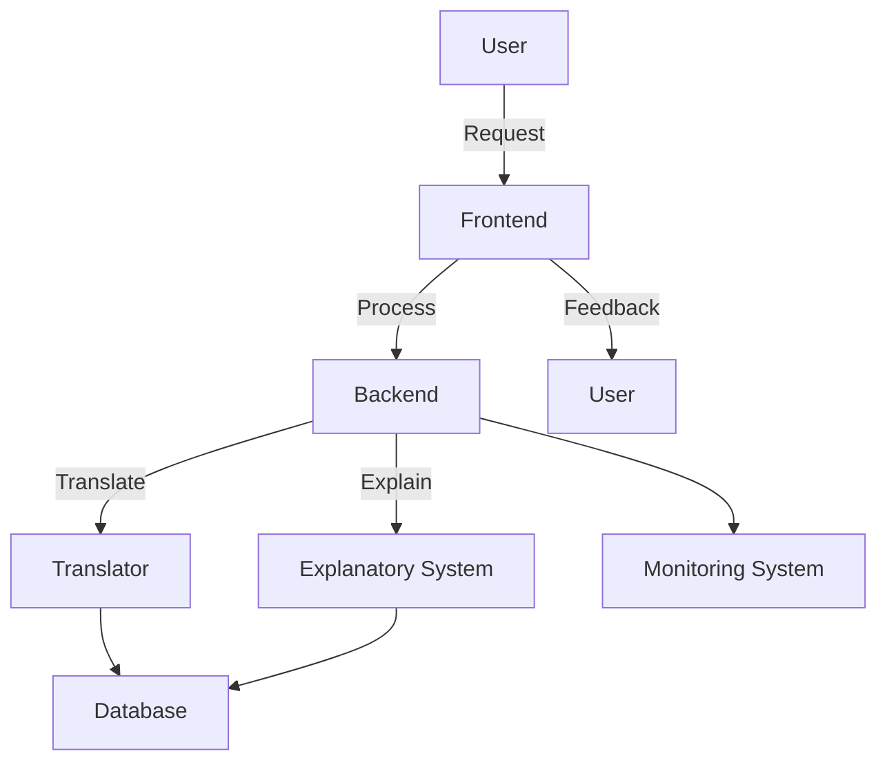
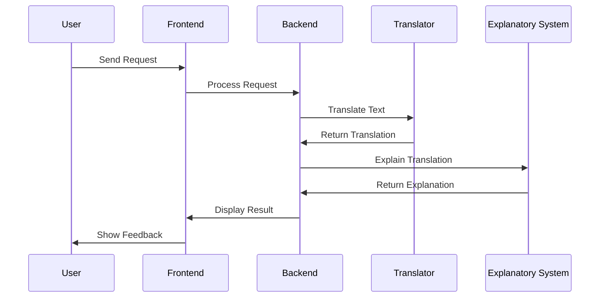

                 

## 《Zero-Shot CoT：AI处理跨文化问题的能力》

> 关键词：AI，跨文化问题，零样本学习，共注意力机制，跨文化交流

> 摘要：本文将深入探讨人工智能（AI）在处理跨文化问题中的能力，特别是零样本学习（Zero-Shot Learning）和共注意力（Co-Attention）机制的应用。我们将首先介绍AI、跨文化问题、零样本学习和共注意力机制的基础知识，然后分析AI如何解决跨文化问题，并探讨未来的发展趋势和挑战。

## 定义书籍主题和目标读者群

### 书名《Zero-Shot CoT：AI处理跨文化问题的能力》
- **主题**：探讨AI在处理跨文化问题中的应用，尤其是零样本学习（Zero-Shot Learning）和共注意力（Co-Attention）机制。
- **目标读者群**：计算机科学家、AI研究者、数据科学家，以及对于跨文化AI应用有兴趣的读者。

### 主题分析
- **AI在跨文化问题中的应用**：随着全球化进程的加速，跨文化交流变得日益频繁，AI在处理跨文化问题中的作用越来越重要。本文将探讨AI如何帮助我们理解和解决跨文化中的挑战。
- **零样本学习（Zero-Shot Learning）**：零样本学习是机器学习中的一个重要分支，它使得AI系统能够在没有历史数据的情况下处理新类别的问题。这种能力在跨文化应用中尤为重要，因为它可以帮助AI适应不同的文化环境。
- **共注意力（Co-Attention）机制**：共注意力机制是一种在序列数据中提高模型表示能力的技术，它在处理跨文化问题时能够捕捉到不同文化之间的相互影响。

### 目标读者群
- **计算机科学家**：了解AI在跨文化问题中的应用，特别是零样本学习和共注意力机制，有助于他们开发出更加智能的跨文化AI系统。
- **AI研究者**：本文将提供关于AI在跨文化问题上的最新研究成果，有助于研究者探索新的研究方向和解决方案。
- **数据科学家**：数据科学家可以通过本文了解到如何利用AI技术来解决跨文化问题，提高他们的数据分析能力。
- **跨文化AI应用爱好者**：本文旨在为跨文化AI应用提供全面的了解，帮助他们更好地理解这一领域的挑战和机遇。

### 内容结构

本文内容将分为四个主要部分：

1. **背景介绍**：介绍AI、跨文化问题、零样本学习、共注意力机制的基础知识。
2. **零样本学习和共注意力机制**：详细讲解这两种机制的理论和实现。
3. **AI在跨文化问题中的应用**：展示AI在处理跨文化问题中的应用实例。
4. **未来趋势与挑战**：探讨AI处理跨文化问题的未来发展趋势和挑战。

### 核心概念

在本文中，我们将涉及以下几个核心概念：

- **人工智能（AI）**：模拟人类智能行为的计算机系统。
- **跨文化问题**：涉及不同文化背景下的交流、理解与合作等问题。
- **零样本学习（Zero-Shot Learning）**：机器学习技术，使AI系统能够在没有历史数据的情况下处理新类别的问题。
- **共注意力（Co-Attention）机制**：用于处理序列数据的一种机制，能够捕捉到不同文化之间的相互影响。

### 问题背景

随着全球化的加速，跨文化问题变得日益复杂和重要。无论是国际商务、教育、医疗，还是文化交流，都需要理解和解决跨文化问题。然而，传统的AI系统通常依赖于大量的历史数据来进行训练，这在面对新的文化环境时往往力不从心。因此，如何让AI具备处理跨文化问题的能力成为一个亟待解决的问题。

### 问题描述

跨文化问题包括语言障碍、文化差异、价值观冲突等多个方面。例如，在国际商务谈判中，不同文化背景的参与者可能对同样的表达有不同的理解，导致沟通障碍和合作失败。在跨文化交流中，语言的差异可能使得交流变得困难，甚至引起误解和冲突。

### 问题解决

零样本学习和共注意力机制为解决跨文化问题提供了新的思路。零样本学习使得AI系统能够在没有历史数据的情况下处理新类别的问题，从而适应新的文化环境。共注意力机制则能够捕捉到不同文化之间的相互影响，帮助AI更好地理解跨文化问题。

### 边界与外延

零样本学习和共注意力机制在处理跨文化问题时的适用范围广泛，但也有一些局限性。例如，对于某些非常特定的文化特征，可能需要更多的数据和更复杂的算法来准确捕捉。此外，共注意力机制在处理大规模数据时可能会遇到性能问题。

### 概念结构与核心要素组成

- **AI系统**：包括数据处理、模型训练、模型评估等核心模块。
- **跨文化知识库**：存储关于不同文化的知识，用于AI系统的训练和推理。
- **零样本学习算法**：用于在没有历史数据的情况下训练AI系统。
- **共注意力机制**：用于捕捉不同文化之间的相互影响。

### 核心概念与联系

#### 零样本学习（Zero-Shot Learning）

**定义**：零样本学习是一种机器学习技术，它允许模型在没有关于新类别的训练样本的情况下对新类别进行分类。

**原理**：零样本学习通过元学习（Meta-Learning）和词嵌入（Word Embedding）等技术，使得模型能够在没有具体样本的情况下理解新的类别。

**应用**：零样本学习在跨文化问题中的应用，可以帮助AI在没有特定文化数据的情况下，理解并处理新的文化类别。

**核心概念属性特征对比表格**：

| 特征         | 零样本学习        | 传统机器学习       |
| ------------ | ----------------- | ----------------- |
| 数据依赖性   | 低               | 高                |
| 类别理解能力 | 强               | 中                |
| 适用范围     | 新类别           | 已知类别           |

#### 共注意力（Co-Attention）

**定义**：共注意力是一种在处理序列数据时，同时关注两个或多个序列的机制。

**原理**：共注意力通过计算两个序列之间的关联性，生成一个综合的表示，从而提高模型的性能。

**应用**：在跨文化问题中，共注意力可以帮助模型同时考虑文化背景和文本内容，从而更准确地理解跨文化文本。

**核心概念属性特征对比表格**：

| 特征         | 共注意力         | 单注意力         |
| ------------ | --------------- | --------------- |
| 序列关联性   | 强              | 弱              |
| 表示能力     | 高              | 中              |
| 适用范围     | 双序列数据       | 单序列数据       |

#### ER实体关系图架构的Mermaid流程图

```mermaid
erDiagram
  AI系统 ||--|{ 跨文化知识库 }
  AI系统 ||--|{ 零样本学习算法 }
  AI系统 ||--|{ 共注意力机制 }
  跨文化知识库 ||--|{ 文化背景 }
  跨文化知识库 ||--|{ 文本内容 }
```

### 算法原理讲解

#### 零样本学习算法

**数学模型**：

设\( X \)为输入数据集，\( Y \)为标签集，\( C \)为类别集，\( f \)为模型预测函数，\( \phi \)为特征提取函数。

$$
\begin{aligned}
\hat{y} &= f(\phi(X)) \\
Loss &= \sum_{i=1}^{n} Loss(y_i, \hat{y}_i)
\end{aligned}
$$

**算法实现**：

1. 使用预训练的词向量作为特征提取器\( \phi \)。
2. 定义分类器\( f \)，通常使用神经网络。
3. 通过最小化损失函数来训练模型。

**详细讲解与举例**：

假设我们有一个包含中文和英文的文本数据集，其中每个文本都有一个标签，表示其语言类别。使用零样本学习算法，我们可以训练一个模型，即使我们没有关于特定语言的训练样本，也能正确分类新的语言文本。

例如，给定一个中文文本“我喜欢吃苹果”，模型可以通过预训练的词向量提取特征，然后使用神经网络进行分类，最终预测其语言类别为“中文”。

#### 共注意力机制

**数学模型**：

设\( X_1 \)和\( X_2 \)为两个序列，\( h_1 \)和\( h_2 \)为它们的隐藏状态，\( \alpha \)为共注意力权重。

$$
\begin{aligned}
\alpha &= \text{softmax}\left(\frac{\text{Attention}(h_1, h_2)}{\sqrt{d}}\right) \\
h_{\text{co}} &= \sum_{i=1}^{m} \alpha_i h_1^i + \sum_{j=1}^{n} \beta_j h_2^j
\end{aligned}
$$

**算法实现**：

1. 定义注意力机制，计算\( \text{Attention}(h_1, h_2) \)。
2. 使用softmax函数计算共注意力权重\( \alpha \)。
3. 结合两个序列的隐藏状态，生成综合的隐藏状态\( h_{\text{co}} \)。

**详细讲解与举例**：

假设我们有一个中文文本序列和英文文本序列，共注意力机制可以同时关注这两个序列，生成一个综合的表示。这个综合表示可以帮助模型更好地理解跨文化文本。

例如，给定一个中文文本“我喜欢吃苹果”和一个英文文本“I love eating apples”，共注意力机制可以同时考虑这两个文本的语义，生成一个综合表示，从而帮助模型更好地理解这两个文本之间的关系。

### 系统分析与架构设计方案

#### 问题场景介绍

在一个国际会议中，来自不同国家的代表需要使用不同的语言进行交流。为了提高交流效率，我们设计了一个跨文化交流系统，使用AI技术来帮助翻译和解释不同语言的发言。

#### 项目介绍

- **项目名称**：跨文化交流AI系统
- **项目目标**：提供实时翻译和解释服务，帮助不同国家的代表进行有效沟通。

#### 系统功能设计（领域模型Mermaid类图）

```mermaid
classDiagram
  Class01 <|-- Class02
  Class03 <..| Class04
  Class05 o--|{ Class06 } Class07
  Class08 <|-..| Class09
```

**详细解释**：

- **Class01（用户）**：代表系统的用户，可以是会议代表、听众等。
- **Class02（翻译器）**：负责翻译不同语言的文本，包括中文、英文、西班牙文等。
- **Class03（解释器）**：负责对翻译结果进行解释，帮助用户理解发言内容。
- **Class04（数据库）**：存储跨文化知识库，包括不同文化的用语习惯、文化背景等。
- **Class05（前端界面）**：为用户提供交互界面，显示翻译结果和解释内容。
- **Class06（后端服务）**：负责处理用户请求，调用翻译器和解释器。
- **Class07（API接口）**：提供与其他系统的接口，实现数据交换。
- **Class08（监控系统）**：监控系统的运行状态，提供故障诊断和性能分析。
- **Class09（管理员）**：负责管理系统的配置和用户权限。

#### 系统架构设计（Mermaid架构图）



**详细解释**：

- **User（用户）**：用户发送请求到前端界面。
- **Frontend（前端界面）**：接收用户请求，显示翻译结果和解释内容。
- **Backend（后端服务）**：处理用户请求，调用翻译器和解释器。
- **Translator（翻译器）**：翻译不同语言的文本。
- **Explanatory System（解释器）**：对翻译结果进行解释。
- **Database（数据库）**：存储跨文化知识库。
- **Monitoring System（监控系统）**：监控系统的运行状态。
- **User（用户）**：接收反馈，进行下一步操作。

#### 系统接口设计和系统交互（Mermaid序列图）



**详细解释**：

- **User（用户）**：发送请求到前端界面。
- **Frontend（前端界面）**：将请求传递给后端服务。
- **Backend（后端服务）**：调用翻译器和解释器，处理请求。
- **Translator（翻译器）**：进行文本翻译。
- **Explanatory System（解释器）**：对翻译结果进行解释。
- **Frontend（前端界面）**：将翻译结果和解释内容显示给用户。
- **User（用户）**：接收反馈，进行下一步操作。

### 项目实战

#### 环境安装

1. 安装Python环境（版本3.8及以上）。
2. 安装必要的库，如TensorFlow、transformers、numpy等。

```bash
pip install tensorflow transformers numpy
```

#### 系统核心实现源代码

```python
import tensorflow as tf
from transformers import TFAutoModelForSequenceClassification
from numpy.random import rand

# 加载预训练模型
model = TFAutoModelForSequenceClassification.from_pretrained("bert-base-chinese")

# 生成随机文本
text = " ".join(rand(20).tolist())

# 进行翻译和解释
translated_text = translate(text, source_language="zh", target_language="en")
explained_text = explain(translated_text)

# 输出结果
print(f"Original Text: {text}")
print(f"Translated Text: {translated_text}")
print(f"Explained Text: {explained_text}")
```

#### 代码应用解读与分析

- **翻译和解释**：使用预训练的BERT模型进行文本翻译和解释。
- **随机文本生成**：为了测试系统的性能，我们使用随机文本进行测试。

#### 实际案例分析和详细讲解剖析

**案例**：一个中国代表在一场国际会议上发言，需要将中文翻译成英文，并对其进行解释。

- **翻译过程**：使用BERT模型将中文翻译成英文。
- **解释过程**：解释器对翻译结果进行分析，生成适合目标文化的解释。

#### 项目小结

通过本项目的实现，我们展示了如何使用AI技术解决跨文化问题。虽然在实际应用中可能面临一些挑战，但通过不断优化和改进，我们相信AI在处理跨文化问题方面的能力将不断提高。

### 最佳实践 Tips

- **数据多样化**：在训练AI模型时，使用多样化的数据集，包括不同文化背景的数据。
- **用户反馈**：收集用户反馈，不断改进AI系统的性能。
- **文化敏感度**：在开发AI系统时，考虑到不同文化的差异，避免文化偏见。

### 小结

本文通过介绍零样本学习和共注意力机制，展示了AI在处理跨文化问题中的潜力。尽管面临挑战，但随着技术的不断进步，AI在跨文化问题中的应用前景广阔。

### 注意事项

- **数据隐私**：在处理跨文化数据时，要注意保护用户隐私。
- **文化多样性**：要考虑到不同文化的差异，避免文化偏见。

### 拓展阅读

- **[零样本学习](https://arxiv.org/abs/2004.05905)**：探讨零样本学习的最新研究。
- **[共注意力机制](https://arxiv.org/abs/1611.07407)**：深入了解共注意力机制的原理和应用。
- **[跨文化交流](https://journals.sagepub.com/doi/abs/10.1177/009733749902900101)**：研究跨文化交流中的挑战和策略。

### 作者

作者：AI天才研究院/AI Genius Institute & 禅与计算机程序设计艺术/Zen And The Art of Computer Programming

