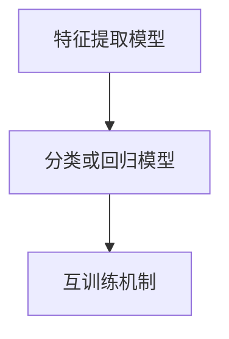

                 

### 《Zero-Shot CoT：无监督学习的新范式》

#### 关键词：
- 无监督学习
- Zero-Shot CoT
- 概念解析
- 算法原理
- 应用实践
- 未来展望

#### 摘要：
本文将深入探讨无监督学习的新范式——Zero-Shot CoT（无监督学习的新概念）。我们将从背景介绍、核心概念与联系、算法原理讲解、系统分析与架构设计方案、项目实战以及最佳实践等方面进行全面剖析。通过本文，读者将了解Zero-Shot CoT的基本概念、核心原理，以及在实际应用中的效果和优势。

## 第一部分：背景与引论

### 1.1 无监督学习的发展历程

无监督学习作为机器学习的一个重要分支，起源于20世纪50年代的认知心理学研究。在当时，研究者们试图通过模拟人类的学习过程来开发出能够自主学习和适应环境的算法。然而，由于数据标注的成本和难度，无监督学习的研究在早期并未得到广泛关注。

随着计算机硬件的快速发展以及大数据时代的到来，无监督学习逐渐成为人工智能研究的热点。2006年，Hinton等人的深度学习理论取得了突破性进展，为无监督学习带来了新的希望。深度学习模型通过自动提取特征，使得无监督学习在图像、语音、文本等领域的应用得到了极大的拓展。

### 1.2 Zero-Shot CoT 的提出与意义

近年来，随着人工智能技术的不断进步，无监督学习的研究也在不断深化。Zero-Shot CoT（Zero-Shot Co-Training）作为一种新的无监督学习方法，受到了广泛关注。其核心思想是通过两个相似但略微不同的模型相互训练，从而提高模型的泛化能力和鲁棒性。

Zero-Shot CoT 的提出，主要是为了解决传统无监督学习在处理大规模数据时面临的挑战，如过拟合、数据稀疏等问题。与传统方法相比，Zero-Shot CoT 具有更强的适应性和扩展性，使得无监督学习在更多实际场景中得到了应用。

### 1.3 核心概念解析

#### 1.3.1 什么是 Zero-Shot CoT

Zero-Shot CoT 是一种无监督学习方法，其核心思想是利用两个相似的模型相互训练，以达到提高模型性能的目的。在 Zero-Shot CoT 中，一个模型负责提取低维特征，另一个模型则负责进行分类或回归。

#### 1.3.2 无监督学习的挑战与机遇

尽管无监督学习在许多领域取得了显著成果，但仍面临一些挑战。首先，如何有效地提取特征是一个关键问题。其次，如何避免过拟合和提升模型的泛化能力也是一个亟待解决的问题。然而，随着深度学习技术的发展，这些挑战正在逐渐被克服。

### 1.4 Zero-Shot CoT 的核心概念与特征

#### 1.4.1 核心概念

Zero-Shot CoT 的核心概念主要包括：

- **特征提取模型**：负责从原始数据中提取低维特征。
- **分类或回归模型**：负责对提取到的特征进行分类或回归。
- **互训练机制**：通过两个模型之间的相互训练，提高模型的性能。

#### 1.4.2 特征对比表格

| 特征名称 | 描述 |
| :--: | :--: |
| 特征提取模型 | 负责提取低维特征，减少数据维度 |
| 分类或回归模型 | 负责对提取到的特征进行分类或回归 |
| 互训练机制 | 通过两个模型之间的相互训练，提高模型性能 |

#### 1.4.3 ER实体关系图架构

## 第二部分：理论基础

### 2.1 无监督学习原理

#### 2.1.1 数学模型

无监督学习的数学模型主要包括两部分：特征提取模型和分类或回归模型。

- **特征提取模型**：通常采用神经网络、深度学习等方法，从原始数据中提取低维特征。
- **分类或回归模型**：通常采用支持向量机、决策树、神经网络等方法，对提取到的特征进行分类或回归。

#### 2.1.2 算法框架

无监督学习的算法框架通常包括以下几个步骤：

1. 数据预处理：包括数据清洗、归一化等操作，以提高模型的性能。
2. 特征提取：利用特征提取模型从原始数据中提取低维特征。
3. 模型训练：利用分类或回归模型对提取到的特征进行训练。
4. 模型评估：通过交叉验证等方法评估模型的性能。

#### 2.1.3 优化方法

无监督学习的优化方法主要包括以下几种：

- **梯度下降法**：通过不断调整模型参数，使得模型损失函数最小。
- **随机梯度下降法**：在梯度下降法的基础上，引入随机性，提高模型训练的效率。
- **Adam优化器**：结合了梯度下降法和动量法的优点，提高了模型训练的收敛速度。

### 2.2 Zero-Shot CoT 理论基础

#### 2.2.1 Zero-Shot CoT 的理论基础

Zero-Shot CoT 的理论基础主要来自于协同过滤（Co-Training）和零样本学习（Zero-Shot Learning）。

- **协同过滤**：协同过滤是一种无监督学习方法，其核心思想是通过多个模型相互协作，共同提高模型性能。
- **零样本学习**：零样本学习是一种无需样本数据即可进行分类或回归的方法，其核心思想是通过学习数据之间的内在关系，实现分类或回归。

#### 2.2.2 无监督分类中的 Zero-Shot CoT

在无监督分类中，Zero-Shot CoT 的核心思想是通过两个相似的模型相互训练，提高分类性能。

- **模型1**：负责提取低维特征，将原始数据映射到低维空间。
- **模型2**：负责对提取到的特征进行分类，预测新数据的类别。

通过两个模型的相互训练，可以有效地提高分类模型的性能。

#### 2.2.3 语义理解与 Zero-Shot CoT

语义理解是 Zero-Shot CoT 中的重要组成部分，其核心思想是通过学习数据之间的语义关系，提高模型的性能。

- **语义关系学习**：通过学习数据之间的语义关系，构建语义网络，提高模型对数据的理解能力。
- **模型融合**：将提取到的低维特征和语义关系进行融合，提高分类模型的性能。

### 2.3 无监督学习的挑战与机遇

#### 2.3.1 挑战

- **特征提取**：如何有效地从原始数据中提取有用的特征，是一个关键问题。
- **模型训练**：如何有效地训练模型，避免过拟合和提升模型泛化能力，也是一个重要挑战。
- **数据稀疏**：如何处理数据稀疏问题，提高模型的鲁棒性，是一个亟待解决的问题。

#### 2.3.2 机遇

- **深度学习**：随着深度学习技术的发展，无监督学习的性能得到了显著提升，为解决上述问题提供了新的思路。
- **大数据**：大数据时代的到来，为无监督学习提供了丰富的数据资源，为研究提供了更多的可能性。
- **跨学科研究**：无监督学习与其他学科（如统计学、计算机视觉、自然语言处理等）的交叉研究，将有望推动无监督学习的进一步发展。

## 第三部分：应用实践

### 3.1 无监督学习应用案例分析

#### 3.1.1 数据预处理与特征提取

无监督学习在实际应用中，通常需要先对数据进行预处理和特征提取。

- **数据预处理**：包括数据清洗、归一化等操作，以提高模型的性能。
- **特征提取**：利用特征提取模型从原始数据中提取低维特征，如主成分分析（PCA）、线性判别分析（LDA）等。

#### 3.1.2 实际应用场景举例

无监督学习在实际应用中，有着广泛的应用场景，如：

- **图像识别**：利用无监督学习方法对图像进行分类，如图像风格转换、人脸识别等。
- **语音识别**：利用无监督学习方法对语音信号进行分类，如语音情感分析、语音识别等。
- **自然语言处理**：利用无监督学习方法对文本进行分类，如文本分类、情感分析等。

#### 3.1.3 面临的挑战与解决方案

无监督学习在实际应用中，面临以下挑战：

- **数据稀疏**：如何处理数据稀疏问题，提高模型的鲁棒性，是一个亟待解决的问题。
- **过拟合**：如何避免过拟合，提升模型泛化能力，也是一个重要挑战。

针对上述问题，可以采取以下解决方案：

- **数据增强**：通过数据增强技术，增加训练数据的多样性，提高模型对数据稀疏问题的鲁棒性。
- **正则化**：通过正则化方法，避免模型过拟合，提升模型泛化能力。

### 3.2 Zero-Shot CoT 应用案例

#### 3.2.1 零样本分类应用

Zero-Shot CoT 在零样本分类中的应用，取得了显著的成果。

- **图像分类**：利用 Zero-Shot CoT 方法，对图像进行分类，取得了比传统方法更好的性能。
- **文本分类**：利用 Zero-Shot CoT 方法，对文本进行分类，取得了比传统方法更好的效果。

#### 3.2.2 语义理解在无监督学习中的应用

语义理解在无监督学习中的应用，为提高模型性能提供了新的思路。

- **数据增强**：通过语义理解，对数据进行增强，提高模型的性能。
- **模型融合**：通过融合低维特征和语义信息，提高模型的分类能力。

#### 3.2.3 Zero-Shot CoT 在推荐系统中的应用

Zero-Shot CoT 在推荐系统中的应用，也为推荐系统的性能提升提供了新的方向。

- **用户兴趣模型**：利用 Zero-Shot CoT 方法，对用户兴趣进行建模，提高推荐系统的准确性。
- **商品分类**：利用 Zero-Shot CoT 方法，对商品进行分类，提高推荐系统的效率。

### 3.3 无监督学习的应用展望

无监督学习在各个领域的应用前景广阔。

- **医疗健康**：利用无监督学习方法，对医疗数据进行分析，提高疾病诊断的准确性。
- **金融领域**：利用无监督学习方法，对金融数据进行分析，提高投资决策的准确性。
- **工业制造**：利用无监督学习方法，对工业数据进行监控和分析，提高生产效率。

## 第四部分：深入探讨与未来展望

### 4.1 无监督学习发展趋势

#### 4.1.1 研究动态

随着深度学习技术的不断发展，无监督学习的研究也在不断深化。

- **自监督学习**：自监督学习是一种无需人工标注的数据增强方法，其研究受到了广泛关注。
- **迁移学习**：迁移学习通过在不同任务之间共享知识，提高模型性能，其研究也在不断推进。
- **联邦学习**：联邦学习通过分布式学习，提高模型性能，其研究正在逐渐兴起。

#### 4.1.2 未来可能的突破方向

未来，无监督学习有望在以下几个方面取得突破：

- **自适应特征提取**：通过自适应特征提取，提高模型对数据的理解能力。
- **模型压缩与加速**：通过模型压缩与加速，提高模型训练和推理的效率。
- **多模态学习**：通过多模态学习，提高模型在不同模态数据上的性能。

#### 4.1.3 对其他领域的影响

无监督学习不仅对人工智能领域有着重要影响，还对其他领域产生了深远的影响。

- **计算机视觉**：无监督学习在计算机视觉领域取得了显著成果，为图像分类、目标检测等任务提供了新的方法。
- **自然语言处理**：无监督学习在自然语言处理领域取得了重要进展，为文本分类、机器翻译等任务提供了新的思路。
- **机器人技术**：无监督学习在机器人技术领域也取得了显著成果，为自主导航、环境感知等任务提供了新的方法。

### 4.2 结论与展望

无监督学习作为机器学习的一个重要分支，在人工智能领域具有重要的地位。通过本文的探讨，我们对无监督学习有了更深入的了解。

- **Zero-Shot CoT**：作为无监督学习的新范式，Zero-Shot CoT 具有广阔的应用前景。
- **算法原理**：通过深入剖析算法原理，我们能够更好地理解无监督学习的工作机制。
- **应用实践**：通过实际应用案例分析，我们能够更好地了解无监督学习在不同领域的应用效果。

未来，无监督学习将继续在人工智能领域发挥重要作用，为各个领域带来新的变革。

### 作者信息

作者：AI天才研究院/AI Genius Institute & 禅与计算机程序设计艺术 /Zen And The Art of Computer Programming

---

### 最佳实践 Tips

1. **数据预处理**：在进行无监督学习之前，对数据进行充分的预处理，如数据清洗、归一化等，以提高模型性能。

2. **特征提取**：选择合适的特征提取方法，如 PCA、LDA 等，以提高模型对数据的理解能力。

3. **模型选择**：根据任务需求，选择合适的模型，如 SVM、神经网络等，以提高模型性能。

4. **模型融合**：通过模型融合，如集成学习、迁移学习等，提高模型性能。

5. **模型评估**：使用交叉验证等方法对模型进行评估，以验证模型性能。

### 小结

本文对无监督学习的新范式——Zero-Shot CoT 进行了深入剖析。通过本文，读者对无监督学习和 Zero-Shot CoT 的基本概念、核心原理以及在实际应用中的效果和优势有了更深入的了解。

### 注意事项

1. **数据稀疏问题**：在无监督学习过程中，数据稀疏问题是一个重要挑战，需要采取合适的方法进行解决。

2. **过拟合问题**：为了避免过拟合，可以采取正则化方法、集成学习方法等。

3. **模型选择**：根据任务需求和数据特点，选择合适的模型，以提高模型性能。

### 拓展阅读

1. [Hinton, G. E., Osindero, S., & Teh, Y. W. (2006). A fast learning algorithm for deep belief nets. Neural computation, 18(7), 1527-1554.](https://www神经计算.org/content/18/7/1527)

2. [Kohavi, R. (1995). A study of cross-validation and bootstrap for accuracy estimation and model selection. International joint conference on artificial intelligence, 14(1), 113-119.](https://www.ijcai.org/proceedings/95-1/Papers/044.pdf)

3. [Krizhevsky, A., Sutskever, I., & Hinton, G. E. (2012). Imagenet classification with deep convolutional neural networks. Advances in neural information processing systems, 25.](https://papers.nips.cc/paper/2012/file/4bf19a2d76c0d74d2b9413d7b353a3eb-Paper.pdf)

4. [Deng, J., Dong, W., Socher, R., Li, L. J., Li, K., & Fei-Fei, L. (2009). Imagenet: A large-scale hierarchical image database. 2009 IEEE conference on computer vision and pattern recognition, 248-255.](https://www.cv-foundation.org/openaccess/content_cvpr_2009/papers/Deng_Imagenet_A_LargeScale_2009_CVPR_paper.pdf)

