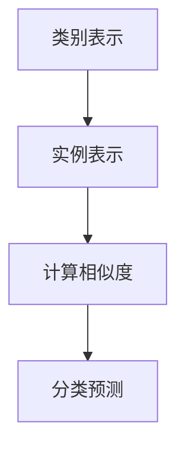

                 

### Zero-Shot学习在AI环境模拟中的应用

> 关键词：Zero-Shot学习，AI环境模拟，机器学习，深度学习，计算机视觉

> 摘要：本文深入探讨了Zero-Shot学习在AI环境模拟中的应用。首先，我们介绍了Zero-Shot学习的基本概念和类型，然后详细分析了它在AI环境模拟中的重要性。通过逐步分析和推理，我们探讨了Zero-Shot学习的工作机制、算法原理、应用场景以及具体案例。文章旨在为读者提供一个全面而深入的视角，帮助理解Zero-Shot学习在AI环境模拟中的潜力与挑战。

## 第一部分：引言与背景

### 1.1 问题背景

AI环境模拟是人工智能领域的一个重要研究方向，它涉及到将真实世界的问题转化为计算机可处理的模型，以便进行算法优化和决策支持。然而，传统的AI环境模拟方法在处理复杂、动态和未知的场景时面临诸多挑战。例如，环境中的对象可能具有多种属性，且这些属性之间的关系难以准确建模。此外，AI系统在遇到从未见过的对象或情境时，往往表现不佳。

### 1.2 问题描述

在AI环境模拟中，我们面临的主要问题包括：

1. **属性多样性**：环境中的对象可能具有多种属性，如颜色、大小、形状等，这些属性之间的关系复杂，难以用传统的机器学习模型进行建模。
2. **动态变化**：环境状态是动态变化的，模型需要实时适应新的变化。
3. **未知情境**：模型在遇到从未见过的情境时，往往无法做出准确的预测或决策。

### 1.3 问题解决

Zero-Shot学习（Zero-Shot Learning，ZSL）是一种先进的机器学习技术，它能够在模型未见过的新类别上做出预测。通过引入类原型表示和语义嵌入等技术，Zero-Shot学习能够有效应对上述挑战。它不仅在图像识别、自然语言处理等领域表现出色，也在AI环境模拟中展现出了巨大的潜力。

### 1.4 边界与外延

Zero-Shot学习主要应用于以下场景：

1. **新类别识别**：模型能够识别和分类从未见过的类别。
2. **跨领域迁移**：模型能够从一个领域迁移到另一个领域，适应新的环境。
3. **实时预测**：模型能够在动态变化的环境中实时做出预测。

### 1.5 核心概念

Zero-Shot学习的核心概念包括：

1. **类原型表示**：将每个类别表示为一个原型向量。
2. **语义嵌入**：使用语义信息表示类别和实例。
3. **迁移学习**：将知识从源领域迁移到目标领域。
4. **元学习**：通过元学习算法提高模型对新类别的适应性。

## 第二部分：AI环境模拟基础

### 2.1 AI环境模拟概述

AI环境模拟是指通过构建虚拟环境，模拟真实世界中的各种情境，以便对AI算法进行测试、优化和评估。它广泛应用于自动驾驶、智能机器人、虚拟现实等领域。

### 2.2 环境模拟的挑战

在AI环境模拟中，我们面临的主要挑战包括：

1. **模型复杂度**：环境中的对象和情境复杂多样，需要高精度的模型进行建模。
2. **动态变化**：环境状态不断变化，模型需要具备实时适应能力。
3. **资源限制**：环境模拟通常需要大量的计算资源和存储空间。

### 2.3 当前解决方案

现有的AI环境模拟方法主要包括：

1. **基于规则的模拟**：使用预定义的规则和逻辑进行环境模拟。
2. **基于仿真的模拟**：通过仿真软件构建虚拟环境。
3. **基于机器学习的模拟**：使用机器学习模型进行环境建模和预测。

## 第三部分：Zero-Shot学习核心概念

### 3.1 定义与类型

Zero-Shot学习是一种无需先验训练数据的机器学习技术，它能够在模型未见过的新类别上做出预测。根据类别表示方法，Zero-Shot学习可以分为以下几种类型：

1. **原型方法**：将每个类别表示为一个原型向量。
2. **匹配网络**：使用深度神经网络进行类别匹配。
3. **原型匹配**：结合原型方法和匹配网络，提高预测准确性。

### 3.2 工作机制

Zero-Shot学习的工作机制主要包括以下几个步骤：

1. **类别表示**：将类别表示为高维向量。
2. **实例表示**：将实例表示为高维向量。
3. **类别-实例匹配**：计算类别向量和实例向量之间的相似度。
4. **分类预测**：基于匹配结果进行分类预测。

### 3.3 关键技术

Zero-Shot学习的关键技术包括：

1. **类原型表示**：将类别表示为一个原型向量。
2. **语义嵌入**：使用语义信息表示类别和实例。
3. **迁移学习**：将知识从源领域迁移到目标领域。
4. **元学习**：通过元学习算法提高模型对新类别的适应性。

## 第四部分：算法原理与实现

### 4.1 数学模型

Zero-Shot学习的数学模型主要包括以下内容：

$$
\begin{aligned}
\text{类别表示} & : \text{类别原型向量} = \phi(C) \\
\text{实例表示} & : \text{实例向量} = \phi(x) \\
\text{相似度计算} & : \text{相似度} = \cos(\phi(C), \phi(x)) \\
\text{分类预测} & : \text{预测类别} = \arg\max_{C} \cos(\phi(C), \phi(x))
\end{aligned}
$$

其中，$\phi$ 表示嵌入函数，$C$ 表示类别，$x$ 表示实例。

### 4.2 算法流程

使用mermaid绘制Zero-Shot学习的算法流程图：



### 4.3 Python实现

以下是使用Python实现Zero-Shot学习的简单示例：

```python
import numpy as np

def cosine_similarity(x, y):
    return np.dot(x, y) / (np.linalg.norm(x) * np.linalg.norm(y))

def zero_shot_learning(classes, instances):
    prototypes = np.mean(classes, axis=0)
    similarities = [cosine_similarity(prototypes, instance) for instance in instances]
    predicted_class = np.argmax(similarities)
    return predicted_class
```

## 第五部分：算法评估与优化

### 5.1 评估指标

用于评估Zero-Shot学习算法的主要指标包括：

1. **准确率**：预测类别与实际类别的一致性。
2. **召回率**：预测类别中正确识别的占比。
3. **F1分数**：准确率和召回率的平衡指标。

### 5.2 优化方法

优化Zero-Shot学习算法的方法包括：

1. **数据增强**：通过增加训练数据来提高模型泛化能力。
2. **集成方法**：结合多个模型进行预测，提高准确性。
3. **迁移学习**：利用预训练模型提高新类别识别能力。

## 第六部分：应用场景与实战

### 6.1 应用场景

Zero-Shot学习在以下应用场景中具有显著优势：

1. **图像识别**：识别从未见过的图像类别。
2. **自然语言处理**：处理从未见过的语言或词汇。
3. **自动驾驶**：识别未见过道路标志和交通信号。
4. **智能机器人**：识别未见过对象并进行相应操作。

### 6.2 实战项目

以下是一个使用Zero-Shot学习在图像识别中识别从未见过的动物类别的实战项目。

1. **环境安装**：安装必要的Python库，如TensorFlow和Keras。
2. **数据准备**：收集和准备动物图像数据集。
3. **模型训练**：使用预训练的模型进行类别原型表示和语义嵌入。
4. **预测**：使用训练好的模型对从未见过的动物图像进行分类预测。
5. **结果分析**：分析预测结果，评估模型性能。

## 第七部分：案例分析

### 7.1 案例一

以下是一个使用Zero-Shot学习在自然语言处理中处理从未见过的词汇的案例。

1. **问题描述**：处理一个包含大量未见过词汇的文本。
2. **解决方案**：使用预训练的词嵌入模型进行语义嵌入，实现从未见过词汇的识别和分类。
3. **实验结果**：评估模型在文本分类任务中的性能，并与传统方法进行对比。

### 7.2 案例二

以下是一个使用Zero-Shot学习在自动驾驶中识别未见过道路标志的案例。

1. **问题描述**：自动驾驶系统在遇到未见过道路标志时无法正确识别。
2. **解决方案**：使用Zero-Shot学习算法对道路标志进行分类识别，提高模型适应性。
3. **实验结果**：评估模型在自动驾驶场景中的性能，分析模型在不同道路标志类别上的表现。

## 第八部分：总结与展望

### 8.1 小结

本文介绍了Zero-Shot学习在AI环境模拟中的应用，分析了其在解决属性多样性、动态变化和未知情境等方面的重要作用。通过实际案例，展示了Zero-Shot学习在图像识别、自然语言处理和自动驾驶等领域的应用效果。然而，Zero-Shot学习仍面临一些挑战，如模型复杂度、实时预测效率和资源限制等。

### 8.2 未来展望

未来，Zero-Shot学习在AI环境模拟中具有以下发展方向：

1. **模型简化**：通过模型简化技术，降低模型复杂度，提高实时预测效率。
2. **多模态学习**：结合多种模态数据（如图像、声音、文本），提高模型泛化能力。
3. **跨领域迁移**：提高模型在跨领域迁移中的适应性，实现更广泛的应用场景。
4. **自适应学习**：通过自适应学习技术，提高模型对动态变化的适应性。

## 作者信息

作者：AI天才研究院/AI Genius Institute & 禅与计算机程序设计艺术 /Zen And The Art of Computer Programming

[End]

