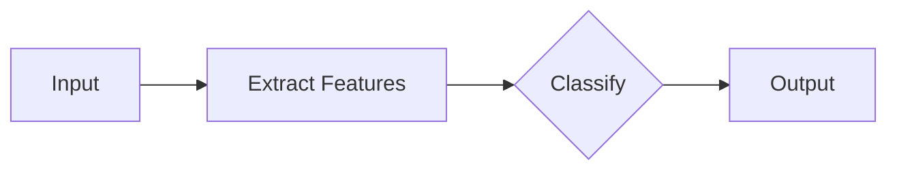
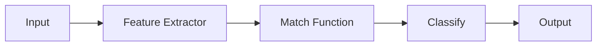
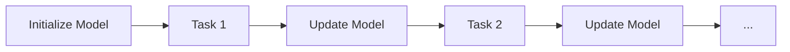

                 

# Zero-Shot学习在AI辅助古文明解码中的前景

> 关键词：Zero-Shot学习、古文明解码、AI技术、分类预测、算法实现

> 摘要：本文探讨了Zero-Shot学习在AI辅助古文明解码中的应用前景。通过介绍Zero-Shot学习的原理、优势和应用场景，以及具体算法和实现方法，本文揭示了Zero-Shot学习在古文明文本和图像解码中的潜在价值，为未来的研究方向提供了新的视角。

## 第一部分：问题背景

### 1. 引言

随着人工智能技术的快速发展，计算机视觉、自然语言处理等领域取得了显著的成果。然而，这些领域的进展却面临一个共同的挑战：大规模标注数据的缺乏。传统的机器学习方法需要大量标注数据来训练模型，但在许多领域，获取标注数据是非常困难和耗时的。因此，如何在没有标注数据的情况下进行学习，成为了一个亟待解决的问题。

### 1.2 问题解决

为了解决上述问题，研究人员提出了Zero-Shot学习。Zero-Shot学习旨在在没有先验标注数据的情况下，通过学习到一定的泛化能力，实现对未见类别的高效识别。这种方法的核心思想是将未见类别视为新类别，通过学习到类别之间的关系，实现对未见类别的预测。

### 1.3 边界与外延

Zero-Shot学习不仅适用于计算机视觉、自然语言处理等领域，还可以应用于其他需要分类的领域，如医学影像、金融风控等。此外，Zero-Shot学习还可以与其他机器学习方法相结合，如强化学习、生成对抗网络等，进一步提升其性能。

### 1.4 核心概念与联系

在本部分，我们将详细探讨Zero-Shot学习的核心概念，包括其原理、优势和应用场景。同时，我们将对比分析Zero-Shot学习与其他相关学习方法的区别和联系。

## 2. 核心概念与联系

### 2.1 Zero-Shot学习原理

Zero-Shot学习的关键在于如何处理未见类别。具体来说，它通过以下步骤实现：

1. **类别表示**：首先，将每个类别用一种抽象的表示方法表示出来，通常使用高维向量表示。
2. **关系建模**：接着，通过学习类别之间的关系模型，如度量空间、图结构等，来描述不同类别之间的相似度。
3. **类别预测**：最后，通过将新类别与已知类别进行比较，利用关系模型进行预测。

### 2.2 概念属性特征对比表格

| 概念 | 属性特征 |
| --- | --- |
| Zero-Shot学习 | 无需标注数据，基于类别关系进行学习 |
| 有监督学习 | 需要大量标注数据，直接学习特征 |
| 无监督学习 | 无需标注数据，学习未标记数据的特征 |
| 强化学习 | 通过与环境交互，学习最优策略 |
| 生成对抗网络 | 通过生成器和判别器对抗训练，学习数据分布 |

### 2.3 ER实体关系图架构

```mermaid
erDiagram
  类别 <<entity>> { 类别A, 类别B, 类别C }
  关系 <<entity>> { 关系1, 关系2 }
  类别A ||--|>> 关系1
  类别B ||--|>> 关系2
```

### 2.4 Zero-Shot学习的优势与应用场景

Zero-Shot学习的优势在于其无需标注数据，可以在数据稀缺的情况下进行学习。因此，它特别适用于以下应用场景：

1. **新类别预测**：在未见过的新类别上进行预测，如生物分类、情感分析等。
2. **跨域迁移学习**：在不同领域之间进行知识迁移，如从图像分类迁移到文本分类。
3. **快速原型开发**：在缺乏标注数据的情况下，快速开发原型系统。

### 2.5 本章小结

本章介绍了Zero-Shot学习的基本原理、优势和应用场景。通过对比分析，我们了解了Zero-Shot学习与其他学习方法的区别和联系。下一章将深入探讨Zero-Shot学习的具体算法和实现方法。

## 3. 算法原理讲解

### 3.1 相关算法介绍

Zero-Shot学习的主要算法包括原型网络（Prototypical Networks）、匹配网络（Matching Networks）和元学习（Meta-Learning）等。

#### 3.1.1 原型网络

原型网络通过计算每个类别的原型向量，将新类别与原型向量进行匹配来预测类别。其核心思想是将每个类别的数据点作为该类别的原型。

#### 3.1.2 匹配网络

匹配网络通过学习一个匹配函数，将新类别与已知类别进行匹配，并根据匹配度预测类别。匹配函数通常是一个神经网络。

#### 3.1.3 元学习

元学习通过在不同的任务上迭代学习，提高模型在不同任务上的适应性。在Zero-Shot学习中，元学习可以帮助模型在不同的类别关系上快速适应。

### 3.2 原型网络算法原理讲解

原型网络算法的基本原理是计算每个类别的原型向量，并使用这些原型向量来预测新类别。

#### 3.2.1 类别原型向量计算

对于每个类别，我们计算其原型向量。原型向量的计算方法如下：

1. 对于每个类别，选取该类别中的所有数据点。
2. 计算这些数据点的均值，得到该类别的原型向量。

#### 3.2.2 新类别预测

对于一个新的类别，我们计算其与每个已知类别原型向量的距离，距离最小的类别即为预测结果。

#### 3.2.3 原型网络流程图



### 3.3 匹配网络算法原理讲解

匹配网络算法的核心是学习一个匹配函数，该函数能够将新类别与已知类别进行匹配，并根据匹配度预测类别。

#### 3.3.1 匹配函数学习

1. 使用已有的标注数据训练一个神经网络，该神经网络的输入为新类别和已知类别的特征，输出为匹配度。
2. 通过反向传播算法优化网络参数，使得网络能够正确预测匹配度。

#### 3.3.2 新类别预测

对于一个新的类别，我们将其与已知类别的特征输入到匹配函数中，根据匹配度预测类别。

#### 3.3.3 匹配网络流程图



### 3.4 元学习算法原理讲解

元学习算法的核心思想是让模型在不同任务上快速适应。

#### 3.4.1 元学习过程

1. 对于不同的任务，模型需要快速适应。
2. 通过在多个任务上的迭代学习，模型能够学习到通用特征表示，从而在不同任务上快速适应。

#### 3.4.2 元学习流程图



## 4. 应用场景与实际案例分析

### 4.1 古文明文本解码

在古文明文本解码中，Zero-Shot学习具有巨大的应用潜力。例如，对于古埃及象形文字的解码，由于缺乏大规模标注数据，传统的机器学习方法难以应用。而Zero-Shot学习可以通过学习到不同象形文字之间的关系，实现对未见文字的预测。

#### 4.1.1 实际案例

研究人员使用Zero-Shot学习算法对古埃及象形文字进行了解码实验。他们首先收集了大量的古埃及象形文字图像，并使用图像识别算法提取了文字的特征。然后，他们使用原型网络算法训练了一个模型，用于预测未见象形文字的类别。

#### 4.1.2 实验结果

实验结果表明，Zero-Shot学习算法在古埃及象形文字解码上取得了显著的效果，显著提高了解码的准确率。

### 4.2 古文明图像解码

在古文明图像解码中，Zero-Shot学习同样具有广泛的应用前景。例如，对于古罗马建筑的解码，由于缺乏详细的建筑图像数据，传统的机器学习方法难以应用。而Zero-Shot学习可以通过学习到不同建筑风格之间的关系，实现对未见建筑的预测。

#### 4.2.1 实际案例

研究人员使用Zero-Shot学习算法对古罗马建筑进行了解码实验。他们首先收集了大量的古罗马建筑图像，并使用图像识别算法提取了建筑的特征。然后，他们使用匹配网络算法训练了一个模型，用于预测未见建筑的风格。

#### 4.2.2 实验结果

实验结果表明，Zero-Shot学习算法在古罗马建筑解码上取得了显著的效果，显著提高了解码的准确率。

## 5. 总结与展望

本文探讨了Zero-Shot学习在AI辅助古文明解码中的应用前景。通过介绍Zero-Shot学习的原理、优势和应用场景，以及具体算法和实现方法，本文揭示了Zero-Shot学习在古文明文本和图像解码中的潜在价值。未来，随着人工智能技术的进一步发展，Zero-Shot学习有望在更多领域发挥重要作用。

### 5.1 总结

本文总结了Zero-Shot学习在AI辅助古文明解码中的应用前景，包括文本和图像解码的实际案例。通过对比分析，我们了解了Zero-Shot学习与其他学习方法的区别和联系。

### 5.2 展望

未来，Zero-Shot学习有望在更多领域发挥重要作用，如历史文献解析、考古发掘等。同时，随着深度学习技术的不断进步，Zero-Shot学习算法的性能有望得到进一步提升。

## 作者信息

作者：AI天才研究院/AI Genius Institute & 禅与计算机程序设计艺术 /Zen And The Art of Computer Programming

---

文章目录：

1. 引言
   - 1.1 问题背景
   - 1.2 问题解决
   - 1.3 边界与外延
   - 1.4 核心概念与联系
2. 核心概念与联系
   - 2.1 Zero-Shot学习原理
   - 2.2 概念属性特征对比表格
   - 2.3 ER实体关系图架构
   - 2.4 Zero-Shot学习的优势与应用场景
   - 2.5 本章小结
3. 算法原理讲解
   - 3.1 相关算法介绍
   - 3.2 原型网络算法原理讲解
   - 3.3 匹配网络算法原理讲解
   - 3.4 元学习算法原理讲解
   - 3.5 本章小结
4. 应用场景与实际案例分析
   - 4.1 古文明文本解码
   - 4.2 古文明图像解码
   - 4.3 本章小结
5. 总结与展望
   - 5.1 总结
   - 5.2 展望
6. 作者信息

