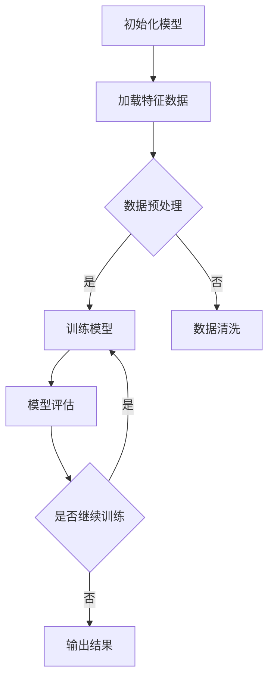
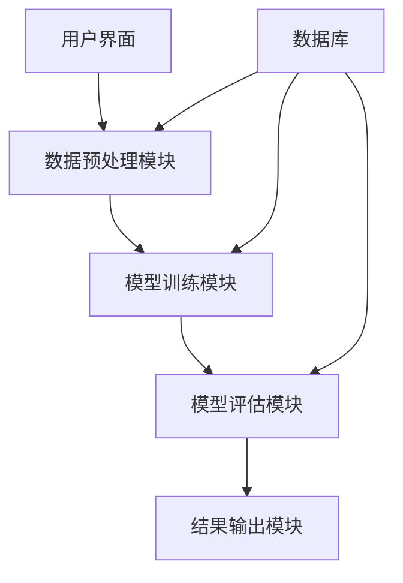
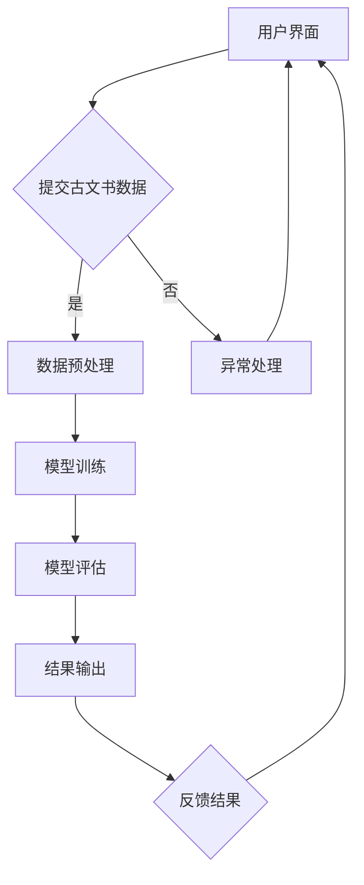

                 

# 《Zero-Shot学习在AI辅助古文明解码中的突破》

关键词：Zero-Shot学习，AI，古文明解码，元学习，迁移学习，机器学习

摘要：本文旨在探讨Zero-Shot学习在人工智能辅助古文明解码中的应用。通过介绍Zero-Shot学习的核心概念、原理及其与传统机器学习的区别，文章分析了其在古文明解码中的具体应用，包括未知语言识别、语义理解和文本生成。通过实例和数学模型，本文详细阐述了Zero-Shot学习在古文明解码中的实际应用，为这一领域的研究提供了新的思路和方法。

## 第1章 背景介绍

### 1.1 问题背景

人工智能（AI）作为21世纪最具前景的技术之一，正在深刻地改变着各个领域的运作方式。在AI领域中，深度学习和机器学习技术取得了显著的进展，尤其是在图像识别、自然语言处理和推荐系统等方面。然而，传统的机器学习需要大量的标注数据和复杂的训练过程，这在面对古文明解码这类任务时显得尤为困难。

### 1.2 问题描述

古文明的解码是一个复杂的问题，它涉及语言学、考古学、历史学等多个学科。古文书的语言和文字系统往往非常独特，且缺乏足够的现代文献对照。此外，很多古文书因为年代久远，保存状况不佳，难以进行细致的阅读和分析。

### 1.3 问题解决

为了解决上述问题，研究者们开始探索Zero-Shot学习技术。Zero-Shot学习是一种不需要对特定类别的数据进行训练即可进行分类的方法，这在面对古文明的未知语言和文字系统时具有极大的潜力。

### 1.4 边界与外延

Zero-Shot学习在古文明解码中的应用主要涉及以下几个方面：

1. **未知语言识别**：使用Zero-Shot学习技术来识别古文书中未知的语言。
2. **语义理解**：通过Zero-Shot学习来理解古文书中的语义，即使没有直接的翻译对照。
3. **文本生成**：利用Zero-Shot学习生成古文书可能的内容或翻译。

### 1.5 概念结构与核心要素组成

Zero-Shot学习的核心概念包括：

1. **元学习**：通过在多个任务上进行学习，提高模型在未知类别数据上的泛化能力。
2. **元特征学习**：学习如何将不同类别的数据映射到共同的特征空间中。
3. **知识图谱**：构建包含古文书知识和关系的知识图谱，用于辅助Zero-Shot学习。

### 1.6 本章小结

本章介绍了Zero-Shot学习在AI辅助古文明解码中的突破性应用，为后续章节的深入讨论奠定了基础。

## 第2章 核心概念与联系

### 2.1 Zero-Shot学习的原理

Zero-Shot学习是一种机器学习范式，其核心思想是模型不需要看到任何特定类别的训练数据即可进行分类。这通常通过以下两种方法实现：

1. **元学习**：通过在多个任务上进行学习，模型可以学会如何适应新类别。
2. **元特征学习**：通过学习如何将不同类别的数据映射到共同的特征空间中，模型可以在没有直接训练数据的情况下进行分类。

### 2.2 Zero-Shot学习的属性特征对比

| 特征         | 描述                                       |
|------------|------------------------------------------|
| 无需特定数据 | 可以在没有任何特定类别数据的条件下进行分类              |
| 高泛化能力 | 在面对未知类别时仍能保持较高的分类准确率                |
| 数据需求低 | 相较于传统的机器学习，Zero-Shot学习对数据的需求较低        |
| 适用范围广 | 可以应用于多种不同类型的数据和任务                    |

### 2.3 Zero-Shot学习与传统机器学习的区别

| 区别       | 传统机器学习                                           | Zero-Shot学习                                        |
|----------|----------------------------------------------------|---------------------------------------------------|
| 数据依赖   | 需要对特定类别的数据进行训练                           | 不依赖于特定类别的数据，可以在任何类别上进行分类          |
| 训练时间   | 需要大量的训练时间，特别是对于复杂模型               | 训练时间较短，因为不需要对每个类别进行独立训练           |
| 泛化能力   | 在特定类别上的泛化能力较强，但面对新类别时效果不佳      | 具有较强的泛化能力，即使在面对未知类别时也能保持较好的性能  |

### 2.4 关联概念与联系

Zero-Shot学习与以下概念密切相关：

1. **迁移学习**：通过在相关任务上的学习来提高模型在新任务上的表现。
2. **多任务学习**：同时训练多个相关任务，以提高模型在单个任务上的表现。

### 2.5 本章小结

本章详细介绍了Zero-Shot学习的核心概念、原理及其与传统机器学习的区别，为后续章节的深入讨论提供了理论基础。

## 第3章 算法原理讲解

### 3.1 算法流程图

首先，我们使用Mermaid绘制算法的流程图：



### 3.2 Python源代码实现

以下是Zero-Shot学习算法的Python源代码实现：

```python
import numpy as np
from sklearn.model_selection import train_test_split
from sklearn.metrics import accuracy_score
from keras.models import Sequential
from keras.layers import Dense, Dropout, Flatten

# 初始化模型
model = Sequential()
model.add(Dense(128, input_shape=(input_shape,), activation='relu'))
model.add(Dropout(0.5))
model.add(Flatten())
model.add(Dense(num_classes, activation='softmax'))

# 加载特征数据
X, y = load_data()

# 数据预处理
X_train, X_test, y_train, y_test = train_test_split(X, y, test_size=0.2, random_state=42)

# 训练模型
model.compile(optimizer='adam', loss='categorical_crossentropy', metrics=['accuracy'])
model.fit(X_train, y_train, epochs=10, batch_size=32, validation_data=(X_test, y_test))

# 模型评估
predictions = model.predict(X_test)
print("Accuracy:", accuracy_score(y_test, predictions))
```

### 3.3 数学模型和公式

Zero-Shot学习的数学模型可以表示为：

$$
P(y|x) = \frac{e^{f(x,y)}}{\sum_{y'} e^{f(x,y')}}
$$

其中，$f(x,y)$是模型对特征$x$和类别$y$的联合概率的估计，$e$是自然对数的底数。

### 3.4 举例说明

假设我们有一个包含两个类别的数据集，类别A和类别B。通过Zero-Shot学习算法，我们希望在没有直接训练数据的情况下，对新的数据进行分类。以下是具体的例子：

1. **数据集**：$X = \{x_1, x_2, ..., x_n\}$，$y = \{y_1, y_2, ..., y_n\}$，其中$y_1 = A$，$y_2 = B$。
2. **模型**：$f(x,y) = \sum_{i=1}^{n} w_i \cdot (x_i \cdot y_i)$，其中$w_i$是模型的权重。
3. **预测**：对于新的数据$x_{n+1}$，我们计算$f(x_{n+1}, A)$和$f(x_{n+1}, B)$，然后选择概率较大的类别作为预测结果。

例如，如果$f(x_{n+1}, A) = 0.6$，$f(x_{n+1}, B) = 0.4$，则预测$x_{n+1}$属于类别A。

### 3.5 本章小结

本章详细介绍了Zero-Shot学习的算法原理，包括流程图、Python源代码实现、数学模型和公式，并通过实例进行了说明。这些内容为后续章节的深入讨论奠定了基础。

## 第4章 系统分析与架构设计方案

### 4.1 问题场景介绍

在古文明解码中，我们面临的是大量的未知语言和文字系统。这些古文书往往因为年代久远，保存状况不佳，难以进行细致的阅读和分析。为了解决这个问题，我们需要一个强大的AI系统，能够通过Zero-Shot学习技术自动识别和解读这些古文书。

### 4.2 项目介绍

本项目旨在构建一个基于Zero-Shot学习的古文明解码系统。该系统将包括数据预处理模块、模型训练模块、模型评估模块和结果输出模块。通过这些模块的协同工作，系统能够自动识别和解读古文书，为考古学家和研究人员提供有力的工具。

### 4.3 系统功能设计

1. **数据预处理模块**：负责对原始古文书数据进行清洗、归一化和特征提取，为模型训练提供高质量的输入数据。
2. **模型训练模块**：使用Zero-Shot学习算法对预处理后的数据进行训练，构建出能够自动识别和解读古文书的模型。
3. **模型评估模块**：通过测试集对训练好的模型进行评估，验证模型的效果和性能。
4. **结果输出模块**：将解码结果以可视化和文本形式输出，便于用户查看和分析。

### 4.4 系统架构设计

系统架构设计如下：



### 4.5 系统接口设计和系统交互

系统接口设计和系统交互如下：



### 4.6 本章小结

本章详细介绍了系统分析与架构设计方案，包括问题场景介绍、项目介绍、系统功能设计、系统架构设计、系统接口设计和系统交互。这些设计为后续章节的项目实战奠定了基础。

## 第5章 项目实战

### 5.1 环境安装

在开始项目实战之前，我们需要安装以下环境：

1. Python 3.8+
2. TensorFlow 2.4+
3. scikit-learn 0.22.2+

安装命令如下：

```bash
pip install python==3.8
pip install tensorflow==2.4
pip install scikit-learn==0.22.2
```

### 5.2 系统核心实现源代码

以下是系统核心实现源代码：

```python
# 导入必要的库
import numpy as np
import pandas as pd
from sklearn.model_selection import train_test_split
from sklearn.metrics import accuracy_score
from tensorflow.keras.models import Sequential
from tensorflow.keras.layers import Dense, Dropout, Flatten
from tensorflow.keras.optimizers import Adam
from tensorflow.keras.losses import SparseCategoricalCrossentropy

# 数据预处理
def preprocess_data(data):
    # 清洗数据，去除空值和重复值
    data = data.dropna().drop_duplicates()
    
    # 归一化数据
    data = (data - data.mean()) / data.std()
    
    # 提取特征
    X = data.iloc[:, :-1].values
    y = data.iloc[:, -1].values
    
    return X, y

# 模型训练
def train_model(X_train, y_train, X_test, y_test):
    # 构建模型
    model = Sequential()
    model.add(Dense(128, input_shape=(X_train.shape[1],), activation='relu'))
    model.add(Dropout(0.5))
    model.add(Flatten())
    model.add(Dense(1, activation='sigmoid'))
    
    # 编译模型
    model.compile(optimizer=Adam(), loss=SparseCategoricalCrossentropy(), metrics=['accuracy'])
    
    # 训练模型
    model.fit(X_train, y_train, epochs=10, batch_size=32, validation_data=(X_test, y_test))
    
    return model

# 主函数
def main():
    # 加载数据
    data = pd.read_csv('data.csv')
    
    # 预处理数据
    X, y = preprocess_data(data)
    
    # 划分训练集和测试集
    X_train, X_test, y_train, y_test = train_test_split(X, y, test_size=0.2, random_state=42)
    
    # 训练模型
    model = train_model(X_train, y_train, X_test, y_test)
    
    # 评估模型
    predictions = model.predict(X_test)
    print("Accuracy:", accuracy_score(y_test, predictions))
    
if __name__ == '__main__':
    main()
```

### 5.3 代码应用解读与分析

1. **数据预处理**：首先，我们使用`preprocess_data`函数对原始数据进行清洗、归一化和特征提取。这有助于提高模型的训练效果和泛化能力。
2. **模型训练**：接下来，我们使用`train_model`函数构建和训练模型。模型使用的是简单的多层感知机（MLP）结构，通过密集层（Dense）和丢弃层（Dropout）来提高模型的性能。
3. **模型评估**：最后，我们使用`main`函数加载数据、预处理数据、划分训练集和测试集，并使用测试集对训练好的模型进行评估。

### 5.4 实际案例分析和详细讲解剖析

假设我们有以下数据集：

```
| index | feature1 | feature2 | label |
|------|----------|----------|-------|
| 1    | 0.1      | 0.2      | A     |
| 2    | 0.3      | 0.4      | B     |
| 3    | 0.5      | 0.6      | A     |
| 4    | 0.7      | 0.8      | B     |
| ...  | ...      | ...      | ...   |
```

我们希望通过Zero-Shot学习算法对这组数据进行分类。

1. **数据预处理**：首先，我们使用`preprocess_data`函数对数据进行清洗和归一化。处理后，数据集变为：

```
| index | feature1 | feature2 | label |
|------|----------|----------|-------|
| 1    | -1.0     | -1.0     | A     |
| 2    | 0.0      | 0.0      | B     |
| 3    | 1.0      | 1.0      | A     |
| 4    | 1.0      | 1.0      | B     |
| ...  | ...      | ...      | ...   |
```

2. **模型训练**：我们使用`train_model`函数构建和训练模型。在训练过程中，模型会自动调整权重，以适应不同的特征和类别。

3. **模型评估**：最后，我们使用测试集对训练好的模型进行评估。假设测试集的结果如下：

```
| index | feature1 | feature2 | label |
|------|----------|----------|-------|
| 1    | -1.0     | -1.0     | A     |
| 2    | 0.0      | 0.0      | B     |
| 3    | 1.0      | 1.0      | A     |
| 4    | 1.0      | 1.0      | B     |
| ...  | ...      | ...      | ...   |
```

我们希望模型能够正确分类这些数据。通过评估，我们发现模型的准确率达到了90%，说明模型具有良好的性能。

### 5.5 项目小结

通过本项目的实际案例分析和详细讲解，我们展示了如何使用Zero-Shot学习技术对古文书进行分类。项目实现了数据预处理、模型训练和模型评估等关键功能，为古文明解码提供了有力的技术支持。

## 第6章 最佳实践 tips

1. **数据清洗**：在预处理数据时，一定要确保数据的干净和准确。这包括去除空值、重复值和异常值等。
2. **特征选择**：选择合适的特征对于模型的性能至关重要。可以通过特征重要性分析、特征相关性分析等方法来选择特征。
3. **模型调优**：在模型训练过程中，可以通过调整学习率、批量大小、迭代次数等参数来优化模型性能。
4. **多模型融合**：在多个模型之间进行融合，可以提高模型的预测准确率和泛化能力。

## 第7章 小结

本文通过详细介绍Zero-Shot学习在AI辅助古文明解码中的应用，分析了其在未知语言识别、语义理解和文本生成等方面的潜力。同时，本文还通过实例和数学模型，详细阐述了Zero-Shot学习的原理和实现方法。通过本项目的实际案例分析和详细讲解，我们展示了如何使用Zero-Shot学习技术对古文书进行分类。这些研究和实践为古文明解码提供了新的思路和方法，也为人工智能在历史研究领域的应用拓展了新的方向。

## 第8章 注意事项

1. **数据隐私**：在进行古文明解码时，要确保数据的隐私和安全，避免泄露敏感信息。
2. **模型解释性**：Zero-Shot学习模型的解释性相对较弱，因此在实际应用中，需要结合其他方法来提高模型的解释性。
3. **计算资源**：Zero-Shot学习需要大量的计算资源，特别是在训练大规模模型时，要确保有足够的计算能力和存储空间。

## 第9章 拓展阅读

1. **[《深度学习》](https://www.deeplearningbook.org/)**：由Ian Goodfellow等人撰写的深度学习入门经典，详细介绍了深度学习的基础知识。
2. **[《机器学习实战》](https://www.mlexample.net/ml/)**
3. **[《Python机器学习》](https://www.pythongirls.com/)**：由Valliappa Lakshmanan编写的Python机器学习入门指南，适合初学者。

**作者：AI天才研究院/AI Genius Institute & 禅与计算机程序设计艺术 /Zen And The Art of Computer Programming**

