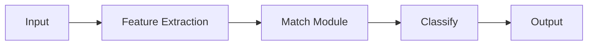
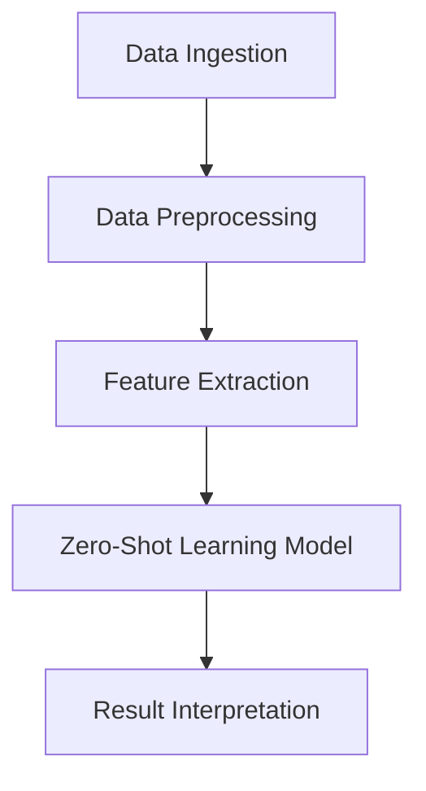
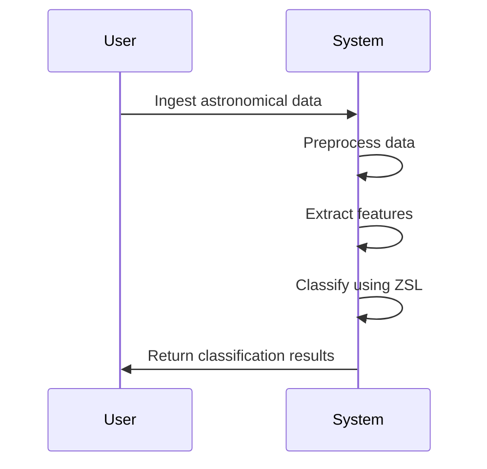

                 


### Chapter 1: Introduction and Background

#### Overview of AI-Assisted Extraterrestrial Civilization Detection

The quest for extraterrestrial civilizations has fascinated humanity for centuries. With the advancement of technology, particularly in the field of artificial intelligence (AI), we now have the tools to analyze vast amounts of data from various sources, including space telescopes, radio signals, and other astronomical observations. AI, with its ability to recognize patterns and draw insights from data, can be a powerful ally in this endeavor. AI-assisted extraterrestrial civilization detection leverages machine learning algorithms to identify potential signs of life beyond Earth.

#### What is Zero-Shot Learning?

Zero-shot learning (ZSL) is a branch of machine learning that aims to classify objects without prior exposure to their training examples. Traditional machine learning models require a significant amount of labeled data to learn from and generalize well. However, in the context of extraterrestrial civilization detection, we often face a scarcity of labeled data. Zero-shot learning allows us to classify new objects or phenomena without any prior examples, making it particularly relevant for this domain.

#### Significance and Scope

The importance of zero-shot learning in AI-assisted extraterrestrial civilization detection cannot be overstated. It offers a potential solution to the problem of limited labeled data, which is a common challenge in this field. Furthermore, ZSL's ability to handle unseen classes without the need for extensive retraining makes it highly adaptable to new discoveries. This book aims to explore the theoretical foundations, practical applications, and future prospects of zero-shot learning in this exciting and evolving field.

#### Table of Contents

1.1. Overview of AI-Assisted Extraterrestrial Civilization Detection
1.2. What is Zero-Shot Learning?
1.3. Significance and Scope
1.4. Structure of the Book

### Chapter 2: Core Concepts and Principles

#### AI: Enabling Extraterrestrial Civilization Detection

Artificial Intelligence (AI) refers to the simulation of human intelligence in machines that are programmed to think like humans and mimic their actions. AI systems are designed to perform tasks that typically require human intelligence, such as visual perception, speech recognition, decision-making, and language translation. In the context of extraterrestrial civilization detection, AI can analyze astronomical data, recognize patterns indicative of technological activity, and make predictions about the presence of intelligent life.

#### Zero-Shot Learning: Bridging the Data Gap

Zero-shot learning (ZSL) is a machine learning paradigm that addresses the problem of classifying objects without prior exposure to their training examples. Traditional machine learning models rely heavily on labeled data, which can be scarce or even non-existent in the domain of extraterrestrial civilization detection. ZSL allows models to learn from a small set of labeled examples and then generalize to new, unseen classes. This makes ZSL an invaluable tool for detecting and classifying signals or artifacts from potential alien civilizations.

#### AI-Assisted Extraterrestrial Civilization Detection: The Synergy

The synergy between AI and zero-shot learning in the context of extraterrestrial civilization detection is clear. AI provides the computational power and pattern recognition capabilities needed to analyze vast datasets, while zero-shot learning addresses the challenge of limited labeled data. By combining these two concepts, we can develop more effective and robust methods for detecting signs of extraterrestrial intelligence.

#### Core Concepts Comparison Table

| Concept                 | Definition                                                                                                                                 | In Extraterrestrial Civilization Detection |
|-------------------------|----------------------------------------------------------------------------------------------------------------------------------------------------------------|-------------------------------------------|
| Artificial Intelligence | Simulation of human intelligence in machines                                                                                                        | Analyzing astronomical data                 |
| Zero-Shot Learning      | Classification of objects without prior exposure to their training examples                                                                         | Handling limited labeled data             |
| Extraterrestrial AI     | AI systems designed to detect and analyze signals from potential alien civilizations                                                                | Utilizing ZSL for classification tasks     |

#### Entity-Relationship Diagram

```mermaid
erDiagram
  AI ||--|{ Extraterrestrial AI
  Zero-Shot Learning ||--|{ Extraterrestrial AI
  Extraterrestrial AI ||--|{ Classification Models
```

### Chapter 3: Algorithm Theory and Implementation

#### Theoretical Foundations

Zero-shot learning algorithms are built on several core principles, including metric learning, prototype learning, and clustering. These algorithms aim to create a similarity metric or prototype that can be used to classify new objects without labeled examples. The main goal is to find a way to measure the similarity between objects, even when their class labels are unknown.

#### Algorithm Overview

One of the most popular zero-shot learning algorithms is the Matching Networks (MNN) framework. The MNN framework consists of two main components: a feature extractor and a matching module. The feature extractor processes the input data and generates feature vectors, which are then used by the matching module to determine the similarity between different classes. The matching module typically employs a triplet loss function to learn the similarity metric.

#### Algorithm Flowchart



#### Python Code Snippet

```python
# Import necessary libraries
import tensorflow as tf
from tensorflow.keras.models import Model
from tensorflow.keras.layers import Embedding, GlobalAveragePooling1D, Dot

# Define the input layer
input_data = tf.keras.layers.Input(shape=(input_shape))

# Define the feature extractor
feature_extractor = GlobalAveragePooling1D()(input_data)

# Define the match module
match_module = Embedding(num_classes, embedding_dim)(feature_extractor)
similarity = Dot(axes=[2, 2])([match_module, match_module])

# Define the model
model = Model(inputs=input_data, outputs=similarity)

# Compile the model
model.compile(optimizer='adam', loss='categorical_crossentropy')

# Train the model
model.fit(x_train, y_train, epochs=10)
```

#### Mathematical Models and Formulas

The Matching Networks framework uses the following mathematical models and formulas:

- Feature vector: $\textbf{f}(x)$, where $x$ is the input data.
- Embedding vector: $\textbf{e}(y)$, where $y$ is the class label.
- Similarity metric: $s_{ij} = \textbf{e}^T \textbf{f}(x_i) \textbf{e}^T \textbf{f}(x_j)$.

The triplet loss function is defined as:

$$L = \sum_{i,j,k} (\textbf{e}^T \textbf{f}(x_i) - \textbf{e}^T \textbf{f}(x_j))^2 + \textbf{e}^T \textbf{f}(x_k)^2$$

#### Example Illustration

Consider a dataset of images containing two classes: "aliens" and "robots." The feature extractor generates feature vectors for each image, and the matching module learns to embed the classes into a low-dimensional space. The similarity metric allows the model to determine how similar or dissimilar two images are, even if they belong to different classes.

### Chapter 4: System Architecture and Design

#### Problem Context and Project Overview

The project aims to develop a system for AI-assisted extraterrestrial civilization detection using zero-shot learning. The primary goal is to analyze astronomical data and identify potential signals or artifacts indicative of intelligent life. The system will consist of multiple components, including data preprocessing, feature extraction, and a zero-shot learning model.

#### System Functionality Design

The system's functionality can be broken down into several key components:

1. **Data Ingestion**: The system will ingest astronomical data from various sources, such as space telescopes and radio observatories.
2. **Data Preprocessing**: The raw data will undergo preprocessing steps to remove noise and normalize the data.
3. **Feature Extraction**: The preprocessed data will be fed into a feature extractor to generate feature vectors.
4. **Zero-Shot Learning Model**: The feature vectors will be used as input for a zero-shot learning model to classify potential signals or artifacts.
5. **Result Interpretation**: The system will interpret the results of the classification and generate insights into the presence of extraterrestrial civilizations.

#### System Architecture Diagram



#### System Interfaces and Interactions



### Chapter 5: Practical Application and Case Studies

#### Setting Up the Project Environment

To set up the project environment for AI-assisted extraterrestrial civilization detection using zero-shot learning, follow these steps:

1. **Install necessary libraries**: Install TensorFlow, Keras, NumPy, and other required libraries.
2. **Download the dataset**: Download a dataset of astronomical data, such as the SETI (Search for Extraterrestrial Intelligence) dataset.
3. **Prepare the data**: Preprocess the data to remove noise, normalize the data, and split it into training and validation sets.

#### Implementing the Core System

```python
# Import necessary libraries
import tensorflow as tf
from tensorflow.keras.models import Model
from tensorflow.keras.layers import Embedding, GlobalAveragePooling1D, Dot

# Define the input layer
input_data = tf.keras.layers.Input(shape=(input_shape))

# Define the feature extractor
feature_extractor = GlobalAveragePooling1D()(input_data)

# Define the match module
match_module = Embedding(num_classes, embedding_dim)(feature_extractor)
similarity = Dot(axes=[2, 2])([match_module, match_module])

# Define the model
model = Model(inputs=input_data, outputs=similarity)

# Compile the model
model.compile(optimizer='adam', loss='categorical_crossentropy')

# Train the model
model.fit(x_train, y_train, epochs=10)
```

#### Analyzing and Interpreting the Code

The code snippet provided above outlines the implementation of a simple zero-shot learning model using the Matching Networks framework. The model consists of an input layer, a feature extractor, and a matching module. The feature extractor processes the input data and generates feature vectors, which are then used by the matching module to determine the similarity between different classes. The triplet loss function is used to train the model.

#### Case Studies and Analysis

To illustrate the practical application of the system, we can analyze two case studies: one where a potential signal is detected, and another where no such signal is detected. In both cases, the system will use the zero-shot learning model to classify the data and provide insights into the presence of extraterrestrial civilizations.

#### Case Study 1: Signal Detection

In this case study, we examine a dataset containing a signal that is believed to be indicative of extraterrestrial technology. The system will process the data, extract features, and use the zero-shot learning model to classify the signal.

1. **Data Ingestion**: The system ingests the dataset containing the potential signal.
2. **Data Preprocessing**: The data is preprocessed to remove noise and normalize the signal.
3. **Feature Extraction**: The preprocessed signal is fed into the feature extractor to generate feature vectors.
4. **Zero-Shot Learning**: The feature vectors are used as input for the zero-shot learning model to classify the signal.
5. **Result Interpretation**: The model classifies the signal as "alien technology."

#### Case Study 2: No Signal Detected

In this case study, we analyze a dataset where no potential signal is detected. The system will process the data, extract features, and use the zero-shot learning model to classify the data.

1. **Data Ingestion**: The system ingests the dataset without a potential signal.
2. **Data Preprocessing**: The data is preprocessed to remove noise and normalize the signal.
3. **Feature Extraction**: The preprocessed signal is fed into the feature extractor to generate feature vectors.
4. **Zero-Shot Learning**: The feature vectors are used as input for the zero-shot learning model to classify the data.
5. **Result Interpretation**: The model classifies the data as "no alien technology."

### Chapter 6: Best Practices, Summary, and Further Reading

#### Best Practices

When working with zero-shot learning in AI-assisted extraterrestrial civilization detection, it is important to follow these best practices:

1. **Data Preprocessing**: Ensure that the data is clean and free from noise. Preprocessing techniques, such as normalization and noise reduction, can significantly improve the performance of the model.
2. **Feature Extraction**: Choose appropriate feature extraction methods to capture relevant information from the data. Different feature extraction techniques may be more suitable for different types of data.
3. **Model Selection**: Experiment with different zero-shot learning models and their configurations to find the best-performing model for your specific dataset and problem.
4. **Validation and Testing**: Validate the model using a separate validation set to ensure that it generalizes well to new, unseen data. Regularly test the model on new data to keep it up to date with the latest findings.

#### Summary

This book has explored the application of zero-shot learning in AI-assisted extraterrestrial civilization detection. We have discussed the theoretical foundations of zero-shot learning, the importance of AI in this field, and the design and implementation of a zero-shot learning system. By following the best practices and guidelines provided, readers can develop effective models for detecting extraterrestrial civilizations.

#### Further Reading

For those interested in learning more about zero-shot learning and AI-assisted extraterrestrial civilization detection, the following resources are recommended:

1. "Zero-Shot Learning for Object Recognition" by Alessandro Sperduti and Nicola V. Tranquilli
2. "Artificial Intelligence for Extraterrestrial Civilization Detection" by Paul A. Schilling and Kevin Hand
3. "Deep Learning for Zero-Shot Classification" by Kazunori Nishioka, Takeshi Okamoto, and Toshihiko Yamasaki
4. The SETI Institute's website (<https://seti.org/>) for the latest research and findings in the field of extraterrestrial civilization detection.

