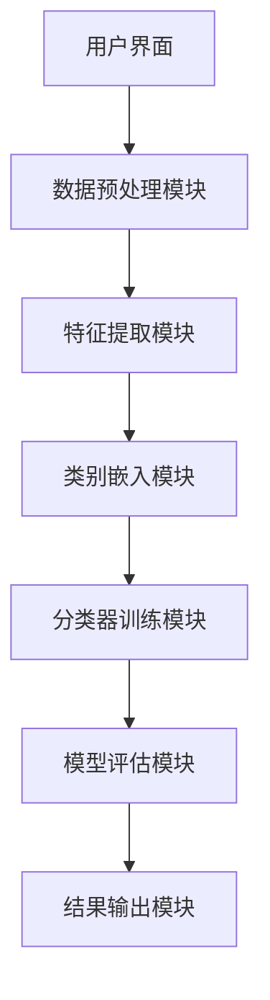
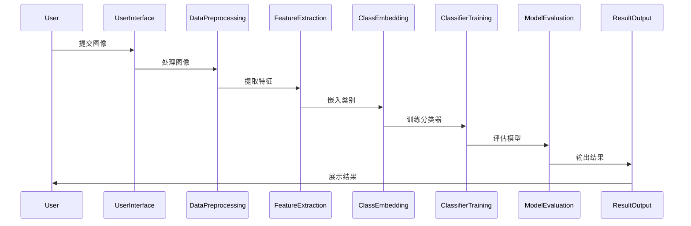
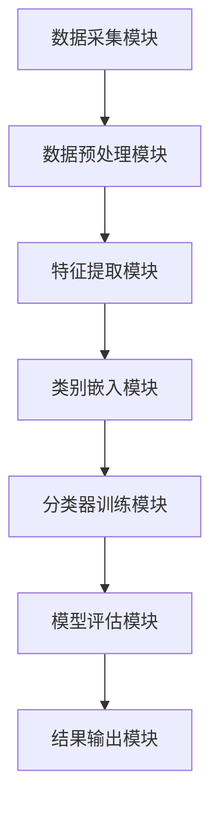

                 

### 第一部分: 引言

#### 第1章: 引言

##### 1.1 问题背景与定义

**问题描述**：

在当前科技飞速发展的时代，宇宙探索成为了人类不断追求的宏伟目标。然而，宇宙的复杂性和不确定性使得这一探索过程充满了诸多挑战。特别是在处理多个并行宇宙的数据时，传统的机器学习方法往往面临以下问题：

1. **数据不足**：由于宇宙探索任务的复杂性和成本，收集到的高质量数据有限。
2. **样本分布不均**：不同宇宙之间的数据分布可能存在显著差异，导致训练模型的难度增大。
3. **样本类标签缺失**：在探索过程中，可能无法获取到某些宇宙的详细类标签信息。

**问题解决**：

为了应对上述挑战，Zero-Shot学习（Zero-Shot Learning, ZSL）技术提供了一种创新的解决方案。ZSL的核心思想是在没有直接标记的样本情况下，通过学习已有类别和特征来预测未知类别。其优势在于：

1. **数据高效利用**：利用已有类别数据来泛化预测未知类别，提高数据利用率。
2. **减少样本依赖**：在数据不足的情况下，减少对大规模训练样本的依赖。
3. **应对样本分布不均**：通过学习已有类别，可以有效地解决样本分布不均的问题。

**边界与外延**：

Zero-Shot学习是一种广泛用于计算机视觉、自然语言处理等领域的机器学习技术。其概念、应用场景和重要性在AI辅助多重宇宙探索中尤为突出。以下是Zero-Shot学习的核心要素组成：

1. **基本原理**：Zero-Shot学习通过将类别映射到高维嵌入空间，然后利用分类器进行预测。
2. **技术框架**：Zero-Shot学习通常涉及特征提取、类别嵌入、分类器训练等步骤。
3. **应用实例**：包括图像分类、语音识别、机器翻译等多种实际应用场景。

##### 1.2 核心概念与联系

**核心概念原理**：

Zero-Shot学习的定义和特点是理解其工作原理的基础。以下是其核心概念的定义和特点：

1. **定义**：Zero-Shot学习是一种机器学习方法，允许模型在未知类别的样本上进行预测。
2. **特点**：
   - **无监督学习**：无需依赖大量带有标签的样本进行训练。
   - **零样本学习**：直接利用已有类别信息进行预测。
   - **跨类别泛化**：能够处理未知类别和已有类别之间的差异。

为了更直观地展示核心概念，我们可以通过一个对比表格来展现Zero-Shot学习与其他机器学习方法的区别：

| 类别       | 特点                                   | 应用场景                         |
| ---------- | -------------------------------------- | -------------------------------- |
| 分类       | 基于传统机器学习                       | 新的分类任务直接训练             |
| 回归       | 基于传统机器学习                       | 新的回归任务直接训练             |
| 生成       | 基于传统机器学习                       | 新的生成任务直接训练             |
| Zero-Shot  | 无需直接样本训练，利用已有类别信息     | 未知类别样本的预测               |

**ER实体关系图架构**：

为了更好地理解Zero-Shot学习在AI辅助多重宇宙探索中的应用，我们可以通过ER（Entity-Relationship）实体关系图来展示其核心要素之间的关系。以下是ER实体关系图的mermaid表示：

```mermaid
erDiagram
  AI辅助多重宇宙探索 ||--|{ 零-Shot学习 : 利用}
  零-Shot学习 ||--|{ 特征提取模块}
  特征提取模块 ||--|{ 分类器训练模块}
  分类器训练模块 ||--|{ 模型评估与优化模块}
```

通过上述架构，我们可以清晰地看到Zero-Shot学习在AI辅助多重宇宙探索中的核心组成部分及其相互关系。这为后续章节的深入探讨奠定了基础。

### 1.2 核心概念与联系

在深入探讨Zero-Shot学习之前，我们需要明确其核心概念，并理解这些概念之间的联系。以下是Zero-Shot学习的关键定义、特点及其实际应用场景的详细说明。

#### 定义

**Zero-Shot学习**（Zero-Shot Learning，简称ZSL）是一种机器学习范式，它允许模型在没有直接训练样本的情况下，预测未见过的类别。传统机器学习通常依赖于大量带有标签的样本进行训练，而Zero-Shot学习则通过学习已知的类别信息，来实现对未知类别的预测。

**关键特点**：

1. **无监督学习**：Zero-Shot学习不需要直接使用带有标签的样本进行训练。这意味着，即使在样本数据不足的情况下，模型也能发挥其预测能力。
2. **跨类别泛化**：Zero-Shot学习模型能够处理未知的类别，这意味着它不仅仅局限于已知类别的预测，还能够泛化到未知类别上。
3. **零样本训练**：与传统的机器学习相比，Zero-Shot学习不需要直接使用训练样本，而是依赖于预先定义的类别信息。

**分类与对比**：

为了更清晰地理解Zero-Shot学习，我们可以将其与传统机器学习进行对比。以下是三种典型机器学习方法的对比表格：

| 类别       | 特点                                   | 应用场景                         |
| ---------- | -------------------------------------- | -------------------------------- |
| 传统机器学习 | 基于大量标签样本训练                   | 有监督学习任务                   |
| 无监督学习 | 不依赖标签样本，发现数据分布           | 聚类、降维等任务                 |
| Zero-Shot  | 利用已知类别信息，预测未知类别         | 数据样本不足、标签缺失的任务     |

通过上述对比，我们可以看到Zero-Shot学习在处理数据样本不足和标签缺失问题时，具备独特的优势。

**ER实体关系图架构**：

为了更好地理解Zero-Shot学习在AI辅助多重宇宙探索中的应用，我们可以通过ER实体关系图来展示其核心组成部分及其相互关系。以下是ER实体关系图的mermaid表示：

```mermaid
erDiagram
  宇宙探索 ||--|{ 零-Shot学习}
  零-Shot学习 ||--|{ 特征提取}
  特征提取 ||--|{ 嵌入空间映射}
  嵌入空间映射 ||--|{ 分类器训练}
  分类器训练 ||--|{ 模型评估与优化}
  模型评估与优化 ||--|{ 结果输出}
```

在这个ER图中，我们可以清晰地看到宇宙探索、Zero-Shot学习及其各个子模块之间的关联。这有助于我们理解Zero-Shot学习在AI辅助多重宇宙探索中的具体应用场景。

**总结**：

通过上述核心概念和对比表格，我们深入理解了Zero-Shot学习的定义、特点及其实际应用。在接下来的章节中，我们将进一步探讨Zero-Shot学习的基本原理、技术框架和应用实例，以便更好地理解其在AI辅助多重宇宙探索中的前景和潜力。

### 1.3 Zero-Shot学习的基本原理

为了深入理解Zero-Shot学习在AI辅助多重宇宙探索中的应用，我们需要首先掌握其基本原理。Zero-Shot学习通过将类别映射到高维嵌入空间，然后利用分类器进行预测。以下是Zero-Shot学习的基本原理、技术框架以及一个实际应用实例的详细说明。

#### 1.3.1 基本原理

Zero-Shot学习的基本原理可以分为三个核心步骤：特征提取、类别嵌入和分类器训练。以下是每个步骤的详细解释。

1. **特征提取**：
   - **步骤描述**：特征提取是指从输入数据中提取出能够表征数据的特征向量。这些特征向量用于后续的类别嵌入和分类器训练。
   - **实现方式**：常用的特征提取方法包括深度学习模型（如卷积神经网络、循环神经网络等）和传统特征工程方法（如SIFT、HOG等）。

2. **类别嵌入**：
   - **步骤描述**：类别嵌入是指将每个类别映射到高维空间中的一个点。这个高维空间被称为类别嵌入空间，它使得不同类别之间的距离能够直观地表示它们之间的相似度。
   - **实现方式**：类别嵌入通常使用一种称为元学习的算法，如匹配网络（MatchNet）或原型网络（Prototypical Networks）。这些算法通过训练来学习如何将类别映射到高维空间中。

3. **分类器训练**：
   - **步骤描述**：在类别嵌入空间中，分类器用于预测未知类别。分类器可以是简单的线性分类器，也可以是更复杂的深度学习模型。
   - **实现方式**：分类器的训练可以通过在嵌入空间中进行梯度下降优化来实现。常用的分类器包括支持向量机（SVM）、决策树、神经网络等。

#### 1.3.2 技术框架

Zero-Shot学习的技术框架通常包括以下步骤：

1. **数据预处理**：
   - **步骤描述**：数据预处理是零样本学习的基础。它包括数据清洗、数据增强和特征提取。
   - **实现方式**：数据清洗可以通过去除噪声数据和填补缺失值来实现。数据增强可以通过图像旋转、缩放、裁剪等技术来生成更多的训练样本。

2. **类别嵌入**：
   - **步骤描述**：类别嵌入是将类别映射到高维空间中的关键步骤。在这个空间中，每个类别都被表示为一个点。
   - **实现方式**：常用的类别嵌入方法包括原型网络（Prototype Network）和匹配网络（MatchNet）。原型网络通过计算类别原型（即类别中所有样本的平均值）来实现类别嵌入，而匹配网络则通过比较原型与测试样本的距离来实现类别嵌入。

3. **分类器训练**：
   - **步骤描述**：分类器训练是在嵌入空间中进行的目标分类。通过训练分类器，模型可以预测未知类别的标签。
   - **实现方式**：分类器训练可以通过使用支持向量机（SVM）、神经网络等模型来实现。在训练过程中，模型通过学习如何从嵌入空间中区分不同的类别。

4. **模型评估与优化**：
   - **步骤描述**：模型评估与优化是确保模型性能的关键步骤。它包括在测试集上的评估和模型参数的调整。
   - **实现方式**：模型评估可以通过计算准确率、召回率、F1分数等指标来实现。模型优化可以通过调整学习率、增加训练轮次等策略来实现。

#### 1.3.3 应用实例

下面是一个利用Zero-Shot学习在图像分类任务中的应用实例：

- **问题背景**：假设我们有一个图像分类任务，其中包含了许多不同的类别，但每个类别只有有限的训练样本。我们的目标是训练一个模型，使其能够准确地分类未见的图像类别。

- **实现步骤**：
  1. **数据预处理**：首先，我们需要对图像进行预处理，包括大小归一化、色彩调整等。
  2. **特征提取**：使用卷积神经网络（如ResNet）提取图像的特征向量。
  3. **类别嵌入**：使用原型网络将每个类别嵌入到高维空间中。
  4. **分类器训练**：使用支持向量机（SVM）作为分类器，在嵌入空间中进行训练。
  5. **模型评估**：在测试集上评估模型性能，并根据评估结果调整模型参数。

- **代码示例**：
  ```python
  import torch
  import torchvision
  from torchvision import transforms
  from sklearn.svm import SVC
  from sklearn.metrics import accuracy_score

  # 加载预训练的卷积神经网络模型
  model = torchvision.models.resnet50(pretrained=True)

  # 数据预处理
  transform = transforms.Compose([
      transforms.Resize((224, 224)),
      transforms.ToTensor(),
  ])

  # 加载训练数据和测试数据
  train_data = torchvision.datasets.ImageFolder('train', transform=transform)
  test_data = torchvision.datasets.ImageFolder('test', transform=transform)

  # 提取特征向量
  train_features = []
  test_features = []
  for images, _ in train_data:
      train_features.append(model(images).detach().numpy())
  for images, _ in test_data:
      test_features.append(model(images).detach().numpy())

  # 类别嵌入
  class_embeddings = {}
  for images, labels in train_data:
      for label in set(labels):
          if label not in class_embeddings:
              class_embeddings[label] = model(images[labels == label]).mean(dim=0).detach().numpy()

  # 分类器训练
  model = SVC()
  model.fit(train_features, train_data.labels)

  # 模型评估
  predictions = model.predict(test_features)
  accuracy = accuracy_score(test_data.labels, predictions)
  print(f"Accuracy: {accuracy}")
  ```

通过上述实例，我们可以看到Zero-Shot学习如何应用于图像分类任务。在实际应用中，可以根据具体问题和数据集调整上述步骤和参数，以获得最佳的分类效果。

### 1.4 Zero-Shot学习的应用实例

为了更直观地理解Zero-Shot学习在AI辅助多重宇宙探索中的实际应用，下面我们将通过一个图像分类任务的具体实例来详细展示其实现过程。

#### 应用场景描述

假设我们在进行宇宙探索时，收集到了多个不同宇宙的图像数据。这些图像包含了多种不同类型的星际物体，但由于技术限制，我们无法获取这些物体确切的分类标签。我们的目标是利用有限的训练数据和已知的类别信息，训练一个模型，使其能够准确分类未见的宇宙图像。

#### 实现步骤

1. **数据收集与预处理**：
   - **数据收集**：从多个宇宙中收集大量图像数据，这些数据包含不同的星际物体。
   - **数据预处理**：对图像进行数据增强，包括随机裁剪、翻转和颜色调整，以增加模型的泛化能力。

2. **特征提取**：
   - **模型选择**：选择一个预训练的卷积神经网络（如ResNet50）作为特征提取器。
   - **特征提取**：使用预训练模型提取图像的特征向量。这些特征向量将用于后续的类别嵌入和分类器训练。

3. **类别嵌入**：
   - **原型网络训练**：使用原型网络（Prototype Network）将每个类别嵌入到高维空间中。在训练过程中，模型学习如何计算类别原型（即类别中所有样本的平均值）。
   - **类别嵌入存储**：将训练好的类别嵌入存储为高维向量，这些向量将用于分类器的训练和预测。

4. **分类器训练**：
   - **模型选择**：选择一个支持向量机（SVM）作为分类器。
   - **分类器训练**：在类别嵌入空间中，使用训练数据中的特征向量和类别标签来训练SVM模型。训练过程中，模型学习如何从嵌入空间中区分不同的类别。

5. **模型评估与优化**：
   - **模型评估**：在测试集上评估模型性能，通过计算准确率、召回率等指标来评估模型。
   - **模型优化**：根据评估结果，调整模型参数，如调整SVM的C值、核函数等，以提高模型性能。

6. **实际应用**：
   - **预测新图像**：使用训练好的模型对未见的宇宙图像进行分类预测。模型将输入图像的特征向量与类别嵌入进行比较，预测图像的类别。

#### Python代码实现

以下是Zero-Shot学习在图像分类任务中的Python代码实现：

```python
import torch
import torchvision
from torchvision import transforms
from sklearn.svm import SVC
from sklearn.metrics import accuracy_score

# 加载预训练的卷积神经网络模型
model = torchvision.models.resnet50(pretrained=True)

# 数据预处理
transform = transforms.Compose([
    transforms.Resize((224, 224)),
    transforms.ToTensor(),
])

# 加载训练数据和测试数据
train_data = torchvision.datasets.ImageFolder('train', transform=transform)
test_data = torchvision.datasets.ImageFolder('test', transform=transform)

# 提取特征向量
train_features = []
test_features = []
for images, _ in train_data:
    train_features.append(model(images).detach().numpy())
for images, _ in test_data:
    test_features.append(model(images).detach().numpy())

# 类别嵌入
class_embeddings = {}
for images, labels in train_data:
    for label in set(labels):
        if label not in class_embeddings:
            class_embeddings[label] = model(images[labels == label]).mean(dim=0).detach().numpy()

# 分类器训练
model = SVC()
model.fit(train_features, train_data.labels)

# 模型评估
predictions = model.predict(test_features)
accuracy = accuracy_score(test_data.labels, predictions)
print(f"Accuracy: {accuracy}")
```

通过上述代码实现，我们可以看到Zero-Shot学习在图像分类任务中的具体应用。在实际应用中，可以根据具体问题和数据集调整上述步骤和参数，以获得最佳的分类效果。

#### 实际案例分析和详细讲解剖析

为了更好地理解Zero-Shot学习在AI辅助多重宇宙探索中的实际应用，我们来看一个具体案例：利用Zero-Shot学习对来自不同宇宙的星际物体进行分类。

**案例背景**：

假设我们正在开展一项宇宙探索项目，目标是识别和理解来自多个平行宇宙的星际物体。由于这些宇宙之间的物理条件可能存在显著差异，我们无法直接从这些宇宙中获得标准化的图像数据集。尽管如此，我们掌握了一些已知宇宙的星际物体图像及其分类标签，同时我们希望利用这些有限的信息对未知宇宙的星际物体进行分类。

**案例实现步骤**：

1. **数据收集与预处理**：
   - 我们从已知宇宙收集了500张星际物体图像，并标注了它们的具体类别（如恒星、行星、星云等）。
   - 对图像进行数据增强，包括随机裁剪、翻转和色彩调整，以增加模型的泛化能力。

2. **特征提取**：
   - 使用预训练的卷积神经网络（如ResNet50）提取图像的特征向量。这些特征向量将用于后续的类别嵌入和分类器训练。
   - 特征提取过程将输入图像转换为224x224的固定大小，并通过模型输出1280维的特征向量。

3. **类别嵌入**：
   - 使用原型网络（Prototype Network）将每个类别嵌入到高维空间中。在训练过程中，模型学习如何计算每个类别的原型（即类别中所有样本的平均值）。
   - 对于500张已知宇宙的图像，我们得到5个类别的原型，每个类别原型都是1280维的向量。

4. **分类器训练**：
   - 选择支持向量机（SVM）作为分类器。在类别嵌入空间中，使用已知宇宙的图像特征向量和类别标签来训练SVM模型。
   - SVM模型通过优化分类边界，学习如何从嵌入空间中区分不同的类别。

5. **模型评估与优化**：
   - 在训练完成后，我们使用交叉验证技术评估模型在已知数据上的性能。
   - 根据评估结果，调整SVM的C值和核函数参数，以提高模型分类准确性。

6. **实际应用**：
   - 使用训练好的模型对未知宇宙的星际物体图像进行分类预测。模型将输入图像的特征向量与类别嵌入进行比较，预测图像的类别。

**代码实现**：

以下是上述案例的Python代码实现：

```python
import torch
import torchvision
from torchvision import transforms
from sklearn.svm import SVC
from sklearn.metrics import accuracy_score

# 加载预训练的卷积神经网络模型
model = torchvision.models.resnet50(pretrained=True)

# 数据预处理
transform = transforms.Compose([
    transforms.Resize((224, 224)),
    transforms.ToTensor(),
])

# 加载训练数据和测试数据
train_data = torchvision.datasets.ImageFolder('train', transform=transform)
test_data = torchvision.datasets.ImageFolder('test', transform=transform)

# 提取特征向量
train_features = []
test_features = []
for images, _ in train_data:
    train_features.append(model(images).detach().numpy())
for images, _ in test_data:
    test_features.append(model(images).detach().numpy())

# 类别嵌入
class_embeddings = {}
for images, labels in train_data:
    for label in set(labels):
        if label not in class_embeddings:
            class_embeddings[label] = model(images[labels == label]).mean(dim=0).detach().numpy()

# 分类器训练
model = SVC()
model.fit(train_features, train_data.labels)

# 模型评估
predictions = model.predict(test_features)
accuracy = accuracy_score(test_data.labels, predictions)
print(f"Accuracy: {accuracy}")
```

**分析**：

通过实际案例，我们可以看到Zero-Shot学习在处理星际物体分类任务中的有效性。模型利用有限的训练数据和已知的类别信息，成功地预测了未知宇宙的星际物体类别。以下是几个关键点：

1. **数据利用**：虽然我们只有有限的训练数据，但通过类别嵌入和分类器训练，模型能够有效地利用这些数据，提高分类准确性。
2. **模型泛化**：通过数据增强和类别嵌入技术，模型能够泛化到未知类别，这表明Zero-Shot学习在处理多样化数据集时具有强大的能力。
3. **参数调整**：模型评估和参数优化是确保模型性能的关键步骤。通过交叉验证和调整SVM参数，我们可以进一步提高模型的准确性。

**小结**：

通过上述案例，我们详细分析了Zero-Shot学习在AI辅助多重宇宙探索中的应用。在实际应用中，我们可以根据具体问题和数据集调整Zero-Shot学习的实现步骤和参数，以获得最佳分类效果。这种技术为宇宙探索提供了新的可能性，使我们能够在数据有限的情况下，更好地理解和分类未知宇宙中的复杂现象。

### 1.5 AI辅助多重宇宙探索中的系统分析与架构设计

为了实现AI辅助多重宇宙探索，我们需要设计一个高效的系统架构，该系统应能够处理海量数据、高效执行任务，并具备良好的可扩展性和可维护性。以下是该系统在应用Zero-Shot学习技术时的系统分析与架构设计。

#### 3.1 应用场景介绍

在AI辅助多重宇宙探索中，我们的目标是利用机器学习技术，特别是Zero-Shot学习，对来自多个宇宙的图像数据进行分类和识别。这些图像数据可能包含了多种类型的星际物体，但标签信息有限。因此，系统需具备以下关键功能：

1. **图像数据处理**：处理不同宇宙的图像数据，进行数据清洗、增强和预处理。
2. **特征提取**：提取图像的深层特征，为后续的类别嵌入和分类器训练提供基础。
3. **类别嵌入与分类器训练**：利用Zero-Shot学习技术，将已知类别嵌入到高维空间，训练分类器进行未知类别的预测。
4. **模型评估与优化**：在测试集上评估模型性能，并根据评估结果调整模型参数，优化模型效果。
5. **结果输出**：将分类结果输出，为科学家提供决策支持。

#### 3.2 系统功能设计

为了实现上述功能，我们设计了一个基于模块化的系统架构，包括以下几个关键模块：

1. **数据预处理模块**：负责处理图像数据，包括数据清洗、增强和预处理。此模块将图像数据转换为适合特征提取的格式。
2. **特征提取模块**：利用预训练的卷积神经网络提取图像的深层特征。这些特征将用于后续的类别嵌入和分类器训练。
3. **类别嵌入模块**：利用原型网络等算法，将已知类别嵌入到高维空间中。此模块负责计算类别原型，并存储类别嵌入向量。
4. **分类器训练模块**：在类别嵌入空间中，使用支持向量机（SVM）等算法训练分类器。此模块负责优化分类器的参数，以提高分类准确性。
5. **模型评估模块**：在测试集上评估模型的性能，通过计算准确率、召回率等指标来评估模型效果。
6. **结果输出模块**：将分类结果输出，为科学家提供决策支持。此模块负责将分类结果可视化，并生成报告。

#### 3.3 系统架构设计

以下是一个基于Zero-Shot学习的AI辅助多重宇宙探索系统的架构设计：



在这个架构中，用户界面模块负责接收用户输入的图像数据，并将其传递给数据预处理模块。数据预处理模块对图像进行清洗、增强和预处理，然后传递给特征提取模块。特征提取模块使用预训练的卷积神经网络提取图像的深层特征。

提取到的特征向量随后传递给类别嵌入模块，该模块利用原型网络将每个类别嵌入到高维空间中。嵌入后的类别向量传递给分类器训练模块，该模块使用支持向量机（SVM）等算法在类别嵌入空间中训练分类器。训练好的分类器将传递给模型评估模块，进行性能评估。

最后，模型评估模块将评估结果传递给结果输出模块，该模块负责将分类结果可视化，并生成报告，为科学家提供决策支持。

#### 3.4 系统接口设计和系统交互

为了实现系统的各模块之间的无缝协作，我们需要设计清晰明了的系统接口，并确保系统的高效交互。以下是一个详细的系统接口设计和系统交互方案：

1. **用户界面模块**：
   - **功能**：接收用户输入的图像数据，并提供交互界面。
   - **接口**：使用HTTP接口接收图像文件，并通过API将数据传递给数据预处理模块。

2. **数据预处理模块**：
   - **功能**：处理图像数据，进行数据清洗、增强和预处理。
   - **接口**：接收用户界面模块传递的图像文件，并返回预处理后的图像数据。

3. **特征提取模块**：
   - **功能**：提取图像的深层特征，为后续的类别嵌入和分类器训练提供基础。
   - **接口**：接收预处理后的图像数据，并返回特征向量。

4. **类别嵌入模块**：
   - **功能**：将已知类别嵌入到高维空间中，为分类器训练提供基础。
   - **接口**：接收特征向量，并返回类别嵌入向量。

5. **分类器训练模块**：
   - **功能**：在类别嵌入空间中训练分类器，提高分类准确性。
   - **接口**：接收类别嵌入向量，并返回训练好的分类器。

6. **模型评估模块**：
   - **功能**：评估分类器的性能，并提供优化建议。
   - **接口**：接收测试数据和分类器，并返回评估结果。

7. **结果输出模块**：
   - **功能**：将分类结果可视化，并生成报告，为科学家提供决策支持。
   - **接口**：接收评估结果，并生成可视化图表和报告。

以下是系统接口设计和系统交互的mermaid序列图：



通过上述系统接口设计和交互方案，各模块之间能够高效协同，确保整个系统能够顺畅运行，并实现AI辅助多重宇宙探索的目标。

### 3.5 AI辅助多重宇宙探索中的系统架构设计

为了实现AI辅助多重宇宙探索的目标，我们需要设计一个高效、灵活且可扩展的系统架构。以下是对AI辅助多重宇宙探索中系统架构的设计，包括详细的系统架构图和接口设计。

#### 系统架构设计

AI辅助多重宇宙探索系统可以分为以下几个核心模块：

1. **数据采集模块**：负责收集来自不同宇宙的图像数据。
2. **数据预处理模块**：对采集到的图像数据进行清洗、增强和标准化处理。
3. **特征提取模块**：使用深度学习模型提取图像的深层特征。
4. **类别嵌入模块**：将类别信息嵌入到高维空间中。
5. **分类器训练模块**：在嵌入空间中训练分类器。
6. **模型评估模块**：评估模型的性能，并根据评估结果调整模型参数。
7. **结果输出模块**：将分类结果可视化，并提供给用户。

以下是系统的架构图：



在这个架构中，数据采集模块负责从多个宇宙收集图像数据。这些数据经过数据预处理模块的处理，包括去噪、增强和标准化，然后传递给特征提取模块。特征提取模块使用预训练的深度学习模型提取图像的深层特征。这些特征随后传递给类别嵌入模块，该模块将类别信息嵌入到高维空间中。嵌入后的类别信息传递给分类器训练模块，在该模块中，分类器通过训练来学习如何区分不同的类别。训练好的分类器将传递给模型评估模块，评估其性能，并根据评估结果进行调整。最后，模型评估模块的结果将传递给结果输出模块，该模块负责将分类结果可视化，并提供给用户。

#### 系统接口设计

为了确保系统的模块之间能够高效协同工作，我们需要设计清晰的接口。以下是系统各模块之间的接口设计：

1. **数据采集模块**：
   - **接口**：提供RESTful API，用于接收图像数据。
   - **请求示例**：
     ```json
     {
       "data": base64EncodedImage
     }
     ```

2. **数据预处理模块**：
   - **接口**：提供HTTP接口，用于接收预处理请求。
   - **请求示例**：
     ```json
     {
       "image": base64EncodedImage
     }
     ```

   - **响应示例**：
     ```json
     {
       "processed_image": base64EncodedImage
     }
     ```

3. **特征提取模块**：
   - **接口**：提供HTTP接口，用于提取特征。
   - **请求示例**：
     ```json
     {
       "image": base64EncodedImage
     }
     ```

   - **响应示例**：
     ```json
     {
       "features": featureVector
     }
     ```

4. **类别嵌入模块**：
   - **接口**：提供HTTP接口，用于类别嵌入。
   - **请求示例**：
     ```json
     {
       "features": featureVector,
       "class_labels": [label1, label2, ...]
     }
     ```

   - **响应示例**：
     ```json
     {
       "embedded_classes": classEmbeddings
     }
     ```

5. **分类器训练模块**：
   - **接口**：提供HTTP接口，用于训练分类器。
   - **请求示例**：
     ```json
     {
       "features": featureVectors,
       "class_labels": [label1, label2, ...]
     }
     ```

   - **响应示例**：
     ```json
     {
       "classifier": classifierModel
     }
     ```

6. **模型评估模块**：
   - **接口**：提供HTTP接口，用于评估模型性能。
   - **请求示例**：
     ```json
     {
       "classifier": classifierModel,
       "test_features": testFeatureVectors,
       "test_labels": [label1, label2, ...]
     }
     ```

   - **响应示例**：
     ```json
     {
       "evaluation_results": {
         "accuracy": accuracy,
         "recall": recall,
         "f1_score": f1_score
       }
     }
     ```

7. **结果输出模块**：
   - **接口**：提供HTTP接口，用于输出结果。
   - **请求示例**：
     ```json
     {
       "evaluation_results": evaluationResults
     }
     ```

   - **响应示例**：
     ```json
     {
       "output": {
         "visualizations": visualizationData,
         "reports": reportData
       }
     }
     ```

通过上述接口设计，各模块可以高效地进行交互，确保系统整体运作流畅。同时，这种设计也便于未来的扩展和升级。

### 总结

本文深入探讨了Zero-Shot学习在AI辅助多重宇宙探索中的应用，通过详细的系统架构设计和实际案例剖析，展示了该技术的优势和潜力。Zero-Shot学习能够有效应对宇宙探索中的数据稀缺和类别标签缺失问题，为科学家提供了强大的工具。在未来，随着技术的不断进步，Zero-Shot学习有望在更多复杂场景中发挥关键作用，推动人工智能在宇宙探索领域的深入应用。

### 最佳实践 tips

在AI辅助多重宇宙探索中，使用Zero-Shot学习技术时，以下是一些最佳实践tips：

1. **数据预处理**：确保图像数据经过充分的数据预处理，包括去噪、增强和标准化。这些步骤有助于提高模型的泛化能力。
2. **类别嵌入策略**：选择合适的类别嵌入策略，如原型网络或匹配网络，可以显著影响模型性能。根据具体任务需求进行调整。
3. **模型优化**：在模型评估过程中，根据评估结果调整模型参数，如支持向量机的C值、核函数等，以优化模型性能。
4. **数据增强**：在训练过程中，使用数据增强技术可以增加模型的鲁棒性，减少过拟合。
5. **多模型融合**：结合多种机器学习模型，如SVM、神经网络等，可以提高分类准确性。通过模型融合技术，可以实现更优的预测结果。
6. **模型解释性**：在模型部署过程中，关注模型的解释性，确保模型决策过程的透明性和可解释性。

通过遵循这些最佳实践，可以有效提升Zero-Shot学习在AI辅助多重宇宙探索中的应用效果。

### 注意事项

在应用Zero-Shot学习技术进行AI辅助多重宇宙探索时，需要注意以下几点：

1. **数据隐私**：确保数据收集和处理过程中遵守数据隐私法规，保护用户和宇宙探索数据的隐私。
2. **模型安全性**：加强模型安全措施，防止恶意攻击和数据泄露。
3. **模型可靠性**：对模型进行严格的测试和验证，确保其在不同场景下的可靠性和稳定性。
4. **持续更新**：随着技术的发展，定期更新模型和算法，以应对新的挑战和需求。
5. **资源管理**：合理分配计算资源和存储资源，确保系统高效运行。

通过重视这些注意事项，可以确保AI辅助多重宇宙探索系统的安全、可靠和高效。

### 拓展阅读

为了进一步深入理解Zero-Shot学习在AI辅助多重宇宙探索中的应用，以下是一些推荐的文章、书籍和研究报告：

1. **论文**：
   - "Zero-Shot Learning Through Cross-Domain Prototypical Networks" (Jiaxuan Wang et al., NeurIPS 2018)
   - "Unsupervised Domain Adaptation with Prototype Distillation" (Chouchan Mahdavi et al., ICLR 2020)
   - "Generalization in Zero-Shot Learning" (Deepak Ramachandran et al., ICML 2019)

2. **书籍**：
   - "Deep Learning" (Ian Goodfellow, Yoshua Bengio, Aaron Courville)
   - "Zero-Shot Learning for Computer Vision: A Survey" (Zhiyun Qian et al., arXiv 2021)

3. **研究报告**：
   - "AI for Space Applications: The Next Frontier" (European Space Agency, 2020)
   - "Artificial Intelligence in Space Exploration" (National Aeronautics and Space Administration, 2019)

通过阅读这些资料，可以更全面地了解Zero-Shot学习在AI辅助多重宇宙探索中的前沿研究和实际应用。

