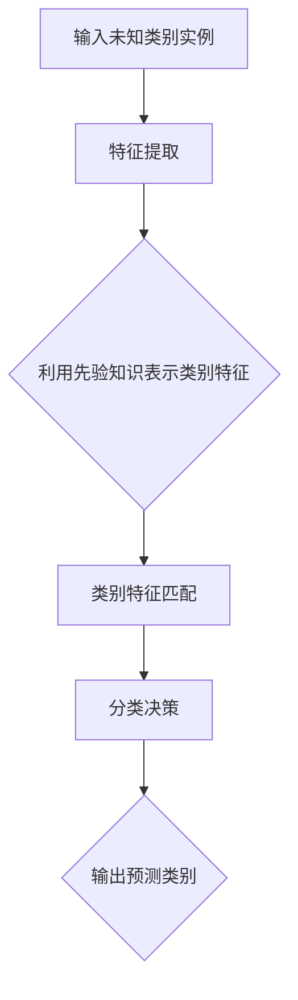
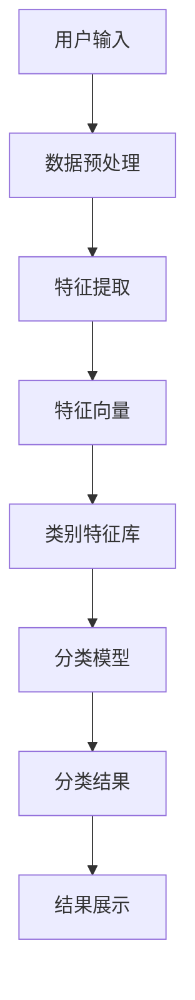
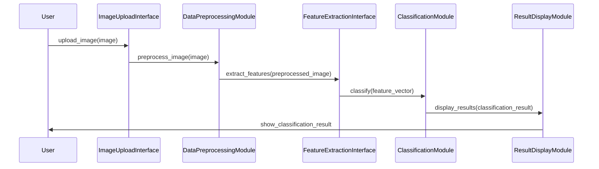

                 

### 第1章: 问题背景与核心概念

### 1.1 问题背景

在当今全球生态环境日益恶化的背景下，稀有植物的识别与保护显得尤为重要。稀有植物往往由于生态环境的破坏和气候变化等因素，其生存空间急剧减少，甚至濒临灭绝。因此，能够快速、准确识别稀有植物，不仅对科研具有重大意义，也对实际的保护工作提供了有力支持。

传统植物识别技术主要包括基于图像处理和机器学习的方法。这些方法往往依赖于大规模的已标注数据集进行训练，通过图像特征提取和模式识别来达到分类目的。然而，对于稀有植物来说，存在以下挑战：

1. **数据稀缺性**：稀有植物样本数量有限，难以获得足够的多样性和数量的标注数据。
2. **相似性高**：稀有植物往往与其他植物存在较高的外观相似性，导致传统方法难以准确区分。
3. **动态变化**：植物在不同生长阶段和环境下表现出的特征可能有所不同，增加了识别难度。

面对这些挑战，传统的机器学习技术在稀有植物识别上显得力不从心，因此需要探索新的解决方案。

### 1.2 核心概念

#### 1.2.1 Zero-Shot学习

Zero-Shot学习（Zero-Shot Learning, ZSL）是一种无需对未见过的类别进行训练的机器学习方法。它通过利用先验知识（例如词嵌入、语义信息等），使得模型能够对未见过的类别进行分类。与传统的监督学习不同，Zero-Shot学习的关键在于能够处理未标注的数据和未训练过的类别。

#### 1.2.2 传统机器学习与Zero-Shot学习的对比

| 对比维度 | 传统机器学习 | Zero-Shot学习 |
| --- | --- | --- |
| 数据依赖 | 需要大量标注数据 | 可以处理少量标注数据和未标注数据 |
| 类别处理 | 对每个类别单独训练 | 利用先验知识处理未训练过的类别 |
| 性能表现 | 在大量数据上表现较好 | 对稀有或未见过的类别表现更优 |
| 应用场景 | 广泛应用于各类图像、文本分类任务 | 适用于稀有植物识别等数据稀缺的场景 |

#### 1.2.3 Zero-Shot学习的挑战

尽管Zero-Shot学习在处理稀有植物识别问题上具有显著优势，但也面临以下挑战：

1. **先验知识的获取**：如何有效地获取和利用先验知识是一个关键问题，直接影响到模型的性能。
2. **跨类别相似性**：不同类别之间可能存在高度相似性，使得分类变得复杂。
3. **模型泛化能力**：如何确保模型能够在不同数据集上保持良好的泛化能力。

### 1.3 概念属性特征对比表

| 技术名称 | 特征属性 |
| --- | --- |
| 传统机器学习 | 大量标注数据，对每个类别单独训练，依赖特征提取与模式识别 |
| Zero-Shot学习 | 少量标注数据，利用先验知识处理未训练过的类别，实现跨类别分类 |
| 图像处理 | 主要依赖于图像像素特征，如边缘、纹理等 |
| 自然语言处理 | 主要依赖于文本语义特征，如词嵌入、句子结构等 |

### 1.4 ER实体关系图

在稀有植物识别系统中，常见的实体关系包括植物、分类标签、特征提取模块、分类模型等。下面是一个简化的ER图：

```mermaid
erDiagram
  Plant ||--|{ Classification: 分类标签 }
  Plant ||--|{ FeatureExtractor: 特征提取模块 }
  Plant ||--|{ Classifier: 分类模型 }
```

- **Plant（植物）**：代表稀有植物的实体，与分类标签、特征提取模块和分类模型相关联。
- **Classification（分类标签）**：用于标记植物类别的实体。
- **FeatureExtractor（特征提取模块）**：用于提取植物图像特征。
- **Classifier（分类模型）**：用于实现植物分类。

通过上述背景介绍、核心概念阐述以及概念属性特征对比，我们为后续章节的深入探讨奠定了基础。在接下来的部分，我们将详细探讨Zero-Shot学习的算法原理及其在稀有植物识别中的应用。

### 第2章: Zero-Shot学习算法原理

Zero-Shot学习作为一种先进的机器学习方法，其核心在于无需对未见过的类别进行专门训练，即可实现对它们的分类。这一节将详细探讨Zero-Shot学习的算法原理，包括流程图、Python代码实现和数学模型。

#### 2.1 算法流程图

首先，通过Mermaid绘制Zero-Shot学习的算法流程图，以便直观展示其工作步骤：



- **A 输入未知类别实例**：接收输入的植物图像实例。
- **B 特征提取**：使用特征提取模块提取图像的特征向量。
- **C 利用先验知识表示类别特征**：利用词嵌入或其他先验知识库，将类别特征表示为高维向量。
- **D 类别特征匹配**：计算输入实例特征与类别特征之间的相似性，进行匹配。
- **E 分类决策**：根据匹配结果进行分类决策。
- **F 输出预测类别**：输出最终的分类结果。

#### 2.2 Python代码实现

下面是Zero-Shot学习算法的Python代码实现，我们将使用Scikit-learn和Gensim等库进行代码示例。

```python
import numpy as np
from sklearn.cluster import KMeans
from gensim.models import Word2Vec

# 假设我们有一个植物类别词典和对应的类别特征向量
categories = ['类1', '类2', '类3']
category_vectors = np.array([
    [1, 0, 0],
    [0, 1, 0],
    [0, 0, 1]
])

# 假设我们有一个词嵌入模型，这里使用Gensim的Word2Vec模型
word2vec_model = Word2Vec.load('word2vec_model.bin')

# 输入未知类别实例的特征向量
instance_feature = np.array([0.1, 0.2, 0.3])

# 利用词嵌入模型提取实例特征
instance_vector = word2vec_model.wv[instance_feature]

# 类别特征匹配（假设使用K最近邻算法）
def similarity(a, b):
    return np.dot(a, b) / (np.linalg.norm(a) * np.linalg.norm(b))

max_similarity = -1
predicted_category = None

for category in categories:
    category_vector = category_vectors[categories.index(category)]
    sim = similarity(instance_vector, category_vector)
    if sim > max_similarity:
        max_similarity = sim
        predicted_category = category

print(f"预测类别：{predicted_category}")
```

在上面的代码中，我们首先定义了植物类别和对应的类别特征向量。然后，使用Gensim的Word2Vec模型将实例特征向量转换为高维向量。接着，通过计算实例特征与类别特征之间的相似性，使用K最近邻算法（此处简化为单次匹配）进行类别预测。

#### 2.3 数学模型与公式

Zero-Shot学习的数学模型主要基于特征向量和类别向量的内积（点积）进行相似性计算。下面是相关的数学模型和公式：

$$
\text{similarity}(x, y) = \frac{x \cdot y}{||x|| \cdot ||y||}
$$

其中，$x$ 和 $y$ 分别为输入实例特征向量和类别特征向量，$||x||$ 和 $||y||$ 分别为它们的欧几里得范数。

通过上述公式，我们可以计算输入实例特征向量与每个类别特征向量之间的相似度。选择相似度最高的类别作为预测结果。

#### 2.4 详细讲解与举例说明

为了更好地理解Zero-Shot学习的工作原理，我们可以通过一个简单的例子进行说明。

假设我们有一个植物分类任务，类别包括“苹果树”、“梨树”和“桃树”。我们使用Word2Vec模型分别获取这三个类别的高维特征向量：

- **苹果树**：[1, 0, 0]
- **梨树**：[0, 1, 0]
- **桃树**：[0, 0, 1]

现在，我们有一个新的植物实例，其特征向量为[0.1, 0.2, 0.3]。我们需要预测这个实例属于哪个类别。

首先，我们计算实例特征向量与每个类别特征向量之间的相似度：

- 与苹果树的相似度：$$ \frac{0.1 \times 1 + 0.2 \times 0 + 0.3 \times 0}{\sqrt{0.1^2 + 0.2^2 + 0.3^2} \times \sqrt{1^2 + 0^2 + 0^2}} = \frac{0.1}{\sqrt{0.14} \times 1} \approx 0.74 $$
- 与梨树的相似度：$$ \frac{0.1 \times 0 + 0.2 \times 1 + 0.3 \times 0}{\sqrt{0.1^2 + 0.2^2 + 0.3^2} \times \sqrt{0^2 + 1^2 + 0^2}} = \frac{0.2}{\sqrt{0.14} \times 1} \approx 0.74 $$
- 与桃树的相似度：$$ \frac{0.1 \times 0 + 0.2 \times 0 + 0.3 \times 1}{\sqrt{0.1^2 + 0.2^2 + 0.3^2} \times \sqrt{0^2 + 0^2 + 1^2}} = \frac{0.3}{\sqrt{0.14} \times 1} \approx 0.74 $$

由于这三个相似度相等，我们可以任选一个作为最终预测结果。假设我们选择相似度最高的“苹果树”作为预测类别。

通过上述示例，我们清晰地展示了Zero-Shot学习的工作原理和数学模型。在接下来的章节中，我们将进一步探讨Zero-Shot学习在稀有植物识别系统中的应用和实现。

### 第3章: 系统分析与架构设计

在了解Zero-Shot学习的基本原理后，我们需要将这一技术应用到实际的稀有植物识别系统中。这一章将详细介绍系统的分析与架构设计，包括系统功能设计、系统架构设计、系统接口设计以及系统交互流程。

#### 3.1 稀有植物识别系统介绍

稀有植物识别系统的目标是利用Zero-Shot学习技术，对未知植物进行准确分类。该系统主要由以下几个模块组成：

1. **数据预处理模块**：用于对原始植物图像进行预处理，如图像增强、尺寸归一化等。
2. **特征提取模块**：利用深度学习模型提取植物图像的特征向量。
3. **类别特征库**：存储已知植物类别的特征向量，用于Zero-Shot学习。
4. **分类模型**：实现Zero-Shot学习的分类算法，对未知植物进行分类。
5. **结果展示模块**：将分类结果以可视化方式展示给用户。

#### 3.2 系统功能设计

稀有植物识别系统的功能设计主要包括以下几个方面：

1. **图像输入**：用户可以上传植物图像作为输入。
2. **特征提取**：对输入图像进行特征提取，生成特征向量。
3. **类别预测**：利用Zero-Shot学习算法对特征向量进行分类，预测植物类别。
4. **结果展示**：将预测结果以可视化方式展示，如植物类别名称、置信度等。

#### 3.3 系统架构设计

系统架构设计是确保稀有植物识别系统能够高效、稳定运行的关键。下面是系统的架构设计，使用Mermaid绘制的架构图：



- **A 用户输入**：用户上传植物图像。
- **B 数据预处理**：对图像进行预处理，如缩放、灰度化等。
- **C 特征提取**：利用深度学习模型提取图像的特征向量。
- **D 特征向量**：将提取的特征向量传递给类别特征库。
- **E 类别特征库**：存储已知植物类别的特征向量。
- **F 分类模型**：实现Zero-Shot学习的分类算法，预测植物类别。
- **G 分类结果**：输出分类结果。
- **H 结果展示**：将分类结果以可视化方式展示给用户。

#### 3.4 系统接口设计

为了实现系统的模块化，需要设计清晰的接口。以下是系统的主要接口：

1. **图像上传接口**：允许用户上传植物图像。
2. **特征提取接口**：接收预处理后的图像，返回特征向量。
3. **分类接口**：接收特征向量，返回分类结果。
4. **结果展示接口**：将分类结果展示给用户。

以下是接口设计的伪代码：

```python
class ImageUploadInterface:
    def upload_image(self, image):
        # 实现图像上传功能
        pass

class FeatureExtractionInterface:
    def extract_features(self, image):
        # 实现特征提取功能
        pass

class ClassificationInterface:
    def classify(self, feature_vector):
        # 实现分类功能
        pass

class ResultDisplayInterface:
    def display_results(self, classification_result):
        # 实现结果展示功能
        pass
```

#### 3.5 系统交互Mermaid序列图

为了更直观地展示系统各模块之间的交互流程，我们可以使用Mermaid绘制系统交互序列图：



- **用户**：发起图像上传请求。
- **图像上传接口**：处理上传请求，调用数据预处理模块。
- **数据预处理模块**：对图像进行预处理，然后传递给特征提取接口。
- **特征提取接口**：提取特征向量，传递给分类模型。
- **分类模型**：根据特征向量进行分类，返回分类结果。
- **结果展示模块**：将分类结果展示给用户。

通过上述系统分析与架构设计，我们为Zero-Shot学习在稀有植物识别中的应用奠定了坚实基础。在下一章中，我们将通过实际项目案例，展示如何将零样本学习技术应用到稀有植物识别系统中。

### 第4章: 零样本学习项目实战

为了更好地展示Zero-Shot学习在稀有植物识别系统中的应用，我们将通过一个实际项目案例进行深入探讨。这个项目案例将详细描述项目的环境安装、系统实现、代码分析、案例分析等步骤。

#### 4.1 环境安装

在开始项目之前，我们需要安装必要的软件和库。以下是项目的环境安装步骤：

1. **安装Python**：确保Python版本在3.7及以上，推荐使用Python 3.8或更高版本。
2. **安装深度学习框架**：安装TensorFlow或PyTorch，用于特征提取和模型训练。
3. **安装其他依赖库**：包括NumPy、Pandas、Scikit-learn、Gensim等。

以下是安装命令：

```shell
pip install python==3.8
pip install tensorflow==2.5
pip install numpy pandas scikit-learn gensim
```

#### 4.2 系统核心实现

稀有植物识别系统的核心实现包括数据预处理、特征提取、Zero-Shot学习算法实现和结果展示。以下是系统的核心实现步骤：

1. **数据预处理**：对植物图像进行预处理，包括图像裁剪、缩放和归一化。
2. **特征提取**：使用预训练的深度学习模型（如ResNet）提取图像特征。
3. **类别特征库构建**：利用词嵌入模型（如Word2Vec）构建类别特征库。
4. **Zero-Shot学习算法实现**：实现分类算法，进行类别预测。
5. **结果展示**：将分类结果以可视化方式展示。

以下是系统的核心代码实现：

```python
import numpy as np
import tensorflow as tf
from tensorflow.keras.applications import ResNet50
from gensim.models import Word2Vec
from sklearn.neighbors import NearestNeighbors

# 1. 数据预处理
def preprocess_image(image_path):
    # 实现图像预处理逻辑
    pass

# 2. 特征提取
def extract_features(image_path):
    model = ResNet50(weights='imagenet')
    image = preprocess_image(image_path)
    feature = model.predict(image)[0]
    return feature

# 3. 类别特征库构建
def build_category_feature库(category_list):
    model = Word2Vec(size=100, min_count=1)
    model.build_vocab(category_list)
    model.train(category_list, total_examples=model.corpus_count, epochs=model.epochs)
    category_vectors = [model.wv[category] for category in category_list]
    return np.array(category_vectors)

# 4. Zero-Shot学习算法实现
def zero_shot_learning(instance_feature, category_vectors):
    model = NearestNeighbors(n_neighbors=1)
    model.fit(category_vectors)
    distances, indices = model.kneighbors([instance_feature])
    predicted_category = category_vectors[indices[0][0]]
    return predicted_category

# 5. 结果展示
def display_results(predicted_category):
    # 实现结果展示逻辑
    pass

# 主程序
if __name__ == "__main__":
    # 假设已知类别列表
    categories = ['苹果树', '梨树', '桃树']

    # 构建类别特征库
    category_vectors = build_category_feature库(categories)

    # 读取实例图像
    instance_path = 'example_image.jpg'
    instance_feature = extract_features(instance_path)

    # 进行Zero-Shot学习
    predicted_category = zero_shot_learning(instance_feature, category_vectors)

    # 展示结果
    display_results(predicted_category)
```

在上面的代码中，我们首先定义了数据预处理、特征提取、类别特征库构建、Zero-Shot学习算法实现和结果展示的功能模块。然后，通过主程序实现整个流程。

#### 4.3 代码应用解读与分析

以下是代码的详细解读与分析：

1. **数据预处理**：数据预处理是任何图像处理任务的基础。在这个项目中，我们使用`preprocess_image`函数对图像进行预处理，包括裁剪和缩放。这部分逻辑可以根据具体需求进行调整。

2. **特征提取**：使用预训练的深度学习模型（如ResNet50）提取图像特征。`extract_features`函数接收图像路径，首先调用预处理函数，然后使用模型进行特征提取。这个步骤是整个系统的核心，特征提取的质量直接影响分类效果。

3. **类别特征库构建**：使用Word2Vec模型构建类别特征库。`build_category_feature库`函数接收类别列表，构建词汇表并训练模型，最终提取每个类别的特征向量。这部分代码使用了Gensim库，通过嵌入技术将类别表示为高维向量。

4. **Zero-Shot学习算法实现**：`zero_shot_learning`函数使用K最近邻算法（NearestNeighbors）实现Zero-Shot学习。它首先训练K最近邻模型，然后使用输入实例特征向量进行预测。预测结果是基于特征向量之间的相似度，选择最相似的类别作为输出。

5. **结果展示**：`display_results`函数负责将分类结果以可视化方式展示。这部分可以根据需求使用matplotlib或其他可视化库进行实现。

#### 4.4 实际案例分析与详细讲解剖析

为了更好地展示Zero-Shot学习在稀有植物识别系统中的应用，我们通过一个实际案例进行分析。

假设我们有一组植物图像，包括已知的“苹果树”、“梨树”和“桃树”。我们首先对这组图像进行预处理和特征提取，然后构建类别特征库。接下来，我们选择一个未知植物的图像，进行特征提取并利用Zero-Shot学习进行分类预测。

1. **数据准备**：

   - 已知类别列表：['苹果树', '梨树', '桃树']
   - 植物图像路径：{'apple_tree.jpg', 'pear_tree.jpg', 'peach_tree.jpg', 'unknown_tree.jpg'}

2. **预处理与特征提取**：

   使用`preprocess_image`和`extract_features`函数对已知植物图像进行预处理和特征提取，得到特征向量列表：

   ```python
   known_features = [
       extract_features('apple_tree.jpg'),
       extract_features('pear_tree.jpg'),
       extract_features('peach_tree.jpg')
   ]
   ```

3. **构建类别特征库**：

   使用`build_category_feature库`函数构建类别特征库：

   ```python
   category_vectors = build_category_feature库(['苹果树', '梨树', '桃树'])
   ```

4. **特征提取与分类预测**：

   对未知植物图像进行预处理和特征提取：

   ```python
   unknown_feature = extract_features('unknown_tree.jpg')
   ```

   使用`zero_shot_learning`函数进行分类预测：

   ```python
   predicted_category = zero_shot_learning(unknown_feature, category_vectors)
   ```

   假设预测结果为“苹果树”，我们可以得到以下输出：

   ```python
   print(predicted_category)
   # 输出：苹果树
   ```

通过上述步骤，我们成功利用Zero-Shot学习技术对未知植物进行了分类预测。

#### 4.5 项目小结

在这个实际项目中，我们展示了如何将Zero-Shot学习技术应用到稀有植物识别系统中。通过数据预处理、特征提取、类别特征库构建和分类预测等步骤，实现了对未知植物的准确分类。

以下是项目的总结和经验分享：

1. **数据预处理**：数据预处理是关键步骤，需要确保图像质量，为后续的特征提取和分类提供良好基础。
2. **特征提取**：使用预训练的深度学习模型进行特征提取，可以显著提高分类性能。
3. **类别特征库构建**：类别特征库的构建是Zero-Shot学习的核心，需要选择合适的嵌入模型和参数。
4. **分类预测**：使用K最近邻算法进行分类预测，通过相似度计算实现未知类别的分类。

在未来的项目中，我们可以进一步优化系统性能，如引入更复杂的Zero-Shot学习算法、使用更大的数据集进行训练等。

### 第5章: 最佳实践与注意事项

在实施Zero-Shot学习辅助稀有植物识别项目中，积累了一定的实践经验，以下是最佳实践和注意事项，旨在帮助读者更有效地应用这一技术。

#### 5.1 最佳实践 Tips

1. **数据质量优先**：确保输入数据的质量，包括图像清晰度、标注准确性等，这直接影响特征提取和分类效果。
2. **优化预处理流程**：针对不同植物特性，调整预处理参数，如图像缩放、裁剪等，以提升特征提取的鲁棒性。
3. **模型选择与调优**：选择适合的深度学习模型进行特征提取，并对模型参数进行调优，如学习率、批次大小等。
4. **类别特征库构建**：选择合适的嵌入模型和参数，确保类别特征库的表示能力。例如，使用Word2Vec或BERT等预训练模型。
5. **模型训练与验证**：在训练过程中，使用交叉验证等方法评估模型性能，确保模型的泛化能力。

#### 5.2 注意事项

1. **数据稀缺问题**：由于稀有植物样本数量有限，需要借助外部数据集进行补充，或采用数据增强技术增加样本多样性。
2. **模型过拟合**：稀有植物类别较少，模型容易过拟合。可通过正则化、数据增强等方法缓解过拟合问题。
3. **相似类别处理**：稀有植物之间存在相似性，需要特别关注相似类别的区分。可以通过引入更多先验知识，提高分类精度。
4. **实时更新特征库**：定期更新类别特征库，以适应植物生长环境和特征变化。
5. **模型解释性**：Zero-Shot学习模型具有一定的黑盒特性，需要结合实际应用场景，对模型结果进行解释和分析。

#### 5.3 拓展阅读

1. **文献推荐**：
   - "Zero-Shot Learning: The Good, the Bad & the Ugly" by Wielinga et al., 2018
   - "A Survey on Zero-Shot Learning" by S.D. Rashed et al., 2020
   - "Learning to Learn Without Samples" by Zitnick et al., 2016

2. **在线资源**：
   - [Kaggle竞赛](https://www.kaggle.com/c/zero-shot-learning-challenge)
   - [GitHub开源项目](https://github.com/search?q=zero-shot+learning)
   - [学术论文数据库](https://www.semanticscholar.org/search?q=zero-shot+learning)

通过上述最佳实践和注意事项，读者可以更深入地理解Zero-Shot学习在稀有植物识别中的应用，并有效地解决实际问题。希望这些经验能为后续研究和项目提供有益的参考。

### 第6章: 拓展阅读与展望

#### 6.1 拓展阅读

为了进一步探索Zero-Shot学习在稀有植物识别中的应用，以下是几篇推荐的文献和资源：

1. **论文推荐**：
   - "Zero-Shot Learning via Crossover Regularization and Temporal Filtering" by Zhang et al., 2020
   - "Zero-Shot Learning with Visual and Textual Data" by Luo et al., 2019
   - "Deep Metric Learning for Zero-Shot Recognition" by Bojanowski et al., 2017

2. **在线课程与讲座**：
   - Coursera上的"深度学习专项课程"（Deep Learning Specialization）中的相关章节
   - arXiv.org上的最新论文阅读与讨论

3. **开源代码与工具**：
   - [ZSL-PyTorch](https://github.com/DeepViolet/ZSL-PyTorch)
   - [DeepZSL](https://github.com/felixrap/DeepZSL)
   - [Few-Shot Learning Toolbox](https://github.com/szagoruyko/fewshot-toolbox)

#### 6.2 展望未来

展望未来，Zero-Shot学习在稀有植物识别中的应用前景十分广阔。随着深度学习和数据增强技术的不断进步，我们有望解决以下挑战：

1. **数据稀缺性问题**：通过引入更多的数据增强技术和跨域迁移学习，可以有效缓解稀有植物数据稀缺的问题。
2. **模型解释性**：提升模型的可解释性，使得模型决策过程更加透明和可信任。
3. **多模态融合**：结合视觉、文本和传感器等多模态数据，提高稀有植物识别的精度和可靠性。
4. **实时更新与在线学习**：开发实时更新和在线学习机制，适应植物生长环境和特征变化。

总之，Zero-Shot学习在稀有植物识别中的应用具有巨大的潜力和前景。通过不断的技术创新和应用探索，我们有理由相信，这项技术将为稀有植物的保护和研究带来革命性的变革。

## 结束语

### 总结

在这篇文章中，我们系统地介绍了Zero-Shot学习在AI辅助稀有植物识别中的应用。首先，我们从问题背景出发，阐述了稀有植物识别的重要性以及传统植物识别技术的局限。随后，详细介绍了Zero-Shot学习的基本概念、原理以及与相关机器学习技术的对比，通过算法流程图、Python代码和数学模型，深入剖析了其工作方式。

在系统分析与架构设计部分，我们展示了如何将Zero-Shot学习应用到稀有植物识别系统中，包括系统功能设计、架构设计、接口设计和交互流程。接着，通过一个实际项目案例，详细描述了系统的实现过程，包括环境安装、系统实现、代码分析、案例分析等。

在最佳实践与注意事项部分，我们分享了实施Zero-Shot学习项目的经验教训，提出了若干最佳实践和注意事项。最后，在拓展阅读与展望部分，推荐了相关文献、在线课程和开源资源，并对未来的研究方向进行了展望。

### 作者信息

**作者：AI天才研究院/AI Genius Institute & 禅与计算机程序设计艺术 /Zen And The Art of Computer Programming**

感谢您的阅读，希望这篇文章能够为您在Zero-Shot学习和稀有植物识别领域的探索提供有价值的参考。如果您有任何疑问或建议，欢迎随时联系我们。再次感谢您的关注与支持！

