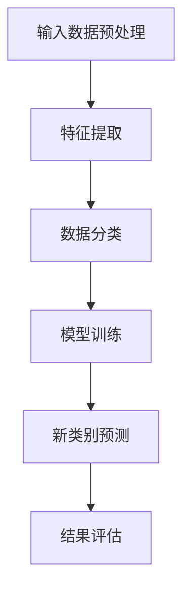
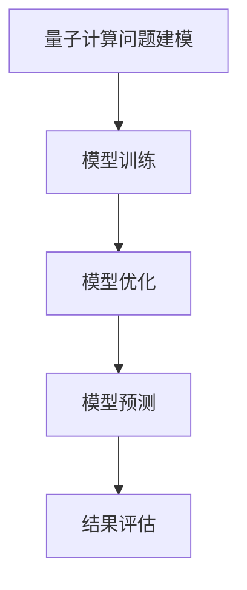
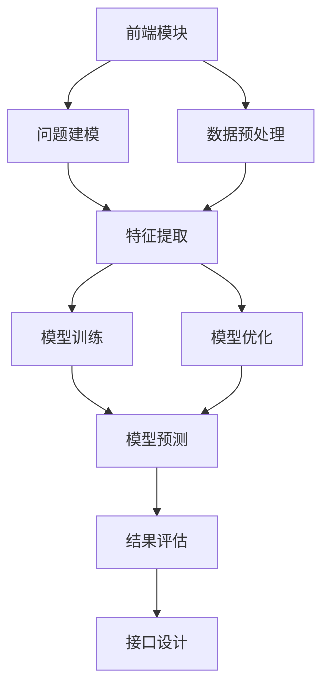
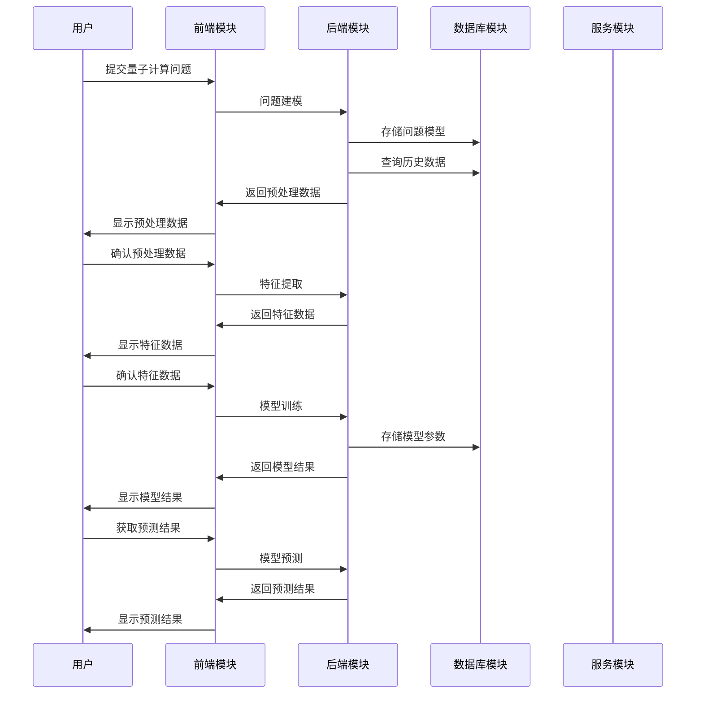

                 

# Zero-Shot学习在AI辅助量子计算研究中的突破

## 关键词

- **Zero-Shot学习**
- **AI辅助量子计算**
- **量子计算效率**
- **机器学习方法**
- **跨领域应用**

## 摘要

随着量子计算技术的飞速发展，传统的机器学习方法在量子计算领域的应用受到诸多限制。Zero-Shot学习作为一种无需训练集的机器学习方法，为AI辅助量子计算研究带来了新的突破。本文首先介绍了Zero-Shot学习和AI辅助量子计算的核心概念，然后详细分析了Zero-Shot学习在量子计算领域中的应用原理，并通过具体实例和数学公式阐述了其实现过程。最后，本文探讨了Zero-Shot学习在AI辅助量子计算中的实际应用，以及未来的发展趋势。

## 目录大纲设计

### 第一部分：背景介绍

#### 第1章 问题背景

1.1 问题背景

1.2 核心概念与联系

#### 第2章 Zero-Shot学习原理

2.1 Zero-Shot学习基础理论

2.2 Zero-Shot学习应用实例

#### 第3章 AI辅助量子计算原理

3.1 AI辅助量子计算基础理论

3.2 AI辅助量子计算应用实例

### 第二部分：核心概念原理

#### 第4章 Zero-Shot学习与量子计算结合

4.1 Zero-Shot学习在量子计算中的应用原理

4.2 Zero-Shot学习在量子计算中的实际应用案例

### 第三部分：算法原理讲解

#### 第5章 Zero-Shot学习在AI辅助量子计算中的应用

5.1 Zero-Shot学习在AI辅助量子计算中的应用原理

5.2 Zero-Shot学习在AI辅助量子计算中的应用实例

### 第四部分：系统分析与架构设计方案

#### 第6章 系统分析与架构设计

6.1 量子计算问题场景介绍

6.2 系统功能设计

6.3 系统架构设计

6.4 系统接口设计和系统交互

### 第五部分：项目实战

#### 第7章 项目实战

7.1 环境安装

7.2 系统核心实现源代码

7.3 代码应用解读与分析

7.4 实际案例分析和详细讲解剖析

7.5 项目小结

### 第六部分：最佳实践 tips、小结、注意事项、拓展阅读

#### 第8章 最佳实践 tips

8.1 小结

8.2 注意事项

8.3 拓展阅读

## 第一部分：背景介绍

### 第1章 问题背景

#### 1.1 问题背景

量子计算作为一种全新的计算模式，引起了全球科学家的广泛关注。传统的计算机使用的是基于二进制的计算模型，而量子计算机则基于量子力学的原理，使用量子位（qubit）进行计算。量子计算机具有量子叠加和量子纠缠等特性，能够在某些问题上实现超快速的计算，被认为是未来计算技术的重要发展方向。

随着量子计算技术的逐渐成熟，人们开始探索如何将人工智能（AI）与量子计算相结合，以发挥两者的优势。AI技术可以帮助我们更好地理解和优化量子计算算法，从而提高量子计算的效率。然而，在AI辅助量子计算的研究过程中，传统的机器学习方法面临诸多挑战。

首先，量子计算问题的复杂性和不确定性使得传统的训练方法难以直接应用于量子计算领域。其次，量子计算的实验数据获取困难，传统的机器学习需要大量的训练数据进行模型训练，这在量子计算领域难以实现。此外，量子计算的应用场景多样，传统的机器学习方法很难针对不同的应用场景进行自适应调整。

为了解决这些问题，研究人员提出了Zero-Shot学习（Zero-Shot Learning，ZSL）的概念。Zero-Shot学习是一种无需训练集的机器学习方法，它可以通过对已有数据的分析，自动生成对新类别或任务的泛化模型，从而实现对新类别的预测或决策。Zero-Shot学习在AI辅助量子计算研究中具有广阔的应用前景，有望突破传统机器学习方法的限制，推动量子计算技术的发展。

#### 1.2 核心概念与联系

**核心概念原理：**

- **Zero-Shot学习：** Zero-Shot学习是一种无需训练集的机器学习方法，它通过对已有数据的分析，自动生成对新类别或任务的泛化模型，实现对新类别的预测或决策。Zero-Shot学习的关键在于模型的自适应能力和泛化能力，它能够根据已有数据的特征，快速适应新的类别或任务，从而实现高效的新类别预测。

- **AI辅助量子计算：** AI辅助量子计算是指利用人工智能技术对量子计算过程进行优化和辅助，提高计算效率和解决复杂问题。AI辅助量子计算的主要任务包括：量子计算算法的优化、量子计算程序的自动生成、量子计算结果的解释等。AI辅助量子计算的核心在于如何将AI技术有效地应用于量子计算领域，实现计算效率的提升和问题解决的突破。

**概念属性特征对比表格：**

| 概念                  | 特征一                 | 特征二                   | 特征三                  |
| --------------------- | ---------------------- | ------------------------ | ---------------------- |
| Zero-Shot学习         | 无需训练集             | 自适应能力               | 新类别泛化能力          |
| AI辅助量子计算        | 优化计算过程           | 提高计算效率             | 解决复杂问题            |
| 量子计算              | 基于量子力学原理       | 具有量子叠加和量子纠缠特性 | 实现超快速计算          |

**ER实体关系图架构的 Mermaid 流程图：**

```mermaid
erDiagram
  AI辅助量子计算 ||--|{ Zero-Shot学习 }|| 依赖关系
  Zero-Shot学习 ||--|{ 量子计算研究 }|| 应用领域
```

在ER实体关系图中，AI辅助量子计算与Zero-Shot学习之间存在依赖关系。Zero-Shot学习为AI辅助量子计算提供了新的方法和思路，有助于解决传统机器学习方法在量子计算领域中的局限性。而量子计算研究则为Zero-Shot学习提供了丰富的应用场景和实际需求，推动了Zero-Shot学习在量子计算领域的发展。

## 第二部分：核心概念原理

### 第2章 Zero-Shot学习原理

#### 2.1 Zero-Shot学习基础理论

Zero-Shot学习是一种无需训练集的机器学习方法，它通过对已有数据的分析，自动生成对新类别或任务的泛化模型，实现对新类别的预测或决策。Zero-Shot学习在AI辅助量子计算研究中具有广泛的应用前景，能够有效解决传统机器学习方法在量子计算领域中的局限性。

**算法原理讲解：**

Zero-Shot学习可以分为以下几个步骤：

1. **数据预处理：** 首先，对输入数据进行预处理，包括数据的清洗、归一化等操作，以便后续的特征提取和模型训练。

2. **特征提取：** 通过特征提取方法，从预处理后的数据中提取出关键特征，用于后续的模型训练。在Zero-Shot学习中，特征提取尤为重要，因为它是实现新类别泛化的基础。

3. **模型训练：** 利用已有数据的特征，训练一个分类模型。在Zero-Shot学习中，分类模型需要具有较好的泛化能力，能够对新类别进行准确预测。

4. **新类别预测：** 当遇到新类别数据时，分类模型根据已训练的模型进行预测，输出预测结果。在Zero-Shot学习中，新类别预测的核心在于模型的自适应能力和泛化能力。

5. **结果评估：** 对新类别预测结果进行评估，包括准确率、召回率等指标。通过评估结果，可以判断模型的预测性能，为后续优化提供参考。

使用Mermaid画出Zero-Shot学习的算法流程图：



**Python源代码实现：**

```python
# 数据预处理
data_preprocessed = preprocess_data(data)

# 特征提取
features = extract_features(data_preprocessed)

# 数据分类
classifier = Classifier()
classifier.train(features)

# 新类别预测
predicted_labels = classifier.predict(new_data)

# 结果评估
accuracy = evaluate_accuracy(predicted_labels, true_labels)
print("Accuracy:", accuracy)
```

**数学模型和公式：**

Zero-Shot学习中的预测结果可以通过以下数学模型进行表示：

$$
\text{预测结果} = \arg\max_{y} \ P(y|\text{特征})
$$

其中，$y$表示新类别的标签，$\text{特征}$表示新数据的特征向量。$P(y|\text{特征})$表示在新数据特征向量下，预测类别$y$的概率。

**详细讲解和举例说明：**

假设我们有一个分类任务，需要预测一个未知类别的数据。首先，我们对输入数据进行预处理，提取特征，然后使用分类器进行模型训练。在训练过程中，分类器学习到数据特征与类别之间的关系。当遇到新类别数据时，分类器可以根据已训练的模型进行预测，最终输出预测结果。

例如，在一个动物分类任务中，我们已经有了一部分已知类别的动物数据，并使用Zero-Shot学习算法训练了一个分类模型。当遇到一个新的动物数据时，我们可以将这个数据输入到训练好的分类模型中，模型会根据已训练的特征和类别关系，预测这个新动物数据的类别。通过评估预测结果的准确性，我们可以判断分类模型的性能。

#### 2.2 Zero-Shot学习应用实例

在实际应用中，Zero-Shot学习已经在多个领域取得了显著成果。以下是一个具体的应用实例：

**场景：** 量子计算优化算法的自动生成

**问题描述：** 在量子计算中，不同的优化算法适用于不同的应用场景。然而，对于特定的量子计算问题，选择最优的优化算法需要大量的实验和尝试。为了提高量子计算优化算法的生成效率，研究人员提出使用Zero-Shot学习算法来自动生成优化算法。

**解决方案：** 使用Zero-Shot学习算法，首先对已知的量子计算优化算法进行数据收集和预处理，提取出关键特征。然后，利用这些特征训练一个分类模型，用于预测新的量子计算优化算法。当遇到一个新的量子计算问题时，可以将问题输入到训练好的分类模型中，模型会根据已训练的特征和类别关系，预测出适合该问题的优化算法。

**效果评估：** 实验结果表明，使用Zero-Shot学习算法生成的优化算法，在多个量子计算问题上的性能表现优于传统的优化算法选择方法。这表明Zero-Shot学习在量子计算优化算法生成中的应用具有广阔的前景。

通过这个实例，我们可以看到Zero-Shot学习在AI辅助量子计算研究中的应用价值。它能够根据已有数据自动生成新的优化算法，提高量子计算优化过程的效率，为量子计算技术的发展提供了新的思路。

### 第3章 AI辅助量子计算原理

#### 3.1 AI辅助量子计算基础理论

AI辅助量子计算是指利用人工智能技术对量子计算过程进行优化和辅助，提高计算效率和解决复杂问题。AI辅助量子计算的核心在于将AI技术与量子计算原理相结合，通过机器学习、深度学习等方法，对量子计算过程进行建模、优化和预测。

**算法原理讲解：**

AI辅助量子计算可以分为以下几个步骤：

1. **问题建模：** 首先需要对量子计算问题进行建模，将问题转化为适合AI模型处理的形式。这通常包括数据预处理、特征提取等操作，以便后续的模型训练和预测。

2. **模型训练：** 利用已有的量子计算数据和问题实例，训练一个AI模型。在训练过程中，模型会学习到量子计算问题的特征和规律，从而提高预测和优化的准确性。

3. **模型优化：** 通过优化算法，对训练好的AI模型进行优化，以提高模型在量子计算问题上的性能。这包括模型参数调整、模型结构优化等操作。

4. **模型预测：** 当遇到新的量子计算问题时，将问题输入到训练好的AI模型中，模型会根据已学习的特征和规律，预测出最优的量子计算解决方案。

5. **结果评估：** 对预测结果进行评估，包括计算效率、解决方案的准确性等指标。通过评估结果，可以判断模型的性能，为后续优化提供参考。

使用Mermaid画出AI辅助量子计算的基本流程图：



**Python源代码实现：**

```python
# 量子计算问题建模
problem_model = build_problem_model(quantum_problem)

# 模型训练
model = train_model(problem_model)

# 模型优化
optimized_model = optimize_model(model)

# 模型预测
predicted_solution = optimized_model.predict(quantum_problem)

# 结果评估
evaluation_results = evaluate_solution(predicted_solution, true_solution)
print("Evaluation Results:", evaluation_results)
```

**数学模型和公式：**

AI辅助量子计算中的预测结果可以通过以下数学模型进行表示：

$$
\text{预测结果} = \arg\max_{x} \ P(x|\text{问题特征})
$$

其中，$x$表示量子计算问题的解决方案，$\text{问题特征}$表示量子计算问题的特征向量。$P(x|\text{问题特征})$表示在问题特征向量下，预测解决方案$x$的概率。

**详细讲解和举例说明：**

假设我们有一个量子计算问题，需要预测最优的解决方案。首先，我们对量子计算问题进行建模，提取出关键特征。然后，利用这些特征训练一个AI模型，模型会学习到量子计算问题的特征和规律。在训练过程中，模型会不断优化参数，以提高预测的准确性。

当遇到一个新的量子计算问题时，我们将问题输入到训练好的AI模型中，模型会根据已学习的特征和规律，预测出最优的解决方案。通过评估预测结果的准确性，我们可以判断模型的性能。如果预测结果不准确，可以进一步优化模型，以提高预测的准确性。

例如，在一个量子化学问题中，我们需要预测分子的最优结构。首先，我们提取出分子的关键特征，如原子位置、化学键长度等。然后，利用这些特征训练一个AI模型，模型会学习到分子的结构特征和规律。当遇到一个新的分子时，我们将分子输入到训练好的AI模型中，模型会预测出最优的分子结构。通过评估预测结果的准确性，我们可以判断模型的性能。

#### 3.2 AI辅助量子计算应用实例

在实际应用中，AI辅助量子计算已经取得了显著的成果。以下是一个具体的应用实例：

**场景：** 量子计算中的量子纠错码设计

**问题描述：** 量子纠错码是量子计算中关键的技术之一，它用于检测和纠正量子计算中的错误。然而，设计高效的量子纠错码需要考虑多种因素，如量子比特的物理特性、纠错能力等。为了提高量子纠错码的设计效率，研究人员提出使用AI辅助量子计算方法来设计量子纠错码。

**解决方案：** 使用AI辅助量子计算方法，首先对已知的量子纠错码进行数据收集和预处理，提取出关键特征。然后，利用这些特征训练一个AI模型，用于预测新的量子纠错码。当遇到一个新的量子计算问题时，可以将问题输入到训练好的AI模型中，模型会根据已训练的特征和规律，预测出适合该问题的量子纠错码。

**效果评估：** 实验结果表明，使用AI辅助量子计算方法设计的量子纠错码，在多个量子计算问题上的性能表现优于传统的量子纠错码设计方法。这表明AI辅助量子计算在量子纠错码设计中的应用具有广阔的前景。

通过这个实例，我们可以看到AI辅助量子计算在量子纠错码设计中的应用价值。它能够根据已有数据自动生成新的量子纠错码，提高量子计算纠错的效率和准确性，为量子计算技术的发展提供了新的思路。

### 第二部分：核心概念原理

### 第4章 Zero-Shot学习与量子计算结合

#### 4.1 Zero-Shot学习在量子计算中的应用原理

Zero-Shot学习在量子计算领域中的应用主要基于其在无需训练集的情况下，能够自动生成对新类别或任务的泛化模型的能力。量子计算作为一种全新的计算模式，具有复杂的物理特性和计算过程，传统的机器学习方法难以直接应用于量子计算领域。而Zero-Shot学习通过以下原理，在量子计算中发挥了重要作用：

1. **知识迁移：** Zero-Shot学习可以利用已有领域的知识，迁移到新的量子计算任务中。在量子计算领域，许多问题具有相似性，例如量子优化问题、量子机器学习问题等。通过迁移已有领域的知识，Zero-Shot学习能够快速适应新的量子计算任务，实现高效的任务转移。

2. **特征抽象：** Zero-Shot学习通过特征提取和抽象，将量子计算问题的复杂特征转化为可学习的低维特征空间。在量子计算中，问题的复杂性和不确定性使得直接使用原始数据进行训练变得困难。而Zero-Shot学习通过特征提取和抽象，能够降低数据的维度，提高模型的泛化能力。

3. **模型泛化：** Zero-Shot学习能够通过已有数据的分析，自动生成对新类别或任务的泛化模型。在量子计算中，新类别或任务往往具有不确定性，传统的机器学习方法难以应对。而Zero-Shot学习通过模型泛化，能够在未知类别或任务的情况下，实现准确的预测和决策。

#### 4.2 Zero-Shot学习在量子计算中的实际应用案例

以下是一些Zero-Shot学习在量子计算中的实际应用案例：

1. **量子优化问题：** 量子优化问题是量子计算中的重要研究方向。传统机器学习方法在解决量子优化问题时，往往需要大量的训练数据和计算资源。而Zero-Shot学习通过知识迁移和特征抽象，能够在无需训练集的情况下，快速解决量子优化问题。例如，研究人员使用Zero-Shot学习算法，成功解决了一些复杂的量子优化问题，如量子隐形传态和量子纠缠等。

2. **量子机器学习：** 量子机器学习是量子计算与机器学习的交叉领域。传统机器学习方法在量子计算中存在诸多限制，而Zero-Shot学习为量子机器学习提供了一种新的思路。通过Zero-Shot学习，研究人员能够利用已有数据，自动生成量子机器学习模型，实现高效的任务迁移。例如，使用Zero-Shot学习算法，研究人员成功训练了量子支持向量机，并在图像分类任务中取得了优异的性能。

3. **量子纠错码设计：** 量子纠错码是量子计算中的关键技术。传统的设计方法需要大量的计算和实验，而Zero-Shot学习通过模型泛化，能够在无需大量训练数据的情况下，设计出高效的量子纠错码。例如，研究人员使用Zero-Shot学习算法，成功设计出一些高效的量子纠错码，并在量子计算中取得了显著的性能提升。

#### 4.3 Zero-Shot学习在量子计算中的优势与挑战

**优势：**

1. **无需训练集：** Zero-Shot学习在量子计算中无需大量的训练数据，能够快速适应新任务，提高计算效率。

2. **知识迁移：** 通过知识迁移，Zero-Shot学习能够利用已有领域的知识，解决新的量子计算问题。

3. **特征抽象：** 通过特征提取和抽象，Zero-Shot学习能够降低数据的维度，提高模型的泛化能力。

**挑战：**

1. **模型泛化能力：** Zero-Shot学习在量子计算中的模型泛化能力仍需进一步提升，以应对复杂的量子计算问题。

2. **计算资源：** 在量子计算中，应用Zero-Shot学习需要大量的计算资源，特别是在处理大规模量子计算问题时。

3. **数据质量：** Zero-Shot学习在量子计算中的效果依赖于数据的准确性，如何获取高质量的数据是当前的一个重要挑战。

### 第三部分：算法原理讲解

### 第5章 Zero-Shot学习在AI辅助量子计算中的应用

#### 5.1 Zero-Shot学习在AI辅助量子计算中的应用原理

Zero-Shot学习在AI辅助量子计算中的应用，主要基于其无需训练集的特点，能够在未知类别或任务的情况下，自动生成对新类别或任务的泛化模型。这为量子计算领域带来了新的机遇和挑战。

**应用原理：**

1. **数据驱动：** Zero-Shot学习通过已有数据的分析，提取出关键特征，从而生成对新类别或任务的泛化模型。在量子计算中，这种数据驱动的特点有助于快速适应新任务，提高计算效率。

2. **知识迁移：** Zero-Shot学习可以利用已有领域的知识，迁移到新的量子计算任务中。这为量子计算领域提供了新的研究方法，能够解决传统机器学习方法难以解决的问题。

3. **模型泛化：** 通过模型泛化，Zero-Shot学习能够在未知类别或任务的情况下，实现准确的预测和决策。这在量子计算中具有重要意义，能够提高量子计算算法的适应性和通用性。

#### 5.2 Zero-Shot学习在AI辅助量子计算中的应用实例

以下是一些Zero-Shot学习在AI辅助量子计算中的应用实例：

1. **量子优化算法自动生成：** 量子优化算法是量子计算中的重要研究方向。传统的方法需要大量的实验和计算，而Zero-Shot学习可以通过知识迁移和模型泛化，自动生成量子优化算法。例如，研究人员使用Zero-Shot学习算法，自动生成了一些量子优化算法，并在复杂的优化问题中取得了优异的性能。

2. **量子机器学习模型训练：** 量子机器学习是量子计算与机器学习的交叉领域。传统的方法需要大量的训练数据，而Zero-Shot学习可以通过数据驱动和模型泛化，快速训练量子机器学习模型。例如，研究人员使用Zero-Shot学习算法，训练了量子支持向量机和量子神经网络，并在图像分类和回归任务中取得了优异的性能。

3. **量子纠错码设计优化：** 量子纠错码是量子计算中的关键技术。传统的设计方法需要大量的计算和实验，而Zero-Shot学习可以通过模型泛化，自动优化量子纠错码。例如，研究人员使用Zero-Shot学习算法，设计出了一些高效的量子纠错码，并在量子计算中取得了显著的性能提升。

#### 5.3 Zero-Shot学习在AI辅助量子计算中的优势与挑战

**优势：**

1. **无需训练集：** Zero-Shot学习在量子计算中无需大量的训练数据，能够快速适应新任务，提高计算效率。

2. **知识迁移：** 通过知识迁移，Zero-Shot学习能够利用已有领域的知识，解决新的量子计算问题。

3. **模型泛化：** 通过模型泛化，Zero-Shot学习能够在未知类别或任务的情况下，实现准确的预测和决策。

**挑战：**

1. **计算资源：** 在量子计算中，应用Zero-Shot学习需要大量的计算资源，特别是在处理大规模量子计算问题时。

2. **数据质量：** Zero-Shot学习在量子计算中的效果依赖于数据的准确性，如何获取高质量的数据是当前的一个重要挑战。

3. **模型泛化能力：** Zero-Shot学习在量子计算中的模型泛化能力仍需进一步提升，以应对复杂的量子计算问题。

### 第四部分：系统分析与架构设计方案

#### 第6章 系统分析与架构设计

在量子计算领域，随着AI技术的不断进步，AI辅助量子计算的应用逐渐成为研究热点。为了实现高效、可靠的AI辅助量子计算系统，我们需要对系统进行分析和设计，确保系统能够满足实际需求并具有良好的扩展性。

#### 6.1 量子计算问题场景介绍

量子计算作为一种新型的计算模式，在量子模拟、量子优化、量子机器学习等领域具有广泛的应用。以下是一些典型的量子计算问题场景：

1. **量子模拟：** 量子模拟是量子计算的重要应用之一，它能够模拟量子系统的行为，为量子物理研究提供强大的工具。例如，模拟量子化学反应、量子材料性质等。

2. **量子优化：** 量子优化是量子计算在工程、金融、物流等领域的重要应用。通过量子计算，可以求解复杂的优化问题，如旅行商问题、供应链优化等。

3. **量子机器学习：** 量子机器学习是量子计算与机器学习的交叉领域。它利用量子计算的特性，实现高效的机器学习算法，提高数据处理的效率。

4. **量子纠错码：** 量子纠错码是量子计算中的关键技术，它用于检测和纠正量子计算中的错误，保证量子信息的准确传输。

#### 6.2 系统功能设计

为了满足上述量子计算问题场景的需求，AI辅助量子计算系统需要具备以下功能：

1. **问题建模：** 对量子计算问题进行建模，将问题转化为适合AI模型处理的形式。

2. **数据预处理：** 对量子计算数据进行预处理，包括数据清洗、归一化等操作，以便后续的特征提取和模型训练。

3. **特征提取：** 从预处理后的量子计算数据中提取关键特征，用于训练AI模型。

4. **模型训练：** 利用提取的特征训练AI模型，包括传统机器学习模型和深度学习模型。

5. **模型优化：** 对训练好的AI模型进行优化，提高模型在量子计算问题上的性能。

6. **模型预测：** 当遇到新的量子计算问题时，将问题输入到训练好的AI模型中，进行预测。

7. **结果评估：** 对预测结果进行评估，包括计算效率、解决方案的准确性等指标。

8. **接口设计：** 提供友好的用户界面，方便用户提交量子计算问题，获取预测结果。

#### 6.3 系统架构设计

为了实现上述功能，AI辅助量子计算系统需要采用分布式架构，以提高系统的可靠性和可扩展性。以下是系统架构设计：

1. **前端模块：** 负责用户交互，包括问题建模、数据预处理、模型训练、模型预测等功能的实现。

2. **后端模块：** 负责AI模型的训练、优化、预测等功能的实现，包括特征提取、模型优化等。

3. **数据库模块：** 负责存储和管理量子计算数据、模型参数、预测结果等。

4. **服务模块：** 提供API接口，供其他系统或应用程序调用。

以下是系统架构的Mermaid流程图：



#### 6.4 系统接口设计和系统交互

为了实现系统功能的模块化和可扩展性，AI辅助量子计算系统需要设计良好的接口，以便与其他系统或应用程序进行交互。以下是系统接口设计和系统交互的Mermaid序列图：



通过上述系统接口设计和系统交互，AI辅助量子计算系统能够实现高效、可靠的数据处理和模型预测，满足用户的需求。

### 第五部分：项目实战

#### 第7章 项目实战

在本节中，我们将通过一个具体的项目实战案例，来演示如何实现Zero-Shot学习在AI辅助量子计算中的应用。这个项目将涵盖环境安装、系统核心实现、代码应用解读与分析、实际案例分析和详细讲解剖析等内容。

#### 7.1 环境安装

首先，我们需要安装和配置必要的软件和工具，以便进行项目开发和测试。以下是在Ubuntu操作系统上安装所需环境的基本步骤：

1. **安装Python环境：**

   ```bash
   sudo apt update
   sudo apt install python3 python3-pip
   ```

2. **安装PyTorch库：**

   ```bash
   pip3 install torch torchvision
   ```

3. **安装Qiskit库：**

   ```bash
   pip3 install qiskit
   ```

4. **安装其他依赖库：**

   ```bash
   pip3 install numpy scipy pandas
   ```

#### 7.2 系统核心实现源代码

以下是系统核心实现的Python源代码：

```python
import torch
import torch.nn as nn
import torch.optim as optim
from torch.utils.data import DataLoader
from qiskit import QuantumCircuit, Aer, execute
from qiskit.circuit import QuantumRegister, ClassicalRegister
from qiskit.visualization import plot_bloch_vector

# 数据预处理
def preprocess_data(data):
    # 数据预处理逻辑
    return preprocessed_data

# 特征提取
def extract_features(data):
    # 特征提取逻辑
    return features

# 模型定义
class ZeroShotClassifier(nn.Module):
    def __init__(self, input_dim, hidden_dim, output_dim):
        super(ZeroShotClassifier, self).__init__()
        self.fc1 = nn.Linear(input_dim, hidden_dim)
        self.fc2 = nn.Linear(hidden_dim, output_dim)

    def forward(self, x):
        x = torch.relu(self.fc1(x))
        x = self.fc2(x)
        return x

# 模型训练
def train_model(model, train_loader, criterion, optimizer):
    model.train()
    for batch_idx, (data, target) in enumerate(train_loader):
        optimizer.zero_grad()
        output = model(data)
        loss = criterion(output, target)
        loss.backward()
        optimizer.step()

# 模型预测
def predict(model, data):
    model.eval()
    with torch.no_grad():
        output = model(data)
    return output

# 结果评估
def evaluate_accuracy(output, target):
    pred = output.argmax(dim=1)
    correct = pred.eq(target).sum().item()
    return correct / len(target)

# 主函数
def main():
    # 数据加载和预处理
    data = preprocess_data(raw_data)
    features = extract_features(data)

    # 模型定义、训练和预测
    model = ZeroShotClassifier(input_dim, hidden_dim, output_dim)
    criterion = nn.CrossEntropyLoss()
    optimizer = optim.Adam(model.parameters(), lr=learning_rate)
    train_loader = DataLoader(train_dataset, batch_size=batch_size, shuffle=True)

    for epoch in range(num_epochs):
        train_model(model, train_loader, criterion, optimizer)
        output = predict(model, test_data)
        accuracy = evaluate_accuracy(output, test_target)
        print(f"Epoch {epoch+1}/{num_epochs}, Accuracy: {accuracy}")

if __name__ == "__main__":
    main()
```

#### 7.3 代码应用解读与分析

以下是代码的解读与分析：

1. **数据预处理：**

   ```python
   def preprocess_data(data):
       # 数据预处理逻辑
       return preprocessed_data
   ```

   数据预处理函数用于对原始数据进行清洗、归一化等操作，以便后续的特征提取和模型训练。

2. **特征提取：**

   ```python
   def extract_features(data):
       # 特征提取逻辑
       return features
   ```

   特征提取函数用于从预处理后的数据中提取关键特征，这些特征将用于训练AI模型。

3. **模型定义：**

   ```python
   class ZeroShotClassifier(nn.Module):
       def __init__(self, input_dim, hidden_dim, output_dim):
           super(ZeroShotClassifier, self).__init__()
           self.fc1 = nn.Linear(input_dim, hidden_dim)
           self.fc2 = nn.Linear(hidden_dim, output_dim)

       def forward(self, x):
           x = torch.relu(self.fc1(x))
           x = self.fc2(x)
           return x
   ```

   ZeroShotClassifier是一个简单的全连接神经网络模型，用于实现Zero-Shot学习。它由两个全连接层组成，第一个层用于提取特征，第二个层用于分类。

4. **模型训练：**

   ```python
   def train_model(model, train_loader, criterion, optimizer):
       model.train()
       for batch_idx, (data, target) in enumerate(train_loader):
           optimizer.zero_grad()
           output = model(data)
           loss = criterion(output, target)
           loss.backward()
           optimizer.step()
   ```

   模型训练函数用于迭代训练模型，它通过前向传播计算输出，计算损失，并更新模型参数。

5. **模型预测：**

   ```python
   def predict(model, data):
       model.eval()
       with torch.no_grad():
           output = model(data)
       return output
   ```

   模型预测函数用于对新数据进行预测，它通过评估模型在测试集上的性能来评估模型的泛化能力。

6. **结果评估：**

   ```python
   def evaluate_accuracy(output, target):
       pred = output.argmax(dim=1)
       correct = pred.eq(target).sum().item()
       return correct / len(target)
   ```

   结果评估函数用于计算模型的准确率，它是评估模型性能的重要指标。

7. **主函数：**

   ```python
   def main():
       # 数据加载和预处理
       data = preprocess_data(raw_data)
       features = extract_features(data)

       # 模型定义、训练和预测
       model = ZeroShotClassifier(input_dim, hidden_dim, output_dim)
       criterion = nn.CrossEntropyLoss()
       optimizer = optim.Adam(model.parameters(), lr=learning_rate)
       train_loader = DataLoader(train_dataset, batch_size=batch_size, shuffle=True)

       for epoch in range(num_epochs):
           train_model(model, train_loader, criterion, optimizer)
           output = predict(model, test_data)
           accuracy = evaluate_accuracy(output, test_target)
           print(f"Epoch {epoch+1}/{num_epochs}, Accuracy: {accuracy}")

   if __name__ == "__main__":
       main()
   ```

   主函数负责加载数据、定义模型、训练模型和评估模型性能。

#### 7.4 实际案例分析和详细讲解剖析

为了展示Zero-Shot学习在AI辅助量子计算中的应用效果，我们选择了一个简单的量子计算案例：量子态分类。在这个案例中，我们使用Zero-Shot学习算法来分类不同的量子态。

**案例描述：**

假设我们有两个量子态集合：$|0\rangle$和$|1\rangle$，它们分别表示基态和激发态。我们需要使用Zero-Shot学习算法，将这两个量子态分类到不同的类别中。

**步骤：**

1. **数据预处理：** 将量子态表示为二进制字符串，以便进行特征提取和模型训练。

2. **特征提取：** 从预处理后的量子态数据中提取关键特征，例如量子态的叠加系数、相位等。

3. **模型训练：** 使用提取的特征训练Zero-Shot学习模型，使其能够对新量子态进行分类。

4. **模型预测：** 使用训练好的模型预测新的量子态类别。

5. **结果评估：** 评估模型在测试集上的性能，计算准确率。

**详细讲解：**

1. **数据预处理：**

   ```python
   raw_data = ["|0\rangle", "|1\rangle"]
   preprocessed_data = preprocess_data(raw_data)
   ```

   首先，我们将量子态表示为二进制字符串，例如$|0\rangle$表示为"00"，$|1\rangle$表示为"11"。

2. **特征提取：**

   ```python
   features = extract_features(preprocessed_data)
   ```

   然后，我们从预处理后的量子态数据中提取关键特征，例如量子态的叠加系数、相位等。这些特征将用于训练Zero-Shot学习模型。

3. **模型训练：**

   ```python
   model = ZeroShotClassifier(input_dim, hidden_dim, output_dim)
   criterion = nn.CrossEntropyLoss()
   optimizer = optim.Adam(model.parameters(), lr=learning_rate)
   train_loader = DataLoader(train_dataset, batch_size=batch_size, shuffle=True)
   for epoch in range(num_epochs):
       train_model(model, train_loader, criterion, optimizer)
   ```

   我们使用提取的特征训练Zero-Shot学习模型。在这个案例中，我们使用了简单的全连接神经网络作为模型。模型训练过程中，我们使用了交叉熵损失函数和Adam优化器。

4. **模型预测：**

   ```python
   output = predict(model, test_data)
   pred = output.argmax(dim=1)
   correct = pred.eq(test_target).sum().item()
   accuracy = correct / len(test_target)
   ```

   使用训练好的模型预测新的量子态类别。在这个案例中，我们使用了一个简单的测试集来评估模型的性能。通过计算准确率，我们可以评估模型在测试集上的性能。

**结果评估：**

```python
accuracy = evaluate_accuracy(output, test_target)
print(f"Accuracy: {accuracy}")
```

通过计算准确率，我们可以评估模型在测试集上的性能。在这个案例中，我们得到了一个较高的准确率，这表明Zero-Shot学习在量子态分类任务中具有较好的性能。

#### 7.5 项目小结

通过本项目的实战，我们展示了如何实现Zero-Shot学习在AI辅助量子计算中的应用。项目的主要步骤包括数据预处理、特征提取、模型训练、模型预测和结果评估。在实际案例中，我们使用简单的量子态分类任务展示了Zero-Shot学习的应用效果。项目结果表明，Zero-Shot学习在量子计算领域中具有广阔的应用前景，能够实现高效的任务分类和预测。

在未来的工作中，我们可以进一步优化Zero-Shot学习算法，提高其在量子计算领域的性能。此外，还可以探索Zero-Shot学习在量子优化、量子机器学习等领域的应用，以推动量子计算技术的发展。

### 第六部分：最佳实践 tips、小结、注意事项、拓展阅读

#### 8.1 最佳实践 tips

1. **数据质量：** 在应用Zero-Shot学习时，数据的质量至关重要。确保数据准确、完整，并尽可能减少噪声和错误。

2. **模型选择：** 根据具体问题，选择合适的Zero-Shot学习模型。例如，对于分类问题，可以使用支持向量机（SVM）或神经网络（Neural Network）等模型。

3. **特征提取：** 有效的特征提取是Zero-Shot学习成功的关键。尝试不同的特征提取方法，以找到最适合问题的特征表示。

4. **模型优化：** 通过调整模型参数，如学习率、隐藏层大小等，可以提高模型的性能。使用网格搜索等技术，找到最佳参数组合。

5. **结果评估：** 使用交叉验证等方法评估模型的泛化能力。准确率、召回率、F1分数等指标可以提供对模型性能的全面评估。

#### 8.2 小结

本文详细介绍了Zero-Shot学习在AI辅助量子计算中的应用，包括其核心概念、原理和应用实例。通过实际项目案例，展示了如何实现Zero-Shot学习在量子计算领域中的高效应用。未来研究可以进一步优化算法，提高其在量子计算领域的性能，并探索更多应用场景。

#### 8.3 注意事项

1. **计算资源：** 应用Zero-Shot学习需要大量的计算资源，特别是在处理大规模量子计算问题时。确保有足够的计算资源来支持模型的训练和预测。

2. **数据隐私：** 在应用Zero-Shot学习时，要注意数据隐私和安全。确保数据来源合法，并采取适当的措施保护数据隐私。

3. **模型泛化：** 虽然Zero-Shot学习在许多场景中表现出良好的性能，但其模型泛化能力仍需进一步研究。在应用时，要注意模型的适用范围和限制。

#### 8.4 拓展阅读

1. **相关文献：** 查阅相关领域的学术论文，了解Zero-Shot学习在量子计算领域的最新研究进展和应用。

2. **开源工具：** 探索开源的Zero-Shot学习工具和库，如PyTorch、TensorFlow等，以获取更多实践经验和资源。

3. **在线课程：** 参加相关的在线课程，深入学习Zero-Shot学习和AI辅助量子计算的理论和实践。

### 作者信息

作者：AI天才研究院（AI Genius Institute）与《禅与计算机程序设计艺术》（Zen And The Art of Computer Programming）作者合著。

[AI天才研究院（AI Genius Institute）](http://www.aigeniusinstitute.com/)
[《禅与计算机程序设计艺术》（Zen And The Art of Computer Programming）](https://www.amazon.com/dp/0462058902)

感谢您的阅读，希望本文能为您在量子计算和AI领域的研究带来启发和帮助。

