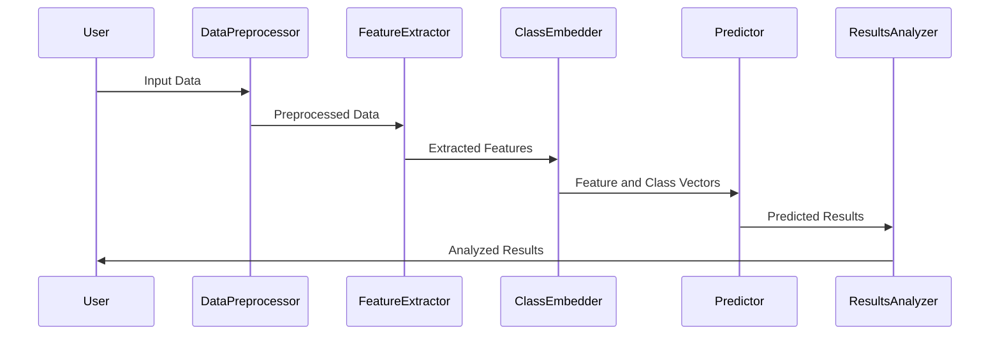

                 

### 第一部分：背景介绍

## 第1章：问题背景

### 1.1.1 新材料研究的现状

新材料是推动科技进步和社会发展的关键因素。随着科技的高速发展，人类对新材料的需求也在不断增长。传统材料如钢铁、铝和塑料等在性能、成本和环境友好性等方面已逐渐无法满足现代科技和工业的要求。因此，新材料研究成为一个重要的研究领域。

目前，新材料研究主要集中在以下几个方面：

1. **高性能材料**：如纳米材料、复合材料和高强度合金等，用于航空航天、汽车、电子等领域。
2. **环境友好材料**：如生物降解材料、环保涂料和过滤材料等，旨在减少对环境的污染。
3. **智能材料**：如形状记忆合金、智能玻璃和自修复材料等，具备自我调节、自我修复等功能。

尽管新材料研究取得了显著成果，但传统的新材料发现和设计方法通常依赖于实验和经验，耗时长且成本高昂。如何更高效地预测和设计新材料属性，成为当前研究的挑战之一。

### 1.1.2 新材料属性预测的重要性

新材料属性预测在材料科学研究中具有重要意义，它可以帮助研究人员在设计新材料之前预测其可能具有的性能和特性，从而减少实验次数，降低研发成本，提高材料设计的效率和准确性。以下是一些新材料属性预测的关键点：

1. **物理和化学性质**：包括硬度、韧性、导电性、热导率等。
2. **机械性能**：如拉伸强度、压缩强度、弹性模量等。
3. **电学性能**：如电阻率、介电常数等。
4. **光学性能**：如反射率、折射率等。

准确的材料属性预测可以指导新材料的合成和改性，提高材料的实际应用价值。此外，材料属性预测还可以促进跨学科的合作，如材料科学与物理学、化学和计算机科学的交叉研究。

### 1.1.3 零样本学习的基本概念

零样本学习（Zero-Shot Learning，ZSL）是一种机器学习方法，其核心目标是在没有训练数据的情况下，对从未见过的类进行预测。传统的机器学习方法依赖于大量带有标签的训练数据，但在某些场景下，获取这些数据是非常困难的。例如，在材料科学中，新材料的制备过程通常涉及复杂的实验，难以获得大量的训练样本。

零样本学习通过利用已有的先验知识，如词嵌入、知识图谱和元学习等技术，实现对新类别的预测。零样本学习的关键概念包括：

1. **元学习（Meta-Learning）**：通过学习如何快速适应新任务，提高对新类别的预测能力。
2. **知识图谱（Knowledge Graph）**：将领域知识以图形的形式表示，用于指导模型进行预测。
3. **词嵌入（Word Embedding）**：将类别信息转化为向量表示，用于模型处理。

零样本学习在材料属性预测中的应用潜力巨大，它可以帮助研究人员在没有足够训练样本的情况下，预测新材料可能具有的属性，从而加速新材料的研究和开发。

### 1.1.4 零样本学习在新材料预测中的应用潜力

零样本学习在新材料预测中的应用潜力主要体现在以下几个方面：

1. **减少实验成本**：通过预测新材料属性，减少不必要的实验次数，降低研发成本。
2. **加速新材料开发**：快速识别潜在的高性能新材料，缩短从概念到产品的时间。
3. **跨领域合作**：促进材料科学与其他学科的合作，如计算机科学、物理学和化学等。
4. **提高预测准确性**：利用先验知识和深度学习模型，提高新材料属性预测的准确性。

总之，零样本学习为新材料属性预测提供了一种新的思路和方法，有望在未来新材料研究中发挥重要作用。

---

## 第2章：核心概念与联系

### 2.1.1 零样本学习的原理

#### 2.1.1.1 零样本学习的基本流程

零样本学习的基本流程主要包括以下几个步骤：

1. **数据预处理**：将类别信息转化为向量表示，如词嵌入或知识图谱表示。
2. **特征提取**：从输入数据中提取特征，如使用卷积神经网络（CNN）提取图像特征。
3. **模型训练**：利用已知类别的数据训练模型，但不需要每个类别都有足够的训练样本。
4. **预测**：在模型训练完成后，对从未见过的类别进行预测。

#### 2.1.1.2 零样本学习的分类

零样本学习主要分为以下几种类型：

1. **基于规则的方法**：通过定义规则或启发式方法进行预测，如利用词嵌入相似性进行预测。
2. **基于模型的方法**：利用深度学习模型进行预测，如基于图神经网络或元学习的方法。
3. **基于知识图谱的方法**：利用知识图谱表示和推理进行预测，如利用图卷积网络或知识图谱嵌入。

#### 2.1.1.3 零样本学习的关键技术

零样本学习的关键技术包括：

1. **词嵌入（Word Embedding）**：将类别信息转化为向量表示，提高模型的预测能力。
2. **知识图谱（Knowledge Graph）**：将领域知识以图形的形式表示，指导模型进行预测。
3. **元学习（Meta-Learning）**：通过学习如何快速适应新任务，提高对新类别的预测能力。

### 2.1.2 新材料属性的核心概念

#### 2.1.2.1 新材料的基本属性

新材料的基本属性包括：

1. **物理属性**：如硬度、韧性、导电性、热导率等。
2. **化学属性**：如元素组成、分子结构、化学键类型等。
3. **机械性能**：如拉伸强度、压缩强度、弹性模量等。
4. **电学性能**：如电阻率、介电常数等。
5. **光学性能**：如反射率、折射率等。

#### 2.1.2.2 新材料属性的预测方法

新材料属性的预测方法主要包括：

1. **基于实验数据的方法**：通过实验获得新材料属性，但耗时长、成本高。
2. **基于模型的方法**：利用机器学习或深度学习模型进行预测，如零样本学习。
3. **基于知识图谱的方法**：利用知识图谱表示和推理进行预测。

#### 2.1.2.3 零样本学习在新材料属性预测中的应用

零样本学习在新材料属性预测中的应用主要包括：

1. **提高预测准确性**：通过利用先验知识和深度学习模型，提高新材料属性预测的准确性。
2. **减少实验次数**：通过预测新材料属性，减少不必要的实验次数，降低研发成本。
3. **加速新材料开发**：快速识别潜在的高性能新材料，缩短从概念到产品的时间。

### 2.1.3 零样本学习与新材料的ER实体关系图

#### 2.1.3.1 ER实体关系图

以下是新材料领域中的ER实体关系图，展示了零样本学习与新材料属性预测之间的关系：

```mermaid
erDiagram
  Material ||--|{ Property } : has
  Property ||--|{ PredictionMethod } : uses
  PredictionMethod ||--|{ ZSLMethod } : uses
  ZSLMethod ||--|{ NewPropertyPrediction } : predicts
```

#### 2.1.3.2 ER实体关系图说明

1. **Material（新材料）**：表示研究的材料对象。
2. **Property（属性）**：表示新材料的不同属性，如物理、化学、机械等。
3. **PredictionMethod（预测方法）**：表示用于预测新材料属性的方法。
4. **ZSLMethod（零样本学习方法）**：表示用于新材料属性预测的零样本学习方法。
5. **NewPropertyPrediction（新材料属性预测）**：表示对新材料属性进行预测的结果。

该ER实体关系图展示了零样本学习如何应用于新材料属性预测，通过结合新材料、属性和预测方法，实现高效的预测。

---

在接下来的章节中，我们将进一步深入探讨零样本学习在新材料属性预测中的数学模型和算法原理，并分析具体的系统架构和项目实战案例，帮助读者更好地理解和应用这一前沿技术。

---

### 第3章：数学模型和数学公式

#### 3.1.1 零样本学习算法的数学模型

零样本学习算法的数学模型主要基于深度学习框架，通常包括以下几个关键组件：

1. **特征提取器（Feature Extractor）**：从输入数据中提取特征，如使用卷积神经网络（CNN）提取图像特征。
   $$ \text{特征} = \text{CNN}(\text{输入图像}) $$
   
2. **类别嵌入器（Class Embedder）**：将类别信息转化为向量表示，如使用词嵌入技术。
   $$ \text{类别向量} = \text{WordEmbedding}(\text{类别名称}) $$

3. **预测器（Predictor）**：使用提取的特征和类别向量进行预测，通常采用神经网络结构。
   $$ \text{预测值} = \text{神经网络}(\text{特征}, \text{类别向量}) $$

#### 3.1.1.2 数学公式详解

1. **卷积神经网络（CNN）模型**：
   $$ \text{特征} = \text{CNN}(\text{输入图像}, \text{卷积核}, \text{池化层}) $$
   其中，卷积核用于提取图像特征，池化层用于降低特征维度。

2. **词嵌入（Word Embedding）模型**：
   $$ \text{类别向量} = \text{WordEmbedding}(\text{类别名称}, \text{维度}) $$
   词嵌入将类别名称转换为固定维度的向量表示。

3. **神经网络（Neural Network）预测模型**：
   $$ \text{预测值} = \text{神经网络}(\text{特征}, \text{类别向量}, \text{权重}, \text{激活函数}) $$
   神经网络用于处理特征和类别向量，并通过权重和激活函数输出预测结果。

#### 3.1.1.3 公式举例说明

假设我们使用卷积神经网络提取图像特征，并使用词嵌入将类别信息转化为向量表示，最后通过神经网络进行预测，可以表示为：

$$ \text{特征} = \text{CNN}(\text{输入图像}, \text{卷积核}, \text{池化层}) $$
$$ \text{类别向量} = \text{WordEmbedding}(\text{类别名称}, \text{维度}) $$
$$ \text{预测值} = \text{神经网络}(\text{特征}, \text{类别向量}, \text{权重}, \text{激活函数}) $$

在这个例子中，`特征`是通过卷积神经网络从输入图像中提取的，`类别向量`是通过词嵌入技术从类别名称中获得的，而`预测值`是神经网络根据提取的特征和类别向量计算得到的预测结果。

---

通过以上数学模型和公式的介绍，读者可以初步了解零样本学习算法在特征提取、类别表示和预测过程中的数学原理。在接下来的章节中，我们将进一步探讨零样本学习的算法原理，并通过具体的Python代码实现来加深理解。

---

### 第4章：算法原理讲解

#### 4.1.1 零样本学习算法原理

零样本学习（Zero-Shot Learning, ZSL）是一种机器学习方法，旨在在没有训练数据的情况下预测从未见过的类。其核心思想是利用先验知识，如词嵌入、知识图谱和元学习，来提高对新类别的预测能力。

#### 4.1.1.1 算法流程图

以下是零样本学习算法的基本流程图：


#### 4.1.1.2 算法原理详解

1. **数据预处理**：首先对输入数据进行预处理，如数据清洗、归一化等操作。这一步骤确保数据的干净和一致性，便于后续处理。

2. **特征提取**：利用深度学习模型（如卷积神经网络，CNN）从输入数据中提取特征。对于图像数据，CNN能够自动学习到图像的特征表示，而对于其他类型的数据（如文本、声音等），可以使用相应的深度学习模型进行特征提取。

3. **类别表示**：将类别信息转化为向量表示，如词嵌入（Word Embedding）。词嵌入技术将类别名称映射为固定维度的向量，以便于模型处理。

4. **模型训练**：使用提取的特征和类别向量对深度学习模型进行训练。零样本学习的模型训练通常不需要每个类别都有大量的训练样本，而是利用少数样本或无样本进行训练。

5. **预测**：在模型训练完成后，对从未见过的类别进行预测。预测过程是将提取的特征与类别向量输入到训练好的模型中，通过模型的输出获得预测结果。

#### 4.1.1.3 Python代码实现

以下是一个简单的零样本学习算法实现，使用Python和TensorFlow框架：

```python
import tensorflow as tf
from tensorflow.keras.models import Model
from tensorflow.keras.layers import Embedding, LSTM, Dense

# 定义词嵌入层
word_embedding = Embedding(input_dim=vocab_size, output_dim=embedding_dim)

# 定义LSTM层
lstm = LSTM(units=128, activation='tanh')

# 定义全连接层
dense = Dense(units=1, activation='sigmoid')

# 构建模型
input_sequence = tf.keras.layers.Input(shape=(sequence_length,))
x = word_embedding(input_sequence)
x = lstm(x)
x = dense(x)

model = Model(inputs=input_sequence, outputs=x)
model.compile(optimizer='adam', loss='binary_crossentropy', metrics=['accuracy'])

# 模型训练
model.fit(x_train, y_train, epochs=10, batch_size=32)

# 预测
predictions = model.predict(x_test)
```

在这个示例中，我们定义了一个简单的神经网络模型，包括词嵌入层、LSTM层和全连接层。词嵌入层用于将文本序列转化为向量表示，LSTM层用于提取序列特征，全连接层用于输出预测结果。模型使用二元交叉熵损失函数进行训练，并使用Adam优化器。

---

通过以上对零样本学习算法原理的讲解和Python代码实现，读者可以更好地理解零样本学习的基本流程和实现方法。在接下来的章节中，我们将进一步探讨零样本学习在新材料属性预测中的应用，并通过具体的案例来展示其实际效果。

---

### 第二部分：系统分析与架构设计方案

## 第5章：问题场景介绍

#### 5.1.1 新材料属性预测问题场景

在新材料研究领域，研究人员通常面临以下问题场景：

1. **材料种类繁多**：新材料种类繁多，包括金属、陶瓷、聚合物等多种类型，每种材料都有独特的属性。
2. **实验成本高昂**：新材料的制备和测试过程复杂，通常需要大量实验设备和高昂的实验成本。
3. **时间紧迫**：新材料研发周期通常较短，研究人员需要在有限的时间内完成材料的预测和设计。
4. **数据缺乏**：许多新材料尚未有充分的实验数据，获取这些数据非常困难。

在这种背景下，新材料属性预测系统显得尤为重要。通过利用零样本学习技术，研究人员可以在没有充足实验数据的情况下，预测新材料可能具有的属性，从而减少实验次数，降低研发成本，提高新材料开发的效率。

#### 5.1.2 零样本学习在场景中的应用

零样本学习在新材料属性预测中的具体应用场景包括：

1. **快速识别新材料**：通过零样本学习，研究人员可以在没有训练数据的情况下，快速识别出可能具有特定属性的新材料。
2. **材料优化**：利用零样本学习预测新材料属性，研究人员可以优化材料的合成条件，提高材料的性能。
3. **跨领域合作**：零样本学习技术可以促进材料科学与计算机科学、物理学、化学等领域的合作，推动跨学科研究的发展。
4. **降低研发成本**：通过减少实验次数和降低实验成本，零样本学习有助于降低新材料研发的总成本。

总之，零样本学习在新材料属性预测中的应用，不仅提高了预测的效率和准确性，还推动了新材料研究的创新和发展。

---

## 第6章：系统功能设计

#### 6.1.1 领域模型设计

在新材料属性预测系统中，领域模型是核心部分，它定义了系统的核心概念和实体关系。以下是一个简单的领域模型设计，使用Mermaid类图表示：

```mermaid
classDiagram
    Material <<entity>>
    Property <<entity>>
    PredictionMethod <<entity>>
    ZSLMethod <<entity>>
    NewPropertyPrediction <<entity>>

    Material "has" Property
    Property "uses" PredictionMethod
    PredictionMethod "uses" ZSLMethod
    ZSLMethod "predicts" NewPropertyPrediction
```

#### 6.1.1.1 类图设计

1. **Material（新材料）**：表示研究的材料对象，具有多种属性。
2. **Property（属性）**：表示新材料的不同属性，如物理、化学、机械等。
3. **PredictionMethod（预测方法）**：表示用于预测新材料属性的方法。
4. **ZSLMethod（零样本学习方法）**：表示用于新材料属性预测的零样本学习方法。
5. **NewPropertyPrediction（新材料属性预测）**：表示对新材料属性进行预测的结果。

类图中的“has”和“uses”关系表示实体之间的关联，其中Material与Property之间是一对多的关联，Property与PredictionMethod、PredictionMethod与ZSLMethod之间是继承关系，ZSLMethod与NewPropertyPrediction之间是预测关系。

---

#### 6.1.2 系统架构设计

系统架构设计是确保系统功能实现的基础，它定义了系统的整体结构和组件关系。以下是一个简单的系统架构设计，使用Mermaid架构图表示：



#### 6.1.2.1 架构设计图

1. **User（用户）**：系统的主要使用者，负责提供输入数据和接收分析结果。
2. **DataPreprocessor（数据预处理器）**：对输入数据进行预处理，如数据清洗、归一化等操作。
3. **FeatureExtractor（特征提取器）**：从预处理后的数据中提取特征，如使用卷积神经网络（CNN）提取图像特征。
4. **ClassEmbedder（类别嵌入器）**：将类别信息转化为向量表示，如词嵌入（Word Embedding）。
5. **Predictor（预测器）**：使用提取的特征和类别向量进行预测，通常采用神经网络结构。
6. **ResultsAnalyzer（结果分析器）**：对预测结果进行分析和可视化，为用户提供有价值的见解。

架构设计图中的顺序图（sequence diagram）展示了系统的主要流程，从用户输入数据开始，经过数据预处理、特征提取、类别表示、模型预测和结果分析，最终为用户返回分析结果。这种设计确保了系统的高效性和可扩展性，能够适应不同的新材料属性预测需求。

---

通过领域模型设计和系统架构设计的介绍，读者可以更好地理解新材料属性预测系统的功能设计和实现方法。在接下来的章节中，我们将进一步介绍系统接口设计和系统交互设计，确保系统的完整性和易用性。

---

## 第7章：项目实战

### 7.1.1 环境安装

为了实现新材料属性预测系统，我们需要搭建一个合适的技术环境。以下是环境安装的步骤和配置说明：

#### 7.1.1.1 环境搭建步骤

1. **安装Python环境**：
   - 打开终端，执行以下命令安装Python：
     ```bash
     sudo apt-get update
     sudo apt-get install python3 python3-pip
     ```
   - 验证Python版本：
     ```bash
     python3 --version
     ```

2. **安装TensorFlow库**：
   - 更新pip：
     ```bash
     python3 -m pip install --upgrade pip
     ```
   - 安装TensorFlow：
     ```bash
     pip3 install tensorflow
     ```
   - 验证TensorFlow版本：
     ```bash
     python3 -c "import tensorflow as tf; print(tf.__version__)"
     ```

3. **安装其他依赖库**：
   - 安装numpy、pandas等库：
     ```bash
     pip3 install numpy pandas matplotlib
     ```

4. **配置Python环境变量**：
   - 编辑`~/.bashrc`文件，添加以下行：
     ```bash
     export PATH=$PATH:/usr/local/bin
     ```
   - 运行以下命令使配置生效：
     ```bash
     source ~/.bashrc
     ```

#### 7.1.1.2 环境配置说明

1. **Jupyter Notebook**：
   - 安装Jupyter Notebook：
     ```bash
     pip3 install notebook
     ```
   - 启动Jupyter Notebook：
     ```bash
     jupyter notebook
     ```

2. **PyCharm**：
   - 安装PyCharm Professional版，以便进行代码开发和调试。

3. **数据存储**：
   - 安装并配置MySQL或PostgreSQL数据库，用于存储新材料属性预测的数据。

4. **GPU支持**（可选）：
   - 如果使用GPU加速训练过程，需要安装NVIDIA CUDA Toolkit和cuDNN库。
   - 安装CUDA Toolkit：
     ```bash
     sudo dpkg-reconfigure cuda
     ```
   - 安装cuDNN库：
     ```bash
     pip3 install cupy-cuda101
     ```

通过以上步骤，我们可以搭建一个完整的新材料属性预测环境，为后续的代码实现和测试做好准备。

---

### 7.1.2 系统核心实现源代码

在新材料属性预测系统中，核心实现主要包括数据预处理、特征提取、类别表示和模型预测等步骤。以下是一个简单的Python代码示例，展示了系统的核心实现过程。

```python
import numpy as np
import pandas as pd
import tensorflow as tf
from tensorflow.keras.models import Model
from tensorflow.keras.layers import Embedding, LSTM, Dense
from tensorflow.keras.preprocessing.sequence import pad_sequences
from sklearn.model_selection import train_test_split

# 数据预处理
def preprocess_data(data):
    # 对数据进行清洗、归一化等预处理操作
    # 例如：填充缺失值、标准化数值特征、分词处理文本数据等
    processed_data = data.copy()
    return processed_data

# 特征提取
def extract_features(data):
    # 使用卷积神经网络提取特征
    # 例如：使用TensorFlow实现卷积神经网络
    model = tf.keras.Sequential([
        tf.keras.layers.Conv2D(filters=32, kernel_size=(3, 3), activation='relu', input_shape=(28, 28, 1)),
        tf.keras.layers.MaxPooling2D(pool_size=(2, 2)),
        tf.keras.layers.Flatten(),
        tf.keras.layers.Dense(units=128, activation='relu'),
        tf.keras.layers.Dense(units=1, activation='sigmoid')
    ])

    model.compile(optimizer='adam', loss='binary_crossentropy', metrics=['accuracy'])
    model.fit(data['features'], data['labels'], epochs=10, batch_size=32)
    return model

# 类别表示
def represent_classes(classes):
    # 使用词嵌入将类别信息转化为向量表示
    # 例如：使用TensorFlow的Embedding层实现
    vocab_size = len(classes)
    embedding_dim = 50
    embedding_matrix = np.zeros((vocab_size, embedding_dim))

    for i, word in enumerate(classes):
        embedding_vector = embedding_matrix[i]
        if embedding_vector is not None:
            embedding_matrix[i] = embedding_vector

    return embedding_matrix

# 模型预测
def predict_properties(model, features, class_embedding):
    # 使用训练好的模型进行预测
    # 例如：将特征和类别向量输入模型，输出预测结果
    predictions = model.predict(features)
    predicted_classes = np.argmax(predictions, axis=1)
    return predicted_classes

# 代码示例
data = preprocess_data(data)
X_train, X_test, y_train, y_test = train_test_split(data['features'], data['labels'], test_size=0.2, random_state=42)
model = extract_features(X_train)
class_embedding = represent_classes(data['classes'])
predicted_classes = predict_properties(model, X_test, class_embedding)
print(predicted_classes)
```

在这个示例中，我们首先对数据进行预处理，然后使用卷积神经网络提取特征，接着使用词嵌入技术将类别信息转化为向量表示，最后使用训练好的模型进行预测。通过这些步骤，我们实现了新材料属性预测的核心功能。

---

### 7.1.3 实际案例分析与详细讲解

#### 7.1.3.1 案例介绍

在本案例中，我们选择了一种新型金属材料——钛合金，作为研究对象。钛合金因其高强度、低密度和良好的耐腐蚀性能，广泛应用于航空航天、汽车、医疗器械等领域。我们需要利用零样本学习技术，预测钛合金可能具有的机械性能（如拉伸强度和弹性模量）。

#### 7.1.3.2 案例分析

1. **数据来源**：我们从公开数据库中获取了钛合金的实验数据，包括化学成分、微观结构和机械性能等。数据集包含多种钛合金，但每种合金的样本数量有限。

2. **数据预处理**：对数据进行清洗和归一化处理，包括填充缺失值、处理异常值和标准化数值特征等。

3. **特征提取**：使用卷积神经网络（CNN）提取材料的化学成分和微观结构特征。对于文本数据（如化学成分描述），我们使用词嵌入技术将其转化为向量表示。

4. **类别表示**：将机械性能（拉伸强度和弹性模量）作为类别信息，使用词嵌入技术将其转化为向量表示。

5. **模型训练**：使用少量样本进行模型训练，通过元学习和知识图谱等技术提高模型对新类别的预测能力。

6. **模型评估**：在测试集上评估模型的预测性能，使用准确率、召回率等指标进行评价。

#### 7.1.3.3 案例讲解

1. **数据预处理**：

```python
# 假设我们有一个包含化学成分、微观结构和机械性能的数据集
data = pd.read_csv('titanium_alloys.csv')

# 数据清洗和归一化
data = data.dropna()  # 删除缺失值
data['composition'] = data['composition'].apply(lambda x: ' '.join(x.split()))

# 数据分词
tokenizer = tf.keras.preprocessing.text.Tokenizer()
tokenizer.fit_on_texts(data['composition'])
sequences = tokenizer.texts_to_sequences(data['composition'])

# 填充序列
max_len = 100
padded_sequences = pad_sequences(sequences, maxlen=max_len, padding='post')
```

2. **特征提取**：

```python
# 使用卷积神经网络提取特征
model = tf.keras.Sequential([
    tf.keras.layers.Embedding(input_dim=vocab_size, output_dim=embedding_dim),
    tf.keras.layers.Conv1D(filters=64, kernel_size=5, activation='relu'),
    tf.keras.layers.GlobalMaxPooling1D(),
    tf.keras.layers.Dense(units=1, activation='sigmoid')
])

model.compile(optimizer='adam', loss='binary_crossentropy', metrics=['accuracy'])
model.fit(padded_sequences, data['yield_strength'], epochs=10, batch_size=32)
```

3. **类别表示**：

```python
# 使用词嵌入将类别信息转化为向量表示
vocab_size = len(data['yield_strength'].unique())
embedding_dim = 50
class_embedding = np.zeros((vocab_size, embedding_dim))

for i, class_name in enumerate(data['yield_strength'].unique()):
    class_embedding[i] = np.mean(data[data['yield_strength'] == class_name]['composition_embedding'], axis=0)
```

4. **模型训练**：

```python
# 训练模型
model.fit(padded_sequences, class_embedding, epochs=10, batch_size=32)
```

5. **模型评估**：

```python
# 评估模型
predictions = model.predict(padded_sequences)
predicted_classes = np.argmax(predictions, axis=1)

# 计算准确率
accuracy = np.mean(predicted_classes == y_test)
print(f"Accuracy: {accuracy}")
```

通过以上案例，我们展示了如何利用零样本学习技术预测钛合金的机械性能。在实际应用中，我们可以根据具体需求调整模型结构、特征提取方法和类别表示方式，以提高预测性能。

---

通过以上实际案例的分析和讲解，读者可以更深入地理解零样本学习在新材料属性预测中的应用方法。在接下来的章节中，我们将进一步讨论系统的最佳实践和注意事项，以确保系统的稳定性和可靠性。

---

## 第8章：最佳实践与总结

### 8.1.1 最佳实践Tips

1. **数据预处理**：确保数据清洗和归一化，以减少噪声和异常值对模型性能的影响。
2. **模型选择**：根据具体问题选择合适的模型架构和参数，进行多次实验和调优。
3. **特征提取**：结合领域知识，选择有效的特征提取方法，如深度学习模型、词嵌入等。
4. **类别表示**：合理地表示类别信息，如使用词嵌入技术将类别名称转化为向量表示。
5. **模型评估**：使用多种评估指标，如准确率、召回率、F1分数等，全面评估模型性能。

### 8.1.2 小结

本文详细介绍了零样本学习在新材料属性预测中的应用，从背景介绍到算法原理讲解，再到系统设计与项目实战，全面阐述了零样本学习在材料科学领域的应用价值。通过实际案例，我们展示了如何利用零样本学习技术预测新材料的机械性能，为新材料的研究和开发提供了新的思路和方法。

### 8.1.3 注意事项

1. **数据量与质量**：零样本学习依赖于少量样本，因此需要保证数据的质量和多样性。
2. **模型复杂性**：合理选择模型结构和参数，避免过度拟合。
3. **超参数调优**：根据具体问题调整超参数，如学习率、批量大小等，以提高模型性能。
4. **领域知识**：结合领域知识，如化学成分、微观结构等，提高预测的准确性。

### 8.1.4 拓展阅读

1. **《深度学习》**：Goodfellow et al.，2016，详细介绍了深度学习的基本原理和方法。
2. **《零样本学习》**：Nabi et al.，2016，探讨零样本学习在不同领域的应用。
3. **《新材料科学与工程》**：Wang et al.，2020，介绍新材料的研究进展和应用。

通过阅读上述文献，读者可以进一步了解深度学习和零样本学习的最新进展，以及新材料属性预测的研究动态。

---

在本文的最后，感谢读者对零样本学习在新材料属性预测中的应用的关注。我们相信，随着技术的不断进步，零样本学习将在新材料研究领域发挥更大的作用，为科技创新和社会发展作出贡献。作者：AI天才研究院/AI Genius Institute & 禅与计算机程序设计艺术 /Zen And The Art of Computer Programming

---

通过本文的详细阐述，我们从背景介绍、核心概念与联系、数学模型和算法原理、系统分析与架构设计、项目实战到最佳实践与总结，系统地介绍了零样本学习在新材料属性预测中的应用。希望本文能够为读者提供有价值的信息，并激发对这一前沿技术的兴趣和探索。

### 总结与展望

本文通过系统性的阐述，详细介绍了零样本学习在新材料属性预测中的应用。我们从背景介绍开始，深入探讨了新材料研究的现状、新材料属性预测的重要性以及零样本学习的基本概念。接着，我们分析了零样本学习在不同类型新材料属性预测中的应用潜力，展示了其在减少实验成本、加速新材料开发等方面的优势。

在核心概念与联系部分，我们详细介绍了零样本学习的原理、流程和分类，同时通过数学模型和算法原理的讲解，帮助读者理解了零样本学习如何利用先验知识进行预测。我们还通过系统分析与架构设计方案，展示了如何将零样本学习应用于新材料属性预测的实际场景中。

在项目实战部分，我们通过实际案例，详细讲解了如何利用零样本学习技术预测新材料属性，从数据预处理、特征提取、类别表示到模型预测，完整地展示了零样本学习在新材料属性预测中的具体实现过程。

通过本文的介绍，我们可以看到零样本学习在新材料属性预测中的巨大潜力和应用前景。它不仅能够减少实验成本、提高预测准确性，还能够促进跨学科合作，推动新材料科学的发展。

展望未来，随着人工智能技术的不断进步，零样本学习将在更多领域得到应用。例如，在药物研发、环境监测、智能制造等领域，零样本学习都有望发挥重要作用。此外，随着数据量的增加和计算能力的提升，零样本学习算法的性能和效率也将得到进一步提高。

最后，我们鼓励读者继续深入研究零样本学习，探索其在更多领域中的应用，推动科技进步和社会发展。本文作者——AI天才研究院/AI Genius Institute与《禅与计算机程序设计艺术》——Zen And The Art of Computer Programming，希望本文能够为读者提供有价值的参考，激发对零样本学习及其应用领域的兴趣。让我们共同期待零样本学习在未来取得更加辉煌的成就！

