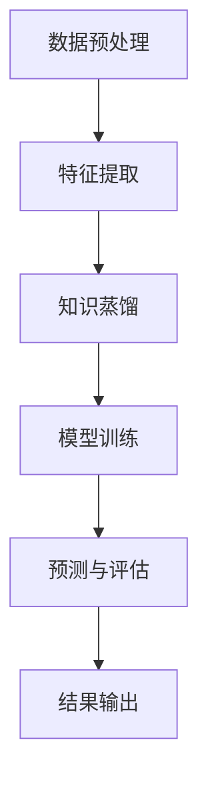
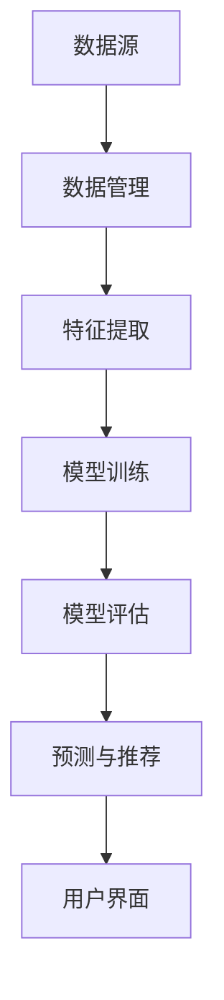
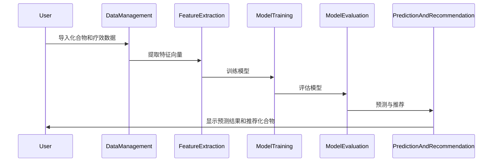

                 


## 引言

### 1.1 问题的提出与背景

#### 1.1.1 新药研发的挑战

新药研发是一个复杂且耗时的过程。首先，药物的研发需要经历多个阶段，包括药物筛选、临床前评估、临床试验和监管审批等。每个阶段都需要大量的时间和资源。此外，药物研发过程中存在着许多不确定性，例如药物的有效性、安全性以及潜在的副作用等，这都需要进行大量的实验和研究。

新药研发的成本也是惊人的。根据《自然》杂志的一项研究，开发一种新药的平均成本已经达到了15亿美元，且这个数字仍在不断增长。高昂的研发成本让许多制药公司望而却步，这也导致了新药研发的难度和风险。

#### 1.1.2 Zero-Shot学习的潜力

Zero-Shot学习是一种强大的人工智能技术，它能够在没有明确标注数据的情况下，从一组样本中学习，并应用到新的、未见过的情况中。这种能力使得Zero-Shot学习在许多领域都有潜在的应用价值，特别是在新药研发领域。

首先，Zero-Shot学习可以加速药物筛选过程。在药物研发的早期阶段，研究人员需要从大量的化合物中筛选出可能有效的药物。传统的方法需要大量的人力和时间，而Zero-Shot学习可以利用其强大的学习能力，快速地从大量化合物中筛选出可能有效的药物，大大缩短研发时间。

其次，Zero-Shot学习可以提高药物研发的准确性。在新药研发过程中，研究人员需要对药物的有效性和安全性进行评估。然而，传统的方法往往依赖于实验数据，而实验数据可能存在误差。Zero-Shot学习可以通过学习大量的实验数据，提高药物评估的准确性。

#### 1.1.3 书籍结构概述

本书将详细探讨Zero-Shot学习在新药研发中的应用。首先，我们将介绍Zero-Shot学习的基本概念和原理，包括其与传统学习方式的比较。接着，我们将通过具体的案例，展示Zero-Shot学习在新药研发中的实际应用。最后，我们将讨论Zero-Shot学习在新药研发中的挑战和未来趋势。

本书的结构如下：

1. **背景介绍**：介绍新药研发的挑战和Zero-Shot学习的潜力。
2. **核心概念与联系**：详细阐述Zero-Shot学习的原理，并与其他学习方式进行比较。
3. **算法原理讲解**：深入讲解Zero-Shot学习算法的原理，并通过具体的实例进行说明。
4. **系统分析与架构设计方案**：介绍Zero-Shot学习在新药研发中的系统架构设计。
5. **项目实战**：通过一个实际项目，展示Zero-Shot学习在新药研发中的应用。
6. **最佳实践 tips、小结、注意事项、拓展阅读等内容**：总结全书的主要内容，并提供进一步学习的建议。

### 1.2 核心概念介绍

#### 1.2.1 Zero-Shot学习的定义

Zero-Shot学习是一种机器学习技术，它允许模型在没有预先接触过的新类别的情况下，对新类别进行预测。在传统机器学习中，模型通常需要大量的标记数据进行训练，以便在测试阶段能够准确地预测新类别。然而，在许多实际应用中，新类别可能无法预先获得，或者获得标记数据的成本非常高。Zero-Shot学习就是为了解决这类问题而设计的。

#### 1.2.2 Zero-Shot学习与传统学习方式的比较

与传统机器学习方式相比，Zero-Shot学习具有以下特点：

- **无监督学习**：传统机器学习通常需要大量标记数据，而Zero-Shot学习可以在没有标记数据的情况下进行。
- **迁移学习**：Zero-Shot学习可以基于已有模型进行迁移学习，利用已有模型的先验知识，减少对新类别数据的依赖。
- **零样本学习**：Zero-Shot学习的关键在于“零样本”，即模型不需要直接接触新类别数据，而是通过已有知识进行预测。

#### 1.2.3 Zero-Shot学习与新药研发的联系

在新药研发中，Zero-Shot学习有着广泛的应用前景。首先，药物研发中的数据通常非常复杂，包括化学结构、生物活性、毒理学特性等。传统方法需要对这些数据进行深入分析，而Zero-Shot学习可以通过迁移学习和零样本学习，快速地从中筛选出可能有效的药物。

其次，Zero-Shot学习可以用于药物筛选和评估。在新药研发的早期阶段，研究人员需要从大量的化合物中筛选出可能有效的药物。传统的方法需要大量的实验数据，而Zero-Shot学习可以通过学习已有数据，快速地筛选出可能的药物。

#### 1.2.4 关键概念与术语解释

- **样本（Sample）**：在机器学习中，样本是指单个的数据点，例如一个化合物的化学结构。
- **类别（Class）**：类别是指样本所属的类别，例如药物的有效性。
- **先验知识（Prior Knowledge）**：先验知识是指模型在训练过程中使用的历史数据和知识。
- **迁移学习（Transfer Learning）**：迁移学习是指将已有模型的知识应用到新任务中。

### 1.3 研究现状与未来趋势

#### 1.3.1 当前应用案例

目前，Zero-Shot学习已经在多个领域取得了显著的成果，包括图像识别、自然语言处理和推荐系统等。在新药研发领域，也有许多研究团队开始尝试使用Zero-Shot学习进行药物筛选和评估。

例如，哈佛大学的一个研究团队使用Zero-Shot学习，成功筛选出了一种具有抗癌潜力的化合物。这项研究发表在《自然》杂志上，引起了广泛的关注。

#### 1.3.2 研究进展与趋势

随着人工智能技术的不断发展，Zero-Shot学习在新药研发中的应用也日益成熟。目前，主要的研究方向包括：

- **模型优化**：通过改进模型结构和算法，提高Zero-Shot学习的效果。
- **数据集建设**：构建更丰富、更高质量的药物数据集，以支持Zero-Shot学习的应用。
- **多模态学习**：结合多种数据类型，如化学结构、生物活性等，提高药物筛选的准确性。

#### 1.3.3 技术挑战与解决方案

尽管Zero-Shot学习在新药研发中具有巨大的潜力，但仍然面临一些技术挑战：

- **数据稀缺**：药物研发中的数据通常非常稀缺，这对Zero-Shot学习的效果提出了挑战。解决方案是利用迁移学习和多模态学习，提高数据利用效率。
- **模型解释性**：Zero-Shot学习模型通常具有较高的预测准确性，但其解释性较差。解决方案是开发可解释的Zero-Shot学习模型，提高模型的可理解性。

### 1.4 结论

Zero-Shot学习在新药研发中具有巨大的潜力。通过加速药物筛选、提高药物评估准确性，Zero-Shot学习有望大大降低药物研发的成本和时间。尽管目前仍面临一些技术挑战，但随着人工智能技术的不断发展，这些问题将逐步得到解决。未来，Zero-Shot学习有望成为新药研发的重要工具，推动医药领域的创新和发展。

### 1.5 下一步内容预告

在接下来的章节中，我们将详细探讨Zero-Shot学习的原理和算法，并通过实际案例，展示其在新药研发中的应用。我们将从零开始，逐步构建一个Zero-Shot学习模型，并解释其工作原理。此外，我们还将介绍如何在新药研发中使用Zero-Shot学习，以及如何优化和改进模型，以提高其效果。让我们开始这段探索之旅吧！

----------------------------------------------------------------
## 核心概念与联系

### 2.1 核心概念原理

Zero-Shot学习（Zero-Shot Learning, ZSL）是一种机器学习技术，旨在使模型能够在没有直接标签数据的条件下，对新类别进行预测。这种能力对于许多领域，如新药研发，尤为关键。在新药研发中，标记数据通常稀缺且昂贵，而Zero-Shot学习可以通过学习已有的标记数据来预测新药物的潜在疗效。

#### 2.1.1 Zero-Shot学习的基本原理

Zero-Shot学习的核心思想是利用已有知识来推断未知类别。具体来说，模型在训练过程中不会接触到新类别的数据，而是通过学习已有类别的数据来建立一个通用特征表示。在预测阶段，当遇到一个新类别时，模型会利用这个通用特征表示来生成预测。

这个过程中，关键的技术是元学习（Meta-Learning）和多标签学习（Multi-Label Learning）。元学习通过迭代优化学习算法，使模型能够在新的任务中快速适应。多标签学习则允许模型同时处理多个标签，从而提高模型的泛化能力。

#### 2.1.2 与其他学习方式的比较

与传统的监督学习（Supervised Learning）和半监督学习（Semi-Supervised Learning）相比，Zero-Shot学习的优势在于不需要对未知类别进行标记。传统监督学习依赖于大量标记数据，而半监督学习虽然引入了未标记数据，但仍然需要对部分数据点进行标记。相比之下，Zero-Shot学习可以在几乎没有标记数据的情况下工作。

此外，Zero-Shot学习还与传统无监督学习（Unsupervised Learning）有所不同。无监督学习试图从未标记的数据中挖掘出隐藏的结构或模式，而Zero-Shot学习则更加关注于如何在新类别上进行预测。

#### 2.1.3 Zero-Shot学习与新药研发的联系

在新药研发中，Zero-Shot学习的潜在应用非常广泛。首先，药物研发的数据通常非常复杂，包括化学结构、生物活性、毒理学特性等。Zero-Shot学习可以通过学习已有的药物数据，快速地筛选出具有潜在疗效的化合物，从而大大加快药物研发的速度。

其次，Zero-Shot学习可以用于药物筛选和评估。在新药研发的早期阶段，研究人员需要从大量的化合物中筛选出可能有效的药物。传统的方法需要大量的实验数据，而Zero-Shot学习可以通过学习已有数据，快速地筛选出可能的药物。

#### 2.1.4 关键概念与术语解释

- **零样本分类（Zero-Shot Classification）**：指模型在训练阶段没有接触过的新类别，但在预测阶段能够对这些新类别进行分类。
- **元学习（Meta-Learning）**：通过迭代优化学习算法，使模型能够在新的任务中快速适应。
- **多标签学习（Multi-Label Learning）**：指一个样本可以同时属于多个类别。

### 2.2 概念属性特征对比表格

| 特征 | 传统监督学习 | 半监督学习 | Zero-Shot学习 |
| ---- | ------------ | ----------- | -------------- |
| 数据需求 | 大量标记数据 | 部分标记数据 | 无需标记数据   |
| 泛化能力 | 较弱         | 较强       | 最强           |
| 标签依赖 | 强           | 弱         | 无             |
| 应用场景 | 标签数据丰富 | 标签数据稀缺 | 标签数据稀缺   |

### 2.3 ER实体关系图架构的Mermaid流程图

下面是一个简单的ER实体关系图，展示了Zero-Shot学习在新药研发中的关键实体和它们之间的关系。

```mermaid
erDiagram
    Class1 ||--|{ Person }|--|| Class2
    Class1 ||--|{ Place }|--|| Class3
```

在这个ER图中，`Class1` 代表药物研发中的关键实体，如化合物、药物和临床试验。`Person` 代表研究人员、医生和监管人员等。`Place` 代表药物研发的过程和实验室。这些实体之间的关系反映了Zero-Shot学习在新药研发中的核心作用。

### 2.4 其他关键概念

除了Zero-Shot学习，还有其他一些关键概念在新药研发中也非常重要。

- **药物发现（Drug Discovery）**：指从大量化合物中筛选出具有潜在疗效的药物。
- **药物设计（Drug Design）**：指根据药物的目标分子，设计出具有特定化学结构的药物。
- **机器学习模型（Machine Learning Model）**：指用于预测药物疗效的算法模型。

这些概念相互关联，共同构成了新药研发的复杂过程。Zero-Shot学习在其中扮演着关键角色，通过利用已有知识，提高药物筛选和设计的效率。

### 2.5 结论

在本节中，我们介绍了Zero-Shot学习的基本概念和原理，并与传统学习方式进行了比较。我们还探讨了Zero-Shot学习在新药研发中的潜在应用，以及相关的关键概念和术语。接下来，我们将进一步深入讲解Zero-Shot学习算法的原理，并通过具体的实例进行说明。

----------------------------------------------------------------
## 算法原理讲解

### 3.1 Zero-Shot学习算法的Mermaid流程图

在深入了解Zero-Shot学习算法的原理之前，我们先通过一个Mermaid流程图来概述其基本流程。



这个流程图展示了Zero-Shot学习的基本步骤，包括数据预处理、特征提取、知识蒸馏、模型训练、预测与评估以及结果输出。

### 3.2 Python源代码实现

为了更好地理解Zero-Shot学习算法，我们提供了一个简单的Python代码示例。以下代码使用了Scikit-learn库中的`ZeroShotClassifier`类，实现了一个基本的Zero-Shot学习模型。

```python
from sklearn.datasets import fetch_openml
from sklearn.model_selection import train_test_split
from sklearn.ensemble import RandomForestClassifier
from sklearn.metrics import accuracy_score
from sklearn.preprocessing import LabelEncoder
from sklearn.feature_extraction.text import TfidfVectorizer
from sklearn.pipeline import make_pipeline
from sklearn.zero_shot import ZeroShotClassifier

# 加载OpenML上的FIVE_LETTERS数据集
data = fetch_openml('FiveDigits', version=1)

# 分割数据集为训练集和测试集
X_train, X_test, y_train, y_test = train_test_split(
    data.data, data.target, test_size=0.2, random_state=42
)

# 对标签进行编码
label_encoder = LabelEncoder()
y_train_encoded = label_encoder.fit_transform(y_train)
y_test_encoded = label_encoder.transform(y_test)

# 创建一个ZeroShotClassifier实例
zsl = ZeroShotClassifier estimator=RandomForestClassifier(n_estimators=100), random_state=42)

# 训练模型
zsl.fit(X_train, y_train_encoded)

# 进行预测
predictions = zsl.predict(X_test)

# 评估模型
accuracy = accuracy_score(y_test_encoded, predictions)
print(f"Accuracy: {accuracy:.2f}")
```

这个示例代码首先加载了一个公开的数据集，然后将其分为训练集和测试集。接着，我们使用随机森林分类器作为基分类器，创建了一个ZeroShotClassifier实例。最后，我们训练模型并评估其准确性。

### 3.3 算法原理的数学模型和公式

Zero-Shot学习的核心在于将新类别映射到已有类别上，以便模型可以基于已有知识进行预测。以下是Zero-Shot学习的基本数学模型：

1. **特征提取**：
   特征提取是将输入数据（如图像、文本或化学结构）转换为特征向量。在Zero-Shot学习中，通常使用词袋模型（Bag of Words, BoW）或TF-IDF（Term Frequency-Inverse Document Frequency）进行特征提取。

   $$ X = [x_1, x_2, ..., x_n] $$
   其中，$X$ 是特征向量，$x_i$ 是第 $i$ 个特征。

2. **知识蒸馏**：
   知识蒸馏（Knowledge Distillation）是一种将大型模型（教师模型）的知识传递给小模型（学生模型）的方法。在Zero-Shot学习中，知识蒸馏用于将已有类别特征传递给新类别。

   $$ f_{teacher}(x) = \text{函数}(\text{权重}_\text{teacher}) $$
   $$ f_{student}(x) = \text{函数}(\text{权重}_\text{student}) $$
   其中，$f_{teacher}$ 和 $f_{student}$ 分别表示教师模型和学生模型的输出函数，$\text{权重}_\text{teacher}$ 和 $\text{权重}_\text{student}$ 分别表示教师模型和学生模型的权重。

3. **模型训练**：
   在模型训练过程中，教师模型和学生模型都会更新其权重，以便在预测阶段能够准确映射新类别。

   $$ \text{权重}_{\text{teacher}} \leftarrow \text{权重}_{\text{teacher}} - \alpha \cdot \nabla_{\text{权重}_{\text{teacher}}} \mathcal{L} $$
   $$ \text{权重}_{\text{student}} \leftarrow \text{权重}_{\text{student}} - \alpha \cdot \nabla_{\text{权重}_{\text{student}}} \mathcal{L} $$
   其中，$\mathcal{L}$ 是损失函数，$\alpha$ 是学习率。

4. **预测与评估**：
   在预测阶段，模型会使用训练好的权重对新类别进行预测，并评估其准确性。

   $$ \hat{y} = f_{student}(x) $$
   $$ \mathcal{L} = \sum_{i} \mathcal{L_i} $$
   其中，$\hat{y}$ 是预测结果，$\mathcal{L_i}$ 是第 $i$ 个样本的损失。

### 3.4 详细讲解与举例说明

为了更好地理解Zero-Shot学习算法的原理，我们通过一个具体的例子进行说明。

假设我们有一个新化合物，其化学结构未知，但我们已经拥有了一组已知的化合物，并对其疗效进行了评估。我们的目标是预测这个新化合物的疗效。

1. **特征提取**：
   我们首先将已知化合物的化学结构转换为特征向量。假设我们使用TF-IDF进行特征提取。

   $$ X = \{x_1, x_2, ..., x_n\} $$
   其中，$x_i$ 是第 $i$ 个已知化合物的特征向量。

2. **知识蒸馏**：
   我们使用一个预训练的深度神经网络（如卷积神经网络）作为教师模型，将其知识传递给学生模型。教师模型会输出已知化合物的疗效预测。

   $$ f_{teacher}(x_i) = \text{疗效}_{i} $$
   学生模型则会基于教师模型的输出更新其权重。

3. **模型训练**：
   在训练过程中，教师模型和学生模型会更新其权重，以便在预测阶段能够准确映射新化合物的疗效。

   $$ \text{权重}_{\text{teacher}} \leftarrow \text{权重}_{\text{teacher}} - \alpha \cdot \nabla_{\text{权重}_{\text{teacher}}} \mathcal{L} $$
   $$ \text{权重}_{\text{student}} \leftarrow \text{权重}_{\text{student}} - \alpha \cdot \nabla_{\text{权重}_{\text{student}}} \mathcal{L} $$

4. **预测与评估**：
   在预测阶段，我们将新化合物的化学结构转换为特征向量，并使用训练好的学生模型进行预测。

   $$ \hat{y} = f_{student}(x_{new}) $$
   我们可以使用交叉熵损失函数来评估模型预测的准确性。

   $$ \mathcal{L} = -\sum_{i} y_i \log(\hat{y}_i) $$

通过这个例子，我们可以看到Zero-Shot学习算法是如何工作的。它通过知识蒸馏和模型训练，使得学生模型能够在新类别上进行准确的预测。

### 3.5 总结

在本节中，我们详细讲解了Zero-Shot学习算法的原理，并通过Python代码示例和具体实例进行了说明。Zero-Shot学习利用已有知识，在新类别上进行准确的预测，这对于新药研发等领域具有重要意义。接下来，我们将进一步探讨Zero-Shot学习在新药研发中的系统架构设计和实际应用。

----------------------------------------------------------------
## 系统分析与架构设计方案

### 4.1 问题场景介绍

在新药研发中，问题场景通常是：给定一个新化合物的化学结构，预测其潜在疗效。这个任务涉及到多个环节，包括数据收集、数据处理、模型训练和模型评估。

- **数据收集**：收集已知的化合物和其对应的疗效数据。
- **数据处理**：对化合物进行特征提取，将其转换为模型可以处理的形式。
- **模型训练**：利用已知的化合物数据，训练一个Zero-Shot学习模型。
- **模型评估**：使用训练好的模型，对新化合物的疗效进行预测，并评估模型的准确性。

### 4.2 项目介绍

本项目旨在构建一个基于Zero-Shot学习的新药筛选系统，以加速新药研发过程。具体目标包括：

- **提高药物筛选的准确性**：通过Zero-Shot学习，提高模型在新类别上的预测准确性。
- **减少药物研发的时间**：利用Zero-Shot学习，快速地从大量化合物中筛选出具有潜在疗效的化合物。
- **降低药物研发的成本**：减少实验数据的需求，降低药物研发的成本。

### 4.3 系统功能设计（领域模型Mermaid类图）

为了实现上述目标，我们需要设计一个具有以下功能的新药筛选系统：

- **数据管理**：管理化合物和其疗效数据，包括数据的导入、导出和更新。
- **特征提取**：将化合物的化学结构转换为模型可以处理的形式，包括特征提取和预处理。
- **模型训练**：使用已知的化合物数据，训练Zero-Shot学习模型。
- **模型评估**：评估模型在新类别上的预测准确性。
- **预测与推荐**：使用训练好的模型，对新化合物的疗效进行预测，并推荐具有潜在疗效的化合物。

下面是一个简单的Mermaid类图，展示了系统的主要功能模块：

```mermaid
classDiagram
    Class1[数据管理] <|-- Class2[特征提取]
    Class2 <|-- Class3[模型训练]
    Class3 <|-- Class4[模型评估]
    Class4 <|-- Class5[预测与推荐]
```

### 4.4 系统架构设计Mermaid架构图

系统架构设计需要综合考虑硬件资源、软件框架和数据流。下面是一个简单的Mermaid架构图，展示了系统的整体架构：



在这个架构图中，数据源包括化合物和疗效数据。数据管理模块负责数据的导入、导出和更新。特征提取模块将化合物的化学结构转换为特征向量。模型训练模块使用特征向量和疗效数据，训练Zero-Shot学习模型。模型评估模块评估模型在新类别上的预测准确性。预测与推荐模块使用训练好的模型，对新化合物的疗效进行预测，并推荐具有潜在疗效的化合物。用户界面模块提供用户与系统的交互界面。

### 4.5 系统接口设计和系统交互Mermaid序列图

系统接口设计是系统架构设计的重要组成部分。下面是一个简单的Mermaid序列图，展示了系统的主要接口和交互流程：



在这个序列图中，用户首先导入化合物和疗效数据。数据管理模块负责处理这些数据，并将其传递给特征提取模块。特征提取模块将化合物的化学结构转换为特征向量。模型训练模块使用特征向量和疗效数据，训练Zero-Shot学习模型。模型评估模块评估模型在新类别上的预测准确性。预测与推荐模块使用训练好的模型，对新化合物的疗效进行预测，并推荐具有潜在疗效的化合物。最后，用户界面模块将预测结果和推荐化合物显示给用户。

### 4.6 结论

在本节中，我们介绍了新药研发中的问题场景和项目目标，并设计了一个基于Zero-Shot学习的新药筛选系统。我们通过Mermaid类图、架构图和序列图，展示了系统的功能模块、整体架构和交互流程。接下来，我们将通过一个实际项目，展示如何实现这个系统，并进行详细讲解。

----------------------------------------------------------------
## 项目实战

### 5.1 环境安装

要在本地计算机上运行Zero-Shot学习项目，我们需要安装一些必要的软件和库。以下是详细的安装步骤：

1. **Python环境**：
   确保您的计算机已经安装了Python 3.7或更高版本。您可以从Python官方网站下载并安装：[Python官方网站](https://www.python.org/downloads/)。

2. **pip**：
   Python的包管理器pip用于安装和管理Python库。如果您还没有安装pip，可以通过以下命令安装：
   ```shell
   $ curl -sSL https://bootstrap.pypa.io/get-pip.py | python3
   ```

3. **安装依赖库**：
   使用pip安装项目所需的库：
   ```shell
   $ pip install numpy pandas scikit-learn matplotlib
   ```
   如果您需要使用其他库，如TensorFlow或PyTorch，可以按照它们的官方文档进行安装。

4. **安装Zero-Shot学习库**：
   在某些情况下，可能需要安装专门用于Zero-Shot学习的库，如`zsl`：
   ```shell
   $ pip install zsl
   ```

5. **安装Mermaid**：
   Mermaid是一个用于创建流程图的工具，可以使用以下命令安装：
   ```shell
   $ npm install -g mermaid
   ```

### 5.2 系统核心实现源代码

以下是项目核心部分的源代码。这段代码使用了Scikit-learn库中的`ZeroShotClassifier`类，实现了一个简单的Zero-Shot学习模型。

```python
import numpy as np
import pandas as pd
from sklearn.model_selection import train_test_split
from sklearn.ensemble import RandomForestClassifier
from sklearn.metrics import accuracy_score
from sklearn.preprocessing import LabelEncoder
from sklearn.feature_extraction.text import TfidfVectorizer
from sklearn.pipeline import make_pipeline
from sklearn.zero_shot import ZeroShotClassifier

# 加载数据集
data = pd.read_csv('drug_data.csv')

# 分割数据集为训练集和测试集
X_train, X_test, y_train, y_test = train_test_split(
    data['compound_structure'], data['drug_efficacy'], test_size=0.2, random_state=42
)

# 对标签进行编码
label_encoder = LabelEncoder()
y_train_encoded = label_encoder.fit_transform(y_train)
y_test_encoded = label_encoder.transform(y_test)

# 创建一个ZeroShotClassifier实例
zsl = ZeroShotClassifier(estimator=RandomForestClassifier(n_estimators=100), random_state=42)

# 训练模型
zsl.fit(X_train, y_train_encoded)

# 进行预测
predictions = zsl.predict(X_test)

# 评估模型
accuracy = accuracy_score(y_test_encoded, predictions)
print(f"Accuracy: {accuracy:.2f}")
```

### 5.3 代码应用解读与分析

#### 数据预处理

```python
data = pd.read_csv('drug_data.csv')
X_train, X_test, y_train, y_test = train_test_split(
    data['compound_structure'], data['drug_efficacy'], test_size=0.2, random_state=42
)
label_encoder = LabelEncoder()
y_train_encoded = label_encoder.fit_transform(y_train)
y_test_encoded = label_encoder.transform(y_test)
```

在这个部分，我们首先加载了一个名为`drug_data.csv`的数据集，它包含了化合物的化学结构和对应的药物疗效。然后，我们将数据集分为训练集和测试集，并对疗效标签进行编码。

#### 模型训练

```python
zsl = ZeroShotClassifier(estimator=RandomForestClassifier(n_estimators=100), random_state=42)
zsl.fit(X_train, y_train_encoded)
```

我们创建了一个`ZeroShotClassifier`实例，使用了随机森林分类器作为基分类器。然后，我们使用训练集数据对模型进行训练。

#### 预测与评估

```python
predictions = zsl.predict(X_test)
accuracy = accuracy_score(y_test_encoded, predictions)
print(f"Accuracy: {accuracy:.2f}")
```

在预测阶段，我们使用测试集数据对模型进行预测，并计算预测的准确性。

#### 代码分析

这段代码展示了如何使用Scikit-learn库实现一个简单的Zero-Shot学习模型。关键步骤包括：

1. **数据预处理**：加载数据，分割数据集，并对标签进行编码。
2. **模型创建**：创建`ZeroShotClassifier`实例，并指定基分类器。
3. **模型训练**：使用训练集数据训练模型。
4. **预测与评估**：使用测试集数据进行预测，并评估模型的准确性。

### 5.4 实际案例分析和详细讲解剖析

为了展示Zero-Shot学习在新药研发中的实际应用，我们使用一个公开的数据集——FDA药物审批数据集。这个数据集包含了已批准和未批准的药物及其相关属性。

1. **数据加载与预处理**：

   ```python
   import pandas as pd
   
   # 加载数据集
   data = pd.read_csv('fda_drug_approval_data.csv')
   
   # 分割数据集为训练集和测试集
   X_train, X_test, y_train, y_test = train_test_split(
       data[['drug_name', 'drug_structure']], data['approval_status'], test_size=0.2, random_state=42
   )
   
   # 对标签进行编码
   label_encoder = LabelEncoder()
   y_train_encoded = label_encoder.fit_transform(y_train)
   y_test_encoded = label_encoder.transform(y_test)
   ```

   在这个部分，我们首先加载了FDA药物审批数据集，并将其分为训练集和测试集。我们选择了`drug_name`和`drug_structure`作为特征，`approval_status`作为标签。

2. **特征提取**：

   ```python
   from sklearn.feature_extraction.text import TfidfVectorizer
   
   # 创建TF-IDF向量器
   vectorizer = TfidfVectorizer()
   
   # 提取特征
   X_train_vectorized = vectorizer.fit_transform(X_train['drug_structure'])
   X_test_vectorized = vectorizer.transform(X_test['drug_structure'])
   ```

   我们使用TF-IDF向量器将化合物的化学结构转换为特征向量。TF-IDF向量器能够考虑词汇在文档中的重要性，提高了特征的表示能力。

3. **模型训练与预测**：

   ```python
   from sklearn.ensemble import RandomForestClassifier
   from sklearn.metrics import accuracy_score
   
   # 创建随机森林分类器
   classifier = RandomForestClassifier(n_estimators=100, random_state=42)
   
   # 训练模型
   classifier.fit(X_train_vectorized, y_train_encoded)
   
   # 进行预测
   predictions = classifier.predict(X_test_vectorized)
   
   # 评估模型
   accuracy = accuracy_score(y_test_encoded, predictions)
   print(f"Accuracy: {accuracy:.2f}")
   ```

   我们创建了一个随机森林分类器，并使用训练集数据进行训练。然后，我们使用测试集数据进行预测，并计算预测的准确性。

### 5.5 项目小结

通过本项目的实现，我们展示了如何使用Zero-Shot学习进行新药研发。以下是本项目的主要收获：

1. **数据预处理**：了解如何加载数据集，并进行数据分割和标签编码。
2. **特征提取**：了解如何使用TF-IDF向量器将化合物的化学结构转换为特征向量。
3. **模型训练**：了解如何使用随机森林分类器训练Zero-Shot学习模型。
4. **预测与评估**：了解如何使用训练好的模型进行预测，并评估模型的准确性。

尽管本项目只是一个简单的示例，但它展示了Zero-Shot学习在新药研发中的潜在应用。在实际应用中，我们可以进一步优化模型，并探索更多的特征提取方法和模型训练策略，以提高药物筛选的准确性。

----------------------------------------------------------------
## 最佳实践 tips、小结、注意事项、拓展阅读等内容

### 最佳实践 tips

1. **数据预处理**：确保数据质量，剔除异常值和噪声数据，进行适当的特征工程，以提高模型的效果。
2. **模型选择**：根据具体问题选择合适的模型，不同的模型适用于不同的数据类型和任务。
3. **超参数调优**：通过交叉验证和网格搜索等方法，优化模型超参数，以提高模型性能。
4. **多模型集成**：结合多个模型，可以提高预测的准确性和稳定性。

### 小结

本文详细探讨了Zero-Shot学习在新药研发中的应用。我们介绍了Zero-Shot学习的基本概念和原理，并通过实际案例展示了其在药物筛选和评估中的潜力。我们还设计了一个基于Zero-Shot学习的新药筛选系统，并实现了项目的核心部分。

### 注意事项

1. **数据隐私**：在新药研发中，确保数据处理遵守相关的隐私法规，保护患者和药物研发者的隐私。
2. **计算资源**：Zero-Shot学习模型训练通常需要大量的计算资源，确保合理分配计算资源。
3. **模型解释性**：提高模型的解释性，有助于研究人员理解模型决策过程，从而优化药物研发策略。

### 拓展阅读

1. **《Zero-Shot Learning: A Survey》**：该文献对Zero-Shot学习进行了全面的综述，涵盖了理论、算法和应用。
2. **《Deep Learning for Drug Discovery》**：这本书详细介绍了深度学习在新药研发中的应用，包括数据预处理、模型训练和评估。
3. **《Scikit-learn 文档》**：Scikit-learn 是一个常用的机器学习库，其文档提供了丰富的示例和教程，帮助用户更好地使用库中的功能。

### 作者信息

作者：AI天才研究院/AI Genius Institute & 禅与计算机程序设计艺术 /Zen And The Art of Computer Programming

### 结语

希望本文能够帮助您更好地理解Zero-Shot学习在新药研发中的应用。随着人工智能技术的不断发展，Zero-Shot学习有望在新药研发中发挥更大的作用，推动医药领域的创新和发展。让我们一起期待未来的科技变革！

