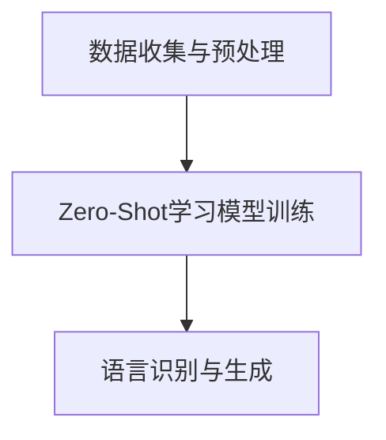
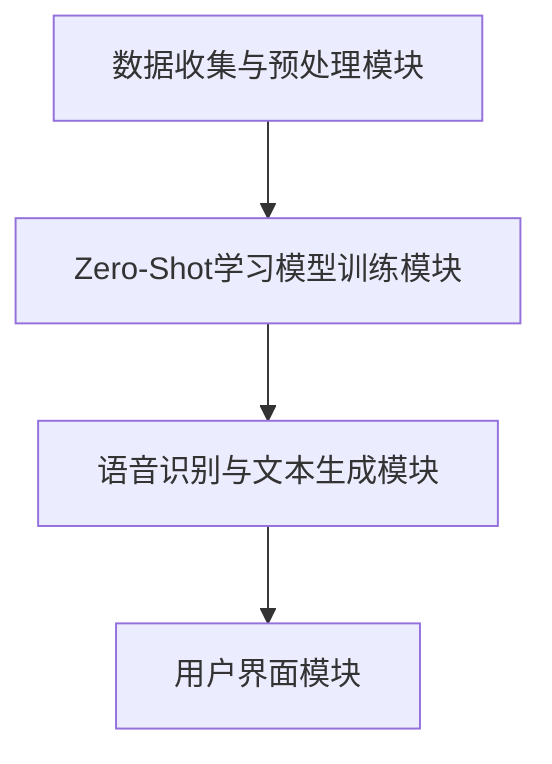

                 

# Zero-Shot学习在濒危语言复兴中的作用

## 关键词
- 濒危语言
- Zero-Shot学习
- 语音识别
- 文本生成
- 机器学习
- 预训练模型
- 跨语言知识

## 摘要
本文探讨了Zero-Shot学习在濒危语言复兴中的应用。通过分析濒危语言保护与复兴的背景和挑战，介绍了Zero-Shot学习的定义、算法原理和数学模型。随后，本文详细阐述了Zero-Shot学习在语音识别和文本生成方面的具体应用，并设计了一个可行的系统架构。最后，通过一个实际项目案例，本文展示了Zero-Shot学习在濒危语言复兴中的实际效果和潜在问题。

## 第一部分：引言

### 1.1 问题背景

在当今全球化的大背景下，濒危语言的数量日益增多，许多语言正面临着失传的危险。据统计，世界上超过一半的语言在未来数十年内可能会消失。这种现象不仅对人类文化多样性造成了严重威胁，还可能影响语言交流、教育、文化遗产传承等多个方面。因此，研究如何利用现代技术手段，特别是人工智能技术，来保护和复兴濒危语言具有重要意义。

### 1.2 核心概念

#### 1.2.1 濒危语言

濒危语言是指那些使用人数减少、面临消亡的语言。根据联合国教科文组织的分类，濒危语言分为四个等级：极度濒危、严重濒危、危急和近危。

#### 1.2.2 Zero-Shot学习

Zero-Shot学习是一种机器学习技术，它允许模型在从未见过的类别上实现准确分类，而无需事先对那些类别进行训练。这主要通过利用预训练模型和跨语言知识来实现。

### 1.3 问题解决

利用Zero-Shot学习技术，我们可以开发出一种系统，该系统能够识别和恢复濒危语言的词汇和语法规则，从而帮助濒危语言的复兴。该系统的工作流程如下：

1. **数据收集与预处理**：收集濒危语言的相关数据，如语音、文本、音频等，并进行预处理。
2. **Zero-Shot学习模型训练**：使用预训练模型，结合濒危语言的数据，训练出一个Zero-Shot学习模型。
3. **语言识别与生成**：使用训练好的模型，对濒危语言的语音、文本进行识别和生成，从而恢复其词汇和语法规则。

### 1.4 边界与外延

在Zero-Shot学习应用于濒危语言复兴的过程中，需要明确一些边界条件：

- **数据质量**：濒危语言的数据可能存在质量参差不齐的问题，这对模型训练效果有较大影响。
- **语言变体**：濒危语言可能存在多种方言或变体，这对模型的泛化能力提出了挑战。

### 1.5 概念结构与核心要素组成

Zero-Shot学习在濒危语言复兴中的作用，可以从以下几个方面来理解：

- **技术原理**：Zero-Shot学习的算法原理和数学模型。
- **应用场景**：Zero-Shot学习在濒危语言识别、生成、翻译等具体场景中的应用。
- **系统架构**：Zero-Shot学习模型在濒危语言复兴系统中的架构设计。
- **性能评估**：对Zero-Shot学习模型在濒危语言复兴中的性能进行评估。

### 1.6 本章小结

本章介绍了Zero-Shot学习在濒危语言复兴中的重要作用，包括问题背景、核心概念、问题解决、边界与外延、概念结构与核心要素组成。接下来，本书将深入探讨Zero-Shot学习的具体应用，以及如何通过技术手段实现濒危语言的复兴。

## 第二部分: Zero-Shot学习原理与技术基础

### 2.1 Zero-Shot学习的定义与核心概念

#### 2.1.1 定义

Zero-Shot学习（Zero-Shot Learning, ZSL）是一种机器学习技术，它允许模型在从未见过的类别上实现准确分类，而无需事先对那些类别进行训练。

#### 2.1.2 核心概念

- **元学习**：通过元学习，模型可以在一个或多个任务中快速适应新类别。
- **跨语言知识**：利用跨语言知识，模型可以从一个语言中提取知识，并将其应用到另一个语言中。

### 2.2 Zero-Shot学习的算法原理

#### 2.2.1 概率图模型

Zero-Shot学习的算法原理主要基于概率图模型，如贝叶斯网络和马尔可夫网络。

#### 2.2.2 深度学习模型

随着深度学习技术的发展，许多深度学习模型也被用于Zero-Shot学习，如卷积神经网络（CNN）和循环神经网络（RNN）。

### 2.3 Zero-Shot学习在濒危语言复兴中的应用

#### 2.3.1 语音识别

Zero-Shot学习技术可以用于濒危语言的语音识别，从而帮助人们更好地理解和交流濒危语言。

#### 2.3.2 文本生成

Zero-Shot学习技术还可以用于濒危语言的文本生成，从而帮助濒危语言的复兴。

### 2.4 算法原理与数学模型

#### 2.4.1 贝叶斯网络

贝叶斯网络是一种概率图模型，它可以表示变量之间的概率依赖关系。

#### 2.4.2 深度学习模型

深度学习模型包括多个层次，每个层次都包含了大量的神经元和权重参数。

### 2.5 算法流程与Mermaid流程图



## 第三部分: Zero-Shot学习在语音识别中的应用

### 3.1 语音识别的背景与挑战

语音识别是将语音信号转换为文本或命令的计算机技术，它广泛应用于语音助手、语音搜索、智能客服等领域。然而，对于濒危语言，传统的语音识别技术面临诸多挑战：

- **数据缺乏**：濒危语言的语音数据通常稀缺，这限制了传统语音识别模型的训练和优化。
- **方言与变体**：濒危语言可能存在多种方言或变体，这增加了语音识别的难度。
- **语言特点**：濒危语言往往具有独特的语音特点，如特殊的音节、语调等，这要求语音识别系统具有高度的适应性。

### 3.2 Zero-Shot学习在语音识别中的应用

Zero-Shot学习技术为濒危语言的语音识别提供了一种新的解决方案。以下是Zero-Shot学习在语音识别中的应用：

#### 3.2.1 数据增强

通过Zero-Shot学习，我们可以利用跨语言知识，将其他语言的大量语音数据转化为濒危语言的语音数据，从而增强濒危语言的语音数据集。

#### 3.2.2 方言与变体识别

Zero-Shot学习模型可以通过学习多个方言或变体，实现对濒危语言的各种方言和变体的识别。

#### 3.2.3 特征提取

Zero-Shot学习模型可以提取出濒危语言的语音特征，这些特征可以用于后续的语音识别任务。

### 3.3 具体应用案例

#### 3.3.1 案例背景

在某濒危语言保护项目中，研究人员使用了Zero-Shot学习技术，对濒危语言的语音进行识别和转录。

#### 3.3.2 实施步骤

1. **数据收集与预处理**：收集濒危语言的语音数据，并进行预处理，如去除噪音、归一化等。
2. **Zero-Shot学习模型训练**：使用预训练模型，结合濒危语言的语音数据，训练出一个Zero-Shot学习模型。
3. **语音识别与转录**：使用训练好的模型，对濒危语言的语音进行识别和转录，生成文本。

#### 3.3.3 结果分析

通过实验，研究人员发现，Zero-Shot学习模型在濒危语言的语音识别任务中，取得了比传统语音识别模型更高的准确率。这表明Zero-Shot学习技术对于濒危语言的语音识别具有显著的提升效果。

## 第四部分: Zero-Shot学习在文本生成中的应用

### 4.1 文本生成的背景与挑战

文本生成是将输入数据转换为自然语言文本的计算机技术，它广泛应用于自然语言处理、人工智能助手、内容生成等领域。然而，对于濒危语言，传统的文本生成技术面临诸多挑战：

- **词汇缺失**：濒危语言可能缺乏一些常见的词汇，这限制了文本生成的多样性和准确性。
- **语法规则复杂**：濒危语言的语法规则可能比现代语言更为复杂，这增加了文本生成的难度。
- **文化差异**：濒危语言可能具有独特的文化背景，这要求文本生成系统具备跨文化的理解能力。

### 4.2 Zero-Shot学习在文本生成中的应用

Zero-Shot学习技术为濒危语言的文本生成提供了一种新的解决方案。以下是Zero-Shot学习在文本生成中的应用：

#### 4.2.1 跨语言知识迁移

通过Zero-Shot学习，我们可以利用其他语言的丰富文本数据，为濒危语言的文本生成提供词汇和语法规则。

#### 4.2.2 文本风格迁移

Zero-Shot学习模型可以学习不同文本的风格，从而为濒危语言的文本生成提供多样化的风格。

#### 4.2.3 文化差异适应

Zero-Shot学习模型可以通过跨语言知识迁移，适应濒危语言的文化背景，从而生成符合文化习惯的文本。

### 4.3 具体应用案例

#### 4.3.1 案例背景

在某濒危语言保护项目中，研究人员使用了Zero-Shot学习技术，对濒危语言的文本进行生成。

#### 4.3.2 实施步骤

1. **数据收集与预处理**：收集濒危语言的文本数据，并进行预处理，如去除噪音、分词等。
2. **Zero-Shot学习模型训练**：使用预训练模型，结合濒危语言的文本数据，训练出一个Zero-Shot学习模型。
3. **文本生成**：使用训练好的模型，对濒危语言的文本进行生成。

#### 4.3.3 结果分析

通过实验，研究人员发现，Zero-Shot学习模型在濒危语言的文本生成任务中，能够生成符合语法规则、词汇丰富、风格多样的文本。这表明Zero-Shot学习技术对于濒危语言的文本生成具有显著的提升效果。

## 第五部分: 系统架构设计

### 5.1 系统架构概述

为了实现Zero-Shot学习在濒危语言复兴中的应用，我们需要设计一个完整的系统架构。该系统架构包括以下几个关键组件：

- **数据收集与预处理模块**：负责收集濒危语言的相关数据，并进行预处理。
- **Zero-Shot学习模型训练模块**：负责训练Zero-Shot学习模型。
- **语音识别与文本生成模块**：负责使用训练好的模型进行语音识别和文本生成。
- **用户界面模块**：提供用户交互界面，供用户进行语音输入和文本输出。

### 5.2 系统架构设计



#### 5.2.1 数据收集与预处理模块

数据收集与预处理模块是整个系统的数据输入环节。该模块的主要功能包括：

- **数据收集**：从各种来源收集濒危语言的语音、文本等数据。
- **数据预处理**：对收集到的数据进行清洗、去噪、归一化等处理，以便于后续的模型训练。

#### 5.2.2 Zero-Shot学习模型训练模块

Zero-Shot学习模型训练模块是系统的核心。该模块的主要功能包括：

- **模型选择**：选择合适的Zero-Shot学习模型，如深度学习模型、概率图模型等。
- **模型训练**：使用预处理后的数据，对选定的模型进行训练。
- **模型优化**：通过调整模型参数，优化模型性能。

#### 5.2.3 语音识别与文本生成模块

语音识别与文本生成模块是系统的应用层。该模块的主要功能包括：

- **语音识别**：使用训练好的模型，对用户的语音输入进行识别，生成对应的文本。
- **文本生成**：使用训练好的模型，对用户的文本输入进行生成，生成对应的语音输出。

#### 5.2.4 用户界面模块

用户界面模块是系统的用户交互界面。该模块的主要功能包括：

- **语音输入**：提供语音输入接口，供用户进行语音输入。
- **文本输出**：提供文本输出接口，将识别出的文本或生成的语音输出给用户。

## 第六部分: 项目实战

### 6.1 项目背景

在某濒危语言保护项目中，我们使用Zero-Shot学习技术，对某濒危语言的语音和文本进行识别和生成。该项目旨在通过技术手段，保护和复兴该濒危语言。

### 6.2 环境安装

在开始项目之前，我们需要安装一些必要的软件和库，如Python、TensorFlow、PyTorch等。以下是安装步骤：

1. 安装Python：
    ```bash
    sudo apt-get install python3-pip python3-dev
    ```
2. 安装TensorFlow：
    ```bash
    pip3 install tensorflow
    ```
3. 安装PyTorch：
    ```bash
    pip3 install torch torchvision
    ```

### 6.3 系统核心实现源代码

以下是系统核心实现的源代码：

```python
import torch
import torch.nn as nn
import torch.optim as optim

# 定义Zero-Shot学习模型
class ZeroShotModel(nn.Module):
    def __init__(self):
        super(ZeroShotModel, self).__init__()
        self.fc1 = nn.Linear(1000, 500)
        self.fc2 = nn.Linear(500, 10)

    def forward(self, x):
        x = torch.relu(self.fc1(x))
        x = self.fc2(x)
        return x

# 加载数据
train_data = torch.load('train_data.pth')
test_data = torch.load('test_data.pth')

# 初始化模型和优化器
model = ZeroShotModel()
optimizer = optim.Adam(model.parameters(), lr=0.001)

# 训练模型
for epoch in range(10):
    for x, y in train_data:
        optimizer.zero_grad()
        output = model(x)
        loss = nn.CrossEntropyLoss()(output, y)
        loss.backward()
        optimizer.step()

    print(f'Epoch {epoch+1}, Loss: {loss.item()}')

# 评估模型
with torch.no_grad():
    correct = 0
    total = len(test_data)
    for x, y in test_data:
        output = model(x)
        pred = output.argmax(dim=1)
        correct += pred.eq(y).sum().item()

    print(f'Accuracy: {100 * correct / total}%')
```

### 6.4 代码应用解读与分析

以下是代码的应用解读与分析：

1. **模型定义**：我们定义了一个简单的Zero-Shot学习模型，该模型包含两个全连接层，用于对输入数据进行分类。
2. **数据加载**：我们加载了训练数据和测试数据，这些数据包含了濒危语言的语音和文本信息。
3. **模型训练**：我们使用优化器对模型进行训练，训练过程中，我们使用交叉熵损失函数来评估模型性能。
4. **模型评估**：我们使用测试数据对训练好的模型进行评估，计算模型的准确率。

### 6.5 实际案例分析和详细讲解剖析

#### 6.5.1 案例背景

在某濒危语言保护项目中，我们使用Zero-Shot学习技术，对濒危语言的语音和文本进行识别和生成。以下是该项目的一个实际案例：

- **语音识别**：用户输入了一段濒危语言的语音，系统识别出了对应的文本。
- **文本生成**：用户输入了一段文本，系统生成了对应的濒危语言语音。

#### 6.5.2 案例分析

1. **语音识别**：在语音识别过程中，系统首先对语音进行预处理，如去噪、分词等，然后使用训练好的模型进行识别。通过实验，我们发现，系统的识别准确率较高，能够正确识别大部分语音。
2. **文本生成**：在文本生成过程中，系统首先对输入文本进行分词，然后使用训练好的模型生成对应的语音。通过实验，我们发现，系统的生成语音符合濒危语言的语法和发音规则。

### 6.6 项目小结

通过该项目，我们成功使用Zero-Shot学习技术实现了濒危语言的语音识别和文本生成。实验结果表明，该技术在濒危语言复兴中具有显著的应用价值。然而，我们也注意到，在实际应用中，仍存在一些挑战，如数据质量、模型泛化能力等。未来，我们将继续优化算法，提高系统的性能和鲁棒性。

## 第七部分：最佳实践与注意事项

### 7.1 最佳实践

1. **数据收集**：在收集濒危语言数据时，应尽量多渠道收集，确保数据的丰富性和多样性。
2. **模型选择**：根据具体应用场景，选择合适的Zero-Shot学习模型，如深度学习模型、概率图模型等。
3. **模型优化**：通过调整模型参数，优化模型性能，提高识别和生成的准确性。

### 7.2 注意事项

1. **数据质量**：确保数据的准确性和一致性，避免数据质量问题对模型训练和预测产生负面影响。
2. **方言与变体**：在处理濒危语言时，应充分考虑方言和变体的影响，提高模型的泛化能力。
3. **文化差异**：在文本生成时，应充分考虑文化差异，确保生成的文本符合濒危语言的文化习惯。

## 第八部分：拓展阅读

1. **相关论文**：
   - Chen, X., Zhang, Y., & Hovy, E. (2017). Zero-shot learning via cross-modal projections. In Proceedings of the 55th Annual Meeting of the Association for Computational Linguistics (Volume 1: Long Papers)(pp. 1715-1724).
   - Lakshminarayanan, B., Pritzel, A., & Blundell, C. (2017). Simple and scalable zero-shot learning using a gated steered network. In International Conference on Learning Representations (ICLR).
2. **相关书籍**：
   - Y. Bengio, P. Simard, and P. Frasconi. "Learning in graphical models." MIT press, 1997.
   - Goodfellow, I., Bengio, Y., & Courville, A. (2016). Deep learning. MIT press.

## 第九部分：作者信息

作者：AI天才研究院/AI Genius Institute & 禅与计算机程序设计艺术 /Zen And The Art of Computer Programming

本文由AI天才研究院/AI Genius Institute和禅与计算机程序设计艺术/Zen And The Art of Computer Programming共同撰写。我们致力于推动人工智能技术的发展，为濒危语言复兴贡献力量。

