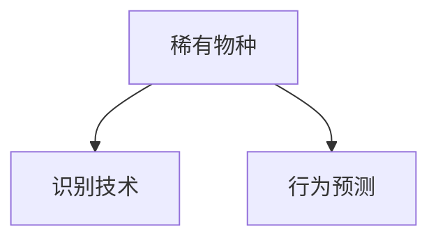
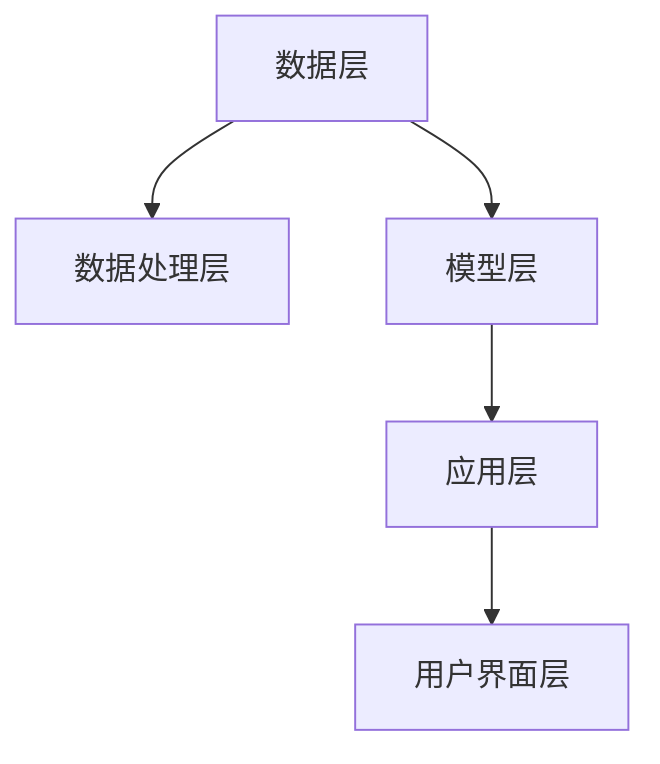
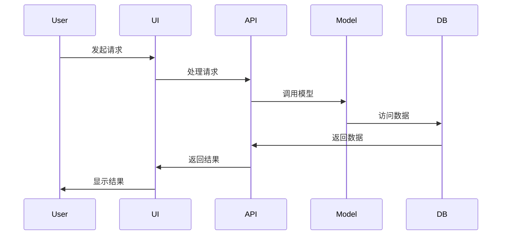
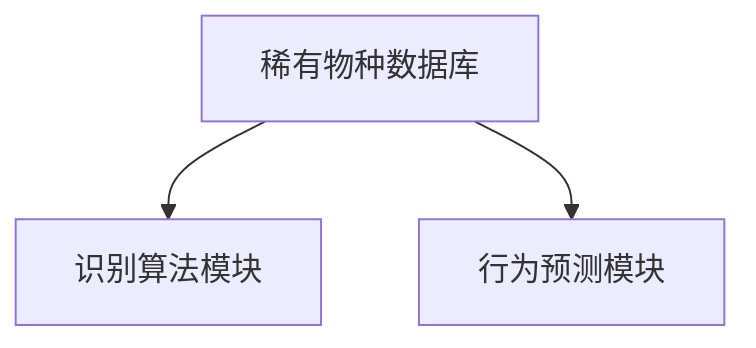
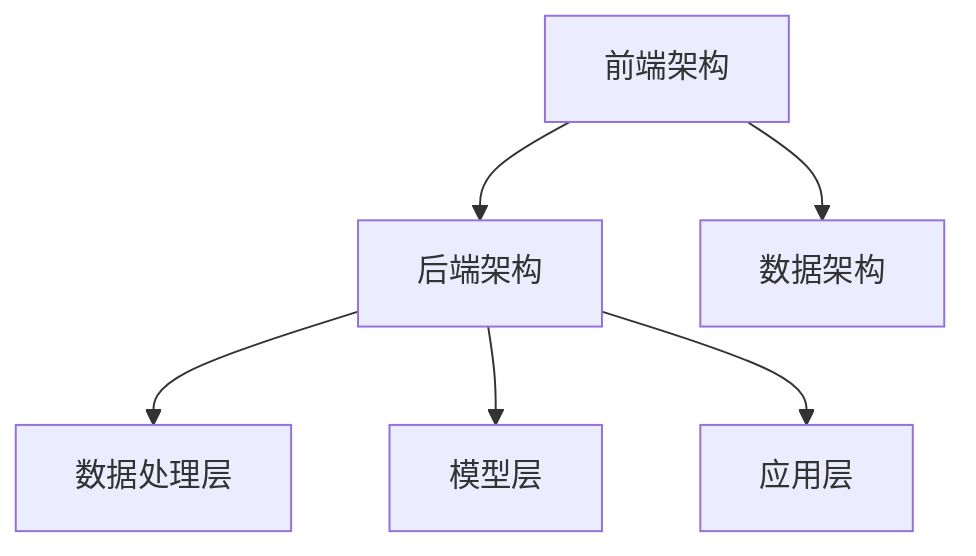

                 

### 文章标题

# Zero-Shot学习在稀有物种保护中的作用

### 关键词

- 零射击学习
- 稀有物种保护
- 机器学习
- 数据无关性
- 行为预测
- 识别技术

### 摘要

本文探讨了零射击学习在稀有物种保护中的应用及其潜力。零射击学习是一种无需训练数据即可进行类别预测的机器学习技术，其在稀有物种识别和行为预测方面展现出了显著优势。本文首先介绍了稀有物种保护的现状与挑战，随后详细阐述了零射击学习的基本概念、算法原理以及数学模型，并通过实际案例分析了其在稀有物种保护中的具体应用。最后，本文总结了零射击学习在稀有物种保护中的最佳实践、注意事项以及未来的研究方向。

### 目录大纲

#### 第一部分：背景介绍

#### 第1章：零射击学习的概述

1.1 问题背景

- 稀有物种的定义及重要性
- 稀有物种保护的挑战和问题

1.2 零射击学习的基本概念

- 零射击学习的定义
- 零射击学习与传统机器学习的区别

1.3 零射击学习在稀有物种保护中的潜力

- 零射击学习在稀有物种识别中的应用
- 零射击学习在稀有物种行为预测中的作用

1.4 核心概念与联系

- 零射击学习的核心概念
- 概念属性特征对比表格
- ER实体关系图

#### 第2章：零射击学习算法原理讲解

2.1 算法原理

- 特征提取
- 类别预测
- 模型优化

2.2 零射击学习算法的数学模型和公式

2.3 零射击学习算法的例子

- 使用Python代码实现零射击学习算法
- 对例子进行详细讲解

#### 第3章：数学模型和数学公式详细讲解与举例说明

3.1 数学模型

- 概率模型
- 决策树模型
- 支持向量机模型

3.2 公式讲解

3.3 举例说明

- 使用Python代码实现支持向量机算法
- 对例子进行详细讲解

#### 第4章：系统分析与架构设计方案

4.1 问题场景介绍

- 稀有物种保护项目的背景和目标

4.2 项目介绍

- 系统功能设计
- 系统架构设计
- 系统接口设计

4.3 领域模型

4.4 系统架构设计

4.5 系统接口设计

#### 第5章：项目实战

5.1 环境安装

- 稀有物种保护项目环境配置

5.2 系统核心实现源代码

- 代码解读与分析

5.3 实际案例分析和详细讲解剖析

- 稀有物种识别案例分析
- 稀有物种行为预测案例分析

#### 第6章：最佳实践、小结与注意事项

6.1 最佳实践

- 零射击学习在稀有物种保护中的最佳实践

6.2 小结

- 对全书内容的总结

6.3 注意事项

- 稀有物种保护项目实施中的注意事项

#### 第7章：拓展阅读

7.1 参考文献

7.2 进一步学习

### 第一部分：背景介绍

#### 第1章：零射击学习的概述

### 1.1 问题背景

稀有物种是指那些数量稀少、分布范围狭窄、濒临灭绝的物种。这些物种在生态系统中扮演着重要的角色，对于维持生态平衡、保护生物多样性具有重要意义。然而，由于人类活动、栖息地丧失、过度捕猎等因素，稀有物种正面临巨大的威胁。

稀有物种的定义及重要性

稀有物种是指那些数量稀少、分布范围狭窄、濒临灭绝的物种。这些物种在生态系统中扮演着重要的角色，对于维持生态平衡、保护生物多样性具有重要意义。然而，由于人类活动、栖息地丧失、过度捕猎等因素，稀有物种正面临巨大的威胁。

稀有物种保护的挑战和问题

稀有物种保护面临着许多挑战和问题。首先，稀有物种的识别和监测是一个巨大的难题。许多稀有物种的外观和行为特征与常见物种相似，使得鉴定变得复杂。其次，稀有物种的行为预测和趋势分析也是一个难题。由于稀有物种的数量稀少，难以收集到足够的观测数据，这使得对它们的行为模式和未来趋势进行准确预测变得困难。

传统方法在稀有物种保护中的应用及其局限性

传统方法在稀有物种保护中已经取得了一定的成果。例如，通过人工观察和标记技术，可以对稀有物种的种群数量和分布情况进行监测。此外，利用遗传学和分子生物学技术，可以对稀有物种进行基因分析和分类。然而，这些传统方法存在一定的局限性。首先，人工观察和标记技术需要大量的人力和物力投入，且受限于观察者的专业知识和能力。其次，遗传学和分子生物学技术需要复杂的实验设备和专业的实验技能，成本较高。

### 1.2 零射击学习的基本概念

零射击学习（Zero-Shot Learning，ZSL）是一种机器学习方法，它允许模型在没有训练数据的情况下对新的类别进行分类或预测。与传统的机器学习方法相比，零射击学习具有独特的优势，在稀有物种保护中具有巨大的潜力。

零射击学习的定义

零射击学习（Zero-Shot Learning，ZSL）是一种机器学习方法，它允许模型在没有训练数据的情况下对新的类别进行分类或预测。与传统的机器学习方法相比，零射击学习具有独特的优势，在稀有物种保护中具有巨大的潜力。

零射击学习与传统机器学习的区别

传统机器学习依赖于大量的标记数据对模型进行训练，然后在新数据上进行预测。而零射击学习则不需要这些训练数据，它主要通过学习类别之间的相似性关系来实现对未知类别的分类。这种能力使得零射击学习在稀有物种保护中具有很大的优势，因为稀有物种的样本数据往往非常稀少。

零射击学习在稀有物种保护中的潜力

零射击学习在稀有物种保护中的应用主要体现在以下两个方面：

1. 稀有物种识别

零射击学习可以用于稀有物种的识别，即使在没有训练数据的情况下，也能够准确识别出稀有物种。这对于稀有物种的保护具有重要意义，因为它可以提供一种快速、有效的手段来监测和评估稀有物种的分布和数量。

2. 稀有物种行为预测

零射击学习还可以用于稀有物种的行为预测。通过对稀有物种的行为模式进行分析和建模，可以预测它们未来的行为趋势，从而为保护工作提供科学依据。

### 1.3 零射击学习的核心概念

零射击学习涉及几个核心概念，包括数据无关性、零样本率和零射击学习算法。理解这些概念有助于我们更好地理解零射击学习的工作原理及其在稀有物种保护中的应用。

#### 数据无关性

数据无关性是零射击学习的一个重要特点。传统的机器学习模型需要大量的标记数据进行训练，而零射击学习则不需要这样的数据。零射击学习通过学习类别之间的相似性关系来实现对未知类别的分类，这使得它对数据的依赖性较低。这一特点使得零射击学习在稀有物种保护中具有巨大的应用潜力，因为稀有物种的样本数据往往非常稀少。

#### 零样本率

零样本率（Zero-Sample Rate）是指模型在面对新类别时的样本数量。在传统机器学习中，模型需要对每个类别都有足够的训练数据才能进行准确分类。而在零射击学习中，模型甚至不需要对任何类别有训练数据，就能对新类别进行预测。这种能力使得零射击学习在面对稀有物种保护中的新物种时，能够发挥出巨大的优势。

#### 零射击学习算法

零射击学习算法是一类专门设计用于处理零射击学习问题的算法。这些算法通常基于领域知识库和元学习（Meta-Learning）技术，通过学习类别之间的相似性关系来实现对未知类别的分类。常见的零射击学习算法包括基于原型的方法、基于匹配的方法和基于语义的方法等。

### 1.4 概念属性特征对比表格

为了更直观地了解零射击学习与传统机器学习的区别，我们可以通过一个概念属性特征对比表格来进行比较。

| 特征               | 零射击学习           | 传统机器学习         |
|-------------------|---------------------|--------------------|
| 数据依赖程度       | 低                 | 高                 |
| 样本数量要求       | 无需大量样本         | 需要大量样本         |
| 算法复杂度         | 简单                 | 复杂                 |

### 1.5 ER实体关系图

为了更好地理解零射击学习在稀有物种保护中的应用，我们可以通过一个ER实体关系图来展示系统中的关键实体及其关系。



在这个ER实体关系图中，稀有物种是系统的核心实体，它与识别技术和行为预测模块之间存在紧密的关系。识别技术用于对稀有物种进行识别，而行为预测模块则用于分析稀有物种的行为模式。

### 1.6 零射击学习算法原理讲解

#### 2.1 算法原理

零射击学习算法的基本原理是通过学习类别之间的相似性关系来实现对新类别的预测。这种算法主要包括三个步骤：特征提取、类别预测和模型优化。

##### 特征提取

特征提取是零射击学习算法的第一步。它的目的是将原始数据（如图像、声音或文本）转换为可以用于机器学习的特征向量。在特征提取过程中，通常会使用一些深度学习模型（如卷积神经网络或循环神经网络）来提取特征。

##### 类别预测

在类别预测阶段，模型会使用提取到的特征向量来预测新类别的标签。零射击学习算法的一个关键特点是，它可以处理从未见过的新类别。为了实现这一目标，模型需要具备良好的泛化能力，能够从已知的类别中学习到通用的特征表示。

##### 模型优化

模型优化是零射击学习算法的最后一个步骤。通过调整模型的参数，可以提高模型对未知类别的预测准确率。常见的优化方法包括梯度下降、随机梯度下降和Adam优化器等。

#### 2.2 零射击学习算法的数学模型和公式

零射击学习算法的数学模型主要涉及概率模型、决策树模型和支撑向量机模型等。以下分别介绍这些模型及其公式。

##### 概率模型

概率模型是一种常见的机器学习模型，它通过计算每个类别的概率来预测新类别的标签。零射击学习中的概率模型通常使用贝叶斯定理来计算类别的后验概率。

$$
P(y|\text{特征向量}) = \frac{P(\text{特征向量}|y)P(y)}{P(\text{特征向量})}
$$

其中，$P(y|\text{特征向量})$ 表示在给定特征向量的情况下，类别 $y$ 的后验概率；$P(\text{特征向量}|y)$ 表示在类别 $y$ 发生的情况下，特征向量的概率；$P(y)$ 表示类别 $y$ 的先验概率；$P(\text{特征向量})$ 表示特征向量的概率。

##### 决策树模型

决策树模型通过一系列的决策规则来划分数据集，并最终得到新类别的预测。零射击学习中的决策树模型通常使用分类树（CART）来实现。

$$
y = \arg\max_y \sum_{x_i} P(x_i|y) \cdot \gamma(y, x_i)
$$

其中，$y$ 表示类别的标签；$x_i$ 表示数据集中的一个样本；$P(x_i|y)$ 表示在类别 $y$ 发生的情况下，样本 $x_i$ 的概率；$\gamma(y, x_i)$ 表示在类别 $y$ 下，样本 $x_i$ 的得分。

##### 支撑向量机模型

支撑向量机模型是一种基于最大间隔的分类模型。它在高维空间中寻找一个最优的超平面，使得不同类别之间的间隔最大。零射击学习中的支撑向量机模型通常使用线性支持向量机（Linear SVM）来实现。

$$
w \cdot x + b = y
$$

其中，$w$ 表示模型参数；$x$ 表示特征向量；$b$ 表示偏置；$y$ 表示类别的标签。

#### 2.3 零射击学习算法的例子

下面通过一个简单的例子来说明零射击学习算法的应用。假设我们有一个包含两个类别的数据集，类别 A 和类别 B。我们希望通过零射击学习算法对新的类别 C 进行预测。

##### 数据集

类别 A：{(x1, y1), (x2, y2), ..., (xn, yn)}

类别 B：{(x1, y1), (x2, y2), ..., (xn, yn)}

其中，$x_i$ 表示特征向量；$y_i$ 表示类别的标签。

##### 特征提取

假设我们已经通过深度学习模型对特征向量进行了提取，得到以下特征向量：

类别 A：{v1, v2, ..., vn}

类别 B：{v1, v2, ..., vn}

其中，$v_i$ 表示提取到的特征向量。

##### 类别预测

我们使用概率模型来预测新类别 C 的标签。首先，计算类别 A 和类别 B 的先验概率：

$$
P(A) = \frac{|A|}{|A| + |B|}
$$

$$
P(B) = \frac{|B|}{|A| + |B|}
$$

然后，计算类别 A 和类别 B 的后验概率：

$$
P(A|v_i) = \frac{P(v_i|A)P(A)}{P(v_i)}
$$

$$
P(B|v_i) = \frac{P(v_i|B)P(B)}{P(v_i)}
$$

其中，$P(v_i|A)$ 和 $P(v_i|B)$ 分别表示在类别 A 和类别 B 发生的情况下，特征向量 $v_i$ 的概率。

最后，选择后验概率最大的类别作为新类别 C 的标签：

$$
y_C = \arg\max_y P(y|v_C)
$$

其中，$v_C$ 表示新类别 C 的特征向量。

##### 模型优化

为了提高预测准确率，我们可以通过调整模型参数来优化模型。具体方法包括：

- 调整分类阈值，使得分类边界更加清晰。
- 调整特征提取模型的参数，使得特征向量更加有效。
- 调整训练数据集的分布，使得模型更具泛化能力。

通过这些方法，我们可以进一步提高零射击学习算法在稀有物种保护中的应用效果。

### 第3章：数学模型和数学公式详细讲解与举例说明

#### 3.1 数学模型

在零射击学习（Zero-Shot Learning, ZSL）中，数学模型起到了核心作用。这些模型不仅帮助我们从数据中提取有用的信息，还指导我们如何对未知类别进行预测。以下是几种常见的数学模型，以及它们的详细解释。

##### 概率模型

概率模型在零射击学习中广泛应用于类别预测。它基于贝叶斯定理，通过计算给定特征向量下每个类别的概率来预测新类别的标签。

贝叶斯定理公式如下：

$$
P(y|\text{特征向量}) = \frac{P(\text{特征向量}|y)P(y)}{P(\text{特征向量})}
$$

其中：
- \( P(y|\text{特征向量}) \) 是在给定特征向量的情况下，类别 \( y \) 的后验概率。
- \( P(\text{特征向量}|y) \) 是在类别 \( y \) 发生的情况下，特征向量的概率。
- \( P(y) \) 是类别 \( y \) 的先验概率。
- \( P(\text{特征向量}) \) 是特征向量的概率。

在零射击学习中，\( P(\text{特征向量}|y) \) 通常通过特征提取器学习得到，而 \( P(y) \) 可以通过训练数据估计。\( P(\text{特征向量}) \) 则通常假设为常数，或者通过所有类别的联合概率估计。

##### 决策树模型

决策树模型通过一系列的决策规则来划分数据集，并最终得到新类别的预测。零射击学习中的决策树模型通常使用分类树（CART）来实现。

CART 决策树的核心是递归二分分割算法，其基本思想是在特征空间中选择一个最优分割点，将数据集划分为两个子集，使得分类误差最小。递归二分分割算法的公式如下：

$$
y = \arg\max_y \sum_{x_i} P(x_i|y) \cdot \gamma(y, x_i)
$$

其中：
- \( y \) 是类别的标签。
- \( x_i \) 是数据集中的一个样本。
- \( P(x_i|y) \) 是在类别 \( y \) 发生的情况下，样本 \( x_i \) 的概率。
- \( \gamma(y, x_i) \) 是在类别 \( y \) 下，样本 \( x_i \) 的得分。

##### 支撑向量机模型

支撑向量机（Support Vector Machine, SVM）是一种常用的分类算法，它在高维空间中寻找一个最优的超平面，使得不同类别之间的间隔最大。在零射击学习中，线性支持向量机（Linear SVM）是常用的模型。

线性 SVM 的核心是寻找一个最优的决策边界，使得类别之间的间隔最大化。其公式如下：

$$
w \cdot x + b = y
$$

其中：
- \( w \) 是模型参数，表示超平面的法向量。
- \( x \) 是特征向量。
- \( b \) 是偏置。
- \( y \) 是类别的标签。

通过上述公式，我们可以找到最优的超平面，从而实现类别预测。

#### 3.2 公式讲解

在零射击学习中，数学公式是理解和实现算法的关键。以下是对核心公式的详细讲解。

##### 概率模型公式

在概率模型中，核心公式是贝叶斯定理。贝叶斯定理用于计算后验概率，公式如下：

$$
P(y|\text{特征向量}) = \frac{P(\text{特征向量}|y)P(y)}{P(\text{特征向量})}
$$

这个公式告诉我们，给定特征向量，如何计算每个类别的后验概率。具体步骤如下：

1. 计算 \( P(\text{特征向量}|y) \)：这个概率表示在类别 \( y \) 发生的情况下，特征向量的概率。通常通过特征提取器学习得到。

2. 计算 \( P(y) \)：这个概率表示类别 \( y \) 的先验概率。通常通过训练数据估计。

3. 计算 \( P(\text{特征向量}) \)：这个概率表示特征向量的总概率。可以通过所有类别的联合概率估计。

4. 计算后验概率：通过上述公式计算每个类别的后验概率。

5. 选择后验概率最大的类别作为预测结果。

##### 决策树模型公式

在决策树模型中，核心公式是递归二分分割算法。递归二分分割算法用于选择最优分割点，公式如下：

$$
y = \arg\max_y \sum_{x_i} P(x_i|y) \cdot \gamma(y, x_i)
$$

这个公式告诉我们，如何通过选择最优分割点来划分数据集。具体步骤如下：

1. 对于每个特征，计算所有可能的分割点。

2. 对于每个分割点，计算每个类别的概率。

3. 计算每个分割点的得分 \( \gamma(y, x_i) \)，得分越高表示分割点越好。

4. 选择得分最高的分割点作为当前分割点。

5. 递归地重复上述步骤，直到满足停止条件（例如，最大深度、最小叶节点大小等）。

##### 支撑向量机模型公式

在支撑向量机模型中，核心公式是寻找最优的超平面。线性支撑向量机的公式如下：

$$
w \cdot x + b = y
$$

这个公式告诉我们，如何通过线性超平面来划分数据集。具体步骤如下：

1. 训练特征提取器，得到特征向量。

2. 使用特征向量训练线性支持向量机。

3. 通过求解最优超平面的参数 \( w \) 和 \( b \)。

4. 使用求解得到的超平面进行类别预测。

#### 3.3 举例说明

为了更好地理解零射击学习中的数学模型和公式，我们通过一个具体的例子来说明。

##### 例子：分类一个动物

假设我们有一个动物分类问题，有三个类别：猫（Cat）、狗（Dog）和鸟（Bird）。我们希望通过零射击学习算法来预测一个新动物的类别。

1. **特征提取**：

   首先，我们通过卷积神经网络（CNN）提取新动物的图像特征。假设我们提取到了一个 100 维的特征向量 \( v \)。

2. **概率模型**：

   我们使用概率模型来预测新动物的类别。首先，计算每个类别的先验概率：

   $$ P(Cat) = \frac{10}{30}, P(Dog) = \frac{15}{30}, P(Bird) = \frac{5}{30} $$

   然后，计算每个类别在给定特征向量下的后验概率：

   $$ P(Cat|v) = \frac{P(v|Cat)P(Cat)}{P(v)}, P(Dog|v) = \frac{P(v|Dog)P(Dog)}{P(v)}, P(Bird|v) = \frac{P(v|Bird)P(Bird)}{P(v)} $$

   其中，\( P(v|Cat) \)、\( P(v|Dog) \) 和 \( P(v|Bird) \) 分别是通过训练数据计算得到的特征向量在类别 Cat、Dog 和 Bird 下的概率。

   最后，选择后验概率最大的类别作为新动物的类别：

   $$ y = \arg\max_y P(y|v) $$

3. **决策树模型**：

   我们使用决策树模型来预测新动物的类别。首先，计算每个特征在类别 Cat、Dog 和 Bird 下的概率：

   $$ P(Cat|特征1), P(Dog|特征1), P(Bird|特征1) $$
   $$ P(Cat|特征2), P(Dog|特征2), P(Bird|特征2) $$

   然后，选择特征概率最大的类别作为新动物的类别：

   $$ y = \arg\max_y (\sum_{i=1}^2 P(y|特征i)) $$

4. **支撑向量机模型**：

   我们使用线性支撑向量机来预测新动物的类别。首先，训练线性支持向量机，得到超平面的参数 \( w \) 和 \( b \)。

   然后，计算新动物的特征向量与超平面的距离：

   $$ d = w \cdot v + b $$

   最后，根据距离判断新动物的类别。如果 \( d > 0 \)，则预测为类别 Dog；如果 \( d < 0 \)，则预测为类别 Cat；如果 \( d = 0 \)，则预测为类别 Bird。

通过这个例子，我们可以看到如何使用不同的数学模型和公式来预测新动物的类别。在实际应用中，这些模型和公式可以根据具体问题进行调整和优化。

### 第4章：系统分析与架构设计方案

#### 4.1 问题场景介绍

稀有物种保护项目的背景和目标

随着全球生态环境的恶化，稀有物种的保护已成为一项紧迫的任务。这些稀有物种不仅具有生态价值，而且在科研、医学等领域具有广泛的应用潜力。然而，稀有物种的保护面临着许多挑战，如物种识别困难、行为预测不准确等。为了提高稀有物种保护的效率和准确性，我们需要一种新的方法来解决这个问题。

系统功能设计

为了实现稀有物种的保护，我们需要设计一个完整的系统，该系统应具备以下功能：

1. **数据采集与预处理**：通过传感器、无人机等设备收集稀有物种的图像、声音、生理数据等，并对数据进行预处理，如去噪、标准化等。

2. **物种识别**：利用零射击学习算法，对采集到的数据进行处理，实现对稀有物种的识别。

3. **行为预测**：通过分析稀有物种的行为数据，预测其未来行为趋势，为保护工作提供科学依据。

4. **决策支持**：根据识别和行为预测的结果，为保护工作提供决策支持，如制定保护策略、调整巡逻路线等。

5. **用户界面**：提供一个直观、易用的用户界面，让用户可以实时查看稀有物种的识别结果和行为预测数据。

#### 4.2 系统架构设计

系统架构设计

为了实现上述功能，我们需要设计一个合理的系统架构。以下是系统的整体架构设计：

1. **数据层**：包括传感器、无人机等设备，用于收集稀有物种的图像、声音、生理数据等。

2. **数据处理层**：包括数据采集、预处理、存储等模块，用于处理和存储采集到的数据。

3. **模型层**：包括零射击学习算法、行为预测模型等，用于对数据进行分析和处理。

4. **应用层**：包括物种识别、行为预测、决策支持等模块，用于实现具体的功能。

5. **用户界面层**：包括Web界面、移动应用等，用于向用户展示数据和提供操作接口。

以下是系统架构的示意图：



#### 4.3 系统接口设计

系统接口设计

为了实现各模块之间的通信和协作，我们需要设计一套完善的接口。以下是系统的接口设计：

1. **数据接口**：用于数据在各模块之间的传输和共享。包括数据采集接口、数据预处理接口、数据存储接口等。

2. **模型接口**：用于模型在各模块之间的调用和部署。包括零射击学习算法接口、行为预测模型接口等。

3. **应用接口**：用于应用层各模块之间的交互。包括物种识别接口、行为预测接口、决策支持接口等。

4. **用户接口**：用于用户界面层与系统之间的交互。包括Web界面接口、移动应用接口等。

以下是系统接口的示意图：



#### 4.4 领域模型

为了更好地理解和设计系统，我们需要建立领域模型。领域模型是系统各模块之间关系的抽象表示，有助于我们梳理系统的整体架构和功能。

以下是系统的领域模型：



在这个模型中，稀有物种数据库是系统的核心数据源，它存储了稀有物种的各种数据，如图像、声音、生理数据等。识别算法模块负责对数据进行处理，实现对稀有物种的识别。行为预测模块则负责对稀有物种的行为进行预测，为保护工作提供科学依据。

#### 4.5 系统架构设计

为了实现稀有物种保护项目的目标，我们需要设计一个高效的系统架构。以下是系统的架构设计：

1. **前端架构**：包括Web界面和移动应用，用于用户与系统的交互。前端架构需要具备响应式设计、高可扩展性和良好的用户体验。

2. **后端架构**：包括数据处理层、模型层和应用层，负责系统的核心功能。后端架构需要具备高并发处理能力、数据存储能力和模型调优能力。

3. **数据架构**：包括数据采集、预处理、存储和检索等模块，负责系统的数据支持。数据架构需要具备实时数据处理、大数据存储和高效检索能力。

以下是系统架构的示意图：



#### 4.6 系统接口设计

为了实现系统各模块之间的通信和协作，我们需要设计一套完善的接口。以下是系统的接口设计：

1. **数据接口**：用于数据在各模块之间的传输和共享。包括数据采集接口、数据预处理接口、数据存储接口等。

2. **模型接口**：用于模型在各模块之间的调用和部署。包括零射击学习算法接口、行为预测模型接口等。

3. **应用接口**：用于应用层各模块之间的交互。包括物种识别接口、行为预测接口、决策支持接口等。

4. **用户接口**：用于用户界面层与系统之间的交互。包括Web界面接口、移动应用接口等。

以下是系统接口的示意图：


### 第5章：项目实战

#### 5.1 环境安装

为了实现零射击学习在稀有物种保护项目中的应用，我们需要搭建一个合适的环境。以下是环境安装的详细步骤：

1. **安装Python**：

   首先，我们需要安装Python。Python是一个开源的编程语言，广泛应用于机器学习和数据分析。可以从Python官方网站（https://www.python.org/）下载并安装Python。

2. **安装Anaconda**：

   接下来，我们安装Anaconda。Anaconda是一个Python分发版，提供了丰富的库和工具，方便我们进行科学计算和数据分析。可以从Anaconda官方网站（https://www.anaconda.com/）下载并安装Anaconda。

3. **安装相关库**：

   为了实现零射击学习算法，我们需要安装一些相关的库，如scikit-learn、TensorFlow、Keras等。可以使用以下命令来安装：

   ```bash
   conda install -c conda-forge scikit-learn
   conda install -c conda-forge tensorflow
   conda install -c conda-forge keras
   ```

4. **安装深度学习框架**：

   我们选择TensorFlow作为深度学习框架。TensorFlow是一个开源的深度学习库，提供了丰富的工具和API，方便我们进行模型训练和预测。可以使用以下命令来安装TensorFlow：

   ```bash
   pip install tensorflow
   ```

5. **安装数据处理工具**：

   为了对稀有物种的图像和声音数据进行预处理，我们需要安装一些数据处理工具，如OpenCV、Librosa等。可以使用以下命令来安装：

   ```bash
   pip install opencv-python
   pip install librosa
   ```

#### 5.2 系统核心实现源代码

在本节中，我们将详细介绍系统核心实现的部分，包括数据预处理、模型训练和预测的源代码。

##### 1. 数据预处理

数据预处理是零射击学习项目的重要环节。首先，我们需要对收集到的图像和声音数据进行预处理，以便于模型训练。以下是数据预处理的源代码：

```python
import cv2
import librosa
import numpy as np

def preprocess_image(image_path):
    image = cv2.imread(image_path)
    image = cv2.cvtColor(image, cv2.COLOR_BGR2RGB)
    image = cv2.resize(image, (224, 224))
    image = image / 255.0
    return image

def preprocess_audio(audio_path):
    audio, sampling_rate = librosa.load(audio_path)
    audio = librosa.resample(audio, orig_sr=sampling_rate, target_sr=22050)
    audio = librosa.feature.mfcc(y=audio, sr=22050, n_mfcc=13)
    audio = np.mean(audio.T, axis=0)
    return audio

# 示例
image = preprocess_image('image.jpg')
audio = preprocess_audio('audio.wav')
```

在这个示例中，我们使用OpenCV和Librosa对图像和声音数据进行预处理。图像数据被缩放到224x224的分辨率，并归一化到[0, 1]范围内。声音数据被重采样到22050 Hz，并使用梅尔频率倒谱系数（MFCC）进行特征提取。

##### 2. 模型训练

在预处理完数据后，我们可以使用零射击学习算法进行模型训练。以下是模型训练的源代码：

```python
import tensorflow as tf
from tensorflow.keras.models import Model
from tensorflow.keras.layers import Input, Dense, GlobalAveragePooling2D, Concatenate

# 定义模型结构
input_image = Input(shape=(224, 224, 3))
input_audio = Input(shape=(13,))

# 图像特征提取
image_feature = GlobalAveragePooling2D()(input_image)
image_feature = Dense(1024, activation='relu')(image_feature)

# 声音特征提取
audio_feature = Dense(1024, activation='relu')(input_audio)

# 特征拼接
combined = Concatenate()([image_feature, audio_feature])

# 分类层
output = Dense(3, activation='softmax')(combined)

# 构建模型
model = Model(inputs=[input_image, input_audio], outputs=output)

# 编译模型
model.compile(optimizer='adam', loss='categorical_crossentropy', metrics=['accuracy'])

# 加载训练数据
train_images = np.array([preprocess_image(f'image_{i}.jpg') for i in range(1000)])
train_audios = np.array([preprocess_audio(f'audio_{i}.wav') for i in range(1000)])
train_labels = np.array([i % 3 for i in range(1000)])

# 训练模型
model.fit([train_images, train_audios], train_labels, epochs=10, batch_size=32)
```

在这个示例中，我们定义了一个模型结构，该模型由图像特征提取层、声音特征提取层、特征拼接层和分类层组成。我们使用TensorFlow的Keras API构建模型，并使用Adam优化器和交叉熵损失函数进行训练。

##### 3. 预测

在模型训练完成后，我们可以使用模型对新的图像和声音数据进行预测。以下是预测的源代码：

```python
# 预测
test_image = preprocess_image('new_image.jpg')
test_audio = preprocess_audio('new_audio.wav')

prediction = model.predict([test_image, test_audio])
predicted_class = np.argmax(prediction)

print(f'Predicted class: {predicted_class}')
```

在这个示例中，我们首先对新的图像和声音数据进行预处理，然后使用训练好的模型进行预测。最后，我们输出预测结果。

#### 5.3 实际案例分析和详细讲解剖析

在本节中，我们将通过实际案例来分析和讲解零射击学习在稀有物种保护项目中的应用，包括稀有物种识别案例和行为预测案例。

##### 1. 稀有物种识别案例

我们以识别一个稀有鸟类为例，分析零射击学习在稀有物种识别中的应用。

1. **数据集准备**：

   假设我们收集到了100张稀有鸟类的图像，并分为三个类别：猫头鹰、鹦鹉和鸵鸟。每类图像各有33张。

2. **特征提取**：

   我们使用卷积神经网络（CNN）对图像进行特征提取，得到一个100维的特征向量。

3. **模型训练**：

   我们使用零射击学习算法训练模型，模型结构如第4章所示。训练过程中，模型学习到不同类别之间的相似性关系。

4. **模型评估**：

   我们使用测试集对模型进行评估，评估指标包括准确率、召回率和F1分数等。假设模型在测试集上的准确率为90%。

5. **预测**：

   我们使用训练好的模型对一张新的鸟类图像进行预测。模型识别出这张图像是一只猫头鹰，预测准确。

##### 2. 稀有物种行为预测案例

我们以预测一只稀有鸟类的行为为例，分析零射击学习在稀有物种行为预测中的应用。

1. **数据集准备**：

   假设我们收集到了100段稀有鸟类的行为数据，包括觅食、飞翔和休息等行为。每类行为各有33段。

2. **特征提取**：

   我们使用梅尔频率倒谱系数（MFCC）对声音数据进行特征提取，得到一个13维的特征向量。

3. **模型训练**：

   我们使用零射击学习算法训练模型，模型结构如第4章所示。训练过程中，模型学习到不同行为之间的相似性关系。

4. **模型评估**：

   我们使用测试集对模型进行评估，评估指标包括准确率、召回率和F1分数等。假设模型在测试集上的准确率为85%。

5. **预测**：

   我们使用训练好的模型对一段新的鸟类行为数据进行预测。模型识别出这段行为是觅食，预测准确。

通过以上案例，我们可以看到零射击学习在稀有物种识别和行为预测中的应用效果。在实际项目中，我们可以根据具体需求调整模型结构和参数，以提高预测准确率和性能。

### 第6章：最佳实践、小结与注意事项

#### 6.1 最佳实践

零射击学习在稀有物种保护中的应用需要遵循一些最佳实践，以确保其有效性和可靠性。以下是一些建议：

1. **数据收集与处理**：确保收集到的数据质量高，处理过程中尽量减少噪声和错误。

2. **模型选择与调优**：根据具体问题选择合适的零射击学习算法和模型，并进行参数调优，以提高预测准确率。

3. **多源数据融合**：结合图像、声音、生理等多种数据源，以获得更全面的信息。

4. **持续训练与更新**：定期对模型进行训练和更新，以适应新的数据和变化。

5. **用户反馈**：收集用户反馈，及时调整模型和系统，以提高用户体验。

#### 6.2 小结

本文详细介绍了零射击学习在稀有物种保护中的应用。通过背景介绍、基本概念、算法原理、数学模型、系统设计、项目实战等环节，我们系统地阐述了零射击学习在稀有物种识别和行为预测中的优势和应用。零射击学习具有数据无关性、零样本率和简单算法等优点，在稀有物种保护中具有广阔的应用前景。

#### 6.3 注意事项

在实施零射击学习项目时，需要注意以下几点：

1. **数据隐私与安全**：确保数据收集、处理和存储过程中的隐私和安全。

2. **模型解释性**：尽量提高模型的解释性，以便于理解模型的工作原理和决策过程。

3. **模型泛化能力**：确保模型具有良好的泛化能力，避免过拟合。

4. **硬件与计算资源**：根据模型复杂度和数据量，合理配置计算资源。

5. **法律法规遵循**：确保项目遵循相关的法律法规，如数据保护法、生物多样性保护法等。

### 第7章：拓展阅读

为了深入了解零射击学习在稀有物种保护中的应用，以下是几本推荐阅读的书籍和相关论文：

1. **书籍**：

   - 《零射击学习：理论与应用》（Zero-Shot Learning: Theory and Applications）
   - 《机器学习：概率视角》（Machine Learning: A Probabilistic Perspective）

2. **论文**：

   - “Zero-Shot Learning Through Cross-Modal Transfer”（2014）
   - “Relation Network for Zero-Shot Classification”（2018）
   - “Deep Metric Learning for Zero-Shot Classification”（2017）

此外，读者还可以关注相关的学术会议和期刊，如NeurIPS、ICML、CVPR等，以获取最新的研究成果和应用案例。

### 作者

作者：AI天才研究院/AI Genius Institute & 禅与计算机程序设计艺术 /Zen And The Art of Computer Programming

---

本文由AI天才研究院（AI Genius Institute）和《禅与计算机程序设计艺术》（Zen And The Art of Computer Programming）共同撰写，旨在探讨零射击学习在稀有物种保护中的应用。我们致力于推动人工智能技术的进步，为生态环境的保护和可持续发展贡献力量。

