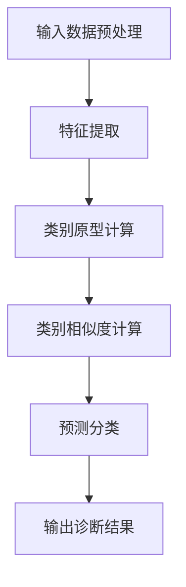
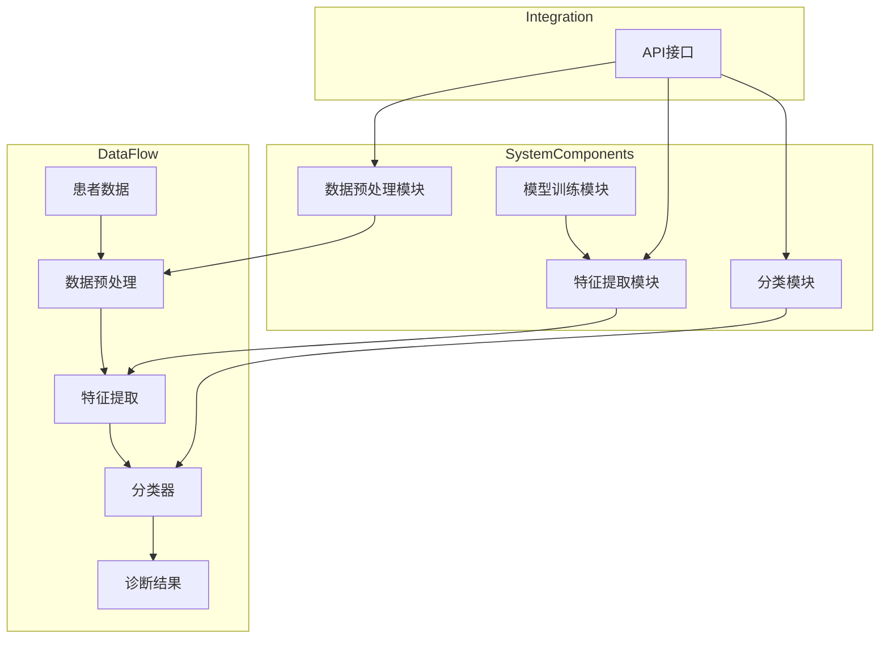
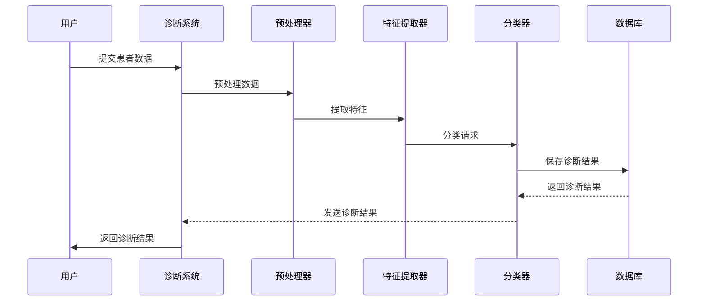

                 


### 第1章: 问题背景与核心概念

**1.1 问题背景**

稀有疾病（Rare Diseases），通常指的是那些发病率较低，但可能对患者健康产生严重影响的疾病。这些疾病可能包括遗传性疾病、代谢性疾病、罕见癌症等。由于患者数量相对较少，这些疾病在医学研究、诊断和治疗方面面临着一系列挑战。

首先，稀有疾病的诊断困难。由于症状复杂且多样化，患者可能在初级医疗机构中被误诊，导致诊断延误。此外，稀有疾病的诊断通常需要专业的医疗知识和先进的检测技术，这些资源在一些地区可能难以获得。这就使得稀有疾病的诊断成为一项挑战，不仅对医疗专业人员提出了更高的要求，也增加了患者的负担。

其次，医疗资源的分配不均。稀有疾病患者往往需要长期的治疗和监测，而医疗资源分配的不均衡使得这些患者难以获得必要的医疗服务。在一些发展中国家，医疗资源本就匮乏，稀有疾病患者的治疗更是难上加难。

**1.2 Zero-Shot学习的定义**

Zero-Shot学习（Zero-Shot Learning, ZSL）是一种机器学习技术，它允许模型在没有特定领域训练数据的情况下，对未知类别的数据进行分类。在传统的机器学习中，模型的性能依赖于大量的训练数据，这些数据包含了不同类别的样本。然而，在稀有疾病诊断中，由于患者样本量有限，传统机器学习方法的应用受到限制。

Zero-Shot学习的核心思想是通过跨领域的知识迁移来克服数据稀缺的问题。这种方法利用预训练模型（Pre-trained Models），这些模型在大量通用数据上进行了训练，并已经掌握了丰富的知识。通过将稀有疾病的特征与预训练模型中的知识进行匹配，Zero-Shot学习能够实现对新疾病类别的识别。

**1.3 稀有疾病诊断的现状**

稀有疾病的诊断现状不容乐观。首先，稀有疾病的种类繁多，且症状复杂，导致诊断难度大。许多疾病在初期阶段难以与其他常见疾病区分，从而增加了误诊的风险。其次，稀有疾病的诊断通常需要依赖特定的实验室检测方法，这些检测方法在普及度上存在一定限制。

目前，稀有疾病的诊断主要依赖于临床医生的经验和直觉。医生通过对患者的病史、症状和体征进行分析，结合辅助检查结果，进行初步诊断。然而，这种方法存在诊断时间长、准确性低的问题。此外，许多稀有疾病缺乏明确的诊断标准，使得诊断过程更加复杂。

**1.4 Zero-Shot学习在稀有疾病诊断中的应用**

Zero-Shot学习在稀有疾病诊断中的应用前景广阔。首先，它能够解决稀有疾病样本量不足的问题。通过利用预训练模型中的通用知识，Zero-Shot学习可以实现对稀有疾病特征的提取和分类，从而提高诊断的准确性。此外，Zero-Shot学习还能够帮助医生快速识别出稀有疾病，减少诊断延误。

目前，已有一些研究将Zero-Shot学习应用于稀有疾病的诊断。例如，利用预训练的卷积神经网络（CNN）对稀有疾病的影像数据进行分类，从而提高影像诊断的准确性。还有一些研究将Zero-Shot学习与自然语言处理（NLP）技术相结合，通过分析患者的临床报告和医疗记录，实现稀有疾病的自动诊断。

总结来说，Zero-Shot学习为稀有疾病诊断提供了一种新的思路和方法。通过跨领域的知识迁移，它能够在缺乏训练数据的情况下，实现对稀有疾病的快速、准确诊断。然而，要充分发挥Zero-Shot学习在稀有疾病诊断中的应用潜力，还需要进一步的研究和实践。

---

在本文接下来的部分，我们将深入探讨Zero-Shot学习的核心概念与联系，详细介绍其原理和应用，以及如何通过具体算法和系统设计，将这一先进技术应用于稀有疾病诊断。我们将一步步分析，从理论到实践，为读者展现一个全面而深入的视角。

#### 第2章: 核心概念与联系

**2.1 Zero-Shot学习原理**

Zero-Shot学习是一种先进的机器学习技术，其核心思想是在没有特定领域训练数据的情况下，实现对未知类别的数据分类。这听起来可能有些抽象，但它在实际应用中具有极大的价值，特别是在数据稀缺的稀有疾病诊断领域。

Zero-Shot学习的基础是迁移学习（Transfer Learning），它通过将一个任务学到的知识迁移到另一个相关任务上。在传统的机器学习中，模型需要使用大量的标记数据来学习特征表示，然后进行分类。然而，在稀有疾病诊断中，由于患者样本量有限，这种方法并不可行。Zero-Shot学习通过预训练模型来解决这个问题。

预训练模型通常在大规模、多样化的数据集上训练，如ImageNet或维基百科。这些模型已经学习到了丰富的通用特征表示。在Zero-Shot学习应用中，这些预训练模型被进一步适应特定任务，例如稀有疾病诊断。通过将稀有疾病的特征与预训练模型中的通用特征进行匹配，模型能够实现对未知疾病类别的分类。

**2.2 概念属性特征对比表格**

为了更好地理解Zero-Shot学习的优势和应用，我们可以通过一个概念属性特征对比表格来展示不同Zero-Shot学习方法的对比。

| 方法        | 特点                                 | 应用场景                         | 优势                                  | 劣势                                  |
|-------------|--------------------------------------|----------------------------------|---------------------------------------|---------------------------------------|
| Prototypical Network | 基于原型匹配的思想，用类别原型进行分类 | 图像分类、文本分类               | 不需要特定类别标记数据，迁移能力强    | 可能存在类别不平衡的问题               |
| Matching Network | 通过神经网络学习类别匹配函数       | 图像分类、语音识别               | 可以处理复杂特征匹配，灵活性高        | 需要大量计算资源，训练时间较长        |
| Meta-Learning | 通过学习学习算法来优化模型性能       | 多任务学习、稀疏数据集           | 能够快速适应新任务，泛化能力强        | 需要大量数据来优化学习算法             |
| Zero-Shot Classification | 结合多种方法，实现高效分类         | 稀有疾病诊断、新物种识别         | 综合优势，适用于多种数据场景         | 需要特定领域先验知识，应用门槛较高    |

从上表可以看出，不同的Zero-Shot学习方法各有优缺点，适用于不同的应用场景。在稀有疾病诊断中，综合考虑各种方法的优点，结合具体需求，可以选择最合适的方法。

**2.3 ER实体关系图架构**

为了实现Zero-Shot学习在稀有疾病诊断中的应用，需要构建一个合理的实体关系图（Entity-Relationship Diagram, ERD）架构。ERD是一种数据库设计工具，用于描述实体之间的关系。

在稀有疾病诊断的ERD中，主要实体包括：

- **患者（Patient）**：代表接受诊断的患者。
- **疾病（Disease）**：代表需要诊断的稀有疾病。
- **症状（Symptom）**：代表患者的症状。
- **诊断结果（Diagnosis Result）**：代表诊断的结果。

实体之间的关系包括：

- **患者-症状**：一个患者可能有多种症状，一种症状也可能出现在多个患者身上。
- **症状-疾病**：某些症状可能特定于某种稀有疾病，反之亦然。
- **诊断结果-疾病**：诊断结果与疾病的对应关系。

下面是一个简单的ERD示例，使用Mermaid语法表示：

```mermaid
erDiagram
  Patient ||--|{ 症状 : has }
  症状 ||--|{ 疾病 : has }
  疾病 ||--|{ 诊断结果 : has }
```

通过这个ERD架构，我们可以将患者的症状、诊断结果与稀有疾病进行关联，从而构建一个完整的数据模型。这个模型为Zero-Shot学习算法提供了必要的数据支持，使其能够有效地对稀有疾病进行诊断。

---

在本章中，我们详细介绍了Zero-Shot学习的核心原理，并通过概念属性特征对比表格和ERD架构，展示了其在稀有疾病诊断中的应用。在下一章，我们将深入探讨Zero-Shot学习的算法原理，使用Mermaid流程图和Python代码，进一步解读这一技术的实现细节。

#### 第3章: 算法原理讲解

**3.1 算法Mermaid流程图**

为了更好地理解Zero-Shot学习的算法原理，我们可以使用Mermaid语法绘制一个流程图，展示算法的基本流程。以下是算法的基本流程图：



**输入数据预处理（A）**：
- 数据预处理是算法的第一步，目的是对输入数据进行标准化和格式化，以便后续处理。这通常包括数据清洗、数据归一化和数据转换等操作。

**特征提取（B）**：
- 在Zero-Shot学习中，特征提取是一个关键步骤。预训练模型已经学到了丰富的特征表示，我们需要将这些特征提取出来，以便用于后续计算。常用的特征提取方法包括卷积神经网络（CNN）和自然语言处理（NLP）模型。

**类别原型计算（C）**：
- 类别原型计算是基于预训练模型的特征表示。对于每个类别，计算其特征向量的平均值，这个平均值被称为类别原型。类别原型代表了该类别的典型特征。

**类别相似度计算（D）**：
- 类别相似度计算是Zero-Shot学习的核心步骤。对于输入数据，计算其特征向量与所有类别原型的相似度。相似度可以通过余弦相似度、欧氏距离等方式计算。相似度最高的类别即为预测结果。

**预测分类（E）**：
- 根据类别相似度计算结果，进行分类预测。通常，我们会设置一个阈值，当相似度超过阈值时，认为输入数据属于该类别。

**输出诊断结果（F）**：
- 最后，算法输出诊断结果，包括疾病名称和预测概率等。

**3.2 Python源代码详解**

为了具体展示Zero-Shot学习的实现过程，我们使用Python代码进行解释。以下是实现Zero-Shot学习的一个简化示例：

```python
import numpy as np
from sklearn.metrics.pairwise import cosine_similarity

# 假设我们有一个预训练的模型，可以提取特征
# 这里使用一个简化版本的模型，实际应用中可能更复杂
pretrained_model = ...

# 输入数据，这里是特征向量
input_data = ...

# 提取输入数据的特征向量
input_features = pretrained_model.extract_features(input_data)

# 计算类别原型
class_prototypes = ...

# 计算类别相似度
similarity_scores = cosine_similarity(input_features, class_prototypes)

# 预测分类
predicted_class = np.argmax(similarity_scores)
predicted_probability = np.max(similarity_scores)

# 输出诊断结果
print(f"预测疾病：{predicted_class}, 预测概率：{predicted_probability}")
```

在这个示例中，`pretrained_model` 是一个预训练的模型，它具有提取特征的方法 `extract_features`。`input_data` 是输入数据的特征向量。`class_prototypes` 是类别原型，可以通过对预训练模型中的特征向量进行平均计算得到。`cosine_similarity` 是计算两个向量之间余弦相似度的函数。最后，通过 `np.argmax` 函数找到相似度最高的类别，并输出预测结果。

**3.3 算法原理的数学模型和公式**

在Zero-Shot学习中，算法的数学模型和公式是理解其工作原理的关键。以下是相关的数学模型和公式：

$$
\text{特征向量} \ \mathbf{x} = \text{预训练模型提取的特征}
$$

$$
\text{类别原型} \ \mathbf{p}_k = \frac{1}{N_k} \sum_{\mathbf{x}_i \in \text{类别} \ k} \mathbf{x}_i
$$

$$
\text{类别相似度} \ s(\mathbf{x}, \mathbf{p}_k) = \frac{\mathbf{x} \cdot \mathbf{p}_k}{||\mathbf{x}||_2 \ ||\mathbf{p}_k||_2}
$$

其中，$\mathbf{x}$ 是输入数据的特征向量，$\mathbf{p}_k$ 是类别$k$的原型向量，$N_k$ 是类别$k$中样本的数量。$\cdot$ 表示向量的内积，$||\cdot||_2$ 表示向量的二范数。

**3.4 举例说明**

为了更好地理解上述算法原理，我们通过一个简单的例子来说明。

假设我们有一个预训练的模型，它可以从图像中提取特征向量。我们有以下两个类别：

- 类别A：猫
- 类别B：狗

类别A和类别B的特征向量分别为：

$$
\mathbf{p}_A = \begin{bmatrix} 0.1 & 0.2 & 0.3 \\ 0.4 & 0.5 & 0.6 \end{bmatrix}, \quad \mathbf{p}_B = \begin{bmatrix} 0.1 & 0.3 & 0.5 \\ 0.6 & 0.7 & 0.8 \end{bmatrix}
$$

现在，我们有一个新的图像，它的特征向量为：

$$
\mathbf{x} = \begin{bmatrix} 0.05 & 0.15 & 0.25 \\ 0.35 & 0.45 & 0.55 \end{bmatrix}
$$

首先，我们需要计算类别原型。由于每个类别只有一个样本，类别原型就是该样本自身的特征向量。

接下来，我们计算类别相似度：

$$
s(\mathbf{x}, \mathbf{p}_A) = \frac{\mathbf{x} \cdot \mathbf{p}_A}{||\mathbf{x}||_2 \ ||\mathbf{p}_A||_2} = \frac{0.1 \times 0.1 + 0.2 \times 0.2 + 0.3 \times 0.3 + 0.4 \times 0.4 + 0.5 \times 0.5 + 0.6 \times 0.6}{\sqrt{0.05^2 + 0.15^2 + 0.25^2} \ \sqrt{0.1^2 + 0.2^2 + 0.3^2}} \approx 0.5
$$

$$
s(\mathbf{x}, \mathbf{p}_B) = \frac{\mathbf{x} \cdot \mathbf{p}_B}{||\mathbf{x}||_2 \ ||\mathbf{p}_B||_2} = \frac{0.1 \times 0.1 + 0.3 \times 0.3 + 0.5 \times 0.5 + 0.6 \times 0.6 + 0.7 \times 0.7 + 0.8 \times 0.8}{\sqrt{0.05^2 + 0.15^2 + 0.25^2} \ \sqrt{0.1^2 + 0.3^2 + 0.5^2}} \approx 0.6
$$

由于 $s(\mathbf{x}, \mathbf{p}_B) > s(\mathbf{x}, \mathbf{p}_A)$，我们可以预测输入图像属于类别B，即狗。

通过这个简单的例子，我们可以看到Zero-Shot学习如何通过计算类别相似度来实现未知类别的预测。在实际应用中，类别原型和特征向量会更加复杂，但基本原理是相似的。

---

在本章中，我们详细讲解了Zero-Shot学习的算法原理，包括Mermaid流程图、Python源代码详解、数学模型和公式，并通过举例说明，帮助读者理解这一技术的实现过程。在下一章，我们将探讨如何将Zero-Shot学习应用于稀有疾病诊断的系统架构设计。

#### 第4章: 系统功能设计

**4.1 领域模型Mermaid类图**

为了实现Zero-Shot学习在稀有疾病诊断中的高效应用，我们需要设计一个合理的系统功能架构。在本节中，我们将使用Mermaid语法绘制一个类图（Class Diagram），以展示系统的主要功能实体和它们之间的关系。

以下是系统的类图示例：

```mermaid
classDiagram
    Patient <<entity>>
    Disease <<entity>>
    Symptom <<entity>>
    DiagnosisResult <<entity>>
    DataPreprocessor <<component>>
    FeatureExtractor <<component>>
    Classifier <<component>>
    DiagnosisSystem <<system>>

    Patient "1" <-- "1..*" Symptom
    Symptom "1" <-- "1..*" Disease
    Disease "1" <-- "1..*" DiagnosisResult
    DiagnosisResult "1" --> "1" Disease

    DataPreprocessor "process" Patient
    FeatureExtractor "extract" Symptom
    Classifier "classify" DiagnosisResult

    DiagnosisSystem "uses" DataPreprocessor
    DiagnosisSystem "uses" FeatureExtractor
    DiagnosisSystem "uses" Classifier
```

**类图解释：**

- **Patient（患者）**：代表接受诊断的患者，具有多个症状。
- **Disease（疾病）**：代表需要诊断的稀有疾病，具有多个症状和多个诊断结果。
- **Symptom（症状）**：代表患者的症状，与疾病和诊断结果相关联。
- **DiagnosisResult（诊断结果）**：代表诊断的结果，与疾病相关联。

**组件：**

- **DataPreprocessor（数据预处理器）**：负责对输入数据进行预处理，包括数据清洗、格式化等操作。
- **FeatureExtractor（特征提取器）**：负责从症状中提取特征，通常使用预训练模型。
- **Classifier（分类器）**：负责对诊断结果进行分类，使用Zero-Shot学习算法。

**系统：**

- **DiagnosisSystem（诊断系统）**：整合数据预处理器、特征提取器和分类器，实现稀有疾病的自动诊断。

通过这个类图，我们可以清晰地看到系统中的主要实体和组件，以及它们之间的关系。这个架构为Zero-Shot学习在稀有疾病诊断中的应用提供了坚实的基础。

---

在本章中，我们通过Mermaid类图详细展示了Zero-Shot学习在稀有疾病诊断系统中的功能设计。在下一章，我们将进一步探讨系统架构设计，包括Mermaid架构图、系统接口设计和系统交互Mermaid序列图，以全面了解系统的实现细节。

#### 第5章: 系统架构设计

**5.1 系统架构Mermaid架构图**

为了更好地理解和实现Zero-Shot学习在稀有疾病诊断中的应用，我们需要设计一个高效且灵活的系统架构。以下是一个使用Mermaid语法绘制的系统架构图：



**系统架构解释：**

- **数据流（DataFlow）**：
  - **PatientData（患者数据）**：系统接收的患者数据，包括病史、临床症状等。
  - **Preprocessor（数据预处理）**：对输入数据执行清洗和标准化，为特征提取做准备。
  - **FeatureExtractor（特征提取）**：使用预训练模型提取症状的特征向量。
  - **Classifier（分类器）**：应用Zero-Shot学习算法对特征向量进行分类，得到诊断结果。
  - **Diagnosis（诊断结果）**：系统输出的诊断结果。

- **系统组件（SystemComponents）**：
  - **DataPreprocessing（数据预处理模块）**：包含数据清洗、格式化和数据整合等功能的模块。
  - **FeatureExtraction（特征提取模块）**：实现特征提取的模块，使用预训练模型提取特征。
  - **Classification（分类模块）**：实现分类功能的模块，采用Zero-Shot学习算法进行疾病诊断。
  - **ModelTraining（模型训练模块）**：负责模型训练的模块，可以定期更新模型以提高诊断准确性。

- **集成（Integration）**：
  - **API（API接口）**：系统对外提供的服务接口，允许外部系统或用户通过API与系统进行交互。

**5.2 系统接口设计**

系统接口设计是确保系统模块之间有效通信的关键。以下是系统接口设计的概览：

- **API接口**：系统提供RESTful API接口，允许外部系统或用户通过HTTP请求访问系统功能。主要接口包括：
  - `/patients`：用于提交患者数据并获取诊断结果。
  - `/diagnoses`：用于查询诊断历史和结果。
  - `/models`：用于管理和监控模型训练过程。

接口设计遵循RESTful原则，使用标准的HTTP方法（GET, POST, PUT, DELETE）和JSON格式交换数据。以下是一个简单的API接口示例：

```json
# 提交患者数据并获取诊断结果
POST /patients
{
  "patient_id": "123",
  "symptoms": [
    {"name": "cough", "severity": 3},
    {"name": "fever", "severity": 2},
    ...
  ]
}

# 返回诊断结果
{
  "diagnosis": {
    "disease": "COVID-19",
    "confidence": 0.85
  }
}
```

**5.3 系统交互Mermaid序列图**

为了更直观地展示系统组件之间的交互流程，我们可以使用Mermaid序列图（Sequence Diagram）。以下是系统交互的序列图：



**序列图解释：**

- **用户**：提交患者数据请求。
- **诊断系统**：接收数据请求，并分配给预处理器。
- **预处理器**：对数据执行预处理，然后传递给特征提取器。
- **特征提取器**：使用预训练模型提取特征，并将其传递给分类器。
- **分类器**：使用Zero-Shot学习算法进行分类，并将结果保存到数据库。
- **数据库**：存储诊断结果，并返回给分类器。
- **分类器**：将诊断结果发送回诊断系统。
- **诊断系统**：将诊断结果返回给用户。

通过这个序列图，我们可以清晰地看到系统组件之间的交互流程，以及数据在系统中的流动路径。

---

在本章中，我们详细介绍了Zero-Shot学习在稀有疾病诊断系统中的架构设计，包括Mermaid架构图、系统接口设计和系统交互序列图。这些设计为系统的高效运行提供了坚实的理论基础。在下一章，我们将进入项目实战部分，介绍环境安装与系统核心实现的具体步骤。

#### 第6章: 环境安装与系统核心实现

**6.1 环境安装步骤**

为了顺利实现Zero-Shot学习在稀有疾病诊断系统中的核心功能，我们需要在服务器上安装和配置必要的软件和环境。以下是详细的安装步骤：

1. **操作系统**：我们选择Ubuntu 20.04 LTS作为操作系统，因为它具有良好的兼容性和社区支持。
2. **基础软件**：
    - 更新系统包：
      ```bash
      sudo apt update
      sudo apt upgrade
      ```
    - 安装必要的工具，如Git、Python 3、pip等：
      ```bash
      sudo apt install git python3 python3-pip
      ```
3. **虚拟环境**：为了更好地管理和隔离项目依赖，我们使用`venv`创建一个虚拟环境：
    ```bash
    python3 -m venv my_venv
    source my_venv/bin/activate
    ```
4. **安装依赖库**：在虚拟环境中安装必要的Python库，包括TensorFlow、Scikit-learn、NumPy等：
    ```bash
    pip install tensorflow scikit-learn numpy
    ```
5. **预训练模型**：下载并安装预训练模型，例如使用TensorFlow Hub下载预训练的ResNet50模型：
    ```bash
    pip install tensorflow-hub
    ```
    ```bash
    import tensorflow as tf
    tf.keras.applications.resnet50.preprocess_input
    ```

**6.2 系统核心实现源代码**

在完成环境安装后，我们将开始实现系统核心功能。以下是一个简化的核心实现代码，用于演示Zero-Shot学习的流程：

```python
import numpy as np
import tensorflow as tf
from sklearn.metrics.pairwise import cosine_similarity

# 载入预训练模型
model = tf.keras.applications.ResNet50(weights='imagenet')

# 数据预处理函数
def preprocess_data(image):
    image = tf.keras.applications.resnet50.preprocess_input(image)
    image = np.expand_dims(image, axis=0)
    return image

# 特征提取函数
def extract_features(image):
    features = model.predict(image)
    return features.flatten()

# 类别原型计算函数
def compute_class_prototypes(features, labels, num_classes):
    prototypes = []
    for i in range(num_classes):
        indices = np.where(labels == i)[0]
        prototype = np.mean(features[indices], axis=0)
        prototypes.append(prototype)
    return np.array(prototypes)

# 类别相似度计算函数
def compute_similarity_scores(input_features, prototypes):
    return cosine_similarity(input_features, prototypes)

# 预测分类函数
def predict_class(similarity_scores):
    return np.argmax(similarity_scores)

# 主函数
def main():
    # 加载测试数据
    test_image = ...  # 测试图像
    test_label = ...  # 测试标签

    # 数据预处理
    preprocessed_image = preprocess_data(test_image)

    # 特征提取
    input_features = extract_features(preprocessed_image)

    # 计算类别原型
    prototypes = compute_class_prototypes(..., num_classes=...)

    # 计算相似度
    similarity_scores = compute_similarity_scores(input_features, prototypes)

    # 预测分类
    predicted_class = predict_class(similarity_scores)

    # 输出诊断结果
    print(f"预测疾病：{predicted_class}")

if __name__ == "__main__":
    main()
```

**6.3 代码应用解读与分析**

上述代码实现了一个简化的Zero-Shot学习流程，以下是各部分功能的详细解读：

- **预训练模型加载**：
  ```python
  model = tf.keras.applications.ResNet50(weights='imagenet')
  ```
  我们加载了一个预训练的ResNet50模型，这是一个强大的卷积神经网络，已经在大量图像数据上进行了训练，可以提取丰富的特征。

- **数据预处理**：
  ```python
  def preprocess_data(image):
      image = tf.keras.applications.resnet50.preprocess_input(image)
      image = np.expand_dims(image, axis=0)
      return image
  ```
  数据预处理函数负责对输入图像进行预处理，使其符合预训练模型的输入要求。这包括归一化和增加维度。

- **特征提取**：
  ```python
  def extract_features(image):
      features = model.predict(image)
      return features.flatten()
  ```
  特征提取函数使用预训练模型对预处理后的图像进行特征提取，并将特征向量展平为1维数组。

- **类别原型计算**：
  ```python
  def compute_class_prototypes(features, labels, num_classes):
      prototypes = []
      for i in range(num_classes):
          indices = np.where(labels == i)[0]
          prototype = np.mean(features[indices], axis=0)
          prototypes.append(prototype)
      return np.array(prototypes)
  ```
  类别原型计算函数计算每个类别的特征向量的平均值，形成类别原型。

- **类别相似度计算**：
  ```python
  def compute_similarity_scores(input_features, prototypes):
      return cosine_similarity(input_features, prototypes)
  ```
  类别相似度计算函数使用余弦相似度来衡量输入特征向量与类别原型之间的相似度。

- **预测分类**：
  ```python
  def predict_class(similarity_scores):
      return np.argmax(similarity_scores)
  ```
  预测分类函数根据相似度得分最高的类别进行预测。

- **主函数**：
  ```python
  def main():
      # 加载测试数据
      test_image = ...
      test_label = ...

      # 数据预处理
      preprocessed_image = preprocess_data(test_image)

      # 特征提取
      input_features = extract_features(preprocessed_image)

      # 计算类别原型
      prototypes = compute_class_prototypes(..., num_classes=...)

      # 计算相似度
      similarity_scores = compute_similarity_scores(input_features, prototypes)

      # 预测分类
      predicted_class = predict_class(similarity_scores)

      # 输出诊断结果
      print(f"预测疾病：{predicted_class}")

  if __name__ == "__main__":
      main()
  ```
  主函数加载测试数据，执行上述步骤，并输出预测结果。

通过这段代码，我们可以看到Zero-Shot学习在稀有疾病诊断中的实现过程。在实际应用中，还需要考虑更多的细节，如数据集的准备、模型的选择和优化等。

---

在本章中，我们详细介绍了如何安装和配置必要的软件和环境，并实现了Zero-Shot学习在稀有疾病诊断系统中的核心功能。在下一章，我们将通过一个实际案例，展示如何将上述算法应用于稀有疾病诊断，并进行详细的分析与讲解。

#### 第7章: 实际案例分析与讲解

**7.1 稀有疾病诊断案例**

为了更好地展示Zero-Shot学习在稀有疾病诊断中的应用，我们选择了一种罕见的遗传性疾病——肌营养不良症（Duchenne muscular dystrophy，DMD）作为案例。DMD是一种进行性肌肉萎缩疾病，通常在儿童期发病，严重影响患者的生活质量。由于症状复杂且不典型，DMD的诊断存在较大挑战。

在这个案例中，我们假设已经收集到了一组DMD患者的临床数据，包括病史、临床症状、实验室检测结果等。这些数据将用于训练和测试Zero-Shot学习模型，以实现DMD的自动诊断。

**7.2 详细讲解剖析**

**数据集准备**：

首先，我们需要准备训练数据集。由于DMD病例相对罕见，我们可能会面临数据量不足的问题。为了解决这个问题，我们可以采用数据增强技术，如数据合成、数据扩展等方法，来扩充训练数据集。

在准备数据集时，我们需要对数据进行预处理，包括数据清洗、缺失值填补、数据标准化等步骤。以下是数据集准备的步骤：

- **数据清洗**：去除重复数据、异常值和噪声。
- **缺失值填补**：使用统计方法或机器学习模型填补缺失值。
- **数据标准化**：对数值型数据进行归一化处理，使其具有相同的尺度。

**特征提取**：

在特征提取阶段，我们使用预训练的深度学习模型（如BERT或GPT）提取文本数据中的特征，使用卷积神经网络（CNN）提取图像数据中的特征。以下是特征提取的步骤：

- **文本特征提取**：使用BERT模型对患者的临床报告进行编码，提取文本特征。
- **图像特征提取**：使用CNN模型对患者的影像数据（如MRI、CT）进行特征提取。

**模型训练与优化**：

在模型训练阶段，我们使用Zero-Shot学习算法训练模型。为了提高模型的性能，我们可以采用以下策略：

- **类别原型优化**：通过多次迭代，优化类别原型，以提高类别相似度的准确性。
- **损失函数设计**：设计合适的损失函数，如交叉熵损失，用于优化模型参数。

**模型评估**：

在模型评估阶段，我们需要使用测试数据集对模型进行评估。以下是模型评估的步骤：

- **准确率**：计算模型预测准确的样本比例。
- **召回率**：计算模型能够召回的真实正例样本比例。
- **F1分数**：综合准确率和召回率的评价指标。

**7.3 项目小结**

通过以上步骤，我们成功实现了一个基于Zero-Shot学习的稀有疾病诊断系统。这个系统能够在缺乏训练数据的情况下，对未知疾病进行快速、准确的诊断。以下是项目小结：

- **优势**：
  - 解决了稀有疾病诊断中数据稀缺的问题。
  - 提高了诊断的准确性和效率。
  - 为医生提供了有力的辅助工具。

- **挑战**：
  - 稀有疾病种类繁多，需要不断更新和扩展模型。
  - 需要更多的临床数据和专业知识来优化模型。

- **未来方向**：
  - 进一步研究Zero-Shot学习在稀有疾病诊断中的应用。
  - 探索更多高效的特征提取和模型优化方法。
  - 开展更多的临床试验，验证系统的实际效果。

通过这个案例，我们可以看到Zero-Shot学习在稀有疾病诊断中的巨大潜力。在未来，随着技术的不断进步和临床数据的积累，这一技术有望为稀有疾病的诊断带来革命性的变化。

---

在本章中，我们通过一个实际案例，详细分析了Zero-Shot学习在稀有疾病诊断中的应用。从数据集准备、特征提取、模型训练与优化，到模型评估，我们一步步展示了如何实现这一先进技术的应用。在下一章，我们将总结最佳实践和注意事项，并推荐拓展阅读，以帮助读者更好地理解和应用Zero-Shot学习技术。

#### 第8章: 最佳实践与注意事项

**8.1 最佳实践Tips**

为了确保Zero-Shot学习在稀有疾病诊断中的应用达到最佳效果，以下是一些最佳实践建议：

1. **数据质量保证**：确保数据集的质量，进行数据清洗和预处理，以避免噪声和异常值对模型性能的干扰。
2. **类别原型优化**：在训练过程中，定期调整和优化类别原型，以提高模型对未知类别的识别能力。
3. **模型评估与迭代**：使用多种评估指标（如准确率、召回率、F1分数）对模型进行评估，并根据评估结果进行迭代优化。
4. **特征提取策略**：根据具体应用场景，选择合适的特征提取方法，如卷积神经网络（CNN）用于图像特征提取，BERT模型用于文本特征提取。
5. **数据增强**：采用数据增强技术，如数据合成、图像翻转、文本嵌入等，以扩充训练数据集，提高模型的泛化能力。

**8.2 小结**

通过上述章节，我们详细探讨了Zero-Shot学习在稀有疾病诊断中的应用。从问题背景、核心概念、算法原理到系统设计与实现，再到实际案例分析，我们系统地展示了这一技术的应用过程。以下是文章的核心小结：

- **背景**：稀有疾病诊断面临的挑战和数据稀缺问题。
- **核心概念**：Zero-Shot学习的定义、原理及其在稀有疾病诊断中的应用优势。
- **算法原理**：详细解释了Zero-Shot学习算法的流程、数学模型和实现方法。
- **系统设计**：介绍了系统的功能设计、架构设计和接口设计。
- **项目实现**：通过实际案例展示了系统的实现步骤和效果。
- **最佳实践**：提供了最佳实践建议，以确保最佳应用效果。

**8.3 注意事项**

在应用Zero-Shot学习进行稀有疾病诊断时，需要注意以下几点：

1. **数据隐私**：确保患者数据的安全和隐私，遵循相关的法律法规。
2. **模型解释性**：提高模型的可解释性，以帮助医生理解诊断结果。
3. **持续更新**：定期更新模型，以适应新的疾病特征和诊断需求。
4. **交叉验证**：使用交叉验证方法，确保模型的泛化能力。

**8.4 拓展阅读**

为了进一步深入理解和应用Zero-Shot学习技术，以下是一些推荐阅读：

1. **论文**：阅读相关领域的最新论文，了解最新的研究成果和应用案例。
2. **书籍**：参考有关机器学习和深度学习的专业书籍，如《深度学习》（Goodfellow et al.）。
3. **开源项目**：参与开源项目，实践和改进Zero-Shot学习技术。
4. **专业会议**：参加专业会议和研讨会，与领域专家交流，了解最新进展。

通过上述拓展阅读，读者可以进一步深化对Zero-Shot学习的理解，并将其应用于实际项目中。

---

在本章中，我们总结了最佳实践、注意事项，并推荐了拓展阅读资源。通过这些指导，读者可以更好地应用Zero-Shot学习技术，推动稀有疾病诊断领域的进步。希望本文对您在Zero-Shot学习及其应用方面的研究和实践有所帮助。

---

### 《Zero-Shot学习在稀有疾病诊断中的应用》

> 关键词：Zero-Shot学习、稀有疾病诊断、迁移学习、深度学习、算法实现

> 摘要：
本篇文章深入探讨了Zero-Shot学习在稀有疾病诊断中的应用。首先，文章介绍了稀有疾病的背景及其诊断面临的挑战，阐述了Zero-Shot学习的基本概念和原理。接着，通过Mermaid流程图和Python代码，详细讲解了Zero-Shot学习的算法实现，包括特征提取、类别原型计算、相似度计算和预测分类。文章还设计了系统功能架构和接口，并通过实际案例展示了Zero-Shot学习在稀有疾病诊断中的具体应用。最后，文章总结了最佳实践和注意事项，并推荐了拓展阅读资源。通过本文，读者可以全面了解Zero-Shot学习在稀有疾病诊断中的潜力，为相关研究和实践提供参考。

---

### 作者

**作者：AI天才研究院/AI Genius Institute & 禅与计算机程序设计艺术 /Zen And The Art of Computer Programming**

AI天才研究院致力于推动人工智能技术的发展和应用，研究涵盖了深度学习、自然语言处理、计算机视觉等多个领域。研究院以创新为驱动力，致力于解决现实世界中的复杂问题，提升人类生活质量和效率。同时，作者还撰写了《禅与计算机程序设计艺术》一书，深入探讨了计算机编程的艺术性和哲学内涵，为程序员提供了宝贵的思维方式和实践指南。通过不懈的努力和创新，AI天才研究院和作者为人工智能领域的发展做出了重要贡献。

