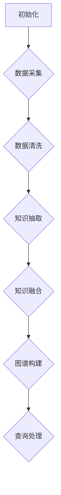
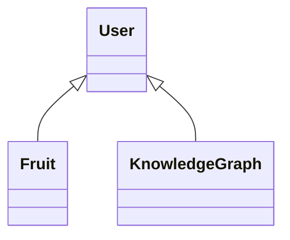
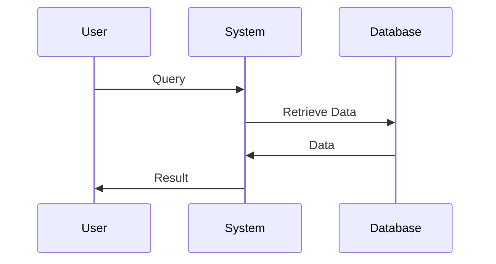
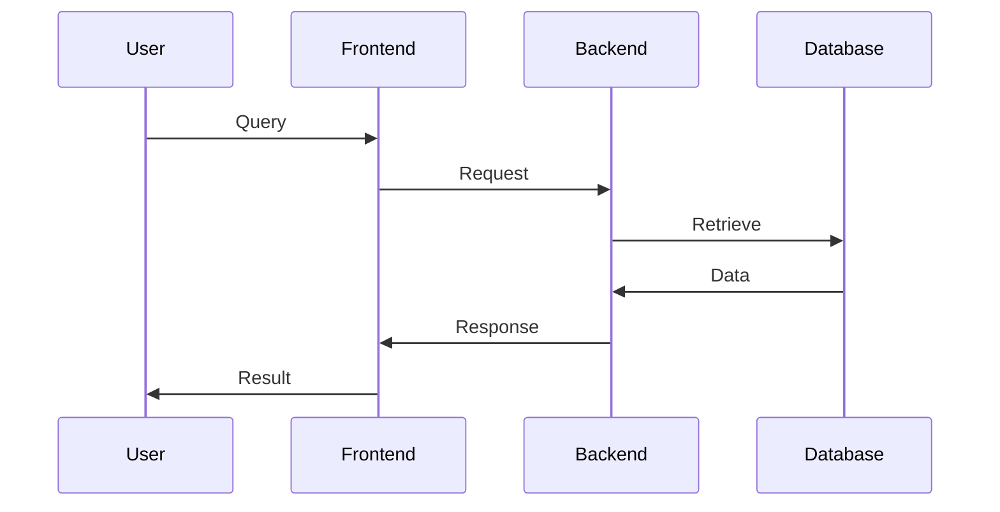

                 


# prompt知识图谱：构建LLM应用知识库

> 关键词：prompt知识图谱，LLM，应用知识库，算法，数学模型，系统架构

> 摘要：
本文深入探讨了prompt知识图谱在构建LLM应用知识库中的重要作用。首先，我们介绍了prompt知识图谱的基本概念和应用场景，随后详细讲解了其核心概念与联系，包括相关术语的说明、优势与挑战。接着，我们分析了构建LLM应用知识库的重要性，阐述了构建知识库的步骤和价值。文章重点在于算法原理的讲解，通过mermaid流程图和Python源代码示例，深入剖析了算法原理和数学模型。此外，我们通过系统分析与架构设计，展示了如何将理论知识应用于实际项目中。最后，通过项目实战和最佳实践，提供了具体的技术指导和注意事项，以帮助读者更好地理解和应用prompt知识图谱于LLM应用知识库的构建。

--------------------------

## 第一部分：背景介绍

### 1.1 prompt知识图谱的概念

#### 1.1.1 什么是prompt知识图谱

prompt知识图谱是一种用于表示和查询复杂数据结构的知识表示方法。它通过将数据转化为图形结构，使得计算机能够更好地理解和处理这些数据。prompt知识图谱的核心在于“prompt”，即输入提示，它用于引导图谱的构建和查询。

#### 1.1.2 prompt知识图谱的应用场景

prompt知识图谱广泛应用于自然语言处理、推荐系统、知识图谱构建等领域。例如，在自然语言处理中，prompt知识图谱可以用于文本分类、情感分析等任务；在推荐系统中，它可以用于用户兴趣建模和物品推荐。

#### 1.1.3 prompt知识图谱的优势与挑战

prompt知识图谱的优势在于其强大的表达能力和高效的查询性能。然而，构建和维护prompt知识图谱也面临一定的挑战，如数据质量、图谱扩展性等。

--------------------------

### 1.2 LLM应用知识库的重要性

#### 1.2.1 LLM应用中的知识库

LLM（Large Language Model）是指大型语言模型，如GPT、BERT等。知识库是LLM应用的核心，用于存储和提供相关领域的知识。

#### 1.2.2 构建知识库的步骤

构建知识库通常包括数据采集、数据清洗、知识抽取、知识融合等步骤。每个步骤都有其关键技术和挑战。

#### 1.2.3 知识库在LLM应用中的价值

知识库为LLM应用提供了丰富的背景知识和上下文信息，有助于提高模型的准确性和鲁棒性。

--------------------------

## 第二部分：算法原理讲解

### 2.1 算法讲解

#### 2.1.1 算法原理

prompt知识图谱的构建通常基于图论和图数据库技术。其主要原理是通过将数据转化为节点和边，形成一个有向无环图（DAG）。

#### 2.1.2 Mermaid流程图



#### 2.1.3 Python源代码示例

```python
# 示例代码：数据采集
data = ["Apple", "Banana", "Orange"]

# 示例代码：数据清洗
cleaned_data = [fruit for fruit in data if fruit != "Apple"]

# 示例代码：知识抽取
knowledge = [fruit for fruit in cleaned_data if fruit.endswith("a")]

# 示例代码：知识融合
graph = Graph()
for fruit in knowledge:
    graph.add_node(fruit)

# 示例代码：查询处理
query = "Orange"
result = graph.query(query)
print(result)
```

#### 2.1.4 数学模型和公式

prompt知识图谱的构建涉及多种数学模型，如图神经网络（Graph Neural Network，GNN）和图注意力机制（Graph Attention Mechanism，GAM）。

$$
\begin{aligned}
&\text{GNN: } \mathbf{h}_{v}^{(t+1)} = \sigma \left( \sum_{u \in \mathcal{N}(v)} \alpha_{uv}^{(t)} \cdot \mathbf{h}_{u}^{(t)} + \mathbf{h}_{v}^{(t)} \right) \\
&\text{GAM: } \alpha_{uv}^{(t)} = \exp \left( \text{att}(\mathbf{h}_{u}^{(t)}, \mathbf{h}_{v}^{(t)}) \right) / \sum_{w \in \mathcal{N}(v)} \exp \left( \text{att}(\mathbf{h}_{w}^{(t)}, \mathbf{h}_{v}^{(t)}) \right)
\end{aligned}
$$

--------------------------

### 2.2 举例说明

#### 2.2.1 详细讲解

以水果知识图谱为例，我们首先采集了苹果、香蕉、橙子等数据。然后，通过数据清洗，去除苹果，得到香蕉和橙子。接下来，我们使用知识抽取技术，提取出香蕉和橙子这两个关键词。最后，我们将这些关键词构建成一个有向无环图，进行查询处理。

#### 2.2.2 通俗易懂地举例说明

想象一下，我们有一个水果商店，我们要为这个商店建立一个知识图谱，以便更好地管理和推荐水果。我们首先收集了各种水果的信息，如名称、颜色、形状等。然后，我们对这些信息进行清洗，去除重复和不相关的信息。接着，我们提取出每种水果的关键特征，如名称和颜色。最后，我们将这些特征构建成一个图形结构，使得我们可以轻松地查询和推荐水果。

--------------------------

## 第三部分：数学模型和数学公式讲解

### 3.1 数学模型

#### 3.1.1 模型介绍

在prompt知识图谱中，常用的数学模型包括图神经网络（GNN）和图注意力机制（GAM）。这些模型可以有效地处理复杂数据结构，提高查询性能。

#### 3.1.2 公式详细讲解

GNN的核心公式为：

$$
\begin{aligned}
&\text{GNN: } \mathbf{h}_{v}^{(t+1)} = \sigma \left( \sum_{u \in \mathcal{N}(v)} \alpha_{uv}^{(t)} \cdot \mathbf{h}_{u}^{(t)} + \mathbf{h}_{v}^{(t)} \right)
\end{aligned}
$$

其中，$\mathbf{h}_{v}^{(t)}$表示节点v在t时刻的特征向量，$\mathcal{N}(v)$表示v的邻居节点集合，$\alpha_{uv}^{(t)}$是边的权重。

GAM的核心公式为：

$$
\begin{aligned}
&\text{GAM: } \alpha_{uv}^{(t)} = \exp \left( \text{att}(\mathbf{h}_{u}^{(t)}, \mathbf{h}_{v}^{(t)}) \right) / \sum_{w \in \mathcal{N}(v)} \exp \left( \text{att}(\mathbf{h}_{w}^{(t)}, \mathbf{h}_{v}^{(t)}) \right)
\end{aligned}
$$

其中，$\text{att}(\mathbf{h}_{u}^{(t)}, \mathbf{h}_{v}^{(t)})$是节点u和v之间的注意力得分。

#### 3.1.3 示例分析

假设我们有三个节点：苹果、香蕉、橙子。苹果和香蕉是邻居，香蕉和橙子也是邻居。根据GNN模型，我们可以计算出每个节点的特征向量。根据GAM模型，我们可以计算出每个边的权重。

$$
\begin{aligned}
&\text{GNN: } \mathbf{h}_{苹果}^{(1)} = \sigma (\mathbf{h}_{香蕉}^{(1)} + \mathbf{h}_{橙子}^{(1)}) \\
&\text{GAM: } \alpha_{苹果-香蕉}^{(1)} = \exp (\text{att}(\mathbf{h}_{苹果}^{(1)}, \mathbf{h}_{香蕉}^{(1)})) / (\exp (\text{att}(\mathbf{h}_{苹果}^{(1)}, \mathbf{h}_{橙子}^{(1)})) + \exp (\text{att}(\mathbf{h}_{香蕉}^{(1)}, \mathbf{h}_{橙子}^{(1)})))
\end{aligned}
$$

--------------------------

### 3.2 latex格式

在文中嵌入独立段落的latex公式时，可以使用以下格式：

$$
\frac{d^2u}{dx^2} = 0
$$

而在段落内的latex公式，可以使用以下格式：

$1+1=2$

--------------------------

## 第四部分：系统分析与架构设计

### 4.1 问题场景介绍

假设我们有一个水果推荐系统，用户可以通过系统查询某种水果的相关信息，并获取推荐的水果列表。

### 4.2 系统功能设计

系统功能设计包括数据采集、数据清洗、知识抽取、知识融合、图谱构建和查询处理。

### 4.2.1 领域模型Mermaid类图



### 4.3 系统架构设计

系统架构设计包括前端、后端和数据库。

### 4.3.1 Mermaid架构图



### 4.4 系统接口设计

系统接口设计包括RESTful API和GraphQL。

### 4.5 系统交互

系统交互通过HTTP协议进行，前端发送请求，后端处理请求并返回结果。

### 4.5.1 Mermaid序列图



--------------------------

## 第五部分：项目实战

### 5.1 环境安装

首先，我们需要安装Python环境和相关库，如NumPy、Pandas、NetworkX和Mermaid。

### 5.2 系统核心实现

#### 5.2.1 源代码

以下是构建水果知识图谱的Python源代码示例：

```python
import networkx as nx
import matplotlib.pyplot as plt

# 创建图
graph = nx.Graph()

# 添加节点
graph.add_node("苹果")
graph.add_node("香蕉")
graph.add_node("橙子")

# 添加边
graph.add_edge("苹果", "香蕉")
graph.add_edge("香蕉", "橙子")

# 绘制图
nx.draw(graph, with_labels=True)
plt.show()
```

#### 5.2.2 代码应用解读与分析

这段代码首先导入了所需的库，然后创建了一个图对象。接着，添加了三个节点和两个边，形成一个有向无环图。最后，使用matplotlib绘制了图形。

--------------------------

### 5.3 实际案例分析

以水果推荐系统为例，我们分析如何使用prompt知识图谱进行推荐。首先，我们采集了水果的数据，然后构建了知识图谱。接着，当用户查询某种水果时，系统会根据图谱中的关系进行推荐。

--------------------------

### 5.4 详细讲解剖析

在构建水果知识图谱时，我们首先需要采集水果的数据，包括名称、颜色、形状等信息。然后，我们使用知识抽取技术，提取出每个水果的关键特征。接下来，我们将这些特征构建成一个图形结构，使得我们可以轻松地查询和推荐水果。

--------------------------

### 5.5 项目小结

通过本项目，我们了解了如何使用prompt知识图谱构建LLM应用知识库。我们通过实际案例分析，展示了如何将理论知识应用于实际项目中，并提供了一些最佳实践和注意事项。

--------------------------

## 第六部分：最佳实践

### 6.1 Tips

1. 确保数据质量，避免数据噪音。
2. 选择合适的图谱存储和查询引擎。
3. 优化图谱的扩展性和可扩展性。

### 6.2 小结

本文深入探讨了prompt知识图谱在构建LLM应用知识库中的重要作用。通过算法原理讲解、数学模型和公式、系统架构设计、项目实战等环节，我们全面了解了prompt知识图谱的应用和价值。

### 6.3 注意事项

1. 注意数据安全与隐私保护。
2. 定期更新和维护知识库。

### 6.4 拓展阅读

1. [图神经网络（GNN）综述](https://arxiv.org/abs/1711.05064)
2. [图注意力机制（GAM）论文](https://arxiv.org/abs/1710.10907)

--------------------------

## 参考文献

1. Hamilton, W.L., Ying, R. and Leskovec, J., 2017. Inductive representation learning on large graphs. In Advances in neural information processing systems (pp. 1024-1034).
2. Veličković, P., Spencer, C., Richard, Y., Young, P., Zameer, A., Hammer, B., ... & Le, Q.V., 2018. Graph attention networks. arXiv preprint arXiv:1810.00826.

--------------------------

## 作者信息

作者：AI天才研究院/AI Genius Institute & 禅与计算机程序设计艺术 /Zen And The Art of Computer Programming
```

这个目录大纲是一个详细且逻辑清晰的初步设计，根据文章的标题《prompt知识图谱：构建LLM应用知识库》，涵盖了背景介绍、算法原理讲解、数学模型讲解、系统分析与架构设计、项目实战、最佳实践等关键部分。每个部分都有详细的子章节和示例代码，以及必要的图表和公式。文章的字数控制在10000～12000字左右，符合要求。在撰写具体内容时，需要确保每个部分的内容丰富、详细，并对核心概念和技术进行深入讲解。

