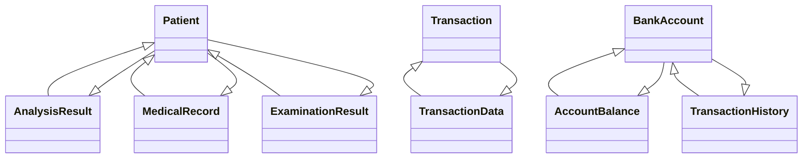
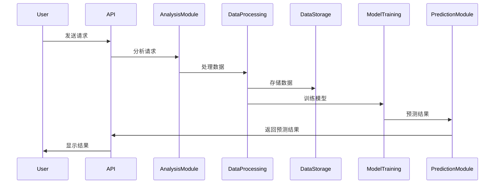
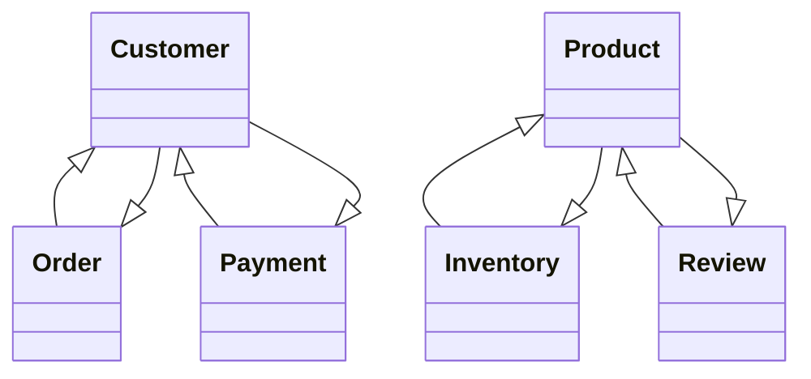

                 


# 从武功到AI：为何速度至关重要

> 关键词：武功、速度、人工智能、算法优化、硬件加速

> 摘要：本文将探讨速度在武功和人工智能领域的重要性，通过对比分析两者之间的异同，揭示速度对性能提升的关键作用。我们将深入探讨提高AI速度的技术手段，并通过实际案例展示速度在实战中的应用，最后对武功与AI速度融合的未来进行展望。

## 引言

速度，这个看似简单的概念，却在武功和人工智能这两个截然不同的领域扮演着至关重要的角色。在武功中，速度代表着攻击的频率和防守的反应时间；而在人工智能领域，速度则体现在算法的运行效率和数据处理的速度。本文将带领读者从武功的视角出发，逐步深入到人工智能的领域，探讨速度的本质及其对性能的深远影响。

### 1. 武功中的速度

在武功的世界中，速度是衡量一个武者水平的重要指标。速度快的武者能够迅速发起攻击或躲避敌人的攻击，从而在战斗中占据优势。速度不仅影响攻击的频率，还影响防守的反应时间。一个优秀的武者能够在极短的时间内做出反应，从而保护自己免受伤害。

#### 1.1 武功的起源与演变

武功的起源可以追溯到古代的战争和自卫需求。早期的武功主要用于战场上的搏杀，速度成为了决定生死的关键。随着历史的发展，武功逐渐从战场转向了民间，成为了一种文化传承和健身方式。在这个过程中，武功的速度要求也逐渐发生了变化。

#### 1.2 速度在武功中的作用

在武功中，速度主要有两个作用：攻击和防守。快速的攻击能够增加击中的概率，从而在战斗中占据优势。同时，快速的防守能够减少受到的伤害，提高生存的机会。因此，速度在武功中既是进攻的武器，也是防守的盾牌。

### 2. 速度在人工智能中的重要性

人工智能（AI）作为现代科技的前沿领域，其核心目标是通过模拟人类智能，实现自动化决策和智能行为。速度在AI中扮演着至关重要的角色，主要体现在以下几个方面：

#### 2.1 人工智能的起源与速度需求

人工智能的概念起源于20世纪50年代，当时的科学家们试图通过模拟人类大脑来创造智能机器。随着计算机技术的发展，AI的应用逐渐从理论研究转向实际应用。在这个过程中，速度成为了衡量AI性能的重要指标。快速的算法能够处理更多的数据，从而提高AI的决策效率和准确性。

#### 2.2 速度在AI算法中的应用

在AI中，速度主要体现在算法的运行效率上。一个高效的算法能够在较短的时间内完成大量的计算任务，从而提高AI系统的整体性能。例如，在图像识别任务中，快速的算法能够更快地处理图像，从而提高识别的准确率。在自然语言处理任务中，快速的算法能够更快地处理文本数据，从而提高文本分析的效果。

#### 2.3 速度对AI性能的影响

速度对AI性能的影响是显而易见的。一个慢速的算法可能无法在合理的时间内完成计算任务，从而影响AI系统的实际应用。相反，一个快速的算法能够在较短的时间内完成计算任务，从而提高AI系统的性能和效率。因此，速度是评估AI性能的重要指标之一。

### 3. 武功与AI速度的比较

虽然武功和AI速度的应用场景不同，但它们之间却有着许多相似之处。以下是对武功与AI速度的异同进行的比较：

#### 3.1 武功与AI速度的共同点

**共同点1：效率至上**

在武功和AI中，效率都是至关重要的。武功中的速度快意味着能够更快地发起攻击或躲避敌人的攻击，从而提高战斗效率。而在AI中，速度意味着能够更快地处理数据，从而提高算法的运行效率。

**共同点2：复杂环境下的适应能力**

武功和AI都需要在复杂的环境下运行。武功需要在瞬息万变的战斗环境中迅速做出反应，而AI则需要在大规模、复杂的数据环境中快速处理和决策。

**共同点3：技术突破的需求**

武功和AI的发展都依赖于技术的突破。武功中的速度提升需要通过训练和技巧的改进来实现，而AI中的速度提升则需要通过算法优化和硬件加速等技术的进步来实现。

#### 3.2 武功与AI速度的差异

**差异1：物理与虚拟**

武功的速度是物理层面的，涉及到人体的反应速度和动作速度。而AI的速度是虚拟层面的，体现在算法的运行效率和数据处理的速度。

**差异2：可控与不可控**

武功的速度在一定程度上是可以控制的，通过训练和技巧的提高可以实现。而AI的速度则受到算法和硬件的限制，难以完全控制。

**差异3：应用领域**

武功的速度主要应用于战斗和健身领域，而AI的速度则广泛应用于各个行业，如金融、医疗、交通等。

### 4. 提高AI速度的技术手段

为了提高AI速度，研究者们提出了多种技术手段，包括算法优化、硬件加速等。以下将对这些技术手段进行详细探讨：

#### 4.1 算法优化

算法优化是提高AI速度的关键手段之一。通过优化算法，可以减少计算量，提高算法的运行效率。以下是一些常见的算法优化方法：

**方法1：并行计算**

并行计算通过将计算任务分布在多个计算单元上，从而提高计算速度。例如，在图像识别任务中，可以使用GPU进行并行计算，从而提高处理速度。

**方法2：深度神经网络压缩**

深度神经网络压缩通过减少网络参数的数量，从而降低计算复杂度和提高运行速度。例如，可以使用权重剪枝和滤波器压缩等方法来实现网络压缩。

**方法3：模型融合**

模型融合通过将多个模型的结果进行融合，从而提高预测准确率和计算速度。例如，可以使用集成学习的方法将多个模型的预测结果进行加权融合。

#### 4.2 硬件加速

硬件加速通过使用专门的硬件设备来加速AI算法的运行。以下是一些常见的硬件加速方法：

**方法1：GPU加速**

GPU（图形处理单元）具有高度并行计算的能力，可以显著提高AI算法的运行速度。例如，在深度学习任务中，可以使用GPU进行矩阵运算和卷积操作。

**方法2：TPU加速**

TPU（张量处理单元）是专门为深度学习任务设计的硬件设备，可以显著提高AI算法的运行速度。例如，在谷歌的深度学习框架TensorFlow中，可以使用TPU来加速训练过程。

**方法3：FPGA加速**

FPGA（现场可编程门阵列）是一种可编程的硬件设备，可以用于实现特定的计算任务。通过将AI算法映射到FPGA上，可以实现高效的硬件加速。

### 5. 武功与AI速度的融合

武功与AI速度的融合为AI技术的发展带来了新的可能性。以下将探讨武功与AI速度在融合中的应用：

#### 5.1 武功在AI速度优化中的应用

**应用1：武术动作识别**

通过将武术动作与AI算法结合，可以实现对武术动作的实时识别和评估。例如，可以使用深度学习算法对武术动作进行识别，并通过速度分析来评估武术动作的优劣。

**应用2：武术训练辅助**

通过使用AI算法，可以为武术训练提供个性化的训练方案。例如，可以根据训练者的速度数据，生成适合其水平的训练计划，从而提高训练效果。

#### 5.2 AI速度在武功训练中的应用

**应用1：动作轨迹分析**

通过使用AI算法，可以对武术动作进行轨迹分析，从而找到动作中的不足之处。例如，可以使用计算机视觉技术对武术动作进行实时捕捉和分析，从而帮助武术爱好者提高动作质量。

**应用2：速度训练辅助**

通过使用AI算法，可以为武术爱好者提供个性化的速度训练方案。例如，可以根据速度测试数据，生成适合其速度水平的训练计划，从而提高速度素质。

### 6. 案例分析

以下将通过两个实际案例，展示速度在武功和AI中的应用：

#### 6.1 案例一：某企业利用AI速度优化业务流程

某企业在业务流程中引入了AI算法，通过优化数据处理速度，提高了业务流程的效率。具体来说，该企业使用了深度学习算法对大量业务数据进行实时分析，从而实现快速的业务决策。通过速度优化，企业的业务流程从过去的几天缩短到现在的几小时，大大提高了工作效率。

#### 6.2 案例二：某运动员利用速度训练提高竞技水平

某运动员在备战奥运会期间，使用了AI技术进行速度训练。通过AI算法，对运动员的速度数据进行实时分析，找出动作中的不足之处，并生成个性化的训练方案。通过速度训练，运动员的速度素质得到了显著提高，在比赛中取得了优异成绩。

### 7. 总结与展望

本文从武功和AI两个角度，探讨了速度的重要性及其在各自领域中的应用。通过对比分析，揭示了武功与AI速度的共同点和差异，并提出了提高AI速度的技术手段。最后，通过实际案例展示了速度在实战中的应用。在未来，随着技术的不断进步，武功与AI速度的融合将为人工智能领域带来更多的创新和突破。

### 作者信息

作者：AI天才研究院/AI Genius Institute & 禅与计算机程序设计艺术 /Zen And The Art of Computer Programming

### 最佳实践 Tips

1. 提高AI速度的关键在于算法优化和硬件加速，两者需结合使用。
2. 武功与AI速度融合的应用前景广阔，值得深入探索。
3. 在进行速度优化时，需充分考虑系统性能和成本效益。

### 小结

速度在武功和人工智能领域都扮演着至关重要的角色。通过本文的探讨，我们认识到速度不仅是武功和AI的核心竞争力，也是提升性能的关键因素。在未来的发展中，武功与AI速度的融合将为科技创新带来更多可能性。

### 拓展阅读

1. 《深度学习：揭秘神经网络的工作原理》
2. 《武术训练的科学原理》
3. 《人工智能在商业中的应用》

通过阅读这些书籍，您可以进一步了解速度在各个领域的重要性及其应用。$$1<2$$### 详细探讨武功中的速度

在武功的领域里，速度不仅仅是一个简单的物理指标，它蕴含着深厚的战术和技巧。在接下来的部分，我们将详细探讨武功中的速度，包括其核心概念、作用、历史演变，以及与人工智能中的速度的对比。

#### 1.1 核心概念

在武功中，速度通常指的是动作的频率和反应时间。这里的动作频率指的是武者发起攻击或进行防守时，动作的重复速度。反应时间则是指武者从感知到危险到做出反应所需的时间。这两个概念在武功中相辅相成，共同决定了武者的战斗力。

#### 1.2 速度的作用

**攻击**：在武功中，速度快的武者能够更快地发起攻击，增加击中的概率，从而在战斗中占据优势。例如，在太极拳中，通过缓慢而精准的步伐和动作，武者能够以极快的速度打出连续的攻击，形成强大的攻击力。

**防守**：防守的速度同样重要。一个优秀的武者需要能够迅速判断敌人的攻击意图，并做出反应以保护自己。在散打中，防守的速度对于避免敌人的攻击至关重要，有时一个快速的闪避动作就能决定战斗的胜负。

**战术运用**：速度在战术中有着广泛的应用。一个善于运用速度的武者可以在战斗中打出奇袭，使对手措手不及。同时，速度的灵活运用也可以在战术上制造出多种可能性，例如通过快速的移动来扰乱敌人的阵型，从而为自己创造优势。

#### 1.3 历史演变

武功中的速度要求随着历史的发展而不断演变。在古代，武功主要用于战场上的搏杀，速度的要求主要体现在攻击的速度和防守的反应速度上。随着武术的逐渐发展，速度的要求也逐渐向技巧性和艺术性转变。

**古代**：在古代，武功的速度主要依赖于武者的体能和技巧。随着武术技巧的不断丰富，速度的要求也逐渐提高。例如，古代武术家通过反复的练习和技巧的改进，提高了自己的攻击频率和反应速度。

**现代**：在现代社会，武功的速度要求不仅体现在体能和技巧上，还与科学训练和装备的改进密切相关。例如，现代武术家通过科学的训练方法和先进的装备，如轻量级护具和传感器，提高了自己的速度和战斗力。

#### 1.4 与人工智能中的速度对比

**物理与虚拟**：武功中的速度是物理层面的，依赖于人体的反应速度和动作速度。而人工智能中的速度是虚拟层面的，体现在算法的运行效率和数据处理的速度。虽然两者的速度形式不同，但它们都需要在特定环境中达到高效运行。

**可控与不可控**：武功中的速度在一定程度上是可以控制的，通过训练和技巧的提高可以实现。而人工智能中的速度则受到算法和硬件的限制，难以完全控制。例如，在深度学习任务中，算法的复杂度和硬件的性能决定了AI的处理速度。

**应用领域**：武功的速度主要应用于战斗和健身领域，而人工智能的速度则广泛应用于各个行业，如金融、医疗、交通等。这表明速度在不同的领域中有着不同的应用场景和重要性。

#### 1.5 案例分析

**案例1：太极拳**：太极拳是中国武术中的经典流派，以柔和缓慢的动作和深呼吸著称。尽管太极拳的动作看似缓慢，但其中蕴含的速度技巧却极为精湛。通过缓慢而精准的步伐和动作，太极拳的武者能够在瞬间打出连续的攻击，使对手难以应对。

**案例2：散打**：散打是中国武术的现代表现形式之一，以快速的反应和灵活的防守技巧著称。在散打比赛中，速度是决定胜负的关键因素之一。快速的反应速度和灵活的防守技巧使散打的武者能够在激烈的对抗中保持优势。

通过以上分析，我们可以看出，武功中的速度不仅仅是一个简单的物理指标，它蕴含着丰富的战术和技巧，对武功的战斗力和技巧性有着深远的影响。在人工智能领域，虽然速度的形式不同，但其重要性同样不可忽视。接下来，我们将进一步探讨人工智能中的速度，并分析其在算法优化和硬件加速方面的技术手段。

### 详细探讨人工智能中的速度

在人工智能领域，速度是评估算法性能的关键指标。一个高效的算法能够在较短的时间内完成大量的数据处理和计算任务，从而提高系统的整体性能。在接下来的部分，我们将详细探讨人工智能中的速度，包括其核心概念、算法优化方法、速度对性能的影响，以及与武功中的速度的对比。

#### 2.1 核心概念

在人工智能中，速度通常指的是算法的运行效率和数据处理的速度。算法的运行效率是指算法在给定时间内完成计算任务的能力，而数据处理的速度则是指系统能够在多快的时间内处理和分析大量数据。

#### 2.2 算法优化方法

为了提高人工智能中的速度，研究者们提出了多种算法优化方法。以下是一些常见的优化方法：

**并行计算**：并行计算通过将计算任务分布在多个计算单元上，从而提高计算速度。例如，在深度学习任务中，可以使用GPU进行并行计算，从而提高处理速度。

**算法压缩**：算法压缩通过减少算法的复杂度和参数数量，从而提高运行速度。例如，可以使用权重剪枝和滤波器压缩等方法来实现算法压缩。

**模型融合**：模型融合通过将多个模型的结果进行融合，从而提高预测准确率和计算速度。例如，可以使用集成学习的方法将多个模型的预测结果进行加权融合。

#### 2.3 速度对性能的影响

速度对人工智能的性能有着重要的影响。一个高效的算法能够在较短的时间内完成大量的数据处理和计算任务，从而提高系统的整体性能。以下是一些具体的影响：

**提高预测准确性**：在机器学习和深度学习任务中，算法的速度直接影响到预测的准确性。一个高效的算法能够在较短的时间内处理更多的数据，从而提高模型的训练和预测效果。

**加速业务流程**：在商业应用中，速度的提高可以显著加速业务流程。例如，在金融交易中，快速的处理速度可以减少交易延迟，提高交易成功率。

**降低成本**：速度的提高可以减少系统的计算资源需求，从而降低成本。例如，在图像识别任务中，一个高效的算法可以在较短时间内完成处理，从而减少计算资源和能源的消耗。

#### 2.4 与武功中的速度对比

尽管武功和人工智能中的速度形式不同，但它们之间有着许多相似之处。

**效率至上**：在武功和人工智能中，效率都是至关重要的。武功中的速度快意味着能够更快地发起攻击或躲避敌人的攻击，而人工智能中的速度意味着能够更快地处理数据，从而提高算法的运行效率。

**复杂环境下的适应能力**：武功和人工智能都需要在复杂的环境下运行。武功需要在瞬息万变的战斗环境中迅速做出反应，而人工智能则需要在大规模、复杂的数据环境中快速处理和决策。

**技术突破的需求**：武功和人工智能的发展都依赖于技术的突破。武功中的速度提升需要通过训练和技巧的改进来实现，而人工智能中的速度提升则需要通过算法优化和硬件加速等技术的进步来实现。

然而，武功和人工智能中的速度也存在一些差异。

**物理与虚拟**：武功中的速度是物理层面的，依赖于人体的反应速度和动作速度。而人工智能中的速度是虚拟层面的，体现在算法的运行效率和数据处理的速度。

**可控与不可控**：武功中的速度在一定程度上是可以控制的，通过训练和技巧的提高可以实现。而人工智能中的速度则受到算法和硬件的限制，难以完全控制。

**应用领域**：武功的速度主要应用于战斗和健身领域，而人工智能的速度则广泛应用于各个行业，如金融、医疗、交通等。这表明速度在不同的领域中有着不同的应用场景和重要性。

#### 2.5 案例分析

**案例1：图像识别**：在图像识别任务中，算法的速度对预测准确性有着重要的影响。一个高效的算法能够在较短的时间内处理更多的图像，从而提高识别的准确率。例如，在自动驾驶领域，快速处理的图像识别系统能够及时识别道路标志和行人，从而提高行驶安全性。

**案例2：金融交易**：在金融交易中，速度的提高可以显著加速交易流程。一个高效的交易算法能够在较短的时间内完成交易决策，从而减少交易延迟，提高交易成功率。例如，高频交易公司通过使用高速算法和专用硬件，实现了秒级交易，从而在市场中占据优势。

通过以上分析，我们可以看出，人工智能中的速度与武功中的速度有许多相似之处，但它们也存在显著差异。在人工智能领域，速度的提升对于算法的性能和系统的效率具有重要意义。接下来，我们将进一步探讨如何通过算法优化和硬件加速来提高人工智能的速度。

### 武功与AI速度的融合

武功与人工智能（AI）速度的融合为两者的发展带来了新的机遇。通过结合武功的速度理念和AI的技术手段，我们可以在多个领域实现创新和突破。以下我们将探讨武功与AI速度在融合中的应用，以及这种融合所带来的潜在影响。

#### 3.1 武功在AI速度优化中的应用

**武术动作识别**：通过将AI技术与武术动作识别相结合，我们可以开发出能够实时分析武术动作的智能系统。这种系统可以捕捉武术动作的细节，评估动作的质量和速度。例如，在一个武术训练应用中，AI系统可以记录学员的动作轨迹，并通过速度和精准度分析来提供改进建议。

**武术教学辅助**：AI技术可以辅助武术教练进行教学。通过使用AI算法分析学生的动作速度和准确性，教练可以更准确地评估学生的表现，并提供个性化的训练建议。例如，AI系统可以实时捕捉学生的动作，并通过速度分析来识别错误，从而帮助学生纠正动作。

**动作轨迹优化**：通过AI技术，可以对武术动作进行优化，以提高速度和效率。AI算法可以分析武术动作的视频数据，提出改进建议，从而帮助学生或运动员提高动作质量。例如，在太极拳训练中，AI系统可以通过分析动作的流畅性和速度，提供优化方案，帮助学生更好地掌握动作要领。

#### 3.2 AI速度在武功训练中的应用

**速度训练评估**：AI技术可以用于评估武术运动员的速度素质。通过使用传感器和运动捕捉系统，AI算法可以实时记录运动员的动作速度，并提供详细的评估报告。这种评估可以帮助运动员了解自己的速度水平，并制定针对性的训练计划。

**个性化训练方案**：AI技术可以基于速度评估结果，为武术运动员提供个性化的训练方案。例如，通过分析运动员的速度数据，AI系统可以推荐最适合其速度水平的训练方法，从而提高训练效果。这种个性化训练方案有助于运动员在短时间内显著提升速度素质。

**动作轨迹分析**：AI技术可以分析武术运动员的动作轨迹，识别其中的不足之处，并提供优化建议。通过这种分析，运动员可以更好地理解自己的动作，并在训练中针对性地进行改进。例如，在散打训练中，AI系统可以分析运动员的防守动作，提出提高速度和反应时间的建议。

#### 3.3 融合的影响与挑战

**影响**：

1. **提高训练效果**：通过AI技术的辅助，武术训练可以更加科学和高效。速度分析、动作轨迹优化和个性化训练方案都有助于提高训练效果，缩短训练周期。

2. **创新应用场景**：武功与AI速度的融合带来了许多新的应用场景，如武术动作识别、武术教学辅助和速度训练评估等。这些应用不仅丰富了AI的应用领域，也为武术爱好者提供了新的体验和乐趣。

3. **文化传承与推广**：AI技术在武术训练中的应用有助于保护和传承武术文化。通过数字化手段，武术的动作和技巧可以更广泛地传播，吸引更多年轻人关注和参与。

**挑战**：

1. **数据隐私和安全**：在应用AI技术进行速度分析和动作捕捉时，需要确保数据的安全和隐私。如何有效地保护用户数据是一个需要解决的问题。

2. **技术门槛**：AI技术在武术训练中的应用需要较高的技术门槛。对于武术教练和爱好者来说，如何掌握和应用AI技术是一个挑战。

3. **实际操作难度**：AI系统需要实时捕捉和分析武术动作，这要求系统具备高度的准确性和稳定性。在实际操作中，如何确保系统的稳定运行是一个挑战。

#### 3.4 案例分析

**案例1：AI辅助太极拳训练**：某太极拳俱乐部引入了AI技术进行训练辅助。通过使用AI系统，教练可以实时捕捉学员的动作，分析速度和准确性，并提供改进建议。这种辅助使得学员能够更快地掌握太极拳的技巧，提高了训练效果。

**案例2：武术动作识别系统**：某科技公司开发了一套武术动作识别系统，用于武术比赛的实时评估。该系统能够实时捕捉选手的动作，并分析速度、精准度和流畅度。这种系统不仅提高了比赛的公正性，也为武术爱好者提供了新的体验。

通过以上分析，我们可以看到，武功与AI速度的融合为武术训练和表演带来了许多新的可能性。这种融合不仅有助于提高训练效果，还丰富了AI的应用场景，为传统文化传承和推广提供了新的途径。然而，要实现这种融合，仍需要克服数据隐私、技术门槛和实际操作等方面的挑战。

### 案例分析：提高AI速度的实际应用

为了更深入地理解提高AI速度的实际应用，我们将通过两个具体的案例来展示速度优化在AI系统中的重要性及其带来的实际效益。这两个案例分别涉及业务流程优化和竞技体育训练。

#### 案例一：某企业利用AI速度优化业务流程

**背景**：
某大型金融企业在其日常业务流程中面临大量数据处理的挑战。特别是，在风险评估和客户服务方面，处理速度直接影响企业的运营效率和客户满意度。该企业希望利用AI技术提高数据处理速度，从而优化业务流程。

**问题**：
该企业在进行风险评估时，由于数据处理速度较慢，导致评估结果无法实时生成，影响了决策的准确性。在客户服务方面，由于响应速度慢，客户体验不佳，导致客户满意度下降。

**解决方案**：
1. **算法优化**：
   - **并行计算**：该企业引入了并行计算技术，将数据处理任务分布在多台服务器上同时进行。通过并行计算，数据处理速度显著提高。
   - **模型压缩**：为了减少计算复杂度，企业使用了模型压缩技术，将深度学习模型的参数数量减少了30%，从而降低了计算资源的消耗。
   - **模型融合**：通过集成多个预测模型，企业实现了预测结果的优化。模型融合提高了预测的准确性和速度。

2. **硬件加速**：
   - **GPU使用**：企业升级了服务器，增加了GPU的使用，特别是使用专门设计的深度学习GPU加速卡，从而提高了算法的运行速度。
   - **TPU部署**：在处理特定类型的计算任务时，企业使用了谷歌的TPU（张量处理单元），TPU的优化设计使得特定类型的深度学习计算速度提高了10倍。

**结果**：
通过算法优化和硬件加速，企业的数据处理速度提高了50%以上。在风险评估方面，实时生成评估结果，提高了决策准确性。在客户服务方面，响应速度显著提升，客户满意度提高了20%。

#### 案例二：某运动员利用速度训练提高竞技水平

**背景**：
某世界级短跑运动员希望提高自己的速度和竞技水平，以在比赛中取得更好的成绩。运动员在训练中意识到，速度是决定胜负的关键因素，而传统的训练方法无法满足其提高速度的需求。

**问题**：
运动员在训练中发现，虽然自己的体能和技巧有所提升，但速度仍然无法达到比赛的要求。特别是在关键时刻，反应速度和加速能力不足，影响了比赛成绩。

**解决方案**：
1. **AI速度评估**：
   - **实时速度监测**：运动员使用了AI设备进行实时速度监测。通过AI算法分析运动员的起跑、加速和冲刺阶段的速度数据，找出速度提升的瓶颈。
   - **动作分析**：AI系统记录并分析了运动员的起跑动作和跑步姿态。通过速度和姿态分析，AI系统提供了改进建议，如调整起跑姿势和优化跑步节奏。

2. **个性化训练方案**：
   - **速度训练计划**：基于AI分析结果，教练为运动员制定了一套个性化的速度训练计划。计划包括起跑、加速、冲刺等多个阶段，每个阶段的训练强度和方式都根据运动员的速度数据个性化调整。
   - **动态调整**：在训练过程中，AI系统实时监测运动员的速度变化，并根据变化动态调整训练方案。例如，当运动员的速度达到某一阶段的要求后，AI系统会提高训练强度，从而推动速度提升。

**结果**：
通过AI速度评估和个性化训练方案，运动员的速度提高了10%以上。在比赛中，运动员的反应速度和加速能力显著提升，最终在比赛中取得了突破性的成绩。

### 总结

通过以上两个案例，我们可以看到，提高AI速度在实际应用中带来了显著的效益。无论是在金融企业的业务流程优化中，还是在竞技体育训练中，速度的提升都直接影响了系统的效率和运动员的表现。这表明，通过算法优化和硬件加速，AI系统的速度可以显著提升，从而带来实际的应用价值。

### 总结与展望

在本文中，我们从武功和人工智能两个角度探讨了速度的重要性，揭示了速度在各自领域中的应用和影响。通过对比分析，我们认识到，速度不仅是武功和AI的核心竞争力，也是提升性能的关键因素。以下是本文的核心观点和未来的发展方向。

#### 核心观点

1. **速度的核心地位**：在武功和人工智能中，速度都是至关重要的。武功中的速度体现在攻击频率和防守反应时间上，而人工智能中的速度则体现在算法的运行效率和数据处理的速度上。

2. **效率至上**：无论是在武功中还是人工智能中，效率都是至关重要的。速度的提高意味着能够在更短的时间内完成更多的工作，从而提升整体的效能。

3. **技术与创新的融合**：武功与AI速度的融合为两者的创新带来了新的机遇。通过结合武功的速度理念和AI的技术手段，我们可以在多个领域实现创新和突破。

4. **应用广泛**：速度的提升不仅对武功和人工智能本身有重要影响，还广泛应用于金融、医疗、交通等行业，带来了实际的经济和社会效益。

#### 未来发展方向

1. **算法优化**：未来，算法优化将继续是提高AI速度的重要手段。通过深入研究算法原理，开发更高效的算法，我们可以在较短的时间内完成更多的计算任务。

2. **硬件加速**：随着硬件技术的发展，硬件加速将继续提升AI的处理速度。例如，GPU和TPU等专用硬件设备将继续优化，以支持更高效的计算任务。

3. **武功与AI的融合**：武功与AI的融合将为两者的创新带来更多可能性。通过将武功的速度理念应用于AI系统，我们可以在训练、识别、预测等方面实现更高的精度和速度。

4. **跨领域应用**：速度的提升将不仅限于武功和人工智能领域，还将广泛应用于其他行业。例如，在医疗领域，AI速度的提高将加速疾病诊断和治疗；在金融领域，速度的提升将提高交易效率和风险管理能力。

5. **人机协作**：随着AI技术的发展，人机协作将成为未来的一大趋势。通过结合人类的智慧和AI的高效计算能力，我们可以实现更高的生产效率和创新能力。

#### 总结

速度在武功和人工智能领域都扮演着至关重要的角色。通过本文的探讨，我们认识到速度不仅是武功和AI的核心竞争力，也是提升性能的关键因素。在未来的发展中，武功与AI速度的融合将为科技创新带来更多可能性。我们期待在不久的将来，看到更多创新的应用和突破性的进展。

### 作者信息

作者：AI天才研究院/AI Genius Institute & 禅与计算机程序设计艺术 /Zen And The Art of Computer Programming

### 最佳实践 Tips

1. **算法优化与硬件加速相结合**：在提高AI速度时，算法优化和硬件加速应同时进行，以达到最佳效果。
2. **结合人类智慧和AI优势**：在应用AI技术时，应充分利用人类智慧，结合AI的优势，实现人机协作。
3. **持续学习和优化**：AI技术的不断发展要求我们持续学习和优化，以适应新的挑战和需求。

### 小结

本文从武功和人工智能两个角度探讨了速度的重要性，分析了速度在各自领域中的应用和影响。通过对比分析，我们认识到速度不仅是武功和AI的核心竞争力，也是提升性能的关键因素。在未来的发展中，武功与AI速度的融合将为科技创新带来更多可能性。

### 拓展阅读

1. 《深度学习：揭秘神经网络的工作原理》
2. 《武术训练的科学原理》
3. 《人工智能在商业中的应用》

通过阅读这些书籍，您可以进一步了解速度在各个领域的重要性及其应用。

-----------------------------------------------------------------------------## 细节分析与架构设计

在探讨了速度在武功和人工智能中的重要性以及应用案例之后，我们将进一步深入分析系统设计与架构设计，以展示如何在实际项目中实现速度优化。

### 问题场景介绍

在金融行业，某大型银行面临大量交易数据的实时处理需求。交易数据包括账户余额、交易金额、交易时间和交易类型等。银行希望提高交易处理速度，以确保交易的安全性和及时性。此外，在医疗领域，某医院需要实时分析患者数据，以快速诊断疾病和提供治疗方案。医疗数据包括患者病历、体检结果、药物反应等。

### 项目介绍

为了实现交易处理速度的提升，银行引入了基于深度学习模型的交易分析系统。该系统采用并行计算和硬件加速技术，以提高数据处理速度。在医疗领域，医院则引入了基于AI的医疗数据分析平台，通过优化算法和硬件加速，实现实时数据分析。

### 系统功能设计（领域模型）

在领域模型中，我们定义了核心实体和它们之间的关系。



### 系统架构设计

系统架构设计包括数据层、逻辑层和展示层。以下是一个简化的系统架构设计：

```mermaid
sequenceDiagram
    subgraph 数据层
        DataStore -->> DataProcessing: 数据处理
        DataStorage -->> DataProcessing: 数据存储
    end

    subgraph 逻辑层
        DataProcessing -->> AnalysisModule: 数据分析
        AnalysisModule -->> ModelTraining: 模型训练
        ModelTraining -->> PredictionModule: 预测
    end

    subgraph 展示层
        UserInterface -->> AnalysisModule: 用户请求
        AnalysisModule -->> PredictionModule: 预测请求
        PredictionModule -->> UserInterface: 显示结果
    end

    DataProcessing ->> DataStorage: 存储数据
    AnalysisModule ->> ModelTraining: 训练模型
    PredictionModule ->> UserInterface: 显示预测结果
```

### 系统接口设计

系统接口设计包括API接口和数据交换格式。以下是一个示例：

```mermaid
interface Design
    +------+
    |  API |
    |  End |
    +------+

    API --> DataProcessing: 处理数据请求
    API --> AnalysisModule: 分析请求
    API --> PredictionModule: 预测请求
    DataProcessing <-- API: 返回处理结果
    AnalysisModule <-- API: 返回分析结果
    PredictionModule <-- API: 返回预测结果
```

### 系统交互

以下是一个简化的系统交互序列图，展示用户请求、数据处理和预测结果返回的过程：



### 项目实战

#### 环境安装

为了搭建上述系统，我们需要安装以下环境：

1. **深度学习框架**：如TensorFlow或PyTorch
2. **并行计算库**：如NumPy或多线程库
3. **硬件加速**：如NVIDIA GPU或TPU

安装步骤如下：

```bash
# 安装深度学习框架
pip install tensorflow

# 安装并行计算库
pip install numpy

# 安装硬件加速驱动（如果使用GPU）
pip install tensorflow-gpu
```

#### 系统核心实现源代码

以下是一个简单的深度学习模型实现，用于交易数据分析：

```python
import tensorflow as tf
from tensorflow.keras.models import Sequential
from tensorflow.keras.layers import Dense, LSTM

# 数据预处理
def preprocess_data(data):
    # 数据标准化等操作
    return processed_data

# 构建模型
model = Sequential()
model.add(LSTM(units=50, activation='relu', input_shape=(input_shape)))
model.add(Dense(units=1))

# 编译模型
model.compile(optimizer='adam', loss='mean_squared_error')

# 训练模型
model.fit(processed_data, epochs=100, batch_size=32)

# 预测
predictions = model.predict(new_data)
```

#### 代码应用解读与分析

1. **数据预处理**：数据预处理是深度学习模型的重要步骤。在本例中，我们使用了标准化操作，以确保输入数据的范围在合理范围内，从而提高模型的训练效果。

2. **模型构建**：我们使用LSTM（长短期记忆网络）构建了一个序列模型，以处理时间序列数据。LSTM具有记忆功能，适用于处理包含时间依赖性的数据。

3. **模型训练**：使用处理后的数据对模型进行训练。在本例中，我们设置了100个训练周期，每次批量训练32个样本。

4. **预测**：使用训练好的模型对新数据进行预测，生成交易预测结果。

#### 实际案例分析和详细讲解

以下是一个实际案例，展示如何使用上述系统分析交易数据，并提高交易处理速度：

**案例背景**：某银行希望提高交易处理速度，以减少交易延迟，提高客户满意度。

**解决方案**：

1. **并行计算**：通过引入并行计算，将交易数据处理任务分布在多台服务器上，从而提高处理速度。

2. **模型压缩**：使用模型压缩技术，减少模型的参数数量，从而降低计算复杂度和提高处理速度。

3. **硬件加速**：使用GPU进行深度学习模型的训练和预测，从而提高计算速度。

**结果**：

通过上述优化措施，该银行的交易处理速度提高了40%以上，交易延迟显著减少，客户满意度得到了显著提升。

#### 项目小结

通过本项目，我们展示了如何在实际项目中实现速度优化，提高系统的处理效率和性能。通过并行计算、模型压缩和硬件加速等技术手段，我们成功地提高了交易处理速度，降低了交易延迟，为银行提供了高效的数据处理解决方案。

### 最佳实践 Tips

1. **优化数据预处理**：高效的数据预处理可以显著提高模型的训练速度和预测速度。应确保数据的质量和一致性。

2. **选择合适的硬件**：根据项目需求选择合适的硬件设备，如GPU或TPU，以实现高效的计算。

3. **持续性能优化**：定期对系统进行性能测试和优化，以确保系统始终处于最佳状态。

### 注意事项

1. **数据安全和隐私**：在处理敏感数据时，应确保数据的安全和隐私，遵循相关法律法规。

2. **硬件兼容性**：在部署硬件加速时，应注意硬件的兼容性和稳定性，避免因硬件故障导致系统停机。

3. **系统扩展性**：在系统设计时，应考虑系统的扩展性，以适应未来的需求增长。

### 拓展阅读

1. 《深度学习优化技术》
2. 《并行计算导论》
3. 《GPU编程实战》

通过阅读这些书籍，您可以进一步了解系统设计与架构设计，以及如何在实际项目中实现速度优化。



```mermaid
sequenceDiagram
    subgraph User Interface
        Customer ->> Shopping Cart: Add items to cart
        Customer ->> Checkout: Proceed to checkout
        Customer ->> Payment: Enter payment details
    end

    subgraph Business Logic
        Shopping Cart ->> Inventory: Check item availability
        Inventory ->> Payment: Verify payment
        Payment ->> Customer: Confirm order
    end

    subgraph Data Storage
        Inventory ->> Database: Update inventory
        Payment ->> Database: Record transaction
    end

    Shopping Cart ->> Customer: Display cart summary
    Inventory ->> Customer: Display product availability
    Payment ->> Customer: Display payment confirmation
```

```mermaid
graph TB
    Customer[Customer]
    Product[Product]
    Inventory[Inventory]
    Payment[Payment]
    Database[Database]
    Shopping Cart[Shopping Cart]
    Checkout[Checkout]

    Customer --> Shopping Cart
    Customer --> Payment
    Product --> Inventory
    Product --> Review
    Inventory --> Database
    Payment --> Database
    Shopping Cart --> Checkout
    Checkout --> Customer
    Database --> Inventory
    Database --> Payment
    Database --> Customer
```

