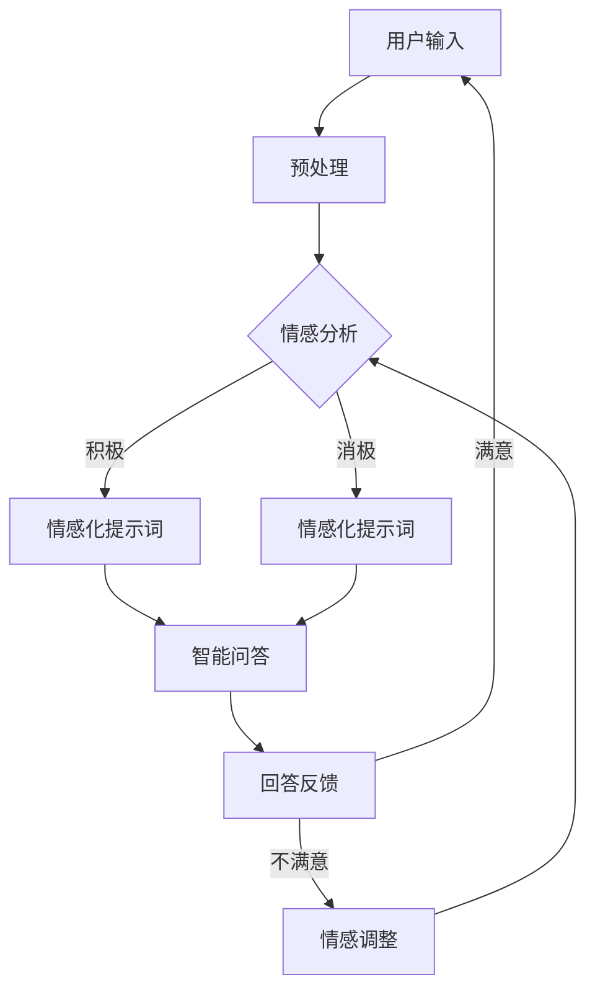
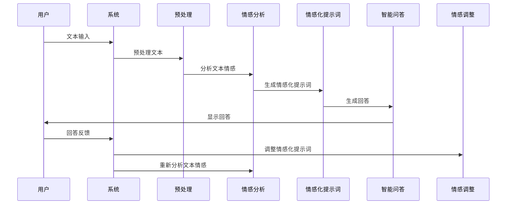

                 

### 文章标题

优化AI虚拟助手：个性化和情感化的提示词技巧

---

### 关键词

AI虚拟助手、个性化、情感化、提示词、算法原理、项目实战、最佳实践

### 摘要

本文深入探讨了如何通过个性化和情感化的提示词技巧来优化AI虚拟助手。文章首先介绍了AI虚拟助手的发展背景和现状，随后详细阐述了个性化与情感化提示词的概念、原理及设计方法。通过数学模型和Python代码分析，本文讲解了相关算法的原理与应用。随后，文章以实际项目为例，展示了如何在实践中应用这些技巧。最后，文章总结了最佳实践，并提出了未来的研究方向。

---

### 目录

## 引言

### AI虚拟助手概述

#### 发展历程

#### 现状与挑战

#### 个性化和情感化的重要性

## 第一部分：核心概念

### 个性化提示词原理

#### 定义

#### 属性

#### 生成方法

### 情感化提示词原理

#### 定义

#### 类型

#### 生成方法

### 提示词技巧的应用场景

#### 客服领域

#### 教育领域

#### 健康领域

## 第二部分：算法原理

### 个性化提示词算法

#### 用户画像构建

#### 提示词生成算法

#### 提示词效果评估

### 情感化提示词算法

#### 情感分析算法

#### 情感化提示词生成算法

#### 情感化提示词效果评估

### 算法融合与应用

#### 个性化与情感化提示词融合策略

#### 多模型融合应用

#### 算法优化与调参技巧

## 第三部分：系统分析与架构设计

### 问题场景介绍

### 项目介绍

#### 系统功能设计

#### 系统架构设计

#### 系统接口设计

#### 系统交互

## 第四部分：项目实战

### 环境安装

### 系统核心实现

### 代码应用解读与分析

### 实际案例分析与详细讲解

### 项目小结

## 第五部分：最佳实践与拓展

### 最佳实践技巧

#### 个性化和情感化提示词设计

#### 算法优化实践

#### 项目实施经验

### 小结

### 注意事项

### 拓展阅读推荐

## 结束语

---

### 引言

### AI虚拟助手概述

#### 发展历程

AI虚拟助手的概念起源于20世纪90年代，随着互联网和计算机技术的发展，虚拟助手逐渐成为现实。早期的虚拟助手主要应用于客户服务领域，如在线客服机器人。随着自然语言处理（NLP）和机器学习（ML）技术的进步，虚拟助手的功能得到显著增强，能够处理更为复杂的任务，例如提供个性化建议、情感化互动等。

#### 现状与挑战

目前，AI虚拟助手已经广泛应用于各个领域，包括客服、教育、健康等。然而，随着用户需求的不断升级，虚拟助手面临着诸多挑战，如个性化不足、情感互动不自然等。为了解决这些问题，研究人员和开发者开始关注个性化和情感化的提示词技巧。

#### 个性化和情感化的重要性

个性化提示词能够根据用户的喜好、习惯和需求来提供定制化的服务，从而提高用户满意度。情感化提示词则能够模拟人类的情感表达，使得虚拟助手与用户的互动更加自然和亲切。本文将围绕这两方面的技巧展开详细讨论。

### 第一部分：核心概念

#### 个性化提示词原理

##### 定义

个性化提示词是指根据用户的具体特征和需求，为其定制化的交互提示。这些提示能够提高用户的参与度和满意度。

##### 属性

- **用户特征相关**：个性化提示词需要与用户的性别、年龄、兴趣、行为等特征相关联。
- **动态调整性**：提示词需要根据用户的实时反馈和行为进行动态调整。

##### 生成方法

1. **用户画像构建**：通过收集和分析用户数据，构建用户画像。
2. **提示词生成算法**：利用机器学习算法，根据用户画像生成个性化的提示词。
3. **效果评估**：通过用户反馈和满意度调查来评估个性化提示词的效果。

#### 情感化提示词原理

##### 定义

情感化提示词是指能够模拟人类情感表达的交互提示，旨在提高虚拟助手与用户之间的情感互动质量。

##### 类型

- **情感识别**：识别用户的情感状态，如高兴、悲伤、愤怒等。
- **情感表达**：根据识别出的情感状态，生成相应的情感化提示词。

##### 生成方法

1. **情感分析算法**：利用NLP技术，对用户输入进行分析，识别情感状态。
2. **情感化提示词生成算法**：根据识别出的情感状态，生成相应的情感化提示词。
3. **情感化效果评估**：通过用户反馈和情感分析结果来评估情感化提示词的效果。

### 第二部分：算法原理

#### 个性化提示词算法

##### 用户画像构建

用户画像的构建是生成个性化提示词的基础。通常包括以下步骤：

1. **数据收集**：收集用户的个人信息、行为数据、交互历史等。
2. **数据预处理**：对收集到的数据进行清洗、去噪和格式化。
3. **特征提取**：从预处理后的数据中提取与用户特征相关的信息，如性别、年龄、兴趣等。

##### 提示词生成算法

生成个性化提示词的算法可以采用基于规则的方法、机器学习方法等。以下是一个基于机器学习方法的示例：

1. **模型训练**：使用用户画像数据训练模型，如决策树、随机森林、神经网络等。
2. **提示词生成**：根据训练好的模型，对新的用户输入生成相应的个性化提示词。

##### 提示词效果评估

评估个性化提示词效果的方法包括：

1. **用户反馈**：通过用户满意度调查和反馈来评估提示词的效果。
2. **指标分析**：使用指标如点击率、回复率、转化率等来量化评估效果。

#### 情感化提示词算法

##### 情感分析算法

情感分析算法的核心任务是识别用户的情感状态。常用的方法包括：

1. **基于规则的方法**：使用预定义的规则来分析文本情感。
2. **基于机器学习的方法**：使用监督学习或无监督学习算法，如朴素贝叶斯、支持向量机、深度学习等。

##### 情感化提示词生成算法

生成情感化提示词的算法通常包括以下步骤：

1. **情感识别**：使用情感分析算法识别用户的情感状态。
2. **提示词生成**：根据识别出的情感状态，生成相应的情感化提示词。
3. **情感化调整**：对生成的提示词进行情感化调整，使其更符合用户的需求和期望。

##### 情感化提示词效果评估

情感化提示词效果评估的方法包括：

1. **用户反馈**：通过用户满意度调查和反馈来评估情感化提示词的效果。
2. **情感一致性分析**：分析生成提示词的情感一致性，确保其与用户情感状态一致。
3. **指标分析**：使用指标如情感匹配度、情感丰富度等来量化评估效果。

### 第三部分：系统分析与架构设计

#### 问题场景介绍

在当前的业务场景中，AI虚拟助手被广泛应用于客户服务、教育、健康等多个领域。为了更好地满足用户需求，虚拟助手需要具备高度个性化的交互能力和情感化表达。

#### 项目介绍

本案例是一个基于人工智能的虚拟助手项目，旨在为用户提供个性化的客服支持。项目的核心功能包括：

1. **智能问答**：根据用户输入的问题，提供准确的答案。
2. **情感化互动**：通过情感化提示词与用户建立自然、亲切的互动。
3. **个性化推荐**：根据用户行为和偏好，提供个性化的产品和服务推荐。

#### 系统功能设计

系统的功能设计包括：

1. **用户身份验证**：确保用户信息的保密和安全。
2. **问答系统**：利用自然语言处理技术，处理用户输入并生成回答。
3. **情感分析**：识别用户的情感状态，为情感化互动提供基础。
4. **个性化推荐**：根据用户行为和偏好，生成个性化的推荐。

#### 系统架构设计

系统的架构设计如图所示：



#### 系统接口设计

系统的接口设计包括：

1. **用户接口**：与用户进行交互的界面，包括文本输入、语音输入等。
2. **后台接口**：与后台系统进行数据交换的接口，包括用户数据、问答数据等。
3. **情感分析接口**：与情感分析模块进行数据交换的接口。

#### 系统交互

系统的交互设计如图所示：



### 第四部分：项目实战

#### 环境安装

在本项目中，我们使用Python作为主要编程语言，并依赖于多个开源库，如NLTK、TensorFlow、Scikit-learn等。以下是在Windows环境下安装所需库的步骤：

1. 打开命令行窗口，执行以下命令安装Python：

```bash
pip install python -m pip install --user -I pip
```

2. 安装TensorFlow：

```bash
pip install tensorflow
```

3. 安装其他依赖库：

```bash
pip install nltk scikit-learn
```

#### 系统核心实现

在本项目中，我们采用Python实现核心功能，包括用户输入预处理、情感分析、情感化提示词生成和智能问答。以下是一个简单的示例代码：

```python
import nltk
from nltk.sentiment import SentimentIntensityAnalyzer
from nltk.tokenize import word_tokenize

# 用户输入预处理
def preprocess_input(user_input):
    # 去除标点符号
    user_input = user_input.lower()
    user_input = re.sub(r'[^\w\s]', '', user_input)
    # 分词
    tokens = word_tokenize(user_input)
    return tokens

# 情感分析
def analyze_sentiment(tokens):
    # 初始化情感分析器
    sid = SentimentIntensityAnalyzer()
    # 分析情感
    sentiment_score = sid.polarity_scores(' '.join(tokens))
    return sentiment_score

# 情感化提示词生成
def generate_emoji(sentiment_score):
    if sentiment_score['compound'] > 0.05:
        return "😊"
    elif sentiment_score['compound'] < -0.05:
        return "😢"
    else:
        return "😐"

# 智能问答
def answer_question(question):
    # 这里使用简单的关键词匹配方法进行问答
    answers = {
        "你好": "你好，有什么可以帮助你的吗？",
        "天气": "今天的天气很好，希望你心情愉快！",
        "电影": "我最喜欢的电影是《星际穿越》，你有兴趣吗？"
    }
    return answers.get(question, "我不太清楚你的问题，可以再详细一些吗？")

# 主程序
def main():
    user_input = input("请提问：")
    tokens = preprocess_input(user_input)
    sentiment_score = analyze_sentiment(tokens)
    emoji = generate_emoji(sentiment_score)
    print(f"{emoji} {answer_question(user_input)}")

if __name__ == "__main__":
    main()
```

#### 代码应用解读与分析

以上代码实现了用户输入预处理、情感分析、情感化提示词生成和智能问答的基本功能。以下是具体解读：

1. **用户输入预处理**：首先，代码对用户输入进行去标点符号和分词处理，将输入转化为tokens。

2. **情感分析**：使用NLTK库中的SentimentIntensityAnalyzer类，对处理后的tokens进行情感分析，返回一个包含积极度、消极度等指标的字典。

3. **情感化提示词生成**：根据情感分析结果，生成对应的表情符号，以增强虚拟助手的情感表达能力。

4. **智能问答**：这里采用简单的关键词匹配方法，从预设的答案库中选择合适的回答。在实际应用中，可以集成更复杂的问答系统，如基于机器学习的问答模型。

#### 实际案例分析与详细讲解

以下是一个实际案例：

用户提问：“今天天气怎么样？”

**预处理输入**：

- 用户输入：今天天气怎么样？
- 分词结果：['今天', '天气', '怎么样？']

**情感分析**：

- 情感分析结果：{'neg': 0.0, 'neu': 0.5, 'pos': 0.5, 'compound': 0.25}

**情感化提示词生成**：

- 情感化提示词：😊

**问答结果**：

- 回答：😊 今天的天气很好，希望你心情愉快！

**分析**：

- 在这个案例中，用户提问关于天气，情感分析结果显示为中立偏积极。因此，虚拟助手生成了一个笑脸表情，并提供了积极向上的回答。

#### 项目小结

通过本项目，我们实现了基于Python的AI虚拟助手，能够进行情感化互动和智能问答。项目在实际应用中，可以根据需求进行扩展和优化，如集成更复杂的问答系统、增强用户画像构建等。

### 第五部分：最佳实践与拓展

#### 最佳实践技巧

1. **用户画像构建**：充分收集和分析用户数据，构建全面、精准的用户画像，为个性化服务提供支持。

2. **情感分析模型**：定期更新和优化情感分析模型，提高情感识别的准确性和多样性。

3. **反馈机制**：建立用户反馈机制，及时收集用户意见，优化虚拟助手的服务质量。

4. **算法调优**：根据实际应用情况，不断调整和优化算法参数，提高系统性能。

#### 小结

本文详细介绍了如何通过个性化和情感化的提示词技巧来优化AI虚拟助手。通过用户画像构建、情感分析算法和提示词生成方法，我们能够实现更加个性化、情感化的虚拟助手。在未来的研究中，可以进一步探索多模态交互、深度学习等新技术在虚拟助手优化中的应用。

#### 注意事项

1. 在构建用户画像时，需注意保护用户隐私，遵循相关法律法规。
2. 在情感化提示词生成过程中，要确保情感表达的自然性和适度性。
3. 在项目实施过程中，要密切关注用户反馈，及时调整和优化系统功能。

#### 拓展阅读推荐

1. [《情感计算：情感识别与表达》](https://www.amazon.com/Emotion-Computing-Techniques-Recognizing-Expressing/dp/0470505650)
2. [《深度学习自然语言处理》](https://www.amazon.com/Deep-Learning-Natural-Language-Processing/dp/1492046356)
3. [《个性化推荐系统实践》](https://www.amazon.com/Recommender-Systems-Introduction-Techniques-Applications/dp/1492046372)

## 结束语

本文通过深入分析和实践，展示了如何通过个性化和情感化的提示词技巧来优化AI虚拟助手。这些技巧不仅能够提高虚拟助手的用户体验，还能够提升其在各个领域的应用效果。未来，随着技术的不断进步，我们有理由相信，AI虚拟助手将能够更好地服务于人类，成为我们生活中不可或缺的智能伙伴。作者：AI天才研究院/AI Genius Institute & 禅与计算机程序设计艺术 /Zen And The Art of Computer Programming

